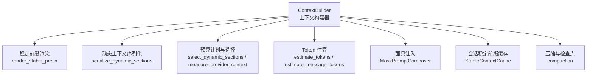
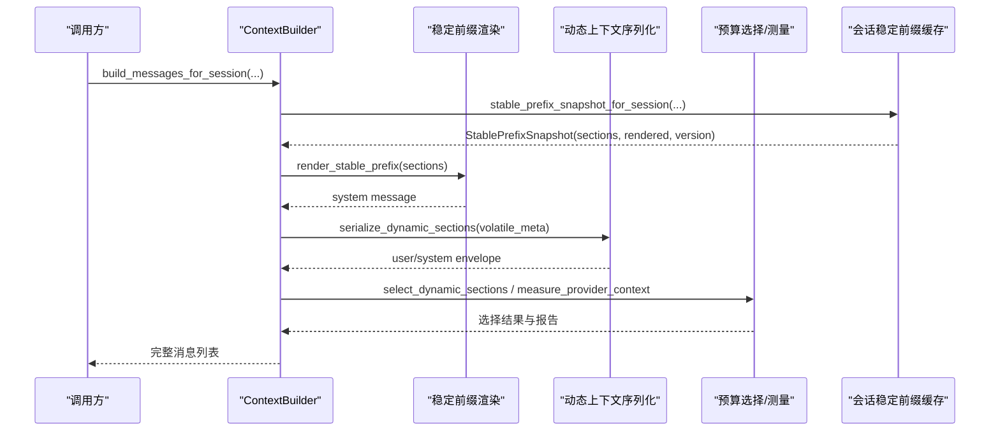
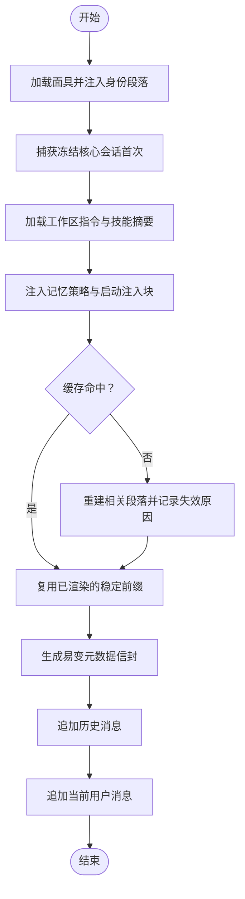
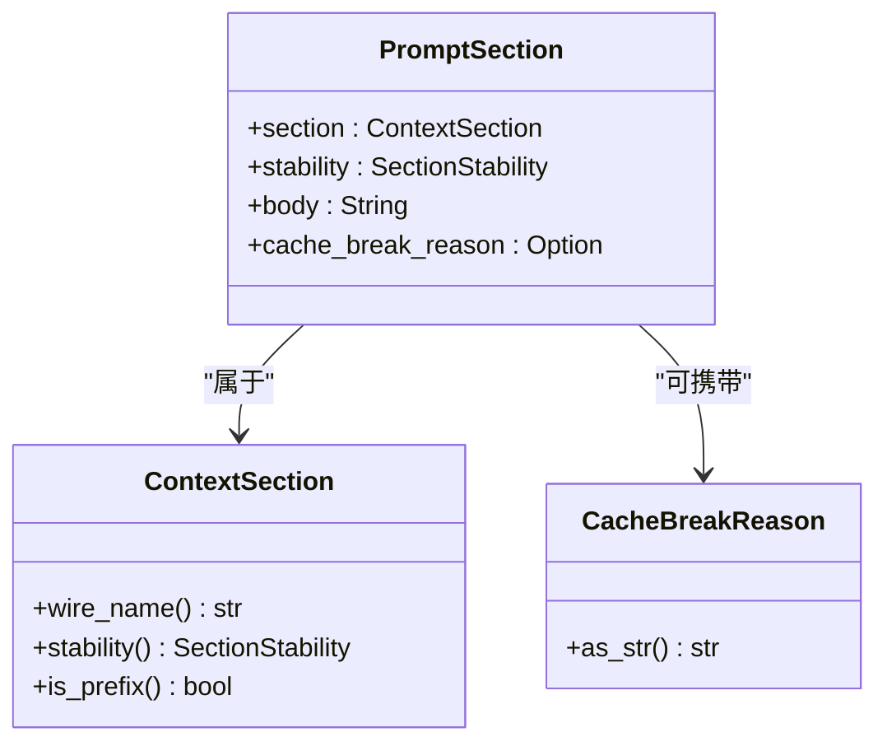
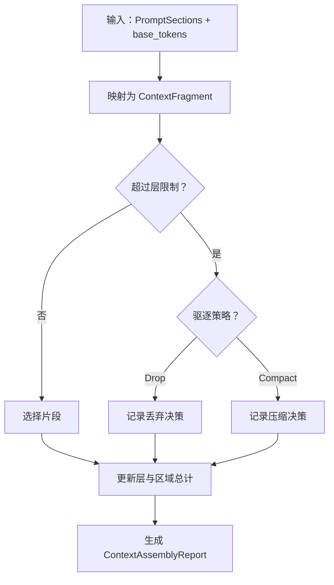
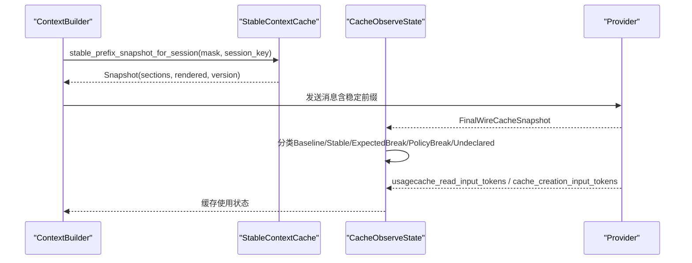
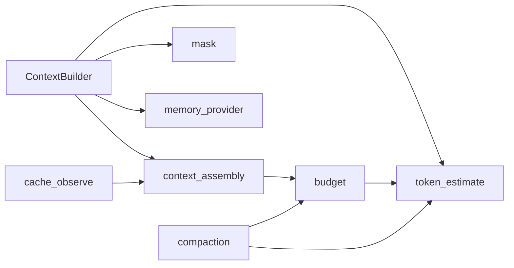

# 上下文组装

<cite>
**本文引用的文件**
- [agent-diva-agent/src/context.rs](file://agent-diva-agent/src/context.rs)
- [agent-diva-agent/src/context_assembly/mod.rs](file://agent-diva-agent/src/context_assembly/mod.rs)
- [agent-diva-agent/src/context_assembly/budget.rs](file://agent-diva-agent/src/context_assembly/budget.rs)
- [agent-diva-agent/src/context_assembly/section_cache.rs](file://agent-diva-agent/src/context_assembly/section_cache.rs)
- [agent-diva-agent/src/context_assembly/cache_observe.rs](file://agent-diva-agent/src/context_assembly/cache_observe.rs)
- [agent-diva-agent/src/context_budget.rs](file://agent-diva-agent/src/context_budget.rs)
- [agent-diva-agent/src/token_estimate.rs](file://agent-diva-agent/src/token_estimate.rs)
- [agent-diva-agent/src/mask/mask_prompt_composer.rs](file://agent-diva-agent/src/mask/mask_prompt_composer.rs)
- [agent-diva-agent/src/mask/mod.rs](file://agent-diva-agent/src/mask/mod.rs)
- [agent-diva-agent/src/compaction/mod.rs](file://agent-diva-agent/src/compaction/mod.rs)
</cite>

## 目录
1. [简介](#简介)
2. [项目结构](#项目结构)
3. [核心组件](#核心组件)
4. [架构总览](#架构总览)
5. [详细组件分析](#详细组件分析)
6. [依赖关系分析](#依赖关系分析)
7. [性能考量](#性能考量)
8. [故障排查指南](#故障排查指南)
9. [结论](#结论)
10. [附录](#附录)

## 简介
本文件面向“上下文组装系统”，聚焦提示词组装策略、上下文预算管理、缓存机制与性能优化。文档围绕 ContextBuilder 的工作流程展开，说明角色面具加载、技能信息集成、工作区上下文构建等步骤；并阐述上下文预算管理机制（token 计数、预算分配、压缩策略）以及上下文缓存的实现原理与优化手段。文末提供常见问题与解决方案，帮助读者快速定位问题并优化上下文组装性能。

## 项目结构
上下文组装由多个模块协作完成：
- 稳定前缀与动态后缀的契约定义与序列化：context_assembly
- 上下文预算规划与测量：context_assembly::budget、context_budget
- Token 估算：token_estimate
- 面具与身份注入：mask
- 会话级稳定前缀缓存：context::StableContextCache
- 压缩与检查点：compaction

图表来源
- [agent-diva-agent/src/context.rs:149-249](file://agent-diva-agent/src/context.rs#L149-L249)
- [agent-diva-agent/src/context_assembly/mod.rs:174-229](file://agent-diva-agent/src/context_assembly/mod.rs#L174-L229)
- [agent-diva-agent/src/context_assembly/budget.rs:230-285](file://agent-diva-agent/src/context_assembly/budget.rs#L230-L285)
- [agent-diva-agent/src/token_estimate.rs:20-81](file://agent-diva-agent/src/token_estimate.rs#L20-L81)
- [agent-diva-agent/src/mask/mask_prompt_composer.rs:12-33](file://agent-diva-agent/src/mask/mask_prompt_composer.rs#L12-L33)
- [agent-diva-agent/src/compaction/mod.rs:1-33](file://agent-diva-agent/src/compaction/mod.rs#L1-L33)

章节来源
- [agent-diva-agent/src/context.rs:149-249](file://agent-diva-agent/src/context.rs#L149-L249)
- [agent-diva-agent/src/context_assembly/mod.rs:174-229](file://agent-diva-agent/src/context_assembly/mod.rs#L174-L229)
- [agent-diva-agent/src/context_assembly/budget.rs:230-285](file://agent-diva-agent/src/context_assembly/budget.rs#L230-L285)
- [agent-diva-agent/src/token_estimate.rs:20-81](file://agent-diva-agent/src/token_estimate.rs#L20-L81)
- [agent-diva-agent/src/mask/mask_prompt_composer.rs:12-33](file://agent-diva-agent/src/mask/mask_prompt_composer.rs#L12-L33)
- [agent-diva-agent/src/compaction/mod.rs:1-33](file://agent-diva-agent/src/compaction/mod.rs#L1-L33)

## 核心组件
- ContextBuilder：负责按固定顺序组装稳定前缀与动态上下文，管理会话级缓存，生成最终消息列表。
- context_assembly：定义稳定的逻辑段（如 MaskAndIdentity、FrozenCore、AgentRulesAndSkills、MemoryPolicyAndIndex 等），并提供稳定前缀渲染与动态上下文序列化。
- budget：基于 BudgetConfig 构建层感知预算计划，对片段进行取舍与压缩决策，输出报告。
- token_estimate：提供字符到 token 的快速估算，用于预算监控与测量。
- mask：将面具内容注入到身份段落，支持默认面具不注入额外提示的策略。
- compaction：在历史过长时触发压缩，生成规范检查点以维持上下文窗口内运行。

章节来源
- [agent-diva-agent/src/context.rs:53-157](file://agent-diva-agent/src/context.rs#L53-L157)
- [agent-diva-agent/src/context_assembly/mod.rs:38-115](file://agent-diva-agent/src/context_assembly/mod.rs#L38-L115)
- [agent-diva-agent/src/context_assembly/budget.rs:13-117](file://agent-diva-agent/src/context_assembly/budget.rs#L13-L117)
- [agent-diva-agent/src/token_estimate.rs:20-81](file://agent-diva-agent/src/token_estimate.rs#L20-L81)
- [agent-diva-agent/src/mask/mask_prompt_composer.rs:12-33](file://agent-diva-agent/src/mask/mask_prompt_composer.rs#L12-L33)
- [agent-diva-agent/src/compaction/mod.rs:1-33](file://agent-diva-agent/src/compaction/mod.rs#L1-L33)

## 架构总览
上下文组装遵循“稳定前缀 + 动态后缀”的契约：
- 稳定前缀：包含面具与身份、冻结核心、代理规则与技能、记忆策略与索引等，适合缓存且顺序固定。
- 动态后缀：包含压缩摘要、历史、会话检查点、预取召回、易变元数据、计划守卫、当前用户等，按轮次变化。

图表来源
- [agent-diva-agent/src/context.rs:570-593](file://agent-diva-agent/src/context.rs#L570-L593)
- [agent-diva-agent/src/context_assembly/mod.rs:174-229](file://agent-diva-agent/src/context_assembly/mod.rs#L174-L229)
- [agent-diva-agent/src/context_assembly/budget.rs:230-285](file://agent-diva-agent/src/context_assembly/budget.rs#L230-L285)

## 详细组件分析

### ContextBuilder 工作流程
- 角色面具加载：通过 MaskPromptComposer 提取面具正文，仅在非默认面具且正文非空时注入到身份段落顶部。
- 技能信息集成：读取工作区指令（AGENTS.md）与技能目录，生成“活跃技能”和“可用技能摘要”。
- 工作区上下文构建：从 MemoryProvider 获取 L0 记忆策略与启动注入块，组合成记忆策略与索引段落。
- 稳定前缀缓存：按 session_key 维护 SessionStableCache，检测面具变更、记忆版本更新、技能 epoch 变化，按需重建段落并记录失效原因。
- 动态上下文：为每轮请求生成易变元数据（时间、渠道、会话 ID），并以信封形式追加到历史之后。
- 消息构建：首条 system 为稳定前缀渲染结果；可选插入规范检查点；随后是历史消息；最后是当前用户消息。

图表来源
- [agent-diva-agent/src/context.rs:149-249](file://agent-diva-agent/src/context.rs#L149-L249)
- [agent-diva-agent/src/context.rs:342-495](file://agent-diva-agent/src/context.rs#L342-L495)
- [agent-diva-agent/src/context.rs:570-593](file://agent-diva-agent/src/context.rs#L570-L593)
- [agent-diva-agent/src/mask/mask_prompt_composer.rs:12-33](file://agent-diva-agent/src/mask/mask_prompt_composer.rs#L12-L33)

章节来源
- [agent-diva-agent/src/context.rs:149-249](file://agent-diva-agent/src/context.rs#L149-L249)
- [agent-diva-agent/src/context.rs:342-495](file://agent-diva-agent/src/context.rs#L342-L495)
- [agent-diva-agent/src/context.rs:570-593](file://agent-diva-agent/src/context.rs#L570-L593)
- [agent-diva-agent/src/mask/mask_prompt_composer.rs:12-33](file://agent-diva-agent/src/mask/mask_prompt_composer.rs#L12-L33)

### 提示词组装策略
- 固定逻辑顺序：确保稳定段在前、易变段在后，避免破坏缓存前缀。
- 稳定性分类：每个段落声明稳定性（会话稳定或轮次易变），用于决定是否进入稳定前缀。
- 序列化约束：稳定前缀必须仅包含稳定段；动态上下文必须仅包含易变段，否则抛出装配错误。
- 边界转义：动态上下文使用自定义标签包裹，并对可能破坏边界的字符串进行转义。

图表来源
- [agent-diva-agent/src/context_assembly/mod.rs:117-142](file://agent-diva-agent/src/context_assembly/mod.rs#L117-L142)
- [agent-diva-agent/src/context_assembly/mod.rs:38-115](file://agent-diva-agent/src/context_assembly/mod.rs#L38-L115)
- [agent-diva-agent/src/context_assembly/section_cache.rs:5-28](file://agent-diva-agent/src/context_assembly/section_cache.rs#L5-L28)

章节来源
- [agent-diva-agent/src/context_assembly/mod.rs:117-142](file://agent-diva-agent/src/context_assembly/mod.rs#L117-L142)
- [agent-diva-agent/src/context_assembly/mod.rs:38-115](file://agent-diva-agent/src/context_assembly/mod.rs#L38-L115)
- [agent-diva-agent/src/context_assembly/section_cache.rs:5-28](file://agent-diva-agent/src/context_assembly/section_cache.rs#L5-L28)

### 上下文预算管理机制
- 配置与计划：BudgetConfig 定义最大 token、系统预算比例、压缩阈值比例与保留最近消息数；ContextBudgetPlan 将其映射为层与区域的软/硬限制。
- 片段评估：每个 PromptSection 被转换为 ContextFragment，标注区域、层、稳定性、优先级、估计 token 与驱逐策略。
- 选择与报告：select_dynamic_sections 根据层限制与总限制决定是否丢弃或压缩片段，并生成 ContextAssemblyReport。
- Provider 上下文测量：measure_provider_context 对消息与工具定义进行分层测量，区分核心与延迟工具 schema。
- 历史压缩：当历史接近阈值时触发压缩，生成规范检查点，减少后续上下文压力。

图表来源
- [agent-diva-agent/src/context_assembly/budget.rs:230-285](file://agent-diva-agent/src/context_assembly/budget.rs#L230-L285)
- [agent-diva-agent/src/context_assembly/budget.rs:287-367](file://agent-diva-agent/src/context_assembly/budget.rs#L287-L367)
- [agent-diva-agent/src/context_budget.rs:164-207](file://agent-diva-agent/src/context_budget.rs#L164-L207)

章节来源
- [agent-diva-agent/src/context_assembly/budget.rs:230-285](file://agent-diva-agent/src/context_assembly/budget.rs#L230-L285)
- [agent-diva-agent/src/context_assembly/budget.rs:287-367](file://agent-diva-agent/src/context_assembly/budget.rs#L287-L367)
- [agent-diva-agent/src/context_budget.rs:164-207](file://agent-diva-agent/src/context_budget.rs#L164-L207)

### 上下文缓存实现与优化
- 会话级稳定前缀缓存：StableContextCache 按 session_key 维护段落快照与渲染结果，检测面具、记忆版本、技能 epoch 变化，惰性重建并递增版本号。
- 失效原因追踪：段落可携带 CacheBreakReason，便于日志与观测。
- 提供者缓存观察：CacheObserveState 跟踪 provider 的最终线缓存快照，识别策略变更、预期失效与未声明的结构变更，并在调用后统计缓存使用情况。
- 工具锚点：core_tool_hash 与 apply_core_tool_cache_anchor 为核心工具集提供缓存锚点，避免延迟激活扰动核心缓存身份。

图表来源
- [agent-diva-agent/src/context.rs:159-249](file://agent-diva-agent/src/context.rs#L159-L249)
- [agent-diva-agent/src/context_assembly/cache_observe.rs:68-165](file://agent-diva-agent/src/context_assembly/cache_observe.rs#L68-L165)
- [agent-diva-agent/src/context_assembly/cache_observe.rs:207-226](file://agent-diva-agent/src/context_assembly/cache_observe.rs#L207-L226)

章节来源
- [agent-diva-agent/src/context.rs:159-249](file://agent-diva-agent/src/context.rs#L159-L249)
- [agent-diva-agent/src/context_assembly/cache_observe.rs:68-165](file://agent-diva-agent/src/context_assembly/cache_observe.rs#L68-L165)
- [agent-diva-agent/src/context_assembly/cache_observe.rs:207-226](file://agent-diva-agent/src/context_assembly/cache_observe.rs#L207-L226)

### 实际代码示例与最佳实践
- 自定义上下文构建逻辑：
  - 通过 ContextBuilder 的 with_skill_home 绑定技能发现路径，with_memory_provider 替换记忆提供者，with_persona_root 调整人格根路径。
  - 使用 build_system_prompt_for_session 与 build_prompt_sections_for_session 针对特定会话键构建稳定前缀。
  - 使用 build_volatile_meta_section_at 生成确定性易变元数据，便于测试与缓存稳定性验证。
- 优化上下文组装性能：
  - 利用稳定前缀缓存与失效原因追踪，减少重复渲染。
  - 合理设置 BudgetConfig，控制系统预算比例与压缩阈值，避免历史膨胀。
  - 使用 core_tool_hash 与 apply_core_tool_cache_anchor 稳定核心工具集缓存身份。
  - 在组装前后使用 measure_provider_context 与 ContextAssemblyReport 监控压力并采取动作。

章节来源
- [agent-diva-agent/src/context.rs:63-128](file://agent-diva-agent/src/context.rs#L63-L128)
- [agent-diva-agent/src/context.rs:149-249](file://agent-diva-agent/src/context.rs#L149-L249)
- [agent-diva-agent/src/context_assembly/budget.rs:119-193](file://agent-diva-agent/src/context_assembly/budget.rs#L119-L193)
- [agent-diva-agent/src/context_assembly/cache_observe.rs:207-226](file://agent-diva-agent/src/context_assembly/cache_observe.rs#L207-L226)

## 依赖关系分析
- ContextBuilder 依赖 context_assembly 的契约与序列化能力，依赖 token_estimate 进行估算，依赖 mask 注入身份，依赖 memory provider 获取策略与注入块。
- budget 模块依赖 token_estimate 与 provider Message/ToolDefinitionSet，用于测量与选择。
- cache_observe 依赖 provider 的最终线缓存快照与工具定义集，用于观察与分类。
- compaction 模块复用 token_estimate 与 context_budget，驱动历史压缩与检查点生成。

图表来源
- [agent-diva-agent/src/context.rs:1-24](file://agent-diva-agent/src/context.rs#L1-L24)
- [agent-diva-agent/src/context_assembly/mod.rs:1-25](file://agent-diva-agent/src/context_assembly/mod.rs#L1-L25)
- [agent-diva-agent/src/context_assembly/budget.rs:1-12](file://agent-diva-agent/src/context_assembly/budget.rs#L1-L12)
- [agent-diva-agent/src/context_assembly/cache_observe.rs:1-9](file://agent-diva-agent/src/context_assembly/cache_observe.rs#L1-L9)
- [agent-diva-agent/src/compaction/mod.rs:1-33](file://agent-diva-agent/src/compaction/mod.rs#L1-L33)

章节来源
- [agent-diva-agent/src/context.rs:1-24](file://agent-diva-agent/src/context.rs#L1-L24)
- [agent-diva-agent/src/context_assembly/mod.rs:1-25](file://agent-diva-agent/src/context_assembly/mod.rs#L1-L25)
- [agent-diva-agent/src/context_assembly/budget.rs:1-12](file://agent-diva-agent/src/context_assembly/budget.rs#L1-L12)
- [agent-diva-agent/src/context_assembly/cache_observe.rs:1-9](file://agent-diva-agent/src/context_assembly/cache_observe.rs#L1-L9)
- [agent-diva-agent/src/compaction/mod.rs:1-33](file://agent-diva-agent/src/compaction/mod.rs#L1-L33)

## 性能考量
- 稳定前缀缓存：按会话键维护段落快照与渲染结果，仅在面具、记忆版本、技能 epoch 变化时重建，显著降低重复计算。
- 预算与压缩：通过层与区域限制控制上下文大小，历史接近阈值时触发压缩，保持长对话稳定运行。
- 工具集缓存锚点：为核心工具集添加缓存控制标记，避免延迟激活影响核心缓存身份。
- 估算精度：采用 chars/4 × 4/3 启发式，近似 token 计数，误差可控且高效。

[本节为通用指导，无需具体文件引用]

## 故障排查指南
- 稳定前缀包含易变段：若稳定前缀中出现 TurnVolatile 段落，会抛出装配错误。检查段落稳定性声明与顺序。
- 动态上下文包含稳定段：动态序列化要求仅包含易变段，违反将报错。确认段落稳定性与传输方式。
- 提供者原生上下文块不支持：当尝试使用 NativeContextBlock 时会失败，需改用 MidConversationSystem 或 UserContextEnvelope。
- 缓存未命中或未生效：检查 CacheObserveState 的分类与 usage 统计，确认 provider 是否返回缓存计数器。
- 历史过长导致响应失败：查看 ContextAssemblyReport 的 dropped/compacted 数量与 total_estimated，必要时调整 BudgetConfig 或启用压缩。

章节来源
- [agent-diva-agent/src/context_assembly/mod.rs:144-170](file://agent-diva-agent/src/context_assembly/mod.rs#L144-L170)
- [agent-diva-agent/src/context_assembly/mod.rs:191-229](file://agent-diva-agent/src/context_assembly/mod.rs#L191-L229)
- [agent-diva-agent/src/context_assembly/cache_observe.rs:68-165](file://agent-diva-agent/src/context_assembly/cache_observe.rs#L68-L165)
- [agent-diva-agent/src/context_assembly/budget.rs:230-285](file://agent-diva-agent/src/context_assembly/budget.rs#L230-L285)

## 结论
上下文组装系统通过稳定前缀与动态后缀的契约化设计，结合层感知的预算管理与会话级缓存，实现了高效、可控的提示词组装。ContextBuilder 作为核心编排者，协调面具、技能、记忆与工作区上下文，确保在长对话中保持稳定与性能。通过缓存观察与压缩策略，系统能够在不同提供者环境下自适应地优化上下文使用。

[本节为总结性内容，无需具体文件引用]

## 附录
- 关键类型与常量：
  - ContextSection：逻辑段枚举，定义 wire_name、stability、is_prefix。
  - SectionStability：稳定性分类（Stable、SessionStable、TurnVolatile）。
  - ContextBudgetRegion：顶层区域（StablePrefix、CanonicalCheckpoint、ActiveTail）。
  - BudgetLayer：层感知预算桶（如 FrozenCoreAndRules、History、CurrentTurn 等）。
  - EvictionPolicy：驱逐策略（Never、Compact、Drop）。
  - AssemblyDecisionReason：决策原因（LayerSoftLimit、TotalHardLimit、MacroCompaction、Microcompact）。
- 配置项：
  - BudgetConfig：max_tokens、system_budget_ratio、compact_threshold_ratio、keep_recent_count。
- 参考路径：
  - 稳定前缀渲染：context_assembly::mod.rs
  - 动态上下文序列化：context_assembly::mod.rs
  - 预算计划与选择：context_assembly::budget.rs
  - Token 估算：token_estimate.rs
  - 面具注入：mask/mask_prompt_composer.rs
  - 压缩与检查点：compaction/mod.rs

[本节为补充信息，无需具体文件引用]