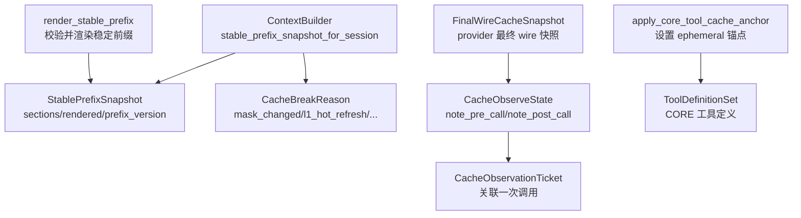
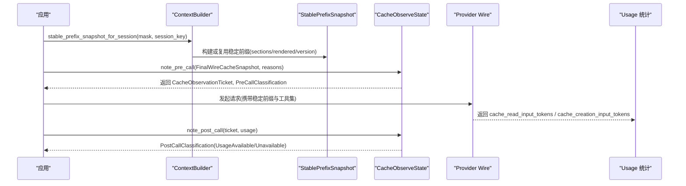
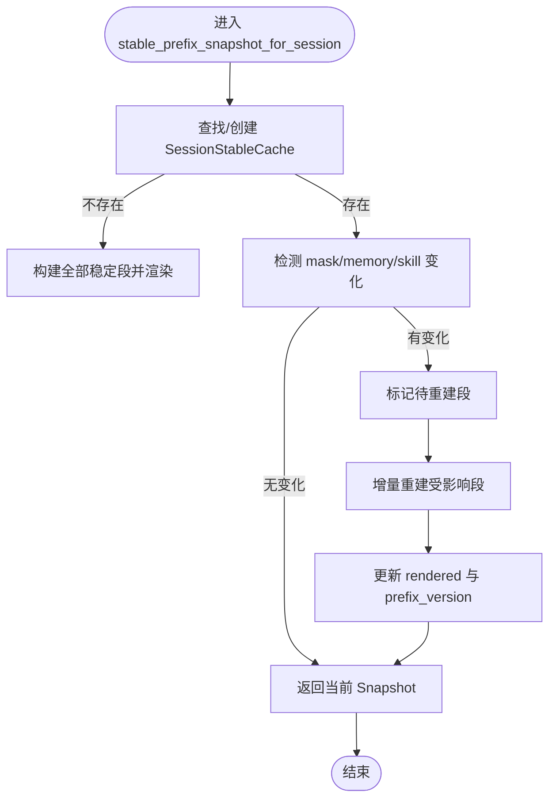
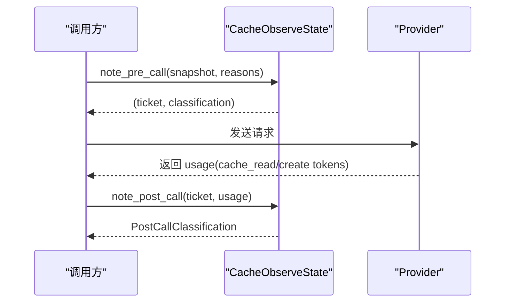
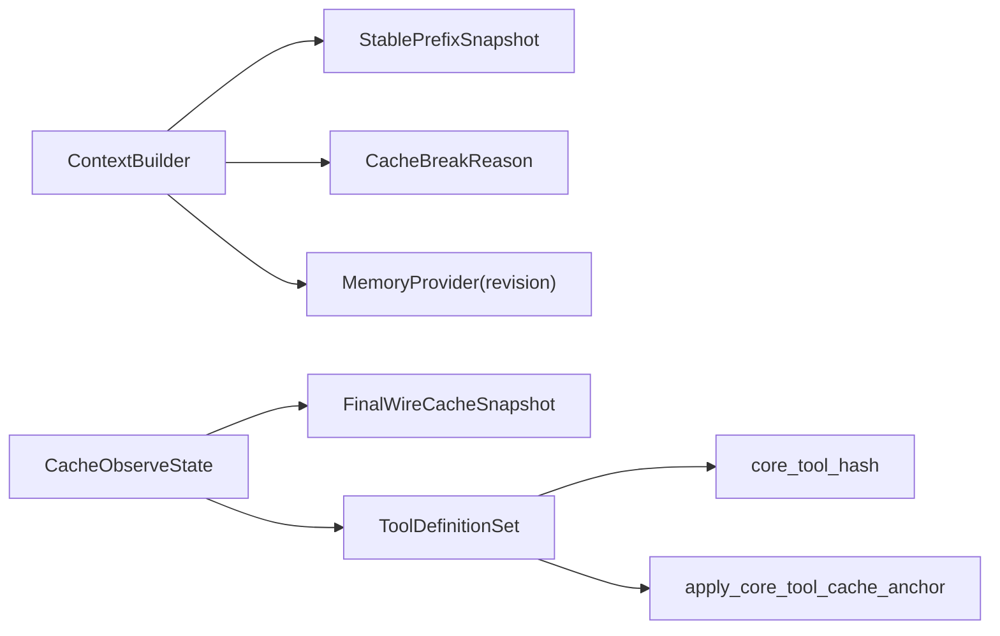

# 上下文缓存系统

<cite>
**本文引用的文件**
- [section_cache.rs](file://agent-diva-agent/src/context_assembly/section_cache.rs)
- [cache_observe.rs](file://agent-diva-agent/src/context_assembly/cache_observe.rs)
- [context.rs](file://agent-diva-agent/src/context.rs)
- [mod.rs](file://agent-diva-agent/src/context_assembly/mod.rs)
- [final_wire.rs](file://agent-diva-providers/src/final_wire.rs)
</cite>

## 目录
1. [简介](#简介)
2. [项目结构](#项目结构)
3. [核心组件](#核心组件)
4. [架构总览](#架构总览)
5. [详细组件分析](#详细组件分析)
6. [依赖关系分析](#依赖关系分析)
7. [性能考量](#性能考量)
8. [故障排查指南](#故障排查指南)
9. [结论](#结论)
10. [附录](#附录)

## 简介
本文件围绕“上下文缓存系统”展开，聚焦以下目标：
- 解释 StablePrefixSnapshot 的实现原理，包括稳定前缀快照的生成、存储与恢复机制。
- 详细说明 CacheBreakReason 的分类与作用，涵盖 L1HotRefresh、SessionReset 等失效原因的处理策略。
- 阐述 CacheObservationTicket 与 CacheObserveState 的工作流程，说明如何在调用前后进行缓存观察与分析。
- 解释 apply_core_tool_cache_anchor 的作用，包括核心工具缓存锚点的管理机制。
- 提供实际代码示例路径，展示如何使用缓存系统优化性能，包括缓存策略配置与监控指标收集。
- 包含缓存失效问题的诊断与解决方案。

## 项目结构
该缓存系统位于 agent-diva-agent 模块的 context 与 context_assembly 子模块中，并与 provider 层的 final wire 快照能力协作，形成“会话级稳定前缀缓存 + 调用级缓存观测”的双层体系：
- 会话级稳定前缀缓存：按 session_key 缓存四个稳定 PromptSection 及其渲染结果，维护单调递增的 prefix_version，并在 mask/memory/skills 变化时增量重建。
- 调用级缓存观测：在 provider 最终 wire 之前记录 stable system hash、core tools hash、active tool names 等关键指纹，并在调用后读取 provider 返回的真实 cache usage，用于命中统计与异常告警。

图表来源
- [context.rs:159-249](file://agent-diva-agent/src/context.rs#L159-L249)
- [section_cache.rs:6-56](file://agent-diva-agent/src/context_assembly/section_cache.rs#L6-L56)
- [cache_observe.rs:68-205](file://agent-diva-agent/src/context_assembly/cache_observe.rs#L68-L205)
- [final_wire.rs:40-48](file://agent-diva-providers/src/final_wire.rs#L40-L48)
- [mod.rs:174-183](file://agent-diva-agent/src/context_assembly/mod.rs#L174-L183)

章节来源
- [context.rs:159-249](file://agent-diva-agent/src/context.rs#L159-L249)
- [section_cache.rs:6-56](file://agent-diva-agent/src/context_assembly/section_cache.rs#L6-L56)
- [cache_observe.rs:68-205](file://agent-diva-agent/src/context_assembly/cache_observe.rs#L68-L205)
- [final_wire.rs:40-48](file://agent-diva-providers/src/final_wire.rs#L40-L48)
- [mod.rs:174-183](file://agent-diva-agent/src/context_assembly/mod.rs#L174-L183)

## 核心组件
- StablePrefixSnapshot：表示某会话当前稳定前缀的不可变视图，包含 sections、rendered 字符串以及单调递增的 prefix_version；支持汇总本次版本的重建原因（cache_break_reasons）。
- CacheBreakReason：声明式失效原因枚举，如 MaskChanged、L1HotRefresh、AgentRulesReload、SkillsReload、SessionReset、SessionEnded，提供稳定的 wire 字符串值，便于日志与观测。
- CacheObserveState / CacheObservationTicket：在每次 provider 调用前后记录并关联“最终 wire 快照”和“真实使用量”，实现调用级缓存命中/未命中的可观测性。
- apply_core_tool_cache_anchor：为 CORE 工具集最后一个工具注入 cache_control=ephemeral，作为 provider 侧的稳定锚点，避免动态 DEFERRED 工具影响 CORE 缓存身份。
- render_stable_prefix：对稳定前缀段进行顺序校验与渲染，确保稳定前缀不包含易变段，保证缓存键稳定。

章节来源
- [section_cache.rs:6-56](file://agent-diva-agent/src/context_assembly/section_cache.rs#L6-L56)
- [cache_observe.rs:10-24](file://agent-diva-agent/src/context_assembly/cache_observe.rs#L10-L24)
- [cache_observe.rs:61-205](file://agent-diva-agent/src/context_assembly/cache_observe.rs#L61-L205)
- [cache_observe.rs:207-226](file://agent-diva-agent/src/context_assembly/cache_observe.rs#L207-L226)
- [mod.rs:174-183](file://agent-diva-agent/src/context_assembly/mod.rs#L174-L183)

## 架构总览
整体流程分为两条主线：
- 会话级稳定前缀缓存：ContextBuilder 根据 session_key 维护每个会话的四个稳定 PromptSection 及其渲染结果，当 mask、memory revision、skills epoch 变化时，仅重建受影响的部分，并递增 prefix_version。
- 调用级缓存观测：在 provider 最终 wire 之前，通过 FinalWireCacheSnapshot 提取 stable_system_hash、core_tools_hash、active_tool_names 等指纹；调用结束后读取 provider 返回的 cache_read_input_tokens 与 cache_creation_input_tokens，完成命中统计与异常告警。

图表来源
- [context.rs:159-249](file://agent-diva-agent/src/context.rs#L159-L249)
- [cache_observe.rs:68-205](file://agent-diva-agent/src/context_assembly/cache_observe.rs#L68-L205)
- [final_wire.rs:40-48](file://agent-diva-providers/src/final_wire.rs#L40-L48)

## 详细组件分析

### StablePrefixSnapshot：生成、存储与恢复
- 生成：首次访问某 session_key 时，构建四个稳定 PromptSection（MaskAndIdentity、FrozenCore、AgentRulesAndSkills、MemoryPolicyAndIndex），渲染为唯一的前缀字符串，并初始化 prefix_version=1。
- 存储：以 SessionStableCache 形式保存在 ContextBuilder 内部，按 session_key 索引，缓存 sections、rendered、mask、memory_revision、skill_epoch、prefix_version 与 pending_invalidations。
- 恢复与增量更新：后续访问时，若 mask/memory revision/skill epoch 发生变化，将对应 section 标记为待重建，仅重建受影响部分，合并后重新渲染并递增 prefix_version。
- 失效传播：reset_session_cache 会将所有稳定段标记为 SessionReset；end_session_cache 会释放会话缓存；clear_session_caches 清空全部会话缓存。

图表来源
- [context.rs:159-249](file://agent-diva-agent/src/context.rs#L159-L249)
- [context.rs:288-325](file://agent-diva-agent/src/context.rs#L288-L325)

章节来源
- [context.rs:159-249](file://agent-diva-agent/src/context.rs#L159-L249)
- [context.rs:288-325](file://agent-diva-agent/src/context.rs#L288-L325)
- [section_cache.rs:36-56](file://agent-diva-agent/src/context_assembly/section_cache.rs#L36-L56)

### CacheBreakReason：分类与处理策略
- 分类：MaskChanged、L1HotRefresh、AgentRulesReload、SkillsReload、SessionReset、SessionEnded。每种原因提供稳定的 wire 字符串值，便于日志与观测。
- 作用：在稳定前缀重建时，将原因附加到对应 PromptSection 上；StablePrefixSnapshot::cache_break_reasons 汇总本次版本的所有原因，供上层决策与监控。
- 处理策略：
  - MaskChanged：仅刷新 MaskAndIdentity 段。
  - L1HotRefresh：由 memory provider 的 revision 变化触发，仅刷新 MemoryPolicyAndIndex 段。
  - AgentRulesReload/SkillsReload：刷新 AgentRulesAndSkills 段。
  - SessionReset：重置所有稳定段，统一标记为 SessionReset。
  - SessionEnded：释放会话缓存。

章节来源
- [section_cache.rs:6-28](file://agent-diva-agent/src/context_assembly/section_cache.rs#L6-L28)
- [context.rs:199-217](file://agent-diva-agent/src/context.rs#L199-L217)
- [context.rs:288-307](file://agent-diva-agent/src/context.rs#L288-L307)

### CacheObservationTicket 与 CacheObserveState：调用前后观察流程
- 调用前（note_pre_call）：
  - 从 FinalWireCacheSnapshot 提取 provider_namespace、model、policy、stable_system_hash、core_tools_hash、active_tool_names。
  - 基于上次 bucket 状态判断是否发生 policy 变更、system/tools/active tools 变更，并结合 declared break reasons 与 expected_deletion 进行分类：Baseline、Stable、ExpectedBreak、PolicyBreak、UndeclaredStructuralBreak、Unavailable。
  - 记录 pending observation，返回 CacheObservationTicket。
- 调用后（note_post_call）：
  - 根据 usage map 中的 cache_read_input_tokens 与 cache_creation_input_tokens 判断是否可用，返回 UsageAvailable/UsageUnavailable。
  - 清理 pending observation。
- 生命周期管理：clear_session 与 clear 支持会话与全局清理。

图表来源
- [cache_observe.rs:68-205](file://agent-diva-agent/src/context_assembly/cache_observe.rs#L68-L205)

章节来源
- [cache_observe.rs:68-205](file://agent-diva-agent/src/context_assembly/cache_observe.rs#L68-L205)

### apply_core_tool_cache_anchor：核心工具缓存锚点管理
- 目的：为 CORE 工具集最后一个工具注入 cache_control=ephemeral，使 provider 侧将该工具视为“临时”内容，从而稳定 CORE 前缀的缓存身份，避免动态 DEFERRED 工具影响 CORE 缓存键。
- 行为：仅在 profile 启用且 core_count>0 时生效；修改 ToolDefinitionSet 中最后一个工具的 JSON 字段。
- 配合：core_tool_hash 仅对 core_count 范围内的工具定义计算哈希，确保 deferred 工具不影响 CORE 前缀身份。

章节来源
- [cache_observe.rs:207-226](file://agent-diva-agent/src/context_assembly/cache_observe.rs#L207-L226)

### 稳定前缀渲染与校验：render_stable_prefix
- 职责：对稳定前缀段进行顺序校验，确保不包含 TurnVolatile 或非 prefix 段，然后渲染为唯一字符串。
- 意义：保证稳定前缀的稳定性与一致性，是缓存键的基础。

章节来源
- [mod.rs:174-183](file://agent-diva-agent/src/context_assembly/mod.rs#L174-L183)

## 依赖关系分析
- ContextBuilder 依赖：
  - PromptSection 与 ContextSection：定义稳定段的类型与顺序。
  - CacheBreakReason：标注重建原因。
  - MemoryProvider：提供 revision 以驱动 L1HotRefresh。
- Provider 层依赖：
  - FinalWireCacheSnapshot：由 provider 最终 wire 生成，包含 stable_system_hash、core_tools_hash、active_tool_names 等关键指纹。
- 观测层依赖：
  - CacheObserveState：维护会话与 bucket 状态，记录 pre/post call 信息。
  - ToolDefinitionSet：用于 core_tool_hash 与 apply_core_tool_cache_anchor。

图表来源
- [context.rs:159-249](file://agent-diva-agent/src/context.rs#L159-L249)
- [cache_observe.rs:68-226](file://agent-diva-agent/src/context_assembly/cache_observe.rs#L68-L226)
- [final_wire.rs:40-48](file://agent-diva-providers/src/final_wire.rs#L40-L48)

章节来源
- [context.rs:159-249](file://agent-diva-agent/src/context.rs#L159-L249)
- [cache_observe.rs:68-226](file://agent-diva-agent/src/context_assembly/cache_observe.rs#L68-L226)
- [final_wire.rs:40-48](file://agent-diva-providers/src/final_wire.rs#L40-L48)

## 性能考量
- 会话级缓存：按 session_key 缓存稳定前缀，避免重复构建与渲染；增量重建仅针对变化的段，减少 I/O 与 CPU 开销。
- 稳定前缀键：通过 render_stable_prefix 与 core_tool_hash 保证键稳定，提高缓存命中率。
- 调用级观测：利用 provider 返回的真实 cache usage 统计命中情况，避免推测式命中带来的偏差。
- 锚点机制：apply_core_tool_cache_anchor 将 CORE 工具设为 ephemeral，降低动态工具对缓存键的影响，提升稳定性。

[本节为通用指导，不直接分析具体文件]

## 故障排查指南
- 未声明的结构变化：
  - 现象：PreCallClassification 为 UndeclaredStructuralBreak，日志提示“prompt cache final-wire structure changed without a declared reason”。
  - 排查：检查 stable_system_hash 或 core_tools_hash 是否意外变化；确认 deferred 工具未污染 CORE 前缀；核对 CacheBreakReason 是否正确标注。
- 策略变更导致失效：
  - 现象：PreCallClassification 为 PolicyBreak。
  - 排查：确认 provider namespace/model/policy 是否变化；必要时重建会话缓存。
- 无法获取 usage：
  - 现象：PostCallClassification 为 UsageUnavailable。
  - 排查：确认 provider 返回了 cache_read_input_tokens 或 cache_creation_input_tokens；检查 ticket 是否被正确传递与清理。
- 会话重置与结束：
  - 现象：prefix_version 重置或缓存被释放。
  - 排查：确认 reset_session_cache 与 end_session_cache 的调用时机是否符合预期。

章节来源
- [cache_observe.rs:115-153](file://agent-diva-agent/src/context_assembly/cache_observe.rs#L115-L153)
- [cache_observe.rs:167-205](file://agent-diva-agent/src/context_assembly/cache_observe.rs#L167-L205)
- [context.rs:288-325](file://agent-diva-agent/src/context.rs#L288-L325)

## 结论
该上下文缓存系统通过“会话级稳定前缀缓存 + 调用级缓存观测”的组合，实现了高效、稳定且可观测的缓存机制：
- 稳定前缀缓存确保相同会话在无明显变化时可复用已构建的上下文，显著降低构建成本。
- 调用级观测基于 provider 最终 wire 的真实使用量，提供准确的命中统计与异常告警。
- 通过 CacheBreakReason 的声明式失效与 apply_core_tool_cache_anchor 的锚点机制，系统在动态工具挂载与策略变更场景下仍保持高命中率与稳定性。

[本节为总结，不直接分析具体文件]

## 附录
- 使用示例路径（不含代码内容）：
  - 构建稳定前缀快照：[context.rs:159-249](file://agent-diva-agent/src/context.rs#L159-L249)
  - 标记失效原因并重建：[context.rs:199-217](file://agent-diva-agent/src/context.rs#L199-L217)
  - 调用前观察：[cache_observe.rs:68-165](file://agent-diva-agent/src/context_assembly/cache_observe.rs#L68-L165)
  - 调用后观察：[cache_observe.rs:167-205](file://agent-diva-agent/src/context_assembly/cache_observe.rs#L167-L205)
  - 核心工具锚点：[cache_observe.rs:207-226](file://agent-diva-agent/src/context_assembly/cache_observe.rs#L207-L226)
  - 稳定前缀渲染校验：[mod.rs:174-183](file://agent-diva-agent/src/context_assembly/mod.rs#L174-L183)
  - Provider 最终 wire 快照：[final_wire.rs:40-48](file://agent-diva-providers/src/final_wire.rs#L40-L48)

[本节为参考路径，不直接分析具体文件]