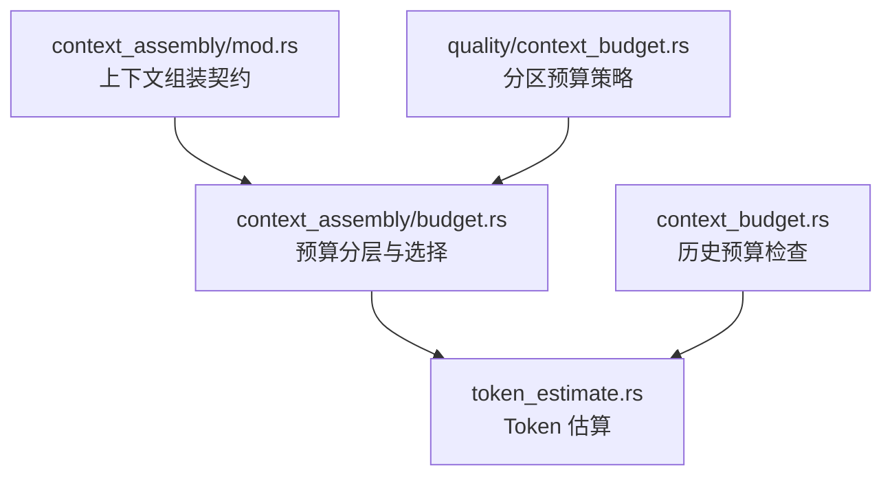
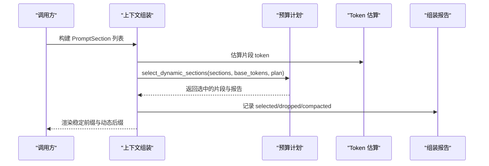
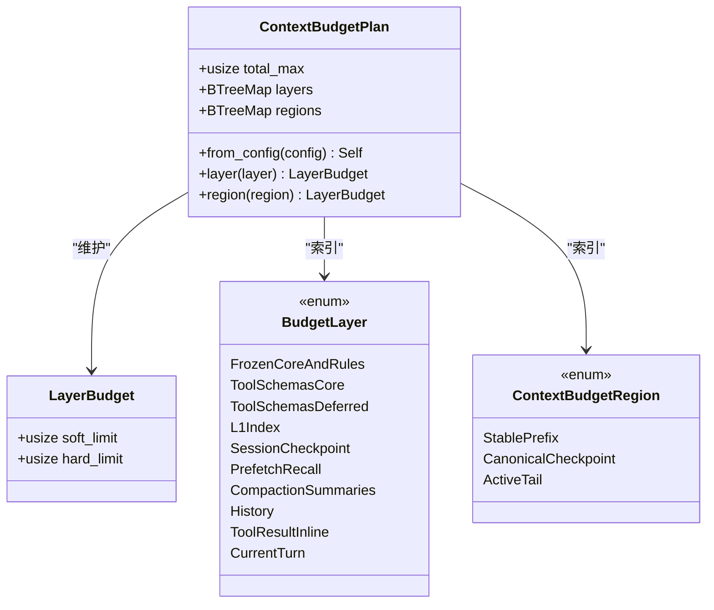
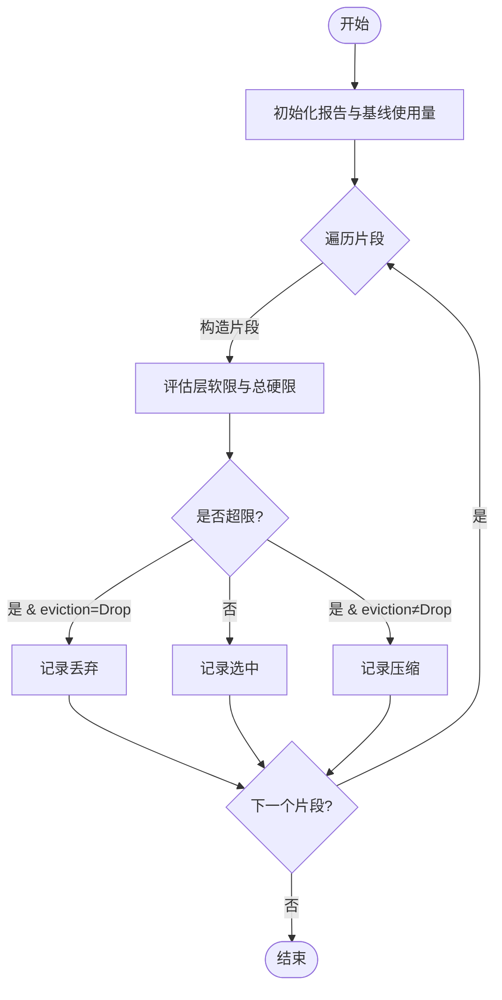
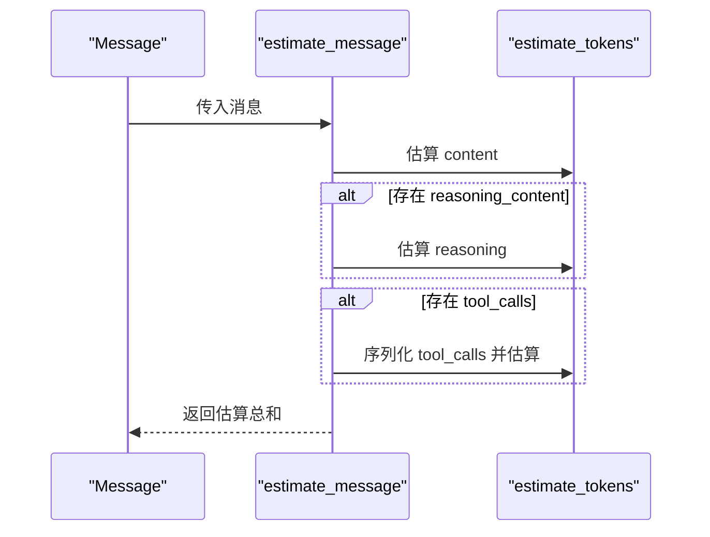
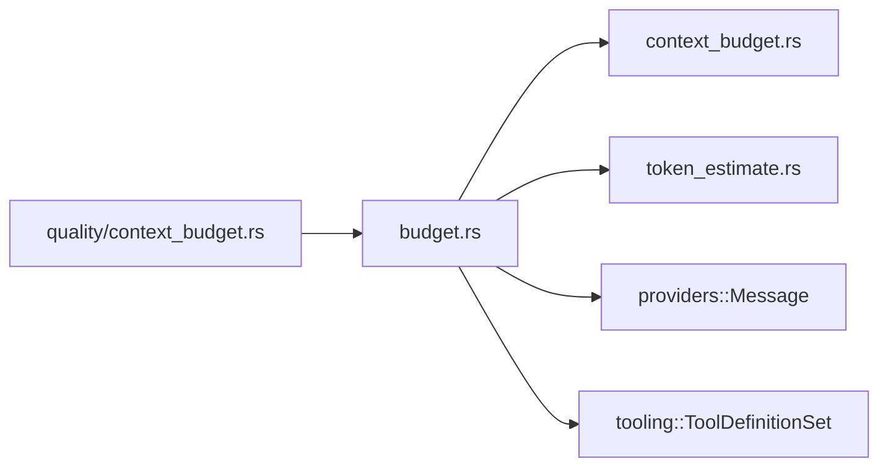

# 上下文预算管理

<cite>
**本文引用的文件**
- [agent-diva-agent/src/context_assembly/budget.rs](file://agent-diva-agent/src/context_assembly/budget.rs)
- [agent-diva-agent/src/context_budget.rs](file://agent-diva-agent/src/context_budget.rs)
- [agent-diva-core/src/quality/context_budget.rs](file://agent-diva-core/src/quality/context_budget.rs)
- [agent-diva-agent/src/token_estimate.rs](file://agent-diva-agent/src/token_estimate.rs)
- [agent-diva-agent/src/context_assembly/mod.rs](file://agent-diva-agent/src/context_assembly/mod.rs)
</cite>

## 目录
1. [简介](#简介)
2. [项目结构](#项目结构)
3. [核心组件](#核心组件)
4. [架构总览](#架构总览)
5. [详细组件分析](#详细组件分析)
6. [依赖关系分析](#依赖关系分析)
7. [性能考量](#性能考量)
8. [故障排查指南](#故障排查指南)
9. [结论](#结论)
10. [附录：配置与优化示例](#附录：配置与优化示例)

## 简介
本文件系统性阐述 Agent 的上下文预算管理体系，重点覆盖以下主题：
- ContextBudgetPlan 的设计原理：预算分层、区域划分、碎片管理与驱逐策略。
- estimate_messages 的实现机制：消息估算策略与动态部分选择算法。
- BudgetLayer 与 LayerBudget 的工作方式：为不同层级上下文内容分配 token 预算。
- EvictionPolicy 的驱逐策略：Never、Compact、Drop 的应用场景与取舍。
- 实际配置与优化建议：如何自定义预算策略、调优阈值与监控指标。
- 常见问题排查：预算超限、压缩触发、缓存命中异常等问题的定位方法。

该体系在保证系统提示、会话检查点、工具定义等关键内容不被丢弃的前提下，对历史消息、召回片段、工具结果等动态内容进行精细化预算控制，从而在长对话中维持稳定的上下文质量与成本。

## 项目结构
上下文预算相关代码主要分布在 agent-diva-agent 与 agent-diva-core 两个 crate：
- agent-diva-agent/src/context_assembly/budget.rs：实现类型化预算分层、区域划分、动态选择与报告统计。
- agent-diva-agent/src/context_budget.rs：提供基于历史消息的预算检查与压缩决策（兼容旧路径）。
- agent-diva-core/src/quality/context_budget.rs：定义按“上下文分区”的预算策略与溢出处理动作。
- agent-diva-agent/src/token_estimate.rs：提供快速 token 估算器，用于消息与文本的近似计数。
- agent-diva-agent/src/context_assembly/mod.rs：定义上下文组装契约、稳定前缀与动态后缀的序列化规则。

图表来源
- [agent-diva-agent/src/context_assembly/mod.rs:1-120](file://agent-diva-agent/src/context_assembly/mod.rs#L1-L120)
- [agent-diva-agent/src/context_assembly/budget.rs:1-120](file://agent-diva-agent/src/context_assembly/budget.rs#L1-L120)
- [agent-diva-agent/src/token_estimate.rs:1-80](file://agent-diva-agent/src/token_estimate.rs#L1-L80)
- [agent-diva-agent/src/context_budget.rs:1-120](file://agent-diva-agent/src/context_budget.rs#L1-L120)
- [agent-diva-core/src/quality/context_budget.rs:1-60](file://agent-diva-core/src/quality/context_budget.rs#L1-L60)

章节来源
- [agent-diva-agent/src/context_assembly/mod.rs:1-120](file://agent-diva-agent/src/context_assembly/mod.rs#L1-L120)
- [agent-diva-agent/src/context_assembly/budget.rs:1-120](file://agent-diva-agent/src/context_assembly/budget.rs#L1-L120)
- [agent-diva-agent/src/context_budget.rs:1-120](file://agent-diva-agent/src/context_budget.rs#L1-L120)
- [agent-diva-core/src/quality/context_budget.rs:1-60](file://agent-diva-core/src/quality/context_budget.rs#L1-L60)
- [agent-diva-agent/src/token_estimate.rs:1-80](file://agent-diva-agent/src/token_estimate.rs#L1-L80)

## 核心组件
- ContextBudgetPlan：从 BudgetConfig 派生出的预算计划，包含 total_max、各层预算（layers）与区域预算（regions）。
- BudgetLayer：将上下文划分为多个独立预算桶，如 FrozenCoreAndRules、ToolSchemasCore/Deferred、L1Index、SessionCheckpoint、PrefetchRecall、CompactionSummaries、History、ToolResultInline、CurrentTurn。
- ContextBudgetRegion：将上下文划分为三个顶级区域：StablePrefix（稳定前缀）、CanonicalCheckpoint（规范检查点）、ActiveTail（活动尾部）。
- LayerBudget：每层的软限制（soft_limit）与硬限制（hard_limit），用于控制单层占用与整体上限。
- ContextFragment：带类型的上下文片段，携带 id、region、section、layer、stability、priority、token_estimate、eviction。
- EvictionPolicy：驱逐策略 Never（永不驱逐）、Compact（压缩）、Drop（丢弃）。
- ContextAssemblyReport：记录选中、丢弃、压缩的片段以及按层与区域的总计估计值。
- OverflowAction：当某分区超出预算时的动作：Warn、Truncate、Block、Consolidate。

章节来源
- [agent-diva-agent/src/context_assembly/budget.rs:13-117](file://agent-diva-agent/src/context_assembly/budget.rs#L13-L117)
- [agent-diva-agent/src/context_assembly/budget.rs:195-228](file://agent-diva-agent/src/context_assembly/budget.rs#L195-L228)
- [agent-diva-core/src/quality/context_budget.rs:8-56](file://agent-diva-core/src/quality/context_budget.rs#L8-L56)

## 架构总览
上下文组装由“稳定前缀 + 动态后缀”构成：
- 稳定前缀：包含 MaskAndIdentity、FrozenCore、AgentRulesAndSkills、MemoryPolicyAndIndex 等，属于 SessionStable，可参与 prompt 缓存。
- 动态后缀：包含 History、SessionCheckpoint、PrefetchRecall、VolatileMeta、PlanGuard、CurrentUser 等，属于 TurnVolatile，每次调用可能变化。

预算系统在组装过程中对每个片段进行分层与分区域度量，依据层软限与总硬限决定是否保留、压缩或丢弃。

图表来源
- [agent-diva-agent/src/context_assembly/mod.rs:174-220](file://agent-diva-agent/src/context_assembly/mod.rs#L174-L220)
- [agent-diva-agent/src/context_assembly/budget.rs:230-285](file://agent-diva-agent/src/context_assembly/budget.rs#L230-L285)
- [agent-diva-agent/src/token_estimate.rs:39-81](file://agent-diva-agent/src/token_estimate.rs#L39-L81)

章节来源
- [agent-diva-agent/src/context_assembly/mod.rs:174-220](file://agent-diva-agent/src/context_assembly/mod.rs#L174-L220)
- [agent-diva-agent/src/context_assembly/budget.rs:230-285](file://agent-diva-agent/src/context_assembly/budget.rs#L230-L285)
- [agent-diva-agent/src/token_estimate.rs:39-81](file://agent-diva-agent/src/token_estimate.rs#L39-L81)

## 详细组件分析

### ContextBudgetPlan：预算分层与区域划分
- 从 BudgetConfig 计算 total_max，并基于比例分配各层预算：
  - FrozenCoreAndRules：system_budget_ratio（例如 15%）
  - ToolSchemasCore/Deferred：分别为约 12%/3%
  - L1Index：约 4%-6%
  - SessionCheckpoint：约 3%-4%
  - PrefetchRecall：约 3%-4%
  - CompactionSummaries：约 8%-10%
  - History：约 55%-80%
  - ToolResultInline：约 8%-12%
  - CurrentTurn：等于 total_max（当前轮次优先保证）
- 区域预算：
  - StablePrefix：system_budget_ratio
  - CanonicalCheckpoint：约 10%
  - ActiveTail：total_max - stable_prefix

图表来源
- [agent-diva-agent/src/context_assembly/budget.rs:111-193](file://agent-diva-agent/src/context_assembly/budget.rs#L111-L193)

章节来源
- [agent-diva-agent/src/context_assembly/budget.rs:111-193](file://agent-diva-agent/src/context_assembly/budget.rs#L111-L193)

### 动态部分选择算法：select_dynamic_sections
- 输入：sections、base_tokens（历史基线）、plan。
- 流程：
  - 初始化报告，记录 base_tokens 作为 History 层与 ActiveTail 区域的使用量。
  - 遍历 sections，构造 ContextFragment，评估是否超过层软限或总硬限。
  - 若 eviction=Drop 且超限，则记录 dropped；否则记录 selected。
  - 返回选中的片段与报告。
- 关键点：
  - 必需的工作记忆与计划约束会被保留。
  - 召回（PrefetchRecall）是压力下的首个可选片段被移除。

图表来源
- [agent-diva-agent/src/context_assembly/budget.rs:230-285](file://agent-diva-agent/src/context_assembly/budget.rs#L230-L285)

章节来源
- [agent-diva-agent/src/context_assembly/budget.rs:230-285](file://agent-diva-agent/src/context_assembly/budget.rs#L230-L285)

### estimate_messages：消息估算策略
- 对每条 Message 估算 token：
  - content 文本：estimate_tokens(content.to_text_lossy())
  - reasoning_content：若有，累加其 token
  - tool_calls：序列化为 JSON 字符串后估算 token
- estimate_messages(messages)：对所有消息估算求和。

图表来源
- [agent-diva-agent/src/context_assembly/budget.rs:417-428](file://agent-diva-agent/src/context_assembly/budget.rs#L417-L428)
- [agent-diva-agent/src/token_estimate.rs:39-81](file://agent-diva-agent/src/token_estimate.rs#L39-L81)

章节来源
- [agent-diva-agent/src/context_assembly/budget.rs:417-428](file://agent-diva-agent/src/context_assembly/budget.rs#L417-L428)
- [agent-diva-agent/src/token_estimate.rs:39-81](file://agent-diva-agent/src/token_estimate.rs#L39-L81)

### BudgetLayer 与 LayerBudget：层级预算分配
- 各层预算通过比例计算，确保关键层（如 CurrentTurn、FrozenCoreAndRules）有足够空间。
- 层软限用于渐进式控制，硬限用于绝对上限保护。
- 工具定义分为 Core 与 Deferred，分别进入不同层，前者优先级更高且不可丢弃。

章节来源
- [agent-diva-agent/src/context_assembly/budget.rs:120-178](file://agent-diva-agent/src/context_assembly/budget.rs#L120-L178)
- [agent-diva-agent/src/context_assembly/budget.rs:340-365](file://agent-diva-agent/src/context_assembly/budget.rs#L340-L365)

### EvictionPolicy：驱逐策略
- Never：永不驱逐，适用于系统提示、会话检查点、当前用户等关键内容。
- Compact：压缩，适用于历史、压缩摘要、元数据等可缩减的内容。
- Drop：丢弃，适用于召回、延迟工具定义等可牺牲的可选内容。

章节来源
- [agent-diva-agent/src/context_assembly/budget.rs:63-78](file://agent-diva-agent/src/context_assembly/budget.rs#L63-L78)
- [agent-diva-agent/src/context_assembly/budget.rs:373-415](file://agent-diva-agent/src/context_assembly/budget.rs#L373-L415)

### 上下文组装契约：稳定前缀与动态后缀
- 稳定前缀：MaskAndIdentity、FrozenCore、AgentRulesAndSkills、MemoryPolicyAndIndex，属于 SessionStable，可缓存。
- 动态后缀：History、SessionCheckpoint、PrefetchRecall、VolatileMeta、PlanGuard、CurrentUser，属于 TurnVolatile，每次调用可能变化。
- 错误校验：稳定前缀不能包含 TurnVolatile 片段；动态后缀不能包含 SessionStable 片段。

章节来源
- [agent-diva-agent/src/context_assembly/mod.rs:26-115](file://agent-diva-agent/src/context_assembly/mod.rs#L26-L115)
- [agent-diva-agent/src/context_assembly/mod.rs:174-220](file://agent-diva-agent/src/context_assembly/mod.rs#L174-L220)

## 依赖关系分析
- context_assembly/budget.rs 依赖：
  - context_budget::BudgetConfig：预算配置来源。
  - token_estimate::estimate_tokens：token 估算。
  - providers::Message：消息类型。
  - tooling::ToolDefinitionSet：工具定义集合。
- context_budget.rs 依赖：
  - core::session::ChatMessage：历史消息。
  - token_estimate：估算历史与检查点 token。
- quality/context_budget.rs 提供分区预算策略，供上层质量模块使用。

图表来源
- [agent-diva-agent/src/context_assembly/budget.rs:1-12](file://agent-diva-agent/src/context_assembly/budget.rs#L1-L12)
- [agent-diva-agent/src/context_budget.rs:21-24](file://agent-diva-agent/src/context_budget.rs#L21-L24)
- [agent-diva-core/src/quality/context_budget.rs:1-6](file://agent-diva-core/src/quality/context_budget.rs#L1-L6)

章节来源
- [agent-diva-agent/src/context_assembly/budget.rs:1-12](file://agent-diva-agent/src/context_assembly/budget.rs#L1-L12)
- [agent-diva-agent/src/context_budget.rs:21-24](file://agent-diva-agent/src/context_budget.rs#L21-L24)
- [agent-diva-core/src/quality/context_budget.rs:1-6](file://agent-diva-core/src/quality/context_budget.rs#L1-L6)

## 性能考量
- Token 估算采用 chars/4 × 4/3 启发式，等价于 chars/3，速度快且误差 ≤10%，适合高频估算。
- 动态选择算法 O(n)，逐段评估层软限与总硬限，避免全局排序开销。
- 工具定义区分 Core 与 Deferred，减少非必要工具的 token 占用。
- 稳定前缀可缓存，降低重复调用成本。

[本节提供通用指导，不直接分析具体文件]

## 故障排查指南
- 预算超限：
  - 检查 ContextAssemblyReport 的 dropped 与 compacted 列表，确认触发原因是 LayerSoftLimit 还是 TotalHardLimit。
  - 调整 BudgetConfig.system_budget_ratio 或 compact_threshold_ratio，以改变历史预算与压缩阈值。
- 召回被丢弃：
  - 确认 PrefetchRecall 层预算与 eviction=Drop 的行为，必要时提高层预算或降低其他层占用。
- 工具定义过多：
  - 减少 ToolSchemasDeferred 的数量或提高 core_count，使更多工具进入高优先级层。
- 缓存命中异常：
  - 检查稳定前缀是否混入 TurnVolatile 片段，导致缓存失效。
  - 关注 CacheBreakReason，识别 L1 热刷新等变更原因。

章节来源
- [agent-diva-agent/src/context_assembly/budget.rs:230-285](file://agent-diva-agent/src/context_assembly/budget.rs#L230-L285)
- [agent-diva-agent/src/context_assembly/mod.rs:174-220](file://agent-diva-agent/src/context_assembly/mod.rs#L174-L220)

## 结论
上下文预算管理系统通过类型化的分层与区域划分，结合动态选择与驱逐策略，在保证关键内容不被丢弃的前提下，灵活控制历史、召回、工具结果等动态内容的 token 占用。配合快速 token 估算与稳定前缀缓存，可在长对话中维持高质量上下文与可控成本。通过合理配置 BudgetConfig 与 OverflowAction，可针对不同模型与工作负载进行定制化调优。

[本节总结性内容，不直接分析具体文件]

## 附录：配置与优化示例
- 基础配置：
  - max_tokens：根据模型上下文窗口设置，支持环境变量覆盖。
  - system_budget_ratio：预留系统提示与技能的空间，默认 15%。
  - compact_threshold_ratio：历史预算达到 80% 时触发压缩。
  - keep_recent_count：始终保留最近 N 条消息。
- 自定义预算策略：
  - 调整各层比例，如提高 History 层占比以容纳更长对话。
  - 对工具定义设置 core_count，提升核心工具优先级。
- 性能调优技巧：
  - 减少工具定义数量，仅保留必要工具。
  - 使用稳定前缀缓存，避免频繁变更系统提示。
  - 监控 ContextAssemblyReport，分析 dropped/compacted 的原因与频率。

章节来源
- [agent-diva-agent/src/context_budget.rs:25-112](file://agent-diva-agent/src/context_budget.rs#L25-L112)
- [agent-diva-agent/src/context_assembly/budget.rs:120-178](file://agent-diva-agent/src/context_assembly/budget.rs#L120-L178)
- [agent-diva-core/src/quality/context_budget.rs:22-56](file://agent-diva-core/src/quality/context_budget.rs#L22-L56)