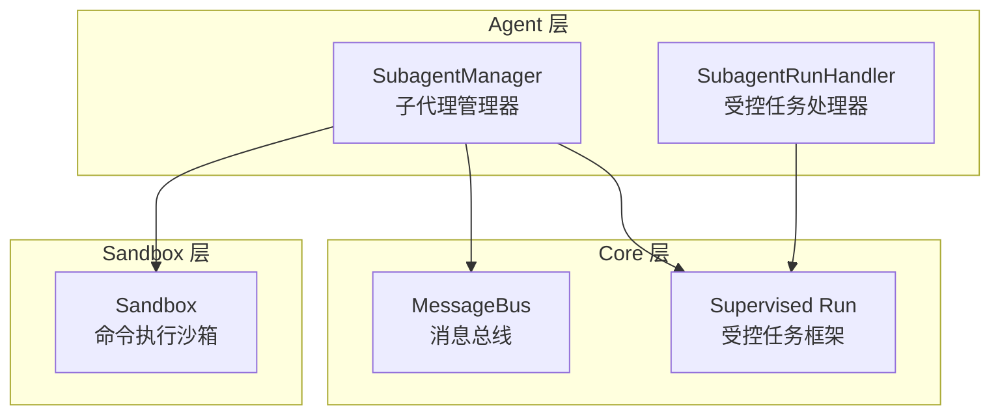
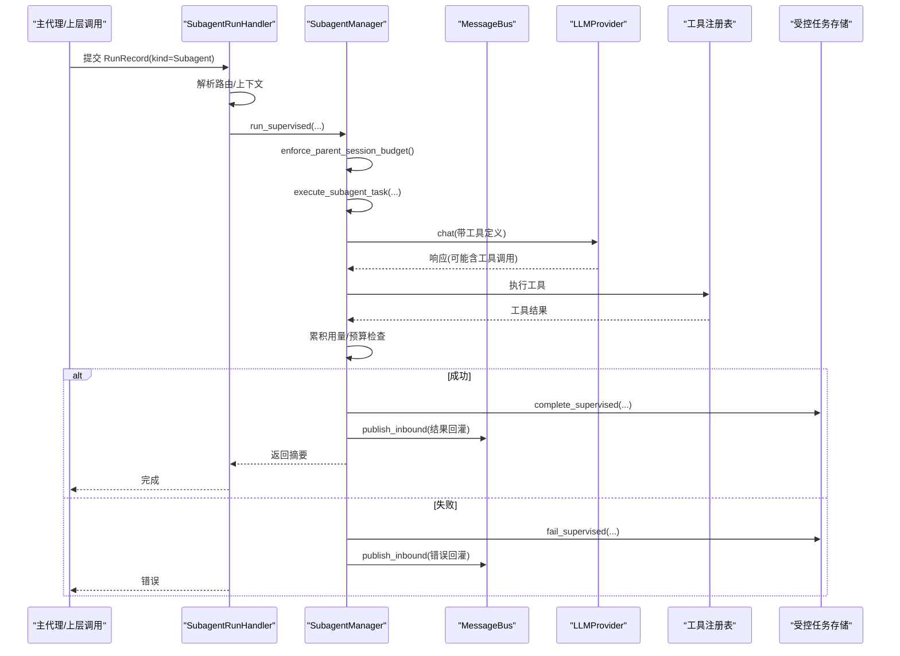
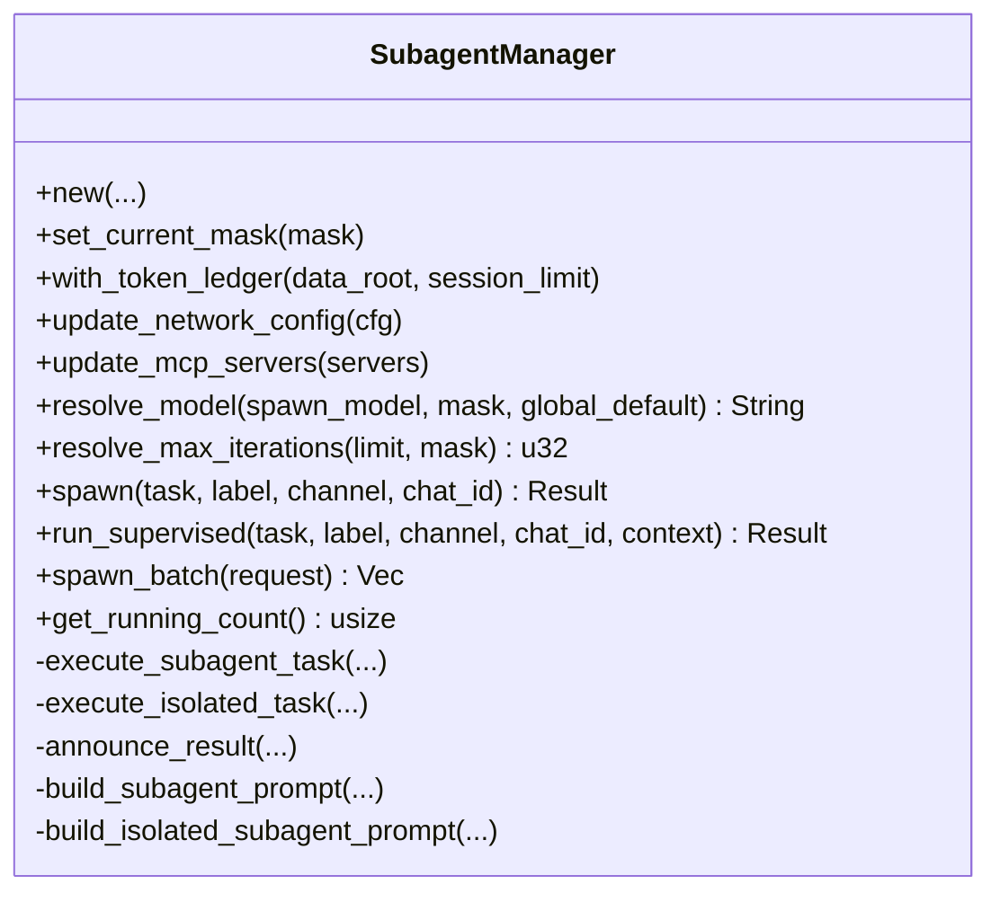
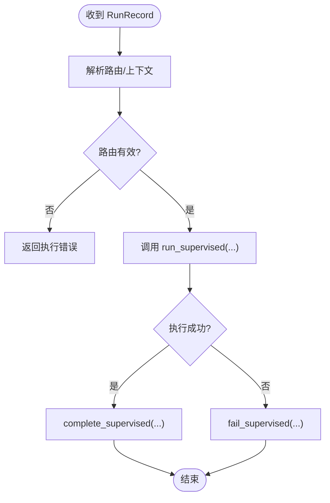
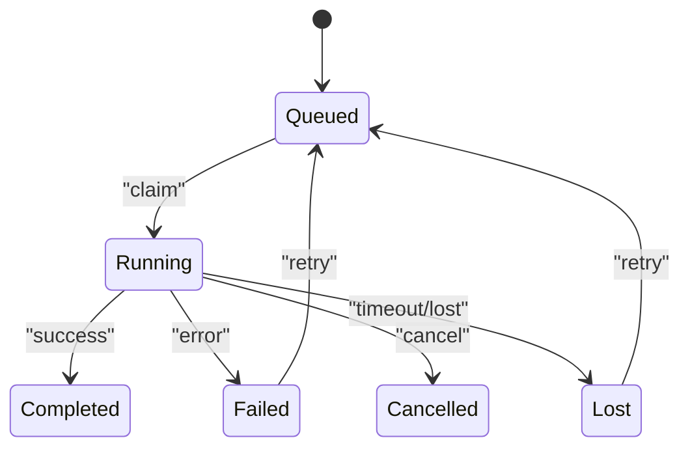
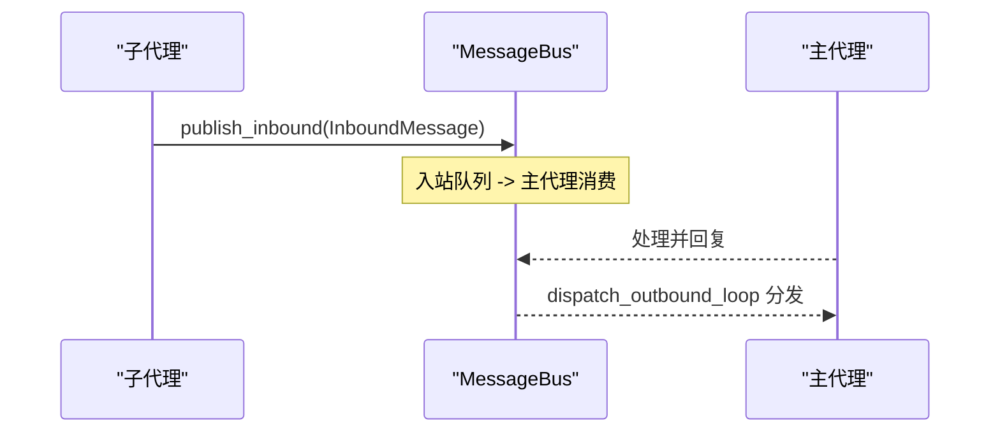
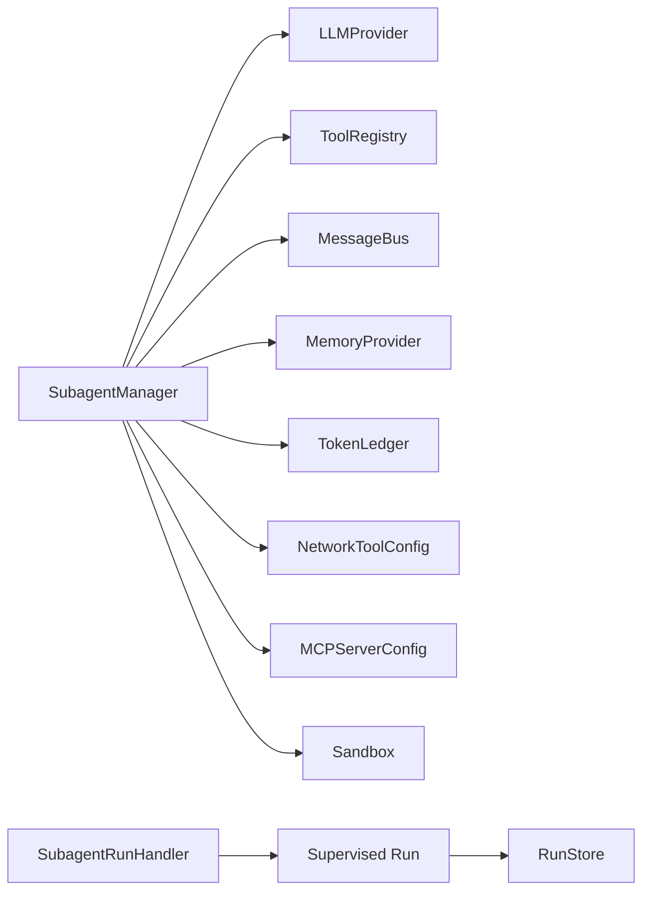

# 子代理管理

<cite>
**本文引用的文件**
- [subagent.rs](file://agent-diva-agent/src/subagent.rs)
- [subagent_run_handler.rs](file://agent-diva-agent/src/subagent_run_handler.rs)
- [mod.rs（supervised）](file://agent-diva-core/src/supervised/mod.rs)
- [types.rs（supervised）](file://agent-diva-core/src/supervised/types.rs)
- [queue.rs（消息总线）](file://agent-diva-core/src/bus/queue.rs)
- [lib.rs（沙箱）](file://agent-diva-sandbox/src/lib.rs)
</cite>

## 目录
1. [简介](#简介)
2. [项目结构](#项目结构)
3. [核心组件](#核心组件)
4. [架构总览](#架构总览)
5. [详细组件分析](#详细组件分析)
6. [依赖关系分析](#依赖关系分析)
7. [性能考量](#性能考量)
8. [故障排查指南](#故障排查指南)
9. [结论](#结论)
10. [附录：使用示例与最佳实践](#附录使用示例与最佳实践)

## 简介
本文件系统性阐述“子代理管理系统”的设计与实现，覆盖子代理的完整生命周期（创建、调度、执行、监控、销毁）、通信机制与资源隔离策略、主代理与子代理协作模式、权限控制与资源限制，并提供调试与故障恢复方法。文档同时给出可落地的使用路径与参考位置，帮助读者快速上手并安全扩展。

## 项目结构
围绕子代理管理的核心代码分布在以下模块：
- agent-diva-agent：子代理管理器与运行处理器
- agent-diva-core：受控任务框架（Run/Store/Executor）与消息总线
- agent-diva-sandbox：命令执行沙箱与策略（文件系统、审批、策略等）

图表来源
- [subagent.rs:34-107](file://agent-diva-agent/src/subagent.rs#L34-L107)
- [subagent_run_handler.rs:16-69](file://agent-diva-agent/src/subagent_run_handler.rs#L16-L69)
- [mod.rs（supervised）:1-12](file://agent-diva-core/src/supervised/mod.rs#L1-L12)
- [queue.rs（消息总线）:19-39](file://agent-diva-core/src/bus/queue.rs#L19-L39)
- [lib.rs（沙箱）:1-116](file://agent-diva-sandbox/src/lib.rs#L1-L116)

章节来源
- [subagent.rs:34-107](file://agent-diva-agent/src/subagent.rs#L34-L107)
- [subagent_run_handler.rs:16-69](file://agent-diva-agent/src/subagent_run_handler.rs#L16-L69)
- [mod.rs（supervised）:1-12](file://agent-diva-core/src/supervised/mod.rs#L1-L12)
- [queue.rs（消息总线）:19-39](file://agent-diva-core/src/bus/queue.rs#L19-L39)
- [lib.rs（沙箱）:1-116](file://agent-diva-sandbox/src/lib.rs#L1-L116)

## 核心组件
- SubagentManager：负责子代理的创建、并发控制、模型与迭代次数解析、执行循环、结果公告、批量并行执行、令牌预算与父会话记账等。
- SubagentRunHandler：桥接受控任务框架与 SubagentManager，将 RunRecord 解析为上下文并委托执行。
- Supervised Run（core）：提供统一的任务状态机、存储、执行器与回收器，支持重试、超时、取消等。
- MessageBus：解耦通道与 Agent 核心的异步消息通道，支持入站/出站与事件广播。
- Sandbox：进程级隔离与策略控制，用于命令执行的安全边界。

章节来源
- [subagent.rs:34-107](file://agent-diva-agent/src/subagent.rs#L34-L107)
- [subagent_run_handler.rs:16-69](file://agent-diva-agent/src/subagent_run_handler.rs#L16-L69)
- [mod.rs（supervised）:1-12](file://agent-diva-core/src/supervised/mod.rs#L1-L12)
- [queue.rs（消息总线）:19-39](file://agent-diva-core/src/bus/queue.rs#L19-L39)
- [lib.rs（沙箱）:1-116](file://agent-diva-sandbox/src/lib.rs#L1-L116)

## 架构总览
子代理在“受控任务框架”的统一编排下运行，通过消息总线与主代理交互，借助沙箱进行安全的命令执行。

图表来源
- [subagent_run_handler.rs:32-69](file://agent-diva-agent/src/subagent_run_handler.rs#L32-L69)
- [subagent.rs:280-362](file://agent-diva-agent/src/subagent.rs#L280-L362)
- [subagent.rs:768-891](file://agent-diva-agent/src/subagent.rs#L768-L891)
- [queue.rs（消息总线）:105-117](file://agent-diva-core/src/bus/queue.rs#L105-L117)
- [types.rs（supervised）:207-245](file://agent-diva-core/src/supervised/types.rs#L207-L245)

## 详细组件分析

### 子代理管理器（SubagentManager）
- 生命周期
  - 创建：new(...) 初始化提供者、工作区、消息总线、模型、工具配置、网络/MCP 配置、执行超时、内存提供者、运行任务集合、令牌预算等。
  - 启动：spawn(...) 后台运行；run_supervised(...) 前台等待完成；spawn_batch(...) 批量并行。
  - 执行：execute_subagent_task(...) / execute_isolated_task(...) 驱动 LLM 与工具循环，累计用量与预算检查。
  - 监控：get_running_count(...) 查询当前运行数；announce_result(...) 通过消息总线回灌结果。
  - 销毁：任务完成后从 running_tasks 移除句柄；批量任务使用哨兵键便于可见性。
- 资源与权限
  - 模型与迭代次数解析：resolve_model(...)、resolve_max_iterations(...) 遵循优先级链（显式 > mask 子代理默认 > mask 默认 > 全局）。
  - 令牌预算：per_task_token_budget 逐任务限额；with_token_ledger(...) 继承父会话账本；enforce_parent_session_budget(...) 与 append_parent_session_usage(...) 写入父会话。
  - 工作区限制：restrict_to_workspace 配合工具装配限制访问范围。
  - 网络与 MCP：动态更新 network_config 与 mcp_servers。
- 提示词与身份
  - build_subagent_prompt(...) 注入“已应用权威上下文”，避免继承人格/灵魂文件。
  - build_isolated_subagent_prompt(...) 无身份、无跨任务通信的极简提示词。

图表来源
- [subagent.rs:34-107](file://agent-diva-agent/src/subagent.rs#L34-L107)
- [subagent.rs:137-199](file://agent-diva-agent/src/subagent.rs#L137-L199)
- [subagent.rs:201-278](file://agent-diva-agent/src/subagent.rs#L201-L278)
- [subagent.rs:280-362](file://agent-diva-agent/src/subagent.rs#L280-L362)
- [subagent.rs:405-536](file://agent-diva-agent/src/subagent.rs#L405-L536)
- [subagent.rs:538-633](file://agent-diva-agent/src/subagent.rs#L538-L633)
- [subagent.rs:635-762](file://agent-diva-agent/src/subagent.rs#L635-L762)
- [subagent.rs:764-891](file://agent-diva-agent/src/subagent.rs#L764-L891)
- [subagent.rs:893-928](file://agent-diva-agent/src/subagent.rs#L893-L928)
- [subagent.rs:930-1022](file://agent-diva-agent/src/subagent.rs#L930-L1022)
- [subagent.rs:1038-1115](file://agent-diva-agent/src/subagent.rs#L1038-L1115)

章节来源
- [subagent.rs:34-107](file://agent-diva-agent/src/subagent.rs#L34-L107)
- [subagent.rs:137-199](file://agent-diva-agent/src/subagent.rs#L137-L199)
- [subagent.rs:201-278](file://agent-diva-agent/src/subagent.rs#L201-L278)
- [subagent.rs:280-362](file://agent-diva-agent/src/subagent.rs#L280-L362)
- [subagent.rs:405-536](file://agent-diva-agent/src/subagent.rs#L405-L536)
- [subagent.rs:538-633](file://agent-diva-agent/src/subagent.rs#L538-L633)
- [subagent.rs:635-762](file://agent-diva-agent/src/subagent.rs#L635-L762)
- [subagent.rs:764-891](file://agent-diva-agent/src/subagent.rs#L764-L891)
- [subagent.rs:893-928](file://agent-diva-agent/src/subagent.rs#L893-L928)
- [subagent.rs:930-1022](file://agent-diva-agent/src/subagent.rs#L930-L1022)
- [subagent.rs:1038-1115](file://agent-diva-agent/src/subagent.rs#L1038-L1115)

### 受控任务处理器（SubagentRunHandler）
- 职责：接收 RunRecord(kind=Subagent)，解析路由（channel/chat_id）与上下文（session_key、trace_id、parent_run_id、token_budget_limit），委托 SubagentManager.run_supervised 执行，并将结果写回受控任务存储。
- 错误处理：缺失路由或解析失败时返回执行错误；子代理失败时包装为 HandlerError。

图表来源
- [subagent_run_handler.rs:32-69](file://agent-diva-agent/src/subagent_run_handler.rs#L32-L69)
- [subagent_run_handler.rs:72-118](file://agent-diva-agent/src/subagent_run_handler.rs#L72-L118)

章节来源
- [subagent_run_handler.rs:16-69](file://agent-diva-agent/src/subagent_run_handler.rs#L16-L69)
- [subagent_run_handler.rs:72-118](file://agent-diva-agent/src/subagent_run_handler.rs#L72-L118)

### 受控任务框架（Supervised Run）
- 类型与状态机：RunStatus（queued/running/completed/failed/cancelled/lost）及其转换规则；RunKind（cron/subagent/tool/maintenance/generic）。
- 规范与记录：SupervisedRunSpec 描述任务元数据；RunRecord 承载完整执行信息（尝试次数、超时、开始/完成时间、错误信息等）。
- 执行器与回收器：TaskExecutor 负责认领与执行；Reaper 负责清理与恢复。

图表来源
- [types.rs（supervised）:7-65](file://agent-diva-core/src/supervised/types.rs#L7-L65)
- [types.rs（supervised）:100-134](file://agent-diva-core/src/supervised/types.rs#L100-L134)
- [types.rs（supervised）:136-205](file://agent-diva-core/src/supervised/types.rs#L136-L205)
- [types.rs（supervised）:207-245](file://agent-diva-core/src/supervised/types.rs#L207-L245)

章节来源
- [mod.rs（supervised）:1-12](file://agent-diva-core/src/supervised/mod.rs#L1-L12)
- [types.rs（supervised）:7-65](file://agent-diva-core/src/supervised/types.rs#L7-L65)
- [types.rs（supervised）:100-134](file://agent-diva-core/src/supervised/types.rs#L100-L134)
- [types.rs（supervised）:136-205](file://agent-diva-core/src/supervised/types.rs#L136-L205)
- [types.rs（supervised）:207-245](file://agent-diva-core/src/supervised/types.rs#L207-L245)

### 消息总线（MessageBus）
- 作用：解耦聊天通道与 Agent 核心，提供入站/出站队列与事件广播。
- 关键能力：publish_inbound/publish_outbound、subscribe_outbound、dispatch_outbound_loop、事件与 poke 事件通道。
- 子代理结果回灌：通过 publish_inbound 将结果以系统消息形式注入主代理流程，确保正确路由到 origin_channel/chat_id。

图表来源
- [queue.rs（消息总线）:19-39](file://agent-diva-core/src/bus/queue.rs#L19-L39)
- [queue.rs（消息总线）:105-117](file://agent-diva-core/src/bus/queue.rs#L105-L117)
- [queue.rs（消息总线）:119-183](file://agent-diva-core/src/bus/queue.rs#L119-L183)

章节来源
- [queue.rs（消息总线）:19-39](file://agent-diva-core/src/bus/queue.rs#L19-L39)
- [queue.rs（消息总线）:105-117](file://agent-diva-core/src/bus/queue.rs#L105-L117)
- [queue.rs（消息总线）:119-183](file://agent-diva-core/src/bus/queue.rs#L119-L183)

### 沙箱与资源隔离
- 进程隔离：基于平台特性（如 Windows Restricted Token）与文件系统访问控制，保护敏感路径。
- 策略与审批：ExecPolicy、Guardian、Approval 等机制组合，对命令执行进行白名单/黑名单与人工审批。
- 环境变量开关：可通过环境变量禁用沙箱（仅用于调试/测试）。

章节来源
- [lib.rs（沙箱）:1-116](file://agent-diva-sandbox/src/lib.rs#L1-L116)

## 依赖关系分析
- SubagentManager 依赖：
  - LLMProvider：对话与工具调用
  - ToolRegistry/ToolAssembly：工具装配与执行
  - MessageBus：结果回灌与事件
  - MemoryProvider：权威上下文注入
  - TokenLedger：令牌预算与父会话记账
  - NetworkToolConfig/MCPServerConfig：网络与 MCP 服务
- SubagentRunHandler 依赖：
  - Supervised Run（RunHandler/RunRecord/RunStore）
- 受控任务框架依赖：
  - 持久化存储（SQLite/文件）与执行器/回收器
- 沙箱依赖：
  - 平台能力与策略引擎

图表来源
- [subagent.rs:34-107](file://agent-diva-agent/src/subagent.rs#L34-L107)
- [subagent_run_handler.rs:16-69](file://agent-diva-agent/src/subagent_run_handler.rs#L16-L69)
- [mod.rs（supervised）:1-12](file://agent-diva-core/src/supervised/mod.rs#L1-L12)
- [lib.rs（沙箱）:1-116](file://agent-diva-sandbox/src/lib.rs#L1-L116)

章节来源
- [subagent.rs:34-107](file://agent-diva-agent/src/subagent.rs#L34-L107)
- [subagent_run_handler.rs:16-69](file://agent-diva-agent/src/subagent_run_handler.rs#L16-L69)
- [mod.rs（supervised）:1-12](file://agent-diva-core/src/supervised/mod.rs#L1-L12)
- [lib.rs（沙箱）:1-116](file://agent-diva-sandbox/src/lib.rs#L1-L116)

## 性能考量
- 并发控制：批量任务使用 JoinSet 与最大并发常量控制，避免资源争用。
- 超时控制：每个子代理任务设置执行超时，防止长时间占用。
- 迭代上限：通过 resolve_max_iterations 限制 LLM 调用轮次，降低延迟与成本。
- 令牌预算：逐任务与父会话双重预算检查，避免超额消耗。
- 工具调用优化：结构化参数序列化与结果规范化，减少往返开销。

[本节为通用指导，不直接分析具体文件]

## 故障排查指南
- 常见错误
  - 缺少路由信息：RunRecord 未包含 channel/chat_id，导致解析失败。
  - 令牌预算超限：触发 BudgetExceeded，需调整 per_task_token_budget 或父会话限额。
  - 执行超时：子代理任务超过 exec_timeout，需优化任务或提高超时。
  - 工具执行失败：工具参数错误或权限不足，检查工具定义与沙箱策略。
- 诊断步骤
  - 查看子代理日志与工具追踪（tool_trace）定位问题。
  - 检查消息总线入站/出站是否被消费（dispatch_outbound_loop 是否运行）。
  - 确认沙箱策略与文件系统访问模式是否符合预期。
  - 验证受控任务状态机流转（Queued→Running→Completed/Failed）。

章节来源
- [subagent_run_handler.rs:72-118](file://agent-diva-agent/src/subagent_run_handler.rs#L72-L118)
- [subagent.rs:676-710](file://agent-diva-agent/src/subagent.rs#L676-L710)
- [subagent.rs:805-839](file://agent-diva-agent/src/subagent.rs#L805-L839)
- [queue.rs（消息总线）:132-183](file://agent-diva-core/src/bus/queue.rs#L132-L183)
- [types.rs（supervised）:7-65](file://agent-diva-core/src/supervised/types.rs#L7-L65)

## 结论
子代理管理系统通过“受控任务框架 + 消息总线 + 沙箱”的组合，实现了高内聚、低耦合的子代理生命周期管理。其模型与迭代次数解析、令牌预算、批量并行与超时控制等机制，确保了可扩展性与安全性。结合沙箱策略与审批流程，可在复杂环境中稳定运行。

[本节为总结，不直接分析具体文件]

## 附录：使用示例与最佳实践
- 创建与运行子代理
  - 后台运行：调用 spawn(...) 传入任务描述、标签、来源通道与聊天 ID。
  - 前台等待：调用 run_supervised(...) 并传入上下文（session_key、trace_id、parent_run_id、token_budget_limit）。
  - 批量并行：构造 BatchSpawnRequest，调用 spawn_batch(...) 获取结果列表。
- 处理子代理间通信
  - 子代理通过 announce_result(...) 将结果以 InboundMessage 形式发布到消息总线，由主代理消费并路由回原通道。
- 监控执行状态
  - 使用 get_running_count(...) 查询当前运行数。
  - 通过受控任务存储查询 RunRecord 的状态与耗时。
- 权限与资源限制
  - 启用 restrict_to_workspace 限制工作区访问。
  - 配置 per_task_token_budget 与 with_token_ledger 控制令牌消耗。
  - 通过沙箱策略与审批流程约束命令执行。
- 调试与恢复
  - 开启详细日志与工具追踪，定位工具调用与错误。
  - 若任务丢失或失败，利用受控任务的重试机制重新入队。
  - 必要时通过环境变量临时禁用沙箱进行调试（生产环境不建议）。

章节来源
- [subagent.rs:201-278](file://agent-diva-agent/src/subagent.rs#L201-L278)
- [subagent.rs:280-362](file://agent-diva-agent/src/subagent.rs#L280-L362)
- [subagent.rs:405-536](file://agent-diva-agent/src/subagent.rs#L405-L536)
- [subagent.rs:893-928](file://agent-diva-agent/src/subagent.rs#L893-L928)
- [subagent.rs:1106-1115](file://agent-diva-agent/src/subagent.rs#L1106-L1115)
- [queue.rs（消息总线）:105-117](file://agent-diva-core/src/bus/queue.rs#L105-L117)
- [lib.rs（沙箱）:107-116](file://agent-diva-sandbox/src/lib.rs#L107-L116)