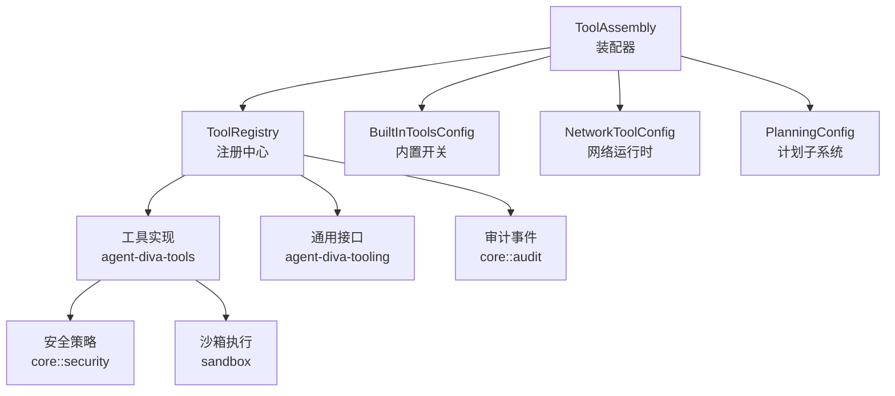
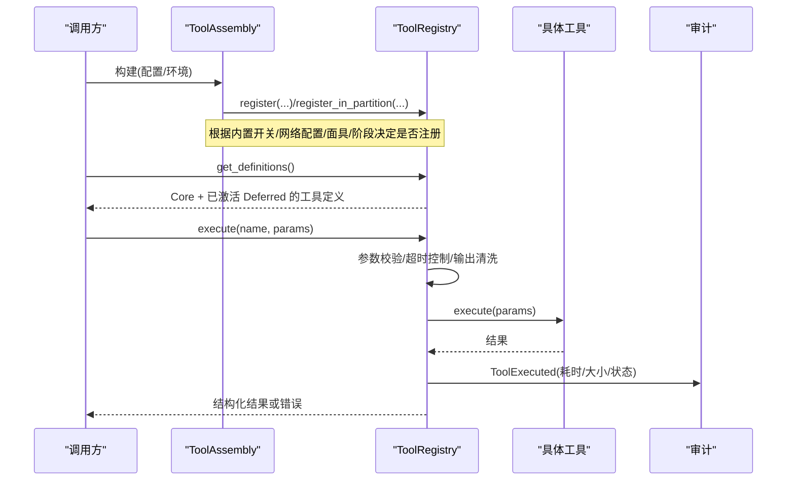
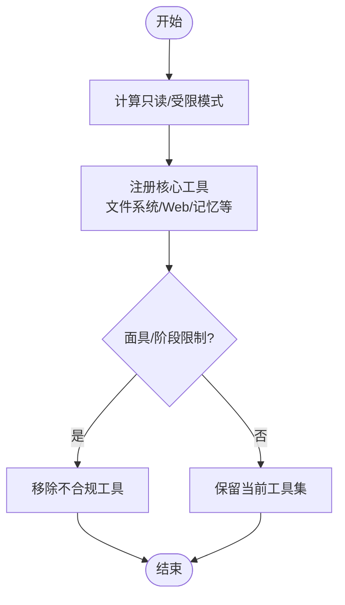
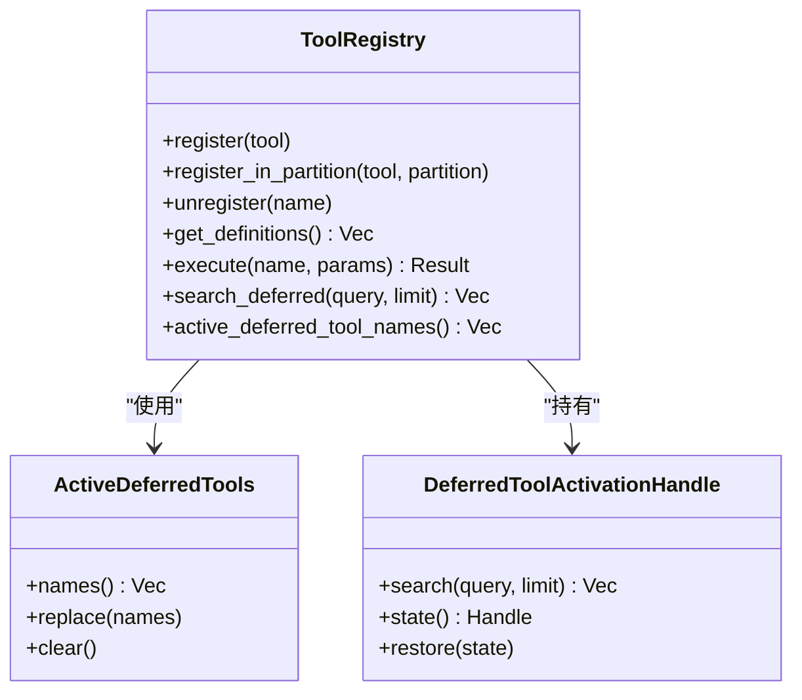
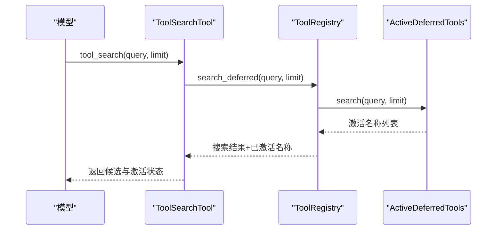
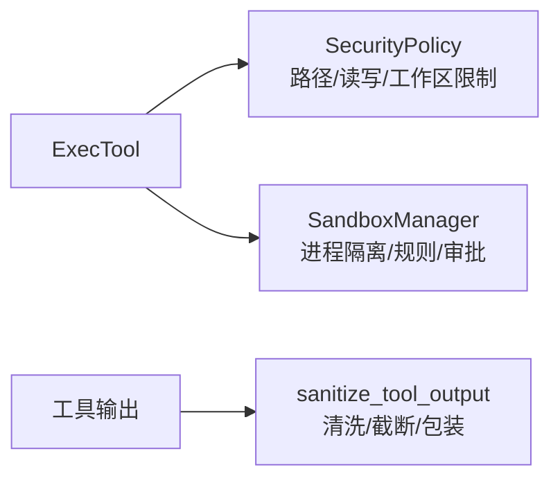
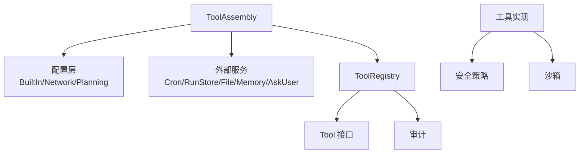

# 工具装配

<cite>
**本文引用的文件**
- [tool_assembly.rs](file://agent-diva-agent/src/tool_assembly.rs)
- [builtin.rs](file://agent-diva-agent/src/tool_config/builtin.rs)
- [network.rs](file://agent-diva-agent/src/tool_config/network.rs)
- [mod.rs](file://agent-diva-agent/src/tool_config/mod.rs)
- [registry.rs](file://agent-diva-tooling/src/registry.rs)
- [lib.rs](file://agent-diva-tooling/src/lib.rs)
- [tool_discovery.rs](file://agent-diva-tools/src/tool_discovery.rs)
- [lib.rs](file://agent-diva-tools/src/lib.rs)
- [audit.rs](file://agent-diva-core/src/audit.rs)
- [security_mod.rs](file://agent-diva-core/src/security/mod.rs)
- [sandbox_lib.rs](file://agent-diva-sandbox/src/lib.rs)
- [manager.rs](file://agent-diva-sandbox/src/manager.rs)
</cite>

## 目录
1. [简介](#简介)
2. [项目结构](#项目结构)
3. [核心组件](#核心组件)
4. [架构总览](#架构总览)
5. [详细组件分析](#详细组件分析)
6. [依赖关系分析](#依赖关系分析)
7. [性能与超时控制](#性能与超时控制)
8. [故障排查指南](#故障排查指南)
9. [结论](#结论)
10. [附录：配置层次与优先级](#附录：配置层次与优先级)

## 简介
本文件系统性阐述 Agent-Diva 的“工具装配系统”，围绕 ToolAssembly 的设计模式、工具注册机制、内置/网络/自定义工具的集成方式、配置的层次结构与优先级、工具发现与动态加载原理、执行环境的安全隔离与权限控制，以及调试与性能监控方法展开。目标是帮助开发者快速理解并安全扩展工具能力。

## 项目结构
工具装配由多个协作模块组成：
- 装配器：ToolAssembly，负责根据配置组装工具集合并生成 ToolRegistry。
- 配置层：BuiltInToolsConfig（内置开关）、NetworkToolConfig（网络工具运行时参数）、PlanningConfig（计划子系统）。
- 注册中心：ToolRegistry，维护工具定义、延迟激活集合、执行入口与审计埋点。
- 工具实现：agent-diva-tools 提供文件系统、记忆、Web、MCP、Shell 等工具；agent-diva-tooling 提供通用接口与注册表基础设施。
- 安全与沙箱：core::security 提供路径/输出过滤策略；sandbox 提供命令执行隔离与审批流。

图表来源
- [tool_assembly.rs:42-240](file://agent-diva-agent/src/tool_assembly.rs#L42-L240)
- [registry.rs:363-532](file://agent-diva-tooling/src/registry.rs#L363-L532)
- [builtin.rs:4-35](file://agent-diva-agent/src/tool_config/builtin.rs#L4-L35)
- [network.rs:3-15](file://agent-diva-agent/src/tool_config/network.rs#L3-L15)
- [mod.rs:11-21](file://agent-diva-agent/src/tool_config/mod.rs#L11-L21)
- [audit.rs:210-216](file://agent-diva-core/src/audit.rs#L210-L216)
- [security_mod.rs:40-68](file://agent-diva-core/src/security/mod.rs#L40-L68)
- [sandbox_lib.rs:1-116](file://agent-diva-sandbox/src/lib.rs#L1-L116)

章节来源
- [tool_assembly.rs:42-240](file://agent-diva-agent/src/tool_assembly.rs#L42-L240)
- [registry.rs:363-532](file://agent-diva-tooling/src/registry.rs#L363-L532)
- [builtin.rs:4-35](file://agent-diva-agent/src/tool_config/builtin.rs#L4-L35)
- [network.rs:3-15](file://agent-diva-agent/src/tool_config/network.rs#L3-L15)
- [mod.rs:11-21](file://agent-diva-agent/src/tool_config/mod.rs#L11-L21)

## 核心组件
- ToolAssembly：通过链式构建器注入配置与环境依赖，按阶段与安全策略决定注册哪些工具，最终产出 ToolRegistry。
- ToolRegistry：管理工具生命周期（注册/注销）、定义集（Core/Deferred 分区）、延迟激活、参数校验、超时控制、结果清洗与审计。
- BuiltInToolsConfig：以布尔开关控制各工具族是否启用，并提供 minimal/all/for_subagent 等预设。
- NetworkToolConfig：集中管理 Web 搜索/抓取等网络工具的提供者、密钥、最大结果数等运行时参数。
- PlanningConfig：为计划相关工具提供内存与持久化存储，支持会话级工作区初始化。

章节来源
- [tool_assembly.rs:42-240](file://agent-diva-agent/src/tool_assembly.rs#L42-L240)
- [registry.rs:363-532](file://agent-diva-tooling/src/registry.rs#L363-L532)
- [builtin.rs:4-35](file://agent-diva-agent/src/tool_config/builtin.rs#L4-L35)
- [network.rs:3-15](file://agent-diva-agent/src/tool_config/network.rs#L3-L15)
- [mod.rs:11-21](file://agent-diva-agent/src/tool_config/mod.rs#L11-L21)

## 架构总览
工具装配的核心流程如下：
- 读取配置：内置开关、网络运行时、面具策略、计划阶段、执行会话等。
- 计算作用域：只读模式、Plan 阶段限制、子代理模式等影响可注册工具集合。
- 注册工具：按条件注册文件系统、Web、记忆、MCP、Cron、后台任务、AskUser、更新计划等工具。
- 应用限制：根据面具 tool_limits 与 Plan 阶段能力映射，移除不合规工具。
- 暴露定义：Core 分区始终可见；Deferred 分区需通过 tool_search 激活后对模型可见。
- 执行与审计：统一入口执行、参数校验、超时控制、输出清洗、审计事件记录。

图表来源
- [tool_assembly.rs:255-616](file://agent-diva-agent/src/tool_assembly.rs#L255-L616)
- [registry.rs:497-700](file://agent-diva-tooling/src/registry.rs#L497-L700)
- [audit.rs:210-216](file://agent-diva-core/src/audit.rs#L210-L216)

## 详细组件分析

### ToolAssembly 装配逻辑
- 构建器模式：通过 with_* 方法注入 workspace、persona_root、超时、MCP 服务器、Cron、RunStore、文件管理器、计划配置、面具配置、执行会话、命令审批、记忆提供者等。
- 作用域判定：
  - read_only_mode：来自面具的只读模式，强制只读。
  - action_restricted：只读或处于 Plan 阶段时，禁用写操作与部分能力。
  - subagent_mode：子代理模式下裁剪能力（如关闭 spawn/cron/ask_user 等）。
- 工具注册分支：
  - 文件系统：Read/List/Write/Edit，受 SecurityPolicy 与 restrict_to_workspace 控制。
  - Web：search/fetch，受 network_config 与 plan_phase 能力映射控制。
  - 记忆：读写/列表/蒸馏/编辑/完成/丢弃等，按 action_restricted 与 provider 存在性选择不同实现。
  - MCP：load_mcp_tools_sync 动态加载，注册为 Deferred。
  - Cron/后台任务/AskUser/更新计划/执行 Todo 等：按配置与上下文条件注册。
- 后置过滤：
  - 面具 tool_limits 显式 allow/deny。
  - Plan 阶段能力映射关闭不匹配工具。
  - 只读模式移除非只读工具。

图表来源
- [tool_assembly.rs:255-616](file://agent-diva-agent/src/tool_assembly.rs#L255-L616)

章节来源
- [tool_assembly.rs:42-240](file://agent-diva-agent/src/tool_assembly.rs#L42-L240)
- [tool_assembly.rs:255-616](file://agent-diva-agent/src/tool_assembly.rs#L255-L616)

### 工具注册中心 ToolRegistry
- 分区设计：Core（稳定前缀）与 Deferred（按需激活），保证模型工具列表缓存友好且可控。
- 延迟激活：通过 ActiveDeferredTools 与 DeferredToolActivationHandle 在单次任务内维护最多 8 个激活项。
- 执行管线：
  - 查找工具：未找到则审计 not_found；Deferred 未激活则审计 not_active。
  - 参数校验：失败审计 invalid_params 并返回错误。
  - 超时控制：全局超时或工具自定义超时，超时报错。
  - 输出清洗：sanitize_tool_output 去除敏感内容。
  - 审计：ToolExecuted 记录耗时、结果大小、状态。

图表来源
- [registry.rs:363-532](file://agent-diva-tooling/src/registry.rs#L363-L532)
- [registry.rs:45-93](file://agent-diva-tooling/src/registry.rs#L45-L93)
- [registry.rs:103-232](file://agent-diva-tooling/src/registry.rs#L103-L232)

章节来源
- [registry.rs:363-532](file://agent-diva-tooling/src/registry.rs#L363-L532)
- [registry.rs:45-93](file://agent-diva-tooling/src/registry.rs#L45-L93)
- [registry.rs:103-232](file://agent-diva-tooling/src/registry.rs#L103-L232)

### 工具发现与动态加载
- 发现入口：ToolSearchTool 基于描述与 Schema 关键词进行评分排序，返回候选并激活下一轮模型调用的工具集。
- 动态加载：MCP 工具通过 load_mcp_tools_sync 动态发现并注册为 Deferred，结合 tool_search 按需激活。
- 激活上限：ActiveDeferredTools 限制一次最多激活 8 个工具，避免过大工具列表。

图表来源
- [tool_discovery.rs:8-59](file://agent-diva-tools/src/tool_discovery.rs#L8-L59)
- [registry.rs:154-197](file://agent-diva-tooling/src/registry.rs#L154-L197)
- [registry.rs:415-418](file://agent-diva-tooling/src/registry.rs#L415-L418)

章节来源
- [tool_discovery.rs:8-59](file://agent-diva-tools/src/tool_discovery.rs#L8-L59)
- [registry.rs:154-197](file://agent-diva-tooling/src/registry.rs#L154-L197)

### 安全隔离与权限控制
- 文件系统安全：SecurityPolicy 依据 SecurityLevel 与 workspace_only/read_only 等选项限制路径访问；写入类工具在受限模式下被禁用。
- 输出安全：sanitize_tool_output 对工具输出进行清洗，防止注入与敏感信息泄露。
- 命令执行沙箱：ExecTool 通过 sandbox 进行进程隔离、文件系统访问控制、保护路径、审批策略与超时控制；可通过环境变量关闭沙箱（仅开发/测试场景）。
- 面具策略：mask tool_limits 作为额外白名单/黑名单，覆盖默认行为。

图表来源
- [tool_assembly.rs:317-346](file://agent-diva-agent/src/tool_assembly.rs#L317-L346)
- [security_mod.rs:40-68](file://agent-diva-core/src/security/mod.rs#L40-L68)
- [sandbox_lib.rs:1-116](file://agent-diva-sandbox/src/lib.rs#L1-L116)
- [manager.rs:236-272](file://agent-diva-sandbox/src/manager.rs#L236-L272)

章节来源
- [tool_assembly.rs:317-346](file://agent-diva-agent/src/tool_assembly.rs#L317-L346)
- [security_mod.rs:40-68](file://agent-diva-core/src/security/mod.rs#L40-L68)
- [sandbox_lib.rs:1-116](file://agent-diva-sandbox/src/lib.rs#L1-L116)
- [manager.rs:236-272](file://agent-diva-sandbox/src/manager.rs#L236-L272)

### 实际代码示例（路径指引）
- 注册自定义工具：
  - 参考：[tool_assembly.rs:162-170](file://agent-diva-agent/src/tool_assembly.rs#L162-L170)
  - 说明：通过 with_tool/with_tools 将 Arc<dyn Tool> 加入装配器，并在 build 中注册为 Deferred。
- 配置工具参数：
  - 内置开关：[builtin.rs:4-35](file://agent-diva-agent/src/tool_config/builtin.rs#L4-L35)
  - 网络工具：[network.rs:3-78](file://agent-diva-agent/src/tool_config/network.rs#L3-L78)
  - 计划配置：[mod.rs:11-21](file://agent-diva-agent/src/tool_config/mod.rs#L11-L21)
- 处理工具调用结果：
  - 执行与审计：[registry.rs:534-700](file://agent-diva-tooling/src/registry.rs#L534-L700)
  - 审计事件：[audit.rs:210-216](file://agent-diva-core/src/audit.rs#L210-L216)

章节来源
- [tool_assembly.rs:162-170](file://agent-diva-agent/src/tool_assembly.rs#L162-L170)
- [builtin.rs:4-35](file://agent-diva-agent/src/tool_config/builtin.rs#L4-L35)
- [network.rs:3-78](file://agent-diva-agent/src/tool_config/network.rs#L3-L78)
- [mod.rs:11-21](file://agent-diva-agent/src/tool_config/mod.rs#L11-L21)
- [registry.rs:534-700](file://agent-diva-tooling/src/registry.rs#L534-L700)
- [audit.rs:210-216](file://agent-diva-core/src/audit.rs#L210-L216)

## 依赖关系分析
- 装配器依赖配置与外部服务：
  - 内置开关（filesystem/shell/web/mem/cron/mcp/...）
  - 网络运行时（provider/api_key/max_results）
  - 计划子系统（EphemeralPlanRegistry/SqlitePlanningStore）
  - 外部服务（CronService、RunStore、FileManager、MemoryProvider、AskUserCoordinator）
- 注册中心依赖通用工具接口与审计：
  - Tool 接口（name/description/parameters/execute/timeout_secs）
  - 审计事件（ToolExecuted）
- 工具实现依赖安全与沙箱：
  - SecurityPolicy 与 sanitize_tool_output
  - SandboxManager 与审批协调器

图表来源
- [tool_assembly.rs:42-240](file://agent-diva-agent/src/tool_assembly.rs#L42-L240)
- [registry.rs:363-532](file://agent-diva-tooling/src/registry.rs#L363-L532)
- [lib.rs:1-14](file://agent-diva-tooling/src/lib.rs#L1-L14)
- [lib.rs:1-74](file://agent-diva-tools/src/lib.rs#L1-L74)
- [security_mod.rs:40-68](file://agent-diva-core/src/security/mod.rs#L40-L68)
- [sandbox_lib.rs:1-116](file://agent-diva-sandbox/src/lib.rs#L1-L116)

章节来源
- [tool_assembly.rs:42-240](file://agent-diva-agent/src/tool_assembly.rs#L42-L240)
- [registry.rs:363-532](file://agent-diva-tooling/src/registry.rs#L363-L532)
- [lib.rs:1-14](file://agent-diva-tooling/src/lib.rs#L1-L14)
- [lib.rs:1-74](file://agent-diva-tools/src/lib.rs#L1-L74)
- [security_mod.rs:40-68](file://agent-diva-core/src/security/mod.rs#L40-L68)
- [sandbox_lib.rs:1-116](file://agent-diva-sandbox/src/lib.rs#L1-L116)

## 性能与超时控制
- 全局超时：ToolRegistry 以 global_timeout_secs 包裹工具执行，防止长时间阻塞。
- 工具级超时：工具可实现 timeout_secs 覆盖默认值。
- 延迟激活：Deferred 工具仅在 tool_search 激活后暴露给模型，减少无效工具开销。
- 输出清洗：sanitize_tool_output 控制结果大小与安全性，避免大响应影响性能。
- 审计埋点：ToolExecuted 记录耗时与结果大小，便于性能分析与问题定位。

章节来源
- [registry.rs:534-700](file://agent-diva-tooling/src/registry.rs#L534-L700)
- [audit.rs:210-216](file://agent-diva-core/src/audit.rs#L210-L216)

## 故障排查指南
- 工具不可用：
  - 现象：ToolUnavailable/not_active/not_found
  - 检查：是否在 Deferred 分区但未激活；是否被面具/阶段限制移除；是否存在同名冲突。
  - 参考：[registry.rs:547-590](file://agent-diva-tooling/src/registry.rs#L547-L590)
- 参数校验失败：
  - 现象：InvalidParams
  - 检查：参数类型/必填字段是否符合 schema；注意异常字符提示。
  - 参考：[registry.rs:592-620](file://agent-diva-tooling/src/registry.rs#L592-L620)
- 执行超时：
  - 现象：Timeout
  - 检查：工具是否过慢；调整 global_timeout_secs 或工具自身 timeout_secs。
  - 参考：[registry.rs:622-698](file://agent-diva-tooling/src/registry.rs#L622-L698)
- 沙箱拒绝：
  - 现象：命令执行被拒绝或受限
  - 检查：SandboxMode、文件系统策略、保护路径、审批策略；必要时确认是否误关闭沙箱。
  - 参考：[sandbox_lib.rs:107-116](file://agent-diva-sandbox/src/lib.rs#L107-L116)
  - 参考：[manager.rs:236-272](file://agent-diva-sandbox/src/manager.rs#L236-L272)
- 审计日志：
  - 关注 target="audit" 的 ToolExecuted 事件，获取耗时、结果大小与状态，辅助定位瓶颈与异常。
  - 参考：[audit.rs:210-216](file://agent-diva-core/src/audit.rs#L210-L216)

章节来源
- [registry.rs:547-698](file://agent-diva-tooling/src/registry.rs#L547-L698)
- [sandbox_lib.rs:107-116](file://agent-diva-sandbox/src/lib.rs#L107-L116)
- [manager.rs:236-272](file://agent-diva-sandbox/src/manager.rs#L236-L272)
- [audit.rs:210-216](file://agent-diva-core/src/audit.rs#L210-L216)

## 结论
ToolAssembly 通过清晰的装配流程与分层配置，实现了灵活、安全、可扩展的工具体系。借助 ToolRegistry 的分区与延迟激活机制，系统在保持模型工具列表稳定的同时，支持动态发现与按需启用。配合安全策略与沙箱隔离，确保工具执行在受控环境中运行。审计与超时控制为调试与性能优化提供了有力支撑。

## 附录：配置层次与优先级
- 全局配置：BuiltInToolsConfig 与 NetworkToolConfig 决定工具族开关与网络运行时参数。
- 会话级配置：PlanningConfig 提供计划子系统的工作区初始化与存储。
- 任务级配置：MaskConfig（面具）的 tool_limits 与只读模式、PlanPhase、execution_session_id 等影响最终可用工具集。
- 优先级顺序（从高到低）：
  1) 面具 tool_limits 与只读模式（显式 allow/deny）
  2) Plan 阶段能力映射（关闭不匹配工具）
  3) 内置开关与网络运行时配置
  4) 子代理模式裁剪（for_subagent）
  5) 上下文缺失导致的降级（如无 MemoryProvider 时使用本地实现）

章节来源
- [tool_assembly.rs:255-616](file://agent-diva-agent/src/tool_assembly.rs#L255-L616)
- [builtin.rs:41-117](file://agent-diva-agent/src/tool_config/builtin.rs#L41-L117)
- [network.rs:3-78](file://agent-diva-agent/src/tool_config/network.rs#L3-L78)
- [mod.rs:11-21](file://agent-diva-agent/src/tool_config/mod.rs#L11-L21)