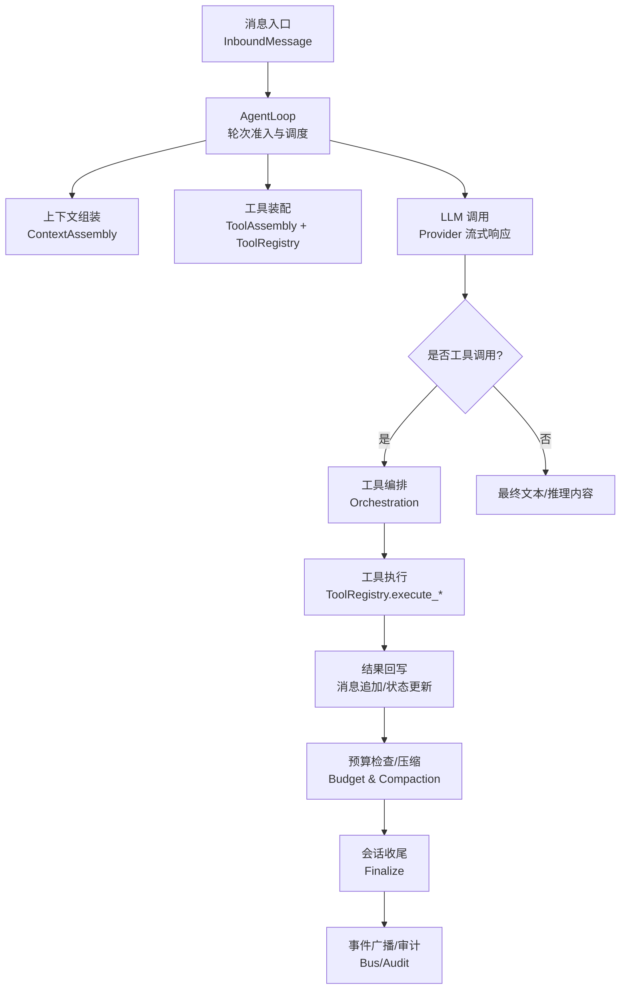
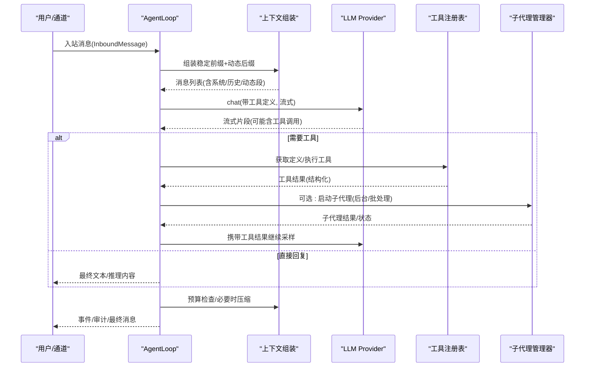
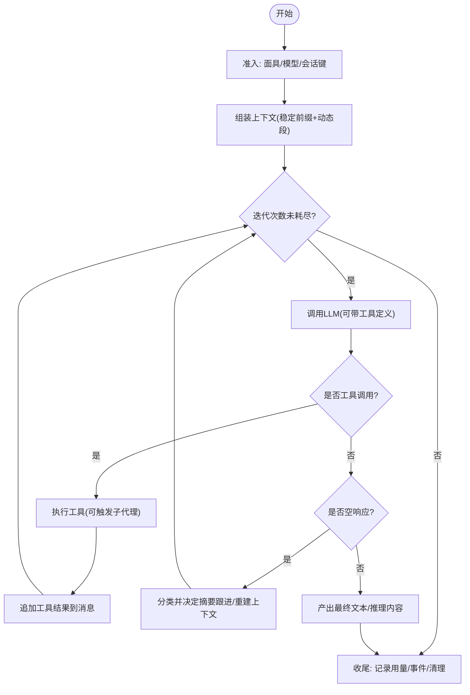
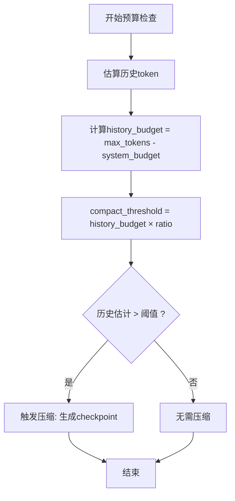
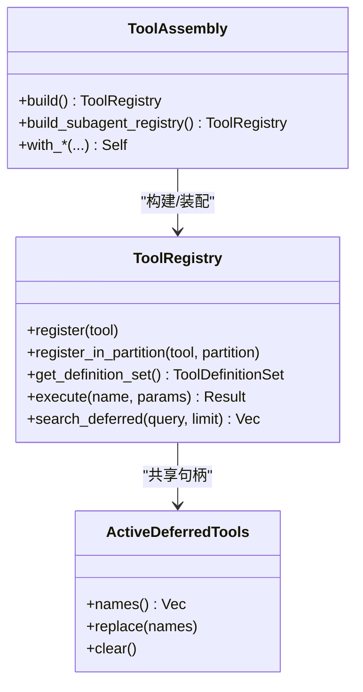
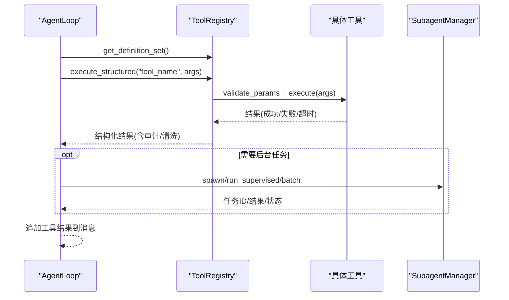
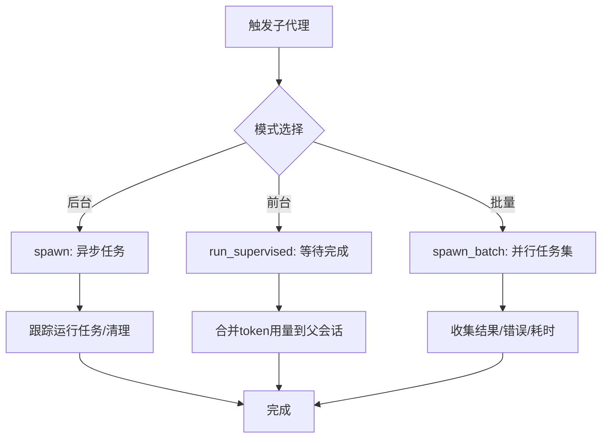
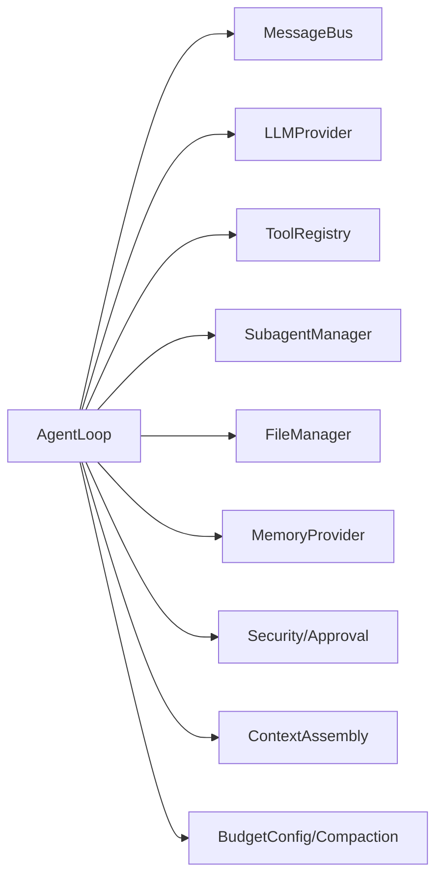

# 智能体循环

<cite>
**本文引用的文件**
- [agent_loop.rs](file://agent-diva-agent/src/agent_loop.rs)
- [loop_turn.rs](file://agent-diva-agent/src/agent_loop/loop_turn.rs)
- [loop_tools.rs](file://agent-diva-agent/src/agent_loop/loop_tools.rs)
- [tool_assembly.rs](file://agent-diva-agent/src/tool_assembly.rs)
- [registry.rs](file://agent-diva-tooling/src/registry.rs)
- [context_assembly/mod.rs](file://agent-diva-agent/src/context_assembly/mod.rs)
- [context_budget.rs](file://agent-diva-agent/src/context_budget.rs)
- [compaction/mod.rs](file://agent-diva-agent/src/compaction/mod.rs)
- [subagent.rs](file://agent-diva-agent/src/subagent.rs)
</cite>

## 目录
1. [简介](#简介)
2. [项目结构](#项目结构)
3. [核心组件](#核心组件)
4. [架构总览](#架构总览)
5. [详细组件分析](#详细组件分析)
6. [依赖关系分析](#依赖关系分析)
7. [性能考虑](#性能考虑)
8. [故障排除指南](#故障排除指南)
9. [结论](#结论)
10. [附录](#附录)

## 简介
本文件系统性阐述 Agent Loop（智能体循环）的核心机制，包括消息处理生命周期、上下文组装与预算控制、工具发现与注册、工具调用编排、子代理创建与管理等。文档面向不同技术背景的读者，提供从高层到代码级的可视化说明，并给出实际使用示例路径、性能优化建议与故障排查指引。

## 项目结构
Agent Loop 位于 agent-diva-agent 包中，围绕“消息进入—轮次处理—工具执行—上下文更新—结果输出”的闭环展开；上下文组装与预算在 context_assembly 与 context_budget 模块实现；工具装配与注册在 tool_assembly 与 tooling registry 中完成；子代理由 subagent 管理。

图表来源
- [agent_loop.rs:110-153](file://agent-diva-agent/src/agent_loop.rs#L110-L153)
- [loop_turn.rs:312-757](file://agent-diva-agent/src/agent_loop/loop_turn.rs#L312-L757)
- [tool_assembly.rs:240-616](file://agent-diva-agent/src/tool_assembly.rs#L240-L616)
- [registry.rs:497-700](file://agent-diva-tooling/src/registry.rs#L497-L700)
- [context_assembly/mod.rs:174-229](file://agent-diva-agent/src/context_assembly/mod.rs#L174-L229)
- [context_budget.rs:164-207](file://agent-diva-agent/src/context_budget.rs#L164-L207)

章节来源
- [agent_loop.rs:110-153](file://agent-diva-agent/src/agent_loop.rs#L110-L153)
- [loop_turn.rs:312-757](file://agent-diva-agent/src/agent_loop/loop_turn.rs#L312-L757)

## 核心组件
- AgentLoop：主循环与轮次协调器，负责消息准入、模型调用、工具编排、预算与压缩触发、会话收尾。
- ContextAssembly：按固定顺序组装稳定前缀与动态后缀，支持缓存锚点与传输策略。
- BudgetConfig 与 Compaction：基于 token 估算与阈值判断是否压缩历史，生成规范化的 checkpoint。
- ToolAssembly + ToolRegistry：根据配置、掩码、计划阶段与安全策略装配工具集，支持延迟激活与搜索发现。
- SubagentManager：后台任务与批处理的子代理生命周期管理，隔离上下文与资源。

章节来源
- [agent_loop.rs:110-153](file://agent-diva-agent/src/agent_loop.rs#L110-L153)
- [context_assembly/mod.rs:26-115](file://agent-diva-agent/src/context_assembly/mod.rs#L26-L115)
- [context_budget.rs:25-112](file://agent-diva-agent/src/context_budget.rs#L25-L112)
- [compaction/mod.rs:1-33](file://agent-diva-agent/src/compaction/mod.rs#L1-L33)
- [tool_assembly.rs:42-253](file://agent-diva-agent/src/tool_assembly.rs#L42-L253)
- [registry.rs:362-532](file://agent-diva-tooling/src/registry.rs#L362-L532)
- [subagent.rs:34-107](file://agent-diva-agent/src/subagent.rs#L34-L107)

## 架构总览
下图展示一次典型请求从入站到出站的完整流程，包含上下文组装、预算检查、工具调用与子代理协作。

图表来源
- [loop_turn.rs:312-757](file://agent-diva-agent/src/agent_loop/loop_turn.rs#L312-L757)
- [tool_assembly.rs:240-616](file://agent-diva-agent/src/tool_assembly.rs#L240-L616)
- [registry.rs:497-700](file://agent-diva-tooling/src/registry.rs#L497-L700)
- [subagent.rs:211-362](file://agent-diva-agent/src/subagent.rs#L211-L362)

## 详细组件分析

### 消息处理生命周期（轮次）
- 准入与准备：解析消息元数据、加载活跃面具、确定模型、构建运行时上下文（消息、动态段、稳定前缀）。
- 迭代循环：最多 max_iterations 次；每次先读取运行期控制命令，再发起模型调用；若返回工具调用则执行工具并继续；否则产出最终文本或推理内容。
- 空响应兜底：对空响应进行分类（输入压力/摘要跟进），必要时重建上下文或触发摘要轮次。
- 收尾：记录 token 用量、发布事件、持久化执行上下文、清理活动状态。

图表来源
- [loop_turn.rs:312-757](file://agent-diva-agent/src/agent_loop/loop_turn.rs#L312-L757)

章节来源
- [loop_turn.rs:312-757](file://agent-diva-agent/src/agent_loop/loop_turn.rs#L312-L757)

### 上下文组装与预算控制
- 逻辑段顺序：MaskAndIdentity → FrozenCore → AgentRulesAndSkills → MemoryPolicyAndIndex → Compaction → History → SessionCheckpoint → PrefetchRecall → VolatileMeta → PlanGuard → CurrentUser。
- 稳定性分层：前四段为会话级稳定（可参与缓存前缀），其余为每轮可变（放入动态段）。
- 预算计算：max_tokens 分配给系统提示与技能，剩余给历史；当历史估计超过阈值（如 80%）时触发压缩。
- 压缩策略：将历史压缩为规范化 checkpoint，保留最近 N 条消息，避免超出上下文窗口。

图表来源
- [context_budget.rs:164-207](file://agent-diva-agent/src/context_budget.rs#L164-L207)
- [context_assembly/mod.rs:26-115](file://agent-diva-agent/src/context_assembly/mod.rs#L26-L115)

章节来源
- [context_assembly/mod.rs:26-115](file://agent-diva-agent/src/context_assembly/mod.rs#L26-L115)
- [context_budget.rs:25-112](file://agent-diva-agent/src/context_budget.rs#L25-L112)
- [context_budget.rs:164-207](file://agent-diva-agent/src/context_budget.rs#L164-L207)
- [compaction/mod.rs:1-33](file://agent-diva-agent/src/compaction/mod.rs#L1-L33)

### 工具发现与注册机制
- 装配规则：根据内置开关、网络配置、计划阶段、掩码策略与安全级别，选择性注册文件系统、网络、记忆、工作区、MCP、定时任务、子代理等工具。
- 延迟激活：非核心工具以 Deferred 分区注册，通过 tool_search 按需激活，限制单次暴露数量，降低上下文开销。
- 动态更新：支持运行时切换网络工具、MCP 服务器，并同步更新子代理管理器配置。
- 安全边界：Plan 模式与只读面具会严格限制写入类工具；执行审批策略可注入到执行工具编排器。

图表来源
- [tool_assembly.rs:42-253](file://agent-diva-agent/src/tool_assembly.rs#L42-L253)
- [registry.rs:362-532](file://agent-diva-tooling/src/registry.rs#L362-L532)
- [registry.rs:497-700](file://agent-diva-tooling/src/registry.rs#L497-L700)

章节来源
- [tool_assembly.rs:240-616](file://agent-diva-agent/src/tool_assembly.rs#L240-L616)
- [registry.rs:362-532](file://agent-diva-tooling/src/registry.rs#L362-L532)
- [loop_tools.rs:10-70](file://agent-diva-agent/src/agent_loop/loop_tools.rs#L10-L70)

### 工具调用流程（编排）
- 决策：模型返回 tool_calls 时，进入工具编排；摘要轮次禁用工具调用。
- 执行：通过 ToolRegistry.execute_structured 执行，支持超时、参数校验、审计日志、结果清洗。
- 子代理：某些工具可触发子代理后台任务，主循环不阻塞，结果通过事件/存储回传。
- 终止条件：若工具导致进入“等待审批”等生命周期屏障，本轮停止继续采样。

图表来源
- [loop_turn.rs:562-643](file://agent-diva-agent/src/agent_loop/loop_turn.rs#L562-L643)
- [registry.rs:534-700](file://agent-diva-tooling/src/registry.rs#L534-L700)
- [subagent.rs:211-362](file://agent-diva-agent/src/subagent.rs#L211-L362)

章节来源
- [loop_turn.rs:562-643](file://agent-diva-agent/src/agent_loop/loop_turn.rs#L562-L643)
- [registry.rs:534-700](file://agent-diva-tooling/src/registry.rs#L534-L700)

### 子代理创建与管理模式
- 后台任务：spawn 启动独立任务，隔离上下文，继承父代理的模型与默认配置，支持超时与并发上限。
- 监督执行：run_supervised 在前台等待真实任务完成，并将 token 用量合并到父会话账本。
- 批量任务：spawn_batch 并行执行多个隔离任务，统一收集结果与统计信息。
- 配置同步：支持运行时更新网络与 MCP 配置，确保子代理与主代理一致。

图表来源
- [subagent.rs:211-362](file://agent-diva-agent/src/subagent.rs#L211-L362)
- [subagent.rs:405-536](file://agent-diva-agent/src/subagent.rs#L405-L536)

章节来源
- [subagent.rs:34-107](file://agent-diva-agent/src/subagent.rs#L34-L107)
- [subagent.rs:211-362](file://agent-diva-agent/src/subagent.rs#L211-L362)
- [subagent.rs:405-536](file://agent-diva-agent/src/subagent.rs#L405-L536)

### 提示词构建策略
- 稳定前缀：身份、核心规则、技能、记忆策略等会话级稳定内容，优先放入首条系统消息以利用缓存。
- 动态后缀：历史、会话检查点、预取召回、计划守卫、当前用户等每轮可变内容，封装为单一消息并按固定顺序序列化。
- 传输策略：支持对话中间系统消息或用户上下文信封；原生上下文块在当前通用路径下不支持。
- 缓存观察：通过 CacheObserveState 记录调用前后状态，辅助后续优化与诊断。

章节来源
- [context_assembly/mod.rs:26-115](file://agent-diva-agent/src/context_assembly/mod.rs#L26-L115)
- [context_assembly/mod.rs:174-229](file://agent-diva-agent/src/context_assembly/mod.rs#L174-L229)

## 依赖关系分析
- AgentLoop 依赖：
  - MessageBus：事件与消息总线
  - LLMProvider：模型调用与流式响应
  - ToolRegistry：工具发现、定义与执行
  - SubagentManager：子代理生命周期
  - FileManager：附件与文件访问
  - MemoryProvider：记忆读写与脉冲记录
  - Security/Approval：安全策略与执行审批
- 上下文与预算：
  - ContextAssembly：固定顺序与稳定性约束
  - BudgetConfig/Compaction：预算监控与压缩
- 工具装配：
  - ToolAssembly：按配置/掩码/计划阶段装配工具
  - Registry：核心/延迟分区、搜索激活、执行审计

图表来源
- [agent_loop.rs:110-153](file://agent-diva-agent/src/agent_loop.rs#L110-L153)
- [tool_assembly.rs:42-253](file://agent-diva-agent/src/tool_assembly.rs#L42-L253)
- [registry.rs:362-532](file://agent-diva-tooling/src/registry.rs#L362-L532)
- [context_assembly/mod.rs:26-115](file://agent-diva-agent/src/context_assembly/mod.rs#L26-L115)
- [context_budget.rs:25-112](file://agent-diva-agent/src/context_budget.rs#L25-L112)

章节来源
- [agent_loop.rs:110-153](file://agent-diva-agent/src/agent_loop.rs#L110-L153)
- [tool_assembly.rs:42-253](file://agent-diva-agent/src/tool_assembly.rs#L42-L253)
- [registry.rs:362-532](file://agent-diva-tooling/src/registry.rs#L362-L532)

## 性能考虑
- 上下文缓存：将稳定前缀置于首条系统消息，减少重复渲染成本；动态段集中序列化，降低多次拼接开销。
- 延迟工具：仅暴露必要工具定义，按需激活，控制单次 schema 大小，降低模型理解负担。
- 预算与压缩：基于 token 估算与阈值自动压缩历史，保持长会话稳定；保留最近 N 条消息保证连贯性。
- 超时与限流：全局工具超时、单工具超时、每小时动作限制，防止死循环与资源耗尽。
- 子代理并发：限制最大并发数，批量任务聚合结果，避免主循环阻塞。

[本节为通用指导，不直接分析具体文件]

## 故障排除指南
- 工具不可用或未激活：
  - 现象：工具执行返回 unavailable/not_active。
  - 排查：确认工具是否为 Deferred 分区且已通过 tool_search 激活；检查 mask 与 plan_phase 是否允许该工具。
  - 参考路径：[registry.rs:534-700](file://agent-diva-tooling/src/registry.rs#L534-L700)、[tool_assembly.rs:580-616](file://agent-diva-agent/src/tool_assembly.rs#L580-L616)
- 工具参数无效：
  - 现象：validation errors 并附带问题字符定位。
  - 排查：检查 JSON Schema 与传入参数；关注审计日志中的 problematic characters。
  - 参考路径：[registry.rs:592-620](file://agent-diva-tooling/src/registry.rs#L592-L620)
- 工具执行超时：
  - 现象：Timeout 错误，审计记录超时秒数。
  - 排查：调整 exec_timeout 或 global_timeout_secs；检查外部依赖响应时间。
  - 参考路径：[registry.rs:622-698](file://agent-diva-tooling/src/registry.rs#L622-L698)
- 上下文溢出/空响应：
  - 现象：模型返回空内容或 finish_reason 异常。
  - 排查：检查预算报告与压缩触发；必要时重建上下文或启用摘要跟进。
  - 参考路径：[context_budget.rs:164-207](file://agent-diva-agent/src/context_budget.rs#L164-L207)、[loop_turn.rs:660-704](file://agent-diva-agent/src/agent_loop/loop_turn.rs#L660-L704)
- 子代理失败/超时：
  - 现象：子代理任务错误或超时。
  - 排查：检查 per_task_token_budget、exec_timeout、并发上限；查看任务 trace 与结果。
  - 参考路径：[subagent.rs:538-633](file://agent-diva-agent/src/subagent.rs#L538-L633)

章节来源
- [registry.rs:534-700](file://agent-diva-tooling/src/registry.rs#L534-L700)
- [tool_assembly.rs:580-616](file://agent-diva-agent/src/tool_assembly.rs#L580-L616)
- [context_budget.rs:164-207](file://agent-diva-agent/src/context_budget.rs#L164-L207)
- [loop_turn.rs:660-704](file://agent-diva-agent/src/agent_loop/loop_turn.rs#L660-L704)
- [subagent.rs:538-633](file://agent-diva-agent/src/subagent.rs#L538-L633)

## 结论
Agent Loop 通过严格的轮次控制、上下文预算管理与工具装配策略，实现了可扩展、安全可控的智能体执行环境。结合延迟工具、子代理与压缩机制，系统在长会话与复杂任务场景下仍能保持稳定与高效。建议在部署时合理配置预算阈值、超时与并发限制，并结合审计日志进行持续优化。

[本节为总结性内容，不直接分析具体文件]

## 附录
- 实际示例路径（用于演示不同类型消息与工具调用）：
  - 消息处理与工具编排：[loop_turn.rs:312-757](file://agent-diva-agent/src/agent_loop/loop_turn.rs#L312-L757)
  - 工具装配与注册：[tool_assembly.rs:240-616](file://agent-diva-agent/src/tool_assembly.rs#L240-L616)
  - 工具执行与审计：[registry.rs:534-700](file://agent-diva-tooling/src/registry.rs#L534-L700)
  - 上下文组装与预算：[context_assembly/mod.rs:174-229](file://agent-diva-agent/src/context_assembly/mod.rs#L174-L229)、[context_budget.rs:164-207](file://agent-diva-agent/src/context_budget.rs#L164-L207)
  - 子代理管理：[subagent.rs:211-362](file://agent-diva-agent/src/subagent.rs#L211-L362)、[subagent.rs:405-536](file://agent-diva-agent/src/subagent.rs#L405-L536)

[本节为索引性内容，不直接分析具体文件]