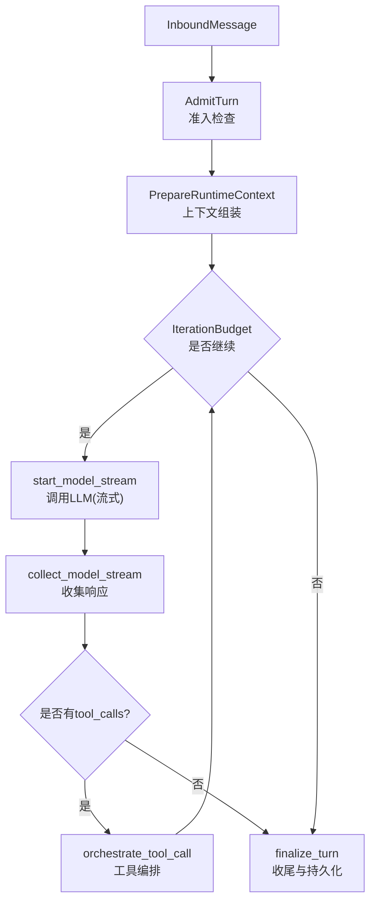
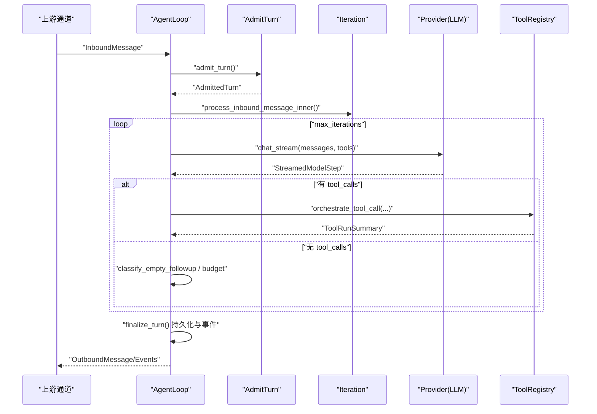
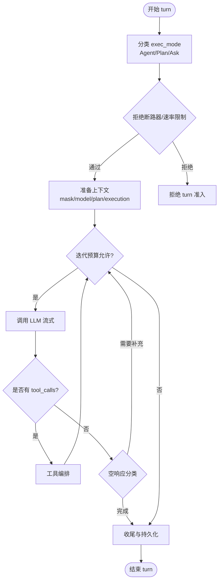
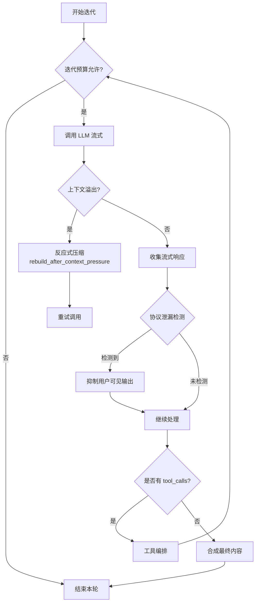
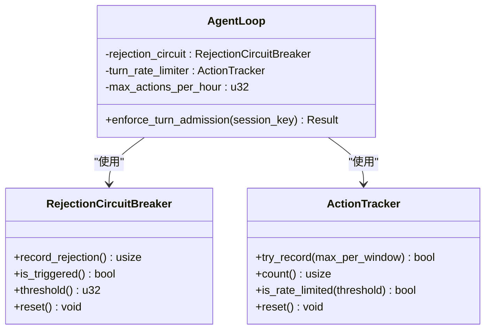
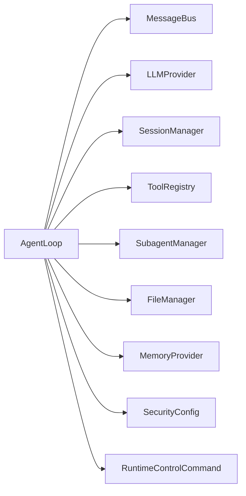

# 核心循环机制

<cite>
**本文引用的文件**
- [agent-diva-agent/src/agent_loop.rs](file://agent-diva-agent/src/agent_loop.rs)
- [agent-diva-agent/src/agent_loop/loop_turn.rs](file://agent-diva-agent/src/agent_loop/loop_turn.rs)
- [agent-diva-agent/src/agent_loop/loop_runtime_control.rs](file://agent-diva-agent/src/agent_loop/loop_runtime_control.rs)
- [agent-diva-agent/src/agent_loop/loop_tools.rs](file://agent-diva-agent/src/agent_loop/loop_tools.rs)
- [agent-diva-agent/src/agent_loop/turn/admission.rs](file://agent-diva-agent/src/agent_loop/turn/admission.rs)
- [agent-diva-agent/src/agent_loop/turn/iteration.rs](file://agent-diva-agent/src/agent_loop/turn/iteration.rs)
- [agent-diva-core/src/security/rejection_circuit.rs](file://agent-diva-core/src/security/rejection_circuit.rs)
- [agent-diva-core/src/rate_limiter.rs](file://agent-diva-core/src/rate_limiter.rs)
</cite>

## 目录
1. [简介](#简介)
2. [项目结构](#项目结构)
3. [核心组件](#核心组件)
4. [架构总览](#架构总览)
5. [详细组件分析](#详细组件分析)
6. [依赖关系分析](#依赖关系分析)
7. [性能考量](#性能考量)
8. [故障排除指南](#故障排除指南)
9. [结论](#结论)
10. [附录：启动与配置示例](#附录启动与配置示例)

## 简介
本文件聚焦 AgentLoop 的核心循环机制，系统性解释其设计理念、生命周期管理、消息处理主循环、迭代控制、会话状态管理、turn 的概念与执行流程，以及循环中的安全机制（拒绝断路器、速率限制器、超时控制等）。同时提供实际代码路径指引，帮助读者快速定位实现位置，并给出性能优化建议与故障排除指南。

## 项目结构
AgentLoop 位于 agent-diva-agent 模块中，围绕“消息进入 -> 准入检查 -> 上下文组装 -> 模型调用 -> 工具编排 -> 结果汇总 -> 收尾持久化”的主循环组织代码。关键子模块包括：
- loop_turn：消息处理主循环、迭代预算、流式收集、空响应兜底策略
- turn/admission：turn 的准入分类与安全门控（拒绝断路器、速率限制）
- turn/iteration：模型流式调用、上下文压力检测与反应式压缩、迭代预算控制
- loop_runtime_control：运行时控制命令（停止/重置会话、更新网络/MCP、思考模式、审批策略等）
- loop_tools：动态工具注册与热更新（网络工具、MCP 工具）

图表来源
- [agent-diva-agent/src/agent_loop/loop_turn.rs:312-757](file://agent-diva-agent/src/agent_loop/loop_turn.rs#L312-L757)
- [agent-diva-agent/src/agent_loop/turn/admission.rs:114-317](file://agent-diva-agent/src/agent_loop/turn/admission.rs#L114-L317)
- [agent-diva-agent/src/agent_loop/turn/iteration.rs:167-393](file://agent-diva-agent/src/agent_loop/turn/iteration.rs#L167-L393)

章节来源
- [agent-diva-agent/src/agent_loop.rs:110-153](file://agent-diva-agent/src/agent_loop.rs#L110-L153)
- [agent-diva-agent/src/agent_loop/loop_turn.rs:312-757](file://agent-diva-agent/src/agent_loop/loop_turn.rs#L312-L757)

## 核心组件
- AgentLoop：核心循环引擎，持有消息总线、LLM 提供者、会话管理器、工具注册表、安全组件（拒绝断路器、动作追踪器）、文件管理器等。负责构建工具表面、调度 turn、维护会话状态、处理运行时控制命令。
- Turn 准入（admission）：对入站消息进行分类（Agent/Plan/Ask），执行拒绝断路器与每进程滑动窗口速率限制，生成 AdmittedTurn。
- 迭代控制（iteration）：管理最大迭代次数、摘要-only 奖励轮次、上下文压力检测与反应式压缩、流式收集与协议泄漏防护。
- 运行时控制（runtime control）：支持停止/重置会话、刷新技能/权限、更新网络与 MCP 配置、设置思考模式与审批策略、手动压缩会话等。
- 工具装配（tools）：按当前 mask、计划阶段、执行会话、后台任务上下文等动态装配工具集，支持运行时热更新。

章节来源
- [agent-diva-agent/src/agent_loop.rs:110-153](file://agent-diva-agent/src/agent_loop.rs#L110-L153)
- [agent-diva-agent/src/agent_loop/turn/admission.rs:114-317](file://agent-diva-agent/src/agent_loop/turn/admission.rs#L114-L317)
- [agent-diva-agent/src/agent_loop/turn/iteration.rs:644-714](file://agent-diva-agent/src/agent_loop/turn/iteration.rs#L644-L714)
- [agent-diva-agent/src/agent_loop/loop_runtime_control.rs:26-244](file://agent-diva-agent/src/agent_loop/loop_runtime_control.rs#L26-L244)
- [agent-diva-agent/src/agent_loop/loop_tools.rs:9-69](file://agent-diva-agent/src/agent_loop/loop_tools.rs#L9-L69)

## 架构总览
AgentLoop 以“turn”为基本处理单元，每个 turn 包含以下阶段：
- 接收消息与准入：分类 exec_mode，应用拒绝断路器与速率限制，确定 session_key、mode、scheduled 等
- 准备运行时上下文：加载 active_mask、模型选择、计划阶段、执行会话、动态上下文、稳定前缀等
- 迭代循环：在 max_iterations 内反复调用 LLM，根据响应决定继续或结束；若出现工具调用则执行工具并可能再次采样
- 收尾与持久化：记录 token 用量、生成会话标题、提交计划事件、保存会话、清理资源

图表来源
- [agent-diva-agent/src/agent_loop/loop_turn.rs:312-757](file://agent-diva-agent/src/agent_loop/loop_turn.rs#L312-L757)
- [agent-diva-agent/src/agent_loop/turn/admission.rs:114-317](file://agent-diva-agent/src/agent_loop/turn/admission.rs#L114-L317)
- [agent-diva-agent/src/agent_loop/turn/iteration.rs:167-393](file://agent-diva-agent/src/agent_loop/turn/iteration.rs#L167-L393)

## 详细组件分析

### AgentLoop 结构与生命周期
- 构造与初始化：创建默认模型、安全配置、上下文构建器、会话管理器、工具注册表、子代理管理器、文件管理器、内存提供者、拒绝断路器、动作追踪器、缓存观察器等
- 工具表面重建：根据 active_mask、plan_phase、execution_session_id、session_key、background_task_context 动态装配工具集，支持运行时热更新
- 会话与资源：维护 cancelled_sessions、active_deferred_tools、pending_checkpoint_updates、actmem_activity_generations、actmem_idle_handles 等

章节来源
- [agent-diva-agent/src/agent_loop.rs:473-558](file://agent-diva-agent/src/agent_loop.rs#L473-L558)
- [agent-diva-agent/src/agent_loop.rs:587-759](file://agent-diva-agent/src/agent_loop.rs#L587-L759)
- [agent-diva-agent/src/agent_loop.rs:373-442](file://agent-diva-agent/src/agent_loop.rs#L373-L442)

### Turn 概念与执行流程
- 准入分类：根据 exec_mode 将 turn 分为 Agent/Plan/Ask；识别 scheduled（cron）；校验 execution_start 仅在 Agent 模式下允许
- 安全门控：拒绝断路器触发时直接拒绝新 turn；每进程滑动窗口限制 max_actions_per_hour
- 上下文准备：加载 active_mask、选择 effective model、快照 plan_guard_active、approved_plan_markdown、背景任务上下文
- 主循环：迭代预算控制、流式调用 LLM、工具编排、空响应分类与补偿、最终内容合成与收尾

图表来源
- [agent-diva-agent/src/agent_loop/turn/admission.rs:94-112](file://agent-diva-agent/src/agent_loop/turn/admission.rs#L94-L112)
- [agent-diva-agent/src/agent_loop/turn/admission.rs:114-317](file://agent-diva-agent/src/agent_loop/turn/admission.rs#L114-L317)
- [agent-diva-agent/src/agent_loop/loop_turn.rs:376-757](file://agent-diva-agent/src/agent_loop/loop_turn.rs#L376-L757)

章节来源
- [agent-diva-agent/src/agent_loop/turn/admission.rs:114-317](file://agent-diva-agent/src/agent_loop/turn/admission.rs#L114-L317)
- [agent-diva-agent/src/agent_loop/loop_turn.rs:312-757](file://agent-diva-agent/src/agent_loop/loop_turn.rs#L312-L757)

### 迭代控制与上下文压力处理
- 迭代预算：限制最大迭代次数，并在工具耗尽后授予一次 summary-only 奖励轮次，避免无限循环
- 上下文压力：当 provider 返回上下文溢出错误时，触发反应式压缩（checkpoint compaction），重建消息前缀与尾部，重试调用
- 协议泄漏防护：流式输出使用 InternalProtocolGuard 防止内部协议标记跨块泄露；检测到泄露时抑制用户可见输出

图表来源
- [agent-diva-agent/src/agent_loop/turn/iteration.rs:167-393](file://agent-diva-agent/src/agent_loop/turn/iteration.rs#L167-L393)
- [agent-diva-agent/src/agent_loop/turn/iteration.rs:395-531](file://agent-diva-agent/src/agent_loop/turn/iteration.rs#L395-L531)
- [agent-diva-agent/src/agent_loop/turn/iteration.rs:533-641](file://agent-diva-agent/src/agent_loop/turn/iteration.rs#L533-L641)

章节来源
- [agent-diva-agent/src/agent_loop/turn/iteration.rs:644-714](file://agent-diva-agent/src/agent_loop/turn/iteration.rs#L644-L714)
- [agent-diva-agent/src/agent_loop/turn/iteration.rs:167-393](file://agent-diva-agent/src/agent_loop/turn/iteration.rs#L167-L393)

### 安全机制：拒绝断路器、速率限制、超时控制
- 拒绝断路器（RejectionCircuitBreaker）：基于滑动窗口统计 provider 拒绝失败次数，超过阈值则拒绝新 iteration/turn，防止死循环与风暴
- 速率限制器（ActionTracker）：每进程滑动窗口限制 max_actions_per_hour，超限则拒绝新 turn 准入
- 超时控制：全局工具执行超时（global_timeout_secs）、单次执行超时（exec_timeout），在工具装配与执行时生效

图表来源
- [agent-diva-core/src/security/rejection_circuit.rs:14-56](file://agent-diva-core/src/security/rejection_circuit.rs#L14-L56)
- [agent-diva-agent/src/agent_loop/turn/admission.rs:94-112](file://agent-diva-agent/src/agent_loop/turn/admission.rs#L94-L112)
- [agent-diva-agent/src/agent_loop.rs:55-87](file://agent-diva-agent/src/agent_loop.rs#L55-L87)

章节来源
- [agent-diva-core/src/security/rejection_circuit.rs:14-56](file://agent-diva-core/src/security/rejection_circuit.rs#L14-L56)
- [agent-diva-core/src/rate_limiter.rs:125-165](file://agent-diva-core/src/rate_limiter.rs#L125-L165)
- [agent-diva-agent/src/agent_loop/turn/admission.rs:94-112](file://agent-diva-agent/src/agent_loop/turn/admission.rs#L94-L112)

### 运行时控制与会话状态管理
- 停止/重置会话：插入取消标记、清理 ACTMEM、归档并重置会话、释放冻结核心、清除缓存与延迟工具
- 刷新技能/权限：标记机器技能失效，下次提示组装时懒加载；刷新 Memory authority projection
- 更新网络/MCP：动态注册/注销 web_search/web_fetch/mcp_* 工具，并同步到子代理管理器
- 思考模式与审批策略：运行时切换 ThinkingMode 与 AskForApproval，并重建工具表面

章节来源
- [agent-diva-agent/src/agent_loop/loop_runtime_control.rs:26-244](file://agent-diva-agent/src/agent_loop/loop_runtime_control.rs#L26-L244)
- [agent-diva-agent/src/agent_loop/loop_runtime_control.rs:246-268](file://agent-diva-agent/src/agent_loop/loop_runtime_control.rs#L246-L268)
- [agent-diva-agent/src/agent_loop/loop_tools.rs:27-69](file://agent-diva-agent/src/agent_loop/loop_tools.rs#L27-L69)

### 工具编排与消息输入处理
- 工具装配：根据 active_mask、plan_phase、execution_session_id、session_key、background_task_context 动态装配工具集，支持 deferred 分区与活跃延迟工具句柄
- 消息输入类型：文本、图片附件、文件 ID；文本附件小于阈值可内联，否则提示使用 read_file 工具
- 计划模式与只读模式：Plan 模式限制工具能力；Ask 模式仅允许只读工具定义

章节来源
- [agent-diva-agent/src/agent_loop.rs:258-312](file://agent-diva-agent/src/agent_loop.rs#L258-L312)
- [agent-diva-agent/src/agent_loop/loop_turn.rs:759-800](file://agent-diva-agent/src/agent_loop/loop_turn.rs#L759-L800)
- [agent-diva-agent/src/agent_loop/turn/admission.rs:19-52](file://agent-diva-agent/src/agent_loop/turn/admission.rs#L19-L52)

## 依赖关系分析
- AgentLoop 依赖 MessageBus、LLMProvider、SessionManager、ToolRegistry、SubagentManager、FileManager、MemoryProvider、SecurityConfig 等
- Turn 准入依赖 PlanningStore、ExecutionSession、MaskFile、BackgroundTaskContext
- 迭代控制依赖 ContextBuilder、CheckpointCompactor、CacheObserver、ProviderEventStream
- 运行时控制依赖 RuntimeControlCommand、MemoryProvider、PlanningRegistry

图表来源
- [agent-diva-agent/src/agent_loop.rs:110-153](file://agent-diva-agent/src/agent_loop.rs#L110-L153)
- [agent-diva-agent/src/agent_loop/turn/admission.rs:1-10](file://agent-diva-agent/src/agent_loop/turn/admission.rs#L1-L10)
- [agent-diva-agent/src/agent_loop/turn/iteration.rs:1-23](file://agent-diva-agent/src/agent_loop/turn/iteration.rs#L1-L23)

章节来源
- [agent-diva-agent/src/agent_loop.rs:110-153](file://agent-diva-agent/src/agent_loop.rs#L110-L153)

## 性能考量
- 上下文预算与微压缩：在每次迭代前测量 provider 上下文大小，对工具结果进行微压缩以减少上下文压力
- 反应式压缩：当 provider 返回上下文溢出错误时，自动压缩历史并重建消息，提升稳定性
- 缓存观察：使用 CacheObserveState 跟踪 provider 缓存命中与失效，减少重复计算
- 流式输出与协议保护：流式收集降低首字节延迟，InternalProtocolGuard 防止协议泄漏导致的安全风险
- 工具超时与全局超时：exec_timeout 与 global_timeout_secs 控制工具执行边界，避免长时间阻塞

[本节为通用性能指导，不直接分析具体文件]

## 故障排除指南
- 拒绝断路器触发：检查 provider 错误日志（如 rate-limit、context-length、auth），确认阈值与窗口配置；必要时 reset 断路器
- 速率限制超限：检查 max_actions_per_hour 配置与业务峰值，适当调整或引入队列分支
- 上下文溢出：关注 ContextCompaction 事件，确认压缩是否成功；若失败，检查会话历史与 checkpoint
- 工具执行超时：检查 exec_timeout 与 global_timeout_secs，定位慢工具并优化或拆分
- 会话取消/重置：确认 StopSession/ResetSession 命令是否正确传递；检查 cancelled_sessions 与资源清理

章节来源
- [agent-diva-core/src/security/rejection_circuit.rs:14-56](file://agent-diva-core/src/security/rejection_circuit.rs#L14-L56)
- [agent-diva-agent/src/agent_loop/turn/admission.rs:94-112](file://agent-diva-agent/src/agent_loop/turn/admission.rs#L94-L112)
- [agent-diva-agent/src/agent_loop/turn/iteration.rs:395-531](file://agent-diva-agent/src/agent_loop/turn/iteration.rs#L395-L531)
- [agent-diva-agent/src/agent_loop/loop_runtime_control.rs:79-109](file://agent-diva-agent/src/agent_loop/loop_runtime_control.rs#L79-L109)

## 结论
AgentLoop 通过严格的 turn 准入、迭代预算控制、上下文压力处理与安全机制，实现了高可靠、可扩展的智能体循环。其模块化设计使消息处理、工具编排、会话管理与运行时控制解耦，便于扩展与维护。结合性能优化与故障排除策略，可在生产环境中稳定运行。

[本节为总结性内容，不直接分析具体文件]

## 附录：启动与配置示例
- 启动 AgentLoop：参考构造函数 with_tools/with_tools_and_memory_provider，传入 MessageBus、LLMProvider、workspace、model、max_iterations、ToolConfig、runtime_control_rx、FileManager
- 配置 ToolConfig：设置 builtin、network、planning、exec_timeout、global_timeout_secs、command_approvals、approval_policy、ask_user、restrict_to_workspace、mcp_servers、cron_service、run_store、budget
- 处理不同类型消息输入：文本、图片、文件 ID；注意附件大小与 MIME 类型判断
- 运行时控制：通过 runtime_control_rx 发送 StopSession、ResetSession、UpdateNetwork、UpdateMcp、SetThinking、SetApprovalPolicy、CompactSession 等命令

章节来源
- [agent-diva-agent/src/agent_loop.rs:473-558](file://agent-diva-agent/src/agent_loop.rs#L473-L558)
- [agent-diva-agent/src/agent_loop.rs:587-759](file://agent-diva-agent/src/agent_loop.rs#L587-L759)
- [agent-diva-agent/src/agent_loop/loop_runtime_control.rs:26-244](file://agent-diva-agent/src/agent_loop/loop_runtime_control.rs#L26-L244)
- [agent-diva-agent/src/agent_loop/loop_turn.rs:759-800](file://agent-diva-agent/src/agent_loop/loop_turn.rs#L759-L800)