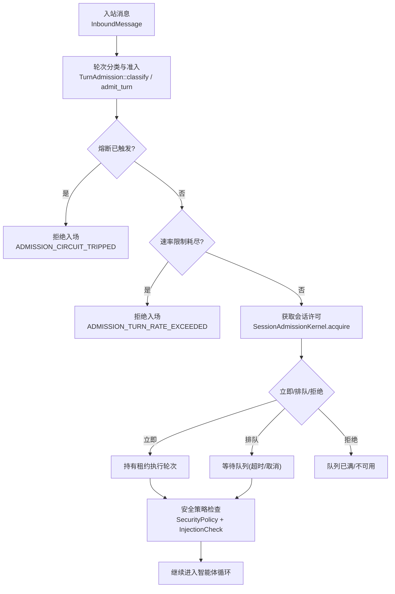
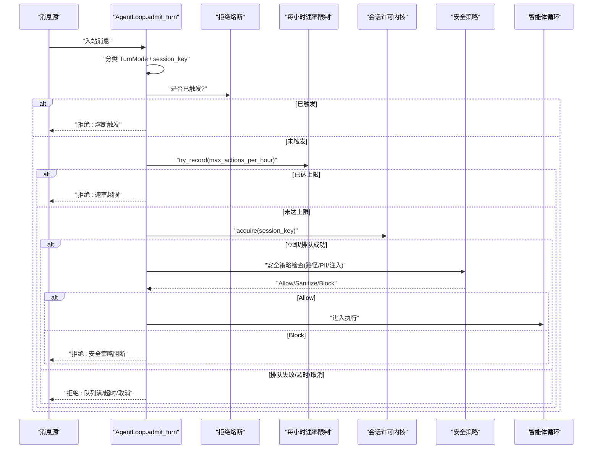
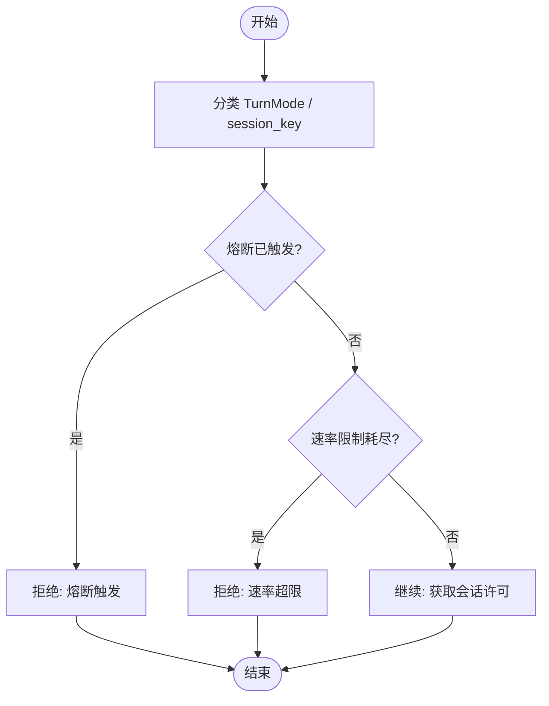
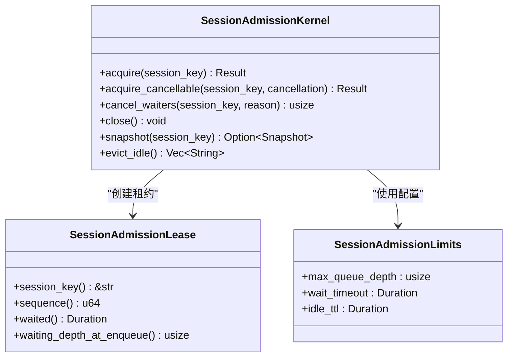
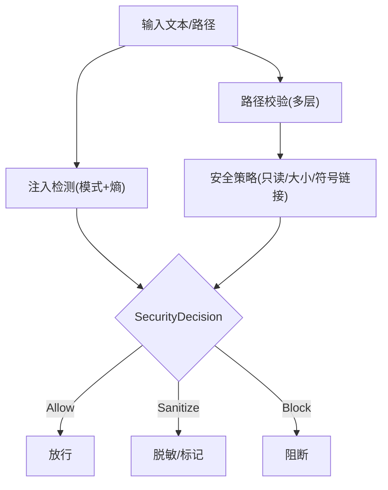
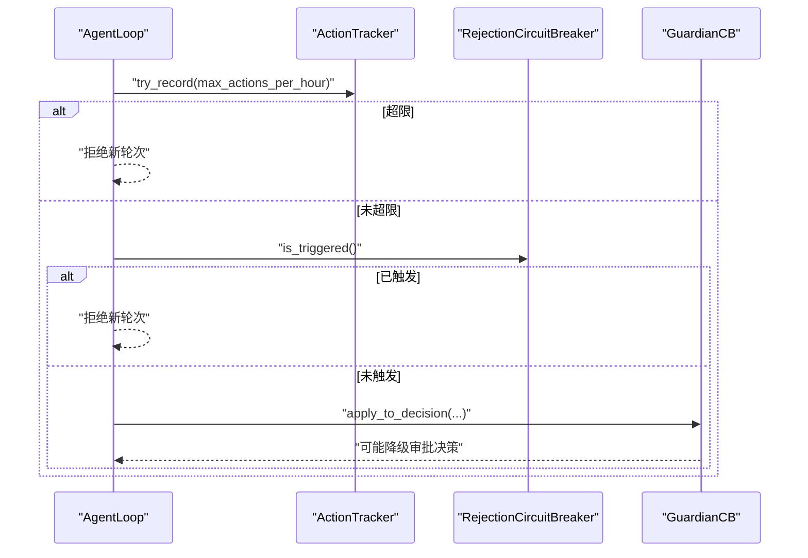
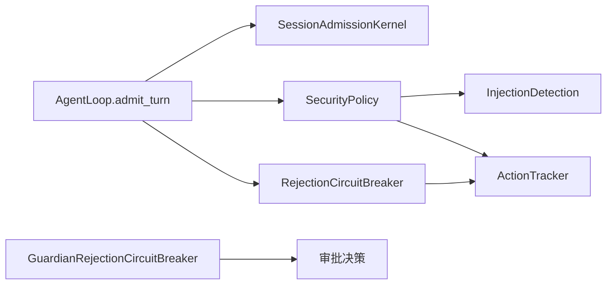

# 准入检查

<cite>
**本文引用的文件**
- [agent-diva-core/src/session/admission.rs](file://agent-diva-core/src/session/admission.rs)
- [agent-diva-agent/src/agent_loop/turn/admission.rs](file://agent-diva-agent/src/agent_loop/turn/admission.rs)
- [agent-diva-core/src/security/policy.rs](file://agent-diva-core/src/security/policy.rs)
- [agent-diva-core/src/security/config.rs](file://agent-diva-core/src/security/config.rs)
- [agent-diva-core/src/security/rate_limit.rs](file://agent-diva-core/src/security/rate_limit.rs)
- [agent-diva-core/src/security/injection.rs](file://agent-diva-core/src/security/injection.rs)
- [agent-diva-core/src/security/check.rs](file://agent-diva-core/src/security/check.rs)
- [agent-diva-core/src/security/rejection_circuit.rs](file://agent-diva-core/src/security/rejection_circuit.rs)
- [agent-diva-sandbox/src/guardian.rs](file://agent-diva-sandbox/src/guardian.rs)
- [agent-diva-core/tests/security_integration.rs](file://agent-diva-core/tests/security_integration.rs)
- [agent-diva-core/benches/performance.rs](file://agent-diva-core/benches/performance.rs)
</cite>

## 目录
1. [简介](#简介)
2. [项目结构](#项目结构)
3. [核心组件](#核心组件)
4. [架构总览](#架构总览)
5. [详细组件分析](#详细组件分析)
6. [依赖关系分析](#依赖关系分析)
7. [性能考虑](#性能考虑)
8. [故障排查指南](#故障排查指南)
9. [结论](#结论)
10. [附录](#附录)

## 简介
本文件面向“轮次准入检查系统”，即消息进入智能体循环前的验证与过滤机制。内容覆盖：
- 输入消息格式与上下文校验、权限与安全策略评估（注入检测、路径安全、只读模式等）
- 速率限制与熔断保护（每小时动作上限、滑动窗口、拒绝风暴熔断）
- 会话级串行化与排队（按会话键的 FIFO 许可、超时、取消、空闲回收）
- 决策逻辑：白名单/黑名单、上下文相关性、资源可用性
- 自定义规则扩展、拒绝场景处理、调试与监控指标建议

## 项目结构
准入检查由多层组件协作完成：
- Agent 层：对入站消息进行分类，执行熔断与全局速率限制，决定是否允许新轮次进入
- 会话层：按会话键提供串行化的许可（lease），控制同一会话内轮次的并发与排队
- 安全层：统一的安全策略（路径校验、只读模式、文件大小、PII、注入检测）、滑动窗口限流、拒绝风暴熔断
- 沙箱层：审批与命令执行层面的熔断保护（与模型迭代熔断互补）

图表来源
- [agent-diva-agent/src/agent_loop/turn/admission.rs:114-140](file://agent-diva-agent/src/agent_loop/turn/admission.rs#L114-L140)
- [agent-diva-core/src/session/admission.rs:157-243](file://agent-diva-core/src/session/admission.rs#L157-L243)
- [agent-diva-core/src/security/check.rs:32-117](file://agent-diva-core/src/security/check.rs#L32-L117)

章节来源
- [agent-diva-agent/src/agent_loop/turn/admission.rs:114-140](file://agent-diva-agent/src/agent_loop/turn/admission.rs#L114-L140)
- [agent-diva-core/src/session/admission.rs:157-243](file://agent-diva-core/src/session/admission.rs#L157-L243)
- [agent-diva-core/src/security/check.rs:32-117](file://agent-diva-core/src/security/check.rs#L32-L117)

## 核心组件
- 轮次准入（Agent 层）
  - 将入站消息分类为 Agent/Plan/Ask，并基于会话键进行准入前置检查
  - 在分类后调用熔断与速率限制检查，未通过则直接拒绝
- 会话许可（Core 层）
  - 以会话键为单位维护运行中状态与等待队列，支持 FIFO、超时、取消、空闲回收
  - 返回租约对象，释放时自动推进下一个等待者
- 安全策略（Core 层）
  - 路径校验（空字节、穿越、URL编码穿越、波浪号展开、绝对路径限制、禁止前缀/扩展）
  - 只读模式、文件大小限制、符号链接策略
  - PII 与注入检测（静态模式匹配+熵分析）
- 速率限制与熔断（Core/Sandbox 层）
  - 滑动窗口 ActionTracker：用于每小时动作上限、拒绝风暴计数
  - RejectionCircuitBreaker：在滑动窗口内统计 provider 拒绝次数，超过阈值则阻止新一轮迭代
  - Sandbox GuardianRejectionCircuitBreaker：审批拒绝风暴熔断（与模型迭代熔断互补）

章节来源
- [agent-diva-agent/src/agent_loop/turn/admission.rs:114-140](file://agent-diva-agent/src/agent_loop/turn/admission.rs#L114-L140)
- [agent-diva-core/src/session/admission.rs:18-40](file://agent-diva-core/src/session/admission.rs#L18-L40)
- [agent-diva-core/src/security/policy.rs:14-23](file://agent-diva-core/src/security/policy.rs#L14-L23)
- [agent-diva-core/src/security/rate_limit.rs:6-13](file://agent-diva-core/src/security/rate_limit.rs#L6-L13)
- [agent-diva-core/src/security/rejection_circuit.rs:14-20](file://agent-diva-core/src/security/rejection_circuit.rs#L14-L20)
- [agent-diva-sandbox/src/guardian.rs:497-565](file://agent-diva-sandbox/src/guardian.rs#L497-L565)

## 架构总览
准入检查贯穿“消息进入智能体循环”的关键路径，形成“分类→熔断/速率→会话许可→安全策略→执行”的流水线。

图表来源
- [agent-diva-agent/src/agent_loop/turn/admission.rs:114-140](file://agent-diva-agent/src/agent_loop/turn/admission.rs#L114-L140)
- [agent-diva-core/src/session/admission.rs:157-243](file://agent-diva-core/src/session/admission.rs#L157-L243)
- [agent-diva-core/src/security/check.rs:32-117](file://agent-diva-core/src/security/check.rs#L32-L117)

## 详细组件分析

### 轮次分类与准入（Agent 层）
- 分类：根据消息元数据 exec_mode 判定 Agent/Plan/Ask；识别定时任务（cron）
- 准入前置：
  - 熔断检查：若拒绝风暴熔断已触发，直接拒绝新轮次
  - 速率限制：使用 ActionTracker 记录动作，达到 max_actions_per_hour 则拒绝
- 后续流程：加载面具、选择模型、构建工具集、快照策略阶段等

图表来源
- [agent-diva-agent/src/agent_loop/turn/admission.rs:114-140](file://agent-diva-agent/src/agent_loop/turn/admission.rs#L114-L140)
- [agent-diva-core/src/security/rate_limit.rs:32-63](file://agent-diva-core/src/security/rate_limit.rs#L32-L63)

章节来源
- [agent-diva-agent/src/agent_loop/turn/admission.rs:114-140](file://agent-diva-agent/src/agent_loop/turn/admission.rs#L114-L140)
- [agent-diva-core/src/security/rate_limit.rs:32-63](file://agent-diva-core/src/security/rate_limit.rs#L32-L63)

### 会话许可内核（Core 层）
- 目标：保证同一逻辑会话内的轮次串行执行，避免并发冲突
- 关键能力：
  - 立即授予：若无运行中且无等待者，直接授予租约
  - 排队等待：否则加入 FIFO 队列，受最大队列深度限制
  - 超时与取消：等待期间支持超时退出与外部取消
  - 空闲回收：长时间空闲的会话槽可被清理
- 错误类型：队列满、等待超时、取消、不可用

图表来源
- [agent-diva-core/src/session/admission.rs:18-40](file://agent-diva-core/src/session/admission.rs#L18-L40)
- [agent-diva-core/src/session/admission.rs:157-243](file://agent-diva-core/src/session/admission.rs#L157-L243)
- [agent-diva-core/src/session/admission.rs:387-431](file://agent-diva-core/src/session/admission.rs#L387-L431)

章节来源
- [agent-diva-core/src/session/admission.rs:157-243](file://agent-diva-core/src/session/admission.rs#L157-L243)
- [agent-diva-core/src/session/admission.rs:387-431](file://agent-diva-core/src/session/admission.rs#L387-L431)

### 安全策略与注入检测（Core 层）
- 路径安全：
  - 多层校验：空字节、穿越、URL编码穿越、波浪号展开、绝对路径限制、禁止前缀/扩展
  - 解析与范围检查：工作区根限制、符号链接策略
- 只读模式与文件大小：
  - can_act 组合只读检查与速率限制
  - check_file_size 限制上传/写入大小
- 注入检测：
  - 三层防御：静态模式匹配（角色覆盖、工具输出注入、越狱）、熵分析、模型分类（预留接口）
  - 审计事件：注入检测、消息阻断等
- 统一入口：check_security 串联注入检测与指令层级冲突，输出 SecurityDecision

图表来源
- [agent-diva-core/src/security/policy.rs:74-201](file://agent-diva-core/src/security/policy.rs#L74-L201)
- [agent-diva-core/src/security/injection.rs:299-401](file://agent-diva-core/src/security/injection.rs#L299-L401)
- [agent-diva-core/src/security/check.rs:32-117](file://agent-diva-core/src/security/check.rs#L32-L117)

章节来源
- [agent-diva-core/src/security/policy.rs:74-201](file://agent-diva-core/src/security/policy.rs#L74-L201)
- [agent-diva-core/src/security/injection.rs:299-401](file://agent-diva-core/src/security/injection.rs#L299-L401)
- [agent-diva-core/src/security/check.rs:32-117](file://agent-diva-core/src/security/check.rs#L32-L117)

### 速率限制与熔断（Core/Sandbox 层）
- 滑动窗口限流：ActionTracker 维护最近 N 秒的动作时间戳，支持 try_record/is_rate_limited/count/reset
- 每小时动作上限：SecurityConfig.max_actions_per_hour 驱动 Agent 层准入拒绝分支
- 拒绝风暴熔断：
  - Core 层 RejectionCircuitBreaker：统计 provider 拒绝次数，超过阈值阻止新一轮模型迭代
  - Sandbox 层 GuardianRejectionCircuitBreaker：针对审批拒绝风暴，影响 AutoApprove/Defer 决策

图表来源
- [agent-diva-core/src/security/rate_limit.rs:32-63](file://agent-diva-core/src/security/rate_limit.rs#L32-L63)
- [agent-diva-core/src/security/rejection_circuit.rs:22-55](file://agent-diva-core/src/security/rejection_circuit.rs#L22-L55)
- [agent-diva-sandbox/src/guardian.rs:502-565](file://agent-diva-sandbox/src/guardian.rs#L502-L565)

章节来源
- [agent-diva-core/src/security/rate_limit.rs:32-63](file://agent-diva-core/src/security/rate_limit.rs#L32-L63)
- [agent-diva-core/src/security/rejection_circuit.rs:22-55](file://agent-diva-core/src/security/rejection_circuit.rs#L22-L55)
- [agent-diva-sandbox/src/guardian.rs:502-565](file://agent-diva-sandbox/src/guardian.rs#L502-L565)

### 决策逻辑：白名单/黑名单、上下文相关性、资源可用性
- 白名单/黑名单
  - 路径黑名单：forbidden_paths、forbidden_extensions
  - 路径白名单：allowed_roots（工作区外额外允许根）
  - 注入检测：模式匹配命中视为“黑名单”行为，高置信度直接阻断
- 上下文相关性
  - 会话键：channel:chat_id 作为会话标识，确保串行化与隔离
  - 计划模式/策略阶段：TurnSnapshot 捕获 plan_mode、policy_phase，影响后续工具与执行策略
- 资源可用性
  - 会话许可：running/waiting/accepting/idle_for 快照反映资源占用
  - 队列容量：max_queue_depth 控制排队上限，避免内存膨胀
  - 超时与取消：保障资源不被长期占用

章节来源
- [agent-diva-core/src/security/config.rs:51-128](file://agent-diva-core/src/security/config.rs#L51-L128)
- [agent-diva-agent/src/agent_loop/turn/admission.rs:61-77](file://agent-diva-agent/src/agent_loop/turn/admission.rs#L61-L77)
- [agent-diva-core/src/session/admission.rs:81-92](file://agent-diva-core/src/session/admission.rs#L81-L92)

### 自定义准入规则与扩展点
- 新增检查条件
  - 在安全策略层增加路径或内容规则（如新增 forbidden_extensions、调整 injection_block_threshold）
  - 在注入检测层添加新的正则族或熵阈值（需评估误报/漏报）
  - 在会话许可层调整队列深度、等待超时、空闲 TTL
- 配置接入
  - 通过 security.json 或 config.json 的 security 段合并覆盖默认值
  - 级别预设（Permissive/Standard/Strict/Paranoid）快速切换默认策略
- 拒绝场景处理
  - 明确错误类型：队列满、等待超时、取消、不可用、速率超限、熔断触发、安全阻断
  - 对外映射稳定错误码：使用 SessionAdmissionError 与 SecurityError 便于上层展示与重试策略

章节来源
- [agent-diva-core/src/security/config.rs:181-325](file://agent-diva-core/src/security/config.rs#L181-L325)
- [agent-diva-core/src/security/policy.rs:74-201](file://agent-diva-core/src/security/policy.rs#L74-L201)
- [agent-diva-core/src/session/admission.rs:53-79](file://agent-diva-core/src/session/admission.rs#L53-L79)

### 实际代码示例（路径引用）
- 实现自定义准入策略（示例：在安全策略中添加新的路径黑名单）
  - 参考：[security/policy.rs:120-134](file://agent-diva-core/src/security/policy.rs#L120-L134)
- 配置准入规则（示例：从 security.json 合并 token_budget_limit、global_tool_timeout_secs）
  - 参考：[security/config.rs:181-231](file://agent-diva-core/src/security/config.rs#L181-L231)
- 调试准入问题（示例：查看会话许可快照、队列深度、等待超时）
  - 参考：[session/admission.rs:354-384](file://agent-diva-core/src/session/admission.rs#L354-L384)
- 注入检测断言（示例：集成测试验证注入阻断）
  - 参考：[tests/security_integration.rs:38-78](file://agent-diva-core/tests/security_integration.rs#L38-L78)

章节来源
- [agent-diva-core/src/security/policy.rs:120-134](file://agent-diva-core/src/security/policy.rs#L120-L134)
- [agent-diva-core/src/security/config.rs:181-231](file://agent-diva-core/src/security/config.rs#L181-L231)
- [agent-diva-core/src/session/admission.rs:354-384](file://agent-diva-core/src/session/admission.rs#L354-L384)
- [agent-diva-core/tests/security_integration.rs:38-78](file://agent-diva-core/tests/security_integration.rs#L38-L78)

## 依赖关系分析
- Agent 层依赖 Core 层的会话许可与安全策略
- 安全策略依赖注入检测、路径校验、速率限制
- 熔断器依赖滑动窗口 ActionTracker
- Sandbox 审批熔断与模型迭代熔断互补，共同构成整体安全边界

图表来源
- [agent-diva-agent/src/agent_loop/turn/admission.rs:114-140](file://agent-diva-agent/src/agent_loop/turn/admission.rs#L114-L140)
- [agent-diva-core/src/security/policy.rs:14-23](file://agent-diva-core/src/security/policy.rs#L14-L23)
- [agent-diva-core/src/security/rejection_circuit.rs:22-55](file://agent-diva-core/src/security/rejection_circuit.rs#L22-L55)
- [agent-diva-sandbox/src/guardian.rs:502-565](file://agent-diva-sandbox/src/guardian.rs#L502-L565)

章节来源
- [agent-diva-agent/src/agent_loop/turn/admission.rs:114-140](file://agent-diva-agent/src/agent_loop/turn/admission.rs#L114-L140)
- [agent-diva-core/src/security/policy.rs:14-23](file://agent-diva-core/src/security/policy.rs#L14-L23)
- [agent-diva-core/src/security/rejection_circuit.rs:22-55](file://agent-diva-core/src/security/rejection_circuit.rs#L22-L55)
- [agent-diva-sandbox/src/guardian.rs:502-565](file://agent-diva-sandbox/src/guardian.rs#L502-L565)

## 性能考虑
- 注入检测基准：提供小输入与大输入的基准函数，建议在 PR 中回归
  - 参考：[benches/performance.rs:10-36](file://agent-diva-core/benches/performance.rs#L10-L36)
- 会话许可优化：
  - 合理设置 max_queue_depth、wait_timeout、idle_ttl，避免队列堆积与内存泄漏
  - 使用 snapshot 监控 running/waiting/accepting/idle_for，定位瓶颈
- 速率限制与熔断：
  - 调整 max_actions_per_hour 与 rejection_circuit_window_secs/threshold，平衡吞吐与稳定性
  - 关注审计事件与日志，及时识别异常峰值

章节来源
- [agent-diva-core/benches/performance.rs:10-36](file://agent-diva-core/benches/performance.rs#L10-L36)
- [agent-diva-core/src/session/admission.rs:354-384](file://agent-diva-core/src/session/admission.rs#L354-L384)
- [agent-diva-core/src/security/config.rs:114-128](file://agent-diva-core/src/security/config.rs#L114-L128)

## 故障排查指南
- 常见拒绝原因与定位
  - 熔断触发：检查 RejectionCircuitBreaker 的 is_triggered 与 rejection_count
    - 参考：[rejection_circuit.rs:31-55](file://agent-diva-core/src/security/rejection_circuit.rs#L31-L55)
  - 速率超限：确认 max_actions_per_hour 与当前 count
    - 参考：[rate_limit.rs:32-63](file://agent-diva-core/src/security/rate_limit.rs#L32-L63)
  - 队列满/超时/取消：查看会话许可快照与错误类型
    - 参考：[session/admission.rs:53-79](file://agent-diva-core/src/session/admission.rs#L53-L79)
    - 参考：[session/admission.rs:354-384](file://agent-diva-core/src/session/admission.rs#L354-L384)
  - 安全阻断：检查注入检测结果与安全策略错误
    - 参考：[security/check.rs:32-117](file://agent-diva-core/src/security/check.rs#L32-L117)
    - 参考：[security/policy.rs:74-201](file://agent-diva-core/src/security/policy.rs#L74-L201)
- 调试步骤
  - 启用审计事件：观察 SecurityPolicyDecision、MessageBlocked、InjectionDetected
  - 打印会话许可快照：running/waiting/accepting/idle_for
  - 调整配置：临时降低阈值或放宽限制，验证问题复现与恢复

章节来源
- [agent-diva-core/src/security/rejection_circuit.rs:31-55](file://agent-diva-core/src/security/rejection_circuit.rs#L31-L55)
- [agent-diva-core/src/security/rate_limit.rs:32-63](file://agent-diva-core/src/security/rate_limit.rs#L32-L63)
- [agent-diva-core/src/session/admission.rs:53-79](file://agent-diva-core/src/session/admission.rs#L53-L79)
- [agent-diva-core/src/security/check.rs:32-117](file://agent-diva-core/src/security/check.rs#L32-L117)
- [agent-diva-core/src/security/policy.rs:74-201](file://agent-diva-core/src/security/policy.rs#L74-L201)

## 结论
轮次准入检查系统通过“分类→熔断/速率→会话许可→安全策略”的多层门控，确保消息在进入智能体循环前经过严格的验证与过滤。其设计兼顾了安全性（注入检测、路径安全、只读模式）、稳定性（熔断、速率限制、会话串行化）与可扩展性（配置合并、策略分层）。通过合理的参数调优与监控指标，可在生产环境中实现高可用与高安全的运行态。

## 附录
- 关键配置项说明
  - max_actions_per_hour：每小时动作上限，超出则拒绝新轮次
  - rejection_circuit_window_secs/threshold：拒绝风暴滑动窗口与阈值
  - global_tool_timeout_secs：工具执行全局超时
  - token_budget_limit/per_task_token_budget：会话/任务级 Token 预算限制
  - workspace_only/forbidden_paths/forbidden_extensions/allowed_roots：路径白/黑名单
- 监控指标建议
  - 会话许可：running/waiting/accepting/idle_for、队列深度、等待超时率
  - 速率限制：当前 count、拒绝次数、窗口滑过恢复
  - 熔断：rejection_count、is_triggered、reset 操作
  - 安全策略：注入检测命中数、阻断数、PII 脱敏数

章节来源
- [agent-diva-core/src/security/config.rs:51-128](file://agent-diva-core/src/security/config.rs#L51-L128)
- [agent-diva-core/src/session/admission.rs:81-92](file://agent-diva-core/src/session/admission.rs#L81-L92)
- [agent-diva-core/src/security/rejection_circuit.rs:31-55](file://agent-diva-core/src/security/rejection_circuit.rs#L31-L55)
- [agent-diva-core/src/security/check.rs:119-149](file://agent-diva-core/src/security/check.rs#L119-L149)