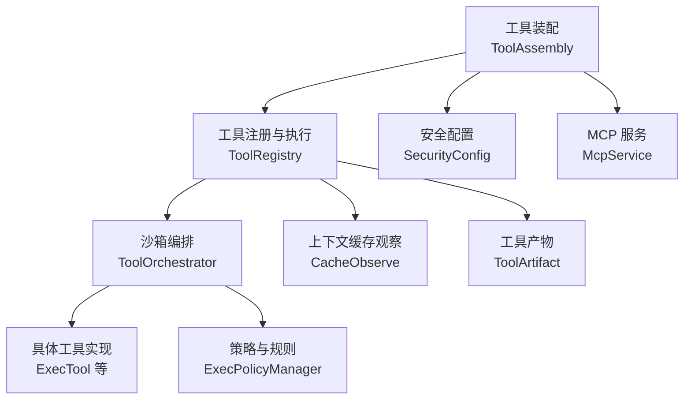
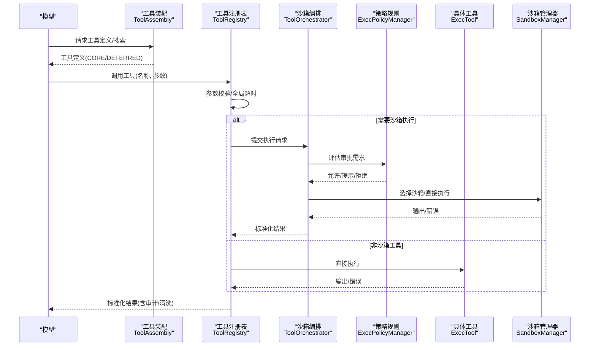
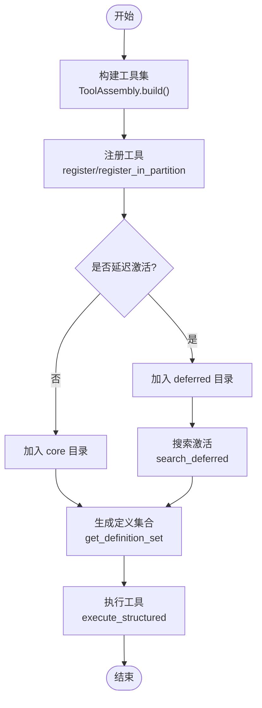
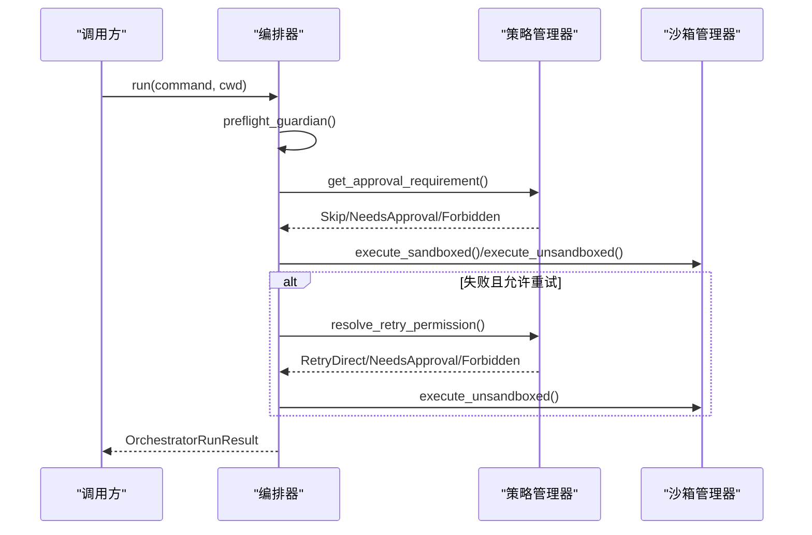
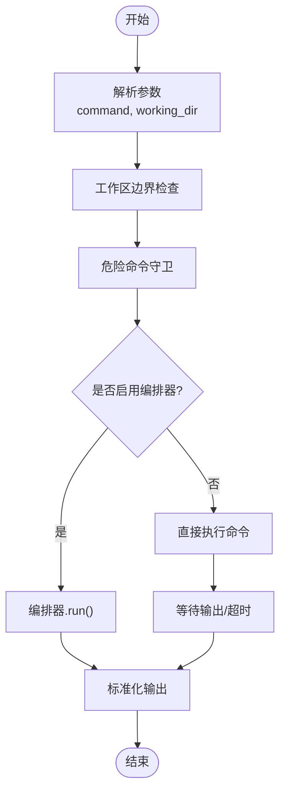
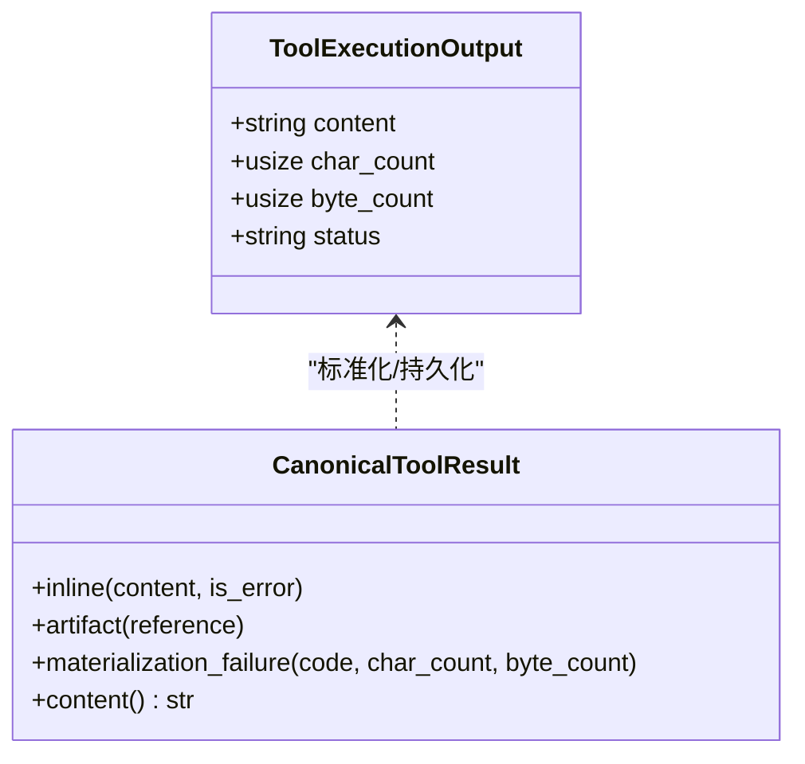
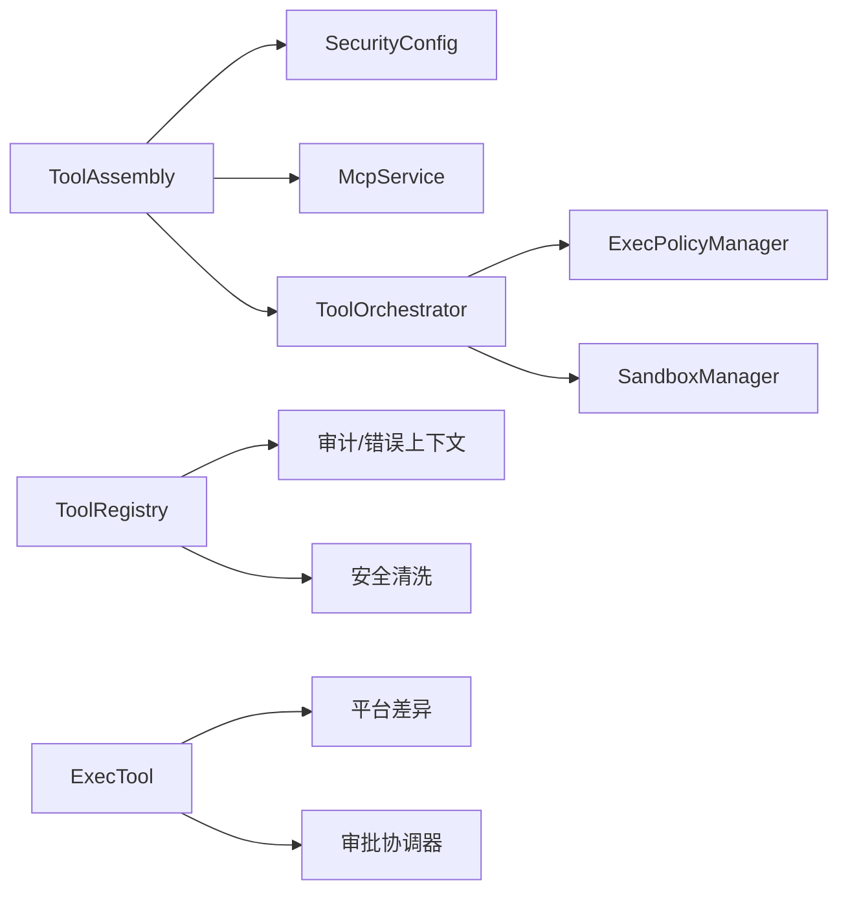

# 工具执行步骤

<cite>
**本文引用的文件**
- [agent-diva-tooling/src/registry.rs](file://agent-diva-tooling/src/registry.rs)
- [agent-diva-agent/src/tool_assembly.rs](file://agent-diva-agent/src/tool_assembly.rs)
- [agent-diva-tools/src/shell.rs](file://agent-diva-tools/src/shell.rs)
- [agent-diva-sandbox/src/orchestrator.rs](file://agent-diva-sandbox/src/orchestrator.rs)
- [agent-diva-sandbox/src/exec_policy.rs](file://agent-diva-sandbox/src/exec_policy.rs)
- [agent-diva-core/src/security/config.rs](file://agent-diva-core/src/security/config.rs)
- [agent-diva-manager/src/mcp_service.rs](file://agent-diva-manager/src/mcp_service.rs)
- [agent-diva-agent/src/context_assembly/cache_observe.rs](file://agent-diva-agent/src/context_assembly/cache_observe.rs)
- [agent-diva-core/src/tool_artifact/mod.rs](file://agent-diva-core/src/tool_artifact/mod.rs)
</cite>

## 目录
1. [简介](#简介)
2. [项目结构](#项目结构)
3. [核心组件](#核心组件)
4. [架构总览](#架构总览)
5. [详细组件分析](#详细组件分析)
6. [依赖关系分析](#依赖关系分析)
7. [性能与策略](#性能与策略)
8. [故障排查指南](#故障排查指南)
9. [结论](#结论)
10. [附录：自定义工具开发、注册与权限配置](#附录自定义工具开发注册与权限配置)

## 简介
本文面向 Agent-Diva 的“工具执行”子系统，系统化说明从工具发现、参数解析、权限验证、沙箱执行到结果处理的全生命周期；并给出并行执行、超时控制、错误重试、资源限制等执行策略；解释结果的标准化与缓存机制；提供自定义工具开发、注册与权限配置方法；最后给出监控调试技巧与优化建议。

## 项目结构
Agent-Diva 的工具执行由多层协作完成：
- 工具装配层（ToolAssembly）：根据配置组装可用工具集，决定哪些工具可见、哪些延迟激活、是否受限只读等。
- 工具注册与执行层（ToolRegistry）：维护工具清单、参数校验、全局超时、审计日志、输出清洗。
- 沙箱编排层（ToolOrchestrator）：负责审批流、自动审批、首次尝试、失败重试与升级。
- 具体工具实现（如 ExecTool）：封装命令执行、安全守卫、工作目录边界检查、与编排器集成。
- 策略与规则（ExecPolicyManager）：基于规则的允许/拒绝/提示决策，支持自动学习写入规则文件。
- 安全配置（SecurityConfig）：统一的安全级别、读写模式、路径限制、全局超时等。
- MCP 服务（McpService）：管理外部 MCP 服务器配置，间接影响工具发现与可用性。
- 上下文缓存观察（CacheObserve）：基于 CORE/DEFERRED 工具定义稳定前缀进行缓存判定。
- 工具产物（ToolArtifact）：将大结果或错误以结构化形式持久化，供后续读取。

图表来源
- [agent-diva-agent/src/tool_assembly.rs:255-616](file://agent-diva-agent/src/tool_assembly.rs#L255-L616)
- [agent-diva-tooling/src/registry.rs:363-717](file://agent-diva-tooling/src/registry.rs#L363-L717)
- [agent-diva-sandbox/src/orchestrator.rs:261-430](file://agent-diva-sandbox/src/orchestrator.rs#L261-L430)
- [agent-diva-tools/src/shell.rs:55-149](file://agent-diva-tools/src/shell.rs#L55-L149)
- [agent-diva-sandbox/src/exec_policy.rs:171-386](file://agent-diva-sandbox/src/exec_policy.rs#L171-L386)
- [agent-diva-core/src/security/config.rs:233-264](file://agent-diva-core/src/security/config.rs#L233-L264)
- [agent-diva-manager/src/mcp_service.rs:52-93](file://agent-diva-manager/src/mcp_service.rs#L52-L93)
- [agent-diva-agent/src/context_assembly/cache_observe.rs:278-316](file://agent-diva-agent/src/context_assembly/cache_observe.rs#L278-L316)
- [agent-diva-core/src/tool_artifact/mod.rs:75-120](file://agent-diva-core/src/tool_artifact/mod.rs#L75-L120)

章节来源
- [agent-diva-agent/src/tool_assembly.rs:255-616](file://agent-diva-agent/src/tool_assembly.rs#L255-L616)
- [agent-diva-tooling/src/registry.rs:363-717](file://agent-diva-tooling/src/registry.rs#L363-L717)
- [agent-diva-sandbox/src/orchestrator.rs:261-430](file://agent-diva-sandbox/src/orchestrator.rs#L261-L430)
- [agent-diva-tools/src/shell.rs:55-149](file://agent-diva-tools/src/shell.rs#L55-L149)
- [agent-diva-sandbox/src/exec_policy.rs:171-386](file://agent-diva-sandbox/src/exec_policy.rs#L171-L386)
- [agent-diva-core/src/security/config.rs:233-264](file://agent-diva-core/src/security/config.rs#L233-L264)
- [agent-diva-manager/src/mcp_service.rs:52-93](file://agent-diva-manager/src/mcp_service.rs#L52-L93)
- [agent-diva-agent/src/context_assembly/cache_observe.rs:278-316](file://agent-diva-agent/src/context_assembly/cache_observe.rs#L278-L316)
- [agent-diva-core/src/tool_artifact/mod.rs:75-120](file://agent-diva-core/src/tool_artifact/mod.rs#L75-L120)

## 核心组件
- ToolAssembly：按内置开关、计划阶段、掩码策略、网络配置、MCP 服务器、子代理模式等条件构建工具集；将部分工具标记为“延迟激活”，通过搜索后暴露给模型。
- ToolRegistry：集中注册工具、生成稳定 schema 列表、参数校验、全局超时、审计事件、输出清洗；支持 CORE/DEFERRED 分区以保证缓存友好。
- ToolOrchestrator：串联“自动审批→策略审批→首次尝试→失败重试/升级”流程；可接入 Guardian 自动学习与 ExecPolicy 规则。
- ExecTool：命令执行的具体工具，包含危险命令守卫、工作目录边界检查、平台差异解码、可选编排器集成。
- ExecPolicyManager：加载/评估/更新规则，支持禁止前缀检测、追加规则到文件、并发安全更新。
- SecurityConfig：统一安全级别、读写模式、路径限制、全局超时等，用于文件系统类工具等。
- McpService：管理 MCP 服务器配置，影响工具发现与启用。
- CacheObserve：依据 CORE/DEFERRED 工具定义的稳定前缀计算哈希，辅助 provider 缓存命中判断。
- ToolArtifact：将工具输出或错误以结构化形式持久化，支持读取与渲染。

章节来源
- [agent-diva-agent/src/tool_assembly.rs:255-616](file://agent-diva-agent/src/tool_assembly.rs#L255-L616)
- [agent-diva-tooling/src/registry.rs:363-717](file://agent-diva-tooling/src/registry.rs#L363-L717)
- [agent-diva-sandbox/src/orchestrator.rs:261-430](file://agent-diva-sandbox/src/orchestrator.rs#L261-L430)
- [agent-diva-tools/src/shell.rs:55-149](file://agent-diva-tools/src/shell.rs#L55-L149)
- [agent-diva-sandbox/src/exec_policy.rs:171-386](file://agent-diva-sandbox/src/exec_policy.rs#L171-L386)
- [agent-diva-core/src/security/config.rs:233-264](file://agent-diva-core/src/security/config.rs#L233-L264)
- [agent-diva-manager/src/mcp_service.rs:52-93](file://agent-diva-manager/src/mcp_service.rs#L52-L93)
- [agent-diva-agent/src/context_assembly/cache_observe.rs:278-316](file://agent-diva-agent/src/context_assembly/cache_observe.rs#L278-L316)
- [agent-diva-core/src/tool_artifact/mod.rs:75-120](file://agent-diva-core/src/tool_artifact/mod.rs#L75-L120)

## 架构总览
工具调用从“模型请求工具”开始，经过工具装配与注册，进入注册表执行；若涉及系统命令，则交由沙箱编排器进行审批与隔离执行；最终结果经标准化处理后返回上层。

图表来源
- [agent-diva-agent/src/tool_assembly.rs:255-616](file://agent-diva-agent/src/tool_assembly.rs#L255-L616)
- [agent-diva-tooling/src/registry.rs:534-699](file://agent-diva-tooling/src/registry.rs#L534-L699)
- [agent-diva-sandbox/src/orchestrator.rs:400-430](file://agent-diva-sandbox/src/orchestrator.rs#L400-L430)
- [agent-diva-sandbox/src/exec_policy.rs:270-324](file://agent-diva-sandbox/src/exec_policy.rs#L270-L324)
- [agent-diva-tools/src/shell.rs:333-440](file://agent-diva-tools/src/shell.rs#L333-L440)

## 详细组件分析

### 工具装配与注册（ToolAssembly + ToolRegistry）
- 工具装配根据内置开关、计划阶段、掩码策略、网络配置、MCP 服务器、子代理模式等条件注册工具；将部分工具标记为“延迟激活”，通过搜索后暴露给模型。
- 工具注册表负责：
  - 生成稳定的工具定义集合（CORE 前缀 + DEFERRED 后缀），保证缓存友好。
  - 参数校验，记录审计事件，输出清洗。
  - 全局超时控制（默认 120s），工具可覆盖自身超时。
  - 支持 deferred 工具的激活与去激活。

图表来源
- [agent-diva-agent/src/tool_assembly.rs:255-616](file://agent-diva-agent/src/tool_assembly.rs#L255-L616)
- [agent-diva-tooling/src/registry.rs:452-532](file://agent-diva-tooling/src/registry.rs#L452-L532)
- [agent-diva-tooling/src/registry.rs:534-699](file://agent-diva-tooling/src/registry.rs#L534-L699)

章节来源
- [agent-diva-agent/src/tool_assembly.rs:255-616](file://agent-diva-agent/src/tool_assembly.rs#L255-L616)
- [agent-diva-tooling/src/registry.rs:452-532](file://agent-diva-tooling/src/registry.rs#L452-L532)
- [agent-diva-tooling/src/registry.rs:534-699](file://agent-diva-tooling/src/registry.rs#L534-L699)

### 沙箱编排与审批（ToolOrchestrator + ExecPolicyManager）
- 编排器流程：
  - 预检自动审批（Guardian）：可自动允许已知安全命令，或创建规则。
  - 策略审批（ExecPolicyManager）：根据规则决定允许/提示/拒绝。
  - 首次尝试：在沙箱内执行；必要时可绕过沙箱（已批准）。
  - 失败重试：根据策略决定是否允许无沙箱重试。
- 策略管理器：
  - 加载/评估/更新规则，支持禁止前缀检测、追加规则到文件、并发安全更新。
  - 将“提示”转换为“需要用户批准”，并提供修正建议。

图表来源
- [agent-diva-sandbox/src/orchestrator.rs:400-758](file://agent-diva-sandbox/src/orchestrator.rs#L400-L758)
- [agent-diva-sandbox/src/exec_policy.rs:270-386](file://agent-diva-sandbox/src/exec_policy.rs#L270-L386)

章节来源
- [agent-diva-sandbox/src/orchestrator.rs:400-758](file://agent-diva-sandbox/src/orchestrator.rs#L400-L758)
- [agent-diva-sandbox/src/exec_policy.rs:270-386](file://agent-diva-sandbox/src/exec_policy.rs#L270-L386)

### 命令执行与安全守卫（ExecTool）
- 命令执行：
  - 解析 working_dir，强制工作区边界检查，防止越界访问。
  - 危险命令守卫：拦截 rm -rf、磁盘操作、系统关机等危险模式。
  - 平台差异：Windows PowerShell UTF-8 输出前缀、管道字节解码。
  - 可选编排器集成：当启用审批策略时，走沙箱编排流程；否则直接执行。
- 超时控制：
  - 工具级超时（exec_timeout），编排后可叠加额外缓冲时间。
  - 注册表级全局超时（global_timeout_secs），保护长时间运行。

图表来源
- [agent-diva-tools/src/shell.rs:333-538](file://agent-diva-tools/src/shell.rs#L333-L538)
- [agent-diva-tools/src/shell.rs:170-237](file://agent-diva-tools/src/shell.rs#L170-L237)

章节来源
- [agent-diva-tools/src/shell.rs:333-538](file://agent-diva-tools/src/shell.rs#L333-L538)
- [agent-diva-tools/src/shell.rs:170-237](file://agent-diva-tools/src/shell.rs#L170-L237)

### 结果标准化与缓存机制
- 结果标准化：
  - 注册表执行后对输出进行清洗，记录审计事件（工具名、耗时、结果大小、状态）。
  - 工具产物模块将成功或失败结果以结构化形式持久化，支持读取与渲染。
- 缓存机制：
  - 工具定义分为 CORE 与 DEFERRED，CORE 前缀稳定，有助于 provider 缓存锚点。
  - 上下文缓存观察根据 CORE 工具定义变化计算哈希，避免不必要的缓存失效。

图表来源
- [agent-diva-tooling/src/registry.rs:15-21](file://agent-diva-tooling/src/registry.rs#L15-L21)
- [agent-diva-core/src/tool_artifact/mod.rs:75-120](file://agent-diva-core/src/tool_artifact/mod.rs#L75-L120)
- [agent-diva-agent/src/context_assembly/cache_observe.rs:278-316](file://agent-diva-agent/src/context_assembly/cache_observe.rs#L278-L316)

章节来源
- [agent-diva-tooling/src/registry.rs:15-21](file://agent-diva-tooling/src/registry.rs#L15-L21)
- [agent-diva-core/src/tool_artifact/mod.rs:75-120](file://agent-diva-core/src/tool_artifact/mod.rs#L75-L120)
- [agent-diva-agent/src/context_assembly/cache_observe.rs:278-316](file://agent-diva-agent/src/context_assembly/cache_observe.rs#L278-L316)

## 依赖关系分析
- ToolAssembly 依赖：
  - 安全配置（SecurityConfig）：控制文件系统工具的安全级别与工作区限制。
  - MCP 服务（McpService）：管理外部 MCP 服务器配置，影响工具发现。
  - 沙箱编排（ToolOrchestrator）：为 shell 工具提供审批与隔离执行。
- ToolRegistry 依赖：
  - 审计与错误上下文：记录执行审计与错误详情。
  - 安全清洗：输出清洗避免注入或污染。
- ToolOrchestrator 依赖：
  - 策略管理器（ExecPolicyManager）：规则评估与自动学习。
  - 沙箱管理器（SandboxManager）：平台执行与权限控制。
- ExecTool 依赖：
  - 平台差异处理：Windows PowerShell 与 POSIX sh 的差异。
  - 审批协调器：与 GUI/CLI 交互获取用户批准。

图表来源
- [agent-diva-agent/src/tool_assembly.rs:255-616](file://agent-diva-agent/src/tool_assembly.rs#L255-L616)
- [agent-diva-tooling/src/registry.rs:534-699](file://agent-diva-tooling/src/registry.rs#L534-L699)
- [agent-diva-sandbox/src/orchestrator.rs:400-758](file://agent-diva-sandbox/src/orchestrator.rs#L400-L758)
- [agent-diva-tools/src/shell.rs:333-538](file://agent-diva-tools/src/shell.rs#L333-L538)

章节来源
- [agent-diva-agent/src/tool_assembly.rs:255-616](file://agent-diva-agent/src/tool_assembly.rs#L255-L616)
- [agent-diva-tooling/src/registry.rs:534-699](file://agent-diva-tooling/src/registry.rs#L534-L699)
- [agent-diva-sandbox/src/orchestrator.rs:400-758](file://agent-diva-sandbox/src/orchestrator.rs#L400-L758)
- [agent-diva-tools/src/shell.rs:333-538](file://agent-diva-tools/src/shell.rs#L333-L538)

## 性能与策略
- 并行执行：
  - 工具注册表本身不直接调度并行；可通过上层任务并行调用不同工具。
  - 沙箱管理器在不同平台实现中可能支持进程级并行，但需关注资源竞争。
- 超时控制：
  - 工具级超时（exec_timeout）+ 注册表全局超时（global_timeout_secs）。
  - 编排器在执行请求中设置超时，确保长时间命令被终止。
- 错误重试：
  - 编排器在沙箱拒绝或平台不可用时，根据策略决定是否允许无沙箱重试。
  - 禁止前缀（如 sudo、bash -c）不允许自动重试，防止滥用。
- 资源限制：
  - 安全配置限制工作区范围、读写模式、最大动作数、全局超时。
  - 工具输出清洗与截断，避免过大结果阻塞上下文。

章节来源
- [agent-diva-tooling/src/registry.rs:363-717](file://agent-diva-tooling/src/registry.rs#L363-L717)
- [agent-diva-sandbox/src/orchestrator.rs:664-758](file://agent-diva-sandbox/src/orchestrator.rs#L664-L758)
- [agent-diva-sandbox/src/exec_policy.rs:77-96](file://agent-diva-sandbox/src/exec_policy.rs#L77-L96)
- [agent-diva-core/src/security/config.rs:233-264](file://agent-diva-core/src/security/config.rs#L233-L264)

## 故障排查指南
- 常见问题：
  - 工具未找到：检查工具是否注册、是否处于 deferred 状态且未被激活。
  - 参数无效：查看注册表参数校验错误与审计日志。
  - 超时：确认工具级与全局超时配置，检查命令是否卡死。
  - 审批拒绝：查看策略规则与用户审批历史，必要时添加允许规则。
  - 沙箱平台不支持：在非支持平台（如 macOS 缺少 sandbox-exec）会返回平台不可用错误。
- 调试技巧：
  - 启用审计日志：注册表执行前后记录工具名、耗时、结果大小、状态。
  - 检查策略规则：使用策略管理器评估命令，确认是否匹配 Allow/Prompt/Forbidden。
  - 观察缓存行为：确认 CORE/DEFERRED 工具定义变化是否导致缓存失效。
  - 工具产物：读取持久化的工具结果或错误，定位问题根因。

章节来源
- [agent-diva-tooling/src/registry.rs:534-699](file://agent-diva-tooling/src/registry.rs#L534-L699)
- [agent-diva-sandbox/src/exec_policy.rs:270-386](file://agent-diva-sandbox/src/exec_policy.rs#L270-L386)
- [agent-diva-core/src/tool_artifact/mod.rs:75-120](file://agent-diva-core/src/tool_artifact/mod.rs#L75-L120)
- [agent-diva-agent/src/context_assembly/cache_observe.rs:278-316](file://agent-diva-agent/src/context_assembly/cache_observe.rs#L278-L316)

## 结论
Agent-Diva 的工具执行系统通过分层设计实现了灵活的工具发现、严格的权限控制、安全的沙箱执行与标准化的结果处理。结合策略规则、自动学习、缓存优化与产物持久化，系统在安全性、可观测性与性能之间取得平衡。开发者可基于此框架扩展自定义工具、调整权限策略、优化执行路径，并通过审计与产物进行问题定位。

## 附录：自定义工具开发、注册与权限配置
- 开发自定义工具：
  - 实现工具接口（name、description、parameters、execute）。
  - 可选择是否纳入 deferred 目录，通过搜索激活。
- 注册新工具：
  - 在 ToolAssembly 中根据配置条件注册工具。
  - 使用 register 或 register_in_partition 指定分区。
- 配置工具权限：
  - 通过 Mask 策略限制工具可用性。
  - 通过 ExecPolicy 规则控制命令审批与允许。
  - 通过 SecurityConfig 设置安全级别与工作区限制。
- 实际代码示例路径：
  - 工具注册与装配：[agent-diva-agent/src/tool_assembly.rs:255-616](file://agent-diva-agent/src/tool_assembly.rs#L255-L616)
  - 工具执行与超时：[agent-diva-tooling/src/registry.rs:534-699](file://agent-diva-tooling/src/registry.rs#L534-L699)
  - 沙箱编排与重试：[agent-diva-sandbox/src/orchestrator.rs:400-758](file://agent-diva-sandbox/src/orchestrator.rs#L400-L758)
  - 命令执行与安全守卫：[agent-diva-tools/src/shell.rs:333-538](file://agent-diva-tools/src/shell.rs#L333-L538)
  - 策略规则与自动学习：[agent-diva-sandbox/src/exec_policy.rs:270-386](file://agent-diva-sandbox/src/exec_policy.rs#L270-L386)
  - 安全配置验证：[agent-diva-core/src/security/config.rs:233-264](file://agent-diva-core/src/security/config.rs#L233-L264)
  - MCP 服务器配置：[agent-diva-manager/src/mcp_service.rs:52-93](file://agent-diva-manager/src/mcp_service.rs#L52-L93)
  - 缓存观察与稳定性：[agent-diva-agent/src/context_assembly/cache_observe.rs:278-316](file://agent-diva-agent/src/context_assembly/cache_observe.rs#L278-L316)
  - 工具产物持久化：[agent-diva-core/src/tool_artifact/mod.rs:75-120](file://agent-diva-core/src/tool_artifact/mod.rs#L75-L120)