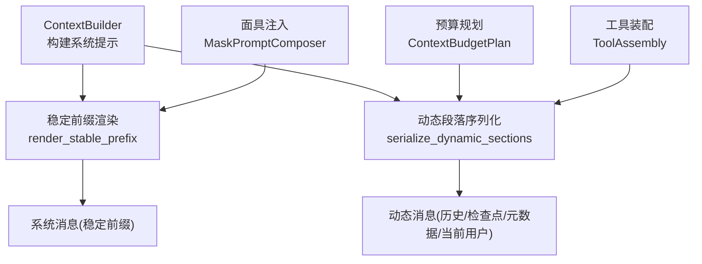
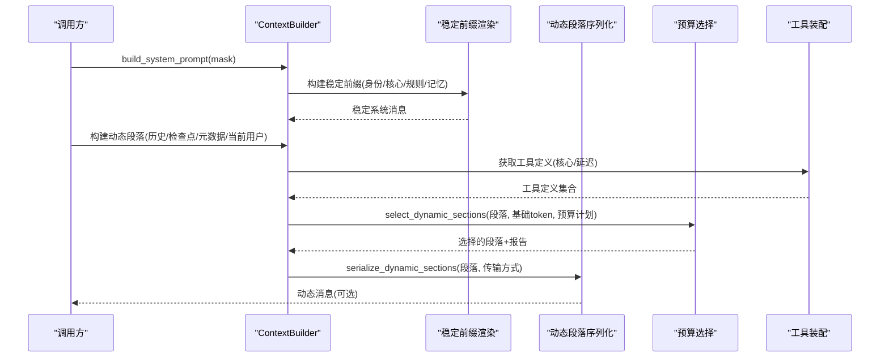
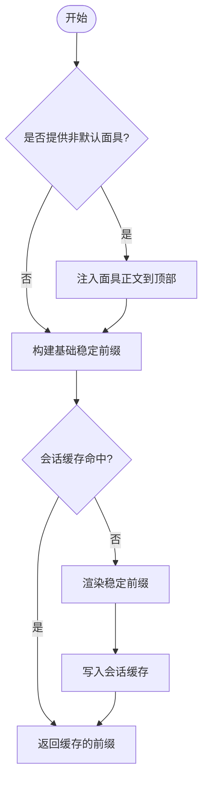
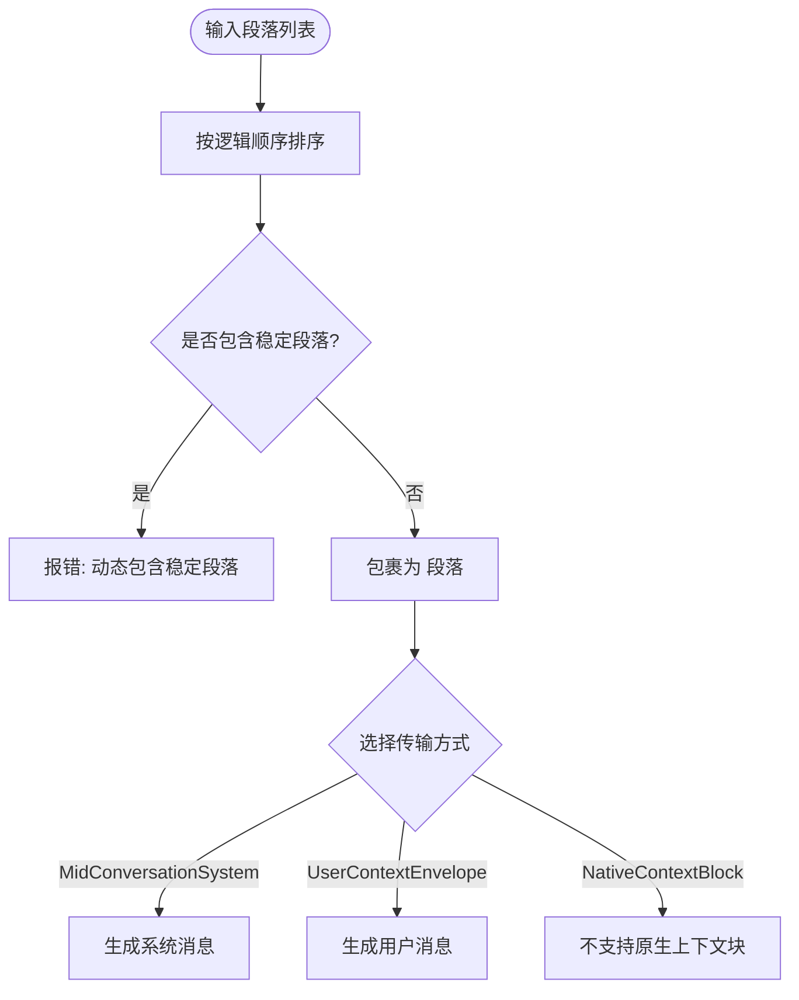
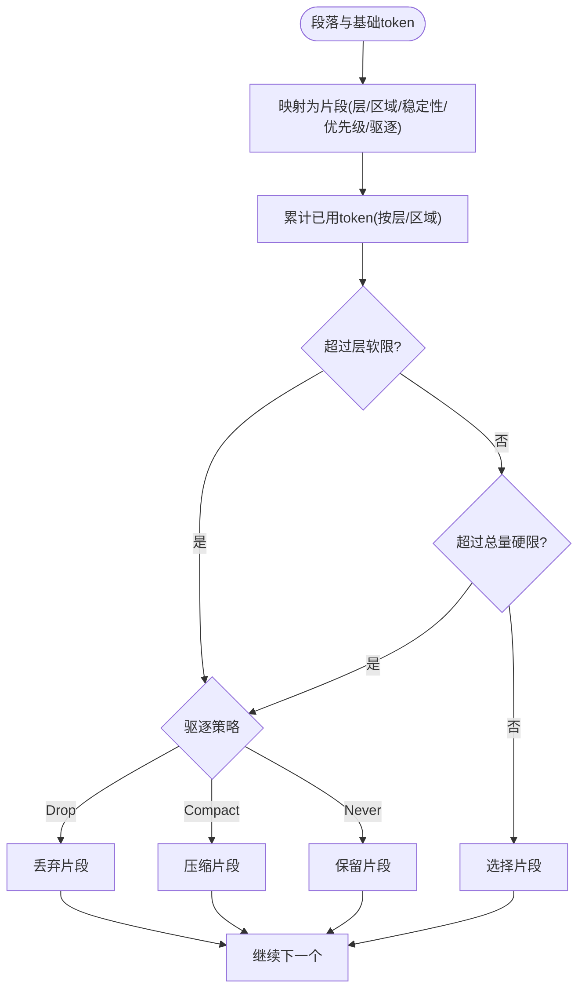
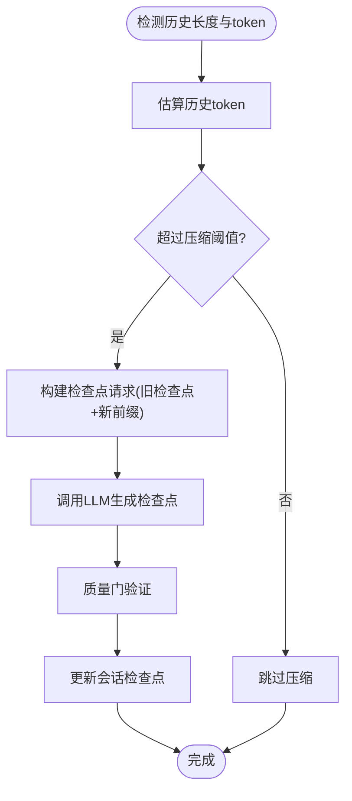
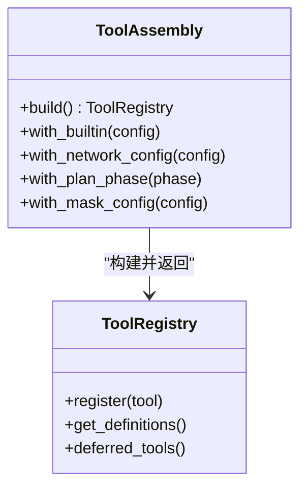
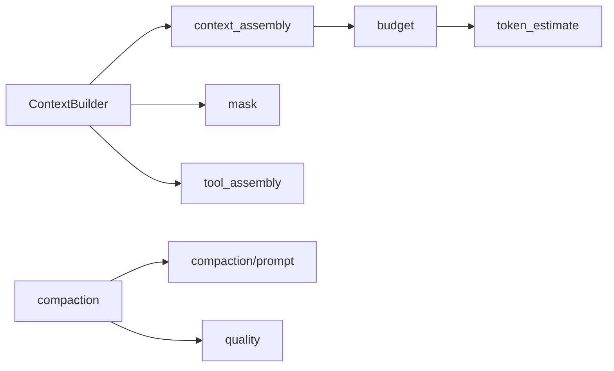

# 提示词生成

<cite>
**本文引用的文件**
- [agent-diva-agent/src/context.rs](file://agent-diva-agent/src/context.rs)
- [agent-diva-agent/src/context_assembly/mod.rs](file://agent-diva-agent/src/context_assembly/mod.rs)
- [agent-diva-agent/src/context_assembly/budget.rs](file://agent-diva-agent/src/context_assembly/budget.rs)
- [agent-diva-agent/src/context_budget.rs](file://agent-diva-agent/src/context_budget.rs)
- [agent-diva-agent/src/compaction/prompt.rs](file://agent-diva-agent/src/compaction/prompt.rs)
- [agent-diva-agent/src/compaction/mod.rs](file://agent-diva-agent/src/compaction/mod.rs)
- [agent-diva-agent/src/tool_assembly.rs](file://agent-diva-agent/src/tool_assembly.rs)
- [agent-diva-agent/src/mask/mask_prompt_composer.rs](file://agent-diva-agent/src/mask/mask_prompt_composer.rs)
- [agent-diva-agent/src/context/prompt.rs](file://agent-diva-agent/src/context/prompt.rs)
- [agent-diva-core/src/quality/context_budget.rs](file://agent-diva-core/src/quality/context_budget.rs)
</cite>

## 目录
1. [简介](#简介)
2. [项目结构](#项目结构)
3. [核心组件](#核心组件)
4. [架构总览](#架构总览)
5. [详细组件分析](#详细组件分析)
6. [依赖关系分析](#依赖关系分析)
7. [性能考量](#性能考量)
8. [故障排查指南](#故障排查指南)
9. [结论](#结论)
10. [附录](#附录)

## 简介
本文件面向“单轮对话中的提示词构建”这一目标，系统化说明 agent-diva 如何将系统提示、用户消息、历史上下文、工具描述、记忆内容等来源组装为一次 LLM 调用所需的完整提示。文档重点覆盖：
- 提示词模板系统与变量替换、动态内容插入机制
- 上下文预算管理与内容裁剪策略（长对话压缩、重要信息保留、无关内容过滤）
- 如何自定义提示词模板、扩展上下文来源、优化提示词效果
- 以代码路径与流程图展示构建流程、调试方法与性能调优技巧

## 项目结构
提示词构建由“稳定前缀 + 动态后缀”的两段式装配构成：
- 稳定前缀：身份、冻结核心、规则与技能、记忆策略与索引等，按固定顺序拼接并缓存，用于提示词缓存命中。
- 动态后缀：历史、会话检查点、预取召回、易变元数据、计划守卫、当前用户等，在每次调用时序列化到一条消息中，支持多种传输方式。

图示来源
- [agent-diva-agent/src/context.rs:130-157](file://agent-diva-agent/src/context.rs#L130-L157)
- [agent-diva-agent/src/context_assembly/mod.rs:174-229](file://agent-diva-agent/src/context_assembly/mod.rs#L174-L229)
- [agent-diva-agent/src/context_assembly/budget.rs:119-178](file://agent-diva-agent/src/context_assembly/budget.rs#L119-L178)
- [agent-diva-agent/src/tool_assembly.rs:240-616](file://agent-diva-agent/src/tool_assembly.rs#L240-L616)
- [agent-diva-agent/src/mask/mask_prompt_composer.rs:12-33](file://agent-diva-agent/src/mask/mask_prompt_composer.rs#L12-L33)

章节来源
- [agent-diva-agent/src/context.rs:1-200](file://agent-diva-agent/src/context.rs#L1-L200)
- [agent-diva-agent/src/context_assembly/mod.rs:1-115](file://agent-diva-agent/src/context_assembly/mod.rs#L1-L115)
- [agent-diva-agent/src/context_assembly/budget.rs:1-118](file://agent-diva-agent/src/context_assembly/budget.rs#L1-L118)

## 核心组件
- ContextBuilder：负责从工作区、人格、技能、记忆等来源构建系统提示，并按会话键维护稳定前缀缓存。
- PromptSection 与 ContextSection：定义稳定的逻辑段落与顺序，区分稳定/会话稳定/回合易变三类稳定性。
- 预算模块：将上下文划分为三层区域（稳定前缀、规范检查点、活跃尾部），并为每个层设置软/硬限制，决定哪些片段被选择或丢弃。
- 工具装配：根据配置与安全策略注册工具，并将工具定义纳入上下文预算与延迟加载。
- 面具注入：非默认面具的正文会作为额外系统提示注入到稳定前缀顶部。
- 压缩提示：为长对话生成“规范检查点”，保留关键信息与标识符，避免重复大结果体进入上下文。

章节来源
- [agent-diva-agent/src/context.rs:53-157](file://agent-diva-agent/src/context.rs#L53-L157)
- [agent-diva-agent/src/context_assembly/mod.rs:26-124](file://agent-diva-agent/src/context_assembly/mod.rs#L26-L124)
- [agent-diva-agent/src/context_assembly/budget.rs:13-118](file://agent-diva-agent/src/context_assembly/budget.rs#L13-L118)
- [agent-diva-agent/src/tool_assembly.rs:42-616](file://agent-diva-agent/src/tool_assembly.rs#L42-L616)
- [agent-diva-agent/src/mask/mask_prompt_composer.rs:1-33](file://agent-diva-agent/src/mask/mask_prompt_composer.rs#L1-L33)
- [agent-diva-agent/src/compaction/prompt.rs:1-31](file://agent-diva-agent/src/compaction/prompt.rs#L1-L31)

## 架构总览
下图展示了单轮对话中提示词构建的关键步骤：从稳定前缀构建到动态段落序列化，再到预算选择与最终消息组装。

图示来源
- [agent-diva-agent/src/context.rs:130-157](file://agent-diva-agent/src/context.rs#L130-L157)
- [agent-diva-agent/src/context_assembly/mod.rs:174-229](file://agent-diva-agent/src/context_assembly/mod.rs#L174-L229)
- [agent-diva-agent/src/context_assembly/budget.rs:230-285](file://agent-diva-agent/src/context_assembly/budget.rs#L230-L285)
- [agent-diva-agent/src/tool_assembly.rs:240-616](file://agent-diva-agent/src/tool_assembly.rs#L240-L616)

## 详细组件分析

### 系统提示构建与面具注入
- 系统提示由稳定前缀组成，包含身份、冻结核心、规则与技能、记忆策略与索引等。
- 面具注入：若提供非默认面具且正文非空，则将其正文注入到稳定前缀顶部，形成“方案A”的优先级位置。
- 会话级缓存：同一会话键下的稳定前缀会被缓存，直到面具、记忆版本、技能纪元等发生变化。

图示来源
- [agent-diva-agent/src/context.rs:130-157](file://agent-diva-agent/src/context.rs#L130-L157)
- [agent-diva-agent/src/mask/mask_prompt_composer.rs:12-33](file://agent-diva-agent/src/mask/mask_prompt_composer.rs#L12-L33)

章节来源
- [agent-diva-agent/src/context.rs:130-157](file://agent-diva-agent/src/context.rs#L130-L157)
- [agent-diva-agent/src/mask/mask_prompt_composer.rs:1-33](file://agent-diva-agent/src/mask/mask_prompt_composer.rs#L1-L33)

### 动态段落序列化与传输
- 动态段落包括历史、会话检查点、预取召回、易变元数据、计划守卫、当前用户等，按固定顺序排序后序列化。
- 支持两种传输方式：对话中间的系统消息或用户上下文信封；原生上下文块不被通用消息路径支持。
- 边界转义：对特殊标记进行转义，防止破坏上下文边界。

图示来源
- [agent-diva-agent/src/context_assembly/mod.rs:191-239](file://agent-diva-agent/src/context_assembly/mod.rs#L191-L239)

章节来源
- [agent-diva-agent/src/context_assembly/mod.rs:191-239](file://agent-diva-agent/src/context_assembly/mod.rs#L191-L239)

### 上下文预算管理与内容裁剪
- 三层区域：稳定前缀、规范检查点、活跃尾部；每层有软/硬限制。
- 层预算：冻结核心与规则、工具模式（核心/延迟）、L1索引、会话检查点、预取召回、压缩摘要、历史、工具结果内联、当前回合。
- 选择策略：当某层超过软限或总量超过硬限时，依据驱逐策略（从不/压缩/丢弃）决定处理动作；回忆优先被丢弃，会话检查点不可丢弃。

图示来源
- [agent-diva-agent/src/context_assembly/budget.rs:230-285](file://agent-diva-agent/src/context_assembly/budget.rs#L230-L285)
- [agent-diva-agent/src/context_assembly/budget.rs:373-415](file://agent-diva-agent/src/context_assembly/budget.rs#L373-L415)

章节来源
- [agent-diva-agent/src/context_assembly/budget.rs:13-118](file://agent-diva-agent/src/context_assembly/budget.rs#L13-L118)
- [agent-diva-agent/src/context_assembly/budget.rs:230-285](file://agent-diva-agent/src/context_assembly/budget.rs#L230-L285)
- [agent-diva-agent/src/context_assembly/budget.rs:373-415](file://agent-diva-agent/src/context_assembly/budget.rs#L373-L415)

### 长对话压缩与检查点生成
- 压缩触发：当历史估计超过阈值（历史预算×压缩阈值比例）时触发。
- 检查点提示：使用版本化的系统提示，要求输出结构化检查点，合并旧检查点与新压缩前缀，保留路径、ID、命令、决策、阻塞项与工件引用。
- 质量门：对生成的摘要进行验证，确保不虚构事实，不确定性标注。

图示来源
- [agent-diva-agent/src/context_budget.rs:164-207](file://agent-diva-agent/src/context_budget.rs#L164-L207)
- [agent-diva-agent/src/compaction/prompt.rs:1-31](file://agent-diva-agent/src/compaction/prompt.rs#L1-L31)
- [agent-diva-agent/src/compaction/mod.rs:1-33](file://agent-diva-agent/src/compaction/mod.rs#L1-L33)

章节来源
- [agent-diva-agent/src/context_budget.rs:164-207](file://agent-diva-agent/src/context_budget.rs#L164-L207)
- [agent-diva-agent/src/compaction/prompt.rs:1-31](file://agent-diva-agent/src/compaction/prompt.rs#L1-L31)
- [agent-diva-agent/src/compaction/mod.rs:1-33](file://agent-diva-agent/src/compaction/mod.rs#L1-L33)

### 工具描述与延迟加载
- 工具装配根据内置配置、网络配置、安全策略、计划阶段等条件注册工具。
- 工具定义分为核心与延迟两类；延迟工具通过搜索激活，减少初始上下文体积。
- 面具可进一步限制可用工具集，实现细粒度能力边界。

图示来源
- [agent-diva-agent/src/tool_assembly.rs:240-616](file://agent-diva-agent/src/tool_assembly.rs#L240-L616)

章节来源
- [agent-diva-agent/src/tool_assembly.rs:240-616](file://agent-diva-agent/src/tool_assembly.rs#L240-L616)

### 变量替换与动态内容插入机制
- 稳定前缀：通过 ContextBuilder 按会话键构建并缓存，变化时失效并重算。
- 动态内容：历史、检查点、元数据、当前用户等作为动态段落序列化到一条消息中，按固定顺序和边界标记组织。
- 工具定义：核心工具立即可见，延迟工具按需激活，减少上下文噪声。
- 面具注入：非默认面具正文直接插入稳定前缀顶部，作为强指令源。

章节来源
- [agent-diva-agent/src/context.rs:130-157](file://agent-diva-agent/src/context.rs#L130-L157)
- [agent-diva-agent/src/context_assembly/mod.rs:191-239](file://agent-diva-agent/src/context_assembly/mod.rs#L191-L239)
- [agent-diva-agent/src/tool_assembly.rs:240-616](file://agent-diva-agent/src/tool_assembly.rs#L240-L616)
- [agent-diva-agent/src/mask/mask_prompt_composer.rs:12-33](file://agent-diva-agent/src/mask/mask_prompt_composer.rs#L12-L33)

## 依赖关系分析
- ContextBuilder 依赖 context_assembly 进行段落渲染与序列化，依赖 mask 进行面具注入，依赖 tool_assembly 获取工具定义。
- budget 模块依赖 token_estimate 与 provider Message 类型进行测量与报告。
- compaction 模块依赖 prompt 中的版本化提示与 quality 进行摘要质量校验。
- core quality 提供跨模块的上下文预算策略默认值与溢出行为。

图示来源
- [agent-diva-agent/src/context.rs:1-24](file://agent-diva-agent/src/context.rs#L1-L24)
- [agent-diva-agent/src/context_assembly/mod.rs:1-24](file://agent-diva-agent/src/context_assembly/mod.rs#L1-L24)
- [agent-diva-agent/src/context_assembly/budget.rs:1-12](file://agent-diva-agent/src/context_assembly/budget.rs#L1-L12)
- [agent-diva-agent/src/compaction/mod.rs:1-33](file://agent-diva-agent/src/compaction/mod.rs#L1-L33)
- [agent-diva-core/src/quality/context_budget.rs:35-75](file://agent-diva-core/src/quality/context_budget.rs#L35-L75)

章节来源
- [agent-diva-agent/src/context.rs:1-24](file://agent-diva-agent/src/context.rs#L1-L24)
- [agent-diva-agent/src/context_assembly/mod.rs:1-24](file://agent-diva-agent/src/context_assembly/mod.rs#L1-L24)
- [agent-diva-agent/src/context_assembly/budget.rs:1-12](file://agent-diva-agent/src/context_assembly/budget.rs#L1-L12)
- [agent-diva-agent/src/compaction/mod.rs:1-33](file://agent-diva-agent/src/compaction/mod.rs#L1-L33)
- [agent-diva-core/src/quality/context_budget.rs:35-75](file://agent-diva-core/src/quality/context_budget.rs#L35-L75)

## 性能考量
- 稳定前缀缓存：同一会话下避免重复渲染，提升提示词缓存命中率。
- 工具延迟加载：仅暴露必要工具定义，减少初始上下文体积。
- 预算分层控制：按层软限与总量硬限组合，避免过度裁剪导致信息丢失。
- 压缩阈值可调：通过环境变量或模型能力表调整最大上下文与压缩触发点。
- 段落边界转义：防止特殊标记破坏上下文结构，降低解析错误风险。

[本节为通用指导，无需特定文件来源]

## 故障排查指南
- 稳定前缀包含易变段落：检查段落稳定性分类与顺序，确保仅稳定段落进入前缀。
- 动态段落包含稳定段落：检查序列化入口，确保动态段落仅包含回合易变内容。
- 原生上下文块不支持：切换到对话中间系统消息或用户上下文信封传输。
- 预算压力过高：调整 system_budget_ratio、compact_threshold_ratio 或 max_tokens；观察报告中的 dropped/compacted 条目定位问题段落。
- 压缩失败：检查压缩提示版本与质量门；确认旧检查点与新前缀格式正确。

章节来源
- [agent-diva-agent/src/context_assembly/mod.rs:144-172](file://agent-diva-agent/src/context_assembly/mod.rs#L144-L172)
- [agent-diva-agent/src/context_assembly/budget.rs:230-285](file://agent-diva-agent/src/context_assembly/budget.rs#L230-L285)
- [agent-diva-agent/src/context_budget.rs:164-207](file://agent-diva-agent/src/context_budget.rs#L164-L207)
- [agent-diva-agent/src/compaction/prompt.rs:1-31](file://agent-diva-agent/src/compaction/prompt.rs#L1-L31)

## 结论
agent-diva 的提示词生成采用“稳定前缀 + 动态后缀”的两段式装配，结合严格的段落顺序、稳定性分类与预算分层控制，实现了高缓存命中率与可控的信息裁剪。面具注入提供了灵活的指令扩展点，工具延迟加载减少了上下文噪声，压缩检查点保障了长对话的可扩展性。通过环境变量与模型能力表，运营者可灵活调整上下文预算与压缩策略，达到性能与效果的平衡。

[本节为总结性内容，无需特定文件来源]

## 附录
- 自定义提示词模板：通过面具文件注入非默认正文，置于稳定前缀顶部，作为强指令源。
- 新增上下文来源：实现新的 PromptSection 并在上下文顺序中注册，注意稳定性分类与预算层映射。
- 调试提示词生成：启用日志观察段落顺序、预算报告与压缩事件；检查边界转义与传输方式。
- 性能调优技巧：合理设置 system_budget_ratio、compact_threshold_ratio、keep_recent_count；利用工具延迟加载与段落裁剪；监控缓存命中与压缩触发频率。

[本节为操作指导，无需特定文件来源]