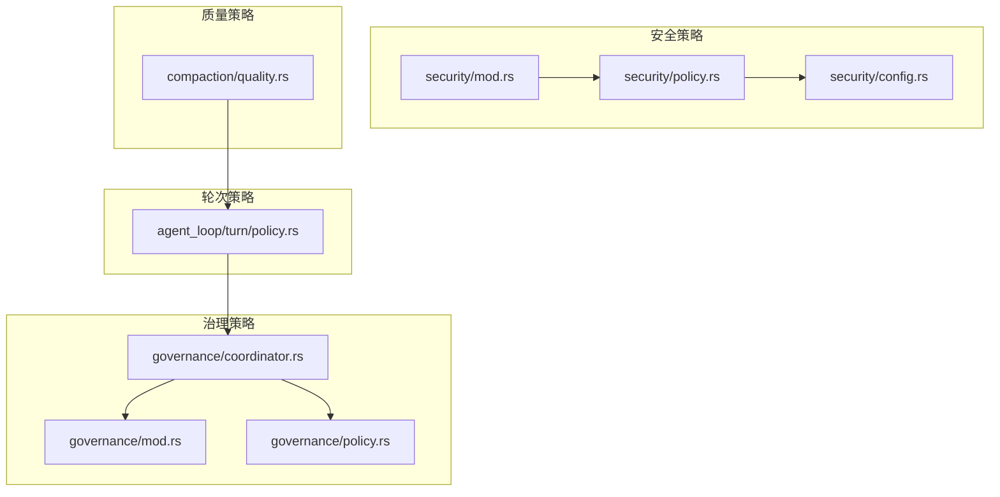
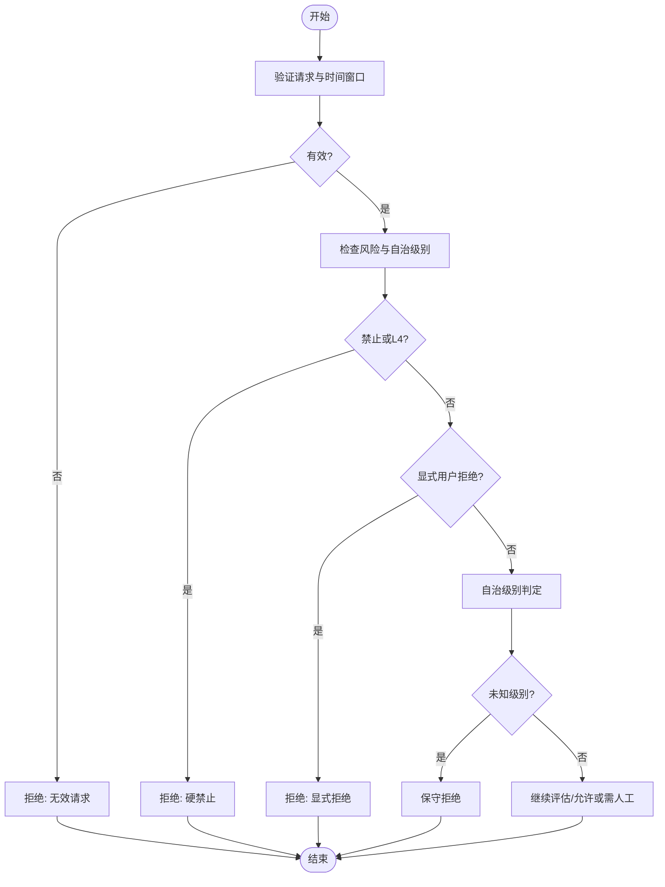
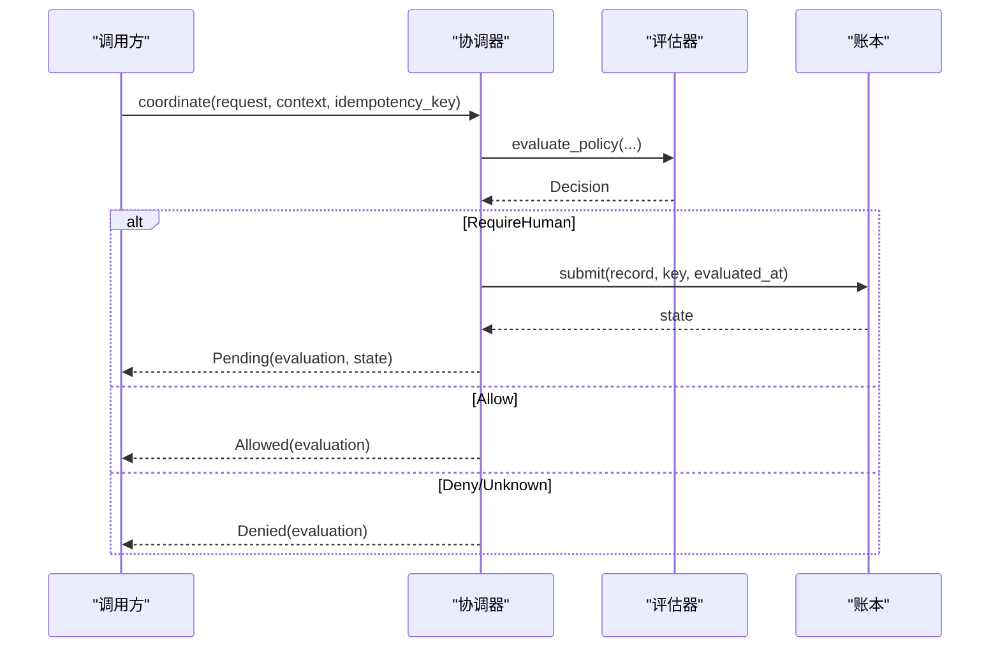
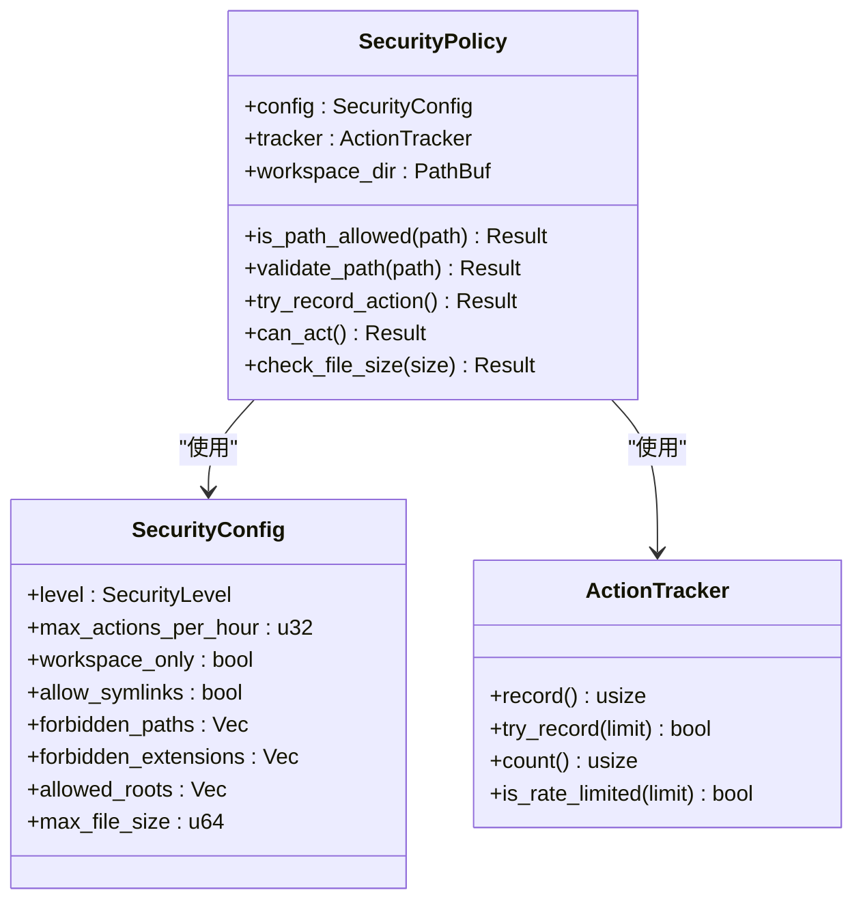
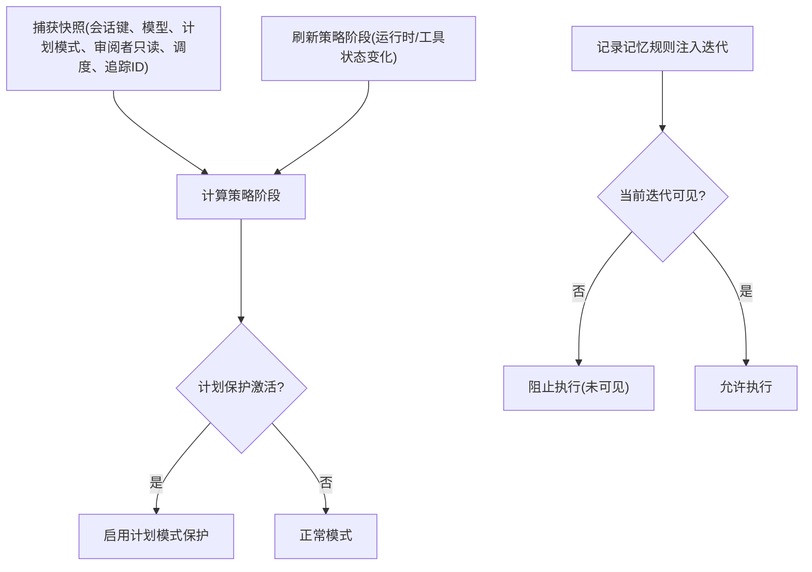
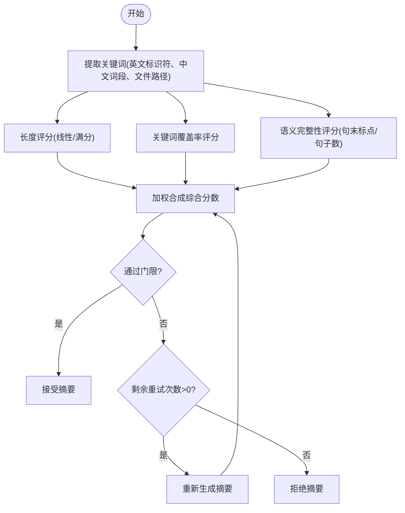
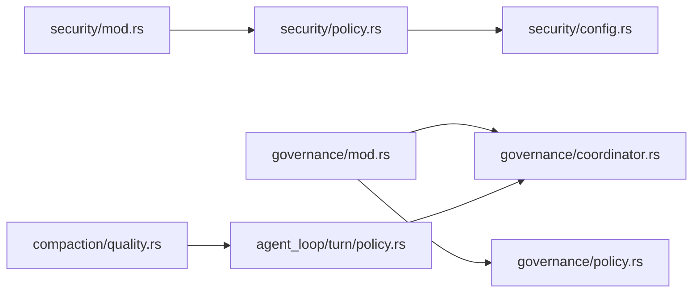

# 策略管理

<cite>
**本文引用的文件**
- [agent-diva-core/src/governance/mod.rs](file://agent-diva-core/src/governance/mod.rs)
- [agent-diva-core/src/governance/policy.rs](file://agent-diva-core/src/governance/policy.rs)
- [agent-diva-core/src/governance/coordinator.rs](file://agent-diva-core/src/governance/coordinator.rs)
- [agent-diva-agent/src/agent_loop/turn/policy.rs](file://agent-diva-agent/src/agent_loop/turn/policy.rs)
- [agent-diva-core/src/security/mod.rs](file://agent-diva-core/src/security/mod.rs)
- [agent-diva-core/src/security/policy.rs](file://agent-diva-core/src/security/policy.rs)
- [agent-diva-core/src/security/config.rs](file://agent-diva-core/src/security/config.rs)
- [agent-diva-agent/src/compaction/quality.rs](file://agent-diva-agent/src/compaction/quality.rs)
</cite>

## 目录
1. [简介](#简介)
2. [项目结构](#项目结构)
3. [核心组件](#核心组件)
4. [架构总览](#架构总览)
5. [详细组件分析](#详细组件分析)
6. [依赖关系分析](#依赖关系分析)
7. [性能考虑](#性能考虑)
8. [故障排查指南](#故障排查指南)
9. [结论](#结论)
10. [附录](#附录)

## 简介
本文件围绕“轮次策略管理”展开，聚焦策略系统在多轮对话（turn）处理中的角色：策略如何定义、加载、评估与执行；内置策略类型（安全策略、质量策略、治理策略等）如何协同工作；策略组合与优先级、冲突解决与动态切换机制；以及如何开发自定义策略、配置参数、监控效果、进行版本管理与向后兼容。文档以仓库中实际代码为依据，提供可追溯的源码路径与图示。

## 项目结构
策略系统横跨多个模块：
- 治理策略（governance）：提供领域无关的审批流与确定性策略评估，协调人类审批与持久化记录。
- 安全策略（security）：提供路径校验、速率限制、读写模式控制、注入检测、工具结果过滤等运行时安全能力。
- 轮次策略（turn policy）：在每轮对话中维护快照与阶段，驱动策略生效范围（如计划模式下的只读审查）。
- 质量策略（compaction quality）：对上下文压缩摘要进行多维质量评估，支撑重试与回退。



图表来源
- [agent-diva-core/src/governance/mod.rs:1-17](file://agent-diva-core/src/governance/mod.rs#L1-L17)
- [agent-diva-core/src/governance/policy.rs:1-130](file://agent-diva-core/src/governance/policy.rs#L1-L130)
- [agent-diva-core/src/governance/coordinator.rs:1-104](file://agent-diva-core/src/governance/coordinator.rs#L1-L104)
- [agent-diva-core/src/security/mod.rs:1-69](file://agent-diva-core/src/security/mod.rs#L1-L69)
- [agent-diva-core/src/security/policy.rs:1-364](file://agent-diva-core/src/security/policy.rs#L1-L364)
- [agent-diva-core/src/security/config.rs:1-366](file://agent-diva-core/src/security/config.rs#L1-L366)
- [agent-diva-agent/src/agent_loop/turn/policy.rs:1-108](file://agent-diva-agent/src/agent_loop/turn/policy.rs#L1-L108)
- [agent-diva-agent/src/compaction/quality.rs:1-611](file://agent-diva-agent/src/compaction/quality.rs#L1-L611)

章节来源
- [agent-diva-core/src/governance/mod.rs:1-17](file://agent-diva-core/src/governance/mod.rs#L1-L17)
- [agent-diva-core/src/security/mod.rs:1-69](file://agent-diva-core/src/security/mod.rs#L1-L69)
- [agent-diva-agent/src/agent_loop/turn/policy.rs:1-108](file://agent-diva-agent/src/agent_loop/turn/policy.rs#L1-L108)

## 核心组件
- 治理策略评估器：纯函数式、无副作用的策略评估，依据请求、自治级别、显式用户决策等输入给出允许/拒绝/需人工审批的结果，并附带约束与证据引用。
- 治理协调器：将评估结果与持久化审批账本结合，仅在需要人类审批时提交待决记录，支持幂等键与CAS语义。
- 安全策略：统一的安全框架，整合配置、路径校验、速率限制、读写模式、注入检测、工具输出过滤等。
- 轮次策略快照：每轮对话的状态快照，包含会话键、模型、是否计划模式、当前策略阶段、审阅者只读标志、调度状态、追踪ID等，用于限定策略作用域。
- 质量策略：对摘要生成进行长度、关键词覆盖、语义完整性三维评分，并通过可配置的质量门限决定是否接受或重试。

章节来源
- [agent-diva-core/src/governance/policy.rs:1-130](file://agent-diva-core/src/governance/policy.rs#L1-L130)
- [agent-diva-core/src/governance/coordinator.rs:1-104](file://agent-diva-core/src/governance/coordinator.rs#L1-L104)
- [agent-diva-core/src/security/policy.rs:1-364](file://agent-diva-core/src/security/policy.rs#L1-L364)
- [agent-diva-agent/src/agent_loop/turn/policy.rs:1-108](file://agent-diva-agent/src/agent_loop/turn/policy.rs#L1-L108)
- [agent-diva-agent/src/compaction/quality.rs:1-611](file://agent-diva-agent/src/compaction/quality.rs#L1-L611)

## 架构总览
策略系统在轮次处理中的协作流程如下：
- 轮次开始时构建 TurnSnapshot，确定策略阶段（例如计划模式下的保护阶段），并在运行态变化时刷新。
- 进入具体动作前，先通过安全策略进行路径、速率、读写模式等检查。
- 对于可能产生副作用的请求，交由治理协调器进行策略评估与审批编排：若允许则直接放行；若需人工审批则持久化待决；若拒绝则阻断。
- 对上下文压缩生成的摘要，使用质量策略进行评分与门限判定，必要时触发重试。

```mermaid
sequenceDiagram
participant Loop as "Agent循环"
participant Turn as "轮次策略(TurnSnapshot)"
participant Sec as "安全策略(SecurityPolicy)"
participant Gov as "治理协调器(Coordinator)"
participant Pol as "治理评估器(evaluate_policy)"
participant Ledger as "审批账本(GovernanceLedger)"
participant Qual as "质量策略(QualityGate)"
Loop->>Turn : 创建/刷新快照(会话、模型、计划模式、阶段)
Loop->>Sec : 路径/速率/读写模式检查
Sec-->>Loop : 允许或拒绝
alt 需要副作用
Loop->>Gov : coordinate(request, context, idempotency_key)
Gov->>Pol : evaluate_policy(request, context)
Pol-->>Gov : Decision(Allow/Deny/RequireHuman)
alt RequireHuman
Gov->>Ledger : submit(record, key, evaluated_at)
Ledger-->>Gov : ApprovalState
Gov-->>Loop : Pending(evaluation, state)
else Allow
Gov-->>Loop : Allowed(evaluation)
else Deny/Unknown
Gov-->>Loop : Denied(evaluation)
end
end
Note over Loop,Qual : 上下文压缩摘要由质量策略评估
Loop->>Qual : evaluate(summary, source_messages)
Qual-->>Loop : QualityResult(pass/fail, score, issues)
```

图表来源
- [agent-diva-agent/src/agent_loop/turn/policy.rs:1-108](file://agent-diva-agent/src/agent_loop/turn/policy.rs#L1-L108)
- [agent-diva-core/src/security/policy.rs:1-364](file://agent-diva-core/src/security/policy.rs#L1-L364)
- [agent-diva-core/src/governance/coordinator.rs:1-104](file://agent-diva-core/src/governance/coordinator.rs#L1-L104)
- [agent-diva-core/src/governance/policy.rs:1-130](file://agent-diva-core/src/governance/policy.rs#L1-L130)
- [agent-diva-agent/src/compaction/quality.rs:1-611](file://agent-diva-agent/src/compaction/quality.rs#L1-L611)

## 详细组件分析

### 治理策略评估器（确定性、无副作用）
- 职责：基于请求、自治级别、显式用户决策、风险等级等进行严格判定，返回允许/拒绝/需人工审批及原因、约束、证据引用。
- 关键规则：
  - 无效请求或时间窗口不合法直接拒绝。
  - 高风险或自治级别为最高限制时直接拒绝。
  - 显式用户拒绝优先于其他逻辑。
  - 未知自治级别按保守策略处理。
- 复杂度：评估过程为常数级分支判断，时间复杂度O(1)，空间复杂度O(1)。



图表来源
- [agent-diva-core/src/governance/policy.rs:1-130](file://agent-diva-core/src/governance/policy.rs#L1-L130)

章节来源
- [agent-diva-core/src/governance/policy.rs:1-130](file://agent-diva-core/src/governance/policy.rs#L1-L130)

### 治理协调器（审批编排与持久化）
- 职责：调用评估器得到决策，仅在需要人类审批时提交到账本，并返回统一的协调结果（允许/拒绝/待决）。
- 幂等性：使用幂等键避免重复提交；支持CAS语义确保并发安全。
- 错误处理：账本写入失败不会导致允许状态被错误返回。



图表来源
- [agent-diva-core/src/governance/coordinator.rs:1-104](file://agent-diva-core/src/governance/coordinator.rs#L1-L104)

章节来源
- [agent-diva-core/src/governance/coordinator.rs:1-104](file://agent-diva-core/src/governance/coordinator.rs#L1-L104)

### 安全策略（路径、速率、读写模式、注入与过滤）
- 路径校验：多层检查（空字节、遍历、URL编码遍历、波浪号展开、绝对路径限制、禁止前缀、禁止扩展），解析后再次校验是否在允许根内，支持符号链接限制。
- 速率限制：按小时计数，超过阈值拒绝；提供只读模式拦截写操作。
- 注入检测与工具输出过滤：在安全模块中暴露相关能力，供上层调用。
- 配置预设：提供不同安全级别（宽松、标准、严格、偏执），默认值与行为差异明确。



图表来源
- [agent-diva-core/src/security/policy.rs:1-364](file://agent-diva-core/src/security/policy.rs#L1-L364)
- [agent-diva-core/src/security/config.rs:1-366](file://agent-diva-core/src/security/config.rs#L1-L366)

章节来源
- [agent-diva-core/src/security/policy.rs:1-364](file://agent-diva-core/src/security/policy.rs#L1-L364)
- [agent-diva-core/src/security/config.rs:1-366](file://agent-diva-core/src/security/config.rs#L1-L366)
- [agent-diva-core/src/security/mod.rs:1-69](file://agent-diva-core/src/security/mod.rs#L1-L69)

### 轮次策略（TurnSnapshot与阶段控制）
- 职责：在每轮对话中捕获并刷新策略阶段，决定当前轮次的策略作用域（如计划模式下的保护阶段、审阅者只读模式）。
- 记忆规则可见性：记录注入迭代，确保后续迭代才可见完整规则，防止模型观察到尚未呈现的结果而执行危险动作。
- 策略阶段刷新：当运行态或规划工具状态变化时，刷新策略阶段以保持一致性。



图表来源
- [agent-diva-agent/src/agent_loop/turn/policy.rs:1-108](file://agent-diva-agent/src/agent_loop/turn/policy.rs#L1-L108)

章节来源
- [agent-diva-agent/src/agent_loop/turn/policy.rs:1-108](file://agent-diva-agent/src/agent_loop/turn/policy.rs#L1-L108)

### 质量策略（摘要质量评估与门限）
- 维度：长度、关键词覆盖、语义完整性，加权合成综合分数。
- 门限：可配置的最小完成度、关键词覆盖率、综合分数，以及最大重试次数。
- 用途：在上下文压缩流程中，根据质量结果决定是否接受摘要或重试，保障压缩后的信息保真度。



图表来源
- [agent-diva-agent/src/compaction/quality.rs:1-611](file://agent-diva-agent/src/compaction/quality.rs#L1-L611)

章节来源
- [agent-diva-agent/src/compaction/quality.rs:1-611](file://agent-diva-agent/src/compaction/quality.rs#L1-L611)

## 依赖关系分析
- 治理模块内部：mod聚合policy、coordinator、ledger、types；policy提供纯评估，coordinator负责编排与持久化。
- 安全模块内部：mod聚合config、policy、rate_limit、injection、tool_result_filter等；policy作为统一入口组合各能力。
- 轮次策略依赖治理与规划阶段，确保策略作用域正确。
- 质量策略独立于安全与治理，但受轮次流程调用，影响上下文压缩质量。



图表来源
- [agent-diva-core/src/governance/mod.rs:1-17](file://agent-diva-core/src/governance/mod.rs#L1-L17)
- [agent-diva-core/src/security/mod.rs:1-69](file://agent-diva-core/src/security/mod.rs#L1-L69)
- [agent-diva-agent/src/agent_loop/turn/policy.rs:1-108](file://agent-diva-agent/src/agent_loop/turn/policy.rs#L1-L108)
- [agent-diva-agent/src/compaction/quality.rs:1-611](file://agent-diva-agent/src/compaction/quality.rs#L1-L611)

章节来源
- [agent-diva-core/src/governance/mod.rs:1-17](file://agent-diva-core/src/governance/mod.rs#L1-L17)
- [agent-diva-core/src/security/mod.rs:1-69](file://agent-diva-core/src/security/mod.rs#L1-L69)

## 性能考虑
- 治理评估器为纯函数，无I/O与可变状态，适合高频调用；建议缓存策略上下文与静态配置以减少重复计算。
- 安全策略的路径校验与速率限制为轻量操作；在高并发场景下，ActionTracker应保证线程安全与低锁竞争。
- 质量策略的关键词提取与评分涉及正则与集合操作，建议在批量处理时复用Regex与StopWords集合以降低开销。
- 治理协调器的账本写入为异步IO，应避免阻塞主循环；合理设置幂等键与重试策略，减少重复提交。

[本节为通用指导，无需特定文件来源]

## 故障排查指南
- 治理评估拒绝：
  - 检查请求有效性、时间窗口、风险等级与自治级别；确认是否存在显式用户拒绝。
  - 参考评估器分支逻辑定位拒绝原因。
- 安全策略拒绝：
  - 路径问题：检查空字节、遍历、URL编码、绝对路径、禁止前缀/扩展；确认工作区限制与符号链接策略。
  - 速率限制：检查每小时动作计数与阈值；确认是否处于只读模式。
- 轮次策略异常：
  - 确认TurnSnapshot的阶段是否正确刷新；检查计划模式与审阅者只读标志。
  - 记忆规则可见性：确认注入迭代与当前迭代的关系，避免过早执行。
- 质量策略失败：
  - 检查摘要长度、关键词覆盖率、语义完整性；调整质量门限或重试次数。

章节来源
- [agent-diva-core/src/governance/policy.rs:1-130](file://agent-diva-core/src/governance/policy.rs#L1-L130)
- [agent-diva-core/src/security/policy.rs:1-364](file://agent-diva-core/src/security/policy.rs#L1-L364)
- [agent-diva-agent/src/agent_loop/turn/policy.rs:1-108](file://agent-diva-agent/src/agent_loop/turn/policy.rs#L1-L108)
- [agent-diva-agent/src/compaction/quality.rs:1-611](file://agent-diva-agent/src/compaction/quality.rs#L1-L611)

## 结论
该策略系统通过治理、安全、轮次与质量四个层面形成闭环：治理确保高风险操作的合规与可审计，安全提供运行时边界与防护，轮次策略限定作用域与阶段，质量策略保障上下文压缩的可靠性。通过纯评估、幂等编排、可配置门限与清晰的分层职责，系统实现了高内聚、低耦合的策略管理能力，便于扩展与维护。

[本节为总结，无需特定文件来源]

## 附录

### 策略类型与职责对照表
- 治理策略：审批编排、持久化、幂等与并发安全。
- 安全策略：路径校验、速率限制、读写模式、注入检测、工具输出过滤。
- 轮次策略：阶段控制、作用域限定、记忆规则可见性。
- 质量策略：摘要质量评分、门限判定、重试控制。

[本节为概念性内容，无需特定文件来源]

### 策略组合与优先级
- 优先级顺序：安全策略（前置）→ 轮次策略（作用域）→ 治理策略（审批）→ 质量策略（后置）。
- 冲突解决：安全策略拒绝优先；治理策略在需要人类审批时挂起；质量策略失败触发重试或拒绝。

[本节为概念性内容，无需特定文件来源]

### 自定义策略开发指南
- 安全策略扩展：实现新的路径规则或速率限制策略，集成到SecurityPolicy。
- 治理策略扩展：定义新的风险评估维度或约束条件，接入evaluate_policy。
- 轮次策略扩展：在TurnSnapshot中增加新字段或阶段，并在流程中刷新与应用。
- 质量策略扩展：新增评分维度或调整权重，更新QualityGate门限。

[本节为概念性内容，无需特定文件来源]

### 策略测试方法
- 单元测试：针对路径校验、速率限制、摘要评分等核心逻辑编写用例。
- 集成测试：模拟轮次流程，验证安全、治理、质量策略的组合行为。
- 端到端测试：构造真实场景，验证策略在完整Agent循环中的表现。

[本节为概念性内容，无需特定文件来源]

### 策略版本管理与向后兼容
- 治理策略：评估器保持纯函数特性，变更需考虑历史请求与证据引用兼容性。
- 安全策略：配置项演进需保留默认行为与迁移路径，避免破坏现有工作区。
- 轮次策略：阶段与快照字段演进需保持旧版本兼容读取。
- 质量策略：评分维度与权重变更需提供可配置开关与降级方案。

[本节为概念性内容，无需特定文件来源]