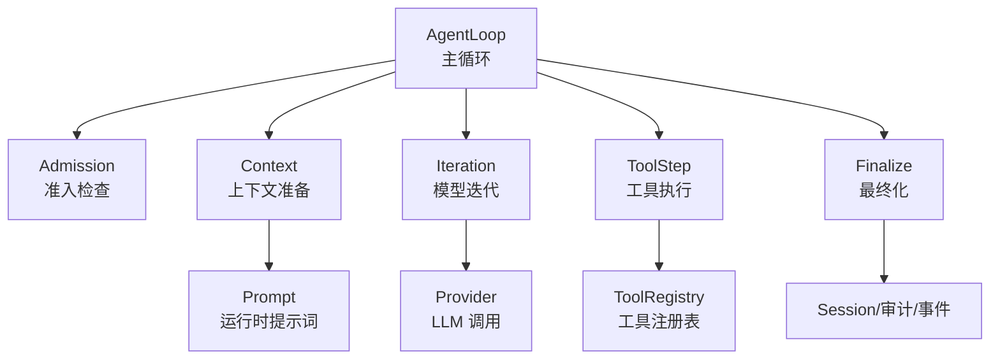
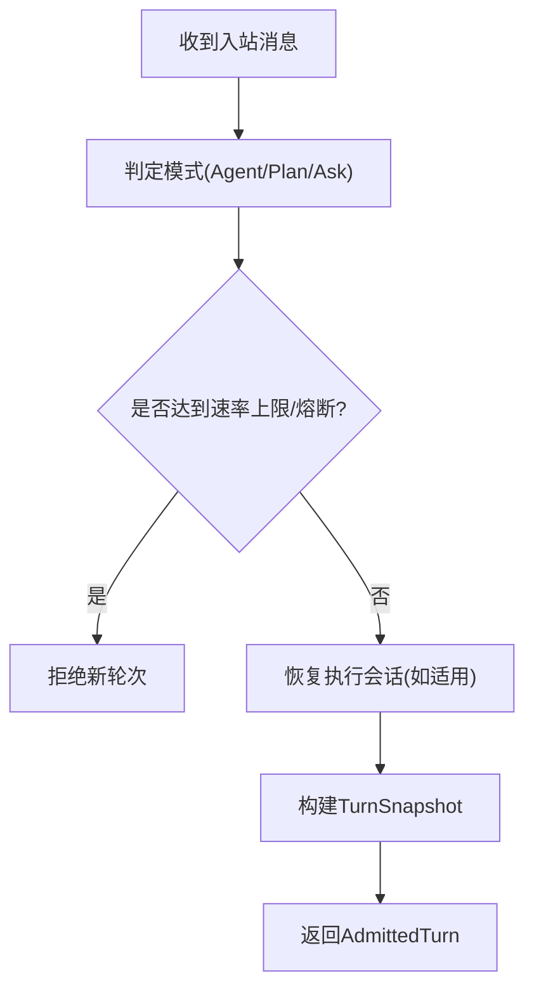
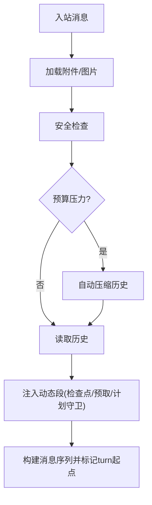
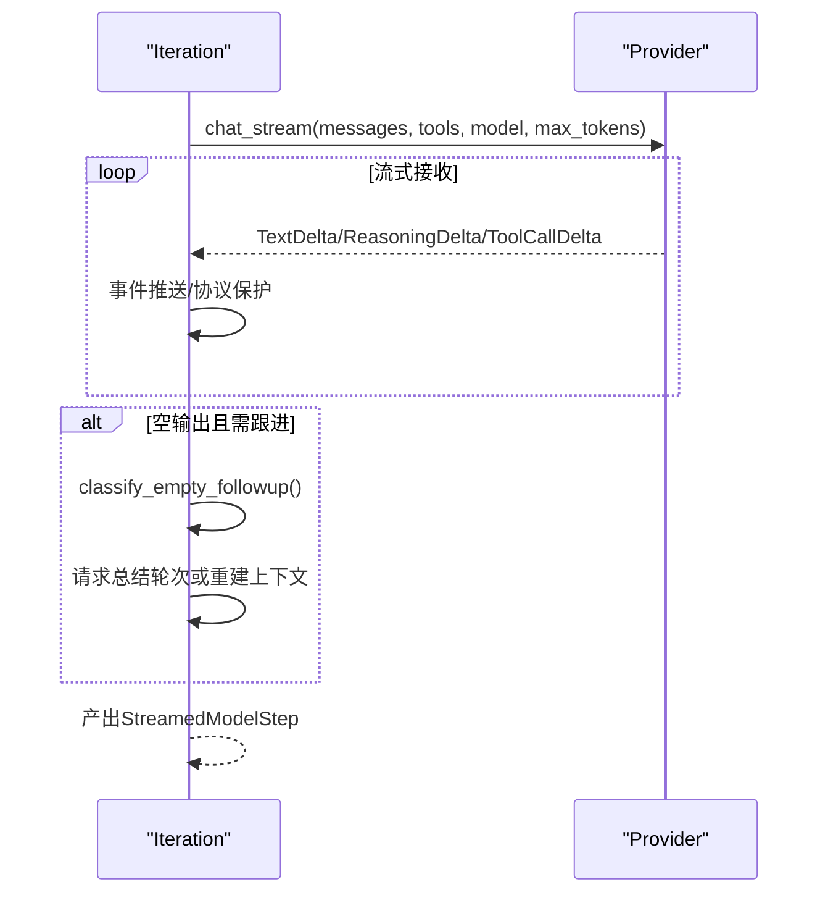
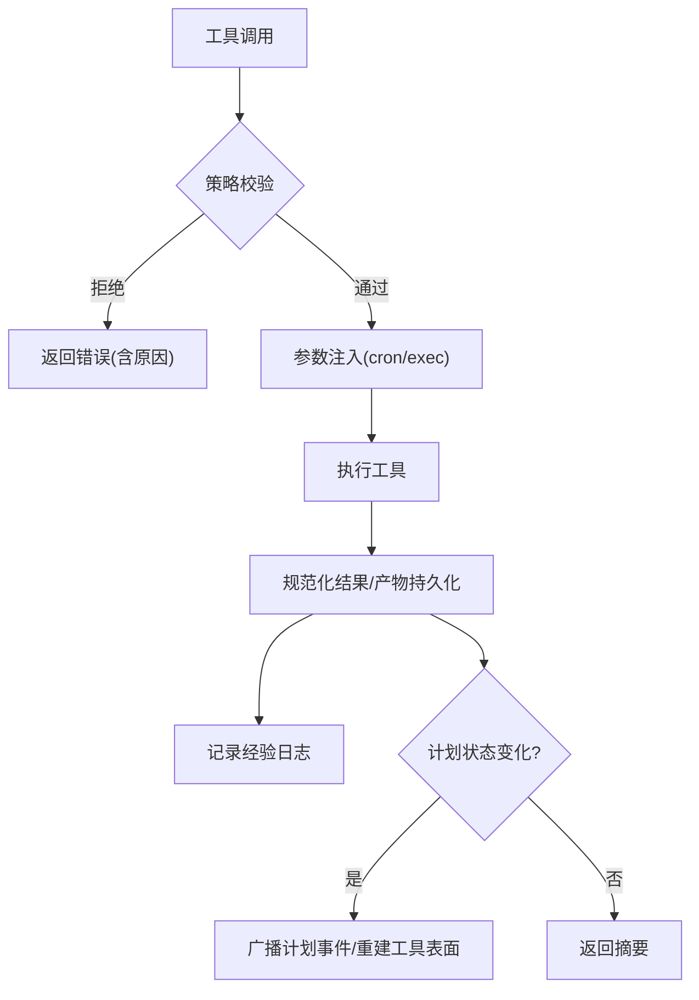
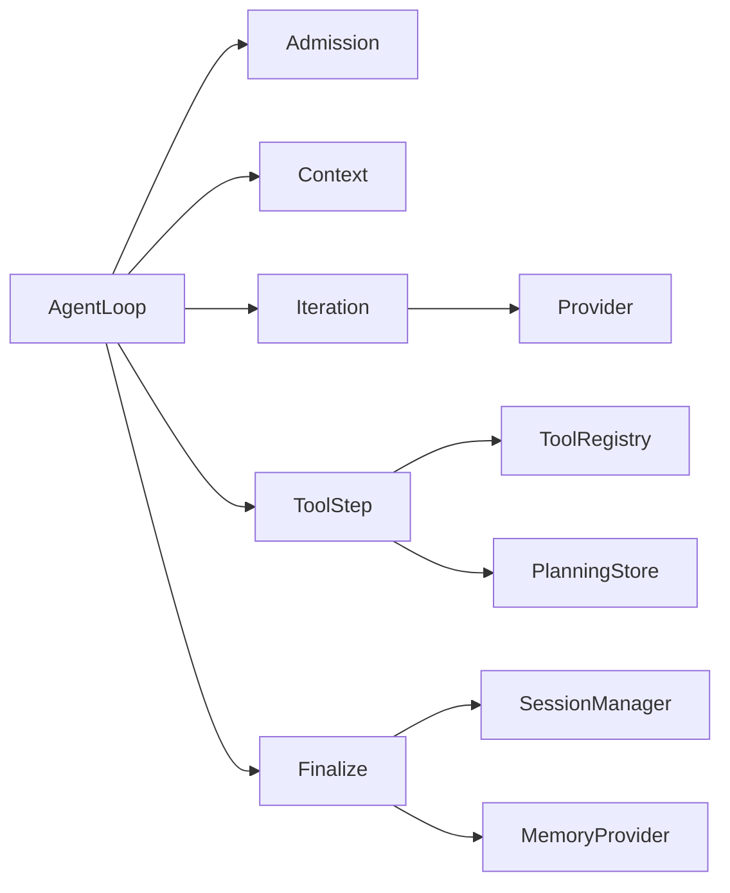

# 轮次处理

<cite>
**本文引用的文件**
- [agent_loop.rs](file://agent-diva-agent/src/agent_loop.rs)
- [loop_turn.rs](file://agent-diva-agent/src/agent_loop/loop_turn.rs)
- [turn/mod.rs](file://agent-diva-agent/src/agent_loop/turn/mod.rs)
- [admission.rs](file://agent-diva-agent/src/agent_loop/turn/admission.rs)
- [context.rs](file://agent-diva-agent/src/agent_loop/turn/context.rs)
- [iteration.rs](file://agent-diva-agent/src/agent_loop/turn/iteration.rs)
- [tool_step.rs](file://agent-diva-agent/src/agent_loop/turn/tool_step.rs)
- [finalize.rs](file://agent-diva-agent/src/agent_loop/turn/finalize.rs)
- [prompt.rs](file://agent-diva-agent/src/agent_loop/turn/prompt.rs)
</cite>

## 目录
1. [简介](#简介)
2. [项目结构](#项目结构)
3. [核心组件](#核心组件)
4. [架构总览](#架构总览)
5. [详细组件分析](#详细组件分析)
6. [依赖关系分析](#依赖关系分析)
7. [性能考量](#性能考量)
8. [故障排查指南](#故障排查指南)
9. [结论](#结论)
10. [附录：自定义与优化示例](#附录自定义与优化示例)

## 简介
本文件系统化阐述 Agent Diva 的“轮次处理”机制，覆盖单轮消息从准入检查、上下文准备、LLM 调用、工具执行、结果处理到最终化的完整流程。文档同时说明轮次间的状态管理、数据传递、错误处理与异常恢复策略，并提供可操作的自定义与优化建议以及监控调试技巧。

## 项目结构
轮次处理的核心位于 agent-diva-agent 模块的 agent_loop 子模块中，采用“阶段化契约”组织代码，便于稳定对外接口并隔离策略决策点：
- 入口与编排：AgentLoop 主循环与轮次调度（loop_turn）
- 阶段契约：turn 子模块将轮次拆分为 admission、context、iteration、tool_step、finalize、prompt 等阶段
- 配置与能力：工具集装配、计划模式、安全策略、预算控制、会话管理等



**图示来源**
- [loop_turn.rs:312-757](file://agent-diva-agent/src/agent_loop/loop_turn.rs#L312-L757)
- [turn/mod.rs:1-14](file://agent-diva-agent/src/agent_loop/turn/mod.rs#L1-L14)

**章节来源**
- [agent_loop.rs:110-153](file://agent-diva-agent/src/agent_loop.rs#L110-L153)
- [turn/mod.rs:1-14](file://agent-diva-agent/src/agent_loop/turn/mod.rs#L1-L14)

## 核心组件
- AgentLoop：维护会话、工具集、预算、安全熔断、速率限制、缓存观察、ACTMEM 等全局状态；提供轮次入口 process_inbound_message_inner。
- Admission：对入站消息进行分类（Agent/Plan/Ask）、计划执行恢复、速率限制与拒绝熔断。
- Context：组装历史、动态段、安全检查、预算压缩、预取召回、计划守卫提示。
- Iteration：启动 LLM 流式调用、收集响应、空输出分类、上下文压力回退与重试。
- ToolStep：工具策略校验、参数注入、执行、结果规范化、经验日志、计划事件广播。
- Finalize：计划报告持久化、会话保存、标题生成、ACTMEM 记录、出站消息构造。
- Prompt：稳定的运行时提示词模板（计划模式、问答模式、已批准计划、定时任务等）。

**章节来源**
- [agent_loop.rs:110-153](file://agent-diva-agent/src/agent_loop.rs#L110-L153)
- [admission.rs:114-317](file://agent-diva-agent/src/agent_loop/turn/admission.rs#L114-L317)
- [context.rs:93-558](file://agent-diva-agent/src/agent_loop/turn/context.rs#L93-L558)
- [iteration.rs:167-393](file://agent-diva-agent/src/agent_loop/turn/iteration.rs#L167-L393)
- [tool_step.rs:194-480](file://agent-diva-agent/src/agent_loop/turn/tool_step.rs#L194-L480)
- [finalize.rs:55-273](file://agent-diva-agent/src/agent_loop/turn/finalize.rs#L55-L273)
- [prompt.rs:32-101](file://agent-diva-agent/src/agent_loop/turn/prompt.rs#L32-L101)

## 架构总览
下图展示单轮消息处理的端到端时序，包括准入、上下文、模型迭代、工具执行、最终化等关键步骤。

```mermaid
sequenceDiagram
participant Client as "客户端"
participant Loop as "AgentLoop"
participant Admit as "准入(Admission)"
participant Ctx as "上下文(Context)"
participant Iter as "迭代(Iteration)"
participant Prov as "LLM Provider"
participant Tool as "工具执行(ToolStep)"
participant Fin as "最终化(Finalize)"
Client->>Loop : 入站消息
Loop->>Admit : admit_turn()
Admit-->>Loop : 通过/拒绝 + 快照
Loop->>Ctx : prepare_runtime_context()
Ctx-->>Loop : 消息序列+动态段
Loop->>Iter : start_model_stream()
Iter->>Prov : chat_stream(...)
Prov-->>Iter : 流式事件/完成
alt 需要工具
Iter->>Tool : orchestrate_tool_call()
Tool-->>Iter : 工具结果/摘要
Iter->>Iter : 继续或总结轮次
else 直接回复
Iter-->>Loop : 最终文本/推理
end
Loop->>Fin : finalize_turn()
Fin-->>Client : 出站消息/事件
```

**图示来源**
- [loop_turn.rs:312-757](file://agent-diva-agent/src/agent_loop/loop_turn.rs#L312-L757)
- [iteration.rs:167-393](file://agent-diva-agent/src/agent_loop/turn/iteration.rs#L167-L393)
- [tool_step.rs:194-480](file://agent-diva-agent/src/agent_loop/turn/tool_step.rs#L194-L480)
- [finalize.rs:118-273](file://agent-diva-agent/src/agent_loop/turn/finalize.rs#L118-L273)

## 详细组件分析

### 准入检查（Admission）
职责
- 根据消息元数据判定轮次模式（Agent/Plan/Ask），识别定时触发。
- 应用拒绝熔断器与每小时动作上限，防止风暴与滥用。
- 恢复执行中的计划会话，构建 TurnSnapshot（包含策略相位、只读标记、计划守卫等）。
- 为后续工具装配准备 session_key、执行上下文、背景任务上下文。

关键逻辑
- 模式判定：exec_mode 字段决定模式；未知值默认按 Ask 处理。
- 速率限制：ActionTracker 窗口内计数，超限则拒绝。
- 计划恢复：若处于 Execute 且存在执行上下文，恢复执行会话。
- 快照：捕获 plan_guard_active、reviewer_read_only、scheduled 等策略相关状态。



**图示来源**
- [admission.rs:19-77](file://agent-diva-agent/src/agent_loop/turn/admission.rs#L19-L77)
- [admission.rs:94-112](file://agent-diva-agent/src/agent_loop/turn/admission.rs#L94-L112)
- [admission.rs:114-317](file://agent-diva-agent/src/agent_loop/turn/admission.rs#L114-L317)

**章节来源**
- [admission.rs:19-77](file://agent-diva-agent/src/agent_loop/turn/admission.rs#L19-L77)
- [admission.rs:94-112](file://agent-diva-agent/src/agent_loop/turn/admission.rs#L94-L112)
- [admission.rs:114-317](file://agent-diva-agent/src/agent_loop/turn/admission.rs#L114-L317)

### 上下文准备（Context）
职责
- 加载附件内容（文本内联、图片转多模态）。
- 安全检查：允许/清洗/阻断/隔离。
- 预算评估与自动压缩：当历史/上下文接近预算时触发压缩。
- 动态段注入：会话检查点、预取召回、计划守卫、问答模式、定时任务提示。
- 构建 provider 就绪的消息序列，并冻结 turn 起始位置以支持增量更新。

关键逻辑
- 附件：仅小体积文本内联，其他转为占位提示。
- 视觉输入：当前模型不支持视觉时直接报错。
- 压缩：自动/响应式压缩，失败不阻塞主流程。
- 动态段：按顺序注入会话检查点、预取召回、计划守卫等。



**图示来源**
- [context.rs:93-558](file://agent-diva-agent/src/agent_loop/turn/context.rs#L93-L558)

**章节来源**
- [context.rs:93-558](file://agent-diva-agent/src/agent_loop/turn/context.rs#L93-L558)

### 模型迭代（Iteration）
职责
- 启动 LLM 流式调用，设置工具选择模式与最大 token。
- 收集流式文本、推理、工具调用片段，实时推送事件。
- 检测内部协议泄漏并抑制用户可见输出。
- 空输出分类：输入压力/输出截断/空停止，必要时触发总结轮次或上下文重建。
- 上下文溢出时进行响应式压缩并重试。

关键逻辑
- 预算与缓存：测量上下文大小，必要时微压缩工具结果，启用缓存观察。
- 重试：遇到上下文溢出错误时，压缩后重建上下文并重试一次。
- 空输出：结合 finish_reason、token 使用、上下文窗口估算，决定是否追加总结轮次。



**图示来源**
- [iteration.rs:167-393](file://agent-diva-agent/src/agent_loop/turn/iteration.rs#L167-L393)
- [iteration.rs:533-641](file://agent-diva-agent/src/agent_loop/turn/iteration.rs#L533-L641)

**章节来源**
- [iteration.rs:167-393](file://agent-diva-agent/src/agent_loop/turn/iteration.rs#L167-L393)
- [iteration.rs:533-641](file://agent-diva-agent/src/agent_loop/turn/iteration.rs#L533-L641)

### 工具执行（ToolStep）
职责
- 在工具执行前进行策略校验：计划阶段能力矩阵、计划守卫、只读模式、取消状态。
- 参数注入：为 cron/exec 等工具注入上下文信息。
- 执行与结果规范化：统一错误格式，持久化工具产物，附加记忆写入规则。
- 经验日志：记录成功/拒绝/失败三类结果。
- 计划事件：变更计划状态时广播事件，必要时重建工具表面。

关键逻辑
- 拒绝策略：phase 不允许、无计划时的守卫、审阅者只读模式均会拒绝。
- 记忆写入规则：首次写入类工具调用时注入规则，避免违规写入。
- 生命周期屏障：plan_submit/plan_transition 进入等待审批时终止本轮后续工具调用。



**图示来源**
- [tool_step.rs:19-122](file://agent-diva-agent/src/agent_loop/turn/tool_step.rs#L19-L122)
- [tool_step.rs:194-480](file://agent-diva-agent/src/agent_loop/turn/tool_step.rs#L194-L480)

**章节来源**
- [tool_step.rs:19-122](file://agent-diva-agent/src/agent_loop/turn/tool_step.rs#L19-L122)
- [tool_step.rs:194-480](file://agent-diva-agent/src/agent_loop/turn/tool_step.rs#L194-L480)

### 最终化（Finalize）
职责
- 计划报告提取与持久化，必要时剥离提议块并提示用户审批。
- 会话保存、标题生成（LLM 辅助）、ACTMEM 记录与空闲折叠调度。
- 构造出站消息，携带 reply_to、reasoning_content 等元数据。

关键逻辑
- 计划模式：解析 <proposed_plan> 等结构化内容，提交报告并提示不完整项。
- 标题生成：仅在满足条件时尝试生成，失败回退到首条用户消息摘要。
- 幂等性：pending checkpoint 更新在 finalize 时提交，确保一致性。

**章节来源**
- [finalize.rs:55-273](file://agent-diva-agent/src/agent_loop/turn/finalize.rs#L55-L273)

### 运行时提示词（Prompt）
职责
- 提供版本化、可审计的运行时提示词模板，用于计划模式、问答模式、已批准计划、定时任务、会话标题等场景。
- 保证角色与内容稳定，便于追踪与回归测试。

**章节来源**
- [prompt.rs:32-101](file://agent-diva-agent/src/agent_loop/turn/prompt.rs#L32-L101)

## 依赖关系分析
轮次处理各阶段之间的耦合与协作如下：
- AgentLoop 作为编排者，依赖 Admission、Context、Iteration、ToolStep、Finalize 形成清晰流水线。
- Iteration 依赖 Provider 抽象，并通过 CacheObserver 与 ContextBuilder 协同上下文预算与缓存。
- ToolStep 依赖 ToolRegistry 与 PlanningStore，受 Mask 与 PlanPhase 约束。
- Finalize 依赖 SessionManager、MemoryProvider、Consolidation 等子系统。



**图示来源**
- [agent_loop.rs:110-153](file://agent-diva-agent/src/agent_loop.rs#L110-L153)
- [iteration.rs:167-393](file://agent-diva-agent/src/agent_loop/turn/iteration.rs#L167-L393)
- [tool_step.rs:194-480](file://agent-diva-agent/src/agent_loop/turn/tool_step.rs#L194-L480)
- [finalize.rs:118-273](file://agent-diva-agent/src/agent_loop/turn/finalize.rs#L118-L273)

**章节来源**
- [agent_loop.rs:110-153](file://agent-diva-agent/src/agent_loop.rs#L110-L153)

## 性能考量
- 上下文预算与压缩：自动/响应式压缩减少无效上下文，降低延迟与成本。
- 工具结果微压缩：在工具结果过大时提前压缩，避免超出 provider 上下文硬预算。
- 缓存观察：通过 cache ticket 与 core tool hash 提升缓存命中率。
- 流式处理：LLM 响应流式推送，尽早渲染与事件上报，改善用户体验。
- 超时与熔断：全局工具超时、拒绝熔断器、会话令牌预算限制，保障系统稳定性。

[本节为通用性能指导，无需特定文件引用]

## 故障排查指南
常见问题与定位要点
- 上下文溢出：关注 iteration 阶段的响应式压缩与重试日志；检查 context budget 配置与历史长度。
- 工具被拒绝：查看 tool_step 的策略拒绝原因（计划阶段、计划守卫、只读模式、cron 递归防护）。
- 计划审批卡住：确认 plan_submit/plan_transition 后的状态是否为 AwaitingApproval，并检查事件广播。
- 标题未生成：检查 should_generate_session_title 条件与 LLM 调用结果。
- 附件未内联：确认 MIME 类型与大小阈值；非文本或超大文件将转为占位提示。

建议的调试手段
- 启用 trace_id 与 step_name 日志，定位具体阶段。
- 订阅 AgentEvent（ToolCallStarted/Finished、ProviderRetry、ContextCompaction 等）观察流转。
- 检查 TokenLedger 与预算指标，确认是否触达限额。
- 使用测试用例验证策略矩阵与边界行为（例如 ask/read-only、cron 递归防护）。

**章节来源**
- [iteration.rs:167-393](file://agent-diva-agent/src/agent_loop/turn/iteration.rs#L167-L393)
- [tool_step.rs:194-480](file://agent-diva-agent/src/agent_loop/turn/tool_step.rs#L194-L480)
- [finalize.rs:118-273](file://agent-diva-agent/src/agent_loop/turn/finalize.rs#L118-L273)

## 结论
轮次处理通过清晰的阶段化契约与严格的策略门控，实现了高可靠、可观测、可扩展的消息处理流水线。其核心优势在于：
- 明确的阶段职责与数据边界
- 强大的上下文预算与压缩机制
- 完善的工具策略与计划治理
- 丰富的流式事件与审计记录
- 健壮的异常恢复与熔断保护

## 附录：自定义与优化示例
以下示例以“如何扩展轮次处理”为目标，给出基于现有接口的实践路径（不直接粘贴源码，仅提供路径与思路）：

- 自定义轮次处理逻辑
  - 在 AgentLoop 中扩展 with_tools_and_memory_provider，注入自定义 MemoryProvider 或 ToolConfig 选项，影响上下文与工具装配。
  - 参考路径：[with_tools_and_memory_provider_inner:641-759](file://agent-diva-agent/src/agent_loop.rs#L641-L759)

- 添加新的处理阶段
  - 在 turn 子模块新增阶段文件，并在 loop_turn 的主循环中插入钩子；保持阶段输入/输出契约稳定。
  - 参考阶段组织：[turn/mod.rs:1-14](file://agent-diva-agent/src/agent_loop/turn/mod.rs#L1-L14)

- 优化轮次性能
  - 调整 context_budget 配置，平衡历史保留与压缩频率。
  - 利用 microcompact 与缓存观察减少重复计算。
  - 参考路径：[start_model_stream:167-393](file://agent-diva-agent/src/agent_loop/turn/iteration.rs#L167-L393)

- 监控与调试
  - 订阅 AgentEvent 流，监听 ProviderRetry、ContextCompaction、ToolCallStarted/Finished 等事件。
  - 使用 trace_id 与 step_name 日志串联跨阶段调用。
  - 参考路径：[emit_agent_event:137-149](file://agent-diva-agent/src/agent_loop/loop_turn.rs#L137-L149)、[iteration 事件:278-290](file://agent-diva-agent/src/agent_loop/turn/iteration.rs#L278-L290)

- 安全与策略扩展
  - 在 ToolStepPolicy 中增加新的能力矩阵或守卫条件，强化只读/计划守卫。
  - 参考路径：[ToolStepPolicy:19-122](file://agent-diva-agent/src/agent_loop/turn/tool_step.rs#L19-L122)

- 计划模式与提示词定制
  - 修改 prompt.rs 中的运行时提示词版本与内容，确保向后兼容与可审计。
  - 参考路径：[prompt.rs:32-101](file://agent-diva-agent/src/agent_loop/turn/prompt.rs#L32-L101)