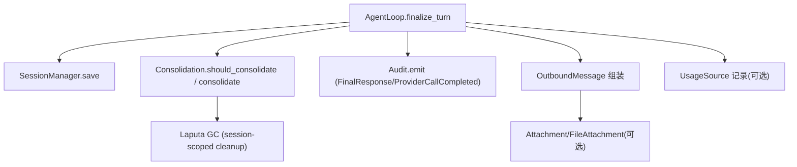
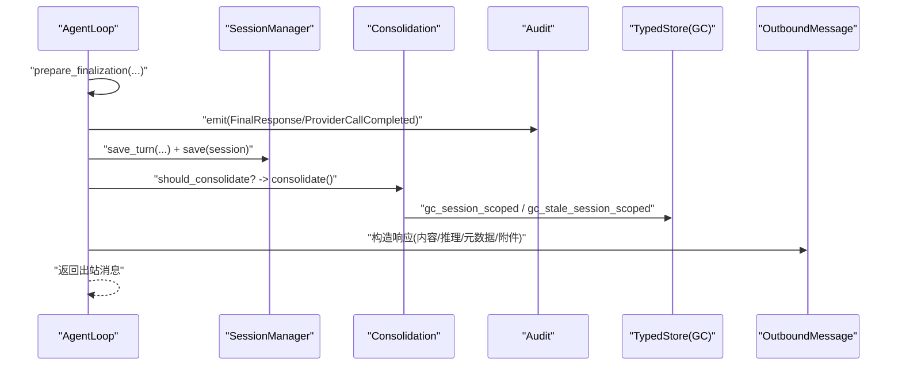
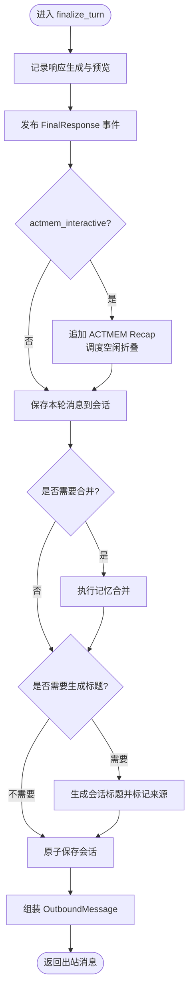
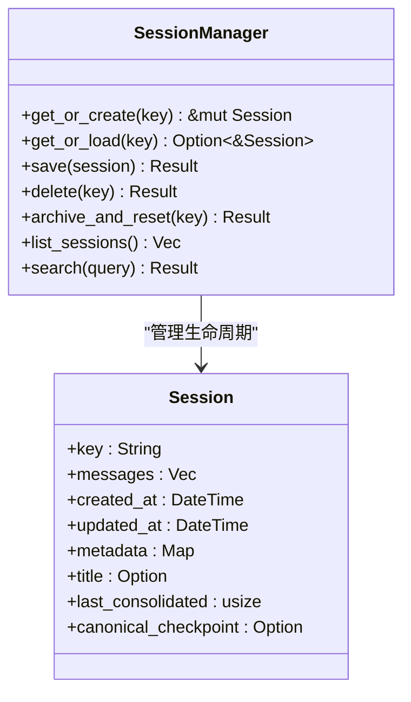
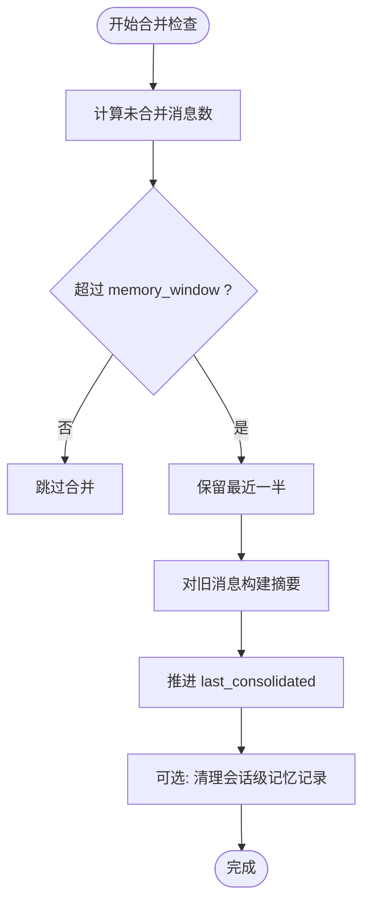
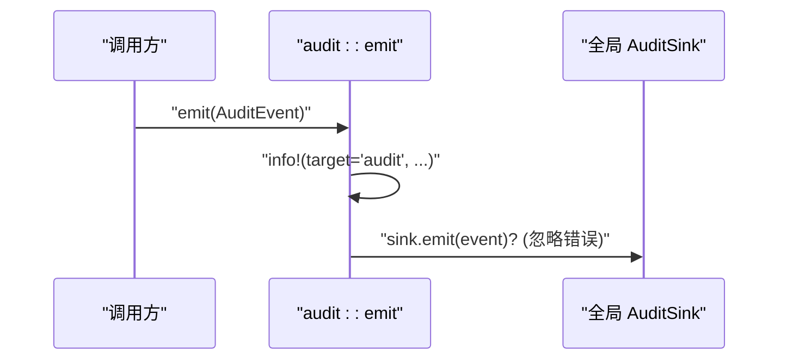
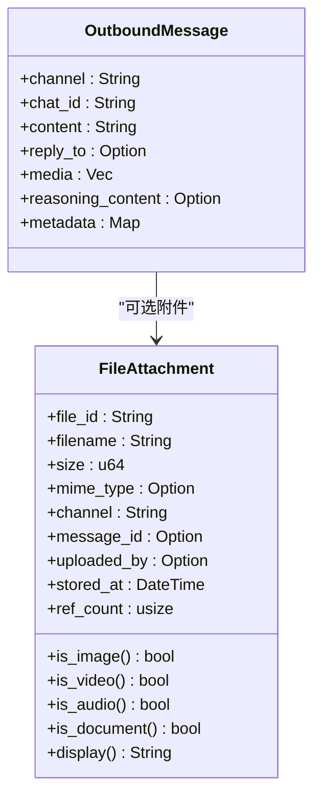
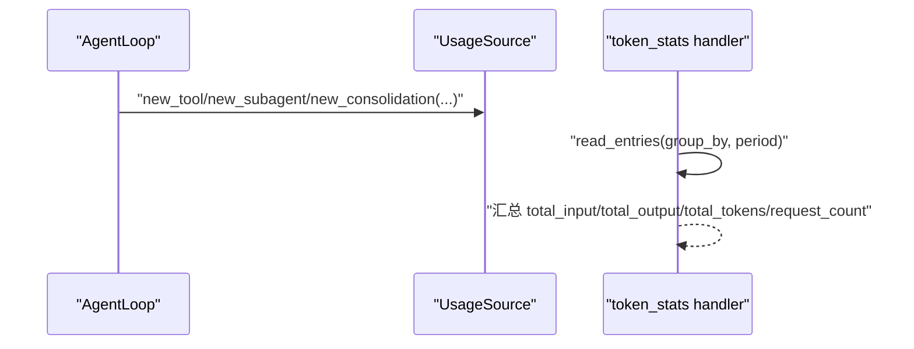
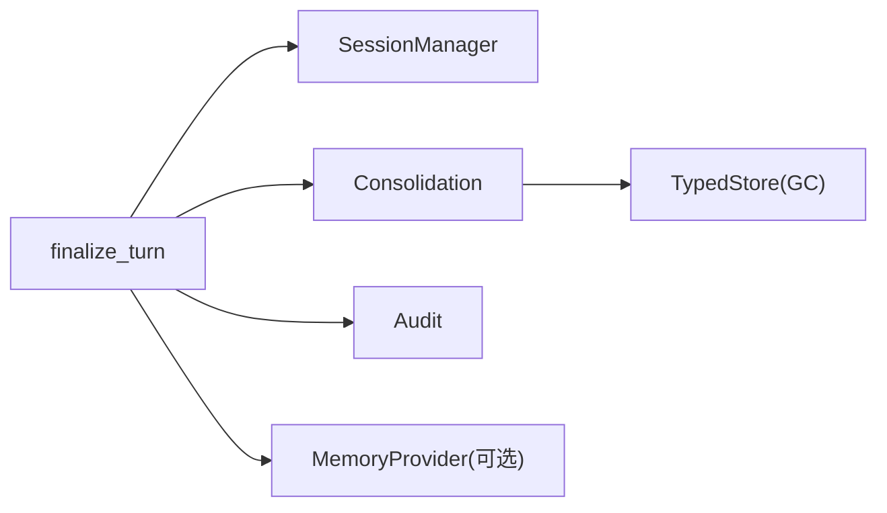

# 轮次最终化

<cite>
**本文引用的文件**
- [finalize.rs](file://agent-diva-agent/src/agent_loop/turn/finalize.rs)
- [manager.rs](file://agent-diva-core/src/session/manager.rs)
- [consolidation.rs](file://agent-diva-agent/src/consolidation.rs)
- [audit.rs](file://agent-diva-core/src/audit.rs)
- [audit_sink.rs](file://agent-diva-core/src/audit_sink.rs)
- [attachment.rs](file://agent-diva-core/src/attachment.rs)
- [usage_source.rs](file://agent-diva-core/src/quality/usage_source.rs)
- [typed_store.rs](file://agent-diva-laputa/src/typed_store.rs)
- [token_stats.rs](file://agent-diva-manager/src/handlers/token_stats.rs)
</cite>

## 目录
1. [简介](#简介)
2. [项目结构](#项目结构)
3. [核心组件](#核心组件)
4. [架构总览](#架构总览)
5. [详细组件分析](#详细组件分析)
6. [依赖关系分析](#依赖关系分析)
7. [性能考量](#性能考量)
8. [故障排查指南](#故障排查指南)
9. [结论](#结论)
10. [附录](#附录)

## 简介
本章节聚焦“单轮处理完成后的收尾工作”，即轮次最终化阶段。该阶段负责：
- 状态清理与资源释放
- 日志记录与审计追踪
- 响应组装（消息格式化、附件处理、元数据附加）
- 会话状态的持久化与更新（记忆更新、上下文保存、统计信息收集）
- 扩展点说明（自定义清理任务、优化响应格式）
- 实际流程示例、错误恢复机制与性能监控方法

## 项目结构
围绕轮次最终化的关键代码分布在以下模块：
- Agent Loop 的 Turn Finalization：负责将一轮迭代结果落盘、触发记忆合并、生成会话标题并返回出站消息
- Session Manager：负责会话的内存缓存与磁盘 JSONL 原子写入
- Memory Consolidation：根据未合并消息数量阈值决定是否进行记忆压缩
- Audit 子系统：统一结构化审计事件输出，支持全局 Sink 投递
- Attachment：统一的附件表示与类型判断
- Usage Source：Token 使用记录的来源封装（工具、子代理、合并等）
- Laputa Typed Store：会话级/跨会话的记忆记录清理（GC）
- Token Stats Handler：对外暴露用量统计查询接口

**图表来源**
- [finalize.rs:118-273](file://agent-diva-agent/src/agent_loop/turn/finalize.rs#L118-L273)
- [manager.rs:190-250](file://agent-diva-core/src/session/manager.rs#L190-L250)
- [consolidation.rs:136-172](file://agent-diva-agent/src/consolidation.rs#L136-L172)
- [audit.rs:224-253](file://agent-diva-core/src/audit.rs#L224-L253)
- [attachment.rs:41-77](file://agent-diva-core/src/attachment.rs#L41-L77)
- [usage_source.rs:73-122](file://agent-diva-core/src/quality/usage_source.rs#L73-L122)
- [typed_store.rs:673-739](file://agent-diva-laputa/src/typed_store.rs#L673-L739)

**章节来源**
- [finalize.rs:118-273](file://agent-diva-agent/src/agent_loop/turn/finalize.rs#L118-L273)
- [manager.rs:190-250](file://agent-diva-core/src/session/manager.rs#L190-L250)
- [consolidation.rs:136-172](file://agent-diva-agent/src/consolidation.rs#L136-L172)
- [audit.rs:224-253](file://agent-diva-core/src/audit.rs#L224-L253)
- [attachment.rs:41-77](file://agent-diva-core/src/attachment.rs#L41-L77)
- [usage_source.rs:73-122](file://agent-diva-core/src/quality/usage_source.rs#L73-L122)
- [typed_store.rs:673-739](file://agent-diva-laputa/src/typed_store.rs#L673-L739)

## 核心组件
- 最终化输入与上下文
  - FinalizationInput：承载内容、推理摘要、Token 用量
  - FinalizationContext：携带入站消息、历史消息、会话键、模型、trace_id 等
- 最终化主流程 finalize_turn
  - 记录响应生成日志与事件
  - 可选写入 ACTMEM Recap 并调度折叠
  - 保存本轮消息到会话（含 usage）
  - 触发记忆合并（按阈值）
  - 生成会话标题并持久化
  - 组装 OutboundMessage 返回
- 会话持久化 SessionManager
  - get_or_create/save 原子写入 JSONL
  - 归档与重置能力
- 审计与日志 Audit
  - emit 统一入口，target="audit"
  - 全局 Sink 可插拔，失败不中断业务
- 附件 Attachment
  - FileAttachment 统一表示，支持类型判断与显示
- 用量统计 UsageSource
  - 为工具、子代理、合并等来源创建用量记录
- Laputa 存储清理
  - session-scoped 与 stale session-scoped 清理

**章节来源**
- [finalize.rs:16-45](file://agent-diva-agent/src/agent_loop/turn/finalize.rs#L16-L45)
- [finalize.rs:118-273](file://agent-diva-agent/src/agent_loop/turn/finalize.rs#L118-L273)
- [manager.rs:43-56](file://agent-diva-core/src/session/manager.rs#L43-L56)
- [manager.rs:190-250](file://agent-diva-core/src/session/manager.rs#L190-L250)
- [audit.rs:224-253](file://agent-diva-core/src/audit.rs#L224-L253)
- [attachment.rs:41-77](file://agent-diva-core/src/attachment.rs#L41-L77)
- [usage_source.rs:73-122](file://agent-diva-core/src/quality/usage_source.rs#L73-L122)
- [typed_store.rs:673-739](file://agent-diva-laputa/src/typed_store.rs#L673-L739)

## 架构总览
下图展示一次轮次从“响应生成”到“最终化”的关键调用链与数据流：

**图表来源**
- [finalize.rs:55-116](file://agent-diva-agent/src/agent_loop/turn/finalize.rs#L55-L116)
- [finalize.rs:118-273](file://agent-diva-agent/src/agent_loop/turn/finalize.rs#L118-L273)
- [consolidation.rs:136-172](file://agent-diva-agent/src/consolidation.rs#L136-L172)
- [typed_store.rs:673-739](file://agent-diva-laputa/src/typed_store.rs#L673-L739)
- [audit.rs:224-253](file://agent-diva-core/src/audit.rs#L224-L253)

## 详细组件分析

### 组件A：最终化主流程 finalize_turn
职责
- 记录响应生成与预览日志
- 发送 FinalResponse 事件到总线与可选 event_tx
- 在交互式模式下追加 ACTMEM Recap 并调度空闲折叠
- 保存本轮消息到会话（包含 usage），必要时更新 canonical_checkpoint
- 触发记忆合并（基于 memory_window）
- 生成会话标题并标记是否自动生成或手动设置
- 原子持久化会话
- 组装 OutboundMessage（channel/chat_id/content/reply_to/media/reasoning_content/metadata）

关键点
- 用户可见响应优先发出；ACTMEM 失败仅作为诊断，不影响回复
- 计划模式下的报告提取与审批卡片提示
- 使用 trace_id 和 step_name 做步骤级追踪

**图表来源**
- [finalize.rs:118-273](file://agent-diva-agent/src/agent_loop/turn/finalize.rs#L118-L273)

**章节来源**
- [finalize.rs:118-273](file://agent-diva-agent/src/agent_loop/turn/finalize.rs#L118-L273)

### 组件B：会话持久化 SessionManager
职责
- 提供 get_or_create/get_or_load/save/delete/archive_and_reset
- 以 JSONL 形式持久化会话：首行为 metadata，后续行为消息行
- 原子写入：先写临时文件，再 rename，最后同步父目录
- 列表与搜索会话

关键点
- 原子替换保证崩溃恢复后文件一致性
- 归档与重置用于清空会话但保留历史

**图表来源**
- [manager.rs:20-29](file://agent-diva-core/src/session/manager.rs#L20-L29)
- [manager.rs:43-56](file://agent-diva-core/src/session/manager.rs#L43-L56)
- [manager.rs:190-250](file://agent-diva-core/src/session/manager.rs#L190-L250)

**章节来源**
- [manager.rs:43-56](file://agent-diva-core/src/session/manager.rs#L43-L56)
- [manager.rs:190-250](file://agent-diva-core/src/session/manager.rs#L190-L250)
- [manager.rs:260-321](file://agent-diva-core/src/session/manager.rs#L260-L321)

### 组件C：记忆合并与清理
职责
- should_consolidate：基于未合并消息数与 memory_window 判定
- consolidate：对旧消息构建摘要，推进 last_consolidated
- Laputa typed_store：session-scoped 与 stale session-scoped 清理

关键点
- 避免重复合并（distill_guard）
- 保留最近一半消息用于上下文重叠
- 启动时清理异常退出导致的残留会话记录

**图表来源**
- [consolidation.rs:136-172](file://agent-diva-agent/src/consolidation.rs#L136-L172)
- [typed_store.rs:673-739](file://agent-diva-laputa/src/typed_store.rs#L673-L739)

**章节来源**
- [consolidation.rs:136-172](file://agent-diva-agent/src/consolidation.rs#L136-L172)
- [typed_store.rs:673-739](file://agent-diva-laputa/src/typed_store.rs#L673-L739)

### 组件D：审计与日志
职责
- audit::emit：统一入口，target="audit"，低开销
- audit_sink：全局 Sink 注册与获取，失败不中断业务逻辑

关键点
- 所有重要系统事件通过 emit 输出，便于 GUI/CLI 过滤消费
- 支持外部 sink 接入（如集中式日志系统）

**图表来源**
- [audit.rs:224-253](file://agent-diva-core/src/audit.rs#L224-L253)
- [audit_sink.rs:65-78](file://agent-diva-core/src/audit_sink.rs#L65-L78)

**章节来源**
- [audit.rs:224-253](file://agent-diva-core/src/audit.rs#L224-L253)
- [audit_sink.rs:65-78](file://agent-diva-core/src/audit_sink.rs#L65-L78)

### 组件E：响应组装与附件处理
职责
- OutboundMessage：包含 channel、chat_id、content、reply_to、media、reasoning_content、metadata
- FileAttachment：统一附件表示，支持类型判断（图片/视频/音频/文档）、大小格式化、显示字符串

关键点
- 当前 finalize_turn 返回 media 为空向量，可按需扩展
- 若需附带文件，可通过 FileAttachment 包装并放入 media

**图表来源**
- [finalize.rs:264-272](file://agent-diva-agent/src/agent_loop/turn/finalize.rs#L264-L272)
- [attachment.rs:41-77](file://agent-diva-core/src/attachment.rs#L41-L77)
- [attachment.rs:151-233](file://agent-diva-core/src/attachment.rs#L151-L233)

**章节来源**
- [finalize.rs:264-272](file://agent-diva-agent/src/agent_loop/turn/finalize.rs#L264-L272)
- [attachment.rs:41-77](file://agent-diva-core/src/attachment.rs#L41-L77)
- [attachment.rs:151-233](file://agent-diva-core/src/attachment.rs#L151-L233)

### 组件F：统计信息收集与用量追踪
职责
- UsageSource：为工具、子代理、合并等来源创建用量记录
- Token Stats Handler：聚合与查询用量数据

关键点
- 可在 finalize_turn 中结合 token_usage 记录用量
- 通过 HTTP 接口查询总量、摘要、时间线、会话维度统计

**图表来源**
- [usage_source.rs:73-122](file://agent-diva-core/src/quality/usage_source.rs#L73-L122)
- [token_stats.rs:188-340](file://agent-diva-manager/src/handlers/token_stats.rs#L188-L340)

**章节来源**
- [usage_source.rs:73-122](file://agent-diva-core/src/quality/usage_source.rs#L73-L122)
- [token_stats.rs:188-340](file://agent-diva-manager/src/handlers/token_stats.rs#L188-L340)

## 依赖关系分析
- finalize_turn 依赖：
  - SessionManager 进行会话持久化
  - Consolidation 进行记忆合并
  - Audit 进行事件输出
  - Optional: MemoryProvider（ACTMEM Recap）
  - Optional: Provider（模型名称用于标题生成）
- SessionManager 依赖：
  - 文件系统（JSONL 原子写入）
  - 会话元数据（标题、是否自动生成、是否手动设置、是否置顶等）
- Consolidation 依赖：
  - Laputa TypedStore 进行会话级记忆清理
- Audit 依赖：
  - 全局 Sink（可插拔）

**图表来源**
- [finalize.rs:118-273](file://agent-diva-agent/src/agent_loop/turn/finalize.rs#L118-L273)
- [consolidation.rs:136-172](file://agent-diva-agent/src/consolidation.rs#L136-L172)
- [typed_store.rs:673-739](file://agent-diva-laputa/src/typed_store.rs#L673-L739)
- [audit.rs:224-253](file://agent-diva-core/src/audit.rs#L224-L253)

**章节来源**
- [finalize.rs:118-273](file://agent-diva-agent/src/agent_loop/turn/finalize.rs#L118-L273)
- [consolidation.rs:136-172](file://agent-diva-agent/src/consolidation.rs#L136-L172)
- [typed_store.rs:673-739](file://agent-diva-laputa/src/typed_store.rs#L673-L739)
- [audit.rs:224-253](file://agent-diva-core/src/audit.rs#L224-L253)

## 性能考量
- 原子写入会话文件：避免部分写入导致的数据损坏，提升可靠性
- 记忆合并阈值控制：避免频繁合并造成额外开销
- 审计事件低开销：target="audit" 且 sink 错误被吞掉，确保不阻塞主流程
- 统计聚合：按需分组与时间窗口，避免全量扫描

[本节为通用指导，无需特定文件引用]

## 故障排查指南
常见问题与定位建议
- 会话保存失败
  - 现象：日志中出现“Failed to save session”
  - 排查：检查 sessions 目录权限、磁盘空间、原子写入钩子是否抛出错误
  - 参考路径：[manager.rs:190-250](file://agent-diva-core/src/session/manager.rs#L190-L250)
- 记忆合并失败
  - 现象：日志中出现“Memory consolidation failed”
  - 排查：检查 memory_window 配置、未合并消息数量、Laputa 存储可用性
  - 参考路径：[consolidation.rs:136-172](file://agent-diva-agent/src/consolidation.rs#L136-L172), [typed_store.rs:673-739](file://agent-diva-laputa/src/typed_store.rs#L673-L739)
- ACTMEM Recap 写入失败
  - 现象：warn 日志“failed to append ACTMEM Recap”
  - 排查：确认 actmem_interactive 标志、MemoryProvider 连接性
  - 参考路径：[finalize.rs:165-181](file://agent-diva-agent/src/agent_loop/turn/finalize.rs#L165-L181)
- 审计事件未落地
  - 现象：GUI/CLI 无法过滤到 target="audit" 的事件
  - 排查：确认 emit 调用、全局 Sink 是否注册成功
  - 参考路径：[audit.rs:224-253](file://agent-diva-core/src/audit.rs#L224-L253), [audit_sink.rs:65-78](file://agent-diva-core/src/audit_sink.rs#L65-L78)

**章节来源**
- [manager.rs:190-250](file://agent-diva-core/src/session/manager.rs#L190-L250)
- [consolidation.rs:136-172](file://agent-diva-agent/src/consolidation.rs#L136-L172)
- [typed_store.rs:673-739](file://agent-diva-laputa/src/typed_store.rs#L673-L739)
- [finalize.rs:165-181](file://agent-diva-agent/src/agent_loop/turn/finalize.rs#L165-L181)
- [audit.rs:224-253](file://agent-diva-core/src/audit.rs#L224-L253)
- [audit_sink.rs:65-78](file://agent-diva-core/src/audit_sink.rs#L65-L78)

## 结论
轮次最终化阶段通过 finalize_turn 串联了响应事件发布、会话持久化、记忆合并、标题生成与出站消息组装。其设计强调：
- 用户可见响应优先，非关键失败（如 ACTMEM）不阻塞回复
- 原子写入保障会话数据一致性
- 审计与统计贯穿始终，便于观测与回溯
- 可扩展性强：可添加自定义清理任务、优化响应格式、集成附件与更多统计维度

[本节为总结性内容，无需特定文件引用]

## 附录

### 扩展指南
- 添加自定义清理任务
  - 在 finalize_turn 中，于保存会话之后、返回出站消息之前插入清理逻辑（如清理临时文件、释放外部资源句柄）
  - 参考位置：[finalize.rs:194-246](file://agent-diva-agent/src/agent_loop/turn/finalize.rs#L194-L246)
- 优化响应格式
  - 在 OutboundMessage 中扩展 media 字段，使用 FileAttachment 包装多类型附件
  - 参考位置：[finalize.rs:264-272](file://agent-diva-agent/src/agent_loop/turn/finalize.rs#L264-L272), [attachment.rs:41-77](file://agent-diva-core/src/attachment.rs#L41-L77)
- 增强统计信息
  - 在 finalize_turn 中结合 token_usage 创建 UsageSource 记录
  - 通过 token_stats handler 查询聚合结果
  - 参考位置：[usage_source.rs:73-122](file://agent-diva-core/src/quality/usage_source.rs#L73-L122), [token_stats.rs:188-340](file://agent-diva-manager/src/handlers/token_stats.rs#L188-L340)

[本节为扩展指导，无需特定文件引用]