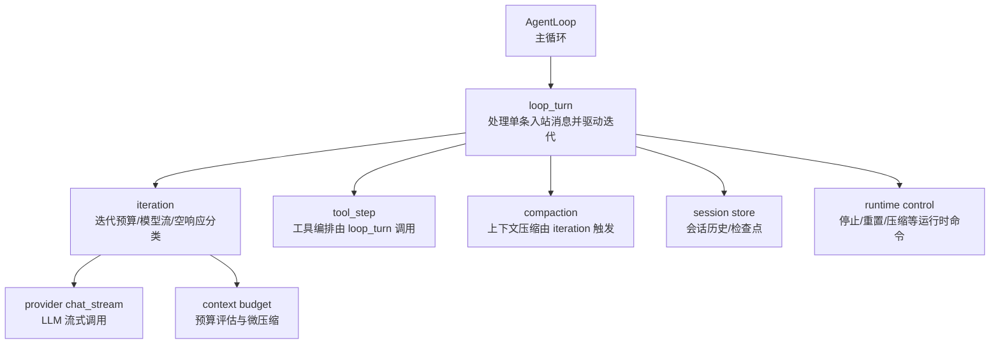
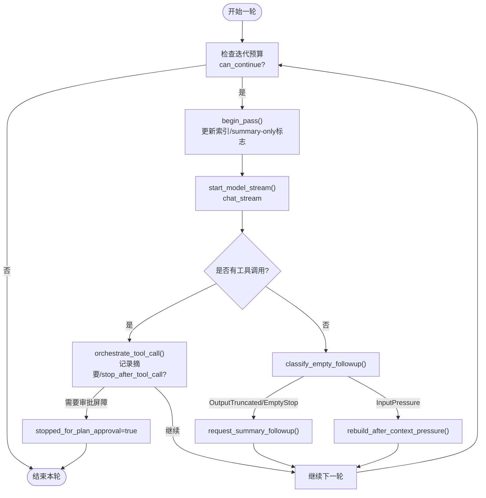
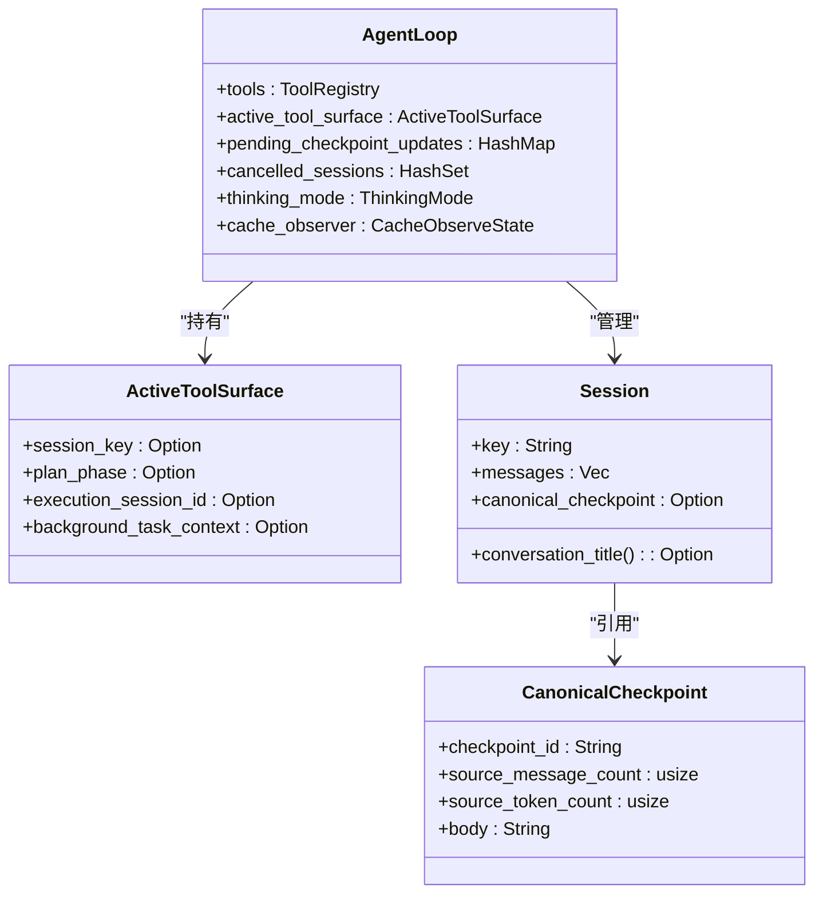
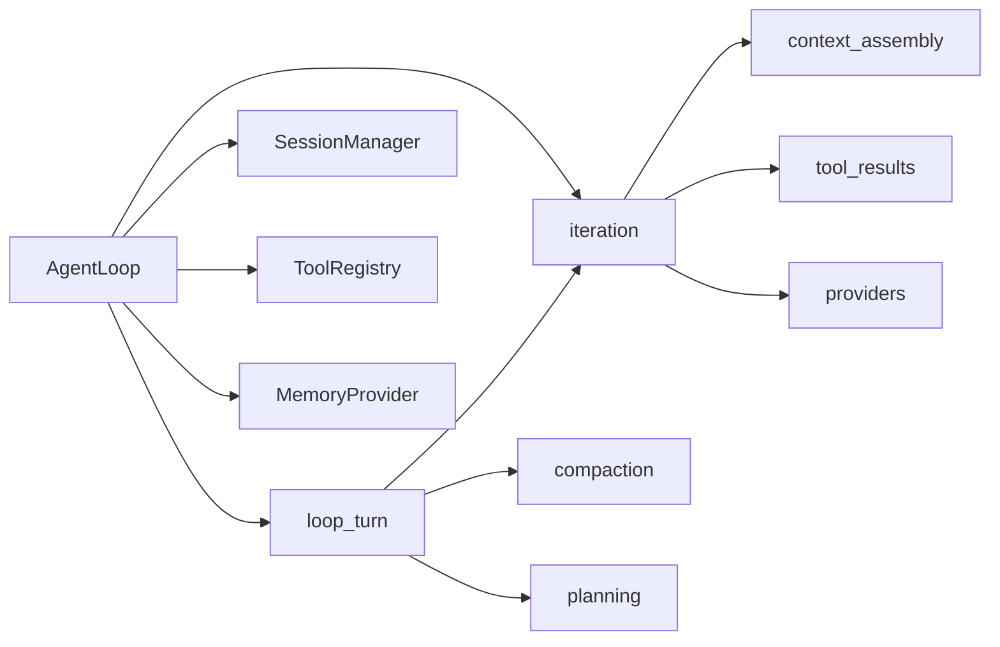

# 迭代控制

<cite>
**本文引用的文件**
- [agent-diva-agent/src/agent_loop.rs](file://agent-diva-agent/src/agent_loop.rs)
- [agent-diva-agent/src/agent_loop/loop_turn.rs](file://agent-diva-agent/src/agent_loop/loop_turn.rs)
- [agent-diva-agent/src/agent_loop/turn/iteration.rs](file://agent-diva-agent/src/agent_loop/turn/iteration.rs)
- [agent-diva-agent/src/agent_loop/loop_runtime_control.rs](file://agent-diva-agent/src/agent_loop/loop_runtime_control.rs)
- [agent-diva-agent/src/runtime_control.rs](file://agent-diva-agent/src/runtime_control.rs)
- [agent-diva-core/src/session/store.rs](file://agent-diva-core/src/session/store.rs)
- [agent-diva-agent/src/context_budget.rs](file://agent-diva-agent/src/context_budget.rs)
</cite>

## 目录
1. [简介](#简介)
2. [项目结构](#项目结构)
3. [核心组件](#核心组件)
4. [架构总览](#架构总览)
5. [详细组件分析](#详细组件分析)
6. [依赖关系分析](#依赖关系分析)
7. [性能考量](#性能考量)
8. [故障排查指南](#故障排查指南)
9. [结论](#结论)
10. [附录：示例与最佳实践](#附录示例与最佳实践)

## 简介
本文件聚焦 Agent-DIVA 的“多轮对话迭代控制”机制，系统阐述以下主题：
- 轮次计数、终止条件判断、循环控制逻辑
- 上下文状态管理（临时状态存储、跨轮次数据传递、内存管理策略）
- 迭代优化技术（早停机制、结果缓存、增量更新）
- 如何自定义迭代策略、添加新的终止条件、优化多轮对话性能
- 实际代码示例路径、调试方法

## 项目结构
围绕迭代控制的关键模块分布如下：
- 主循环入口与轮次编排：agent_loop.rs、loop_turn.rs
- 迭代预算与模型流控制：turn/iteration.rs
- 运行时控制命令与会话生命周期：runtime_control.rs、loop_runtime_control.rs
- 会话持久化与检查点：core/session/store.rs
- 上下文预算与压缩触发：context_budget.rs



图表来源
- [agent-diva-agent/src/agent_loop.rs:111-153](file://agent-diva-agent/src/agent_loop.rs#L111-L153)
- [agent-diva-agent/src/agent_loop/loop_turn.rs:312-757](file://agent-diva-agent/src/agent_loop/loop_turn.rs#L312-L757)
- [agent-diva-agent/src/agent_loop/turn/iteration.rs:167-393](file://agent-diva-agent/src/agent_loop/turn/iteration.rs#L167-L393)
- [agent-diva-core/src/session/store.rs:186-315](file://agent-diva-core/src/session/store.rs#L186-L315)

章节来源
- [agent-diva-agent/src/agent_loop.rs:111-153](file://agent-diva-agent/src/agent_loop.rs#L111-L153)
- [agent-diva-agent/src/agent_loop/loop_turn.rs:312-757](file://agent-diva-agent/src/agent_loop/loop_turn.rs#L312-L757)
- [agent-diva-agent/src/agent_loop/turn/iteration.rs:167-393](file://agent-diva-agent/src/agent_loop/turn/iteration.rs#L167-L393)
- [agent-diva-core/src/session/store.rs:186-315](file://agent-diva-core/src/session/store.rs#L186-L315)

## 核心组件
- AgentLoop：维护会话、工具集、预算、取消标记、思考模式、缓存观察器等；提供构建工具表面、重建工具、应用运行时命令等方法。
- loop_turn：单条入站消息的处理入口，组织一次“轮次”的完整流程：准入、准备上下文、迭代循环、最终化。
- iteration：迭代预算控制器、模型流启动与收集、空响应分类、上下文压力下的反应式压缩。
- runtime_control：定义并处理运行时控制命令（停止/重置/压缩/设置审批策略等）。
- session store：会话数据结构、消息历史、规范检查点（CanonicalCheckpoint）、对齐工具调用序列。
- context_budget：上下文预算配置与阈值计算，决定何时触发压缩。

章节来源
- [agent-diva-agent/src/agent_loop.rs:111-153](file://agent-diva-agent/src/agent_loop.rs#L111-L153)
- [agent-diva-agent/src/agent_loop/loop_turn.rs:312-757](file://agent-diva-agent/src/agent_loop/loop_turn.rs#L312-L757)
- [agent-diva-agent/src/agent_loop/turn/iteration.rs:644-714](file://agent-diva-agent/src/agent_loop/turn/iteration.rs#L644-L714)
- [agent-diva-agent/src/runtime_control.rs:5-75](file://agent-diva-agent/src/runtime_control.rs#L5-L75)
- [agent-diva-core/src/session/store.rs:186-315](file://agent-diva-core/src/session/store.rs#L186-L315)
- [agent-diva-agent/src/context_budget.rs:25-112](file://agent-diva-agent/src/context_budget.rs#L25-L112)

## 架构总览
下图展示了从入站消息到迭代结束的整体流程，包括轮次计数、工具执行、空响应处理、上下文压缩和最终化。

```mermaid
sequenceDiagram
participant Client as "客户端"
participant Loop as "AgentLoop"
participant Turn as "loop_turn"
participant Iter as "iteration"
participant Provider as "LLM Provider"
participant Store as "Session Store"
participant Budget as "Context Budget"
Client->>Loop : InboundMessage
Loop->>Turn : process_inbound_message_inner()
Turn->>Turn : admit_turn() / prepare_runtime_context()
Turn->>Iter : start_model_stream()
Iter->>Budget : measure_provider_context()
Budget-->>Iter : 预算报告/是否微压缩
Iter->>Provider : chat_stream(messages, tools, model, max_tokens)
Provider-->>Iter : LLMStreamEvent(文本/推理/工具调用/完成)
Iter-->>Turn : StreamedModelStep(response, usage)
Turn->>Turn : 处理工具调用/空响应分类
alt 需要压缩
Turn->>Iter : rebuild_after_context_pressure()
Iter->>Store : compact_snapshot()
Store-->>Iter : 新历史+检查点
end
Turn->>Turn : finalize_turn()
Turn-->>Client : OutboundMessage/事件
```

图表来源
- [agent-diva-agent/src/agent_loop/loop_turn.rs:312-757](file://agent-diva-agent/src/agent_loop/loop_turn.rs#L312-L757)
- [agent-diva-agent/src/agent_loop/turn/iteration.rs:167-393](file://agent-diva-agent/src/agent_loop/turn/iteration.rs#L167-L393)
- [agent-diva-core/src/session/store.rs:186-315](file://agent-diva-core/src/session/store.rs#L186-L315)

## 详细组件分析

### 轮次迭代控制：计数、终止条件与循环逻辑
- 轮次计数与预算
  - 使用 IterationBudget 维护 completed、summary_bonus_remaining、force_summary_only、summary_followup_used 等状态。
  - can_continue(max_iterations) 允许在耗尽后追加一次 summary-only 奖励轮次。
  - begin_pass 推进索引，并在超过 max_iterations 时进入 summary-only 模式。
  - grant_summary_bonus_if_exhausted/request_summary_followup 用于在工具执行完毕或空响应时申请一次总结轮次。
- 终止条件
  - 达到 max_iterations（默认 20），且无更多工具调用或有效文本输出。
  - 用户通过运行时命令 StopSession 中断。
  - 提供商拒绝风暴触发熔断器（RejectionCircuitBreaker）。
  - 协议泄漏检测（内部协议标记被截断保护）。
  - 计划审批屏障（stopped_for_plan_approval）阻止继续发起变更工具调用。
- 循环控制
  - loop_turn 中的 while 循环以 iteration_budget.can_continue 为守卫。
  - 每轮开始 drain_runtime_control_commands，检查会话取消。
  - 若检测到工具调用，则执行工具并可能继续下一轮；若无工具调用，则根据空响应分类决定是否请求 summary-only 跟进或直接结束。



图表来源
- [agent-diva-agent/src/agent_loop/loop_turn.rs:376-713](file://agent-diva-agent/src/agent_loop/loop_turn.rs#L376-L713)
- [agent-diva-agent/src/agent_loop/turn/iteration.rs:644-714](file://agent-diva-agent/src/agent_loop/turn/iteration.rs#L644-L714)
- [agent-diva-agent/src/agent_loop/turn/iteration.rs:128-159](file://agent-diva-agent/src/agent_loop/turn/iteration.rs#L128-L159)

章节来源
- [agent-diva-agent/src/agent_loop/loop_turn.rs:376-713](file://agent-diva-agent/src/agent_loop/loop_turn.rs#L376-L713)
- [agent-diva-agent/src/agent_loop/turn/iteration.rs:644-714](file://agent-diva-agent/src/agent_loop/turn/iteration.rs#L644-L714)
- [agent-diva-agent/src/agent_loop/turn/iteration.rs:128-159](file://agent-diva-agent/src/agent_loop/turn/iteration.rs#L128-L159)

### 上下文状态管理：临时状态、跨轮次传递与内存管理
- 临时状态存储
  - ActiveToolSurface：保存当前轮次的 plan_phase、execution_session_id、session_key、background_task_context，用于运行时动态重建工具表面。
  - active_deferred_tools：按 session_key 维护延迟激活的工具句柄，每轮清理。
  - pending_checkpoint_updates：本轮待提交的检查点更新，最终化时提交。
  - actmem_activity_generations/actmem_idle_handles：ACTMEM 活动世代与空闲计时器，按会话管理。
- 跨轮次数据传递
  - SessionManager：会话键、消息历史、标题、元数据、规范检查点。
  - CanonicalCheckpoint：持久化的模型可见状态，包含 source_message_count/source_token_count/body 等，限制最大字符数。
  - align_chat_history：确保 tool 结果与 assistant 的工具调用配对，避免历史形状非法。
- 内存管理策略
  - ContextBudgetPlan：基于 max_tokens/system_budget_ratio/compact_threshold_ratio/keep_recent_count 计算历史预算与压缩阈值。
  - microcompact_tool_results：对旧 inline 工具结果进行微压缩，减少上下文占用。
  - 反应式压缩：当 provider 返回上下文溢出错误时，自动触发 checkpoint 压缩并重试。



图表来源
- [agent-diva-agent/src/agent_loop.rs:111-153](file://agent-diva-agent/src/agent_loop.rs#L111-L153)
- [agent-diva-core/src/session/store.rs:186-315](file://agent-diva-core/src/session/store.rs#L186-L315)
- [agent-diva-core/src/session/store.rs:92-172](file://agent-diva-core/src/session/store.rs#L92-L172)

章节来源
- [agent-diva-agent/src/agent_loop.rs:111-153](file://agent-diva-agent/src/agent_loop.rs#L111-L153)
- [agent-diva-core/src/session/store.rs:186-315](file://agent-diva-core/src/session/store.rs#L186-L315)
- [agent-diva-core/src/session/store.rs:92-172](file://agent-diva-core/src/session/store.rs#L92-L172)
- [agent-diva-agent/src/context_budget.rs:25-112](file://agent-diva-agent/src/context_budget.rs#L25-L112)

### 迭代优化技术：早停、结果缓存、增量更新
- 早停机制
  - 用户停止：StopSession 将 session_key 加入 cancelled_sessions，轮次中持续检查并提前退出。
  - 计划审批屏障：stopped_for_plan_approval 阻止继续发起变更工具调用，等待外部审批。
  - 熔断器：RejectionCircuitBreaker 在提供商拒绝风暴时立即中止后续迭代。
  - 协议泄漏保护：InternalProtocolGuard 防止内部协议标记泄露到用户可见输出。
- 结果缓存
  - cache_observer：记录 pre-call snapshot 与 post-call usage，结合 provider 的 final-wire cache 提升缓存命中率。
  - 工具定义锚定：apply_core_tool_cache_anchor 固定 CORE/DEFERRED 边界，提高缓存稳定性。
- 增量更新
  - pending_checkpoint_updates：本轮累积的检查点更新，最终化时统一提交，减少频繁写入。
  - microcompact_tool_results：对旧 inline 工具结果进行增量压缩，降低上下文压力。
  - rebuild_after_context_pressure：在上下文溢出时仅重建必要部分，保留稳定前缀与当前轮尾部。

章节来源
- [agent-diva-agent/src/agent_loop/loop_runtime_control.rs:26-244](file://agent-diva-agent/src/agent_loop/loop_runtime_control.rs#L26-L244)
- [agent-diva-agent/src/agent_loop/turn/iteration.rs:167-393](file://agent-diva-agent/src/agent_loop/turn/iteration.rs#L167-L393)
- [agent-diva-agent/src/agent_loop/turn/iteration.rs:533-641](file://agent-diva-agent/src/agent_loop/turn/iteration.rs#L533-L641)
- [agent-diva-agent/src/agent_loop/loop_turn.rs:312-757](file://agent-diva-agent/src/agent_loop/loop_turn.rs#L312-L757)

### 自定义迭代策略、新增终止条件与性能优化
- 自定义迭代策略
  - 调整 max_iterations：在 AgentLoop::new/with_tools_and_memory_provider_inner 中传入。
  - 修改 IterationBudget 行为：可扩展 grant_summary_bonus_if_exhausted/request_summary_followup 的策略。
  - 注入动态提示：在 summary-only 轮次注入 SUMMARY_ONLY_NUDGE 引导模型生成总结。
- 新增终止条件
  - 在 loop_turn 的主循环中添加额外检查（如业务指标、质量评分）。
  - 利用 stopped_for_plan_approval 语义扩展其他生命周期屏障。
  - 扩展 classify_empty_followup 增加新的空响应分支。
- 性能优化
  - 调整 context_budget 参数：max_tokens/system_budget_ratio/compact_threshold_ratio/keep_recent_count。
  - 启用 microcompact_tool_results：减少旧工具结果的上下文占用。
  - 合理设置 thinking_mode：Off 时清除 reasoning 内容，降低输出开销。
  - 使用缓存观察器：确保工具定义稳定，提高 provider 缓存命中。

章节来源
- [agent-diva-agent/src/agent_loop.rs:474-558](file://agent-diva-agent/src/agent_loop.rs#L474-L558)
- [agent-diva-agent/src/agent_loop/turn/iteration.rs:644-714](file://agent-diva-agent/src/agent_loop/turn/iteration.rs#L644-L714)
- [agent-diva-agent/src/context_budget.rs:25-112](file://agent-diva-agent/src/context_budget.rs#L25-L112)
- [agent-diva-agent/src/agent_loop/loop_turn.rs:419-467](file://agent-diva-agent/src/agent_loop/loop_turn.rs#L419-L467)

## 依赖关系分析
- AgentLoop 依赖：
  - MessageBus：发布事件（TokenUsed、ReasoningReceived、IterationStarted 等）。
  - LLMProvider：chat_stream 获取流式响应。
  - SessionManager：会话历史与检查点管理。
  - ToolRegistry：工具注册与执行。
  - SubagentManager：子代理任务调度。
  - MemoryProvider：记忆系统与权限刷新。
- loop_turn 依赖：
  - iteration：迭代预算与模型流控制。
  - compaction：上下文压缩。
  - planning：计划状态与事件广播。
- iteration 依赖：
  - context_assembly：上下文组装与预算测量。
  - tool_results：工具结果微压缩。
  - providers：重试监听与最终 wire 缓存。



图表来源
- [agent-diva-agent/src/agent_loop.rs:111-153](file://agent-diva-agent/src/agent_loop.rs#L111-L153)
- [agent-diva-agent/src/agent_loop/loop_turn.rs:312-757](file://agent-diva-agent/src/agent_loop/loop_turn.rs#L312-L757)
- [agent-diva-agent/src/agent_loop/turn/iteration.rs:167-393](file://agent-diva-agent/src/agent_loop/turn/iteration.rs#L167-L393)

章节来源
- [agent-diva-agent/src/agent_loop.rs:111-153](file://agent-diva-agent/src/agent_loop.rs#L111-L153)
- [agent-diva-agent/src/agent_loop/loop_turn.rs:312-757](file://agent-diva-agent/src/agent_loop/loop_turn.rs#L312-L757)
- [agent-diva-agent/src/agent_loop/turn/iteration.rs:167-393](file://agent-diva-agent/src/agent_loop/turn/iteration.rs#L167-L393)

## 性能考量
- 上下文预算与压缩
  - 通过 context_budget 配置合理分配 system/history 预算，避免历史膨胀。
  - 启用 microcompact_tool_results 减少旧工具结果占用。
  - 反应式压缩在 provider 报错时快速恢复，避免失败重试风暴。
- 缓存优化
  - 使用 cache_observer 与 provider final-wire 缓存，提高重复调用效率。
  - 固定工具定义锚点，减少缓存失效。
- 资源控制
  - 全局超时与工具超时限制，防止长时间阻塞。
  - 熔断器防止提供商拒绝风暴导致资源浪费。
  - 思考模式 Off 时移除 reasoning 内容，降低输出成本。

[本节为通用指导，不直接分析具体文件]

## 故障排查指南
- 常见问题定位
  - 迭代未终止：检查 max_iterations、IterationBudget 状态、stopped_for_plan_approval。
  - 上下文溢出：查看 context_budget 报告、microcompact 日志、rebuild_after_context_pressure 触发情况。
  - 工具调用异常：检查 tool_step 编排、审批策略、工具超时。
  - 缓存未命中：确认工具定义锚点、cache_observer 使用、provider 缓存支持。
- 调试方法
  - 启用详细日志：tracing debug/info/error 级别。
  - 监控事件：TokenUsed、ReasoningReceived、IterationStarted、ProviderRetry、ContextCompaction。
  - 检查会话状态：list_sessions/get_session/delete_session 等运行时命令。
  - 手动压缩：CompactSession 命令触发压缩并返回摘要。

章节来源
- [agent-diva-agent/src/agent_loop/loop_runtime_control.rs:26-244](file://agent-diva-agent/src/agent_loop/loop_runtime_control.rs#L26-L244)
- [agent-diva-agent/src/agent_loop/turn/iteration.rs:167-393](file://agent-diva-agent/src/agent_loop/turn/iteration.rs#L167-L393)
- [agent-diva-agent/src/agent_loop/loop_turn.rs:312-757](file://agent-diva-agent/src/agent_loop/loop_turn.rs#L312-L757)

## 结论
Agent-DIVA 的迭代控制机制通过 IterationBudget、上下文预算、会话检查点、运行时命令等多层设计，实现了健壮的多轮对话管理。其特点包括：
- 明确的轮次计数与终止条件，支持总结轮次奖励。
- 灵活的上下文状态管理，支持跨轮次数据传递与内存优化。
- 丰富的优化技术，包括早停、缓存、增量更新与反应式压缩。
- 可扩展的自定义能力，便于适配不同业务需求。

[本节为总结性内容，不直接分析具体文件]

## 附录：示例与最佳实践
- 迭代控制流程示例路径
  - 主循环入口：[process_inbound_message_inner:312-757](file://agent-diva-agent/src/agent_loop/loop_turn.rs#L312-L757)
  - 迭代预算控制：[IterationBudget:644-714](file://agent-diva-agent/src/agent_loop/turn/iteration.rs#L644-L714)
  - 模型流启动与收集：[start_model_stream/collect_model_stream:167-393](file://agent-diva-agent/src/agent_loop/turn/iteration.rs#L167-L393)
  - 空响应分类：[classify_empty_followup:128-159](file://agent-diva-agent/src/agent_loop/turn/iteration.rs#L128-L159)
- 状态管理最佳实践
  - 使用 ActiveToolSurface 保持工具表面一致性。
  - 通过 pending_checkpoint_updates 批量提交检查点更新。
  - 利用 align_chat_history 确保工具调用序列合法。
- 调试迭代问题方法
  - 监控 TokenUsed/ReasoningReceived/IterationStarted 事件。
  - 使用 CompactSession 手动触发压缩并查看结果。
  - 检查运行时命令：StopSession/ResetSession/DeleteSession。

章节来源
- [agent-diva-agent/src/agent_loop/loop_turn.rs:312-757](file://agent-diva-agent/src/agent_loop/loop_turn.rs#L312-L757)
- [agent-diva-agent/src/agent_loop/turn/iteration.rs:128-159](file://agent-diva-agent/src/agent_loop/turn/iteration.rs#L128-L159)
- [agent-diva-agent/src/agent_loop/turn/iteration.rs:167-393](file://agent-diva-agent/src/agent_loop/turn/iteration.rs#L167-L393)
- [agent-diva-agent/src/agent_loop/turn/iteration.rs:644-714](file://agent-diva-agent/src/agent_loop/turn/iteration.rs#L644-L714)
- [agent-diva-core/src/session/store.rs:424-488](file://agent-diva-core/src/session/store.rs#L424-L488)