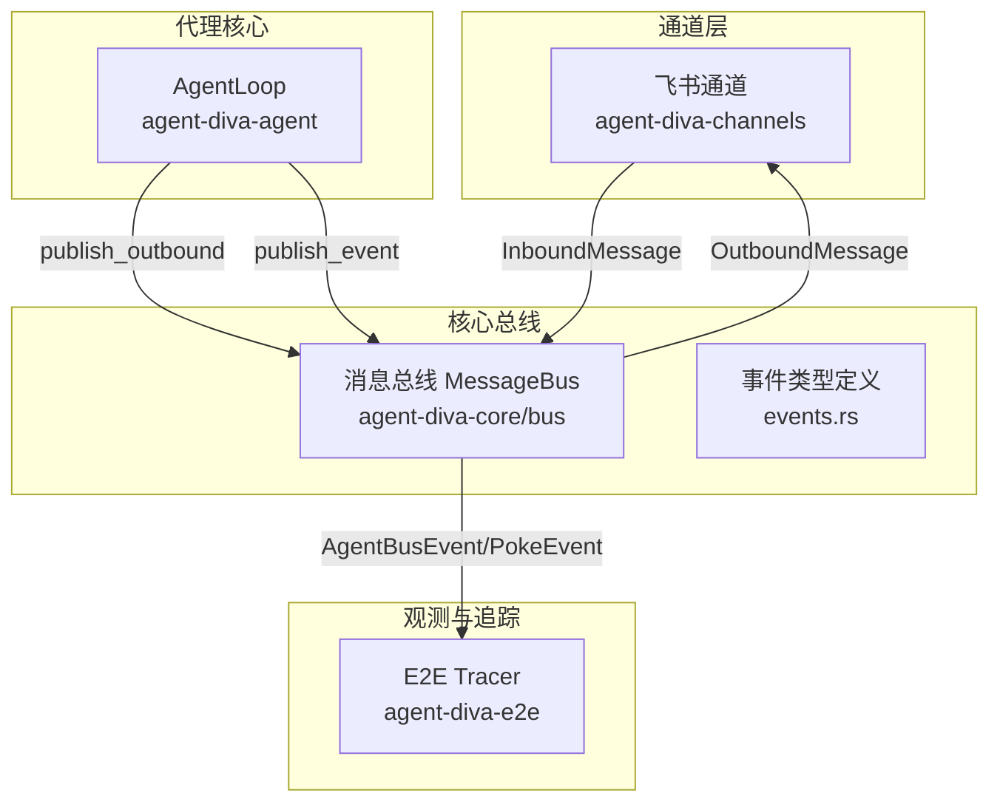
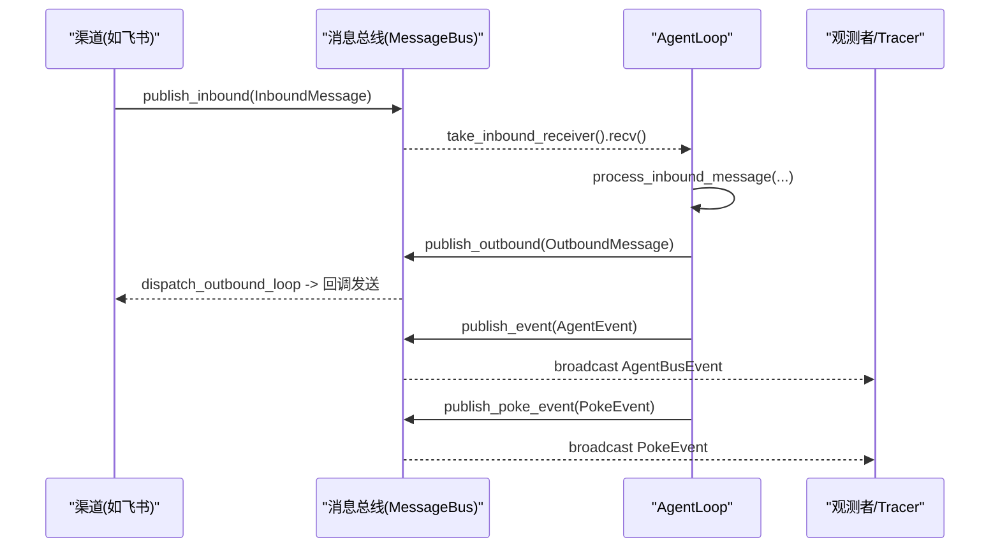
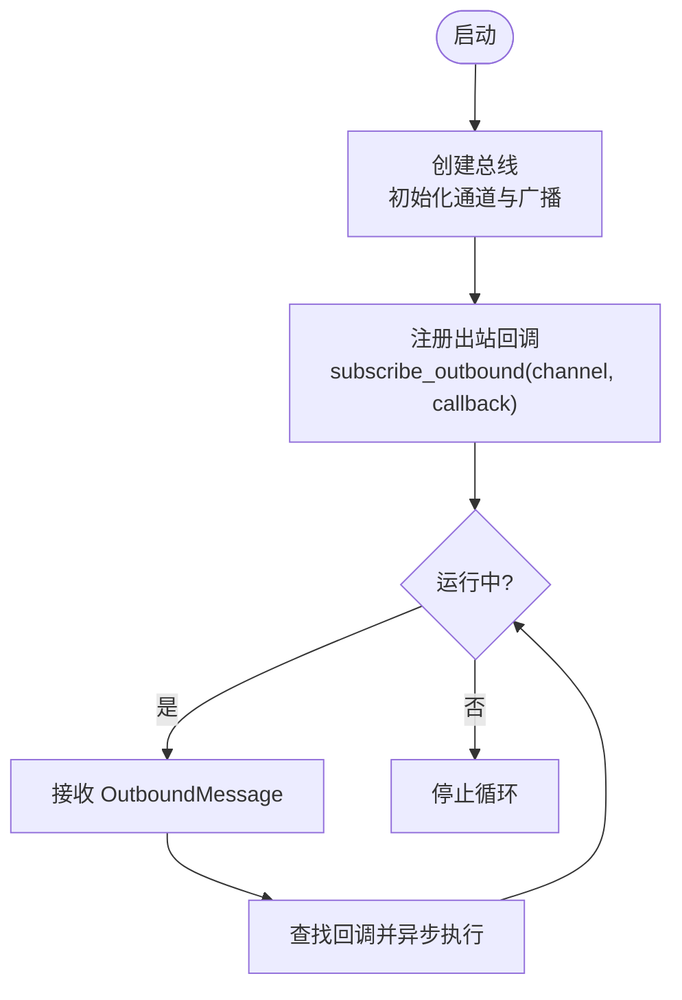
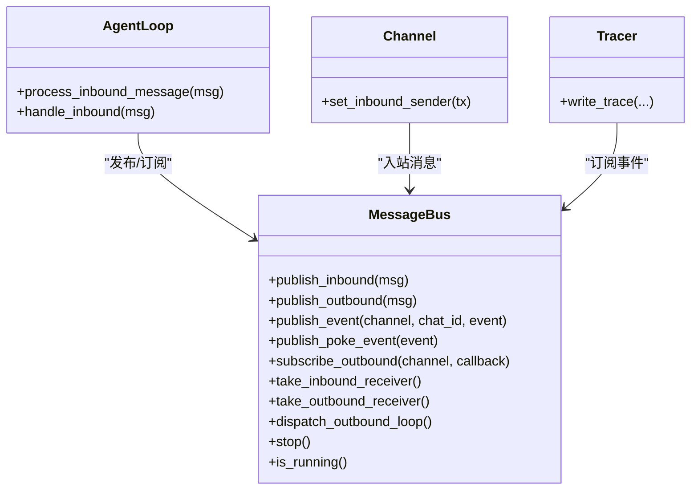
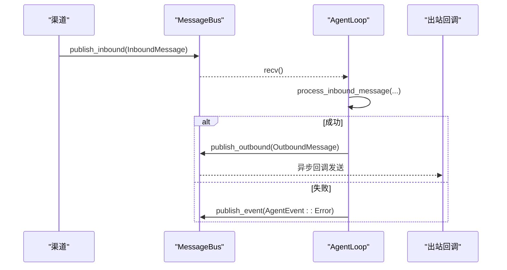
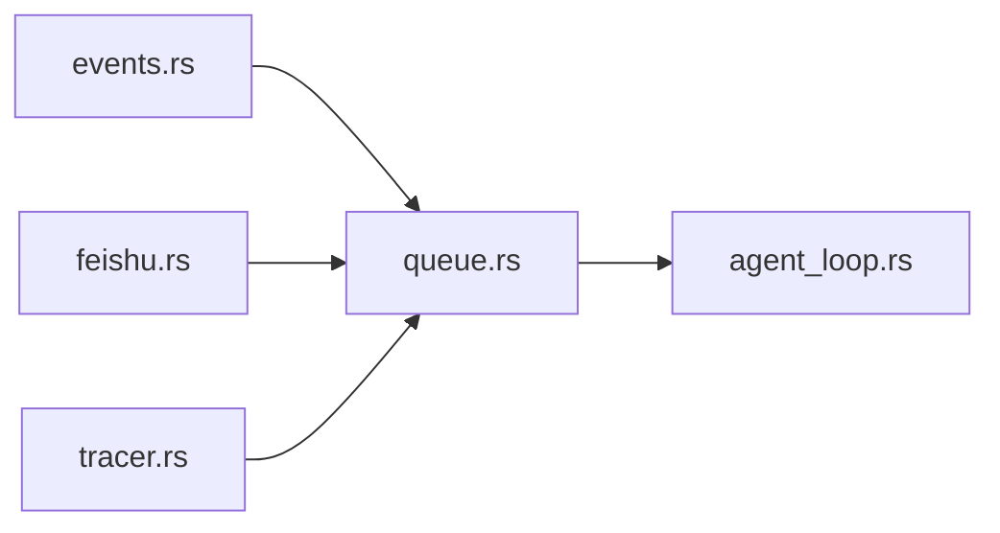

# 事件驱动架构

<cite>
**本文引用的文件**
- [agent-diva-core/src/bus/mod.rs](file://agent-diva-core/src/bus/mod.rs)
- [agent-diva-core/src/bus/events.rs](file://agent-diva-core/src/bus/events.rs)
- [agent-diva-core/src/bus/queue.rs](file://agent-diva-core/src/bus/queue.rs)
- [agent-diva-agent/src/agent_loop.rs](file://agent-diva-agent/src/agent_loop.rs)
- [agent-diva-channels/src/feishu.rs](file://agent-diva-channels/src/feishu.rs)
- [agent-diva-e2e/src/tracer.rs](file://agent-diva-e2e/src/tracer.rs)
</cite>

## 目录
1. [简介](#简介)
2. [项目结构](#项目结构)
3. [核心组件](#核心组件)
4. [架构总览](#架构总览)
5. [详细组件分析](#详细组件分析)
6. [依赖关系分析](#依赖关系分析)
7. [性能与背压](#性能与背压)
8. [故障排查指南](#故障排查指南)
9. [结论](#结论)
10. [附录](#附录)

## 简介
本文件面向 Agent-Diva 的事件驱动架构，聚焦基于消息总线的解耦通信设计。文档围绕以下主题展开：
- 核心事件类型：AgentBusEvent、AgentEvent、InboundMessage、OutboundMessage、PokeEvent
- 双队列系统（inbound/outbound）的设计原理与实现机制
- 发布/订阅模式与松耦合通信
- 异步事件处理模型：队列管理、背压策略、优先级与调度
- 事件追踪与调试机制
- 最佳实践与性能调优建议
- 架构图展示事件流向与组件交互

## 项目结构
事件驱动能力集中在 agent-diva-core 的 bus 模块中，并通过 agent-diva-agent 的 AgentLoop 消费 inbound 消息并产出 outbound 响应；channels 将外部渠道消息注入 inbound 队列；e2e tracer 提供端到端追踪输出。

图表来源
- [agent-diva-core/src/bus/mod.rs:1-14](file://agent-diva-core/src/bus/mod.rs#L1-L14)
- [agent-diva-core/src/bus/events.rs:12-153](file://agent-diva-core/src/bus/events.rs#L12-L153)
- [agent-diva-core/src/bus/queue.rs:19-39](file://agent-diva-core/src/bus/queue.rs#L19-L39)
- [agent-diva-agent/src/agent_loop.rs:917-937](file://agent-diva-agent/src/agent_loop.rs#L917-L937)
- [agent-diva-channels/src/feishu.rs:216-219](file://agent-diva-channels/src/feishu.rs#L216-L219)
- [agent-diva-e2e/src/tracer.rs:73-85](file://agent-diva-e2e/src/tracer.rs#L73-L85)

章节来源
- [agent-diva-core/src/bus/mod.rs:1-14](file://agent-diva-core/src/bus/mod.rs#L1-L14)

## 核心组件
- 事件类型与数据模型
  - AgentEvent：流式与生命周期事件（迭代开始、助手增量文本、工具调用、计划状态变更、错误、重试、上下文压缩等）
  - AgentBusEvent：携带 channel/chat_id 上下文的事件包装
  - InboundMessage/OutboundMessage：入站/出站消息载体
  - PokeEvent：系统级生命周期与审计事件（发送/接收、Token 使用、配置变更提示等）
- 消息总线 MessageBus
  - 双队列：inbound/outbound 通过 tokio::sync::mpsc 无界通道实现
  - 事件广播：AgentBusEvent 与 PokeEvent 分别通过 broadcast channel 分发
  - 出站分发：按 channel 注册回调，异步派发，避免阻塞
  - 运行控制：running 标志与 stop/is_running 接口

章节来源
- [agent-diva-core/src/bus/events.rs:12-153](file://agent-diva-core/src/bus/events.rs#L12-L153)
- [agent-diva-core/src/bus/events.rs:155-213](file://agent-diva-core/src/bus/events.rs#L155-L213)
- [agent-diva-core/src/bus/events.rs:342-435](file://agent-diva-core/src/bus/events.rs#L342-L435)
- [agent-diva-core/src/bus/events.rs:361-394](file://agent-diva-core/src/bus/events.rs#L361-L394)
- [agent-diva-core/src/bus/queue.rs:19-39](file://agent-diva-core/src/bus/queue.rs#L19-L39)
- [agent-diva-core/src/bus/queue.rs:41-183](file://agent-diva-core/src/bus/queue.rs#L41-L183)

## 架构总览
下图展示了从渠道到代理核心再到渠道的完整事件流，以及事件广播用于观测与追踪的路径。

图表来源
- [agent-diva-core/src/bus/queue.rs:95-117](file://agent-diva-core/src/bus/queue.rs#L95-L117)
- [agent-diva-core/src/bus/queue.rs:132-173](file://agent-diva-core/src/bus/queue.rs#L132-L173)
- [agent-diva-core/src/bus/queue.rs:61-93](file://agent-diva-core/src/bus/queue.rs#L61-L93)
- [agent-diva-agent/src/agent_loop.rs:917-937](file://agent-diva-agent/src/agent_loop.rs#L917-L937)
- [agent-diva-channels/src/feishu.rs:216-219](file://agent-diva-channels/src/feishu.rs#L216-L219)

## 详细组件分析

### 事件类型与语义
- AgentEvent
  - 覆盖会话内关键阶段：迭代开始、助手/推理增量、工具调用生命周期、计划相关事件（就绪、报告就绪、聊天计划更新）、最终响应、错误、提供者重试/停滞、上下文压缩进度等
  - 适合 UI 实时渲染、监控面板、审计日志
- AgentBusEvent
  - 为每个事件附加 channel/chat_id，便于多会话/多渠道隔离与路由
- InboundMessage/OutboundMessage
  - 入站包含来源渠道、用户、会话、内容、时间戳、媒体与元数据
  - 出站包含目标渠道、会话、内容、回复引用、媒体、推理内容与元数据
- PokeEvent
  - 系统级事件：消息收发、推理接收、会话结束、历史追加、Token 消耗、配置热更需重启提示

章节来源
- [agent-diva-core/src/bus/events.rs:12-153](file://agent-diva-core/src/bus/events.rs#L12-L153)
- [agent-diva-core/src/bus/events.rs:155-213](file://agent-diva-core/src/bus/events.rs#L155-L213)
- [agent-diva-core/src/bus/events.rs:342-435](file://agent-diva-core/src/bus/events.rs#L342-L435)
- [agent-diva-core/src/bus/events.rs:361-394](file://agent-diva-core/src/bus/events.rs#L361-L394)

### 双队列系统与出站分发
- 入队/出队
  - inbound/outbound 均使用无界 mpsc 通道，生产者无需等待消费者
  - 通过 take_*_receiver 获取唯一接收器，确保单消费者语义
- 出站分发
  - 按 channel 维护回调集合，dispatch_outbound_loop 循环取消息并异步 spawn 执行回调
  - 周期性检查 running 标志以支持优雅停止
- 事件广播
  - AgentBusEvent 与 PokeEvent 各自独立广播通道，订阅者互不干扰

图表来源
- [agent-diva-core/src/bus/queue.rs:41-59](file://agent-diva-core/src/bus/queue.rs#L41-L59)
- [agent-diva-core/src/bus/queue.rs:119-183](file://agent-diva-core/src/bus/queue.rs#L119-L183)

章节来源
- [agent-diva-core/src/bus/queue.rs:95-117](file://agent-diva-core/src/bus/queue.rs#L95-L117)
- [agent-diva-core/src/bus/queue.rs:132-173](file://agent-diva-core/src/bus/queue.rs#L132-L173)

### 发布/订阅与松耦合通信
- 发布者
  - AgentLoop 在消息处理后通过 publish_outbound 将响应写入总线
  - 任意组件可通过 publish_event/publish_poke_event 广播事件
- 订阅者
  - 渠道侧通过 subscribe_outbound 注册回调，按 channel 精准投递
  - 观测/追踪侧通过 subscribe_events/subscribe_poke_events 订阅事件流
- 解耦点
  - 渠道与代理核心仅通过总线交互，不直接持有对方引用
  - 事件与消息分离：业务消息走队列，系统事件走广播

图表来源
- [agent-diva-core/src/bus/queue.rs:41-183](file://agent-diva-core/src/bus/queue.rs#L41-L183)
- [agent-diva-agent/src/agent_loop.rs:917-937](file://agent-diva-agent/src/agent_loop.rs#L917-L937)
- [agent-diva-channels/src/feishu.rs:216-219](file://agent-diva-channels/src/feishu.rs#L216-L219)
- [agent-diva-e2e/src/tracer.rs:73-85](file://agent-diva-e2e/src/tracer.rs#L73-L85)

章节来源
- [agent-diva-core/src/bus/queue.rs:61-93](file://agent-diva-core/src/bus/queue.rs#L61-L93)
- [agent-diva-agent/src/agent_loop.rs:917-937](file://agent-diva-agent/src/agent_loop.rs#L917-L937)
- [agent-diva-channels/src/feishu.rs:216-219](file://agent-diva-channels/src/feishu.rs#L216-L219)

### 异步事件处理模型
- 入站处理
  - AgentLoop.handle_inbound 接收 InboundMessage，调用 process_inbound_message 进行业务处理
  - 成功时通过 publish_outbound 返回响应；失败时记录错误并触发错误事件
- 出站分发
  - dispatch_outbound_loop 持续消费 OutboundMessage，按 channel 分发到已注册的回调
  - 每个回调异步 spawn，避免阻塞主循环
- 事件广播
  - publish_event/publish_poke_event 忽略无接收者的错误，保证发布者不被阻塞

图表来源
- [agent-diva-agent/src/agent_loop.rs:917-937](file://agent-diva-agent/src/agent_loop.rs#L917-L937)
- [agent-diva-core/src/bus/queue.rs:132-173](file://agent-diva-core/src/bus/queue.rs#L132-L173)
- [agent-diva-core/src/bus/queue.rs:61-93](file://agent-diva-core/src/bus/queue.rs#L61-L93)

章节来源
- [agent-diva-agent/src/agent_loop.rs:917-937](file://agent-diva-agent/src/agent_loop.rs#L917-L937)
- [agent-diva-core/src/bus/queue.rs:132-173](file://agent-diva-core/src/bus/queue.rs#L132-L173)

### 事件追踪与调试
- 事件追踪
  - E2E Tracer 收集事件并写入 JSON 文件，便于回放与断言
  - 事件包含错误、工具调用、时间线等信息
- 调试建议
  - 利用 AgentEvent 的 ProviderRetry/ProviderStalled 定位外部依赖问题
  - 使用 PokeEvent 的 TokenUsed/ConfigChangeNeedsRestart 辅助资源与配置排障
  - 结合 tracing span（trace_id）关联一次请求的全链路日志

章节来源
- [agent-diva-e2e/src/tracer.rs:73-85](file://agent-diva-e2e/src/tracer.rs#L73-L85)
- [agent-diva-core/src/bus/events.rs:118-145](file://agent-diva-core/src/bus/events.rs#L118-L145)
- [agent-diva-core/src/bus/events.rs:361-394](file://agent-diva-core/src/bus/events.rs#L361-L394)

## 依赖关系分析
- 模块内聚性
  - bus/events.rs 定义所有事件与消息类型，职责单一
  - bus/queue.rs 封装通道与分发逻辑，屏蔽底层同步原语
- 跨模块耦合
  - agent-diva-agent 依赖 bus 进行消息收发与事件广播
  - channels 通过设置 inbound sender 将外部消息注入总线
  - e2e 通过订阅事件完成端到端验证
- 潜在风险
  - 无界通道在高负载下可能内存增长，需配合背压策略
  - 出站回调若阻塞或异常，会影响整体吞吐，应做超时与错误隔离

图表来源
- [agent-diva-core/src/bus/events.rs:12-153](file://agent-diva-core/src/bus/events.rs#L12-L153)
- [agent-diva-core/src/bus/queue.rs:19-39](file://agent-diva-core/src/bus/queue.rs#L19-L39)
- [agent-diva-agent/src/agent_loop.rs:917-937](file://agent-diva-agent/src/agent_loop.rs#L917-L937)
- [agent-diva-channels/src/feishu.rs:216-219](file://agent-diva-channels/src/feishu.rs#L216-L219)
- [agent-diva-e2e/src/tracer.rs:73-85](file://agent-diva-e2e/src/tracer.rs#L73-L85)

章节来源
- [agent-diva-core/src/bus/mod.rs:1-14](file://agent-diva-core/src/bus/mod.rs#L1-L14)

## 性能与背压
- 当前实现
  - inbound/outbound 使用无界通道，生产者可快速提交而不阻塞
  - 出站回调异步 spawn，避免阻塞分发循环
  - 广播通道容量有限（示例为 1024），但发送端忽略无接收者错误
- 背压建议
  - 引入有界通道或令牌桶限制入站速率，防止内存膨胀
  - 对出站回调增加超时与重试上限，失败进入死信队列
  - 为高优先级事件（如错误、重试）建立优先队列，保障关键路径
  - 在 AgentLoop 侧增加批处理与节流，降低频繁小消息开销
- 监控指标
  - 队列长度、分发延迟、回调耗时、错误率、Token 使用量
  - 结合 PokeEvent::TokenUsed 与 AgentEvent::ProviderRetry/Stalled 构建告警

[本节为通用指导，不直接分析具体文件]

## 故障排查指南
- 常见问题
  - 出站无回调：检查是否已为对应 channel 注册回调，且 dispatch_outbound_loop 正在运行
  - 事件丢失：确认订阅者在事件高峰前已建立订阅；必要时增大广播通道容量
  - 处理失败：查看 AgentEvent::Error 与错误上下文，结合 trace_id 定位
- 诊断步骤
  - 启用 tracing 并采集 span，核对 trace_id 贯穿全流程
  - 订阅 PokeEvent，观察 ChatReceived/ChatSent/TokenUsed 等关键节点
  - 使用 E2E Tracer 生成 trace 文件，回放事件序列

章节来源
- [agent-diva-core/src/bus/queue.rs:132-173](file://agent-diva-core/src/bus/queue.rs#L132-L173)
- [agent-diva-core/src/bus/events.rs:118-145](file://agent-diva-core/src/bus/events.rs#L118-L145)
- [agent-diva-core/src/bus/events.rs:361-394](file://agent-diva-core/src/bus/events.rs#L361-L394)
- [agent-diva-e2e/src/tracer.rs:73-85](file://agent-diva-e2e/src/tracer.rs#L73-L85)

## 结论
该事件驱动架构通过 MessageBus 实现了渠道与代理核心的解耦通信，采用双队列与广播通道支撑消息与事件的异步流转。AgentEvent 与 PokeEvent 覆盖了从业务到系统的广泛场景，便于 UI、监控与审计。当前实现简洁高效，建议在后续版本引入背压、优先级与持久化队列，进一步提升稳定性与可观测性。

[本节为总结，不直接分析具体文件]

## 附录
- 最佳实践
  - 明确事件边界：业务事件用 AgentEvent，系统事件用 PokeEvent
  - 合理拆分 channel/chat_id，确保事件路由与隔离
  - 为回调设置超时与错误处理，避免级联故障
  - 使用 trace_id 串联全链路日志与追踪
- 性能调优
  - 根据负载调整广播通道容量与回调并发度
  - 对高频小消息进行合并与节流
  - 监控队列长度与分发延迟，及时扩容或限流

[本节为通用指导，不直接分析具体文件]