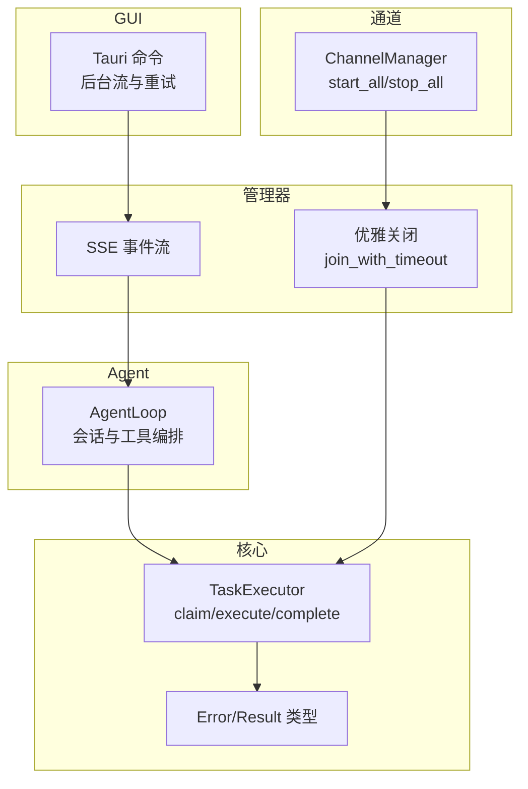
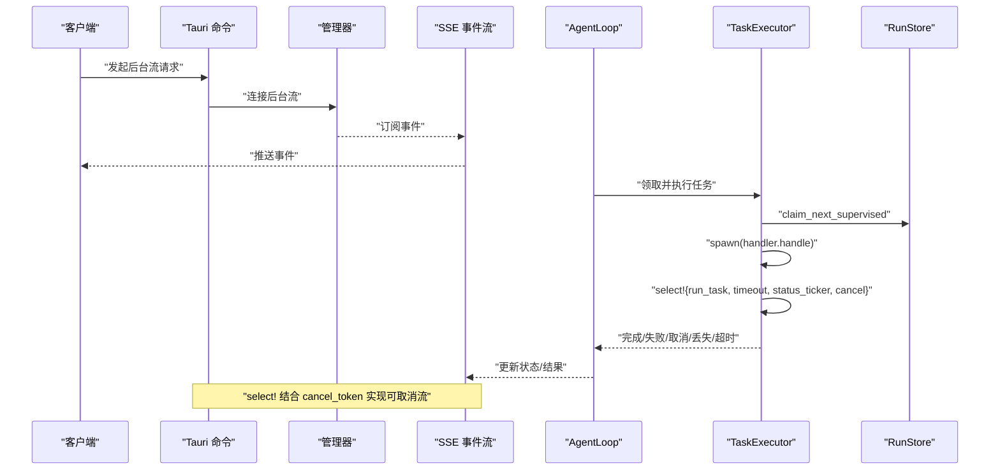
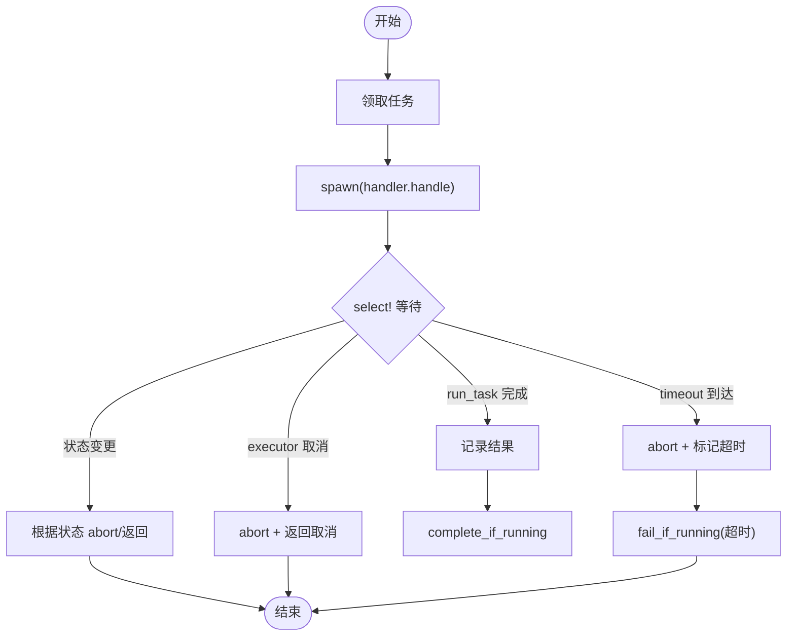
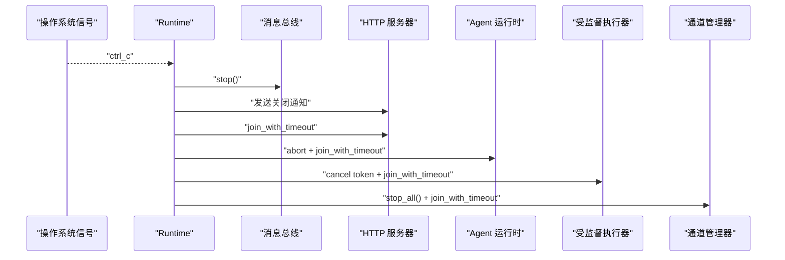
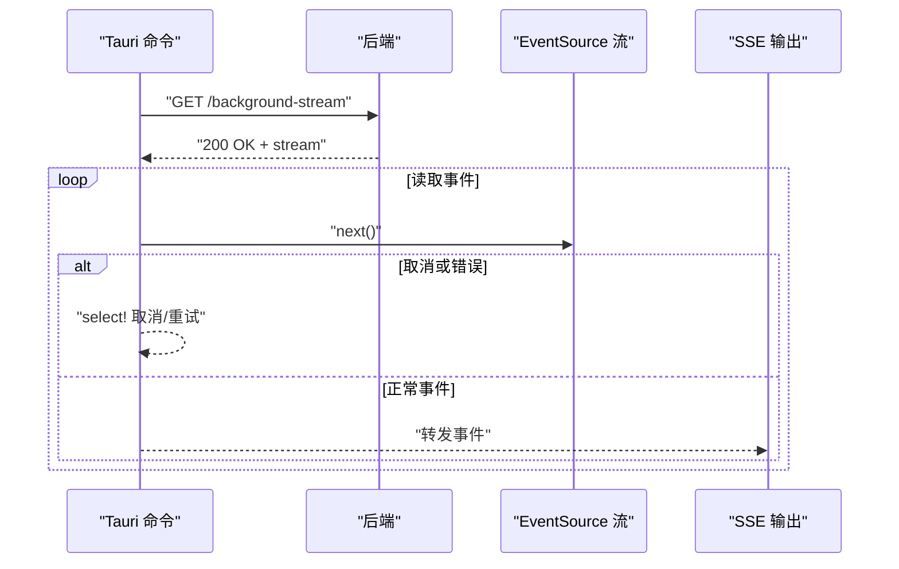
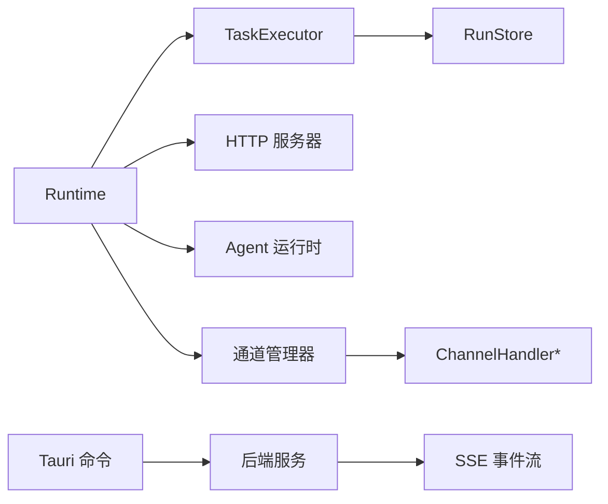
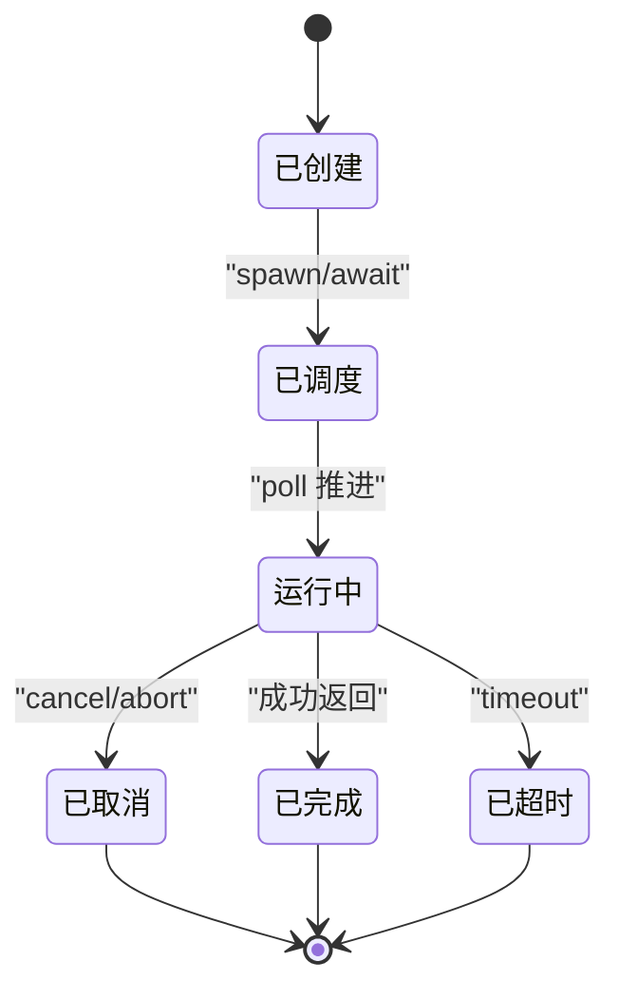
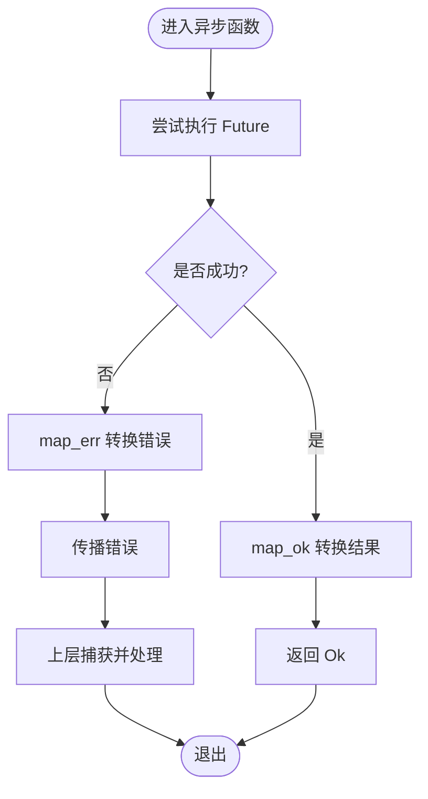

# Future 处理模型

<cite>
**本文引用的文件**
- [executor.rs](file://agent-diva-core/src/supervised/executor.rs)
- [shutdown.rs](file://agent-diva-manager/src/runtime/shutdown.rs)
- [agent_loop.rs](file://agent-diva-agent/src/agent_loop.rs)
- [error.rs](file://agent-diva-core/src/error.rs)
- [commands.rs](file://agent-diva-gui/src-tauri/src/commands.rs)
- [handlers.rs](file://agent-diva-manager/src/handlers.rs)
- [manager.rs](file://agent-diva-channels/src/manager.rs)
</cite>

## 目录
1. [简介](#简介)
2. [项目结构](#项目结构)
3. [核心组件](#核心组件)
4. [架构总览](#架构总览)
5. [详细组件分析](#详细组件分析)
6. [依赖关系分析](#依赖关系分析)
7. [性能考量](#性能考量)
8. [故障排查指南](#故障排查指南)
9. [结论](#结论)
10. [附录](#附录)

## 简介
本文件聚焦 Agent Diva 中 Rust 异步编程的 Future 处理模型，围绕 Future 的创建、组合与执行展开，结合项目中的实际代码说明 async/await 在编译期与运行期的行为，并总结 join/select/then 等组合模式的使用方式。文档还涵盖异步错误传播机制（基于 Result 的异步版本）、生命周期管理与优雅关闭策略，以及最佳实践与常见陷阱。文末提供 Future 生命周期图与错误处理流程图，帮助读者快速建立系统化的理解。

## 项目结构
Agent Diva 采用多 crate 协作：核心调度与任务执行位于 agent-diva-core；管理器运行时负责服务启动与优雅关闭；Agent 循环编排会话与工具调用；GUI Tauri 命令层通过流式事件与后端交互；通道模块管理多种通信渠道的生命周期。这些模块共同构成以 Future 为核心的异步执行网络。

图表来源
- [executor.rs:90-220](file://agent-diva-core/src/supervised/executor.rs#L90-L220)
- [shutdown.rs:21-120](file://agent-diva-manager/src/runtime/shutdown.rs#L21-L120)
- [agent_loop.rs:111-158](file://agent-diva-agent/src/agent_loop.rs#L111-L158)
- [commands.rs:2850-2949](file://agent-diva-gui/src-tauri/src/commands.rs#L2850-L2949)
- [handlers.rs:618-657](file://agent-diva-manager/src/handlers.rs#L618-L657)
- [manager.rs:644-683](file://agent-diva-channels/src/manager.rs#L644-L683)

章节来源
- [executor.rs:90-220](file://agent-diva-core/src/supervised/executor.rs#L90-L220)
- [shutdown.rs:21-120](file://agent-diva-manager/src/runtime/shutdown.rs#L21-L120)
- [agent_loop.rs:111-158](file://agent-diva-agent/src/agent_loop.rs#L111-L158)
- [commands.rs:2850-2949](file://agent-diva-gui/src-tauri/src/commands.rs#L2850-L2949)
- [handlers.rs:618-657](file://agent-diva-manager/src/handlers.rs#L618-L657)
- [manager.rs:644-683](file://agent-diva-channels/src/manager.rs#L644-L683)

## 核心组件
- TaskExecutor：负责任务的领取、执行、心跳保活、超时与取消控制，并将结果写回存储。
- 优雅关闭：统一使用 join_with_timeout 对各类后台任务进行限时等待与强制中止，确保进程退出可控。
- AgentLoop：编排会话、工具调用与外部资源，贯穿整个 Agent 生命周期。
- 错误模型：统一的 Error 枚举与 Result 类型，便于跨层传播与分类处理。
- 流式事件：SSE 与后台流（EventSource）用于实时推送与重连逻辑。
- 通道管理：批量启停 ChannelHandler，保证资源释放有序。

章节来源
- [executor.rs:14-22](file://agent-diva-core/src/supervised/executor.rs#L14-L22)
- [executor.rs:53-70](file://agent-diva-core/src/supervised/executor.rs#L53-L70)
- [executor.rs:90-220](file://agent-diva-core/src/supervised/executor.rs#L90-L220)
- [shutdown.rs:21-120](file://agent-diva-manager/src/runtime/shutdown.rs#L21-L120)
- [agent_loop.rs:111-158](file://agent-diva-agent/src/agent_loop.rs#L111-L158)
- [error.rs:1-73](file://agent-diva-core/src/error.rs#L1-L73)
- [handlers.rs:618-657](file://agent-diva-manager/src/handlers.rs#L618-L657)
- [commands.rs:2850-2949](file://agent-diva-gui/src-tauri/src/commands.rs#L2850-L2949)
- [manager.rs:644-683](file://agent-diva-channels/src/manager.rs#L644-L683)

## 架构总览
下图展示了从请求进入、任务执行到关闭的全链路 Future 组合与执行路径。

图表来源
- [commands.rs:2850-2949](file://agent-diva-gui/src-tauri/src/commands.rs#L2850-L2949)
- [handlers.rs:618-657](file://agent-diva-manager/src/handlers.rs#L618-L657)
- [executor.rs:90-220](file://agent-diva-core/src/supervised/executor.rs#L90-L220)

## 详细组件分析

### TaskExecutor：Future 的组合与执行
- 创建：通过 claim_next_supervised 获取待执行记录，构造 handler 调用 Future。
- 组合：使用 tokio::select! 将 run_task、timeout_sleep、status_ticker、executor_cancel 等多路 Future 组合为单一等待点。
- 执行：spawn 出 handler 任务，内部 await 业务逻辑；外部轮询状态与超时。
- 终止：根据 select! 分支决定 complete/fail/cancel/lost/timed_out，并清理心跳任务。

图表来源
- [executor.rs:123-220](file://agent-diva-core/src/supervised/executor.rs#L123-L220)
- [executor.rs:222-309](file://agent-diva-core/src/supervised/executor.rs#L222-L309)

章节来源
- [executor.rs:90-220](file://agent-diva-core/src/supervised/executor.rs#L90-L220)
- [executor.rs:222-309](file://agent-diva-core/src/supervised/executor.rs#L222-L309)

### 优雅关闭：Future 的生命周期管理
- 统一使用 join_with_timeout 对每个后台任务进行限时等待，若未退出则 abort 并再次等待短超时。
- 按依赖顺序停止消息总线、HTTP 服务器、管理器、桥接器、Agent 运行时、受监督执行器、通道运行时与定时任务。
- 通过 CancellationToken 与信号监听协调关闭流程。

图表来源
- [shutdown.rs:21-120](file://agent-diva-manager/src/runtime/shutdown.rs#L21-L120)

章节来源
- [shutdown.rs:21-120](file://agent-diva-manager/src/runtime/shutdown.rs#L21-L120)

### AgentLoop：Future 的编排与工具调用
- 作为核心处理引擎，持有工具注册表、会话管理器、内存提供者等，并通过 mpsc、JoinHandle 等组合多个 Future。
- 支持全局超时、每工具超时、命令审批、Cron 任务、受监督任务等场景下的 Future 组合。
- 通过 SessionDispatcher 控制并发与取消，避免死锁与资源泄漏。

章节来源
- [agent_loop.rs:111-158](file://agent-diva-agent/src/agent_loop.rs#L111-L158)

### 流式事件：后台流与 SSE
- 后台流：使用 EventSource 读取字节流，结合 cancel_token 与 sleep 实现可取消的重连与退避。
- SSE：通过 BroadcastStream 过滤事件并转换为 SSE 输出，保持长连接与低延迟。

图表来源
- [commands.rs:2850-2949](file://agent-diva-gui/src-tauri/src/commands.rs#L2850-L2949)
- [handlers.rs:618-657](file://agent-diva-manager/src/handlers.rs#L618-L657)

章节来源
- [commands.rs:2850-2949](file://agent-diva-gui/src-tauri/src/commands.rs#L2850-L2949)
- [handlers.rs:618-657](file://agent-diva-manager/src/handlers.rs#L618-L657)

### 通道管理：批量 Future 的启停
- start_all：遍历所有 ChannelHandler 并启动，收集失败项但继续运行其他通道。
- stop_all：依次停止各通道并清空映射，确保资源释放。

章节来源
- [manager.rs:644-683](file://agent-diva-channels/src/manager.rs#L644-L683)

## 依赖关系分析
- TaskExecutor 依赖 RunStore 进行状态持久化与心跳上报。
- 管理器运行时依赖各子系统句柄（JoinHandle），通过 join_with_timeout 统一管理生命周期。
- AgentLoop 依赖工具注册表、会话管理器、内存提供者等，形成复杂的 Future 组合网络。
- GUI 命令层依赖 HTTP 客户端与事件流，结合 cancel_token 实现可取消的后台任务。
- 通道管理器依赖共享的 handlers 集合，使用 RwLock 保护并发访问。

图表来源
- [executor.rs:90-220](file://agent-diva-core/src/supervised/executor.rs#L90-L220)
- [shutdown.rs:21-120](file://agent-diva-manager/src/runtime/shutdown.rs#L21-L120)
- [manager.rs:644-683](file://agent-diva-channels/src/manager.rs#L644-L683)
- [handlers.rs:618-657](file://agent-diva-manager/src/handlers.rs#L618-L657)
- [commands.rs:2850-2949](file://agent-diva-gui/src-tauri/src/commands.rs#L2850-L2949)

章节来源
- [executor.rs:90-220](file://agent-diva-core/src/supervised/executor.rs#L90-L220)
- [shutdown.rs:21-120](file://agent-diva-manager/src/runtime/shutdown.rs#L21-L120)
- [manager.rs:644-683](file://agent-diva-channels/src/manager.rs#L644-L683)
- [handlers.rs:618-657](file://agent-diva-manager/src/handlers.rs#L618-L657)
- [commands.rs:2850-2949](file://agent-diva-gui/src-tauri/src/commands.rs#L2850-L2949)

## 性能考量
- 使用 tokio::select! 将多个 Future 合并为一个等待点，避免忙轮询与 CPU 浪费。
- 心跳与状态轮询使用 interval/interval_at，合理设置间隔以降低 I/O 压力。
- 优雅关闭通过 join_with_timeout 限制阻塞时间，防止进程卡死。
- 后台流使用 EventSource 与 keep-alive，减少连接开销并提升实时性。
- 通道批量启停时，单个失败不影响整体，提高鲁棒性。

[本节为通用指导，不直接分析具体文件]

## 故障排查指南
- 任务超时：检查 executor 的 timeout 配置与 handler 的执行耗时，必要时调整超时阈值。
- 任务被取消：确认外部 cancel token 是否被触发，检查 select! 分支是否正确处理取消。
- 优雅关闭失败：查看 join_with_timeout 日志，定位未退出的任务并增加 abort 后的二次等待。
- 流式事件中断：检查后台流的错误分支与重试逻辑，确认 cancel_token 与 sleep 的配合。
- 通道停止异常：关注 stop_all 的错误日志，逐个通道排查 stop 实现。

章节来源
- [executor.rs:222-309](file://agent-diva-core/src/supervised/executor.rs#L222-L309)
- [shutdown.rs:107-120](file://agent-diva-manager/src/runtime/shutdown.rs#L107-L120)
- [commands.rs:2850-2949](file://agent-diva-gui/src-tauri/src/commands.rs#L2850-L2949)
- [manager.rs:666-683](file://agent-diva-channels/src/manager.rs#L666-L683)

## 结论
Agent Diva 以 Future 为核心构建异步执行模型，通过 select! 组合多路 Future，配合 CancellationToken 与 join_with_timeout 实现可取消与优雅关闭。TaskExecutor 提供了健壮的任务执行框架，管理器与 GUI 层通过流式事件与后台流增强用户体验。遵循本文的最佳实践与故障排查建议，可有效提升系统的稳定性与可维护性。

[本节为总结，不直接分析具体文件]

## 附录

### Future 生命周期图

[本图为概念性图示，不对应具体源码文件]

### 错误处理流程图

[本图为概念性图示，不对应具体源码文件]