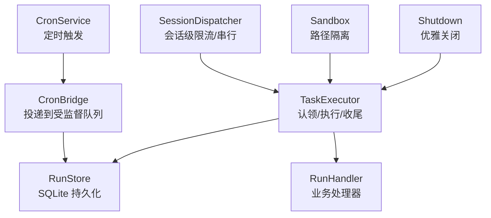
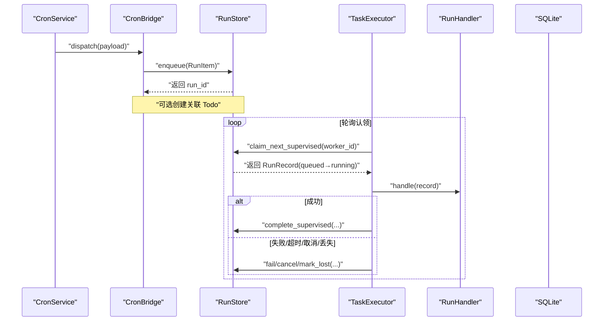
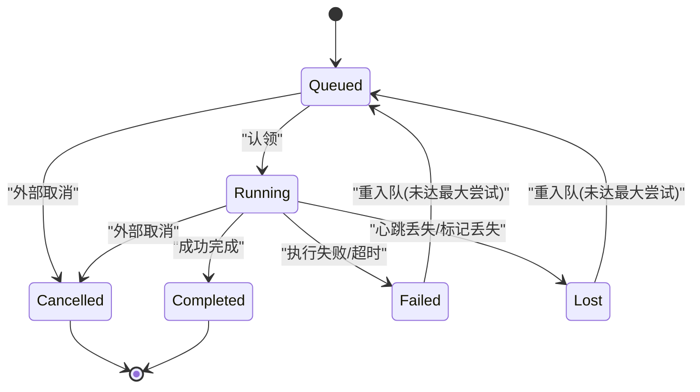
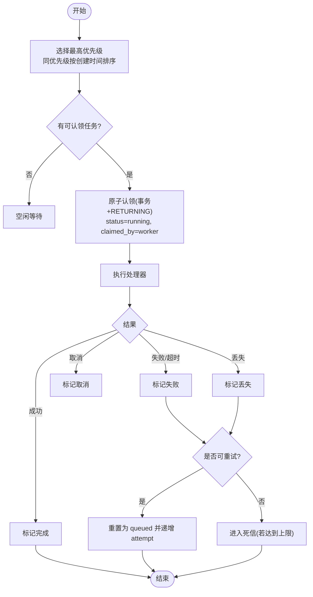
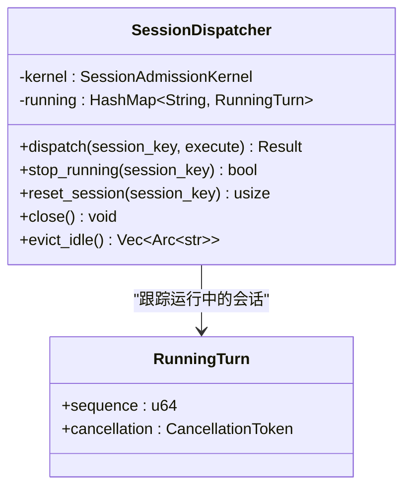
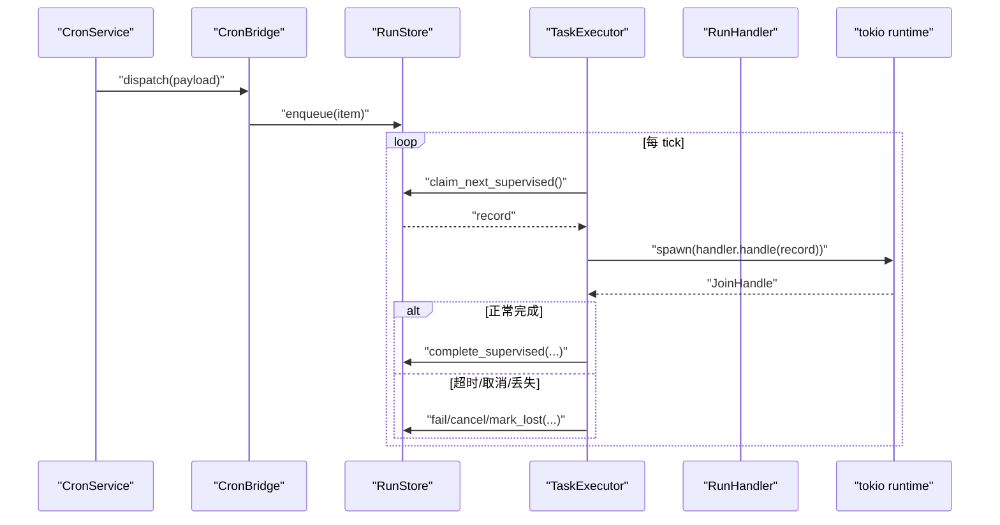
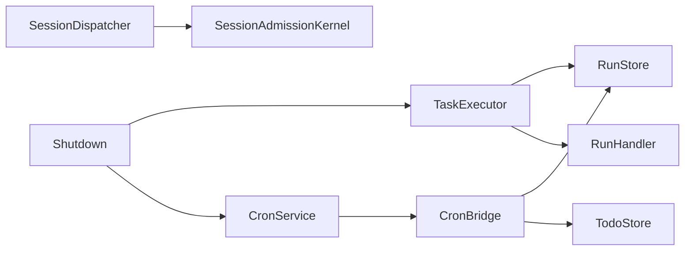

# 任务调度机制

<cite>
**本文引用的文件**
- [agent-diva-core/src/scheduler/mod.rs](file://agent-diva-core/src/scheduler/mod.rs)
- [agent-diva-core/src/scheduler/bridge.rs](file://agent-diva-core/src/scheduler/bridge.rs)
- [agent-diva-core/src/scheduler/sandbox.rs](file://agent-diva-core/src/scheduler/sandbox.rs)
- [agent-diva-core/src/supervised/types.rs](file://agent-diva-core/src/supervised/types.rs)
- [agent-diva-core/src/supervised/store.rs](file://agent-diva-core/src/supervised/store.rs)
- [agent-diva-core/src/supervised/executor.rs](file://agent-diva-core/src/supervised/executor.rs)
- [agent-diva-core/src/cron/service.rs](file://agent-diva-core/src/cron/service.rs)
- [agent-diva-agent/src/agent_loop/dispatcher.rs](file://agent-diva-agent/src/agent_loop/dispatcher.rs)
- [agent-diva-manager/src/runtime/shutdown.rs](file://agent-diva-manager/src/runtime/shutdown.rs)
</cite>

## 目录
1. [简介](#简介)
2. [项目结构](#项目结构)
3. [核心组件](#核心组件)
4. [架构总览](#架构总览)
5. [详细组件分析](#详细组件分析)
6. [依赖关系分析](#依赖关系分析)
7. [性能考量](#性能考量)
8. [故障排查指南](#故障排查指南)
9. [结论](#结论)
10. [附录](#附录)

## 简介
本文件系统化阐述基于 tokio 的任务调度机制，覆盖任务队列管理、优先级调度、资源分配策略；解释异步任务的创建、调度与执行流程（包括 spawn 与 spawn_blocking 的使用场景）；说明任务生命周期管理与状态转换；描述任务间依赖与协调（同步、通信、取消）；并提供性能优化技巧与监控指标。文档同时给出任务调度流程图与状态转换图，帮助读者快速理解从“提交”到“完成/失败/取消”的完整闭环。

## 项目结构
本项目将任务调度拆分为多个职责清晰的模块：
- 定时任务触发层：CronService 负责按 cron/间隔/一次性计划触发任务，并通过回调投递到下游。
- 桥接与持久化层：CronBridge 将 cron 触发转换为受监督运行项（SupervisedRun），并实现重试与死信处理。
- 执行器与工作进程：TaskExecutor 从存储中认领任务、执行处理器、维护心跳、超时与取消，并更新最终状态。
- 会话级分发器：SessionDispatcher 提供会话维度的限流、排队与串行化执行，避免同一会话重入。
- 沙箱路径隔离：Sandbox 提供双根隔离与路径校验，防止越权访问。
- 运行时关闭：Shutdown 统一协调各后台任务优雅退出。

**图表来源**
- [agent-diva-core/src/cron/service.rs:176-274](file://agent-diva-core/src/cron/service.rs#L176-L274)
- [agent-diva-core/src/scheduler/bridge.rs:69-98](file://agent-diva-core/src/scheduler/bridge.rs#L69-L98)
- [agent-diva-core/src/supervised/store.rs:355-410](file://agent-diva-core/src/supervised/store.rs#L355-L410)
- [agent-diva-core/src/supervised/executor.rs:90-114](file://agent-diva-core/src/supervised/executor.rs#L90-L114)
- [agent-diva-agent/src/agent_loop/dispatcher.rs:51-88](file://agent-diva-agent/src/agent_loop/dispatcher.rs#L51-L88)
- [agent-diva-core/src/scheduler/sandbox.rs:61-113](file://agent-diva-core/src/scheduler/sandbox.rs#L61-L113)
- [agent-diva-manager/src/runtime/shutdown.rs:74-120](file://agent-diva-manager/src/runtime/shutdown.rs#L74-L120)

**章节来源**
- [agent-diva-core/src/scheduler/mod.rs:1-9](file://agent-diva-core/src/scheduler/mod.rs#L1-L9)
- [agent-diva-core/src/scheduler/bridge.rs:1-472](file://agent-diva-core/src/scheduler/bridge.rs#L1-L472)
- [agent-diva-core/src/scheduler/sandbox.rs:1-309](file://agent-diva-core/src/scheduler/sandbox.rs#L1-L309)
- [agent-diva-core/src/supervised/types.rs:1-464](file://agent-diva-core/src/supervised/types.rs#L1-L464)
- [agent-diva-core/src/supervised/store.rs:1-800](file://agent-diva-core/src/supervised/store.rs#L1-L800)
- [agent-diva-core/src/supervised/executor.rs:1-629](file://agent-diva-core/src/supervised/executor.rs#L1-L629)
- [agent-diva-core/src/cron/service.rs:1-800](file://agent-diva-core/src/cron/service.rs#L1-L800)
- [agent-diva-agent/src/agent_loop/dispatcher.rs:1-314](file://agent-diva-agent/src/agent_loop/dispatcher.rs#L1-L314)
- [agent-diva-manager/src/runtime/shutdown.rs:74-120](file://agent-diva-manager/src/runtime/shutdown.rs#L74-L120)

## 核心组件
- CronService：维护作业集合与定时器，计算下次触发时间，触发时调用回调，记录运行快照与审计事件。
- CronBridge：将 cron 负载转为 RunItem/RunRecord 入队，支持指数退避重试与死信落盘。
- TaskExecutor：认领任务、启动心跳、执行处理器、处理超时/取消/丢失，写回完成/失败/取消状态。
- SessionDispatcher：按会话维度进行准入控制、队列深度限制、等待超时、串行执行与取消传播。
- RunStore：SQLite 持久化，提供优先级的原子认领、心跳、状态变更、丢失回收、重入队等能力。
- Sandbox：双根隔离与路径校验，拒绝目录穿越与符号链接逃逸。
- Shutdown：统一终止各后台任务，带超时与 abort 兜底。

**章节来源**
- [agent-diva-core/src/cron/service.rs:98-117](file://agent-diva-core/src/cron/service.rs#L98-L117)
- [agent-diva-core/src/scheduler/bridge.rs:40-67](file://agent-diva-core/src/scheduler/bridge.rs#L40-L67)
- [agent-diva-core/src/supervised/executor.rs:53-88](file://agent-diva-core/src/supervised/executor.rs#L53-L88)
- [agent-diva-agent/src/agent_loop/dispatcher.rs:17-49](file://agent-diva-agent/src/agent_loop/dispatcher.rs#L17-L49)
- [agent-diva-core/src/supervised/store.rs:11-95](file://agent-diva-core/src/supervised/store.rs#L11-L95)
- [agent-diva-core/src/scheduler/sandbox.rs:21-59](file://agent-diva-core/src/scheduler/sandbox.rs#L21-L59)
- [agent-diva-manager/src/runtime/shutdown.rs:74-120](file://agent-diva-manager/src/runtime/shutdown.rs#L74-L120)

## 架构总览
下图展示从“定时触发”到“执行完成”的端到端流程，以及关键的状态流转与并发控制点。

**图表来源**
- [agent-diva-core/src/scheduler/bridge.rs:69-98](file://agent-diva-core/src/scheduler/bridge.rs#L69-L98)
- [agent-diva-core/src/supervised/store.rs:355-410](file://agent-diva-core/src/supervised/store.rs#L355-L410)
- [agent-diva-core/src/supervised/executor.rs:123-220](file://agent-diva-core/src/supervised/executor.rs#L123-L220)

**章节来源**
- [agent-diva-core/src/cron/service.rs:176-274](file://agent-diva-core/src/cron/service.rs#L176-L274)
- [agent-diva-core/src/scheduler/bridge.rs:69-98](file://agent-diva-core/src/scheduler/bridge.rs#L69-L98)
- [agent-diva-core/src/supervised/store.rs:355-410](file://agent-diva-core/src/supervised/store.rs#L355-L410)
- [agent-diva-core/src/supervised/executor.rs:123-220](file://agent-diva-core/src/supervised/executor.rs#L123-L220)

## 详细组件分析

### 任务生命周期与状态机
受监督任务的生命周期由 RunStatus 定义，包含 Queued、Running、Completed、Failed、Cancelled、Lost。状态转换遵循严格规则，确保一致性。

**图表来源**
- [agent-diva-core/src/supervised/types.rs:7-65](file://agent-diva-core/src/supervised/types.rs#L7-L65)
- [agent-diva-core/src/supervised/store.rs:581-625](file://agent-diva-core/src/supervised/store.rs#L581-L625)
- [agent-diva-core/src/supervised/store.rs:681-729](file://agent-diva-core/src/supervised/store.rs#L681-L729)

**章节来源**
- [agent-diva-core/src/supervised/types.rs:7-65](file://agent-diva-core/src/supervised/types.rs#L7-L65)

### 优先级调度与队列管理
- 优先级：SupervisedRunSpec 支持 priority 字段；认领时使用 ORDER BY priority DESC, created_at ASC，保证高优先级先执行，同优先级按创建时间 FIFO。
- 去重：在 queued 状态下对 (message, channel, cron_job_id) 建立唯一索引，避免重复入队。
- 并发安全：使用事务 + RETURNING 原子认领，避免多消费者争抢。

**图表来源**
- [agent-diva-core/src/supervised/store.rs:355-410](file://agent-diva-core/src/supervised/store.rs#L355-L410)
- [agent-diva-core/src/supervised/store.rs:82-92](file://agent-diva-core/src/supervised/store.rs#L82-L92)
- [agent-diva-core/src/supervised/store.rs:681-729](file://agent-diva-core/src/supervised/store.rs#L681-L729)
- [agent-diva-core/src/scheduler/bridge.rs:100-164](file://agent-diva-core/src/scheduler/bridge.rs#L100-L164)

**章节来源**
- [agent-diva-core/src/supervised/store.rs:82-92](file://agent-diva-core/src/supervised/store.rs#L82-L92)
- [agent-diva-core/src/supervised/store.rs:355-410](file://agent-diva-core/src/supervised/store.rs#L355-L410)
- [agent-diva-core/src/supervised/store.rs:681-729](file://agent-diva-core/src/supervised/store.rs#L681-L729)
- [agent-diva-core/src/scheduler/bridge.rs:100-164](file://agent-diva-core/src/scheduler/bridge.rs#L100-L164)

### 资源分配与限流（会话级）
SessionDispatcher 提供会话维度的限流与串行化：
- 每个会话独立队列，FIFO 且不可重入。
- 支持队列深度限制与等待超时，超满时直接拒绝，避免背压扩散。
- 通过 CancellationToken 传播取消，停止当前运行但不影响后续等待者。

**图表来源**
- [agent-diva-agent/src/agent_loop/dispatcher.rs:17-49](file://agent-diva-agent/src/agent_loop/dispatcher.rs#L17-L49)
- [agent-diva-agent/src/agent_loop/dispatcher.rs:51-88](file://agent-diva-agent/src/agent_loop/dispatcher.rs#L51-L88)
- [agent-diva-agent/src/agent_loop/dispatcher.rs:90-120](file://agent-diva-agent/src/agent_loop/dispatcher.rs#L90-L120)

**章节来源**
- [agent-diva-agent/src/agent_loop/dispatcher.rs:51-88](file://agent-diva-agent/src/agent_loop/dispatcher.rs#L51-L88)
- [agent-diva-agent/src/agent_loop/dispatcher.rs:90-120](file://agent-diva-agent/src/agent_loop/dispatcher.rs#L90-L120)

### 任务创建、调度与执行流程（spawn/spawn_blocking）
- 创建：CronService 根据 schedule 计算下次触发时间，并在到期时调用 on_job 回调；CronBridge 将负载写入 RunStore。
- 调度：TaskExecutor 循环认领任务，使用 tokio::spawn 启动处理器任务，便于并发执行与取消。
- 阻塞任务：对于 CPU 密集或阻塞 I/O，应在处理器内部使用 tokio::task::spawn_blocking 包装，避免阻塞事件循环。
- 执行：处理器返回结果或错误，Executor 根据结果更新状态；支持超时、取消、丢失检测。

**图表来源**
- [agent-diva-core/src/cron/service.rs:342-458](file://agent-diva-core/src/cron/service.rs#L342-L458)
- [agent-diva-core/src/scheduler/bridge.rs:69-98](file://agent-diva-core/src/scheduler/bridge.rs#L69-L98)
- [agent-diva-core/src/supervised/executor.rs:168-185](file://agent-diva-core/src/supervised/executor.rs#L168-L185)
- [agent-diva-core/src/supervised/executor.rs:222-309](file://agent-diva-core/src/supervised/executor.rs#L222-L309)

**章节来源**
- [agent-diva-core/src/cron/service.rs:342-458](file://agent-diva-core/src/cron/service.rs#L342-L458)
- [agent-diva-core/src/scheduler/bridge.rs:69-98](file://agent-diva-core/src/scheduler/bridge.rs#L69-L98)
- [agent-diva-core/src/supervised/executor.rs:168-185](file://agent-diva-core/src/supervised/executor.rs#L168-L185)
- [agent-diva-core/src/supervised/executor.rs:222-309](file://agent-diva-core/src/supervised/executor.rs#L222-L309)

### 任务间的依赖与协调（同步、通信、取消）
- 同步：通过 RunStore 的状态与 claim 语义实现跨进程/线程的同步；心跳用于保活。
- 通信：通过消息体（message）、元数据（metadata）、标签（tags）传递上下文；Todo 与 Run 的关联用于追踪。
- 取消：CancellationToken 贯穿 CronService 与 SessionDispatcher；Executor 监听外部取消信号并中止处理器任务。

**章节来源**
- [agent-diva-core/src/supervised/store.rs:412-460](file://agent-diva-core/src/supervised/store.rs#L412-L460)
- [agent-diva-core/src/supervised/executor.rs:142-166](file://agent-diva-core/src/supervised/executor.rs#L142-L166)
- [agent-diva-core/src/supervised/executor.rs:264-309](file://agent-diva-core/src/supervised/executor.rs#L264-L309)
- [agent-diva-agent/src/agent_loop/dispatcher.rs:90-120](file://agent-diva-agent/src/agent_loop/dispatcher.rs#L90-L120)

### 沙箱路径隔离
- 双根隔离：data_root（代理状态）与 project_root（用户文件）分离。
- 路径校验：拒绝 .. 组件、规范化路径、验证符号链接不逃逸。

**章节来源**
- [agent-diva-core/src/scheduler/sandbox.rs:21-59](file://agent-diva-core/src/scheduler/sandbox.rs#L21-L59)
- [agent-diva-core/src/scheduler/sandbox.rs:61-113](file://agent-diva-core/src/scheduler/sandbox.rs#L61-L113)

## 依赖关系分析
- CronService 依赖 CronBridge 将触发转化为持久化任务。
- CronBridge 依赖 RunStore 与 TodoStore。
- TaskExecutor 依赖 RunStore 与 RunHandler 接口。
- SessionDispatcher 依赖 SessionAdmissionKernel 实现会话级限流。
- Shutdown 协调各后台任务（通道、cron、supervised executor）的优雅退出。

**图表来源**
- [agent-diva-core/src/cron/service.rs:98-117](file://agent-diva-core/src/cron/service.rs#L98-L117)
- [agent-diva-core/src/scheduler/bridge.rs:40-67](file://agent-diva-core/src/scheduler/bridge.rs#L40-L67)
- [agent-diva-core/src/supervised/executor.rs:53-88](file://agent-diva-core/src/supervised/executor.rs#L53-L88)
- [agent-diva-agent/src/agent_loop/dispatcher.rs:17-49](file://agent-diva-agent/src/agent_loop/dispatcher.rs#L17-L49)
- [agent-diva-manager/src/runtime/shutdown.rs:74-120](file://agent-diva-manager/src/runtime/shutdown.rs#L74-L120)

**章节来源**
- [agent-diva-core/src/cron/service.rs:98-117](file://agent-diva-core/src/cron/service.rs#L98-L117)
- [agent-diva-core/src/scheduler/bridge.rs:40-67](file://agent-diva-core/src/scheduler/bridge.rs#L40-L67)
- [agent-diva-core/src/supervised/executor.rs:53-88](file://agent-diva-core/src/supervised/executor.rs#L53-L88)
- [agent-diva-agent/src/agent_loop/dispatcher.rs:17-49](file://agent-diva-agent/src/agent_loop/dispatcher.rs#L17-L49)
- [agent-diva-manager/src/runtime/shutdown.rs:74-120](file://agent-diva-manager/src/runtime/shutdown.rs#L74-L120)

## 性能考量
- 优先级与索引：利用 (status, priority, created_at) 复合索引加速认领；避免全表扫描。
- 原子认领：使用事务 + RETURNING 减少竞争与锁升级开销。
- 心跳与丢失检测：合理设置心跳间隔与丢失阈值，平衡可靠性与开销。
- 超时控制：为长任务配置 timeout_secs，避免资源长期占用。
- 重试与退避：指数退避降低瞬时压力，结合死信队列隔离异常任务。
- 会话限流：限制队列深度与等待超时，防止背压扩散与内存增长。
- 阻塞任务隔离：CPU 密集或阻塞 I/O 使用 spawn_blocking，避免阻塞事件循环。
- 优雅关闭：shutdown 阶段带超时与 abort，确保系统可控退出。

[本节为通用指导，无需具体文件引用]

## 故障排查指南
- 任务无法认领：检查 RunStore 连接与索引；确认无脏锁；查看 claim_next_supervised 日志。
- 任务卡住：核对心跳是否更新；检查是否有外部 cancel 或 lost 标记；观察处理器是否响应取消。
- 频繁失败：查看错误信息；评估是否需要增加 max_attempts 或调整重试策略；关注死信队列。
- 超时过多：评估任务复杂度与 timeout_secs 配置；必要时拆分任务或提升资源配额。
- 会话拥塞：检查 SessionDispatcher 的队列深度与等待超时；考虑扩容或分流。
- 路径越权：确认 sandbox 配置正确；检查 resolve_sandbox_path 的错误提示。

**章节来源**
- [agent-diva-core/src/supervised/store.rs:412-460](file://agent-diva-core/src/supervised/store.rs#L412-L460)
- [agent-diva-core/src/supervised/executor.rs:264-309](file://agent-diva-core/src/supervised/executor.rs#L264-L309)
- [agent-diva-core/src/scheduler/bridge.rs:100-164](file://agent-diva-core/src/scheduler/bridge.rs#L100-L164)
- [agent-diva-core/src/scheduler/sandbox.rs:61-113](file://agent-diva-core/src/scheduler/sandbox.rs#L61-L113)

## 结论
本调度机制以“定时触发—持久化队列—优先级认领—执行器工作—状态闭环”为主线，结合会话级限流与沙箱隔离，提供了高可靠、可扩展、可观测的任务执行框架。通过合理的优先级、重试、超时与取消策略，能够在复杂业务场景下保持稳定性与性能。建议在生产环境中配合监控指标（队列长度、认领延迟、执行耗时、失败率、死信数）持续优化。

[本节为总结性内容，无需具体文件引用]

## 附录
- 监控指标建议：
  - 队列长度与积压趋势
  - 认领延迟（Queued→Running）
  - 执行耗时分布（Completed/Failed）
  - 失败率与重试次数
  - 死信数量与原因
  - 心跳丢失率与 Lost 任务数
  - 会话队列深度与拒绝率
- 最佳实践：
  - 为不同 RunKind 注册专用处理器，便于隔离与扩展
  - 合理设置 priority、max_attempts、timeout_secs
  - 使用 spawn_blocking 包裹阻塞操作
  - 启用审计事件与日志，便于追溯
  - 定期清理死信与归档历史任务

[本节为补充信息，无需具体文件引用]