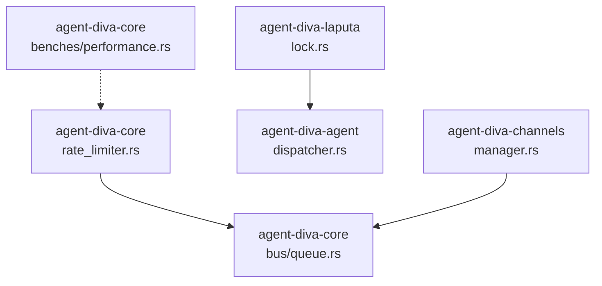
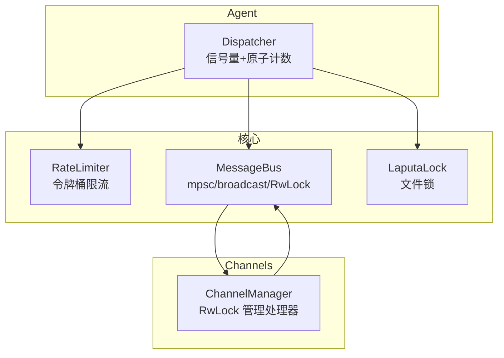
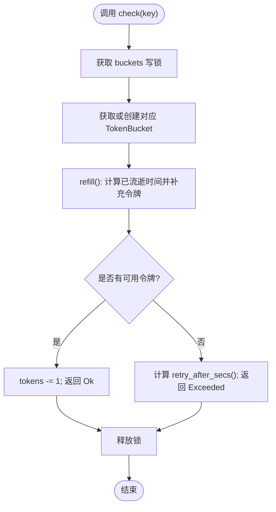
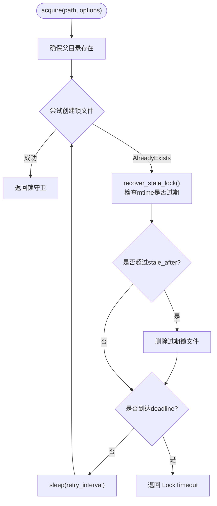
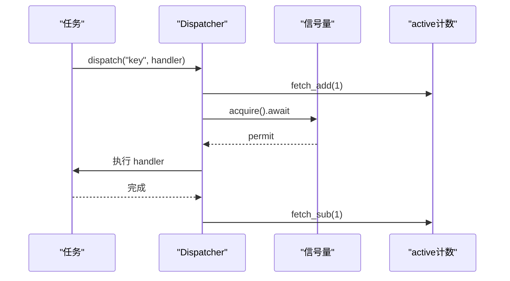
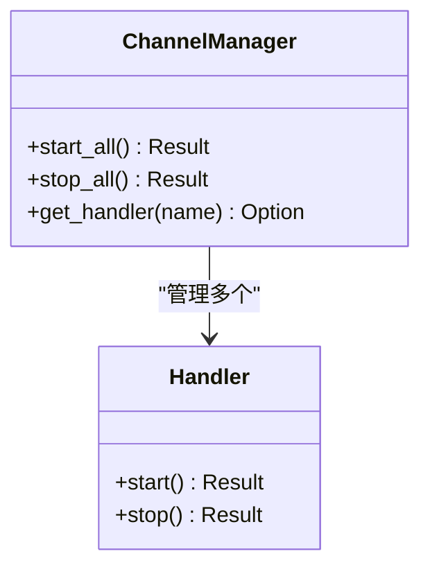
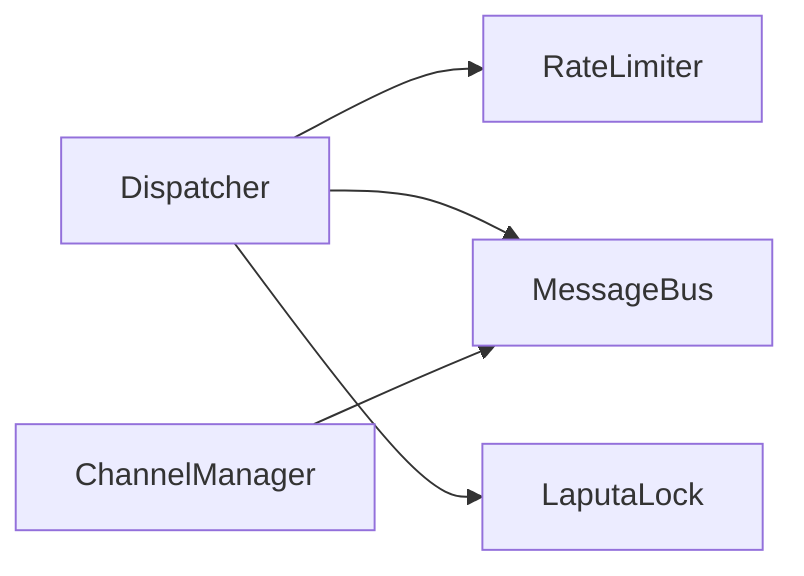

# 并发控制机制

<cite>
**本文引用的文件**
- [agent-diva-core/src/rate_limiter.rs](file://agent-diva-core/src/rate_limiter.rs)
- [agent-diva-core/src/bus/queue.rs](file://agent-diva-core/src/bus/queue.rs)
- [agent-diva-laputa/src/lock.rs](file://agent-diva-laputa/src/lock.rs)
- [agent-diva-agent/src/agent_loop/dispatcher.rs](file://agent-diva-agent/src/agent_loop/dispatcher.rs)
- [agent-diva-channels/src/manager.rs](file://agent-diva-channels/src/manager.rs)
- [agent-diva-core/benches/performance.rs](file://agent-diva-core/benches/performance.rs)
</cite>

## 目录
1. [简介](#简介)
2. [项目结构](#项目结构)
3. [核心组件](#核心组件)
4. [架构总览](#架构总览)
5. [详细组件分析](#详细组件分析)
6. [依赖关系分析](#依赖关系分析)
7. [性能考量](#性能考量)
8. [故障排查指南](#故障排查指南)
9. [结论](#结论)
10. [附录](#附录)

## 简介
本文件系统性梳理 agent-diva 项目的并发控制机制，覆盖信号量、互斥锁、条件变量与异步通道的使用场景；阐述限流与速率限制的实现；说明并发安全的数据结构与使用模式（Arc、Mutex、RwLock）；总结死锁预防与检测思路、并发调试技巧；给出性能优化策略与基准测试方法。文档以仓库实际代码为依据，配合架构图与时序图帮助读者快速理解并发边界与数据流。

## 项目结构
本项目采用多 crate 的 Rust workspace 组织方式，并发相关能力主要分布在以下位置：
- 核心限流器：agent-diva-core 提供按 key 的令牌桶限流实现
- 消息总线：agent-diva-core 提供基于 mpsc/broadcast/RwLock 的异步消息总线
- 进程级文件锁：agent-diva-laputa 提供跨平台文件锁与过期恢复
- 会话调度与准入：agent-diva-agent 使用原子计数与信号量进行并发控制与背压
- 通道管理器：agent-diva-channels 使用 RwLock 管理通道处理器生命周期
- 基准测试：agent-diva-core 提供 criterion 基准，用于评估热点路径性能



图表来源
- [agent-diva-core/src/rate_limiter.rs:125-165](file://agent-diva-core/src/rate_limiter.rs#L125-L165)
- [agent-diva-core/src/bus/queue.rs:23-39](file://agent-diva-core/src/bus/queue.rs#L23-L39)
- [agent-diva-laputa/src/lock.rs:35-63](file://agent-diva-laputa/src/lock.rs#L35-L63)
- [agent-diva-agent/src/agent_loop/dispatcher.rs:159-192](file://agent-diva-agent/src/agent_loop/dispatcher.rs#L159-L192)
- [agent-diva-channels/src/manager.rs:644-683](file://agent-diva-channels/src/manager.rs#L644-L683)
- [agent-diva-core/benches/performance.rs:1-50](file://agent-diva-core/benches/performance.rs#L1-L50)

章节来源
- [agent-diva-core/src/rate_limiter.rs:1-312](file://agent-diva-core/src/rate_limiter.rs#L1-L312)
- [agent-diva-core/src/bus/queue.rs:1-381](file://agent-diva-core/src/bus/queue.rs#L1-L381)
- [agent-diva-laputa/src/lock.rs:1-129](file://agent-diva-laputa/src/lock.rs#L1-L129)
- [agent-diva-agent/src/agent_loop/dispatcher.rs:159-280](file://agent-diva-agent/src/agent_loop/dispatcher.rs#L159-L280)
- [agent-diva-channels/src/manager.rs:638-683](file://agent-diva-channels/src/manager.rs#L638-L683)
- [agent-diva-core/benches/performance.rs:1-50](file://agent-diva-core/benches/performance.rs#L1-L50)

## 核心组件
- 令牌桶限流器：为每个 key 维护容量与填充速率，支持突发与平滑限流，返回可重试等待时间
- 异步消息总线：解耦渠道与核心，提供入队/出队、事件广播、订阅回调与后台分发循环
- 文件锁：跨平台文件锁，带超时、过期清理与自动释放，避免多实例竞争
- 会话调度器：使用原子计数与信号量控制并发度，结合队列满拒绝实现背压
- 通道管理器：以 RwLock 保护处理器集合，支持启动/停止/查询

章节来源
- [agent-diva-core/src/rate_limiter.rs:31-165](file://agent-diva-core/src/rate_limiter.rs#L31-L165)
- [agent-diva-core/src/bus/queue.rs:23-184](file://agent-diva-core/src/bus/queue.rs#L23-L184)
- [agent-diva-laputa/src/lock.rs:11-74](file://agent-diva-laputa/src/lock.rs#L11-L74)
- [agent-diva-agent/src/agent_loop/dispatcher.rs:159-280](file://agent-diva-agent/src/agent_loop/dispatcher.rs#L159-L280)
- [agent-diva-channels/src/manager.rs:644-683](file://agent-diva-channels/src/manager.rs#L644-L683)

## 架构总览
下图展示关键并发组件之间的交互：消息总线作为中枢，限流器在请求进入前进行节流，文件锁保证跨进程资源互斥，调度器通过信号量控制并发度并实施背压。



图表来源
- [agent-diva-core/src/rate_limiter.rs:125-165](file://agent-diva-core/src/rate_limiter.rs#L125-L165)
- [agent-diva-core/src/bus/queue.rs:23-184](file://agent-diva-core/src/bus/queue.rs#L23-L184)
- [agent-diva-laputa/src/lock.rs:35-74](file://agent-diva-laputa/src/lock.rs#L35-L74)
- [agent-diva-agent/src/agent_loop/dispatcher.rs:159-280](file://agent-diva-agent/src/agent_loop/dispatcher.rs#L159-L280)
- [agent-diva-channels/src/manager.rs:644-683](file://agent-diva-channels/src/manager.rs#L644-L683)

## 详细组件分析

### 令牌桶限流器（RateLimiter）
- 设计要点
  - 每个 key 一个 TokenBucket，独立容量与填充速率
  - check() 先 refill 再消费，失败时返回 retry_after 秒数
  - 全局 buckets 由 Mutex<HashMap> 保护，确保并发安全
- 复杂度
  - 单次 check 均摊 O(1)，HashMap 操作均摊 O(1)
- 并发特性
  - 使用 tokio::sync::Mutex 进行异步临界区保护
  - 无阻塞判断，适合高吞吐场景
- 错误处理
  - 超出限制返回 RateLimitError::Exceeded，携带可选重试时间



图表来源
- [agent-diva-core/src/rate_limiter.rs:125-165](file://agent-diva-core/src/rate_limiter.rs#L125-L165)
- [agent-diva-core/src/rate_limiter.rs:71-83](file://agent-diva-core/src/rate_limiter.rs#L71-L83)
- [agent-diva-core/src/rate_limiter.rs:108-123](file://agent-diva-core/src/rate_limiter.rs#L108-L123)

章节来源
- [agent-diva-core/src/rate_limiter.rs:31-165](file://agent-diva-core/src/rate_limiter.rs#L31-L165)

### 异步消息总线（MessageBus）
- 设计要点
  - inbound/outbound 使用 mpsc::UnboundedChannel 解耦生产与消费
  - subscribers 使用 Arc<RwLock<HashMap>> 存储按 channel 的回调
  - event/poke_event 使用 broadcast 通道进行一对多通知
  - dispatch_outbound_loop 后台任务轮询并 spawn 回调执行，避免阻塞
- 复杂度
  - 发送 O(1)，订阅分发 O(n)（n 为该 channel 订阅者数量）
- 并发特性
  - 读多写少场景用 RwLock，事件广播无阻塞
- 错误处理
  - 通道关闭时返回 Channel 错误；无接收者时忽略广播错误

```mermaid
sequenceDiagram
participant CH as "渠道"
participant MB as "MessageBus"
participant SUB as "订阅者"
participant LOOP as "dispatch_outbound_loop"
CH->>MB : publish_outbound(msg)
MB-->>LOOP : outbound_rx.recv()
LOOP->>SUB : 遍历该channel的回调
loop 每个回调
LOOP->>SUB : spawn(async { callback(msg) })
end
Note over MB,SUB : 事件广播通过 broadcast 通道独立进行
```

图表来源
- [agent-diva-core/src/bus/queue.rs:23-39](file://agent-diva-core/src/bus/queue.rs#L23-L39)
- [agent-diva-core/src/bus/queue.rs:119-184](file://agent-diva-core/src/bus/queue.rs#L119-L184)

章节来源
- [agent-diva-core/src/bus/queue.rs:1-381](file://agent-diva-core/src/bus/queue.rs#L1-L381)

### 文件锁（LaputaLock）
- 设计要点
  - 使用 create_new 创建唯一锁文件，写入 pid 与时间戳
  - acquire 带超时与重试间隔，遇到 AlreadyExists 则尝试恢复过期锁
  - Drop 时删除锁文件，RAII 语义保障释放
- 复杂度
  - 每次尝试 O(1) 文件系统操作；重试次数受 timeout 限制
- 并发特性
  - 跨进程互斥，适用于多实例协调
- 错误处理
  - 超时返回 LockTimeout；IO 错误包装为 LaputaError



图表来源
- [agent-diva-laputa/src/lock.rs:35-74](file://agent-diva-laputa/src/lock.rs#L35-L74)
- [agent-diva-laputa/src/lock.rs:76-104](file://agent-diva-laputa/src/lock.rs#L76-L104)

章节来源
- [agent-diva-laputa/src/lock.rs:1-129](file://agent-diva-laputa/src/lock.rs#L1-L129)

### 会话调度与准入（Dispatcher）
- 设计要点
  - 使用原子计数器 active/max_active 跟踪并发度
  - 使用信号量 gate 控制最大并发，acquire 后 .forget() 避免显式释放
  - 队列满时拒绝新请求，实现背压
- 复杂度
  - 原子操作 O(1)；信号量 acquire O(1) 平均
- 并发特性
  - 非阻塞计数 + 阻塞许可，兼顾吞吐与稳定性
- 错误处理
  - 队列满返回 Admission/QueueFull，调用方可据此退避



图表来源
- [agent-diva-agent/src/agent_loop/dispatcher.rs:159-192](file://agent-diva-agent/src/agent_loop/dispatcher.rs#L159-L192)
- [agent-diva-agent/src/agent_loop/dispatcher.rs:260-280](file://agent-diva-agent/src/agent_loop/dispatcher.rs#L260-L280)

章节来源
- [agent-diva-agent/src/agent_loop/dispatcher.rs:159-280](file://agent-diva-agent/src/agent_loop/dispatcher.rs#L159-L280)

### 通道管理器（ChannelManager）
- 设计要点
  - handlers 使用 RwLock 保护，start_all 读取遍历，stop_all 写入清空
  - 单个 handler 内部也使用 RwLock 管理状态
- 复杂度
  - 启动/停止 O(n)；查询 O(1)
- 并发特性
  - 读多写少，RwLock 提升并发读性能
- 错误处理
  - 部分通道启动失败记录警告，不影响其他通道继续运行



图表来源
- [agent-diva-channels/src/manager.rs:644-683](file://agent-diva-channels/src/manager.rs#L644-L683)

章节来源
- [agent-diva-channels/src/manager.rs:638-683](file://agent-diva-channels/src/manager.rs#L638-L683)

## 依赖关系分析
- 组件耦合
  - Dispatcher 依赖 RateLimiter 做前置限流，依赖 MessageBus 进行消息路由
  - ChannelManager 通过 MessageBus 与 Agent Core 通信
  - LaputaLock 独立于运行时，提供进程级互斥
- 外部依赖
  - tokio::sync::{Mutex, RwLock, mpsc, broadcast} 提供异步同步原语
  - std::sync::atomic 提供无锁原子计数
- 潜在循环依赖
  - 当前模块间为单向依赖，未见循环引用



图表来源
- [agent-diva-agent/src/agent_loop/dispatcher.rs:159-280](file://agent-diva-agent/src/agent_loop/dispatcher.rs#L159-L280)
- [agent-diva-core/src/rate_limiter.rs:125-165](file://agent-diva-core/src/rate_limiter.rs#L125-L165)
- [agent-diva-core/src/bus/queue.rs:23-184](file://agent-diva-core/src/bus/queue.rs#L23-L184)
- [agent-diva-channels/src/manager.rs:644-683](file://agent-diva-channels/src/manager.rs#L644-L683)
- [agent-diva-laputa/src/lock.rs:35-74](file://agent-diva-laputa/src/lock.rs#L35-L74)

章节来源
- [agent-diva-agent/src/agent_loop/dispatcher.rs:159-280](file://agent-diva-agent/src/agent_loop/dispatcher.rs#L159-L280)
- [agent-diva-core/src/rate_limiter.rs:125-165](file://agent-diva-core/src/rate_limiter.rs#L125-L165)
- [agent-diva-core/src/bus/queue.rs:23-184](file://agent-diva-core/src/bus/queue.rs#L23-L184)
- [agent-diva-channels/src/manager.rs:644-683](file://agent-diva-channels/src/manager.rs#L644-L683)
- [agent-diva-laputa/src/lock.rs:35-74](file://agent-diva-laputa/src/lock.rs#L35-L74)

## 性能考量
- 限流器
  - 令牌桶 O(1) 判定，适合高频短请求；合理设置 capacity/refill_rate 平衡突发与稳定
- 消息总线
  - 使用 UnboundedChannel 避免背压阻塞生产者；回调异步 spawn 避免阻塞分发循环
  - 订阅者过多会线性增加分发开销，建议按 channel 分组
- 文件锁
  - 频繁重试可能带来 IO 压力；合理配置 timeout/retry_interval/stale_after
- 调度器
  - 原子计数与信号量组合降低锁粒度；队列满拒绝防止过载
- 基准测试
  - 使用 criterion 对热点路径（如 PII 脱敏、注入检测）进行微基准，定位瓶颈

章节来源
- [agent-diva-core/benches/performance.rs:1-50](file://agent-diva-core/benches/performance.rs#L1-L50)

## 故障排查指南
- 限流触发
  - 现象：频繁返回 Exceeded
  - 排查：确认 key 粒度是否正确；调整 capacity/refill_rate；观察 retry_after
  - 参考：[agent-diva-core/src/rate_limiter.rs:148-165](file://agent-diva-core/src/rate_limiter.rs#L148-L165)
- 消息丢失或堆积
  - 现象：订阅者未收到消息或延迟增大
  - 排查：检查 outbound 接收者是否被 take；确认 dispatch_outbound_loop 是否运行；查看订阅注册
  - 参考：[agent-diva-core/src/bus/queue.rs:95-184](file://agent-diva-core/src/bus/queue.rs#L95-L184)
- 文件锁卡死
  - 现象：长时间无法获取锁
  - 排查：检查 stale_after 是否过小；确认异常退出是否残留锁文件；观察重试间隔
  - 参考：[agent-diva-laputa/src/lock.rs:35-104](file://agent-diva-laputa/src/lock.rs#L35-L104)
- 并发度过载
  - 现象：大量请求被拒绝或响应变慢
  - 排查：检查信号量许可数；观察 active/max_active；必要时扩大队列或提高许可
  - 参考：[agent-diva-agent/src/agent_loop/dispatcher.rs:159-280](file://agent-diva-agent/src/agent_loop/dispatcher.rs#L159-L280)
- 通道启动失败
  - 现象：部分通道启动失败但整体服务继续
  - 排查：查看日志中 failed_channels；逐个 handler 单独验证
  - 参考：[agent-diva-channels/src/manager.rs:644-683](file://agent-diva-channels/src/manager.rs#L644-L683)

## 结论
本项目通过令牌桶限流、异步消息总线、文件锁与信号量等机制，构建了稳健的并发控制体系。限流器提供细粒度流量控制；消息总线解耦渠道与核心；文件锁保障跨进程互斥；调度器通过原子计数与信号量实现可控并发与背压。结合基准测试与完善的错误处理，系统在高并发场景下具备良好稳定性与可扩展性。

## 附录
- 并发原语使用建议
  - 共享可变状态优先使用 tokio::sync::RwLock（读多写少）或 Mutex（写多读少）
  - 跨任务轻量共享使用 Arc + 原子类型（fetch_add/fetch_max）
  - 异步协作优先使用 mpsc/broadcast 而非共享内存
- 死锁预防与检测
  - 固定加锁顺序，避免嵌套锁；尽量缩小临界区
  - 使用超时与取消，避免永久阻塞
  - 通过日志与指标监控活跃任务与锁持有时间
- 并发调试技巧
  - 使用 tracing 记录关键路径；为限流、调度、总线事件添加结构化日志
  - 利用 criterion 基准对比变更前后性能
  - 针对热点路径编写单元测试与集成测试，覆盖并发边界