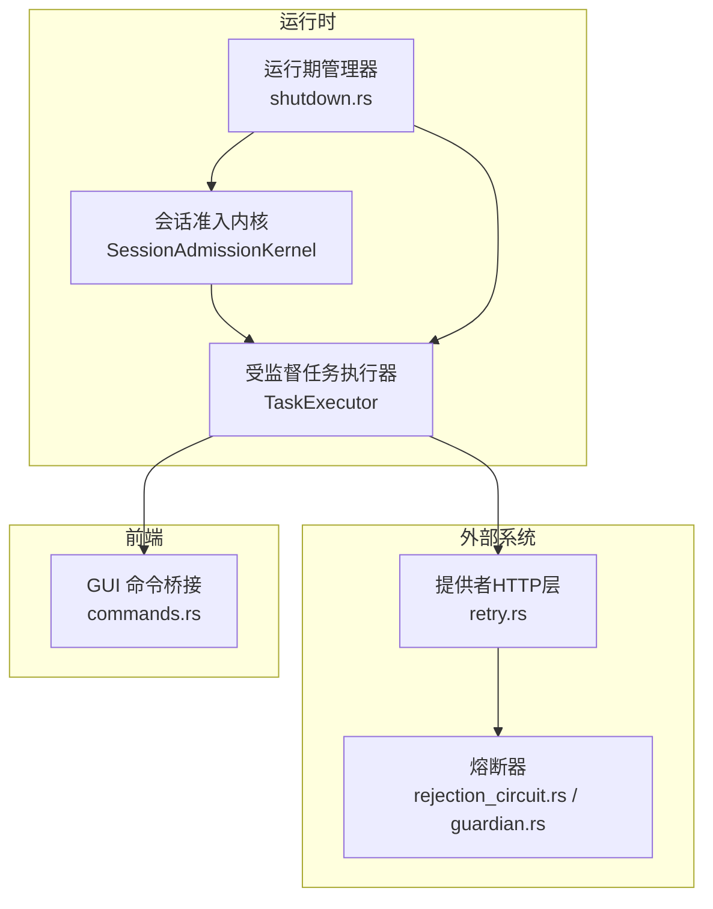
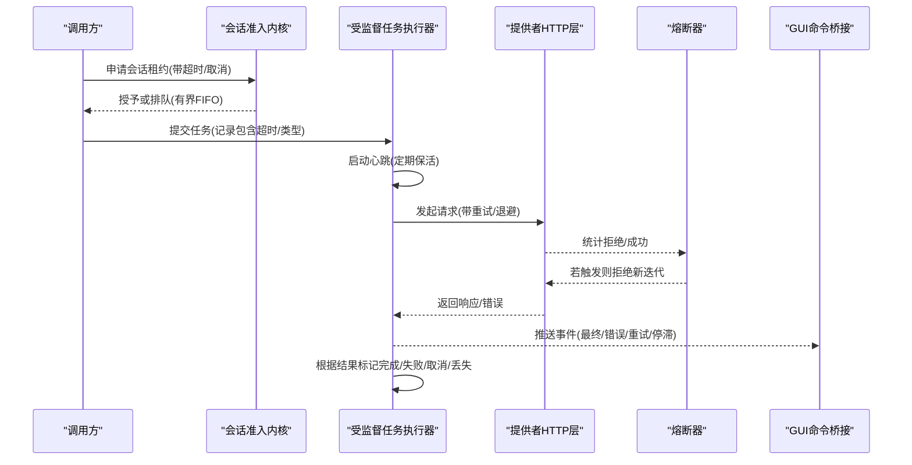
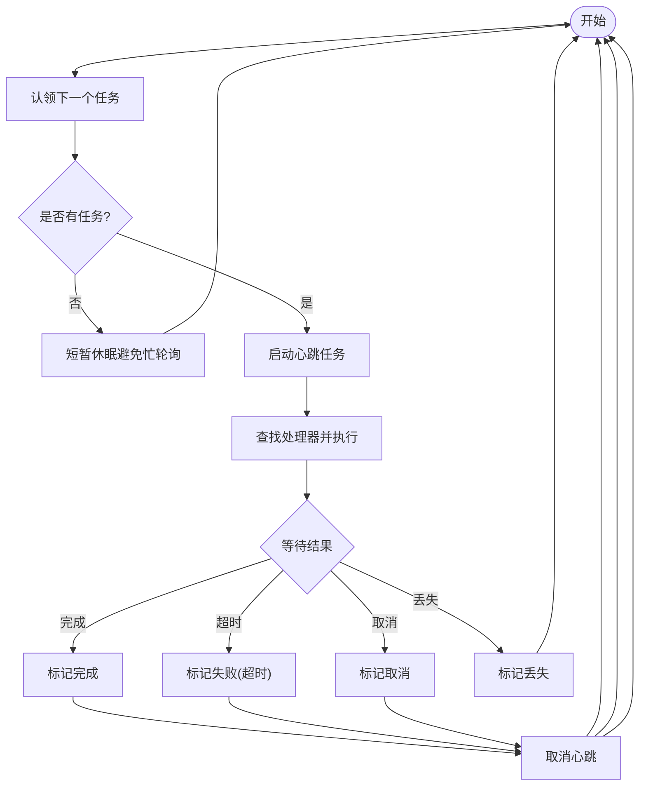
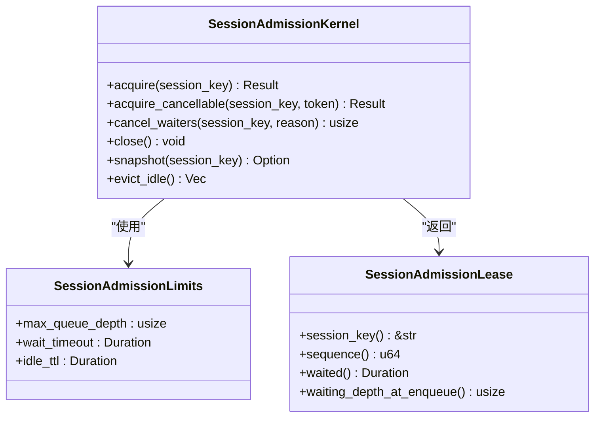
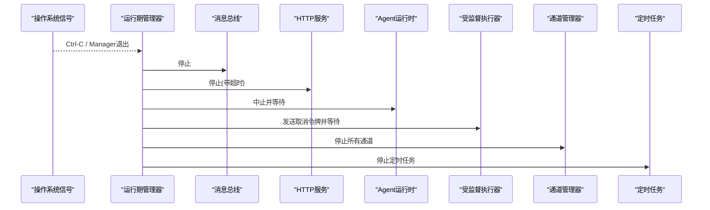
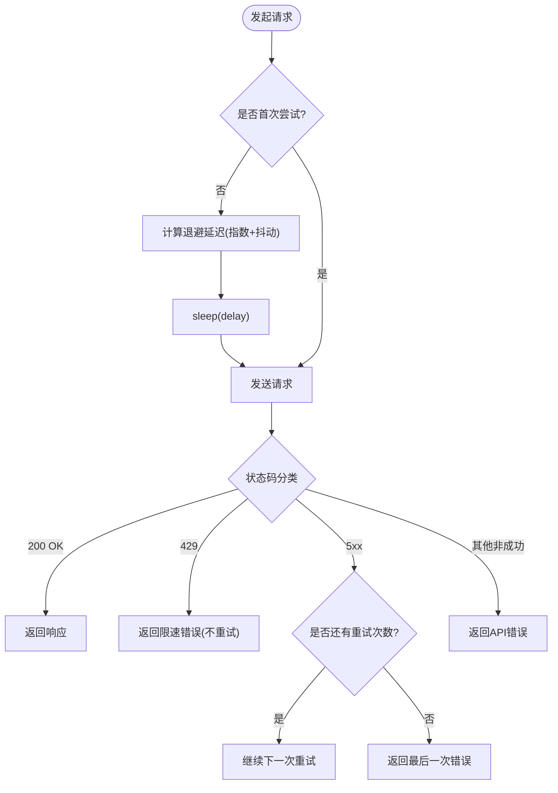
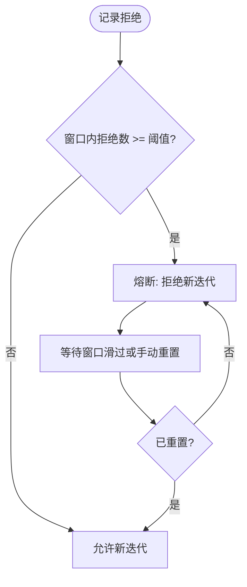
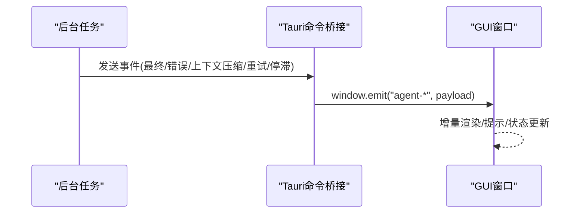
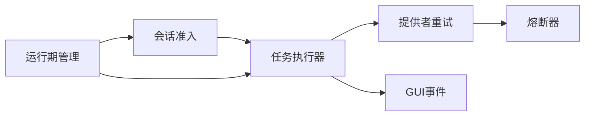

# 异步处理模型

<cite>
**本文引用的文件**
- [agent-diva-core/src/supervised/executor.rs](file://agent-diva-core/src/supervised/executor.rs)
- [agent-diva-core/src/session/admission.rs](file://agent-diva-core/src/session/admission.rs)
- [agent-diva-manager/src/runtime/shutdown.rs](file://agent-diva-manager/src/runtime/shutdown.rs)
- [agent-diva-providers/src/retry.rs](file://agent-diva-providers/src/retry.rs)
- [agent-diva-core/src/security/rejection_circuit.rs](file://agent-diva-core/src/security/rejection_circuit.rs)
- [agent-diva-sandbox/src/guardian.rs](file://agent-diva-sandbox/src/guardian.rs)
- [agent-diva-gui/src-tauri/src/commands.rs](file://agent-diva-gui/src-tauri/src/commands.rs)
</cite>

## 目录
1. [简介](#简介)
2. [项目结构](#项目结构)
3. [核心组件](#核心组件)
4. [架构总览](#架构总览)
5. [详细组件分析](#详细组件分析)
6. [依赖关系分析](#依赖关系分析)
7. [性能考量](#性能考量)
8. [故障排查指南](#故障排查指南)
9. [结论](#结论)
10. [附录](#附录)

## 简介
本文件面向基于 tokio 的异步运行时，系统性说明任务调度、Future 处理、并发控制、超时与取消、错误恢复（重试、熔断）、流式处理以及资源限制等关键机制。结合仓库中的“受监督任务执行器”“会话准入控制”“优雅停机”“提供者重试”“拒绝风暴熔断”“GUI 流式事件”等实现，给出可操作的架构图、流程图与最佳实践建议，帮助读者在复杂异步系统中保持高响应性与稳定性。

## 项目结构
围绕异步处理的关键模块分布如下：
- 任务执行与心跳：受监督任务的 Claim → Execute → Complete/Fail 循环，含心跳保活与状态轮询。
- 会话级串行化：按会话键进行有界 FIFO 准入，避免同一会话内乱序与拥塞。
- 运行期管理：统一监听信号、有序停止各子系统，带超时与强制中止。
- 外部调用容错：指数退避重试、速率限制识别、可观测回调。
- 熔断保护：滑动窗口统计拒绝次数，达到阈值后短路新请求。
- 流式交互：后台任务通过事件通道将增量结果推送至 GUI。

图表来源
- [agent-diva-core/src/session/admission.rs:157-243](file://agent-diva-core/src/session/admission.rs#L157-L243)
- [agent-diva-core/src/supervised/executor.rs:90-220](file://agent-diva-core/src/supervised/executor.rs#L90-L220)
- [agent-diva-manager/src/runtime/shutdown.rs:21-105](file://agent-diva-manager/src/runtime/shutdown.rs#L21-L105)
- [agent-diva-providers/src/retry.rs:86-181](file://agent-diva-providers/src/retry.rs#L86-L181)
- [agent-diva-core/src/security/rejection_circuit.rs:1-56](file://agent-diva-core/src/security/rejection_circuit.rs#L1-L56)
- [agent-diva-sandbox/src/guardian.rs:497-574](file://agent-diva-sandbox/src/guardian.rs#L497-L574)
- [agent-diva-gui/src-tauri/src/commands.rs:2897-2923](file://agent-diva-gui/src-tauri/src/commands.rs#L2897-L2923)

章节来源
- [agent-diva-core/src/session/admission.rs:1-800](file://agent-diva-core/src/session/admission.rs#L1-L800)
- [agent-diva-core/src/supervised/executor.rs:1-629](file://agent-diva-core/src/supervised/executor.rs#L1-L629)
- [agent-diva-manager/src/runtime/shutdown.rs:1-138](file://agent-diva-manager/src/runtime/shutdown.rs#L1-L138)
- [agent-diva-providers/src/retry.rs:1-316](file://agent-diva-providers/src/retry.rs#L1-L316)
- [agent-diva-core/src/security/rejection_circuit.rs:1-130](file://agent-diva-core/src/security/rejection_circuit.rs#L1-L130)
- [agent-diva-sandbox/src/guardian.rs:497-574](file://agent-diva-sandbox/src/guardian.rs#L497-L574)
- [agent-diva-gui/src-tauri/src/commands.rs:2897-2923](file://agent-diva-gui/src-tauri/src/commands.rs#L2897-L2923)

## 核心组件
- 会话准入内核：为每个逻辑会话提供有界 FIFO 排队、等待超时、空闲回收与取消传播，保证同一会话内的串行执行与背压。
- 受监督任务执行器：从持久化存储认领任务，启动心跳保活，按类型分派到处理器，支持超时、取消、丢失与关闭等多种终止路径，并回写完成/失败状态。
- 运行期管理器：集中监听退出信号，按依赖顺序停止消息总线、HTTP 服务、Agent 运行时、受监督执行器、通道与定时任务；对卡住的任务以超时 + abort 兜底。
- 提供者重试：对 HTTP 请求实施指数退避与抖动，识别 429 限速并立即返回，对 5xx 与网络错误最多重试固定次数，并提供重试回调用于可观测性。
- 拒绝风暴熔断：滑动窗口统计拒绝次数，超过阈值则短路新迭代，防止雪崩；支持手动重置与计数查询。
- GUI 流式事件：后台任务通过事件通道将最终结果、错误、上下文压缩、重试/停滞等事件推送到前端，实现大响应的渐进式展示。

章节来源
- [agent-diva-core/src/session/admission.rs:18-40](file://agent-diva-core/src/session/admission.rs#L18-L40)
- [agent-diva-core/src/supervised/executor.rs:53-114](file://agent-diva-core/src/supervised/executor.rs#L53-L114)
- [agent-diva-manager/src/runtime/shutdown.rs:21-105](file://agent-diva-manager/src/runtime/shutdown.rs#L21-L105)
- [agent-diva-providers/src/retry.rs:17-47](file://agent-diva-providers/src/retry.rs#L17-L47)
- [agent-diva-core/src/security/rejection_circuit.rs:14-56](file://agent-diva-core/src/security/rejection_circuit.rs#L14-L56)
- [agent-diva-gui/src-tauri/src/commands.rs:2897-2923](file://agent-diva-gui/src-tauri/src/commands.rs#L2897-L2923)

## 架构总览
下图展示了从会话准入到任务执行、再到外部调用与熔断、最后到前端流式反馈的整体流程。

图表来源
- [agent-diva-core/src/session/admission.rs:157-243](file://agent-diva-core/src/session/admission.rs#L157-L243)
- [agent-diva-core/src/supervised/executor.rs:123-220](file://agent-diva-core/src/supervised/executor.rs#L123-L220)
- [agent-diva-providers/src/retry.rs:86-181](file://agent-diva-providers/src/retry.rs#L86-L181)
- [agent-diva-core/src/security/rejection_circuit.rs:31-56](file://agent-diva-core/src/security/rejection_circuit.rs#L31-L56)
- [agent-diva-gui/src-tauri/src/commands.rs:2897-2923](file://agent-diva-gui/src-tauri/src/commands.rs#L2897-L2923)

## 详细组件分析

### 任务执行器（受监督任务）
- 职责：认领任务、启动心跳、按类型分发、监控执行结果、回写状态。
- 关键特性：
  - 心跳：周期性上报，防止长时间无活动被误判丢失。
  - 超时：根据任务记录的超时字段设置等待上限，超时时中止任务并标记失败。
  - 取消/丢失：轮询任务状态，遇到取消或丢失时中止执行并更新状态。
  - 关闭：接收全局取消令牌，优雅结束循环。
- 复杂度：单次 tick 为 O(1) 数据库访问 + O(1) 定时器开销；整体吞吐取决于存储与处理器能力。

图表来源
- [agent-diva-core/src/supervised/executor.rs:90-220](file://agent-diva-core/src/supervised/executor.rs#L90-L220)

章节来源
- [agent-diva-core/src/supervised/executor.rs:53-220](file://agent-diva-core/src/supervised/executor.rs#L53-L220)

### 会话准入控制（FIFO 串行化与背压）
- 职责：为每个逻辑会话维护一个槽位，确保同一会话内任务串行执行；对外提供有界等待队列、等待超时、空闲回收与取消传播。
- 关键特性：
  - 有界队列：超出最大深度直接拒绝，防止内存与延迟爆炸。
  - 等待超时：未能在时限内获得租约则返回超时错误。
  - 取消传播：支持单个等待者取消或会话级取消，清理队列并释放容量。
  - 空闲回收：长时间无运行的会话槽位会被回收，减少状态膨胀。
- 复杂度：入队/出队均摊 O(1)，过期清理按需扫描头部。

图表来源
- [agent-diva-core/src/session/admission.rs:18-40](file://agent-diva-core/src/session/admission.rs#L18-L40)
- [agent-diva-core/src/session/admission.rs:157-385](file://agent-diva-core/src/session/admission.rs#L157-L385)

章节来源
- [agent-diva-core/src/session/admission.rs:1-800](file://agent-diva-core/src/session/admission.rs#L1-L800)

### 运行期管理与优雅停机
- 职责：统一监听退出信号，按依赖顺序停止各子系统，并对卡住的子任务施加超时与强制中止。
- 关键特性：
  - 有序停止：先停消息总线与服务器，再停 Agent 运行时、受监督执行器、通道与定时任务。
  - 超时+中止：对无法按时停止的任务，先尝试正常停止，超时后 abort 并二次等待退出。
  - 取消传播：向受监督执行器发送取消令牌，使其中断当前 tick 循环。

图表来源
- [agent-diva-manager/src/runtime/shutdown.rs:21-105](file://agent-diva-manager/src/runtime/shutdown.rs#L21-L105)

章节来源
- [agent-diva-manager/src/runtime/shutdown.rs:1-138](file://agent-diva-manager/src/runtime/shutdown.rs#L1-L138)

### 提供者重试与速率限制
- 职责：对 HTTP 请求实施指数退避与抖动，识别 429 限速并立即返回，对 5xx 与网络错误最多重试固定次数。
- 关键特性：
  - 指数退避：基础延迟乘以 2^(attempt-1)，并加入随机抖动避免惊群。
  - 速率限制：429 不重试，直接返回限速错误，附带可选 Retry-After。
  - 可观测性：每次重试前调用回调，便于上层暴露进度或告警。
- 复杂度：每次重试 O(1) 计算 + sleep；总体耗时随重试次数线性增长。

图表来源
- [agent-diva-providers/src/retry.rs:39-75](file://agent-diva-providers/src/retry.rs#L39-L75)
- [agent-diva-providers/src/retry.rs:86-181](file://agent-diva-providers/src/retry.rs#L86-L181)

章节来源
- [agent-diva-providers/src/retry.rs:1-316](file://agent-diva-providers/src/retry.rs#L1-L316)

### 拒绝风暴熔断器
- 职责：在滑动窗口内统计拒绝次数，超过阈值则短路新迭代，防止雪崩。
- 关键特性：
  - 滑动窗口：仅统计窗口内的拒绝事件，自动过期。
  - 阈值触发：达到阈值即认为熔断，阻止新的模型迭代。
  - 恢复与重置：窗口滑过或手动重置后恢复。
- 适用场景：Provider 频繁返回 429/鉴权失败/上下文超限等导致快速失败的场景。

图表来源
- [agent-diva-core/src/security/rejection_circuit.rs:14-56](file://agent-diva-core/src/security/rejection_circuit.rs#L14-L56)
- [agent-diva-sandbox/src/guardian.rs:497-574](file://agent-diva-sandbox/src/guardian.rs#L497-L574)

章节来源
- [agent-diva-core/src/security/rejection_circuit.rs:1-130](file://agent-diva-core/src/security/rejection_circuit.rs#L1-L130)
- [agent-diva-sandbox/src/guardian.rs:497-574](file://agent-diva-sandbox/src/guardian.rs#L497-L574)

### 流式处理与前端事件
- 职责：后台任务在执行过程中将中间状态、错误、最终结果等事件推送到前端，实现大响应的渐进式展示。
- 关键特性：
  - 事件类型：最终结果、错误、上下文压缩、重试/停滞等。
  - 传输方式：通过 Tauri 命令桥接将后端事件映射为前端事件。
  - 用户体验：用户可在 UI 上实时看到思考过程、工具调用状态与回复增量。

图表来源
- [agent-diva-gui/src-tauri/src/commands.rs:2897-2923](file://agent-diva-gui/src-tauri/src/commands.rs#L2897-L2923)

章节来源
- [agent-diva-gui/src-tauri/src/commands.rs:2897-2923](file://agent-diva-gui/src-tauri/src/commands.rs#L2897-L2923)

## 依赖关系分析
- 低耦合：会话准入与任务执行解耦，前者只负责排队与租约，后者专注执行与状态回写。
- 明确边界：运行期管理器集中生命周期管理，避免分散的 abort/join 逻辑。
- 外部依赖隔离：重试与熔断位于提供者层与安全层，不影响上层业务编排。
- 潜在环依赖：需确保熔断器不反向依赖执行器；当前实现中熔断器仅统计拒绝事件，无循环引用风险。

图表来源
- [agent-diva-core/src/session/admission.rs:157-243](file://agent-diva-core/src/session/admission.rs#L157-L243)
- [agent-diva-core/src/supervised/executor.rs:90-220](file://agent-diva-core/src/supervised/executor.rs#L90-L220)
- [agent-diva-providers/src/retry.rs:86-181](file://agent-diva-providers/src/retry.rs#L86-L181)
- [agent-diva-core/src/security/rejection_circuit.rs:31-56](file://agent-diva-core/src/security/rejection_circuit.rs#L31-L56)
- [agent-diva-manager/src/runtime/shutdown.rs:21-105](file://agent-diva-manager/src/runtime/shutdown.rs#L21-L105)
- [agent-diva-gui/src-tauri/src/commands.rs:2897-2923](file://agent-diva-gui/src-tauri/src/commands.rs#L2897-L2923)

章节来源
- [agent-diva-core/src/session/admission.rs:157-243](file://agent-diva-core/src/session/admission.rs#L157-L243)
- [agent-diva-core/src/supervised/executor.rs:90-220](file://agent-diva-core/src/supervised/executor.rs#L90-L220)
- [agent-diva-providers/src/retry.rs:86-181](file://agent-diva-providers/src/retry.rs#L86-L181)
- [agent-diva-core/src/security/rejection_circuit.rs:31-56](file://agent-diva-core/src/security/rejection_circuit.rs#L31-L56)
- [agent-diva-manager/src/runtime/shutdown.rs:21-105](file://agent-diva-manager/src/runtime/shutdown.rs#L21-L105)
- [agent-diva-gui/src-tauri/src/commands.rs:2897-2923](file://agent-diva-gui/src-tauri/src/commands.rs#L2897-L2923)

## 性能考量
- 背压与限流：通过会话准入的有界队列限制并发等待深度，避免内存与延迟失控。
- 心跳与轮询：心跳间隔与状态轮询频率需权衡可靠性与开销；当前实现采用合理默认值。
- 重试策略：指数退避加抖动降低雪崩概率；对 429 立即返回，避免无效重试。
- 熔断保护：在拒绝风暴时快速短路，保护系统资源。
- 优雅停机：统一超时与中止，缩短停机时间，减少资源泄漏。
- 流式输出：增量事件推送降低首字节延迟，提升用户体验。

[本节为通用指导，无需特定文件来源]

## 故障排查指南
- 任务长时间无响应：检查心跳是否持续、状态轮询是否正常、是否存在阻塞 await。
- 队列堆积：查看会话准入的最大等待深度与等待超时，必要时调小队列或增加并行度。
- 频繁重试：确认是否为 5xx 或网络错误；若为 429，应调整上游限流或退避策略。
- 熔断触发：统计窗口内拒绝次数，定位上游 Provider 异常原因；必要时手动重置熔断器。
- 停机缓慢：检查各子系统是否在超时内完成停止；必要时缩短超时或优化停止逻辑。
- 前端无事件：确认事件通道是否建立、事件类型是否正确映射。

章节来源
- [agent-diva-core/src/supervised/executor.rs:123-220](file://agent-diva-core/src/supervised/executor.rs#L123-L220)
- [agent-diva-core/src/session/admission.rs:157-243](file://agent-diva-core/src/session/admission.rs#L157-L243)
- [agent-diva-providers/src/retry.rs:86-181](file://agent-diva-providers/src/retry.rs#L86-L181)
- [agent-diva-core/src/security/rejection_circuit.rs:31-56](file://agent-diva-core/src/security/rejection_circuit.rs#L31-L56)
- [agent-diva-manager/src/runtime/shutdown.rs:21-105](file://agent-diva-manager/src/runtime/shutdown.rs#L21-L105)
- [agent-diva-gui/src-tauri/src/commands.rs:2897-2923](file://agent-diva-gui/src-tauri/src/commands.rs#L2897-L2923)

## 结论
该异步处理模型通过会话准入、受监督任务执行、优雅停机、重试与熔断、流式事件等机制，构建了高响应、可恢复、可扩展的运行时。建议在新增功能时遵循以下原则：
- 始终使用会话准入控制保证串行性与背压。
- 为长耗时操作设置超时与取消，避免占用资源。
- 对不稳定外部调用使用重试与熔断，提高鲁棒性。
- 通过流式事件提升用户体验与可观测性。
- 在停机路径中统一超时与中止，确保资源及时释放。

[本节为总结，无需特定文件来源]

## 附录
- 术语表
  - 会话：逻辑上的用户或工作单元，内部任务需串行执行。
  - 租约：会话准入授予的执行许可，持有期间独占会话。
  - 心跳：周期性上报，表明任务仍在活跃执行。
  - 熔断：当拒绝率过高时短路新请求，防止雪崩。
  - 流式：增量推送中间结果，降低首字节延迟。

[本节为概念性内容，无需特定文件来源]