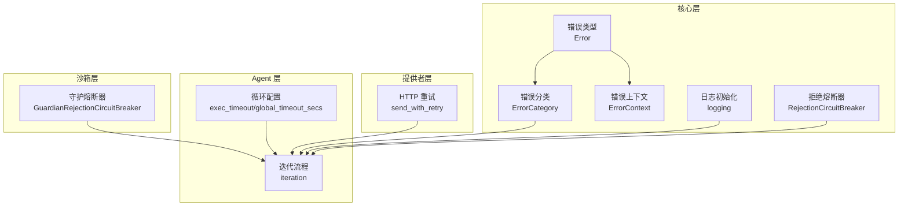
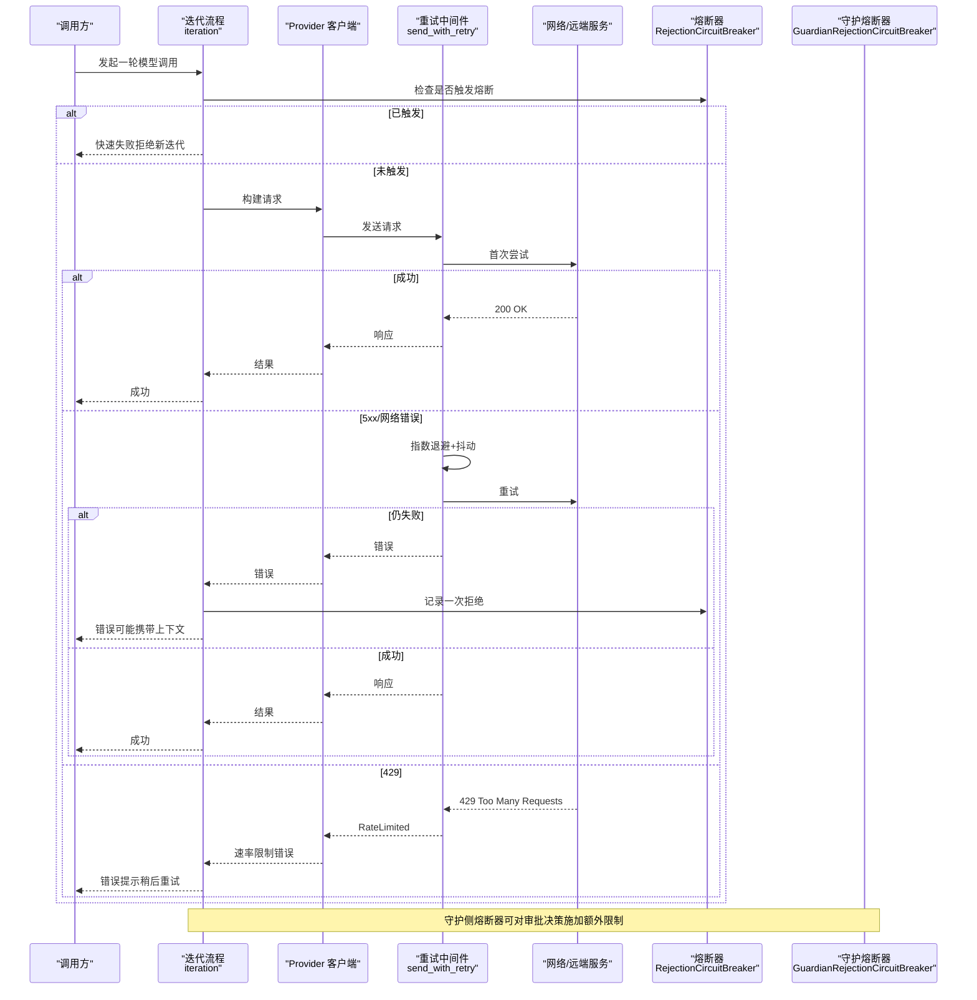
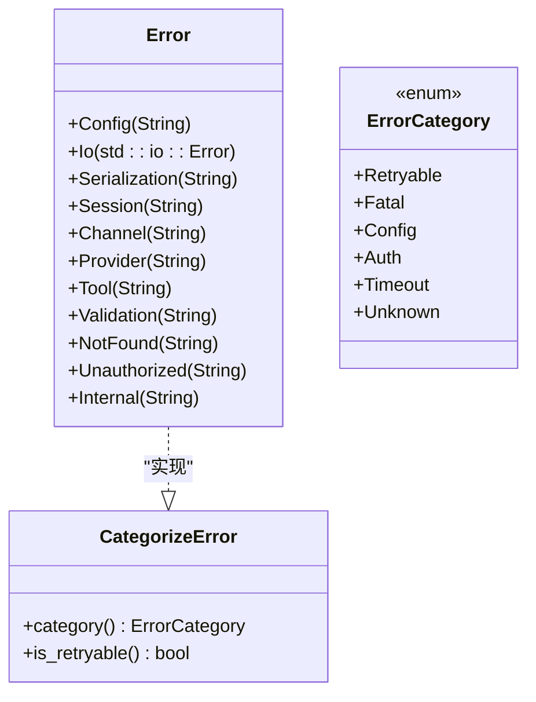
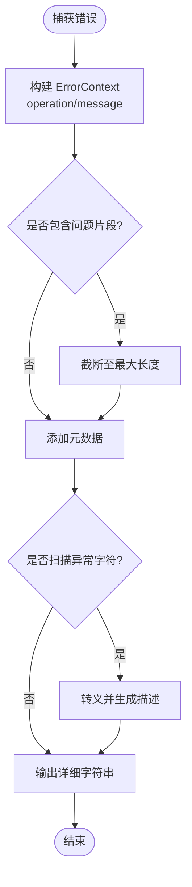
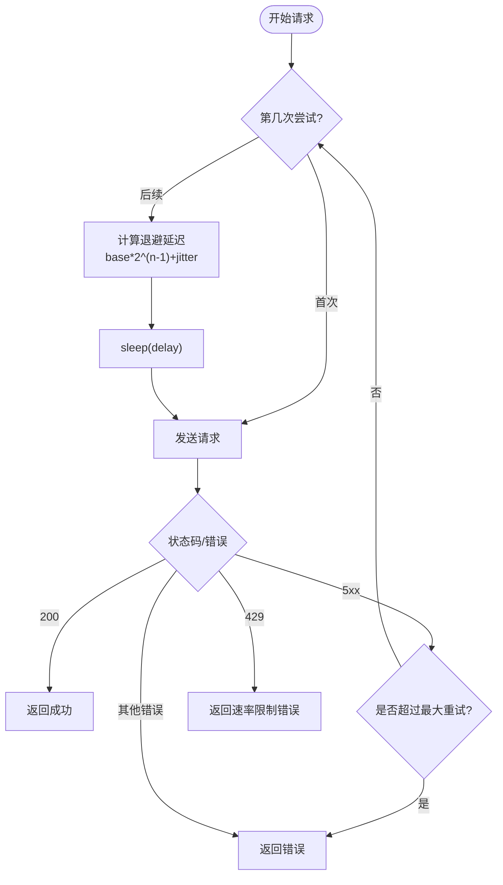
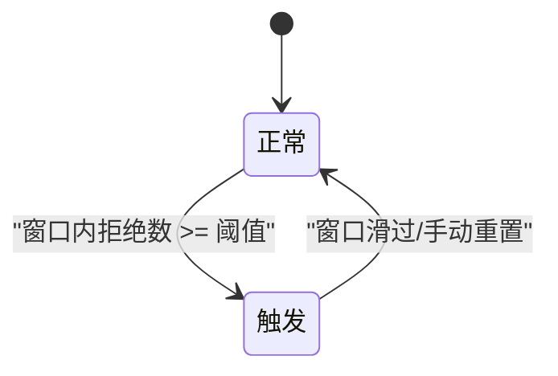
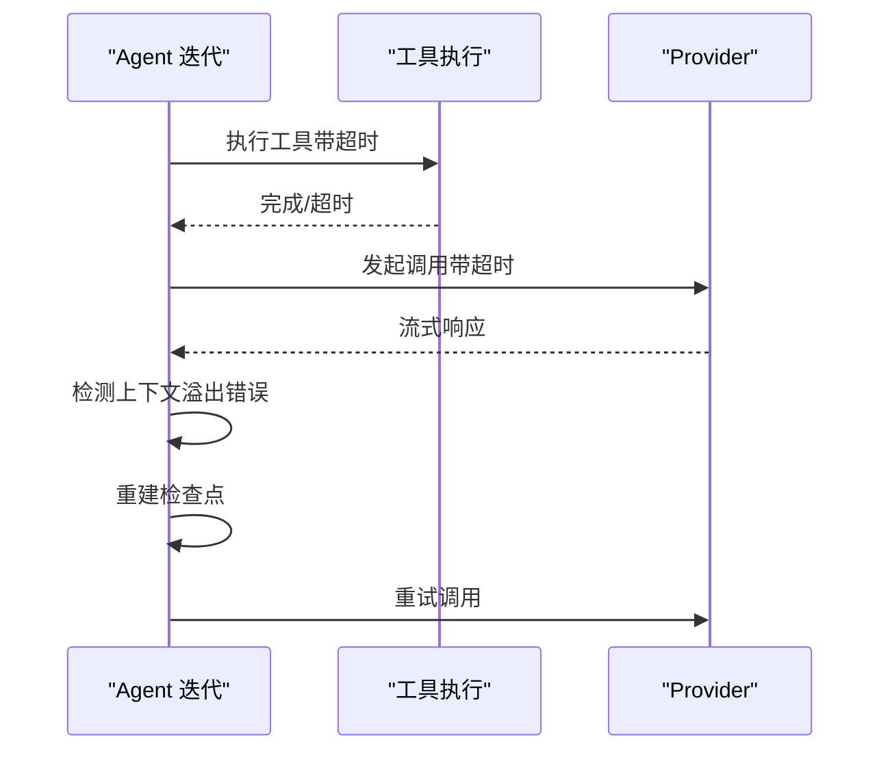
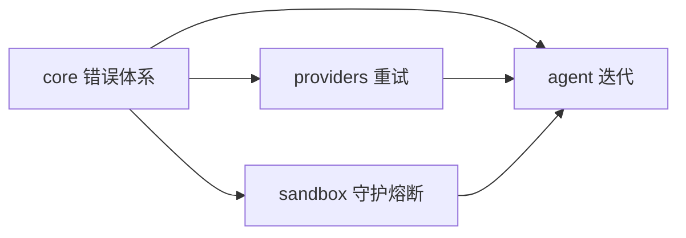

# 异步错误处理

<cite>
**本文引用的文件**
- [agent-diva-core/src/error.rs](file://agent-diva-core/src/error.rs)
- [agent-diva-core/src/error_category.rs](file://agent-diva-core/src/error_category.rs)
- [agent-diva-core/src/error_context.rs](file://agent-diva-core/src/error_context.rs)
- [agent-diva-providers/src/retry.rs](file://agent-diva-providers/src/retry.rs)
- [agent-diva-core/src/security/rejection_circuit.rs](file://agent-diva-core/src/security/rejection_circuit.rs)
- [agent-diva-sandbox/src/guardian.rs](file://agent-diva-sandbox/src/guardian.rs)
- [agent-diva-agent/src/agent_loop/turn/iteration.rs](file://agent-diva-agent/src/agent_loop/turn/iteration.rs)
- [agent-diva-agent/src/agent_loop.rs](file://agent-diva-agent/src/agent_loop.rs)
- [agent-diva-core/src/logging.rs](file://agent-diva-core/src/logging.rs)
- [agent-diva-autodream/src/diagnostics.rs](file://agent-diva-autodream/src/diagnostics.rs)
- [agent-diva-e2e/tests/error_handling_test.rs](file://agent-diva-e2e/tests/error_handling_test.rs)
</cite>

## 目录
1. [简介](#简介)
2. [项目结构](#项目结构)
3. [核心组件](#核心组件)
4. [架构总览](#架构总览)
5. [详细组件分析](#详细组件分析)
6. [依赖关系分析](#依赖关系分析)
7. [性能考虑](#性能考虑)
8. [故障排查指南](#故障排查指南)
9. [结论](#结论)
10. [附录](#附录)

## 简介
本文件面向异步环境下的错误处理策略，围绕以下目标展开：
- 统一错误分类与传播：通过 ErrorKind/ErrorCategory 将跨模块错误归一化，便于上层按类别决定重试、熔断或降级。
- 超时控制：在调用链关键路径使用超时保护，避免长尾阻塞。
- 重试策略：对可恢复的临时性失败（如网络抖动、服务端 5xx、限流）实施指数退避与抖动。
- 熔断器：基于滑动窗口的拒绝计数实现“快速失败”，防止雪崩。
- 错误上下文：捕获并记录问题片段与元数据，提升定位效率。
- 自定义错误类型与最佳实践：提供领域内语义清晰的错误类型与转换规则。
- 恢复与降级：结合熔断与重试，保障服务可用性。

## 项目结构
本项目采用多 crate 分层组织，错误处理相关能力主要分布在 core、providers、agent、sandbox 等模块：
- agent-diva-core：定义通用错误类型、错误分类、错误上下文、日志初始化、安全域熔断器等。
- agent-diva-providers：封装对外部 LLM 提供商的 HTTP 请求重试、状态码分类、速率限制处理。
- agent-diva-agent：编排 Agent 循环、工具执行、迭代流程中的超时、重试监听与上下文溢出恢复。
- agent-diva-sandbox：守护进程内的拒绝熔断器，用于审批决策的二次保护。
- agent-diva-autodream：诊断事件的结构化日志输出。
- agent-diva-e2e：端到端测试覆盖错误处理场景。

**图表来源**
- [agent-diva-core/src/error.rs:1-73](file://agent-diva-core/src/error.rs#L1-L73)
- [agent-diva-core/src/error_category.rs:1-158](file://agent-diva-core/src/error_category.rs#L1-L158)
- [agent-diva-core/src/error_context.rs:1-222](file://agent-diva-core/src/error_context.rs#L1-L222)
- [agent-diva-providers/src/retry.rs:1-316](file://agent-diva-providers/src/retry.rs#L1-L316)
- [agent-diva-core/src/security/rejection_circuit.rs:1-129](file://agent-diva-core/src/security/rejection_circuit.rs#L1-L129)
- [agent-diva-sandbox/src/guardian.rs:497-971](file://agent-diva-sandbox/src/guardian.rs#L497-L971)
- [agent-diva-agent/src/agent_loop/turn/iteration.rs:1-400](file://agent-diva-agent/src/agent_loop/turn/iteration.rs#L1-L400)
- [agent-diva-agent/src/agent_loop.rs:60-100](file://agent-diva-agent/src/agent_loop.rs#L60-L100)
- [agent-diva-core/src/logging.rs:1-38](file://agent-diva-core/src/logging.rs#L1-L38)

**章节来源**
- [agent-diva-core/src/error.rs:1-73](file://agent-diva-core/src/error.rs#L1-L73)
- [agent-diva-core/src/error_category.rs:1-158](file://agent-diva-core/src/error_category.rs#L1-L158)
- [agent-diva-core/src/error_context.rs:1-222](file://agent-diva-core/src/error_context.rs#L1-L222)
- [agent-diva-providers/src/retry.rs:1-316](file://agent-diva-providers/src/retry.rs#L1-L316)
- [agent-diva-core/src/security/rejection_circuit.rs:1-129](file://agent-diva-core/src/security/rejection_circuit.rs#L1-L129)
- [agent-diva-sandbox/src/guardian.rs:497-971](file://agent-diva-sandbox/src/guardian.rs#L497-L971)
- [agent-diva-agent/src/agent_loop/turn/iteration.rs:1-400](file://agent-diva-agent/src/agent_loop/turn/iteration.rs#L1-L400)
- [agent-diva-agent/src/agent_loop.rs:60-100](file://agent-diva-agent/src/agent_loop.rs#L60-L100)
- [agent-diva-core/src/logging.rs:1-38](file://agent-diva-core/src/logging.rs#L1-L38)

## 核心组件
- 错误类型与分类
  - 统一错误枚举：集中表达配置、I/O、序列化、会话、通道、Provider、工具、验证、未找到、未授权、内部错误等。
  - 错误分类：将具体错误映射到 Retryable/Fatal/Config/Auth/Timeout/Unknown 等宽泛类别，供上层策略选择。
- 错误上下文
  - 结构化捕获操作名、错误消息、问题片段（自动截断）、元数据键值对；支持查找异常字符与转义显示。
- 重试机制
  - 指数退避 + 抖动，针对网络错误与 5xx 进行最多 N 次重试；429 直接返回速率限制错误，不重试。
  - 提供重试监听回调，便于前端或上层展示进度。
- 熔断器
  - 滑动窗口统计拒绝次数，达到阈值后触发“快速失败”；窗口滑过或人工重置后恢复。
  - 守护侧熔断器可将自动批准降级为需要审批或直接拒绝，增强安全性。
- 超时控制
  - 工具执行与全局包装超时配置，避免长时间阻塞；迭代中流式读取也具备超时保护。
- 日志与诊断
  - 统一的日志初始化与过滤；诊断事件结构化输出，便于追踪。

**章节来源**
- [agent-diva-core/src/error.rs:1-73](file://agent-diva-core/src/error.rs#L1-L73)
- [agent-diva-core/src/error_category.rs:1-158](file://agent-diva-core/src/error_category.rs#L1-L158)
- [agent-diva-core/src/error_context.rs:1-222](file://agent-diva-core/src/error_context.rs#L1-L222)
- [agent-diva-providers/src/retry.rs:1-316](file://agent-diva-providers/src/retry.rs#L1-L316)
- [agent-diva-core/src/security/rejection_circuit.rs:1-129](file://agent-diva-core/src/security/rejection_circuit.rs#L1-L129)
- [agent-diva-sandbox/src/guardian.rs:497-971](file://agent-diva-sandbox/src/guardian.rs#L497-L971)
- [agent-diva-agent/src/agent_loop.rs:60-100](file://agent-diva-agent/src/agent_loop.rs#L60-L100)
- [agent-diva-core/src/logging.rs:1-38](file://agent-diva-core/src/logging.rs#L1-L38)
- [agent-diva-autodream/src/diagnostics.rs:112-162](file://agent-diva-autodream/src/diagnostics.rs#L112-L162)

## 架构总览
下图展示了从 Agent 迭代到 Provider 调用的完整错误处理链路，包括重试、熔断、超时与上下文记录。

**图表来源**
- [agent-diva-agent/src/agent_loop/turn/iteration.rs:1-400](file://agent-diva-agent/src/agent_loop/turn/iteration.rs#L1-L400)
- [agent-diva-providers/src/retry.rs:1-316](file://agent-diva-providers/src/retry.rs#L1-L316)
- [agent-diva-core/src/security/rejection_circuit.rs:1-129](file://agent-diva-core/src/security/rejection_circuit.rs#L1-L129)
- [agent-diva-sandbox/src/guardian.rs:497-971](file://agent-diva-sandbox/src/guardian.rs#L497-L971)

## 详细组件分析

### 错误类型与分类（ErrorKind/ErrorCategory）
- 统一错误枚举：集中表达各层错误，便于跨模块传递与匹配。
- 分类策略：
  - Config：配置错误，不可重试。
  - Io：I/O 错误，区分超时与其他可重试情形。
  - Unauthorized：认证失败，通常不可重试。
  - Session/Provider/Tool：运行时错误，部分可重试。
  - NotFound：资源不存在，通常不可重试。
  - Internal：内部错误，需调查。
- 分类接口：提供 is_retryable() 等便捷方法，供上层策略判断。

**图表来源**
- [agent-diva-core/src/error.rs:1-73](file://agent-diva-core/src/error.rs#L1-L73)
- [agent-diva-core/src/error_category.rs:1-158](file://agent-diva-core/src/error_category.rs#L1-L158)

**章节来源**
- [agent-diva-core/src/error.rs:1-73](file://agent-diva-core/src/error.rs#L1-L73)
- [agent-diva-core/src/error_category.rs:1-158](file://agent-diva-core/src/error_category.rs#L1-L158)

### 错误上下文（ErrorContext）
- 目的：在错误发生时捕获操作名、错误消息、问题片段与元数据，辅助定位。
- 特性：
  - 内容截断：避免日志过大。
  - 异常字符检测：识别控制字符、DEL、替换字符等。
  - 转义显示：保证日志可读性。
- 使用建议：在关键路径捕获并附加上下文，再向上抛出或记录。

**图表来源**
- [agent-diva-core/src/error_context.rs:1-222](file://agent-diva-core/src/error_context.rs#L1-L222)

**章节来源**
- [agent-diva-core/src/error_context.rs:1-222](file://agent-diva-core/src/error_context.rs#L1-L222)

### 重试策略（指数退避 + 抖动）
- 适用场景：网络错误、服务端 5xx。
- 行为：
  - 首次失败后等待 base × 2^(attempt-1) + jitter 毫秒，最多 N 次重试。
  - 429 直接返回速率限制错误，不进行重试。
  - 非成功且非 5xx 的错误立即返回。
- 可观测性：通过 RetryListener 上报每次重试的 attempt、delay_ms、reason。

**图表来源**
- [agent-diva-providers/src/retry.rs:1-316](file://agent-diva-providers/src/retry.rs#L1-L316)

**章节来源**
- [agent-diva-providers/src/retry.rs:1-316](file://agent-diva-providers/src/retry.rs#L1-L316)

### 熔断器（滑动窗口拒绝计数）
- 核心思想：在时间窗口内累计拒绝次数，达到阈值即触发“快速失败”，直到窗口滑过或手动重置。
- 两类实现：
  - RejectionCircuitBreaker：通用拒绝熔断器，提供 record_rejection/is_triggered/reset 等方法。
  - GuardianRejectionCircuitBreaker：守护侧熔断器，影响审批决策（自动批准→拒绝/需审批）。
- 典型用法：在迭代或审批前检查是否触发，若触发则拒绝新任务，降低系统压力。

**图表来源**
- [agent-diva-core/src/security/rejection_circuit.rs:1-129](file://agent-diva-core/src/security/rejection_circuit.rs#L1-L129)
- [agent-diva-sandbox/src/guardian.rs:497-971](file://agent-diva-sandbox/src/guardian.rs#L497-L971)

**章节来源**
- [agent-diva-core/src/security/rejection_circuit.rs:1-129](file://agent-diva-core/src/security/rejection_circuit.rs#L1-L129)
- [agent-diva-sandbox/src/guardian.rs:497-971](file://agent-diva-sandbox/src/guardian.rs#L497-L971)

### 超时控制与上下文溢出恢复
- 超时配置：
  - 工具执行超时 exec_timeout。
  - 全局包装超时 global_timeout_secs。
- 流式读取超时：在迭代中对流式响应设置短超时，避免卡死。
- 上下文溢出恢复：当检测到上下文溢出错误时，进行“反应式检查点重建”，然后重试 Provider 调用。

**图表来源**
- [agent-diva-agent/src/agent_loop.rs:60-100](file://agent-diva-agent/src/agent_loop.rs#L60-L100)
- [agent-diva-agent/src/agent_loop/turn/iteration.rs:1-400](file://agent-diva-agent/src/agent_loop/turn/iteration.rs#L1-L400)

**章节来源**
- [agent-diva-agent/src/agent_loop.rs:60-100](file://agent-diva-agent/src/agent_loop.rs#L60-L100)
- [agent-diva-agent/src/agent_loop/turn/iteration.rs:1-400](file://agent-diva-agent/src/agent_loop/turn/iteration.rs#L1-L400)

### 日志与诊断
- 日志初始化：支持级别、格式、模块覆盖与环境变量控制。
- 诊断事件：结构化字段（run_id、phase、kind、input_summary、gate_code、proposal_id、failure_code），根据 kind 选择 warn/info 级别输出。
- 建议：在错误路径附加 ErrorContext，并通过 tracing 输出结构化日志。

**章节来源**
- [agent-diva-core/src/logging.rs:1-38](file://agent-diva-core/src/logging.rs#L1-L38)
- [agent-diva-autodream/src/diagnostics.rs:112-162](file://agent-diva-autodream/src/diagnostics.rs#L112-L162)

## 依赖关系分析
- 低耦合：错误类型与分类集中在 core，被 providers、agent、sandbox 复用。
- 高内聚：重试逻辑封装在 providers 层，屏蔽上层细节；熔断器在 core/sandbox 分别实现，职责清晰。
- 外部依赖：reqwest（HTTP）、tokio（异步与超时）、tracing（结构化日志）。

**图表来源**
- [agent-diva-core/src/error.rs:1-73](file://agent-diva-core/src/error.rs#L1-L73)
- [agent-diva-providers/src/retry.rs:1-316](file://agent-diva-providers/src/retry.rs#L1-L316)
- [agent-diva-core/src/security/rejection_circuit.rs:1-129](file://agent-diva-core/src/security/rejection_circuit.rs#L1-L129)
- [agent-diva-sandbox/src/guardian.rs:497-971](file://agent-diva-sandbox/src/guardian.rs#L497-L971)
- [agent-diva-agent/src/agent_loop/turn/iteration.rs:1-400](file://agent-diva-agent/src/agent_loop/turn/iteration.rs#L1-L400)

**章节来源**
- [agent-diva-core/src/error.rs:1-73](file://agent-diva-core/src/error.rs#L1-L73)
- [agent-diva-providers/src/retry.rs:1-316](file://agent-diva-providers/src/retry.rs#L1-L316)
- [agent-diva-core/src/security/rejection_circuit.rs:1-129](file://agent-diva-core/src/security/rejection_circuit.rs#L1-L129)
- [agent-diva-sandbox/src/guardian.rs:497-971](file://agent-diva-sandbox/src/guardian.rs#L497-L971)
- [agent-diva-agent/src/agent_loop/turn/iteration.rs:1-400](file://agent-diva-agent/src/agent_loop/turn/iteration.rs#L1-L400)

## 性能考虑
- 重试退避：指数退避 + 抖动避免“惊群效应”，减少瞬时压力。
- 熔断窗口：合理设置窗口大小与阈值，平衡灵敏度与稳定性。
- 超时配置：根据业务 SLA 设置合适的 exec_timeout 与 global_timeout_secs，避免资源长期占用。
- 日志开销：仅在必要时附加大段内容，并使用截断与转义，避免日志膨胀。

[本节为通用指导，无需特定文件引用]

## 故障排查指南
- 常见问题定位步骤：
  - 查看错误分类：通过 ErrorCategory 判断是否可重试或需熔断。
  - 检查重试日志：关注 send_with_retry 的重试次数与延迟。
  - 确认熔断状态：查询 rejection_count 与 is_triggered。
  - 收集上下文：利用 ErrorContext 的问题片段与元数据。
  - 审查超时：核对 exec_timeout 与 global_timeout_secs 是否合理。
- 端到端验证：
  - 使用 e2e 错误处理测试用例验证整体流程。

**章节来源**
- [agent-diva-providers/src/retry.rs:1-316](file://agent-diva-providers/src/retry.rs#L1-L316)
- [agent-diva-core/src/security/rejection_circuit.rs:1-129](file://agent-diva-core/src/security/rejection_circuit.rs#L1-L129)
- [agent-diva-core/src/error_context.rs:1-222](file://agent-diva-core/src/error_context.rs#L1-L222)
- [agent-diva-agent/src/agent_loop.rs:60-100](file://agent-diva-agent/src/agent_loop.rs#L60-L100)
- [agent-diva-e2e/tests/error_handling_test.rs:33-75](file://agent-diva-e2e/tests/error_handling_test.rs#L33-L75)

## 结论
本项目的异步错误处理体系以“分类—重试—熔断—超时—上下文—日志”为主线，形成闭环：
- 分类驱动策略：统一错误分类，使上层能一致地决定重试、熔断或降级。
- 健壮性保障：指数退避重试与滑动窗口熔断共同抵御瞬时故障与雪崩。
- 可观测性：结构化日志与错误上下文显著提升排障效率。
- 可用性优先：超时与降级确保服务在高负载或外部不稳定时的基本可用。

[本节为总结，无需特定文件引用]

## 附录
- 最佳实践清单：
  - 在关键路径捕获并附加 ErrorContext。
  - 对可恢复错误使用 send_with_retry，对 429 不做重试。
  - 在迭代前检查熔断器状态，避免无效工作。
  - 合理设置超时，避免长尾阻塞。
  - 使用 tracing 输出结构化日志，便于聚合与分析。
  - 通过 e2e 测试持续验证错误处理路径。

[本节为补充信息，无需特定文件引用]