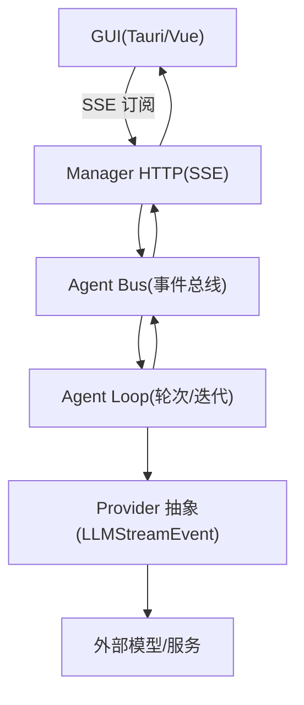
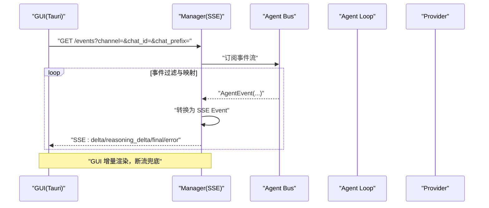
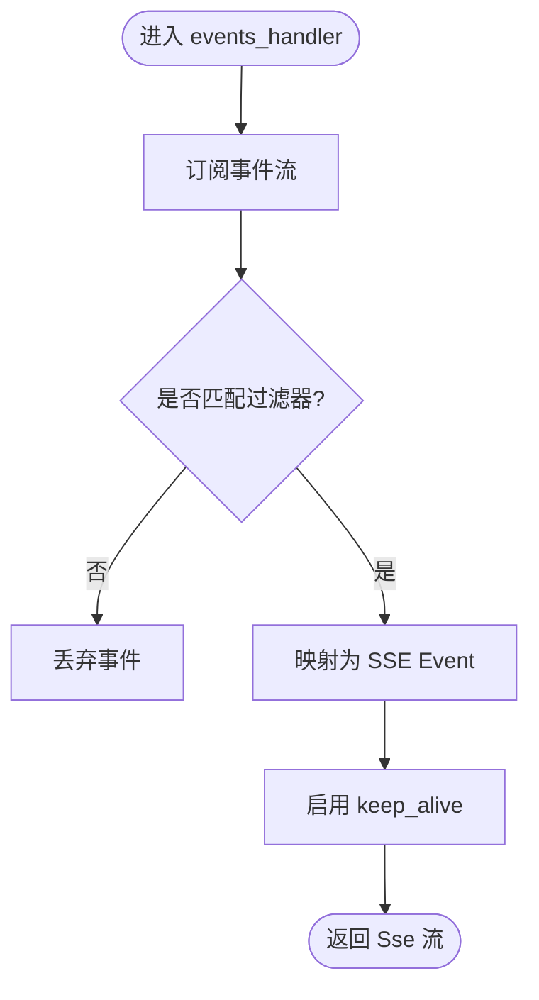
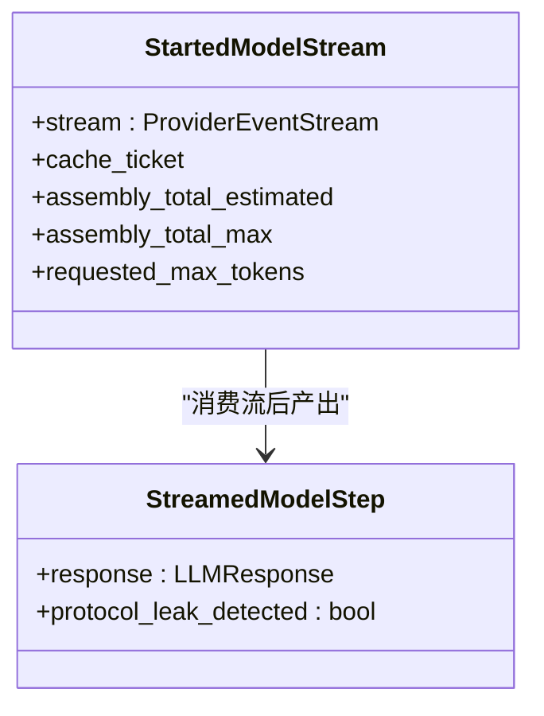
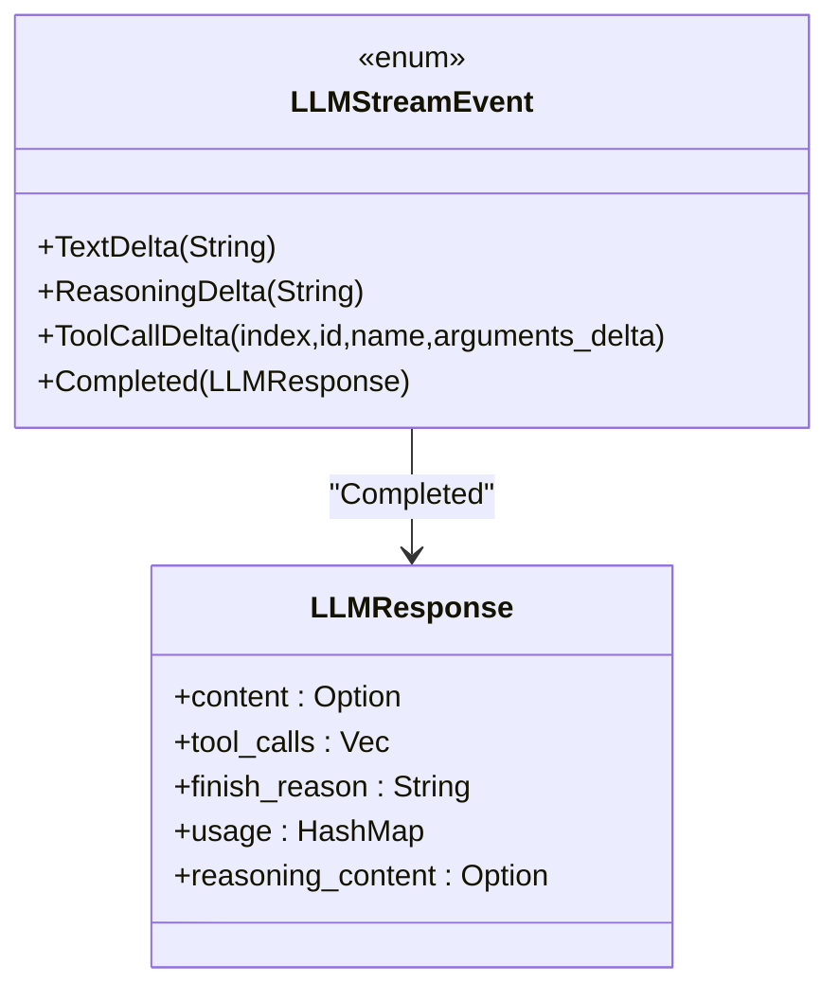
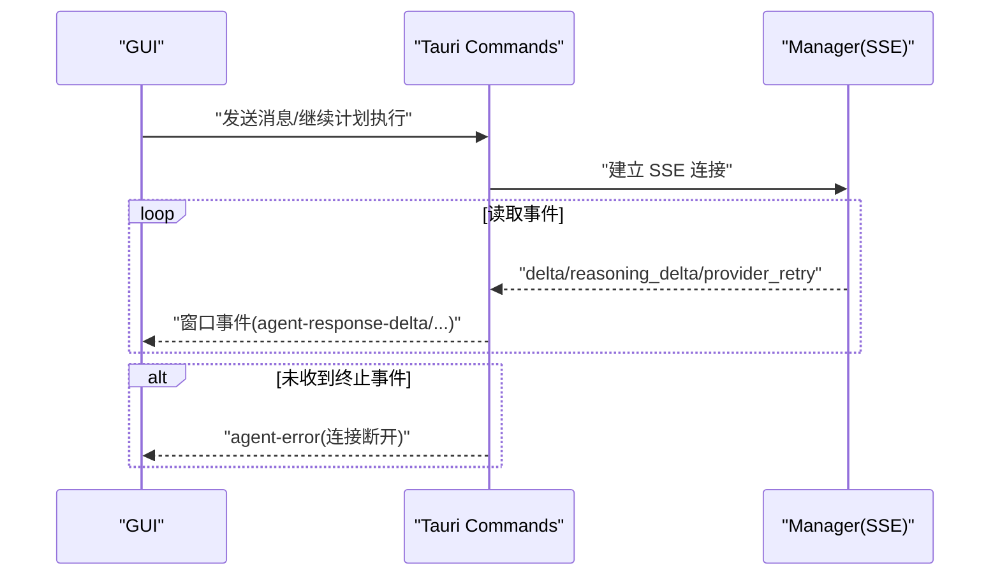
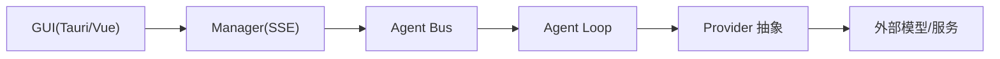

# 流式处理模型

<cite>
**本文引用的文件**
- [agent-diva-manager/src/handlers.rs](file://agent-diva-manager/src/handlers.rs)
- [agent-diva-gui/src-tauri/src/commands.rs](file://agent-diva-gui/src-tauri/src/commands.rs)
- [agent-diva-agent/src/agent_loop/turn/iteration.rs](file://agent-diva-agent/src/agent_loop/turn/iteration.rs)
- [agent-diva-providers/src/base.rs](file://agent-diva-providers/src/base.rs)
- [agent-diva-core/src/quality/mod.rs](file://agent-diva-core/src/quality/mod.rs)
- [agent-diva-gui/src/utils/streamingMessages.ts](file://agent-diva-gui/src/utils/streamingMessages.ts)
</cite>

## 目录
1. [简介](#简介)
2. [项目结构](#项目结构)
3. [核心组件](#核心组件)
4. [架构总览](#架构总览)
5. [详细组件分析](#详细组件分析)
6. [依赖关系分析](#依赖关系分析)
7. [性能考量](#性能考量)
8. [故障排查指南](#故障排查指南)
9. [结论](#结论)
10. [附录](#附录)

## 简介
本文件面向“大响应数据的渐进式处理”主题，系统化梳理 agent-diva 的流式处理模型。内容覆盖：
- SSE（Server-Sent Events）与 WebSocket 流式传输在系统中的角色与实现要点
- 流式响应的缓冲、合并与展示策略，提升首字节时延与整体体验
- 背压控制与流量管理，防止内存溢出与阻塞
- 流式数据的前处理与后处理管道（格式化、过滤、审计）
- 性能优化技巧与监控方法
- 架构图与数据流向图，帮助读者快速建立全局认知

## 项目结构
从端到端视角看，流式处理贯穿以下层次：
- 前端 GUI（Tauri + Vue）：发起请求、订阅 SSE、增量渲染消息、错误兜底
- 管理器 HTTP 服务（Axum）：暴露 SSE 事件接口，按通道/会话过滤并转发
- Agent 循环：调用 Provider 获取 LLM 流式事件，组装为 AgentEvent 广播
- Provider 抽象层：定义统一的流式事件类型与响应结构

图表来源
- [agent-diva-manager/src/handlers.rs:617-656](file://agent-diva-manager/src/handlers.rs#L617-L656)
- [agent-diva-agent/src/agent_loop/turn/iteration.rs:94-105](file://agent-diva-agent/src/agent_loop/turn/iteration.rs#L94-L105)
- [agent-diva-providers/src/base.rs:409-425](file://agent-diva-providers/src/base.rs#L409-L425)

章节来源
- [agent-diva-manager/src/handlers.rs:617-656](file://agent-diva-manager/src/handlers.rs#L617-L656)
- [agent-diva-agent/src/agent_loop/turn/iteration.rs:94-105](file://agent-diva-agent/src/agent_loop/turn/iteration.rs#L94-L105)
- [agent-diva-providers/src/base.rs:409-425](file://agent-diva-providers/src/base.rs#L409-L425)

## 核心组件
- SSE 事件出口（Manager）：将 AgentBus 的事件转换为 SSE 帧，支持 channel/chat_id/chat_prefix 过滤，保持连接活跃
- Agent 流式消费（Agent Loop）：启动模型流，消费 LLMStreamEvent，聚合为 AgentEvent 并通过 Bus 广播
- Provider 流式事件（Providers）：统一 TextDelta/ReasoningDelta/ToolCallDelta/Completed 等事件形态
- GUI 流式消费（Tauri/Vue）：通过 EventSource 读取 SSE，分发到窗口事件，前端增量更新 UI；断流兜底提示

章节来源
- [agent-diva-manager/src/handlers.rs:617-656](file://agent-diva-manager/src/handlers.rs#L617-L656)
- [agent-diva-agent/src/agent_loop/turn/iteration.rs:167-182](file://agent-diva-agent/src/agent_loop/turn/iteration.rs#L167-L182)
- [agent-diva-providers/src/base.rs:409-425](file://agent-diva-providers/src/base.rs#L409-L425)
- [agent-diva-gui/src-tauri/src/commands.rs:1536-1565](file://agent-diva-gui/src-tauri/src/commands.rs#L1536-L1565)

## 架构总览
下图展示了从 GUI 发起请求到最终 SSE 推送的完整链路，以及关键的数据转换点。

图表来源
- [agent-diva-manager/src/handlers.rs:617-656](file://agent-diva-manager/src/handlers.rs#L617-L656)
- [agent-diva-gui/src-tauri/src/commands.rs:1536-1565](file://agent-diva-gui/src-tauri/src/commands.rs#L1536-L1565)

## 详细组件分析

### SSE 事件出口（Manager）
- 功能：订阅 AgentBus 事件，按查询参数过滤，映射为 SSE 帧，启用 keep_alive
- 关键点：
  - 使用 BroadcastStream 订阅事件
  - 对 channel/chat_id/chat_prefix 进行过滤
  - 将 AgentEvent 转为 SSE Event（final/error/turn_plan_updated 等）
  - 使用 keep_alive 维持长连接

图表来源
- [agent-diva-manager/src/handlers.rs:617-656](file://agent-diva-manager/src/handlers.rs#L617-L656)

章节来源
- [agent-diva-manager/src/handlers.rs:617-656](file://agent-diva-manager/src/handlers.rs#L617-L656)

### Agent 流式消费（Agent Loop）
- 功能：启动模型流，消费 Provider 的 LLMStreamEvent，聚合为 AgentEvent 并广播
- 关键点：
  - 启动模型流，携带上下文预算、工具定义、会话键等
  - 消费 TextDelta/ReasoningDelta/ToolCallDelta/Completed
  - 将中间态与完成态事件发布到 Bus，供 SSE 出口转发
  - 结合上下文预算与工具结果压缩，避免上下文膨胀

图表来源
- [agent-diva-agent/src/agent_loop/turn/iteration.rs:94-105](file://agent-diva-agent/src/agent_loop/turn/iteration.rs#L94-L105)

章节来源
- [agent-diva-agent/src/agent_loop/turn/iteration.rs:94-105](file://agent-diva-agent/src/agent_loop/turn/iteration.rs#L94-L105)
- [agent-diva-agent/src/agent_loop/turn/iteration.rs:167-182](file://agent-diva-agent/src/agent_loop/turn/iteration.rs#L167-L182)

### Provider 流式事件（Providers）
- 功能：定义统一的流式事件类型，屏蔽不同后端差异
- 关键点：
  - TextDelta：增量文本
  - ReasoningDelta：增量推理内容
  - ToolCallDelta：增量工具调用元数据
  - Completed：最终完成响应，包含 usage、finish_reason 等

图表来源
- [agent-diva-providers/src/base.rs:409-425](file://agent-diva-providers/src/base.rs#L409-L425)
- [agent-diva-providers/src/base.rs:384-396](file://agent-diva-providers/src/base.rs#L384-L396)

章节来源
- [agent-diva-providers/src/base.rs:409-425](file://agent-diva-providers/src/base.rs#L409-L425)
- [agent-diva-providers/src/base.rs:384-396](file://agent-diva-providers/src/base.rs#L384-L396)

### GUI 流式消费（Tauri/Vue）
- 功能：通过 EventSource 读取 SSE，分发到窗口事件，前端增量更新 UI；断流兜底提示
- 关键点：
  - 监听 delta/reasoning_delta/provider_retry 等事件并转发
  - 无 final/error 时触发断流兜底，通知前端恢复状态
  - 前端维护当前流式消息索引，增量拼接内容，完成后关闭 isStreaming

图表来源
- [agent-diva-gui/src-tauri/src/commands.rs:1536-1565](file://agent-diva-gui/src-tauri/src/commands.rs#L1536-L1565)
- [agent-diva-gui/src-tauri/src/commands.rs:1750-1784](file://agent-diva-gui/src-tauri/src/commands.rs#L1750-L1784)

章节来源
- [agent-diva-gui/src-tauri/src/commands.rs:1536-1565](file://agent-diva-gui/src-tauri/src/commands.rs#L1536-L1565)
- [agent-diva-gui/src-tauri/src/commands.rs:1750-1784](file://agent-diva-gui/src-tauri/src/commands.rs#L1750-L1784)
- [agent-diva-gui/src/utils/streamingMessages.ts:9-35](file://agent-diva-gui/src/utils/streamingMessages.ts#L9-L35)

## 依赖关系分析
- Manager 依赖 AgentBus 提供事件源，依赖 Axum SSE 能力输出流
- Agent Loop 依赖 Provider 抽象获取 LLM 流式事件，依赖 Bus 广播事件
- GUI 依赖 Tauri 命令与 EventSource 协议消费 SSE
- Providers 抽象统一事件形态，屏蔽后端差异

图表来源
- [agent-diva-manager/src/handlers.rs:617-656](file://agent-diva-manager/src/handlers.rs#L617-L656)
- [agent-diva-agent/src/agent_loop/turn/iteration.rs:94-105](file://agent-diva-agent/src/agent_loop/turn/iteration.rs#L94-L105)
- [agent-diva-providers/src/base.rs:409-425](file://agent-diva-providers/src/base.rs#L409-L425)

章节来源
- [agent-diva-manager/src/handlers.rs:617-656](file://agent-diva-manager/src/handlers.rs#L617-L656)
- [agent-diva-agent/src/agent_loop/turn/iteration.rs:94-105](file://agent-diva-agent/src/agent_loop/turn/iteration.rs#L94-L105)
- [agent-diva-providers/src/base.rs:409-425](file://agent-diva-providers/src/base.rs#L409-L425)

## 性能考量
- 首字节时延优化
  - SSE keep_alive 保持连接活跃，减少握手开销
  - 前端增量渲染，避免等待完整响应
- 缓冲与合并策略
  - 前端维护当前流式消息索引，增量拼接内容，完成后关闭 isStreaming
  - 后端按事件粒度过滤（channel/chat_id/chat_prefix），减少不必要流量
- 背压控制与流量管理
  - 基于有界通道与流控，避免消费者慢导致生产者积压
  - 上下文预算与工具结果压缩，限制上下文膨胀
  - 对异常或超长响应设置上限，超限立即失败而非持续占用内存
- 前处理与后处理管道
  - 前处理：消息清洗、上下文组装、动态上下文包裹策略
  - 后处理：事件映射为 SSE、过滤、审计与用量统计
- 监控与可观测性
  - 用量记录与来源追踪（UsageRecord/UsageSource）
  - 重试事件上报（provider_retry），便于定位网络抖动
  - 日志与指标埋点（tracing/metrics）

章节来源
- [agent-diva-manager/src/handlers.rs:617-656](file://agent-diva-manager/src/handlers.rs#L617-L656)
- [agent-diva-gui/src/utils/streamingMessages.ts:9-35](file://agent-diva-gui/src/utils/streamingMessages.ts#L9-L35)
- [agent-diva-core/src/quality/mod.rs:1-6](file://agent-diva-core/src/quality/mod.rs#L1-L6)
- [agent-diva-gui/src-tauri/src/commands.rs:1536-1565](file://agent-diva-gui/src-tauri/src/commands.rs#L1536-L1565)

## 故障排查指南
- SSE 断流兜底
  - 若未收到 final/error 事件，GUI 侧主动上报 agent-error，提示“与服务器的连接已断开，请重试”，避免 UI 卡死
- 事件过滤不生效
  - 检查 query 参数 channel/chat_id/chat_prefix 是否正确传递
- 流式事件丢失
  - 确认 AgentBus 是否成功广播对应事件
  - 检查 Provider 流式事件是否按预期产生
- 性能问题定位
  - 关注 provider_retry 事件频率，判断网络抖动或限流
  - 观察上下文预算与工具结果压缩情况，避免上下文过大

章节来源
- [agent-diva-gui/src-tauri/src/commands.rs:1750-1784](file://agent-diva-gui/src-tauri/src/commands.rs#L1750-L1784)
- [agent-diva-manager/src/handlers.rs:617-656](file://agent-diva-manager/src/handlers.rs#L617-L656)
- [agent-diva-gui/src-tauri/src/commands.rs:1536-1565](file://agent-diva-gui/src-tauri/src/commands.rs#L1536-L1565)

## 结论
本流式处理模型以 SSE 为核心载体，结合 AgentBus 的事件驱动架构，实现了从 Provider 到 GUI 的低延迟、可扩展的渐进式响应。通过上下文预算、工具结果压缩与前端增量渲染，系统在保障用户体验的同时有效控制了内存与带宽消耗。建议在生产环境中加强背压与监控，确保在高并发与不稳定网络下的稳定性。

## 附录
- 术语
  - SSE：Server-Sent Events，服务端推送事件的单向通信协议
  - 背压：当消费者处理速度慢于生产者时，通过限流或缓冲控制数据流
  - 上下文预算：对对话历史与工具结果的 token 使用进行约束
- 相关实践
  - 使用 keep_alive 维持 SSE 连接
  - 前端增量渲染，避免整段重绘
  - 后端事件过滤，减少无关流量
  - 用量记录与重试事件上报，增强可观测性