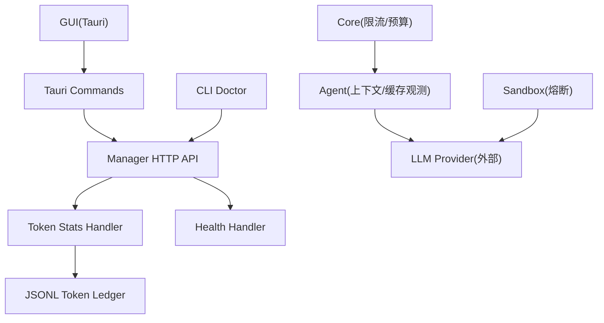
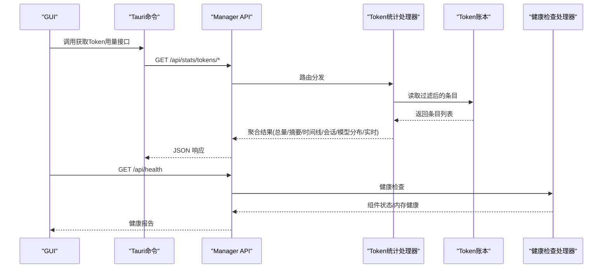
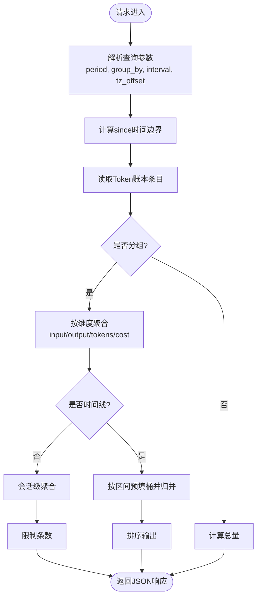
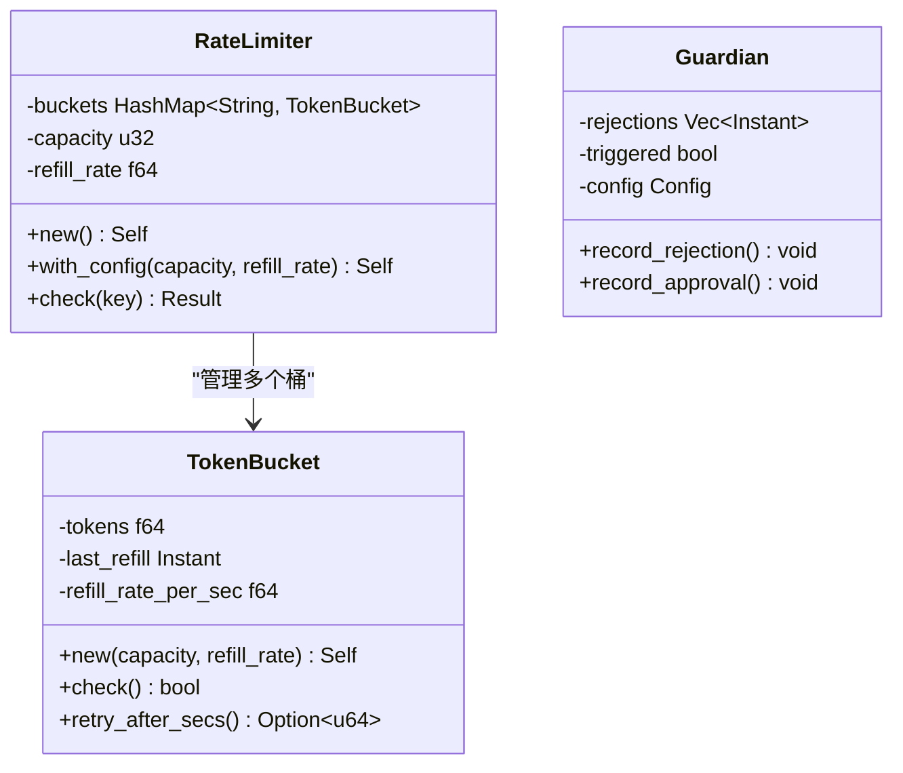
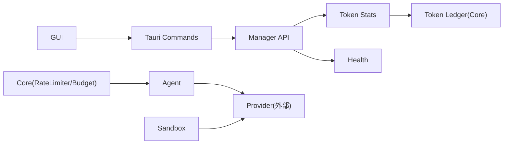

# 性能监控与优化

<cite>
**本文引用的文件**
- [agent-diva-core/src/token_ledger/store.rs](file://agent-diva-core/src/token_ledger/store.rs)
- [agent-diva-manager/src/handlers/token_stats.rs](file://agent-diva-manager/src/handlers/token_stats.rs)
- [agent-diva-gui/src/api/tokenStats.ts](file://agent-diva-gui/src/api/tokenStats.ts)
- [agent-diva-gui/src-tauri/src/commands.rs](file://agent-diva-gui/src-tauri/src/commands.rs)
- [agent-diva-core/src/rate_limiter.rs](file://agent-diva-core/src/rate_limiter.rs)
- [agent-diva-sandbox/src/guardian.rs](file://agent-diva-sandbox/src/guardian.rs)
- [agent-diva-core/benches/performance.rs](file://agent-diva-core/benches/performance.rs)
- [agent-diva-agent/src/context_assembly/mod.rs](file://agent-diva-agent/src/context_assembly/mod.rs)
- [agent-diva-agent/src/context_assembly/cache_observe.rs](file://agent-diva-agent/src/context_assembly/cache_observe.rs)
- [agent-diva-core/src/quality/context_budget.rs](file://agent-diva-core/src/quality/context_budget.rs)
- [agent-diva-manager/src/handlers/health.rs](file://agent-diva-manager/src/handlers/health.rs)
- [agent-diva-cli/src/main.rs](file://agent-diva-cli/src/main.rs)
- [agent-diva-gui/src/components/settings/SettingsDashboard.vue](file://agent-diva-gui/src/components/settings/SettingsDashboard.vue)
- [agent-diva-gui/src/components/settings/GeneralSettings.vue](file://agent-diva-gui/src/components/settings/GeneralSettings.vue)
</cite>

## 目录
1. [简介](#简介)
2. [项目结构](#项目结构)
3. [核心组件](#核心组件)
4. [架构总览](#架构总览)
5. [详细组件分析](#详细组件分析)
6. [依赖关系分析](#依赖关系分析)
7. [性能考量](#性能考量)
8. [故障排查指南](#故障排查指南)
9. [结论](#结论)
10. [附录](#附录)

## 简介
本文件面向 Agent-Diva 项目的性能监控与优化，聚焦以下目标：
- 定义并采集关键性能指标（KPI）：响应时间、吞吐量、内存使用、CPU 利用率等。
- 解释 Token 使用统计与成本控制机制。
- 提供性能瓶颈识别方法与工具建议。
- 说明缓存策略与内存优化技术。
- 指导异步任务调优：线程池大小、批处理大小、连接池配置等。
- 给出性能监控仪表板与告警配置指南。
- 包含性能测试基准与优化前后对比方法。

## 项目结构
Agent-Diva 采用多 crate 的 Rust 工作区，GUI 通过 Tauri 桥接后端能力；Manager 暴露 HTTP API，Core 提供通用能力（限流、质量预算、Token Ledger），Agent 负责上下文组装与提示词缓存观测，Sandbox 提供熔断保护，CLI/GUI 提供诊断与可视化入口。

图表来源
- [agent-diva-manager/src/handlers/token_stats.rs:188-470](file://agent-diva-manager/src/handlers/token_stats.rs#L188-L470)
- [agent-diva-core/src/token_ledger/store.rs:119-180](file://agent-diva-core/src/token_ledger/store.rs#L119-L180)
- [agent-diva-manager/src/handlers/health.rs:77-111](file://agent-diva-manager/src/handlers/health.rs#L77-L111)
- [agent-diva-cli/src/main.rs:1586-1630](file://agent-diva-cli/src/main.rs#L1586-L1630)
- [agent-diva-agent/src/context_assembly/mod.rs:90-100](file://agent-diva-agent/src/context_assembly/mod.rs#L90-L100)
- [agent-diva-sandbox/src/guardian.rs:497-540](file://agent-diva-sandbox/src/guardian.rs#L497-L540)

章节来源
- [agent-diva-manager/src/handlers/token_stats.rs:1-546](file://agent-diva-manager/src/handlers/token_stats.rs#L1-L546)
- [agent-diva-core/src/token_ledger/store.rs:1-424](file://agent-diva-core/src/token_ledger/store.rs#L1-L424)
- [agent-diva-manager/src/handlers/health.rs:77-232](file://agent-diva-manager/src/handlers/health.rs#L77-L232)
- [agent-diva-cli/src/main.rs:1586-1630](file://agent-diva-cli/src/main.rs#L1586-L1630)

## 核心组件
- Token 使用统计与成本：基于 JSONL 追加式账本，支持按会话、模型、渠道、端点聚合，并提供时间线视图与实时统计。
- 健康检查：提供组件就绪状态、内存健康、版本与运行时长等指标。
- 限流器：令牌桶实现，支持容量与填充速率配置，返回重试等待时间。
- 熔断器：记录窗口内拒绝次数，达到阈值触发熔断，恢复后重置。
- 上下文预算：为系统、记忆、技能、工具定义等分节设置 token 预算与溢出策略。
- 提示词缓存观测：稳定前缀与动态后缀分离，结合 provider 上报的 cache read/create 作为命中事实来源。

章节来源
- [agent-diva-manager/src/handlers/token_stats.rs:44-90](file://agent-diva-manager/src/handlers/token_stats.rs#L44-L90)
- [agent-diva-core/src/token_ledger/store.rs:11-35](file://agent-diva-core/src/token_ledger/store.rs#L11-L35)
- [agent-diva-core/src/rate_limiter.rs:44-84](file://agent-diva-core/src/rate_limiter.rs#L44-L84)
- [agent-diva-sandbox/src/guardian.rs:497-540](file://agent-diva-sandbox/src/guardian.rs#L497-L540)
- [agent-diva-core/src/quality/context_budget.rs:22-56](file://agent-diva-core/src/quality/context_budget.rs#L22-L56)
- [agent-diva-agent/src/context_assembly/mod.rs:90-100](file://agent-diva-agent/src/context_assembly/mod.rs#L90-L100)

## 架构总览
下图展示从 GUI 到 Manager 再到 Token Ledger 的数据流，以及健康检查路径。

图表来源
- [agent-diva-gui/src/api/tokenStats.ts:67-135](file://agent-diva-gui/src/api/tokenStats.ts#L67-L135)
- [agent-diva-gui/src-tauri/src/commands.rs:6987-7035](file://agent-diva-gui/src-tauri/src/commands.rs#L6987-L7035)
- [agent-diva-manager/src/handlers/token_stats.rs:188-470](file://agent-diva-manager/src/handlers/token_stats.rs#L188-L470)
- [agent-diva-core/src/token_ledger/store.rs:119-180](file://agent-diva-core/src/token_ledger/store.rs#L119-L180)
- [agent-diva-manager/src/handlers/health.rs:77-111](file://agent-diva-manager/src/handlers/health.rs#L77-L111)

## 详细组件分析

### Token 使用统计与成本控制
- 数据源：追加式 JSONL 账本，每条记录包含时间戳、会话、模型、输入/输出 token、总计、可选缓存 token、可选成本估算。
- 聚合维度：总量、按端点/模型/会话/渠道/操作类型分组、时间线（半小时/小时/天）、会话详情、模型分布百分比。
- 实时统计：无时间过滤的全量聚合，用于近实时看板。
- 成本控制：每条记录可携带 cost_estimate，聚合时累计 total_cost，便于成本分析与上限控制。

图表来源
- [agent-diva-manager/src/handlers/token_stats.rs:101-122](file://agent-diva-manager/src/handlers/token_stats.rs#L101-L122)
- [agent-diva-manager/src/handlers/token_stats.rs:124-186](file://agent-diva-manager/src/handlers/token_stats.rs#L124-L186)
- [agent-diva-manager/src/handlers/token_stats.rs:231-334](file://agent-diva-manager/src/handlers/token_stats.rs#L231-L334)
- [agent-diva-manager/src/handlers/token_stats.rs:336-445](file://agent-diva-manager/src/handlers/token_stats.rs#L336-L445)

章节来源
- [agent-diva-core/src/token_ledger/store.rs:11-96](file://agent-diva-core/src/token_ledger/store.rs#L11-L96)
- [agent-diva-manager/src/handlers/token_stats.rs:44-90](file://agent-diva-manager/src/handlers/token_stats.rs#L44-L90)
- [agent-diva-manager/src/handlers/token_stats.rs:188-470](file://agent-diva-manager/src/handlers/token_stats.rs#L188-L470)

### 健康检查与运行时诊断
- 健康端点返回版本、运行时长、组件就绪状态、内存健康状态。
- 内存健康通过尝试预热 memory_home 判断是否可用。
- CLI doctor 输出 providers/channels/健康状态等信息，便于快速定位问题。

章节来源
- [agent-diva-manager/src/handlers/health.rs:77-111](file://agent-diva-manager/src/handlers/health.rs#L77-L111)
- [agent-diva-cli/src/main.rs:1586-1630](file://agent-diva-cli/src/main.rs#L1586-L1630)

### 限流与熔断
- 限流器：令牌桶算法，支持容量与每秒填充率，失败时返回重试秒数，适合对 LLM 调用或外部服务进行速率控制。
- 熔断器：在指定时间窗口内记录拒绝事件，超过阈值触发熔断，避免雪崩；收到批准则重置。

图表来源
- [agent-diva-core/src/rate_limiter.rs:44-179](file://agent-diva-core/src/rate_limiter.rs#L44-L179)
- [agent-diva-sandbox/src/guardian.rs:497-540](file://agent-diva-sandbox/src/guardian.rs#L497-L540)

章节来源
- [agent-diva-core/src/rate_limiter.rs:44-179](file://agent-diva-core/src/rate_limiter.rs#L44-L179)
- [agent-diva-sandbox/src/guardian.rs:497-540](file://agent-diva-sandbox/src/guardian.rs#L497-L540)

### 上下文预算与提示词缓存
- 上下文预算：为 system/memory/skills/tools/subagent/output 等分节设定 token 预算，支持 Warn/Truncate/Block/Consolidate 溢出策略。
- 提示词缓存：将上下文划分为稳定前缀与易变后缀，稳定前缀可被 provider 缓存；结合 provider 上报的 cache read/create 作为命中事实来源，减少重复计算与成本。

章节来源
- [agent-diva-core/src/quality/context_budget.rs:22-56](file://agent-diva-core/src/quality/context_budget.rs#L22-L56)
- [agent-diva-agent/src/context_assembly/mod.rs:90-100](file://agent-diva-agent/src/context_assembly/mod.rs#L90-L100)
- [agent-diva-agent/src/context_assembly/cache_observe.rs:240-333](file://agent-diva-agent/src/context_assembly/cache_observe.rs#L240-L333)

### 性能基准与测试
- 安全相关热点路径基准：PII 脱敏与注入检测，使用 Criterion 进行微基准测试，便于回归与优化评估。
- E2E 报告：聚合 trace 文件，统计通过率、成本估算与不稳定场景识别，辅助性能与稳定性评估。

章节来源
- [agent-diva-core/benches/performance.rs:1-50](file://agent-diva-core/benches/performance.rs#L1-L50)
- [agent-diva-e2e/src/report.rs:1-34](file://agent-diva-e2e/src/report.rs#L1-L34)

## 依赖关系分析
- GUI 通过 Tauri 命令调用 Manager 的 Token 统计与健康接口。
- Manager 的 Token 统计处理器依赖 Core 的 JSONL Token Ledger 进行持久化读取与过滤。
- Agent 的上下文组装与缓存观测影响 provider 调用频率与缓存命中率，间接影响吞吐与成本。
- Sandbox 熔断与 Core 限流共同保障系统在异常负载下的稳定性。

图表来源
- [agent-diva-gui/src/api/tokenStats.ts:67-135](file://agent-diva-gui/src/api/tokenStats.ts#L67-L135)
- [agent-diva-gui/src-tauri/src/commands.rs:6987-7035](file://agent-diva-gui/src-tauri/src/commands.rs#L6987-L7035)
- [agent-diva-manager/src/handlers/token_stats.rs:188-470](file://agent-diva-manager/src/handlers/token_stats.rs#L188-L470)
- [agent-diva-core/src/token_ledger/store.rs:119-180](file://agent-diva-core/src/token_ledger/store.rs#L119-L180)
- [agent-diva-core/src/rate_limiter.rs:44-179](file://agent-diva-core/src/rate_limiter.rs#L44-L179)
- [agent-diva-agent/src/context_assembly/mod.rs:90-100](file://agent-diva-agent/src/context_assembly/mod.rs#L90-L100)
- [agent-diva-sandbox/src/guardian.rs:497-540](file://agent-diva-sandbox/src/guardian.rs#L497-L540)

## 性能考量
- KPI 定义与采集
  - 响应时间：可通过健康端点与统计接口耗时测量；建议在网关层埋点记录 P50/P95/P99。
  - 吞吐量：统计单位时间内 Token 请求数与成功完成数；关注时间线聚合中的 request_count。
  - 内存使用：健康端点返回内存健康状态；结合进程级监控（RSS/Heap）观察趋势。
  - CPU 利用率：结合系统监控工具（如 perf/htop）与热点路径基准（PII/注入检测）定位瓶颈。
- Token 使用与成本
  - 使用总量、分组汇总、时间线与模型分布，结合 cost_estimate 累计 total_cost，制定成本上限与配额策略。
  - 利用稳定前缀缓存降低重复 token 消耗，提升命中率。
- 缓存策略与内存优化
  - 稳定前缀（system/CORE tools）优先缓存；动态后缀（会话/历史/计划）不进入稳定前缀。
  - 上下文预算防止单节膨胀导致整体溢出；溢出策略可选择截断或压缩。
- 异步任务调优
  - 线程池大小：根据 CPU 核数与 I/O 阻塞特性调整 tokio 线程池；高 I/O 场景可适当增大。
  - 批处理大小：聚合统计时合理划分批次，避免一次性加载过大数据集。
  - 连接池配置：对外部 provider 的连接复用与超时设置需与限流器配合，避免拥塞。
- 监控仪表板与告警
  - 仪表板：使用 GUI 设置面板查看健康与通道状态；结合 Token 统计接口绘制用量与成本曲线。
  - 告警：当连续拒绝次数达到阈值触发熔断；当成本增长过快或延迟升高时发出告警。

[本节为通用指导，不直接分析具体文件]

## 故障排查指南
- 健康检查
  - 访问健康端点，检查 components 与 memory 状态；若 degraded，查看原因字段。
- Token 统计异常
  - 检查 since 时间边界与 period 参数是否有效；确认账本文件可读且无损坏行。
- 限流与熔断
  - 若频繁被限流，检查 capacity 与 refill_rate；若熔断触发，检查上游错误与恢复逻辑。
- CLI 诊断
  - 使用 CLI doctor 查看 providers/channels/健康状态，快速定位配置或连通性问题。

章节来源
- [agent-diva-manager/src/handlers/health.rs:77-111](file://agent-diva-manager/src/handlers/health.rs#L77-L111)
- [agent-diva-manager/src/handlers/token_stats.rs:101-122](file://agent-diva-manager/src/handlers/token_stats.rs#L101-L122)
- [agent-diva-core/src/token_ledger/store.rs:144-180](file://agent-diva-core/src/token_ledger/store.rs#L144-L180)
- [agent-diva-core/src/rate_limiter.rs:152-164](file://agent-diva-core/src/rate_limiter.rs#L152-L164)
- [agent-diva-sandbox/src/guardian.rs:502-540](file://agent-diva-sandbox/src/guardian.rs#L502-L540)
- [agent-diva-cli/src/main.rs:1586-1630](file://agent-diva-cli/src/main.rs#L1586-L1630)

## 结论
本项目已具备完善的 Token 使用统计、健康检查、限流与熔断机制，并通过上下文预算与提示词缓存优化上下文构建与 provider 调用成本。建议在生产环境中结合系统监控与业务指标建立持续的性能观测体系，定期运行基准测试与 E2E 报告，确保性能与稳定性持续提升。

[本节为总结性内容，不直接分析具体文件]

## 附录
- 仪表板与告警配置建议
  - 仪表板：集成 GUI 设置面板与 Token 统计接口，展示用量、成本、模型分布与时间线。
  - 告警：基于熔断器拒绝次数、限流器重试秒数、健康端点降级状态设置阈值告警。
- 性能测试基准
  - 使用 Criterion 对热点路径进行基准测试，记录优化前后差异。
  - 使用 E2E 报告统计通过率与成本估算，识别不稳定场景。

[本节为补充信息，不直接分析具体文件]