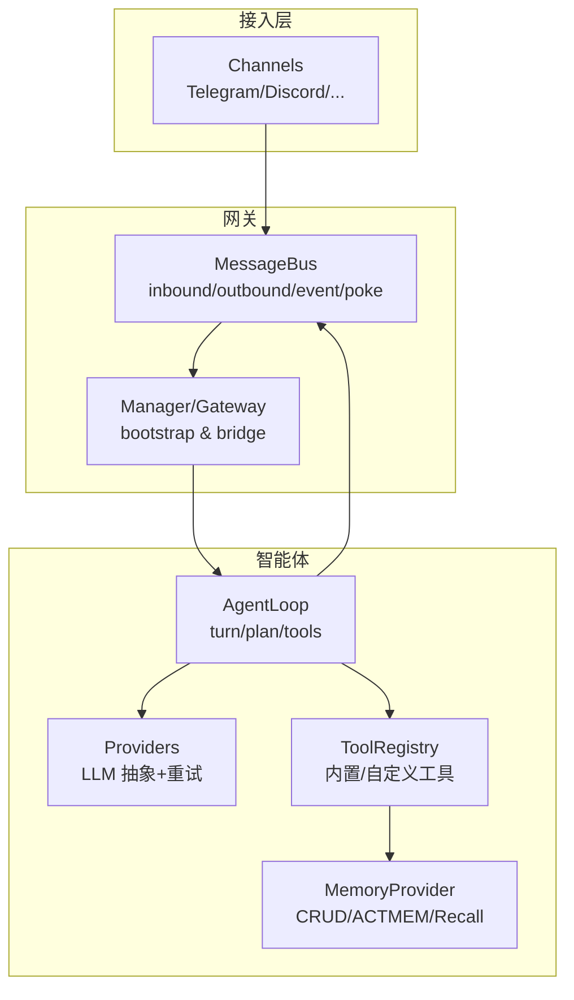
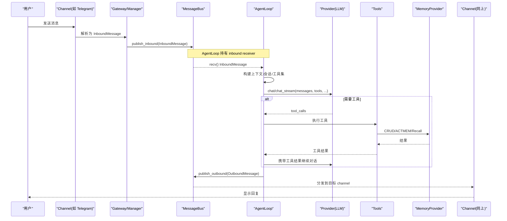
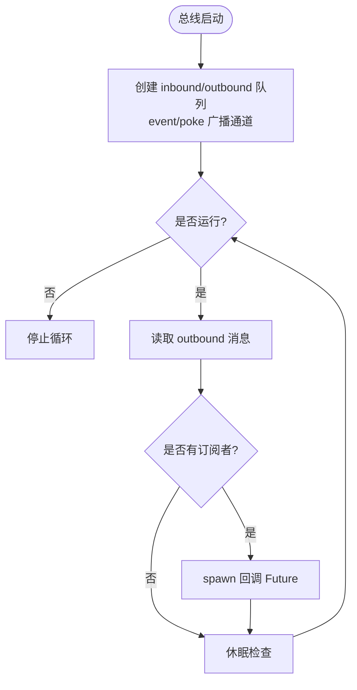
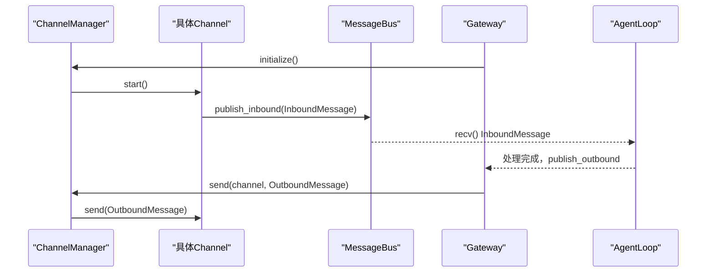
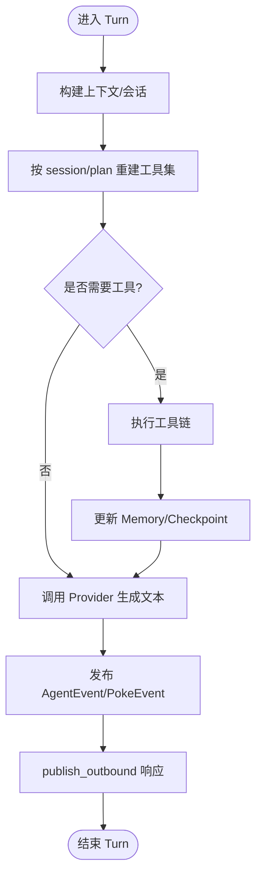
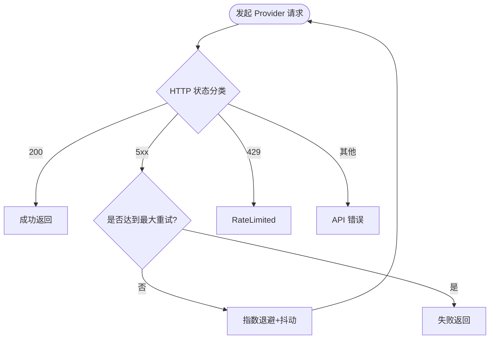
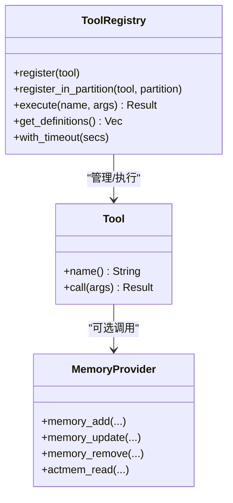
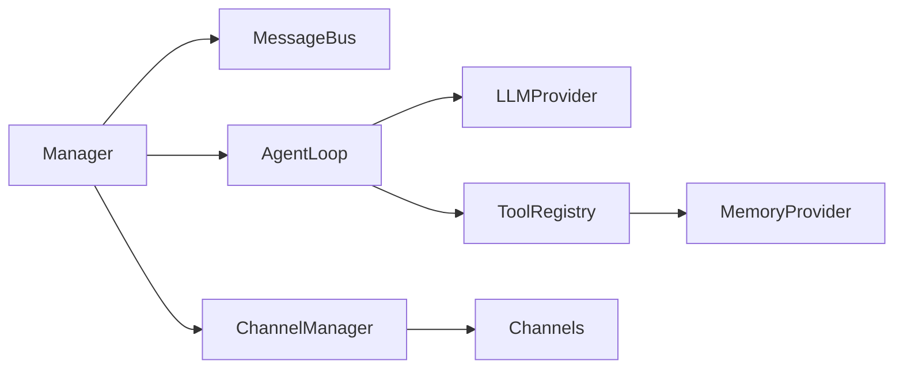
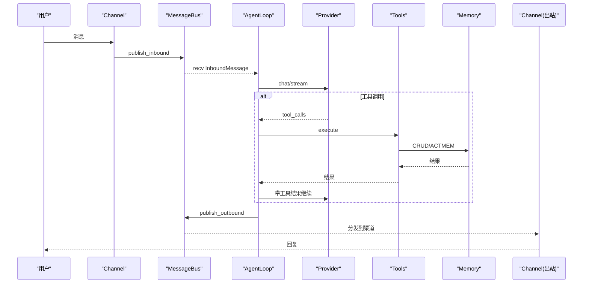

# 数据流架构

<cite>
**本文引用的文件**
- [agent-diva-core/src/bus/mod.rs](file://agent-diva-core/src/bus/mod.rs)
- [agent-diva-core/src/bus/queue.rs](file://agent-diva-core/src/bus/queue.rs)
- [agent-diva-core/src/bus/events.rs](file://agent-diva-core/src/bus/events.rs)
- [agent-diva-channels/src/lib.rs](file://agent-diva-channels/src/lib.rs)
- [agent-diva-channels/src/base.rs](file://agent-diva-channels/src/base.rs)
- [agent-diva-channels/src/manager.rs](file://agent-diva-channels/src/manager.rs)
- [agent-diva-manager/src/runtime/bootstrap.rs](file://agent-diva-manager/src/runtime/bootstrap.rs)
- [agent-diva-agent/src/agent_loop.rs](file://agent-diva-agent/src/agent_loop.rs)
- [agent-diva-providers/src/lib.rs](file://agent-diva-providers/src/lib.rs)
- [agent-diva-providers/src/retry.rs](file://agent-diva-providers/src/retry.rs)
- [agent-diva-tools/src/lib.rs](file://agent-diva-tools/src/lib.rs)
- [agent-diva-tooling/src/registry.rs](file://agent-diva-tooling/src/registry.rs)
- [agent-diva-core/src/memory/mod.rs](file://agent-diva-core/src/memory/mod.rs)
- [agent-diva-core/src/error_category.rs](file://agent-diva-core/src/error_category.rs)
</cite>

## 目录
1. [简介](#简介)
2. [项目结构](#项目结构)
3. [核心组件](#核心组件)
4. [架构总览](#架构总览)
5. [详细组件分析](#详细组件分析)
6. [依赖关系分析](#依赖关系分析)
7. [性能考量](#性能考量)
8. [故障排查指南](#故障排查指南)
9. [结论](#结论)
10. [附录](#附录)

## 简介
本文件面向 Agent-Diva 的数据流与事件驱动架构，聚焦消息从输入到输出的完整生命周期：Channel 接收消息 → Gateway 路由 → Agent Loop 处理 → Provider 调用 → Tool 执行 → Memory 更新 → 响应返回。文档同时解释消息总线（Message Bus）的解耦设计、基于 tokio 的异步模型（任务调度、Future、并发控制）、错误分类与重试机制，并提供关键路径的数据流图与时序图，以及性能优化建议与监控指标。

## 项目结构
Agent-Diva 采用多 crate 分层组织：
- agent-diva-core：提供消息总线、内存抽象、会话管理、安全与治理等基础能力
- agent-diva-channels：多渠道接入（Telegram、Discord、DingTalk、Feishu、Email、NeuroLink、QQ 等），通过统一接口发送/接收消息
- agent-diva-manager：网关启动、配置热重载、通道初始化、Agent 组装与运行桥接
- agent-diva-agent：Agent Loop 核心编排，负责轮次推进、上下文装配、工具装配、计划模式、子代理、记忆同步等
- agent-diva-providers：LLM 提供商抽象与实现（OpenAI 兼容、Ollama、Anthropic 等），含重试、流式事件、动态切换
- agent-diva-tools + agent-diva-tooling：工具注册与执行框架，内置工具（文件系统、Web、Shell、Memory、Cron、AskUser 等）
- agent-diva-laputa：BML MemoryHome 实现，提供持久化记忆 CRUD、ACTMEM、召回策略等

图表来源
- [agent-diva-core/src/bus/mod.rs:1-14](file://agent-diva-core/src/bus/mod.rs#L1-L14)
- [agent-diva-channels/src/lib.rs:1-53](file://agent-diva-channels/src/lib.rs#L1-L53)
- [agent-diva-manager/src/runtime/bootstrap.rs:77-197](file://agent-diva-manager/src/runtime/bootstrap.rs#L77-L197)
- [agent-diva-agent/src/agent_loop.rs:110-153](file://agent-diva-agent/src/agent_loop.rs#L110-L153)
- [agent-diva-providers/src/lib.rs:1-124](file://agent-diva-providers/src/lib.rs#L1-L124)
- [agent-diva-tools/src/lib.rs:1-74](file://agent-diva-tools/src/lib.rs#L1-L74)
- [agent-diva-core/src/memory/mod.rs:1-47](file://agent-diva-core/src/memory/mod.rs#L1-L47)

章节来源
- [agent-diva-core/src/bus/mod.rs:1-14](file://agent-diva-core/src/bus/mod.rs#L1-L14)
- [agent-diva-channels/src/lib.rs:1-53](file://agent-diva-channels/src/lib.rs#L1-L53)
- [agent-diva-manager/src/runtime/bootstrap.rs:77-197](file://agent-diva-manager/src/runtime/bootstrap.rs#L77-L197)

## 核心组件
- 消息总线（MessageBus）：提供 inbound/outbound 队列、事件广播（AgentEvent）、Poke 事件（生命周期/审计）、按 channel 订阅出站消息回调；使用 tokio mpsc/broadcast 实现无阻塞、高吞吐的事件分发。
- 渠道（Channels）：统一 ChannelHandler 接口，支持 start/stop/send，并通过 set_inbound_sender 将上游消息推入总线 inbound。
- 网关（Manager/Gateway）：启动时创建 MessageBus，初始化 Channels，启动 inbound 桥接任务，构建 AgentLoop，并暴露运行时控制与配置热重载。
- Agent Loop：核心处理引擎，维护会话、上下文、工具集、记忆提供者、子代理、安全与限流；按 turn 推进，协调 Provider 与 Tools，产出 OutboundMessage。
- Providers：LLM 抽象，支持 chat/chat_stream、动态 provider 切换、重试与退避、缓存监听、提示词缓存策略。
- Tools：工具注册与执行框架，支持延迟激活、全局超时、分区 schema、MCP 集成、后台任务、计划模式约束。
- Memory：统一的 MemoryProvider 接口，封装 CRUD、ACTMEM、Recall、Session 生命周期钩子；由 Laputa BML 提供生产实现。

章节来源
- [agent-diva-core/src/bus/queue.rs:19-184](file://agent-diva-core/src/bus/queue.rs#L19-L184)
- [agent-diva-channels/src/base.rs:9-32](file://agent-diva-channels/src/base.rs#L9-L32)
- [agent-diva-manager/src/runtime/bootstrap.rs:77-197](file://agent-diva-manager/src/runtime/bootstrap.rs#L77-L197)
- [agent-diva-agent/src/agent_loop.rs:110-153](file://agent-diva-agent/src/agent_loop.rs#L110-L153)
- [agent-diva-providers/src/lib.rs:1-124](file://agent-diva-providers/src/lib.rs#L1-L124)
- [agent-diva-tools/src/lib.rs:1-74](file://agent-diva-tools/src/lib.rs#L1-L74)
- [agent-diva-core/src/memory/mod.rs:1-47](file://agent-diva-core/src/memory/mod.rs#L1-L47)

## 架构总览
下图展示“消息从输入到输出”的关键路径：Channel 接收用户消息 → 经 Gateway 桥接进入 MessageBus.inbound → AgentLoop 消费 inbound → 构造上下文与工具集 → 调用 Provider 生成回复或工具调用 → 执行 Tools → 更新 Memory → 通过 MessageBus.outbound 回写至对应 Channel。

图表来源
- [agent-diva-core/src/bus/queue.rs:105-184](file://agent-diva-core/src/bus/queue.rs#L105-L184)
- [agent-diva-manager/src/runtime/bootstrap.rs:275-291](file://agent-diva-manager/src/runtime/bootstrap.rs#L275-L291)
- [agent-diva-agent/src/agent_loop.rs:110-153](file://agent-diva-agent/src/agent_loop.rs#L110-L153)
- [agent-diva-providers/src/lib.rs:72-123](file://agent-diva-providers/src/lib.rs#L72-L123)
- [agent-diva-tools/src/lib.rs:36-74](file://agent-diva-tools/src/lib.rs#L36-L74)
- [agent-diva-core/src/memory/mod.rs:13-47](file://agent-diva-core/src/memory/mod.rs#L13-L47)

## 详细组件分析

### 消息总线（Message Bus）与事件驱动解耦
- 双队列：inbound/outbound 使用 tokio::sync::mpsc::UnboundedChannel，保证高吞吐、非阻塞投递；take_inbound_receiver/take_outbound_receiver 确保仅一次消费。
- 事件广播：AgentEvent 用于流式状态（迭代、工具调用、最终响应、错误、Provider 重试、上下文压缩进度等）；PokeEvent 用于生命周期/审计（发送/收到消息、Token 消耗、配置变更需重启）。
- 出站订阅：按 channel 注册回调，dispatch_outbound_loop 在后台循环中取出 OutboundMessage 并 spawn Future 异步执行回调，避免阻塞主循环。
- 解耦价值：Channel 只关心 InboundMessage 投递与 OutboundMessage 发送；AgentLoop 不感知具体渠道；上层可订阅事件做 UI/审计/遥测。

图表来源
- [agent-diva-core/src/bus/queue.rs:41-184](file://agent-diva-core/src/bus/queue.rs#L41-L184)

章节来源
- [agent-diva-core/src/bus/queue.rs:19-184](file://agent-diva-core/src/bus/queue.rs#L19-L184)
- [agent-diva-core/src/bus/events.rs:59-145](file://agent-diva-core/src/bus/events.rs#L59-L145)
- [agent-diva-core/src/bus/events.rs:342-436](file://agent-diva-core/src/bus/events.rs#L342-L436)

### 渠道（Channels）与网关（Gateway）路由
- ChannelHandler 统一接口：name/is_running/start/stop/send/set_inbound_sender/is_allowed。
- ChannelManager：集中管理各渠道实例，支持按名称获取与发送；支持动态更新配置（停止→重建→启动）。
- Gateway 启动：创建 MessageBus，初始化 Channels，启动 inbound 桥接任务（持续从通道取消息并 publish_inbound），构建 AgentLoop 并注入 bus/provider/memory 等。

图表来源
- [agent-diva-channels/src/base.rs:9-32](file://agent-diva-channels/src/base.rs#L9-L32)
- [agent-diva-channels/src/manager.rs:680-715](file://agent-diva-channels/src/manager.rs#L680-L715)
- [agent-diva-manager/src/runtime/bootstrap.rs:275-291](file://agent-diva-manager/src/runtime/bootstrap.rs#L275-L291)

章节来源
- [agent-diva-channels/src/lib.rs:1-53](file://agent-diva-channels/src/lib.rs#L1-L53)
- [agent-diva-channels/src/base.rs:9-32](file://agent-diva-channels/src/base.rs#L9-L32)
- [agent-diva-channels/src/manager.rs:680-715](file://agent-diva-channels/src/manager.rs#L680-L715)
- [agent-diva-manager/src/runtime/bootstrap.rs:77-197](file://agent-diva-manager/src/runtime/bootstrap.rs#L77-L197)

### Agent Loop 处理流程
- 构造与装配：加载安全配置、默认模型、上下文构建器、会话管理器、工具注册表、子代理管理器、文件管理器、记忆提供者、拒绝熔断器、速率限制器等。
- 每轮（Turn）处理：根据 mask/plan_phase/session_key 重建工具集；识别交互性 turn；执行规划/工具调用；维护活动工具表面与延迟工具激活；提交检查点更新。
- 安全与限流：拒绝熔断器统计 Provider 拒绝失败；ActionTracker 窗口限流（默认每小时最大动作数）；全局工具超时保护。

图表来源
- [agent-diva-agent/src/agent_loop.rs:110-153](file://agent-diva-agent/src/agent_loop.rs#L110-L153)
- [agent-diva-agent/src/agent_loop.rs:259-312](file://agent-diva-agent/src/agent_loop.rs#L259-L312)
- [agent-diva-agent/src/agent_loop.rs:373-409](file://agent-diva-agent/src/agent_loop.rs#L373-L409)

章节来源
- [agent-diva-agent/src/agent_loop.rs:110-153](file://agent-diva-agent/src/agent_loop.rs#L110-L153)
- [agent-diva-agent/src/agent_loop.rs:259-312](file://agent-diva-agent/src/agent_loop.rs#L259-L312)
- [agent-diva-agent/src/agent_loop.rs:373-409](file://agent-diva-agent/src/agent_loop.rs#L373-L409)

### Provider 调用与重试机制
- 抽象与动态切换：LLMProvider 定义 chat/chat_stream/get_default_model/dynamic_context_transport/prompt_cache_profile；DynamicProvider 允许运行时替换底层实现。
- 重试与退避：指数退避 + 抖动，针对 5xx 与网络错误进行重试；429 识别为 RateLimited；支持 RetryListener 上报每次重试尝试。
- 流式事件：Provider 事件流可用于前端实时渲染与监控。

图表来源
- [agent-diva-providers/src/retry.rs:1-75](file://agent-diva-providers/src/retry.rs#L1-L75)
- [agent-diva-providers/src/lib.rs:72-123](file://agent-diva-providers/src/lib.rs#L72-L123)

章节来源
- [agent-diva-providers/src/lib.rs:1-124](file://agent-diva-providers/src/lib.rs#L1-L124)
- [agent-diva-providers/src/retry.rs:1-75](file://agent-diva-providers/src/retry.rs#L1-L75)

### Tool 执行与注册
- 工具注册：ToolRegistry 支持 Core/Deferred 分区，延迟工具可在会话内按需激活；支持全局超时、MCP 工具发现、背景任务上下文、计划模式约束。
- 执行流程：AgentLoop 根据当前 plan_phase 与 session_key 装配工具集；Provider 返回 tool_calls 后，由 Registry 查找并执行；工具可调用 MemoryProvider 进行读写。

图表来源
- [agent-diva-tooling/src/registry.rs:441-476](file://agent-diva-tooling/src/registry.rs#L441-L476)
- [agent-diva-tools/src/lib.rs:36-74](file://agent-diva-tools/src/lib.rs#L36-L74)
- [agent-diva-core/src/memory/mod.rs:13-47](file://agent-diva-core/src/memory/mod.rs#L13-L47)

章节来源
- [agent-diva-tooling/src/registry.rs:441-476](file://agent-diva-tooling/src/registry.rs#L441-L476)
- [agent-diva-tools/src/lib.rs:1-74](file://agent-diva-tools/src/lib.rs#L1-L74)

### Memory 更新与会话生命周期
- 统一接口：MemoryProvider 暴露 CRUD、ACTMEM、Recall、Session 生命周期钩子（StartupContextSnapshot、SyncTurn、SessionEnd）。
- 生产实现：Laputa BML MemoryHome 提供持久化存储、索引、回收与预算控制；AgentLoop 在 turn 前后触发预取/同步/关闭清理。
- 工具侧：MemoryAdd/MemoryUpdate/MemoryRemove/Search/List 等工具通过 MemoryProvider 操作记忆。

章节来源
- [agent-diva-core/src/memory/mod.rs:1-47](file://agent-diva-core/src/memory/mod.rs#L1-L47)
- [agent-diva-tools/src/lib.rs:43-49](file://agent-diva-tools/src/lib.rs#L43-L49)

## 依赖关系分析
- 低耦合：Channel 与 AgentLoop 通过 MessageBus 解耦；AgentLoop 通过 LLMProvider 抽象屏蔽不同后端；Tools 通过 ToolRegistry 统一管理；Memory 通过 Provider 抽象隔离存储实现。
- 直接依赖：
  - Manager → MessageBus、ChannelManager、AgentLoop、DynamicProvider、MemoryHome
  - AgentLoop → MessageBus、LLMProvider、ToolRegistry、MemoryProvider、FileManager、SubagentManager
  - Providers → reqwest、重试模块、事件流
  - Tools → ToolRegistry、MemoryProvider、MCP SDK
- 间接依赖：GUI/CLI 通过 Manager API 与事件订阅观察系统状态。

图表来源
- [agent-diva-manager/src/runtime/bootstrap.rs:77-197](file://agent-diva-manager/src/runtime/bootstrap.rs#L77-L197)
- [agent-diva-agent/src/agent_loop.rs:110-153](file://agent-diva-agent/src/agent_loop.rs#L110-L153)
- [agent-diva-providers/src/lib.rs:1-124](file://agent-diva-providers/src/lib.rs#L1-L124)
- [agent-diva-tooling/src/registry.rs:441-476](file://agent-diva-tooling/src/registry.rs#L441-L476)
- [agent-diva-core/src/memory/mod.rs:1-47](file://agent-diva-core/src/memory/mod.rs#L1-L47)

章节来源
- [agent-diva-manager/src/runtime/bootstrap.rs:77-197](file://agent-diva-manager/src/runtime/bootstrap.rs#L77-L197)
- [agent-diva-agent/src/agent_loop.rs:110-153](file://agent-diva-agent/src/agent_loop.rs#L110-L153)

## 性能考量
- 异步与并发
  - 使用 tokio::sync::mpsc 无界通道承载 inbound/outbound，减少背压阻塞；dispatch_outbound_loop 以 tokio::select! 轮询并 spawn 回调 Future，避免阻塞分发。
  - Provider 流式响应通过 ProviderEventStream 推送增量内容，降低首字节延迟。
- 超时与限流
  - 全局工具超时（默认 120s）防止长尾任务拖垮；ActionTracker 窗口限流（默认每小时最大动作数）保护系统稳定性。
  - Provider 重试采用指数退避 + 抖动，避免雪崩。
- 上下文与记忆
  - 上下文压缩（ContextCompaction）与 ACTMEM 工作区减少大上下文开销；Session 生命周期钩子在 startup/sync_turn/shutdown 阶段进行预热与清理。
- 资源与 I/O
  - FileManager 集中管理附件存储；BML 启动 GC/Warmup 提升检索性能。
- 建议
  - 合理设置 max_iterations、exec_timeout、global_timeout_secs 与 token 预算；
  - 对高频渠道启用批量出站合并（可在上层扩展）；
  - 监控 Provider 重试次数与延迟分布，必要时调整退避参数；
  - 对 Memory 热点键进行缓存或预取。

[本节为通用指导，无需特定文件引用]

## 故障排查指南
- 错误分类与重试决策
  - ErrorCategory 将错误分为 Retryable/Fatal/Config/Auth/Timeout/Unknown，便于上层统一处理；is_retryable 可用于自动重试逻辑。
- Provider 重试
  - 429 标记为 RateLimited；5xx 触发重试；支持 RetryListener 上报每次重试 attempt/delay_ms/reason。
- 通道与总线
  - 若 inbound/outbound 通道关闭，publish_* 会返回错误；检查 dispatch_outbound_loop 是否仍在运行（is_running）。
- 工具执行
  - 未知工具名或超时将返回 ToolError；检查 ToolRegistry 是否已正确注册与分区；确认全局超时设置。
- 记忆操作
  - 不支持的操作返回 unsupported；检查 MemoryProvider 实现是否可用（如 Laputa 未就绪时降级）。

章节来源
- [agent-diva-core/src/error_category.rs:1-118](file://agent-diva-core/src/error_category.rs#L1-L118)
- [agent-diva-providers/src/retry.rs:1-75](file://agent-diva-providers/src/retry.rs#L1-L75)
- [agent-diva-core/src/bus/queue.rs:105-184](file://agent-diva-core/src/bus/queue.rs#L105-L184)
- [agent-diva-tooling/src/registry.rs:1081-1261](file://agent-diva-tooling/src/registry.rs#L1081-L1261)

## 结论
Agent-Diva 通过 MessageBus 实现了 Channel 与 Agent 的完全解耦，结合 AgentLoop 的 turn 编排、Provider 抽象与重试、工具注册与执行、MemoryProvider 的统一访问，构建了高内聚、低耦合、可扩展的事件驱动架构。基于 tokio 的异步模型确保了高吞吐与低延迟，配合错误分类与重试机制提升了系统健壮性。建议在部署中关注超时、限流、重试与上下文压缩等关键指标，并结合事件与 Poke 事件完善监控与告警。

[本节为总结，无需特定文件引用]

## 附录

### 关键路径时序图（端到端）

图表来源
- [agent-diva-core/src/bus/queue.rs:105-184](file://agent-diva-core/src/bus/queue.rs#L105-L184)
- [agent-diva-agent/src/agent_loop.rs:110-153](file://agent-diva-agent/src/agent_loop.rs#L110-L153)
- [agent-diva-providers/src/lib.rs:72-123](file://agent-diva-providers/src/lib.rs#L72-L123)
- [agent-diva-tools/src/lib.rs:36-74](file://agent-diva-tools/src/lib.rs#L36-L74)
- [agent-diva-core/src/memory/mod.rs:13-47](file://agent-diva-core/src/memory/mod.rs#L13-L47)

### 监控指标建议
- 通道与总线
  - inbound/outbound 队列长度、丢弃率、分发延迟；
  - 事件与 Poke 事件吞吐（ChatReceived/Sent、TokenUsed、ConfigChangeNeedsRestart）。
- AgentLoop
  - 每轮耗时、工具调用次数/耗时、Provider 调用次数/耗时、上下文压缩触发次数。
- Provider
  - 重试次数、平均退避时间、429 比例、5xx 比例、流式首字节延迟。
- Tools
  - 工具执行成功率、超时率、MCP 连接状态。
- Memory
  - CRUD 成功率、ACTMEM 命中率、Recall 延迟、GC 耗时。

[本节为通用指导，无需特定文件引用]