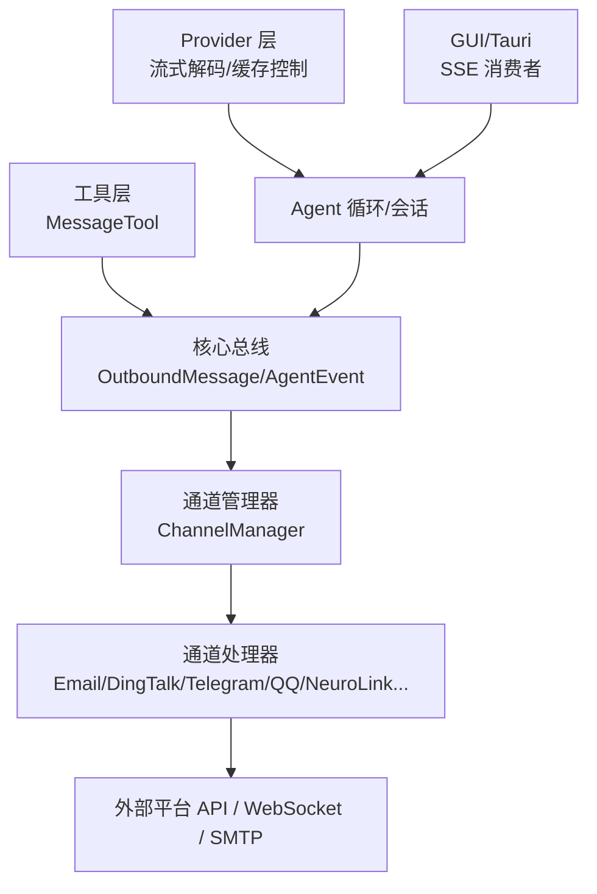
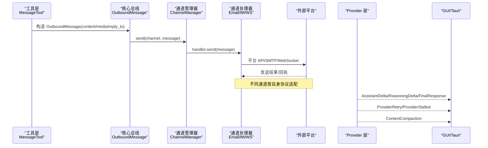
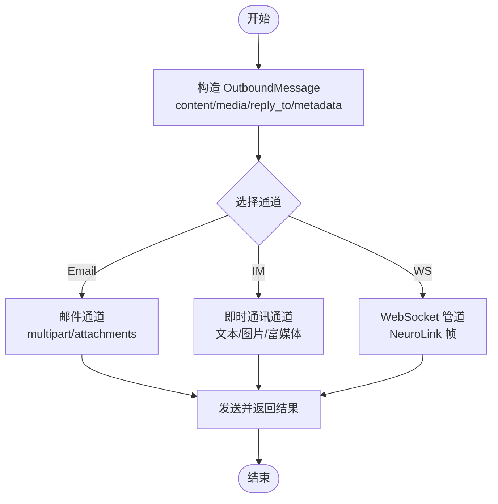
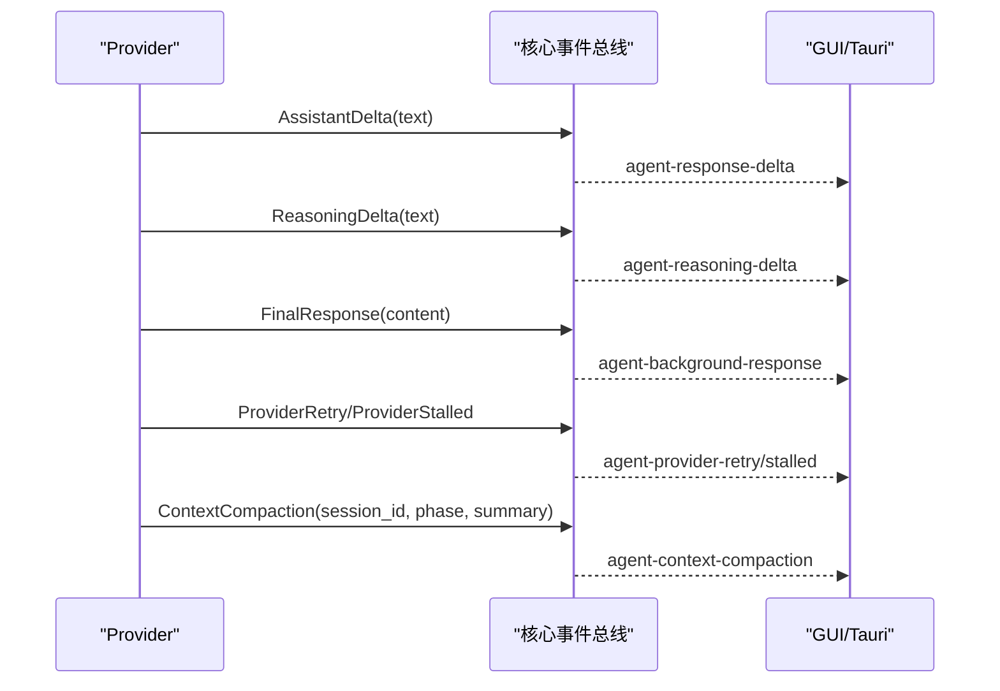
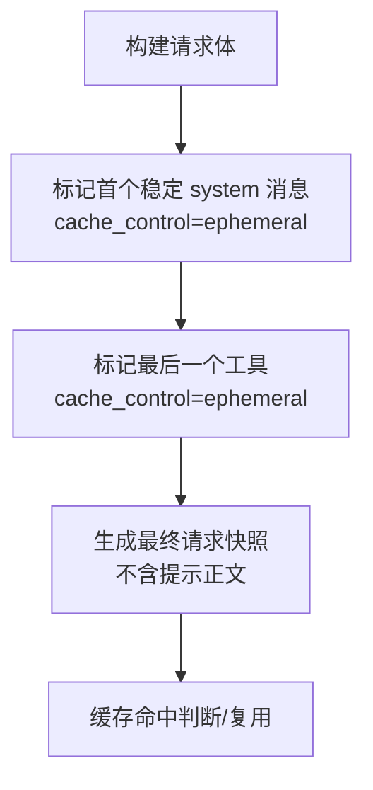
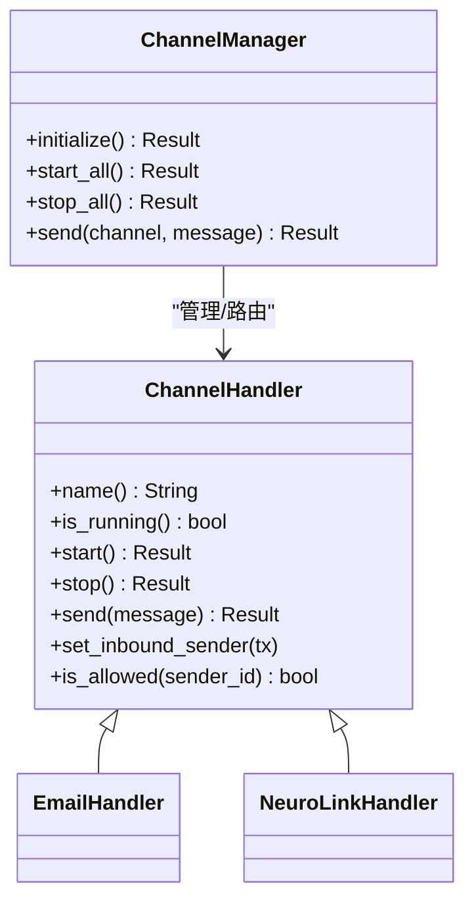
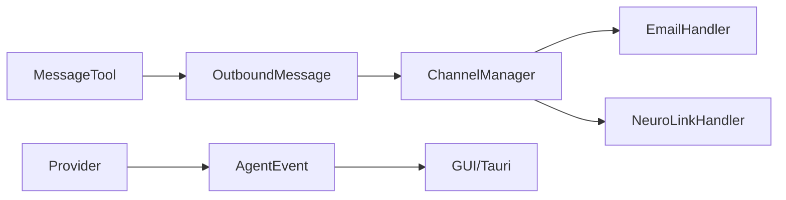

# 响应构建与发送

<cite>
**本文引用的文件**
- [agent-diva-core/src/bus/events.rs](file://agent-diva-core/src/bus/events.rs)
- [agent-diva-channels/src/base.rs](file://agent-diva-channels/src/base.rs)
- [agent-diva-channels/src/manager.rs](file://agent-diva-channels/src/manager.rs)
- [agent-diva-channels/src/lib.rs](file://agent-diva-channels/src/lib.rs)
- [agent-diva-channels/src/email.rs](file://agent-diva-channels/src/email.rs)
- [agent-diva-channels/src/neuro_link.rs](file://agent-diva-channels/src/neuro_link.rs)
- [agent-diva-tools/src/message.rs](file://agent-diva-tools/src/message.rs)
- [agent-diva-providers/src/base.rs](file://agent-diva-providers/src/base.rs)
- [agent-diva-providers/src/openai_compatible.rs](file://agent-diva-providers/src/openai_compatible.rs)
- [agent-diva-gui/src-tauri/src/commands.rs](file://agent-diva-gui/src-tauri/src/commands.rs)
- [agent-diva-core/src/config/schema.rs](file://agent-diva-core/src/config/schema.rs)
- [agent-diva-gui/src/i18n.ts](file://agent-diva-gui/src/i18n.ts)
</cite>

## 目录
1. [简介](#简介)
2. [项目结构](#项目结构)
3. [核心组件](#核心组件)
4. [架构总览](#架构总览)
5. [详细组件分析](#详细组件分析)
6. [依赖关系分析](#依赖关系分析)
7. [性能考量](#性能考量)
8. [故障排查指南](#故障排查指南)
9. [结论](#结论)
10. [附录](#附录)

## 简介
本文件聚焦“响应构建与发送”的端到端机制，覆盖以下目标：
- OutboundMessage 的构建过程：内容格式化、媒体附件处理、回复关系建立。
- 响应消息在不同 Channel 间的转换与适配：统一抽象到具体平台（邮件、即时通讯、WebSocket 管道等）。
- 流式响应的处理与推送：AssistantDelta 与 FinalResponse 事件在 Provider、Manager、GUI/Channel 之间的流转。
- 响应缓存与去重逻辑：Provider 层 cache-control 注入与最终请求边界快照。
- 响应模板定制与多语言支持：报告语言、界面 i18n 配置。
- 响应质量评估与用户反馈：质量门控、重试提示、上下文压缩进度与错误上报。

## 项目结构
围绕响应构建与发送，关键模块分布如下：
- 核心事件与消息模型：InboundMessage、OutboundMessage、AgentEvent（含 AssistantDelta、FinalResponse 等）定义于 core 总线。
- 通道管理：ChannelManager 负责通道初始化、路由与发送；各 ChannelHandler 实现具体协议。
- 工具侧触发：MessageTool 通过回调构造 OutboundMessage 并发起发送。
- Provider 流式解码与缓存控制：StreamingUtf8Decoder 与 OpenAI Compatible 的 cache-control 注入。
- GUI 流式消费：Tauri commands 订阅 SSE 事件并转发至前端。
- 配置与多语言：ReportsConfig.language、GUI i18n。

图表来源
- [agent-diva-tools/src/message.rs:121-164](file://agent-diva-tools/src/message.rs#L121-L164)
- [agent-diva-core/src/bus/events.rs:342-435](file://agent-diva-core/src/bus/events.rs#L342-L435)
- [agent-diva-channels/src/manager.rs:688-697](file://agent-diva-channels/src/manager.rs#L688-L697)
- [agent-diva-channels/src/email.rs:355-387](file://agent-diva-channels/src/email.rs#L355-L387)
- [agent-diva-channels/src/neuro_link.rs:371-415](file://agent-diva-channels/src/neuro_link.rs#L371-L415)
- [agent-diva-providers/src/base.rs:82-109](file://agent-diva-providers/src/base.rs#L82-L109)
- [agent-diva-providers/src/openai_compatible.rs:380-401](file://agent-diva-providers/src/openai_compatible.rs#L380-L401)
- [agent-diva-gui/src-tauri/src/commands.rs:1536-1564](file://agent-diva-gui/src-tauri/src/commands.rs#L1536-L1564)

章节来源
- [agent-diva-core/src/bus/events.rs:342-435](file://agent-diva-core/src/bus/events.rs#L342-L435)
- [agent-diva-channels/src/manager.rs:688-697](file://agent-diva-channels/src/manager.rs#L688-L697)
- [agent-diva-channels/src/email.rs:355-387](file://agent-diva-channels/src/email.rs#L355-L387)
- [agent-diva-channels/src/neuro_link.rs:371-415](file://agent-diva-channels/src/neuro_link.rs#L371-L415)
- [agent-diva-providers/src/base.rs:82-109](file://agent-diva-providers/src/base.rs#L82-L109)
- [agent-diva-providers/src/openai_compatible.rs:380-401](file://agent-diva-providers/src/openai_compatible.rs#L380-L401)
- [agent-diva-gui/src-tauri/src/commands.rs:1536-1564](file://agent-diva-gui/src-tauri/src/commands.rs#L1536-L1564)

## 核心组件
- OutboundMessage：承载 channel、chat_id、content、reply_to、media、reasoning_content、metadata，提供 reply_to、with_media、with_metadata 等链式构造方法。
- InboundMessage：承载 channel、sender_id、chat_id、content、timestamp、media、metadata，并提供 session_key 用于会话键生成。
- AgentEvent：包含 AssistantDelta、ReasoningDelta、ToolCall*、PlanReportReadyForApproval、ChatPlanUpdate、FinalResponse、Error、ProviderRetry、ProviderStalled、ContextCompaction 等事件。
- ChannelManager：按配置初始化各 ChannelHandler，维护 inbound_tx/outbound_rx，提供 send(channel, message) 路由。
- BaseChannel：通用入站消息处理、权限校验、allow_from 白名单与通配符匹配、handle_message 封装为 InboundMessage 并投递。
- MessageTool：工具侧构造 OutboundMessage 并通过回调发送，支持 media 列表。
- Provider 流式解码：StreamingUtf8Decoder 安全拼接 UTF-8 字节流；OpenAI Compatible 对首个稳定 system 消息与最后一个工具注入 cache_control。
- GUI 流式消费：Tauri commands 订阅 SSE 事件，将 delta/retry/final/context_compaction 等事件转发给前端。

章节来源
- [agent-diva-core/src/bus/events.rs:155-213](file://agent-diva-core/src/bus/events.rs#L155-L213)
- [agent-diva-core/src/bus/events.rs:342-435](file://agent-diva-core/src/bus/events.rs#L342-L435)
- [agent-diva-channels/src/base.rs:186-229](file://agent-diva-channels/src/base.rs#L186-L229)
- [agent-diva-channels/src/manager.rs:688-697](file://agent-diva-channels/src/manager.rs#L688-L697)
- [agent-diva-tools/src/message.rs:121-164](file://agent-diva-tools/src/message.rs#L121-L164)
- [agent-diva-providers/src/base.rs:82-109](file://agent-diva-providers/src/base.rs#L82-L109)
- [agent-diva-providers/src/openai_compatible.rs:380-401](file://agent-diva-providers/src/openai_compatible.rs#L380-L401)
- [agent-diva-gui/src-tauri/src/commands.rs:1536-1564](file://agent-diva-gui/src-tauri/src/commands.rs#L1536-L1564)

## 架构总览
下图展示从工具触发到通道发送、以及 Provider 流式事件回推的整体流程。

图表来源
- [agent-diva-tools/src/message.rs:121-164](file://agent-diva-tools/src/message.rs#L121-L164)
- [agent-diva-core/src/bus/events.rs:342-435](file://agent-diva-core/src/bus/events.rs#L342-L435)
- [agent-diva-channels/src/manager.rs:688-697](file://agent-diva-channels/src/manager.rs#L688-L697)
- [agent-diva-channels/src/email.rs:355-387](file://agent-diva-channels/src/email.rs#L355-L387)
- [agent-diva-channels/src/neuro_link.rs:371-415](file://agent-diva-channels/src/neuro_link.rs#L371-L415)
- [agent-diva-gui/src-tauri/src/commands.rs:1536-1564](file://agent-diva-gui/src-tauri/src/commands.rs#L1536-L1564)

## 详细组件分析

### OutboundMessage 构建与发送
- 构建要点
  - 基础字段：channel、chat_id、content。
  - 回复关系：reply_to(message_id) 建立引用。
  - 媒体附件：with_media(url) 追加 URL 列表，供通道渲染或上传。
  - 元数据：with_metadata(key, value) 携带通道特定信息。
- 发送路径
  - 工具层通过 MessageTool 构造 OutboundMessage 并调用回调发送。
  - ChannelManager 根据 channel 名称查找对应 ChannelHandler 并执行 send。
  - 各 ChannelHandler 将 OutboundMessage 转换为平台协议（如邮件 multipart、Websocket 帧等）。

图表来源
- [agent-diva-core/src/bus/events.rs:396-435](file://agent-diva-core/src/bus/events.rs#L396-L435)
- [agent-diva-tools/src/message.rs:121-164](file://agent-diva-tools/src/message.rs#L121-L164)
- [agent-diva-channels/src/manager.rs:688-697](file://agent-diva-channels/src/manager.rs#L688-L697)
- [agent-diva-channels/src/email.rs:355-387](file://agent-diva-channels/src/email.rs#L355-L387)
- [agent-diva-channels/src/neuro_link.rs:371-415](file://agent-diva-channels/src/neuro_link.rs#L371-L415)

章节来源
- [agent-diva-core/src/bus/events.rs:396-435](file://agent-diva-core/src/bus/events.rs#L396-L435)
- [agent-diva-tools/src/message.rs:121-164](file://agent-diva-tools/src/message.rs#L121-L164)
- [agent-diva-channels/src/email.rs:355-387](file://agent-diva-channels/src/email.rs#L355-L387)
- [agent-diva-channels/src/neuro_link.rs:371-415](file://agent-diva-channels/src/neuro_link.rs#L371-L415)

### 流式响应处理与推送（AssistantDelta 与 FinalResponse）
- 事件定义
  - AssistantDelta：增量文本片段。
  - ReasoningDelta：推理/思考片段。
  - FinalResponse：一轮对话的最终完整响应。
  - ProviderRetry/ProviderStalled：提供者重试与停滞提示。
  - ContextCompaction：上下文压缩进度。
- 推送链路
  - Provider 层使用 StreamingUtf8Decoder 安全解码 UTF-8 流，逐块产出文本/推理片段。
  - 事件经 AgentEvent 包装后，由 Manager/GUI 消费并转发。
  - Tauri commands 订阅 SSE 事件，将 delta/retry/final/context_compaction 等事件广播到前端。

图表来源
- [agent-diva-core/src/bus/events.rs:59-145](file://agent-diva-core/src/bus/events.rs#L59-L145)
- [agent-diva-providers/src/base.rs:82-109](file://agent-diva-providers/src/base.rs#L82-L109)
- [agent-diva-gui/src-tauri/src/commands.rs:1536-1564](file://agent-diva-gui/src-tauri/src/commands.rs#L1536-L1564)
- [agent-diva-gui/src-tauri/src/commands.rs:2856-2923](file://agent-diva-gui/src-tauri/src/commands.rs#L2856-L2923)

章节来源
- [agent-diva-core/src/bus/events.rs:59-145](file://agent-diva-core/src/bus/events.rs#L59-L145)
- [agent-diva-providers/src/base.rs:82-109](file://agent-diva-providers/src/base.rs#L82-L109)
- [agent-diva-gui/src-tauri/src/commands.rs:1536-1564](file://agent-diva-gui/src-tauri/src/commands.rs#L1536-L1564)
- [agent-diva-gui/src-tauri/src/commands.rs:2856-2923](file://agent-diva-gui/src-tauri/src/commands.rs#L2856-L2923)

### 响应缓存与去重逻辑
- 缓存策略
  - 仅在 Provider 完成消息转换、工具转换与 cache-control 注入后的“最终请求边界”进行快照。
  - 仅对首个稳定 system 消息与最后一个工具注入 cache_control=ephemeral，避免污染后续易变上下文。
  - 不保存提示正文，只保留 provider namespace、raw model、策略、稳定 system 指纹、CORE 工具前缀指纹、活动工具名与估算规模。
- 去重效果
  - 不再对发送前的稳定前缀和完整工具列表做混合哈希。
  - DEFERRED 工具变化作为声明式活动工具集变化处理，不污染 CORE 前缀指纹。

图表来源
- [agent-diva-providers/src/openai_compatible.rs:380-401](file://agent-diva-providers/src/openai_compatible.rs#L380-L401)
- [agent-diva-providers/src/openai_compatible.rs:1638-1658](file://agent-diva-providers/src/openai_compatible.rs#L1638-L1658)

章节来源
- [agent-diva-providers/src/openai_compatible.rs:380-401](file://agent-diva-providers/src/openai_compatible.rs#L380-L401)
- [agent-diva-providers/src/openai_compatible.rs:1638-1658](file://agent-diva-providers/src/openai_compatible.rs#L1638-L1658)

### 通道间转换与适配机制
- 统一抽象
  - ChannelHandler 接口统一 name/start/stop/send/set_inbound_sender/is_allowed。
  - ChannelManager 负责按配置初始化、启动、停止与路由发送。
- 具体适配
  - Email：将 content 与 media 转为 multipart MIME，附加 attachments，通过 SMTP 发送。
  - NeuroLink：将 OutboundMessage 序列化为帧并通过 WebSocket 推送给客户端。
  - 其他 IM：按各自协议将文本/媒体/富文本映射为平台消息。

图表来源
- [agent-diva-channels/src/base.rs:9-32](file://agent-diva-channels/src/base.rs#L9-L32)
- [agent-diva-channels/src/manager.rs:688-697](file://agent-diva-channels/src/manager.rs#L688-L697)
- [agent-diva-channels/src/email.rs:355-387](file://agent-diva-channels/src/email.rs#L355-L387)
- [agent-diva-channels/src/neuro_link.rs:371-415](file://agent-diva-channels/src/neuro_link.rs#L371-L415)

章节来源
- [agent-diva-channels/src/base.rs:9-32](file://agent-diva-channels/src/base.rs#L9-L32)
- [agent-diva-channels/src/manager.rs:688-697](file://agent-diva-channels/src/manager.rs#L688-L697)
- [agent-diva-channels/src/email.rs:355-387](file://agent-diva-channels/src/email.rs#L355-L387)
- [agent-diva-channels/src/neuro_link.rs:371-415](file://agent-diva-channels/src/neuro_link.rs#L371-L415)

### 响应模板定制与多语言支持
- 报告语言配置
  - ReportsConfig.language 默认 zh-CN，可自定义以影响 LLM 生成的报告语言。
- 界面多语言
  - GUI i18n 配置 zh/en 两套文案，支持动态切换。
- 模板建议
  - 系统提示与内部指令保持英文一致性，减少模型理解偏差。
  - 用户可见文案通过 i18n 管理，便于本地化与维护。

章节来源
- [agent-diva-core/src/config/schema.rs:380-419](file://agent-diva-core/src/config/schema.rs#L380-L419)
- [agent-diva-gui/src/i18n.ts:329-358](file://agent-diva-gui/src/i18n.ts#L329-L358)

### 响应质量评估与用户反馈处理
- 质量门控与重试
  - 当输出未达质量阈值时，使用共享重试模板提示模型生成更详细/完整的摘要或记忆更新。
  - 角色标签与提示词保持英文，提升稳定性。
- 上下文压缩进度
  - 通过 ContextCompaction 事件向 GUI 汇报阶段与摘要，失败时保留原始上下文。
- 用户反馈
  - 通过 Error、ProviderRetry、ProviderStalled 等事件暴露异常与恢复状态，便于前端提示与重试。

章节来源
- [agent-diva-core/src/bus/events.rs:59-145](file://agent-diva-core/src/bus/events.rs#L59-L145)
- [agent-diva-core/src/bus/events.rs:155-213](file://agent-diva-core/src/bus/events.rs#L155-L213)

## 依赖关系分析
- 模块耦合
  - MessageTool 依赖 OutboundMessage 与回调函数，解耦具体通道实现。
  - ChannelManager 依赖 Config 与各 ChannelHandler，集中管理生命周期与路由。
  - Provider 层与 GUI 通过事件总线松耦合，支持异步流式传输。
- 外部依赖
  - SMTP（Email）、HTTP/WebSocket（IM/NeuroLink）、SSE（GUI）。
- 潜在循环依赖
  - 通过事件与回调避免直接循环依赖，保持单向数据流。

图表来源
- [agent-diva-tools/src/message.rs:121-164](file://agent-diva-tools/src/message.rs#L121-L164)
- [agent-diva-core/src/bus/events.rs:342-435](file://agent-diva-core/src/bus/events.rs#L342-L435)
- [agent-diva-channels/src/manager.rs:688-697](file://agent-diva-channels/src/manager.rs#L688-L697)
- [agent-diva-gui/src-tauri/src/commands.rs:1536-1564](file://agent-diva-gui/src-tauri/src/commands.rs#L1536-L1564)

章节来源
- [agent-diva-tools/src/message.rs:121-164](file://agent-diva-tools/src/message.rs#L121-L164)
- [agent-diva-core/src/bus/events.rs:342-435](file://agent-diva-core/src/bus/events.rs#L342-L435)
- [agent-diva-channels/src/manager.rs:688-697](file://agent-diva-channels/src/manager.rs#L688-L697)
- [agent-diva-gui/src-tauri/src/commands.rs:1536-1564](file://agent-diva-gui/src-tauri/src/commands.rs#L1536-L1564)

## 性能考量
- 流式解码：StreamingUtf8Decoder 保证跨 HTTP chunk 的 UTF-8 完整性，避免乱码与回退。
- 缓存控制：仅对稳定 system 与最后一个工具注入 cache_control，减少无效缓存与冲突。
- 通道并发：ChannelManager 使用 RwLock 管理 handlers，send 读锁快速路由。
- 大附件：邮件通道使用 multipart 与附件分块，注意带宽与超时配置。
- 超时与重试：Provider 层 idle timeout 与 backoff 重试，GUI 侧显示重试与停滞提示。

[本节为通用指导，无需特定文件来源]

## 故障排查指南
- 通道未配置或未运行
  - 检查 ChannelManager 的 configured_channel_names 与 is_channel_running。
  - 确认必填字段齐全（token、app_id、client_id 等）。
- 发送失败
  - Email：检查 SMTP 连接与认证；查看 multipart 构建错误。
  - NeuroLink：检查 WebSocket 连接与客户端存在性。
  - IM：检查平台 API 返回码与限流。
- 流式中断
  - 关注 ProviderRetry/ProviderStalled 事件，调整超时与重试策略。
- 上下文压缩异常
  - 观察 ContextCompaction 事件的 phase 与 summary，必要时回滚到原始上下文。

章节来源
- [agent-diva-channels/src/manager.rs:688-697](file://agent-diva-channels/src/manager.rs#L688-L697)
- [agent-diva-channels/src/email.rs:355-387](file://agent-diva-channels/src/email.rs#L355-L387)
- [agent-diva-channels/src/neuro_link.rs:371-415](file://agent-diva-channels/src/neuro_link.rs#L371-L415)
- [agent-diva-core/src/bus/events.rs:59-145](file://agent-diva-core/src/bus/events.rs#L59-L145)

## 结论
本方案通过统一的 OutboundMessage 与 ChannelHandler 抽象，实现了跨平台的消息发送与适配；借助 Provider 层的流式解码与缓存控制，提升了实时性与效率；结合 GUI 的事件消费，提供了良好的用户体验。通过质量门控与上下文压缩事件，系统在稳定性与可观测性方面具备良好支撑。

[本节为总结，无需特定文件来源]

## 附录
- 常用配置项
  - ReportsConfig.language：报告语言（默认 zh-CN）。
  - GUI i18n：zh/en 两套文案，支持运行时切换。
- 最佳实践
  - 系统提示保持英文一致性，用户文案走 i18n。
  - 对大附件与长流式响应设置合理超时与重试。
  - 使用 cache_control 精准标注稳定部分，避免污染上下文。

[本节为补充说明，无需特定文件来源]