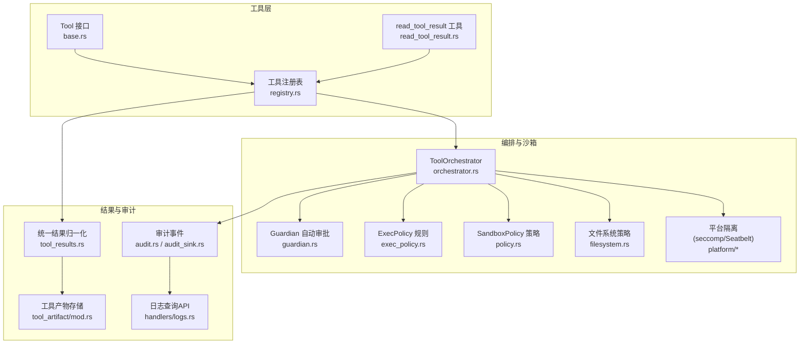
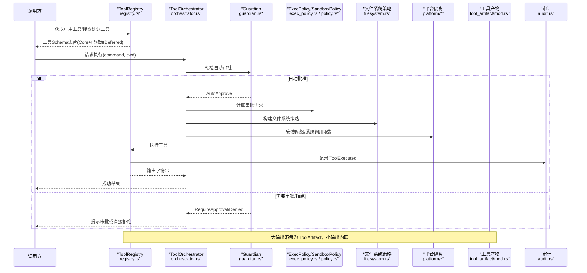
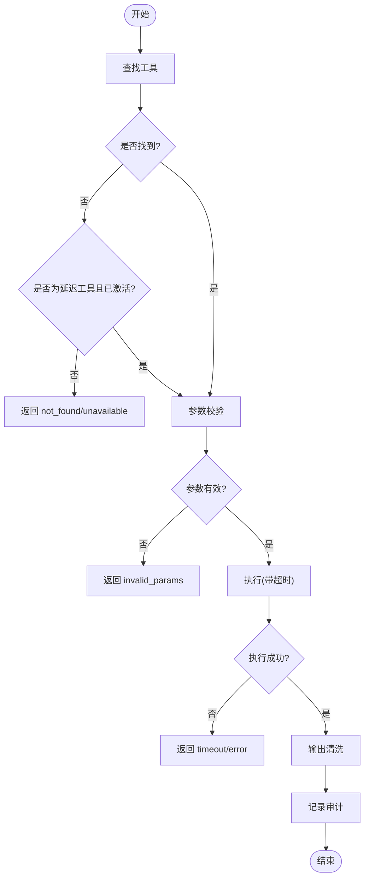
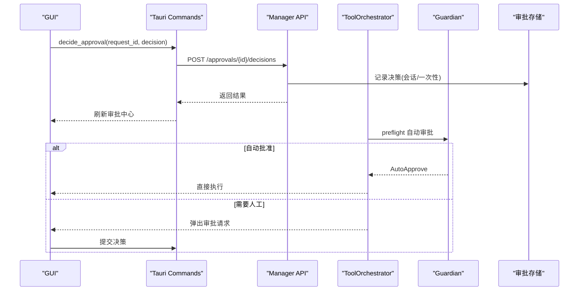
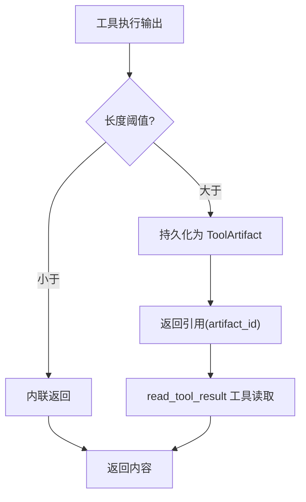
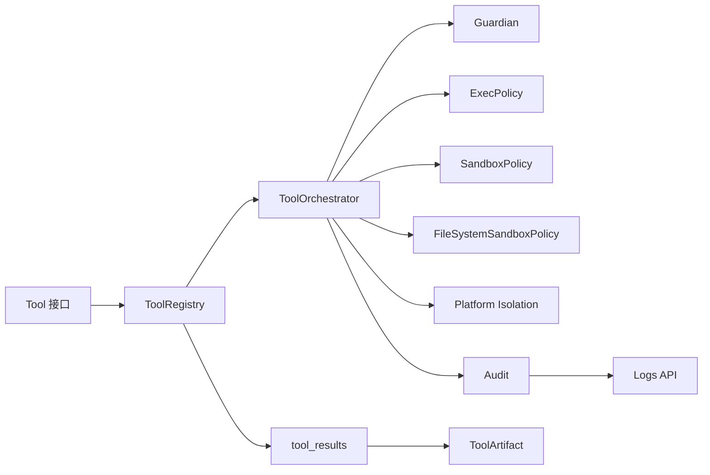

# 工具执行与安全沙箱

<cite>
**本文引用的文件**
- [agent-diva-tooling/src/registry.rs](file://agent-diva-tooling/src/registry.rs)
- [agent-diva-tooling/src/base.rs](file://agent-diva-tooling/src/base.rs)
- [agent-diva-tools/src/read_tool_result.rs](file://agent-diva-tools/src/read_tool_result.rs)
- [agent-diva-agent/src/tool_results.rs](file://agent-diva-agent/src/tool_results.rs)
- [agent-diva-core/src/tool_artifact/mod.rs](file://agent-diva-core/src/tool_artifact/mod.rs)
- [agent-diva-sandbox/src/lib.rs](file://agent-diva-sandbox/src/lib.rs)
- [agent-diva-sandbox/src/orchestrator.rs](file://agent-diva-sandbox/src/orchestrator.rs)
- [agent-diva-sandbox/src/guardian.rs](file://agent-diva-sandbox/src/guardian.rs)
- [agent-diva-sandbox/src/exec_policy.rs](file://agent-diva-sandbox/src/exec_policy.rs)
- [agent-diva-sandbox/src/policy.rs](file://agent-diva-sandbox/src/policy.rs)
- [agent-diva-sandbox/src/filesystem.rs](file://agent-diva-sandbox/src/filesystem.rs)
- [agent-diva-sandbox/src/platform/linux.rs](file://agent-diva-sandbox/src/platform/linux.rs)
- [agent-diva-sandbox/src/platform/macos.rs](file://agent-diva-sandbox/src/platform/macos.rs)
- [agent-diva-core/src/audit.rs](file://agent-diva-core/src/audit.rs)
- [agent-diva-core/src/audit_sink.rs](file://agent-diva-core/src/audit_sink.rs)
- [agent-diva-manager/src/handlers/logs.rs](file://agent-diva-manager/src/handlers/logs.rs)
- [agent-diva-gui/src/App.vue](file://agent-diva-gui/src/App.vue)
- [agent-diva-gui/src-tauri/src/commands.rs](file://agent-diva-gui/src-tauri/src/commands.rs)
</cite>

## 目录
1. [简介](#简介)
2. [项目结构](#项目结构)
3. [核心组件](#核心组件)
4. [架构总览](#架构总览)
5. [详细组件分析](#详细组件分析)
6. [依赖关系分析](#依赖关系分析)
7. [性能考量](#性能考量)
8. [故障排查指南](#故障排查指南)
9. [结论](#结论)
10. [附录](#附录)

## 简介
本文件面向“工具执行与安全沙箱”主题，系统性说明工具注册、发现与调用机制；安全沙箱的执行隔离（文件系统、命令执行、网络）；审批流程（人工与自动策略）；工具结果收集与返回；以及自定义工具开发、安全策略配置与审计日志分析。文档以仓库实际实现为依据，提供代码级图示与可追溯来源。

## 项目结构
围绕工具执行与安全沙箱的关键模块分布如下：
- 工具定义与注册：tooling（Tool 接口、ToolRegistry）、tools（具体工具实现）
- 执行编排与隔离：sandbox（Orchestrator、Guardian、ExecPolicy、平台隔离）
- 结果持久化与读取：core/tool_artifact、agent/tool_results、tools/read_tool_result
- 审批交互：GUI（App.vue、Tauri commands）、Manager API
- 审计与日志：core/audit、audit_sink、manager/logs



**图表来源**
- [agent-diva-tooling/src/base.rs:1-123](file://agent-diva-tooling/src/base.rs#L1-L123)
- [agent-diva-tooling/src/registry.rs:1-740](file://agent-diva-tooling/src/registry.rs#L1-L740)
- [agent-diva-tools/src/read_tool_result.rs:1-49](file://agent-diva-tools/src/read_tool_result.rs#L1-L49)
- [agent-diva-sandbox/src/orchestrator.rs:1-800](file://agent-diva-sandbox/src/orchestrator.rs#L1-L800)
- [agent-diva-sandbox/src/guardian.rs:1-800](file://agent-diva-sandbox/src/guardian.rs#L1-L800)
- [agent-diva-sandbox/src/exec_policy.rs:1-786](file://agent-diva-sandbox/src/exec_policy.rs#L1-L786)
- [agent-diva-sandbox/src/policy.rs:1-361](file://agent-diva-sandbox/src/policy.rs#L1-L361)
- [agent-diva-sandbox/src/filesystem.rs:1-500](file://agent-diva-sandbox/src/filesystem.rs#L1-L500)
- [agent-diva-core/src/tool_artifact/mod.rs:70-167](file://agent-diva-core/src/tool_artifact/mod.rs#L70-L167)
- [agent-diva-agent/src/tool_results.rs:1-52](file://agent-diva-agent/src/tool_results.rs#L1-L52)
- [agent-diva-core/src/audit.rs:1-465](file://agent-diva-core/src/audit.rs#L1-L465)
- [agent-diva-core/src/audit_sink.rs:121-200](file://agent-diva-core/src/audit_sink.rs#L121-L200)
- [agent-diva-manager/src/handlers/logs.rs:1-118](file://agent-diva-manager/src/handlers/logs.rs#L1-L118)

**章节来源**
- [agent-diva-tooling/src/base.rs:1-123](file://agent-diva-tooling/src/base.rs#L1-L123)
- [agent-diva-tooling/src/registry.rs:1-740](file://agent-diva-tooling/src/registry.rs#L1-L740)
- [agent-diva-sandbox/src/lib.rs:1-116](file://agent-diva-sandbox/src/lib.rs#L1-L116)

## 核心组件
- 工具接口与错误模型：Tool trait 定义了 name/description/parameters/execute/timeout_secs/validate_params/to_schema，并统一错误类型与分类。
- 工具注册表：ToolRegistry 维护 Core/Deferred 两类 schema 分区，支持延迟激活、搜索排序、超时控制、参数校验、输出清洗与审计。
- 执行编排：ToolOrchestrator 串联“预检(Guardian)→审批(ExecPolicy/AskForApproval)→选择沙箱→执行→失败重试/升级”。
- 自动审批：Guardian 基于 ExecPolicy 与默认规则进行自动批准/拒绝/要求审批/延后决策，并提供拒绝对策熔断器。
- 策略与隔离：SandboxPolicy/FileSystemSandboxPolicy 控制读写、网络访问；平台侧通过 seccomp/Seatbelt 等实现系统调用限制。
- 结果与产物：工具输出经 sanitize 后进入 canonicalize_tool_result，按阈值内联或落盘为 ToolArtifact，并通过 read_tool_result 工具安全读取。
- 审计与日志：所有关键动作通过 audit::emit 写入结构化 JSON Lines，并由 Manager 暴露 /api/logs 查询。

**章节来源**
- [agent-diva-tooling/src/base.rs:1-123](file://agent-diva-tooling/src/base.rs#L1-L123)
- [agent-diva-tooling/src/registry.rs:1-740](file://agent-diva-tooling/src/registry.rs#L1-L740)
- [agent-diva-sandbox/src/orchestrator.rs:1-800](file://agent-diva-sandbox/src/orchestrator.rs#L1-L800)
- [agent-diva-sandbox/src/guardian.rs:1-800](file://agent-diva-sandbox/src/guardian.rs#L1-L800)
- [agent-diva-sandbox/src/policy.rs:1-361](file://agent-diva-sandbox/src/policy.rs#L1-L361)
- [agent-diva-sandbox/src/filesystem.rs:1-500](file://agent-diva-sandbox/src/filesystem.rs#L1-L500)
- [agent-diva-core/src/tool_artifact/mod.rs:70-167](file://agent-diva-core/src/tool_artifact/mod.rs#L70-L167)
- [agent-diva-agent/src/tool_results.rs:1-52](file://agent-diva-agent/src/tool_results.rs#L1-L52)
- [agent-diva-core/src/audit.rs:1-465](file://agent-diva-core/src/audit.rs#L1-L465)
- [agent-diva-core/src/audit_sink.rs:121-200](file://agent-diva-core/src/audit_sink.rs#L121-L200)

## 架构总览
下图展示一次工具调用的端到端流程：从注册表查找与延迟激活，到编排器的审批与沙箱执行，再到结果归一化与审计记录。



**图表来源**
- [agent-diva-tooling/src/registry.rs:362-740](file://agent-diva-tooling/src/registry.rs#L362-L740)
- [agent-diva-sandbox/src/orchestrator.rs:399-577](file://agent-diva-sandbox/src/orchestrator.rs#L399-L577)
- [agent-diva-sandbox/src/guardian.rs:375-472](file://agent-diva-sandbox/src/guardian.rs#L375-L472)
- [agent-diva-sandbox/src/exec_policy.rs:270-324](file://agent-diva-sandbox/src/exec_policy.rs#L270-L324)
- [agent-diva-sandbox/src/policy.rs:64-109](file://agent-diva-sandbox/src/policy.rs#L64-L109)
- [agent-diva-sandbox/src/filesystem.rs:19-94](file://agent-diva-sandbox/src/filesystem.rs#L19-L94)
- [agent-diva-core/src/tool_artifact/mod.rs:70-167](file://agent-diva-core/src/tool_artifact/mod.rs#L70-L167)
- [agent-diva-core/src/audit.rs:210-216](file://agent-diva-core/src/audit.rs#L210-L216)

## 详细组件分析

### 工具注册、发现与生命周期（ToolRegistry）
- 注册与分区：工具可通过 register/register_in_partition 注册为核心或延迟（Deferred）工具。核心工具始终可见；延迟工具需通过 tool_search 激活，最多保留固定数量活跃项。
- 延迟激活：ActiveDeferredTools 维护任务局部激活集，search 会基于名称/描述/schema 关键词打分并替换激活列表，保证 provider tools 数组稳定前缀。
- 执行路径：execute_structured 负责参数校验、超时控制、输出清洗、审计记录；未激活的延迟工具将返回不可用错误。
- 生命周期：unregister 同时清理目录条目与激活状态；同一 turn 重建时可恢复激活快照。



**图表来源**
- [agent-diva-tooling/src/registry.rs:452-740](file://agent-diva-tooling/src/registry.rs#L452-L740)

**章节来源**
- [agent-diva-tooling/src/registry.rs:1-740](file://agent-diva-tooling/src/registry.rs#L1-L740)
- [agent-diva-tooling/src/base.rs:1-123](file://agent-diva-tooling/src/base.rs#L1-L123)

### 安全沙箱执行环境隔离
- 策略体系：SandboxPolicy 支持危险全开、只读、工作区写、外部容器模式；可映射到 core SecurityPolicy。
- 文件系统：FileSystemSandboxPolicy 支持受限/无限制/外部沙箱三种模式，通过 entries 精确控制读写；WritableRoot 提供工作区白名单与受保护子路径。
- 网络隔离：Linux 通过 seccomp 过滤器限制网络系统调用；macOS 通过 Seatbelt 策略 deny/allow network*。
- 环境变量开关：可通过环境变量禁用沙箱（仅用于调试）。

```mermaid
classDiagram
class SandboxPolicy {
+DangerFullAccess
+ReadOnly{access,network_access}
+WorkspaceWrite{writable_roots,read_only_access,network_access,exclude_tmpdir_env_var}
+ExternalSandbox{network_access}
+to_security_policy(workspace_dir) SecurityPolicy
}
class FileSystemSandboxPolicy {
+kind
+entries
+can_read_path(path) bool
+can_write_path(path) bool
}
class WritableRoot {
+root
+read_only_subpaths
+is_path_writable(path) bool
}
SandboxPolicy --> FileSystemSandboxPolicy : "组合使用"
FileSystemSandboxPolicy --> WritableRoot : "配合白名单"
```

**图表来源**
- [agent-diva-sandbox/src/policy.rs:9-109](file://agent-diva-sandbox/src/policy.rs#L9-L109)
- [agent-diva-sandbox/src/filesystem.rs:9-94](file://agent-diva-sandbox/src/filesystem.rs#L9-L94)
- [agent-diva-sandbox/src/filesystem.rs:240-306](file://agent-diva-sandbox/src/filesystem.rs#L240-L306)

**章节来源**
- [agent-diva-sandbox/src/policy.rs:1-361](file://agent-diva-sandbox/src/policy.rs#L1-L361)
- [agent-diva-sandbox/src/filesystem.rs:1-500](file://agent-diva-sandbox/src/filesystem.rs#L1-L500)
- [agent-diva-sandbox/src/platform/linux.rs:947-985](file://agent-diva-sandbox/src/platform/linux.rs#L947-L985)
- [agent-diva-sandbox/src/platform/macos.rs:40-83](file://agent-diva-sandbox/src/platform/macos.rs#L40-L83)
- [agent-diva-sandbox/src/lib.rs:107-116](file://agent-diva-sandbox/src/lib.rs#L107-L116)

### 审批流程（人工与自动）
- 自动审批（Guardian）：根据 ExecPolicy 规则、命令特征（只读/危险/已知安全）与 AskForApproval 策略，给出 AutoApprove/RequireApproval/Denied/Defer。支持学习生成 Allow 规则与熔断器。
- 人工审批：GUI 通过 Tauri 命令调用后端 /approvals/{id}/decisions 提交决策；Manager 处理并缓存会话级/一次性授权。
- 编排集成：ToolOrchestrator.run 先预检 Guardian，再解析审批需求，选择沙箱执行；失败时依据策略决定是否重试/升级权限。



**图表来源**
- [agent-diva-gui/src/App.vue:534-568](file://agent-diva-gui/src/App.vue#L534-L568)
- [agent-diva-gui/src-tauri/src/commands.rs:3307-3343](file://agent-diva-gui/src-tauri/src/commands.rs#L3307-L3343)
- [agent-diva-sandbox/src/orchestrator.rs:432-514](file://agent-diva-sandbox/src/orchestrator.rs#L432-L514)
- [agent-diva-sandbox/src/guardian.rs:375-472](file://agent-diva-sandbox/src/guardian.rs#L375-L472)

**章节来源**
- [agent-diva-sandbox/src/guardian.rs:1-800](file://agent-diva-sandbox/src/guardian.rs#L1-L800)
- [agent-diva-sandbox/src/exec_policy.rs:270-324](file://agent-diva-sandbox/src/exec_policy.rs#L270-L324)
- [agent-diva-gui/src/App.vue:534-568](file://agent-diva-gui/src/App.vue#L534-L568)
- [agent-diva-gui/src-tauri/src/commands.rs:3307-3343](file://agent-diva-gui/src-tauri/src/commands.rs#L3307-L3343)

### 工具结果的收集与返回
- 归一化：canonicalize_tool_result 根据大小阈值决定内联或落盘为 ToolArtifact；包含字符/字节计数、状态、错误码等元信息。
- 读取：read_tool_result 工具通过安全上下文与最大读取限制，按 artifact_id 分段读取产物，避免大响应阻塞。
- 安全：输出在进入 registry 前被 sanitize，异常路径也会产出标准化错误结构。



**图表来源**
- [agent-diva-agent/src/tool_results.rs:20-52](file://agent-diva-agent/src/tool_results.rs#L20-L52)
- [agent-diva-core/src/tool_artifact/mod.rs:70-167](file://agent-diva-core/src/tool_artifact/mod.rs#L70-L167)
- [agent-diva-tools/src/read_tool_result.rs:1-49](file://agent-diva-tools/src/read_tool_result.rs#L1-L49)
- [agent-diva-tooling/src/registry.rs:534-699](file://agent-diva-tooling/src/registry.rs#L534-L699)

**章节来源**
- [agent-diva-agent/src/tool_results.rs:1-52](file://agent-diva-agent/src/tool_results.rs#L1-L52)
- [agent-diva-core/src/tool_artifact/mod.rs:70-167](file://agent-diva-core/src/tool_artifact/mod.rs#L70-L167)
- [agent-diva-tools/src/read_tool_result.rs:1-49](file://agent-diva-tools/src/read_tool_result.rs#L1-L49)
- [agent-diva-tooling/src/registry.rs:534-699](file://agent-diva-tooling/src/registry.rs#L534-L699)

### 自定义工具开发指南
- 接口定义：实现 Tool trait，提供 name/description/parameters/execute；可选覆盖 timeout_secs 与 validate_params。
- 注册方式：通过 ToolRegistry.register 或 register_in_partition 注册为核心或延迟工具；延迟工具需在 search_deferred 中暴露以便激活。
- 权限与策略：结合 SandboxPolicy/FileSystemSandboxPolicy 控制执行环境；必要时在 ExecPolicy 中添加 Allow/Prompt/Forbidden 规则。
- 测试方法：单元测试验证参数校验、超时、错误分支；集成测试覆盖审批流与沙箱行为；利用审计事件断言关键路径。

**章节来源**
- [agent-diva-tooling/src/base.rs:1-123](file://agent-diva-tooling/src/base.rs#L1-L123)
- [agent-diva-tooling/src/registry.rs:452-532](file://agent-diva-tooling/src/registry.rs#L452-L532)
- [agent-diva-sandbox/src/exec_policy.rs:270-324](file://agent-diva-sandbox/src/exec_policy.rs#L270-L324)
- [agent-diva-sandbox/src/policy.rs:9-109](file://agent-diva-sandbox/src/policy.rs#L9-L109)

### 安全策略配置与审计日志分析
- 安全级别：SecurityLevel 提供 Permissive/Standard/Strict/Paranoid 预设，影响 workspace_only、read_only、速率限制等。
- 沙箱策略：SandboxPolicy 与 AskForApproval 共同决定执行范围与审批时机；可映射到 core SecurityPolicy。
- 审计：audit::emit 统一输出结构化事件；JsonlAuditSink 按日滚动写入 JSON Lines；Manager 提供 /api/logs 分页查询。

**章节来源**
- [agent-diva-core/src/security/config.rs:1-50](file://agent-diva-core/src/security/config.rs#L1-L50)
- [agent-diva-sandbox/src/policy.rs:194-228](file://agent-diva-sandbox/src/policy.rs#L194-L228)
- [agent-diva-core/src/audit.rs:224-253](file://agent-diva-core/src/audit.rs#L224-L253)
- [agent-diva-core/src/audit_sink.rs:145-200](file://agent-diva-core/src/audit_sink.rs#L145-L200)
- [agent-diva-manager/src/handlers/logs.rs:1-118](file://agent-diva-manager/src/handlers/logs.rs#L1-L118)

## 依赖关系分析
- 松耦合：ToolRegistry 仅依赖 Tool 接口；Orchestrator 通过策略与管理器抽象解耦平台细节。
- 关键依赖链：
  - Tool → Registry → Orchestrator → Guardian/ExecPolicy → SandboxManager → Platform
  - Registry → ToolResults → ToolArtifact
  - Orchestrator → Audit → LogsAPI
- 潜在循环：当前未见循环依赖；各模块职责清晰。



**图表来源**
- [agent-diva-tooling/src/base.rs:1-123](file://agent-diva-tooling/src/base.rs#L1-L123)
- [agent-diva-tooling/src/registry.rs:362-740](file://agent-diva-tooling/src/registry.rs#L362-L740)
- [agent-diva-sandbox/src/orchestrator.rs:261-398](file://agent-diva-sandbox/src/orchestrator.rs#L261-L398)
- [agent-diva-core/src/tool_artifact/mod.rs:70-167](file://agent-diva-core/src/tool_artifact/mod.rs#L70-L167)
- [agent-diva-core/src/audit.rs:224-253](file://agent-diva-core/src/audit.rs#L224-L253)

**章节来源**
- [agent-diva-tooling/src/registry.rs:362-740](file://agent-diva-tooling/src/registry.rs#L362-L740)
- [agent-diva-sandbox/src/orchestrator.rs:261-398](file://agent-diva-sandbox/src/orchestrator.rs#L261-L398)

## 性能考量
- 工具 Schema 稳定性：Core/Deferred 分区确保 provider tools 数组前缀稳定，减少缓存失效。
- 延迟激活上限：active deferred tools 有上限，避免过多工具膨胀。
- 超时控制：全局与工具级超时，防止长耗时阻塞。
- 输出裁剪：大输出落盘，避免消息体过大；读取工具支持范围读取。
- 审计开销：audit::emit 设计为低开销，失败不中断业务。

[本节为通用指导，无需特定文件来源]

## 故障排查指南
- 工具未找到或未激活：检查 ToolRegistry.get/has 与 active deferred 状态；确认 search_deferred 是否返回目标工具。
- 参数校验失败：查看 ToolError.InvalidParams 与审计中的 invalid_params 事件。
- 执行超时：关注 ToolError.Timeout 与审计中的 timeout 事件；调整工具或全局超时。
- 沙箱拒绝：根据 SandboxError 类型判断是否需提升权限或调整 SandboxPolicy/AskForApproval；必要时走人工审批。
- 网络受限：Linux 检查 seccomp 过滤器安装；macOS 检查 Seatbelt 策略；必要时调整 NetworkAccess。
- 审计缺失：确认 audit sink 已注册；检查 /api/logs 是否能拉取到对应事件。

**章节来源**
- [agent-diva-tooling/src/registry.rs:534-699](file://agent-diva-tooling/src/registry.rs#L534-L699)
- [agent-diva-sandbox/src/orchestrator.rs:579-751](file://agent-diva-sandbox/src/orchestrator.rs#L579-L751)
- [agent-diva-sandbox/src/platform/linux.rs:947-985](file://agent-diva-sandbox/src/platform/linux.rs#L947-L985)
- [agent-diva-sandbox/src/platform/macos.rs:40-83](file://agent-diva-sandbox/src/platform/macos.rs#L40-L83)
- [agent-diva-core/src/audit.rs:224-253](file://agent-diva-core/src/audit.rs#L224-L253)
- [agent-diva-manager/src/handlers/logs.rs:1-118](file://agent-diva-manager/src/handlers/logs.rs#L1-L118)

## 结论
该实现通过清晰的工具分层、严格的沙箱隔离、灵活的审批策略与完善的审计链路，构建了安全可控的工具执行环境。开发者可按接口规范扩展工具，借助 ExecPolicy/Guardian 与 SandboxPolicy 精细控制风险；运维侧可通过审计日志与 API 监控执行健康度。

[本节为总结性内容，无需特定文件来源]

## 附录
- 常用配置建议：
  - 生产环境默认使用 WorkspaceWrite + OnFailure 审批，开启 Guardian 智能模式。
  - 对敏感操作启用 Forbidden 规则；对只读场景启用 ReadOnly。
  - 网络默认关闭，按需放开。
- 最佳实践：
  - 工具输出尽量结构化，便于审计与下游消费。
  - 延迟工具仅在必要时激活，保持工具列表精简。
  - 定期审查 ExecPolicy 规则与审计日志，收敛风险面。

[本节为补充建议，无需特定文件来源]