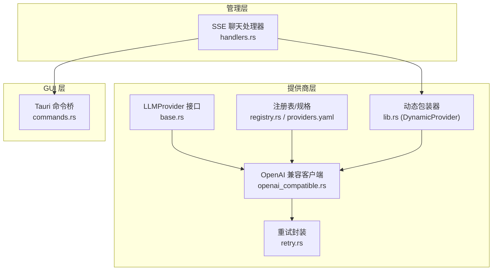
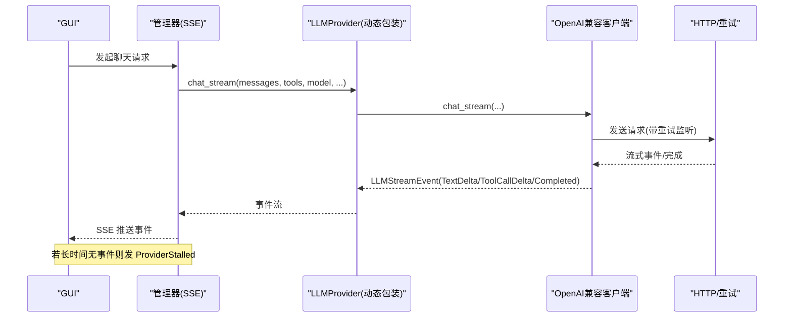
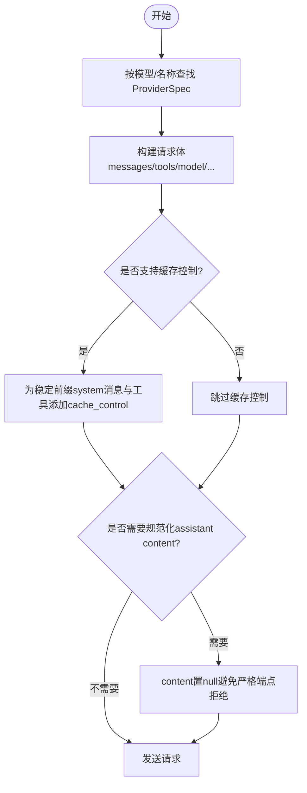
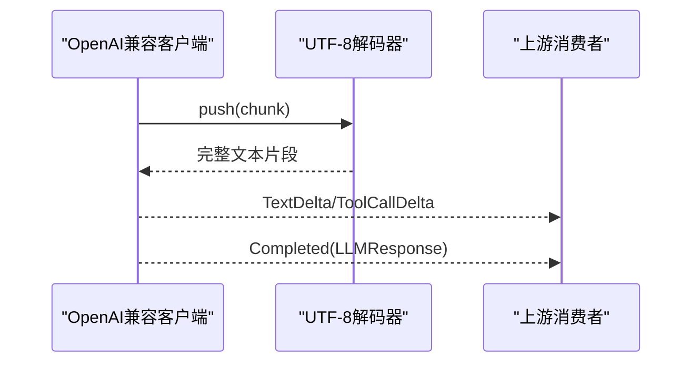
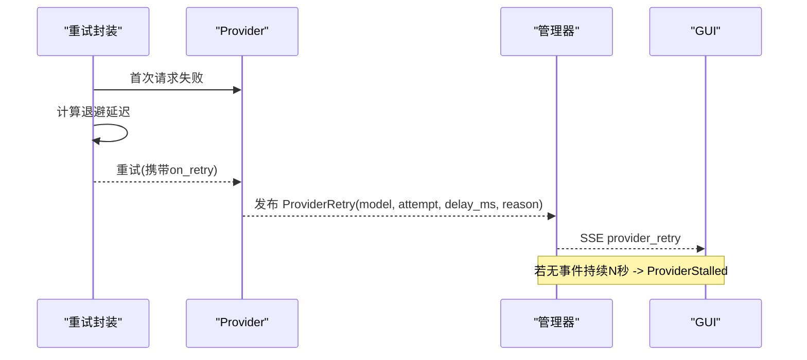
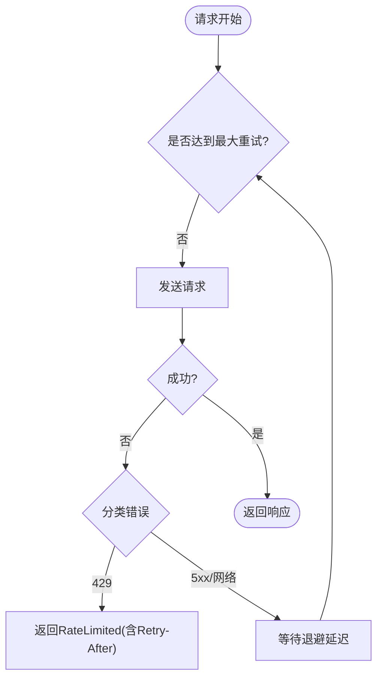
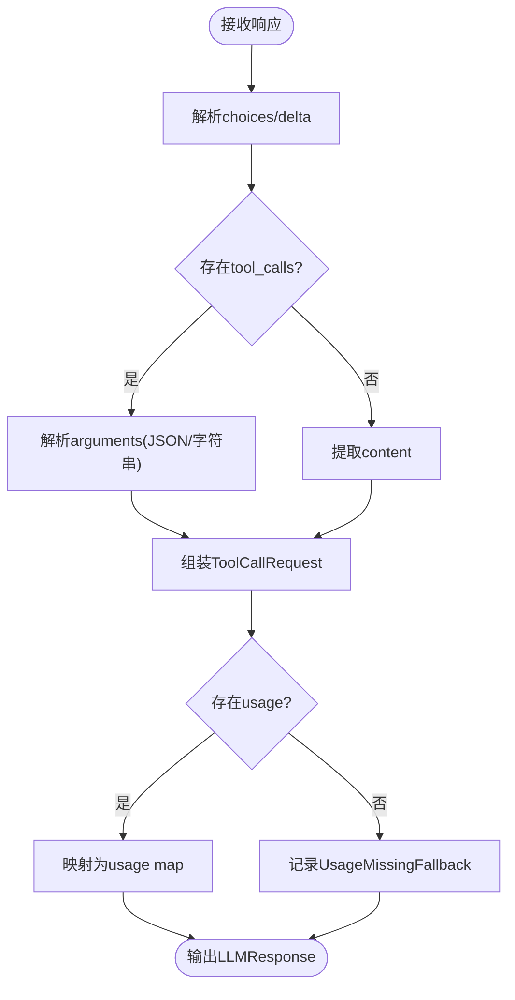
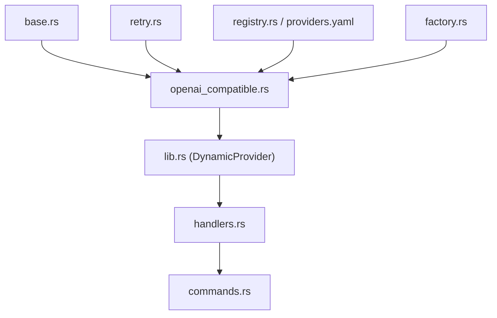

# 提供商执行与响应处理

<cite>
**本文引用的文件**
- [lib.rs](file://agent-diva-providers/src/lib.rs)
- [base.rs](file://agent-diva-providers/src/base.rs)
- [retry.rs](file://agent-diva-providers/src/retry.rs)
- [factory.rs](file://agent-diva-providers/src/factory.rs)
- [registry.rs](file://agent-diva-providers/src/registry.rs)
- [providers.yaml](file://agent-diva-providers/src/providers.yaml)
- [openai_compatible.rs](file://agent-diva-providers/src/openai_compatible.rs)
- [events.rs](file://agent-diva-core/src/bus/events.rs)
- [handlers.rs](file://agent-diva-manager/src/handlers.rs)
- [commands.rs](file://agent-diva-gui/src-tauri/src/commands.rs)
- [token_stats.ts](file://agent-diva-gui/src/api/tokenStats.ts)
</cite>

## 目录
1. [简介](#简介)
2. [项目结构](#项目结构)
3. [核心组件](#核心组件)
4. [架构总览](#架构总览)
5. [详细组件分析](#详细组件分析)
6. [依赖关系分析](#依赖关系分析)
7. [性能考量](#性能考量)
8. [故障排查指南](#故障排查指南)
9. [结论](#结论)
10. [附录](#附录)

## 简介
本文件聚焦于 LLM 提供商的执行与响应处理，覆盖以下关键主题：
- Provider 选择机制与请求构建
- 流式响应处理（文本增量、工具调用增量、完成事件）
- ProviderRetry 与 ProviderStalled 事件的处理逻辑
- 重试策略与超时处理
- 响应数据解析与格式化（文本提取、工具调用参数解析）
- Token 使用统计与计费信息收集
- 多提供商配置示例与故障切换策略
- 性能监控与错误诊断方法

## 项目结构
提供商子系统位于 agent-diva-providers 包中，提供统一的 LLMProvider 抽象、具体实现（OpenAI 兼容、Anthropic 等）、重试与发现能力；上层通过工厂与注册表进行实例化与路由；管理器负责 SSE 事件转发与停滞检测；GUI 层消费事件并展示状态。

图表来源
- [base.rs:708-780](file://agent-diva-providers/src/base.rs#L708-L780)
- [openai_compatible.rs:168-184](file://agent-diva-providers/src/openai_compatible.rs#L168-L184)
- [retry.rs:17-181](file://agent-diva-providers/src/retry.rs#L17-L181)
- [registry.rs:73-108](file://agent-diva-providers/src/registry.rs#L73-L108)
- [providers.yaml:1-120](file://agent-diva-providers/src/providers.yaml#L1-L120)
- [lib.rs:46-123](file://agent-diva-providers/src/lib.rs#L46-L123)
- [handlers.rs:137-200](file://agent-diva-manager/src/handlers.rs#L137-L200)
- [commands.rs:2922-2934](file://agent-diva-gui/src-tauri/src/commands.rs#L2922-L2934)

章节来源
- [base.rs:708-780](file://agent-diva-providers/src/base.rs#L708-L780)
- [openai_compatible.rs:168-184](file://agent-diva-providers/src/openai_compatible.rs#L168-L184)
- [retry.rs:17-181](file://agent-diva-providers/src/retry.rs#L17-L181)
- [registry.rs:73-108](file://agent-diva-providers/src/registry.rs#L73-L108)
- [providers.yaml:1-120](file://agent-diva-providers/src/providers.yaml#L1-L120)
- [lib.rs:46-123](file://agent-diva-providers/src/lib.rs#L46-L123)
- [handlers.rs:137-200](file://agent-diva-manager/src/handlers.rs#L137-L200)
- [commands.rs:2922-2934](file://agent-diva-gui/src-tauri/src/commands.rs#L2922-L2934)

## 核心组件
- LLMProvider 接口：定义 chat/chat_stream、默认模型、上下文传输策略、提示缓存策略、重试监听器注入等能力。
- OpenAiCompatibleClient：实现 OpenAI 兼容协议的请求构建、流式解析、工具调用参数解析、Token 用量映射。
- Retry 封装：指数退避 + 抖动，支持 429 限流、5xx 重试、网络异常重试，并提供每次重试的回调。
- 注册表与规格：集中管理提供商元数据、默认基地址、模型列表与覆盖参数。
- 动态包装器：允许运行时热替换底层 Provider 实现。
- 事件总线：ProviderRetry/ProviderStalled 等事件在管理器层广播，GUI 消费并展示。

章节来源
- [base.rs:708-780](file://agent-diva-providers/src/base.rs#L708-L780)
- [openai_compatible.rs:214-249](file://agent-diva-providers/src/openai_compatible.rs#L214-L249)
- [retry.rs:17-181](file://agent-diva-providers/src/retry.rs#L17-L181)
- [registry.rs:73-108](file://agent-diva-providers/src/registry.rs#L73-L108)
- [lib.rs:46-123](file://agent-diva-providers/src/lib.rs#L46-L123)
- [events.rs:121-134](file://agent-diva-core/src/bus/events.rs#L121-L134)

## 架构总览
下图展示了从管理器发起聊天到提供商返回流式事件的完整链路，包括重试与停滞检测。

图表来源
- [handlers.rs:137-200](file://agent-diva-manager/src/handlers.rs#L137-L200)
- [lib.rs:72-102](file://agent-diva-providers/src/lib.rs#L72-L102)
- [openai_compatible.rs:214-249](file://agent-diva-providers/src/openai_compatible.rs#L214-L249)
- [retry.rs:94-181](file://agent-diva-providers/src/retry.rs#L94-L181)
- [events.rs:121-134](file://agent-diva-core/src/bus/events.rs#L121-L134)

## 详细组件分析

### Provider 选择与请求构建
- 选择机制：通过注册表按模型关键词匹配或名称查找 ProviderSpec，结合 API 类型（OpenAI/Anthropic）由工厂构建具体客户端。
- 请求构建：OpenAI 兼容客户端将消息、工具、工具选择模式、模型、最大 token、温度等序列化为标准请求体；对系统消息与工具应用缓存控制标记；必要时规范化 assistant 的 content。
- 动态上下文传输：根据 provider 能力决定历史后上下文以 system 或 user envelope 形式发送。

图表来源
- [registry.rs:91-108](file://agent-diva-providers/src/registry.rs#L91-L108)
- [factory.rs:23-70](file://agent-diva-providers/src/factory.rs#L23-L70)
- [openai_compatible.rs:378-446](file://agent-diva-providers/src/openai_compatible.rs#L378-L446)

章节来源
- [registry.rs:91-108](file://agent-diva-providers/src/registry.rs#L91-L108)
- [factory.rs:23-70](file://agent-diva-providers/src/factory.rs#L23-L70)
- [openai_compatible.rs:378-446](file://agent-diva-providers/src/openai_compatible.rs#L378-L446)

### 流式响应处理
- 事件类型：TextDelta（文本增量）、ReasoningDelta（推理内容增量）、ToolCallDelta（工具调用增量）、Completed（最终响应）。
- UTF-8 安全解码：StreamingUtf8Decoder 保证跨 HTTP chunk 的完整字符边界。
- 工具调用增量：维护 PartialToolCall，逐步拼装 id/name/arguments，并在 Completed 时输出 ToolCallRequest。
- 默认回退：未实现 chat_stream 的 provider 会回退到非流式 chat，再转换为一次 TextDelta + Completed。

图表来源
- [base.rs:82-129](file://agent-diva-providers/src/base.rs#L82-L129)
- [base.rs:409-425](file://agent-diva-providers/src/base.rs#L409-L425)
- [openai_compatible.rs:214-249](file://agent-diva-providers/src/openai_compatible.rs#L214-L249)

章节来源
- [base.rs:82-129](file://agent-diva-providers/src/base.rs#L82-L129)
- [base.rs:409-425](file://agent-diva-providers/src/base.rs#L409-L425)
- [openai_compatible.rs:214-249](file://agent-diva-providers/src/openai_compatible.rs#L214-L249)

### ProviderRetry 与 ProviderStalled 事件
- ProviderRetry：当底层 HTTP 请求触发重试时，通过 RetryListener 上报每次重试的模型、尝试次数、最大重试数、延迟与原因；管理器将其转为 AgentEvent::ProviderRetry 并通过 SSE 推送。
- ProviderStalled：管理器在转发循环中若超过固定时长（如 60s）未收到任何事件，则发出 ProviderStalled 作为“仍在等待”的非终止提示；若继续无事件则断开并返回错误。

图表来源
- [retry.rs:94-181](file://agent-diva-providers/src/retry.rs#L94-L181)
- [events.rs:121-134](file://agent-diva-core/src/bus/events.rs#L121-L134)
- [handlers.rs:137-200](file://agent-diva-manager/src/handlers.rs#L137-L200)
- [commands.rs:2922-2934](file://agent-diva-gui/src-tauri/src/commands.rs#L2922-L2934)

章节来源
- [retry.rs:94-181](file://agent-diva-providers/src/retry.rs#L94-L181)
- [events.rs:121-134](file://agent-diva-core/src/bus/events.rs#L121-L134)
- [handlers.rs:137-200](file://agent-diva-manager/src/handlers.rs#L137-L200)
- [commands.rs:2922-2934](file://agent-diva-gui/src-tauri/src/commands.rs#L2922-L2934)

### 重试策略与超时处理
- 指数退避 + 抖动：基础延迟 1s，按尝试次数翻倍，加入随机抖动避免雪崩。
- 可重试条件：网络错误、HTTP 5xx；429 不重试，直接返回 RateLimited（可携带 Retry-After）。
- 监听器：每次重试前调用 on_retry，便于前端显示“重试中(n/m)”等状态。
- 超时：HTTP 客户端设置连接/读取超时（例如 300s），防止长连接挂起。

图表来源
- [retry.rs:17-181](file://agent-diva-providers/src/retry.rs#L17-L181)
- [openai_compatible.rs:327-341](file://agent-diva-providers/src/openai_compatible.rs#L327-L341)

章节来源
- [retry.rs:17-181](file://agent-diva-providers/src/retry.rs#L17-L181)
- [openai_compatible.rs:327-341](file://agent-diva-providers/src/openai_compatible.rs#L327-L341)

### 响应数据解析与格式化
- 文本内容：从流式 delta 或最终 response 中提取 content。
- 工具调用参数：优先解析 JSON 对象；若为字符串则尝试二次解析；失败时保留 raw 字段以便诊断。
- 完成事件：包含 finish_reason、usage（prompt/completion/total 及可选 cache 相关 tokens）、reasoning_content。
- 缺失 usage：记录审计事件并返回空 map，避免阻断流程。

图表来源
- [openai_compatible.rs:448-500](file://agent-diva-providers/src/openai_compatible.rs#L448-L500)
- [openai_compatible.rs:214-249](file://agent-diva-providers/src/openai_compatible.rs#L214-L249)
- [base.rs:384-425](file://agent-diva-providers/src/base.rs#L384-L425)

章节来源
- [openai_compatible.rs:448-500](file://agent-diva-providers/src/openai_compatible.rs#L448-L500)
- [openai_compatible.rs:214-249](file://agent-diva-providers/src/openai_compatible.rs#L214-L249)
- [base.rs:384-425](file://agent-diva-providers/src/base.rs#L384-L425)

### Token 使用统计与计费信息
- 采集位置：OpenAI 兼容客户端将 usage 映射为标准键值（prompt_tokens、completion_tokens、total_tokens、可选 cache 相关 tokens）。
- 聚合与查询：管理器暴露统计接口，支持按 endpoint/model/session/channel 分组、时间线、实时内存统计等。
- 前端展示：GUI 提供获取总量、摘要、时间线、会话详情、模型分布等 API，以及计数与费用格式化。

图表来源
- [openai_compatible.rs:214-249](file://agent-diva-providers/src/openai_compatible.rs#L214-L249)
- [token_stats.ts:67-135](file://agent-diva-gui/src/api/tokenStats.ts#L67-L135)

章节来源
- [openai_compatible.rs:214-249](file://agent-diva-providers/src/openai_compatible.rs#L214-L249)
- [token_stats.ts:67-135](file://agent-diva-gui/src/api/tokenStats.ts#L67-L135)

### 多提供商配置与故障切换
- 配置来源：providers.yaml 集中声明各提供商的 api_type、默认基地址、默认模型、模型列表与覆盖参数。
- 动态切换：DynamicProvider 可在运行时更新底层实现，用于故障切换或灰度。
- 建议策略：
  - 主备提供商：同一模型在不同提供商下配置多个入口，失败时自动切换到备用。
  - 降级策略：当某提供商限流或不可用时，降级到更慢但稳定的模型或提供商。
  - 本地兜底：配置 local/custom 提供商作为离线兜底。

章节来源
- [providers.yaml:1-120](file://agent-diva-providers/src/providers.yaml#L1-L120)
- [lib.rs:46-123](file://agent-diva-providers/src/lib.rs#L46-L123)

## 依赖关系分析
- base.rs 定义统一接口与数据类型，被 openai_compatible.rs、anthropic 等实现引用。
- retry.rs 被 openai_compatible.rs 等实现用于 HTTP 重试。
- registry.rs 与 providers.yaml 提供元数据驱动的配置与模型覆盖。
- factory.rs 根据 spec 与 access 构造具体 Provider，并包裹 ProviderTap 以支持监听与缓存监听。
- manager handlers.rs 负责 SSE 转发与停滞检测，向 GUI 推送事件。
- GUI commands.rs 过滤后台流中的 provider 状态事件，避免干扰。

图表来源
- [base.rs:708-780](file://agent-diva-providers/src/base.rs#L708-L780)
- [openai_compatible.rs:168-184](file://agent-diva-providers/src/openai_compatible.rs#L168-L184)
- [retry.rs:94-181](file://agent-diva-providers/src/retry.rs#L94-L181)
- [registry.rs:73-108](file://agent-diva-providers/src/registry.rs#L73-L108)
- [factory.rs:23-70](file://agent-diva-providers/src/factory.rs#L23-L70)
- [lib.rs:46-123](file://agent-diva-providers/src/lib.rs#L46-L123)
- [handlers.rs:137-200](file://agent-diva-manager/src/handlers.rs#L137-L200)
- [commands.rs:2922-2934](file://agent-diva-gui/src-tauri/src/commands.rs#L2922-L2934)

章节来源
- [base.rs:708-780](file://agent-diva-providers/src/base.rs#L708-L780)
- [openai_compatible.rs:168-184](file://agent-diva-providers/src/openai_compatible.rs#L168-L184)
- [retry.rs:94-181](file://agent-diva-providers/src/retry.rs#L94-L181)
- [registry.rs:73-108](file://agent-diva-providers/src/registry.rs#L73-L108)
- [factory.rs:23-70](file://agent-diva-providers/src/factory.rs#L23-L70)
- [lib.rs:46-123](file://agent-diva-providers/src/lib.rs#L46-L123)
- [handlers.rs:137-200](file://agent-diva-manager/src/handlers.rs#L137-L200)
- [commands.rs:2922-2934](file://agent-diva-gui/src-tauri/src/commands.rs#L2922-L2934)

## 性能考量
- 流式处理：优先使用 chat_stream 降低首字节延迟；UTF-8 解码器避免重复拷贝与乱码。
- 重试优化：指数退避 + 抖动减少拥塞；429 立即失败避免无效重试。
- 缓存控制：对稳定前缀 system 消息与工具启用 ephemeral 缓存，提升吞吐。
- 超时保护：合理设置 HTTP 超时，避免长尾请求占用资源。
- 统计开销：usage 缺失时仅记录审计事件，避免阻塞主路径。

## 故障排查指南
- 常见问题定位：
  - 429 限流：检查 Retry-After 头与重试间隔；考虑降级模型或提供商。
  - 5xx 服务器错误：观察重试次数与延迟；确认服务端健康。
  - 工具调用参数解析失败：查看日志中的 problematic characters 与 raw 字段，修正上游生成逻辑。
  - 流式卡顿：关注 ProviderStalled 事件；检查网络与服务端响应。
- 诊断手段：
  - 启用重试监听器，观察每次重试的 attempt、delay_ms、reason。
  - 使用管理器 SSE 事件与 GUI 状态反馈，快速识别停滞与失败。
  - 通过 token 统计接口验证 usage 完整性与成本估算。

章节来源
- [retry.rs:94-181](file://agent-diva-providers/src/retry.rs#L94-L181)
- [openai_compatible.rs:448-500](file://agent-diva-providers/src/openai_compatible.rs#L448-L500)
- [events.rs:121-134](file://agent-diva-core/src/bus/events.rs#L121-L134)
- [handlers.rs:137-200](file://agent-diva-manager/src/handlers.rs#L137-L200)

## 结论
本方案通过统一的 LLMProvider 抽象、健壮的重试机制、完善的流式事件与停滞检测、以及细粒度的 Token 统计，实现了多提供商的高可用与可观测性。配合 providers.yaml 的配置与 DynamicProvider 的热切换，可在生产环境中灵活应对不同提供商的稳定性差异与容量限制。

## 附录
- 多提供商配置示例（节选）：
  - OpenAI：api_type=openai，默认模型 gpt-4o，默认基地址 https://api.openai.com/v1
  - Anthropic：api_type=anthropic，默认模型 claude-sonnet-4-5，默认基地址 https://api.anthropic.com
  - DeepSeek：api_type=openai，默认模型 deepseek-v4-pro，默认基地址 https://api.deepseek.com/v1
  - Custom/Local：api_type=openai，默认基地址 http://localhost:8000/v1
- 故障切换策略建议：
  - 主备提供商：同一模型配置多个入口，失败时自动切换。
  - 降级策略：限流或不可用时切换到更慢但稳定的模型或提供商。
  - 本地兜底：配置 local/custom 提供商作为离线兜底。

章节来源
- [providers.yaml:106-163](file://agent-diva-providers/src/providers.yaml#L106-L163)
- [providers.yaml:77-104](file://agent-diva-providers/src/providers.yaml#L77-L104)
- [providers.yaml:58-75](file://agent-diva-providers/src/providers.yaml#L58-L75)