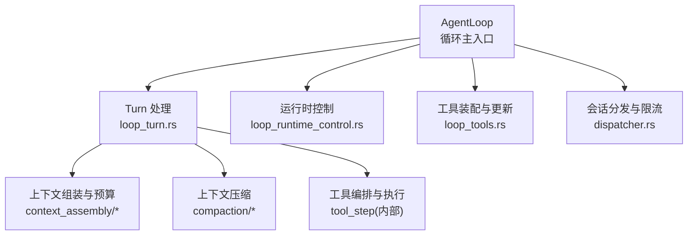
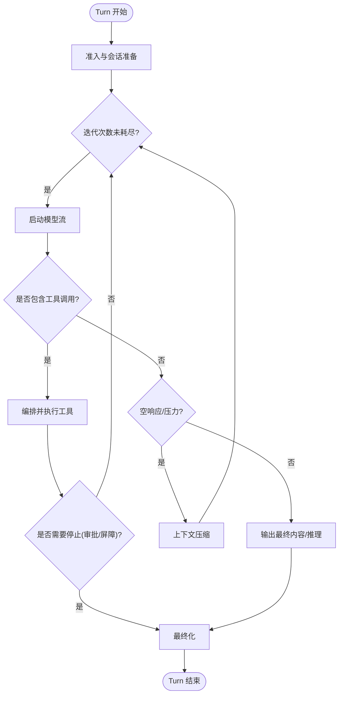
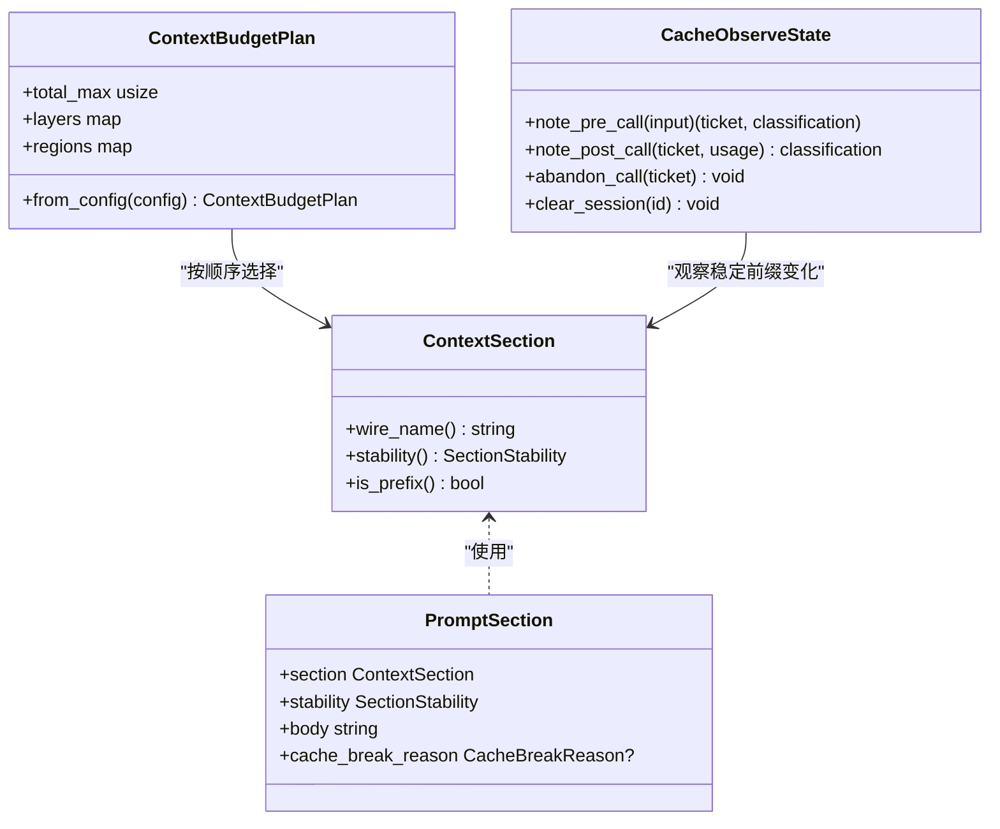
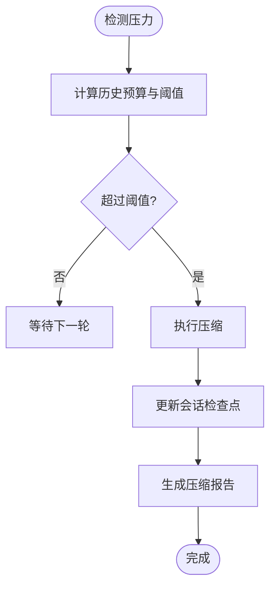
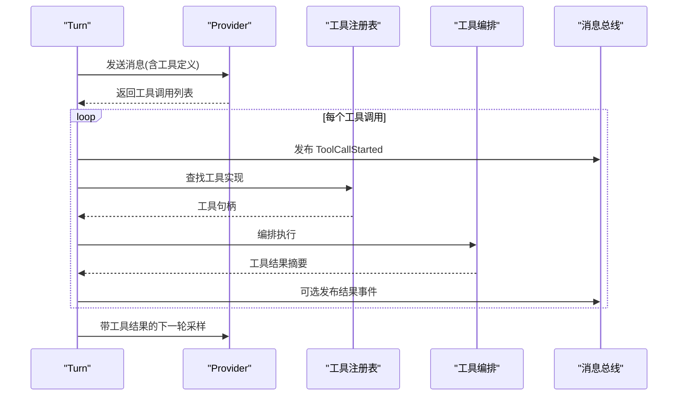
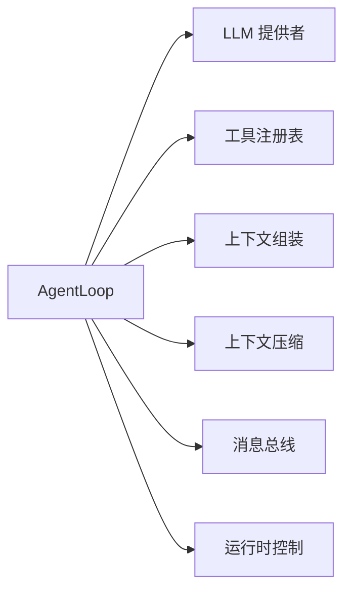

# 智能体处理循环

<cite>
**本文引用的文件**
- [agent_loop.rs](file://agent-diva-agent/src/agent_loop.rs)
- [loop_turn.rs](file://agent-diva-agent/src/agent_loop/loop_turn.rs)
- [loop_runtime_control.rs](file://agent-diva-agent/src/agent_loop/loop_runtime_control.rs)
- [loop_tools.rs](file://agent-diva-agent/src/agent_loop/loop_tools.rs)
- [dispatcher.rs](file://agent-diva-agent/src/agent_loop/dispatcher.rs)
- [context_assembly/mod.rs](file://agent-diva-agent/src/context_assembly/mod.rs)
- [context_assembly/budget.rs](file://agent-diva-agent/src/context_assembly/budget.rs)
- [context_assembly/cache_observe.rs](file://agent-diva-agent/src/context_assembly/cache_observe.rs)
- [compaction/mod.rs](file://agent-diva-agent/src/compaction/mod.rs)
- [context_budget.rs](file://agent-diva-agent/src/context_budget.rs)
- [token_estimate.rs](file://agent-diva-agent/src/token_estimate.rs)
</cite>

## 目录
1. [简介](#简介)
2. [项目结构](#项目结构)
3. [核心组件](#核心组件)
4. [架构总览](#架构总览)
5. [详细组件分析](#详细组件分析)
6. [依赖关系分析](#依赖关系分析)
7. [性能考量](#性能考量)
8. [故障排查指南](#故障排查指南)
9. [结论](#结论)
10. [附录](#附录)

## 简介
本文件聚焦 Agent Loop（智能体处理循环）的核心处理流程，围绕 Turn 生命周期、上下文组装与预算控制、工具调用协调、关键事件触发时机与作用、上下文压缩机制以及配置与调优参数进行系统化说明。目标是帮助读者在不深入源码的情况下理解“一次请求如何进入循环—迭代—工具执行—结果汇总—最终化”的完整路径，并掌握在复杂场景下的调试与优化方法。

## 项目结构
Agent Loop 位于 agent-diva-agent 包中，核心由以下模块构成：
- 循环主入口与状态管理：agent_loop.rs
- 单轮处理与迭代调度：agent_loop/loop_turn.rs
- 运行时控制命令与会话管理：agent_loop/loop_runtime_control.rs
- 工具注册与动态更新：agent_loop/loop_tools.rs
- 会话分发与限流：agent_loop/dispatcher.rs
- 上下文组装与预算：context_assembly/*
- 上下文压缩：compaction/*
- 预算与估算：context_budget.rs、token_estimate.rs



图表来源
- [agent_loop.rs:111-158](file://agent-diva-agent/src/agent_loop.rs#L111-L158)
- [loop_turn.rs:312-757](file://agent-diva-agent/src/agent_loop/loop_turn.rs#L312-L757)
- [loop_runtime_control.rs:26-263](file://agent-diva-agent/src/agent_loop/loop_runtime_control.rs#L26-L263)
- [loop_tools.rs:9-71](file://agent-diva-agent/src/agent_loop/loop_tools.rs#L9-L71)
- [dispatcher.rs:1-200](file://agent-diva-agent/src/agent_loop/dispatcher.rs#L1-L200)
- [context_assembly/mod.rs:1-115](file://agent-diva-agent/src/context_assembly/mod.rs#L1-L115)
- [context_assembly/budget.rs:119-193](file://agent-diva-agent/src/context_assembly/budget.rs#L119-L193)
- [compaction/mod.rs:1-33](file://agent-diva-agent/src/compaction/mod.rs#L1-L33)

章节来源
- [agent_loop.rs:111-158](file://agent-diva-agent/src/agent_loop.rs#L111-L158)
- [loop_turn.rs:312-757](file://agent-diva-agent/src/agent_loop/loop_turn.rs#L312-L757)
- [context_assembly/mod.rs:1-115](file://agent-diva-agent/src/context_assembly/mod.rs#L1-L115)
- [context_assembly/budget.rs:119-193](file://agent-diva-agent/src/context_assembly/budget.rs#L119-L193)
- [compaction/mod.rs:1-33](file://agent-diva-agent/src/compaction/mod.rs#L1-L33)

## 核心组件
- AgentLoop：维护消息总线、LLM 提供者、会话、工具注册表、子代理管理器、安全熔断器、速率限制、缓存观察器等；提供构造、工具集重建、运行时控制等能力。
- Turn 处理器：负责单次入站消息的完整生命周期，包括准入、上下文准备、迭代采样、工具编排、最终化。
- 运行时控制：处理网络/MCP 配置更新、会话停止/重置/删除、标题生成/更新、思考模式切换、手动压缩等。
- 上下文组装：将系统提示、技能、记忆策略、历史、检查点、当前用户等按稳定/可变分区组织，并进行预算选择与报告。
- 上下文压缩：基于预算监控与 LLM 驱动的摘要，生成规范检查点以维持长会话可用。
- 预算与估算：提供 Token 估算、分层预算计划、区域预算与丢弃/压缩策略。

章节来源
- [agent_loop.rs:111-158](file://agent-diva-agent/src/agent_loop.rs#L111-L158)
- [loop_turn.rs:312-757](file://agent-diva-agent/src/agent_loop/loop_turn.rs#L312-L757)
- [loop_runtime_control.rs:26-263](file://agent-diva-agent/src/agent_loop/loop_runtime_control.rs#L26-L263)
- [context_assembly/mod.rs:1-115](file://agent-diva-agent/src/context_assembly/mod.rs#L1-L115)
- [context_assembly/budget.rs:119-193](file://agent-diva-agent/src/context_assembly/budget.rs#L119-L193)
- [compaction/mod.rs:1-33](file://agent-diva-agent/src/compaction/mod.rs#L1-L33)

## 架构总览
下图展示从入站消息到最终输出的端到端流程，包括迭代、工具调用、上下文预算与压缩、事件发布。

```mermaid
sequenceDiagram
participant Client as "客户端"
participant Loop as "AgentLoop"
participant Turn as "Turn 处理"
participant Asm as "上下文组装"
participant Prov as "LLM 提供者"
participant Tools as "工具编排"
participant Comp as "上下文压缩"
participant Bus as "消息总线"
Client->>Loop : 入站消息
Loop->>Turn : 准入与会话准备
Turn->>Asm : 构建稳定前缀与动态段
Asm-->>Turn : 预算选择后的消息集合
loop 迭代(max_iterations)
Turn->>Prov : 启动模型流(含工具定义)
Prov-->>Turn : 增量文本/工具调用
alt 有工具调用
Turn->>Tools : 编排并执行工具
Tools-->>Turn : 工具结果
Turn->>Bus : 发布 ToolCallStarted/AssistantDelta
else 无工具调用
Turn->>Bus : 发布 AssistantDelta
alt 空响应或压力过大
Turn->>Comp : 触发压缩(必要时)
Comp-->>Turn : 检查点/摘要
end
end
end
Turn->>Loop : 最终内容/推理/用量
Loop->>Bus : 发布 TokenUsed/ReasoningReceived
```

图表来源
- [loop_turn.rs:312-757](file://agent-diva-agent/src/agent_loop/loop_turn.rs#L312-L757)
- [context_assembly/mod.rs:1-115](file://agent-diva-agent/src/context_assembly/mod.rs#L1-L115)
- [context_assembly/budget.rs:230-285](file://agent-diva-agent/src/context_assembly/budget.rs#L230-L285)
- [compaction/mod.rs:1-33](file://agent-diva-agent/src/compaction/mod.rs#L1-L33)

## 详细组件分析

### Turn 生命周期与迭代控制
- 准入阶段：解析入站消息，确定是否计划模式/只读模式，准备运行期上下文（模型、会话键、快照、计划守卫等）。
- 迭代循环：
  - 每轮开始发布 IterationStarted 事件，记录索引与上限。
  - 根据模式决定工具定义集（只读模式仅暴露读取工具；cron 触发隐藏 cron 工具；总结-only 轮次禁用工具）。
  - 启动模型流，收集增量文本与工具调用，同时记录缓存票据与用量。
  - 若返回工具调用：
    - 发布 ToolCallStarted 事件（名称、参数预览等）。
    - 编排并执行工具，收集结果摘要，必要时设置 stop_after_tool_call 以进入审批屏障。
    - 若工具耗尽且达到最大迭代，允许一次 summary-only 奖励轮次用于收尾。
  - 若无工具调用：
    - 对空响应进行分类，必要时触发输入压力压缩。
    - 若需要总结跟进，继续下一轮。
    - 否则输出最终内容与推理（受思考模式影响）。
- 最终化：合并工具运行摘要、计划事件、令牌记账、会话标题生成等，完成 Turn 收尾。



图表来源
- [loop_turn.rs:312-757](file://agent-diva-agent/src/agent_loop/loop_turn.rs#L312-L757)

章节来源
- [loop_turn.rs:312-757](file://agent-diva-agent/src/agent_loop/loop_turn.rs#L312-L757)

### 关键事件触发时机与作用
- IterationStarted：每轮迭代开始时发布，携带当前索引与最大迭代数，便于前端/日志追踪进度。
- AssistantDelta：模型流式输出时持续发布，承载增量文本，支持实时渲染。
- ToolCallStarted：每次工具调用开始前发布，携带工具名与参数预览，便于审计与界面展示。
- TokenUsed/ReasoningReceived：当提供者返回用量或推理内容时发布，供上层统计与展示。

章节来源
- [loop_turn.rs:312-757](file://agent-diva-agent/src/agent_loop/loop_turn.rs#L312-L757)

### 上下文组装与预算控制
- 逻辑分区：Mask/身份、冻结核心、规则与技能、记忆策略与索引、压缩摘要、历史、会话检查点、预取召回、易变元数据、计划守卫、当前用户。
- 稳定性分类：稳定前缀（可缓存）、会话稳定、回合易变。
- 预算计划：
  - 三层区域：稳定前缀、规范检查点、活跃尾部。
  - 多层预算：冻结核心与规则、核心工具定义、延迟工具定义、L1 索引、会话检查点、预取召回、压缩摘要、历史、工具结果内联、当前回合。
  - 通过 select_dynamic_sections 在层与总量约束下选择片段，记录决策原因（层软限、总量硬限、宏压缩、微压缩）。
- 缓存观察：
  - 记录 provider 最终线快照（稳定系统哈希、核心工具哈希、活跃工具名），判断基线/稳定/预期破坏/策略破坏/未声明结构破坏。
  - 为最后一条核心工具定义附加 cache_control 锚点，提升缓存命中。



图表来源
- [context_assembly/mod.rs:26-115](file://agent-diva-agent/src/context_assembly/mod.rs#L26-L115)
- [context_assembly/budget.rs:119-193](file://agent-diva-agent/src/context_assembly/budget.rs#L119-L193)
- [context_assembly/cache_observe.rs:61-205](file://agent-diva-agent/src/context_assembly/cache_observe.rs#L61-L205)

章节来源
- [context_assembly/mod.rs:26-115](file://agent-diva-agent/src/context_assembly/mod.rs#L26-L115)
- [context_assembly/budget.rs:119-193](file://agent-diva-agent/src/context_assembly/budget.rs#L119-L193)
- [context_assembly/cache_observe.rs:61-205](file://agent-diva-agent/src/context_assembly/cache_observe.rs#L61-L205)

### 上下文压缩与 ContextCompaction
- 触发条件：当历史或检查点接近预算阈值时，或在空响应/输入压力场景下触发。
- 执行流程：
  - 基于 BudgetConfig 计算历史预算与压缩阈值。
  - 使用 CheckpointCompactor 对会话快照进行压缩，生成规范检查点。
  - 更新会话 canonical_checkpoint 并持久化。
- 事件与报告：压缩过程会产出报告（源消息数、Token 节省、检查点正文摘要），并在手动压缩时返回可读摘要。



图表来源
- [context_budget.rs:164-207](file://agent-diva-agent/src/context_budget.rs#L164-L207)
- [compaction/mod.rs:1-33](file://agent-diva-agent/src/compaction/mod.rs#L1-L33)
- [loop_runtime_control.rs:294-362](file://agent-diva-agent/src/agent_loop/loop_runtime_control.rs#L294-L362)

章节来源
- [context_budget.rs:164-207](file://agent-diva-agent/src/context_budget.rs#L164-L207)
- [compaction/mod.rs:1-33](file://agent-diva-agent/src/compaction/mod.rs#L1-L33)
- [loop_runtime_control.rs:294-362](file://agent-diva-agent/src/agent_loop/loop_runtime_control.rs#L294-L362)

### 工具调用执行与结果处理
- 工具定义集构建：根据模式过滤（只读、cron、总结-only），并通过 ToolAssembly 装配内置/网络/MCP/自定义工具。
- 编排与执行：
  - 对每个工具调用发布 ToolCallStarted。
  - 执行工具，收集结果摘要，必要时设置 stop_after_tool_call 以进入审批屏障。
  - 将工具结果注入消息上下文，驱动下一轮采样。
- 结果处理：
  - 累积工具运行摘要，用于后续总结生成。
  - 若进入审批阶段，终止本轮工具调用链，等待外部批准。



图表来源
- [loop_tools.rs:9-71](file://agent-diva-agent/src/agent_loop/loop_tools.rs#L9-L71)
- [loop_turn.rs:562-643](file://agent-diva-agent/src/agent_loop/loop_turn.rs#L562-L643)

章节来源
- [loop_tools.rs:9-71](file://agent-diva-agent/src/agent_loop/loop_tools.rs#L9-L71)
- [loop_turn.rs:562-643](file://agent-diva-agent/src/agent_loop/loop_turn.rs#L562-L643)

### 处理循环的配置选项与性能调优
- 全局超时与安全：
  - global_timeout_secs：工具注册表执行的全局包装超时。
  - 安全配置覆盖：global_tool_timeout_secs、rejection_circuit_window_secs/threshold、max_actions_per_hour。
- 工具与网络：
  - exec_timeout：Shell 执行超时。
  - approval_policy：命令审批策略（OnRequest/OnFailure/UnlessTrusted/Never）。
  - ask_user：交互式问答协调器。
  - restrict_to_workspace：限制文件访问至工作区。
  - mcp_servers：MCP 服务器配置。
  - builtin/web_search/fetch/mcp：内置工具开关。
- 上下文预算：
  - max_tokens：最大上下文 Token 数。
  - system_budget_ratio：系统提示与技能预留比例。
  - compact_threshold_ratio：历史预算触发压缩的比例。
  - keep_recent_count：始终保留最近消息数量。
- 性能调优建议：
  - 合理设置 system_budget_ratio，避免系统提示占用过多空间。
  - 调整 compact_threshold_ratio，平衡压缩频率与上下文质量。
  - 启用 prompt cache 锚点（core tool cache anchor），提高缓存命中。
  - 使用只读模式与 cron 工具隐藏减少不必要工具定义体积。
  - 通过 CacheObserveState 观察稳定前缀变化，定位缓存破坏原因。

章节来源
- [agent_loop.rs:55-108](file://agent-diva-agent/src/agent_loop.rs#L55-L108)
- [agent_loop.rs:477-564](file://agent-diva-agent/src/agent_loop.rs#L477-L564)
- [context_budget.rs:25-61](file://agent-diva-agent/src/context_budget.rs#L25-L61)
- [context_assembly/cache_observe.rs:207-226](file://agent-diva-agent/src/context_assembly/cache_observe.rs#L207-L226)

### 调试技巧与常见问题
- 调试技巧：
  - 关注 IterationStarted/AssistantDelta/ToolCallStarted 事件序列，确认迭代推进与工具调用路径。
  - 使用 CacheObserveState 的分类（Baseline/Stable/ExpectedBreak/PolicyBreak/UndeclaredStructuralBreak）定位缓存破坏。
  - 查看 ContextAssemblyReport 的 dropped/compacted 列表，了解哪些片段被丢弃或压缩及原因。
  - 通过 handle_compact_session 手动触发压缩，验证预算与压缩效果。
- 常见问题：
  - 空响应：可能因输入压力或上下文窗口不足，需触发压缩或调整预算。
  - 工具调用后无文本：总结-only 轮次可能仅生成摘要，需检查 iteration_budget 与 summary_nudge。
  - 审批屏障：stop_after_tool_call 设置为 true 时，本轮不再继续工具调用，需外部批准。
  - 缓存未命中：检查 stable_system_hash/core_tools_hash/active_tool_names 是否变化，确认是否声明了 break reasons。

章节来源
- [loop_turn.rs:312-757](file://agent-diva-agent/src/agent_loop/loop_turn.rs#L312-L757)
- [context_assembly/cache_observe.rs:61-205](file://agent-diva-agent/src/context_assembly/cache_observe.rs#L61-L205)
- [context_assembly/budget.rs:230-285](file://agent-diva-agent/src/context_assembly/budget.rs#L230-L285)
- [loop_runtime_control.rs:294-362](file://agent-diva-agent/src/agent_loop/loop_runtime_control.rs#L294-L362)

## 依赖关系分析
Agent Loop 依赖多个子系统，形成清晰的职责边界：
- 与 LLM 提供者交互：发起流式调用，收集增量与工具调用。
- 与工具注册表交互：动态装配工具，支持运行时更新网络/MCP 配置。
- 与上下文组装交互：按稳定/可变分区组织上下文，应用预算选择。
- 与压缩模块交互：在压力下生成检查点，维持长会话可用性。
- 与消息总线交互：发布事件（IterationStarted、AssistantDelta、ToolCallStarted、TokenUsed、ReasoningReceived 等）。
- 与运行时控制交互：处理会话生命周期、配置热更新、思考模式切换。



图表来源
- [agent_loop.rs:111-158](file://agent-diva-agent/src/agent_loop.rs#L111-L158)
- [loop_turn.rs:312-757](file://agent-diva-agent/src/agent_loop/loop_turn.rs#L312-L757)
- [loop_runtime_control.rs:26-263](file://agent-diva-agent/src/agent_loop/loop_runtime_control.rs#L26-L263)

章节来源
- [agent_loop.rs:111-158](file://agent-diva-agent/src/agent_loop.rs#L111-L158)
- [loop_turn.rs:312-757](file://agent-diva-agent/src/agent_loop/loop_turn.rs#L312-L757)
- [loop_runtime_control.rs:26-263](file://agent-diva-agent/src/agent_loop/loop_runtime_control.rs#L26-L263)

## 性能考量
- 预算分层：通过 ContextBudgetPlan 将上下文划分为稳定前缀、规范检查点、活跃尾部，分别施加软硬限制，避免整体溢出。
- 工具定义裁剪：只读模式与 cron 触发隐藏非必要工具，减少工具定义体积。
- 缓存优化：利用 core tool cache anchor 与 CacheObserveState 观察稳定前缀变化，提升缓存命中率。
- 压缩策略：在历史预算接近阈值时主动压缩，保持会话长度可控。
- 速率限制：turn_rate_limiter 与 rejection_circuit 防止死循环与过度调用。

[本节为通用性能指导，不直接分析具体文件]

## 故障排查指南
- 事件缺失：检查 event_tx 与 bus.publish_event 调用路径，确认事件是否正确发布。
- 工具未执行：确认工具定义集是否包含目标工具，是否存在审批屏障或只读模式限制。
- 上下文溢出：查看 ContextAssemblyReport 的 dropped/compacted 列表，调整 budget 配置或触发压缩。
- 缓存未命中：通过 CacheObserveState 的分类与日志，定位稳定前缀变化原因。
- 会话异常：使用运行时控制命令重置/删除会话，清理检查点与缓存。

章节来源
- [loop_turn.rs:312-757](file://agent-diva-agent/src/agent_loop/loop_turn.rs#L312-L757)
- [context_assembly/budget.rs:230-285](file://agent-diva-agent/src/context_assembly/budget.rs#L230-L285)
- [context_assembly/cache_observe.rs:61-205](file://agent-diva-agent/src/context_assembly/cache_observe.rs#L61-L205)
- [loop_runtime_control.rs:79-195](file://agent-diva-agent/src/agent_loop/loop_runtime_control.rs#L79-L195)

## 结论
Agent Loop 通过严谨的 Turn 生命周期管理、上下文预算控制、工具编排与压缩机制，实现了高效、可控的智能体处理循环。关键事件（IterationStarted、AssistantDelta、ToolCallStarted）提供了完整的可观测性，配合缓存观察与预算报告，便于定位问题与优化性能。合理配置预算参数、启用缓存锚点、适时触发压缩，可在长会话场景中保持稳定与效率。

[本节为总结性内容，不直接分析具体文件]

## 附录
- Token 估算：采用 chars/4 × 4/3 启发式，近似等价于 chars/3，适用于多语言与代码混合输入。
- 预算配置默认值：max_tokens=180000、system_budget_ratio=0.15、compact_threshold_ratio=0.80、keep_recent_count=10。
- 环境变量覆盖：AGENT_DIVA_MAX_CONTEXT_TOKENS 可覆盖默认上下文大小。

章节来源
- [token_estimate.rs:1-81](file://agent-diva-agent/src/token_estimate.rs#L1-L81)
- [context_budget.rs:25-61](file://agent-diva-agent/src/context_budget.rs#L25-L61)
- [context_budget.rs:91-112](file://agent-diva-agent/src/context_budget.rs#L91-L112)