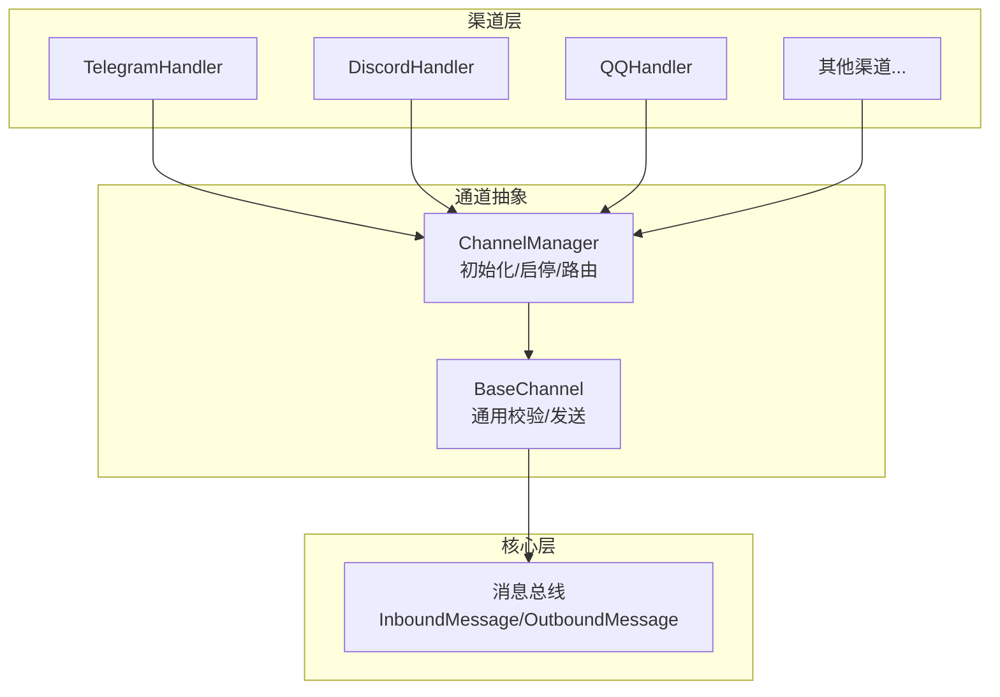
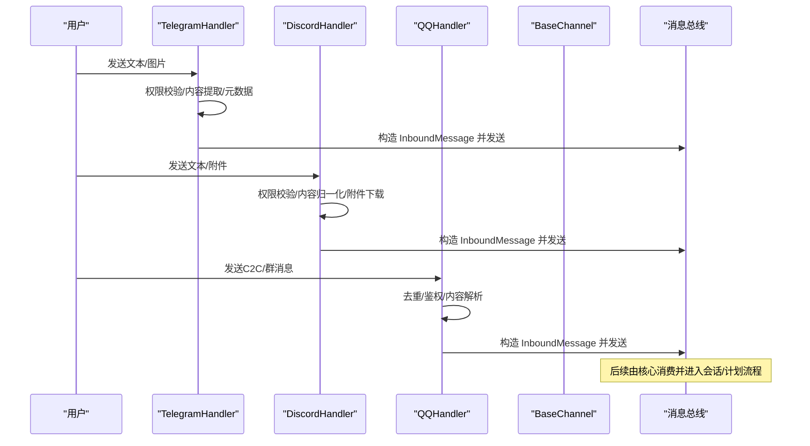
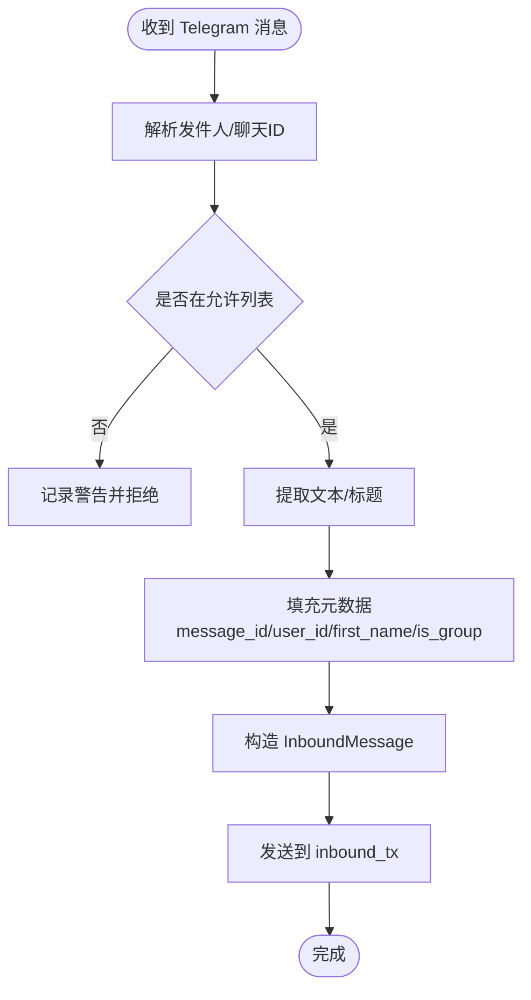
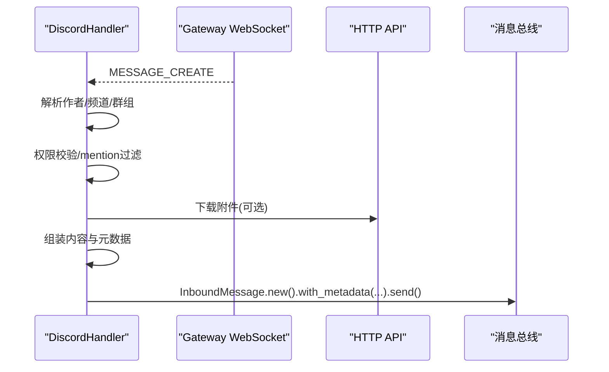
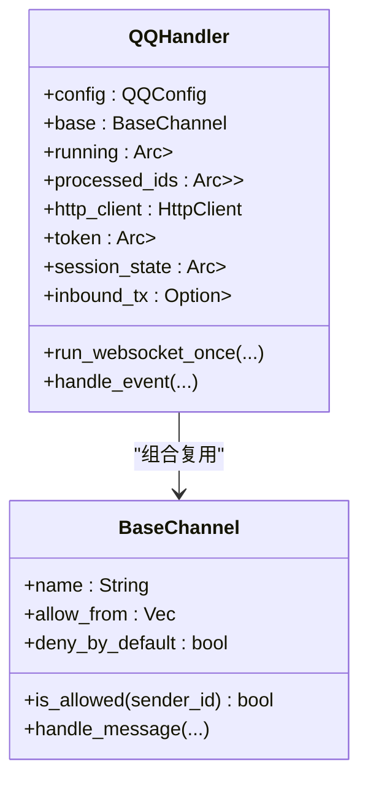
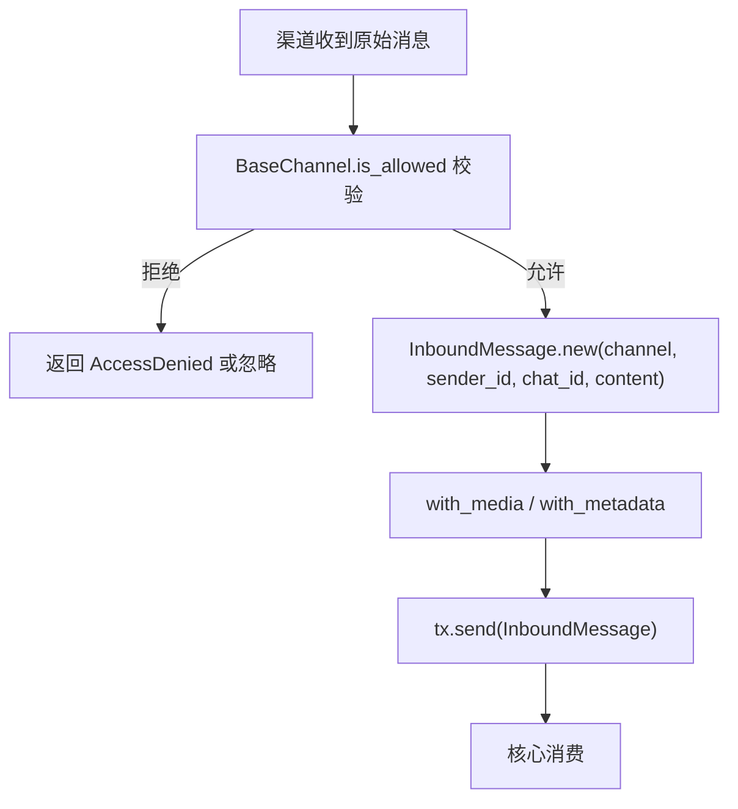
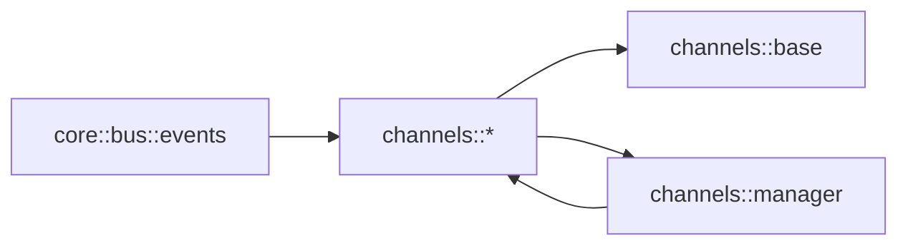

# 消息接收与标准化

<cite>
**本文引用的文件**
- [agent-diva-core/src/bus/events.rs](file://agent-diva-core/src/bus/events.rs)
- [agent-diva-channels/src/lib.rs](file://agent-diva-channels/src/lib.rs)
- [agent-diva-channels/src/base.rs](file://agent-diva-channels/src/base.rs)
- [agent-diva-channels/src/manager.rs](file://agent-diva-channels/src/manager.rs)
- [agent-diva-channels/src/telegram.rs](file://agent-diva-channels/src/telegram.rs)
- [agent-diva-channels/src/discord.rs](file://agent-diva-channels/src/discord.rs)
- [agent-diva-channels/src/qq.rs](file://agent-diva-channels/src/qq.rs)
</cite>

## 目录
1. [简介](#简介)
2. [项目结构](#项目结构)
3. [核心组件](#核心组件)
4. [架构总览](#架构总览)
5. [详细组件分析](#详细组件分析)
6. [依赖关系分析](#依赖关系分析)
7. [性能考量](#性能考量)
8. [故障排查指南](#故障排查指南)
9. [结论](#结论)
10. [附录](#附录)

## 简介
本文档聚焦于“消息接收与标准化”的完整流程：从各 Channel（Telegram、Discord、QQ 等）接收原始消息，经过适配器处理、格式转换、权限校验、元数据提取与媒体附件处理，最终统一为标准的 InboundMessage 对象并投递到系统总线。文档同时说明消息验证、过滤与预处理逻辑，给出关键步骤的代码路径引用，并总结错误处理与异常恢复策略。

## 项目结构
本仓库采用多 crate 分层组织：
- agent-diva-core：定义跨模块共享的消息类型与事件（InboundMessage、OutboundMessage、AgentEvent 等）。
- agent-diva-channels：实现各渠道适配器（Telegram、Discord、QQ、飞书、钉钉、邮件、Neuro-link 等），提供统一的 ChannelHandler 接口与 ChannelManager 生命周期管理。
- 其他 crate：负责 Agent 运行、工具、GUI、服务编排等，不在本文重点范围内。

图表来源
- [agent-diva-channels/src/lib.rs:9-52](file://agent-diva-channels/src/lib.rs#L9-L52)
- [agent-diva-channels/src/manager.rs:42-56](file://agent-diva-channels/src/manager.rs#L42-L56)
- [agent-diva-channels/src/base.rs:73-87](file://agent-diva-channels/src/base.rs#L73-L87)
- [agent-diva-core/src/bus/events.rs:156-172](file://agent-diva-core/src/bus/events.rs#L156-L172)

章节来源
- [agent-diva-channels/src/lib.rs:9-52](file://agent-diva-channels/src/lib.rs#L9-L52)
- [agent-diva-channels/src/manager.rs:42-56](file://agent-diva-channels/src/manager.rs#L42-L56)
- [agent-diva-core/src/bus/events.rs:156-172](file://agent-diva-core/src/bus/events.rs#L156-L172)

## 核心组件
- InboundMessage：标准化的入站消息结构，包含 channel、sender_id、chat_id、content、timestamp、media、metadata。
- OutboundMessage：出站消息结构，用于向具体渠道发送回复。
- ChannelHandler：渠道适配器统一接口，定义 name、start、stop、send、set_inbound_sender、is_allowed。
- BaseChannel：通用能力封装，包括允许列表校验、handle_message 构建 InboundMessage 并投递。
- ChannelManager：根据配置初始化、启动、停止各渠道；维护 inbound_tx 并将消息注入总线。

章节来源
- [agent-diva-core/src/bus/events.rs:156-213](file://agent-diva-core/src/bus/events.rs#L156-L213)
- [agent-diva-core/src/bus/events.rs:343-435](file://agent-diva-core/src/bus/events.rs#L343-L435)
- [agent-diva-channels/src/base.rs:9-32](file://agent-diva-channels/src/base.rs#L9-L32)
- [agent-diva-channels/src/base.rs:73-229](file://agent-diva-channels/src/base.rs#L73-L229)
- [agent-diva-channels/src/manager.rs:42-56](file://agent-diva-channels/src/manager.rs#L42-L56)

## 架构总览
下图展示了消息从渠道到核心的标准化流程：

图表来源
- [agent-diva-channels/src/telegram.rs:550-666](file://agent-diva-channels/src/telegram.rs#L550-L666)
- [agent-diva-channels/src/discord.rs:336-442](file://agent-diva-channels/src/discord.rs#L336-L442)
- [agent-diva-channels/src/qq.rs:231-265](file://agent-diva-channels/src/qq.rs#L231-L265)
- [agent-diva-core/src/bus/events.rs:156-213](file://agent-diva-core/src/bus/events.rs#L156-L213)

## 详细组件分析

### Telegram 渠道
- 连接与分发：使用 teloxide 的 Dispatcher 在后台任务中监听更新，命令分支与消息分支分别处理。
- 权限控制：支持 allow_from 白名单，支持复合 ID（如 user_id|username）匹配。
- 内容提取：优先取 text，其次 caption，空消息标记为占位。
- 元数据处理：附加 message_id、user_id、first_name、is_group 等。
- 媒体处理：当前实现以文本为主，未直接下载媒体；如需多媒体可参考 BaseChannel.handle_message 的 media 字段用法。
- 打字指示器：周期性发送 typing 动作提升交互体验。
- 标准化输出：通过 InboundMessage::new + with_metadata 构造标准消息并发送到 inbound_tx。

图表来源
- [agent-diva-channels/src/telegram.rs:550-666](file://agent-diva-channels/src/telegram.rs#L550-L666)
- [agent-diva-channels/src/base.rs:186-229](file://agent-diva-channels/src/base.rs#L186-L229)

章节来源
- [agent-diva-channels/src/telegram.rs:108-150](file://agent-diva-channels/src/telegram.rs#L108-L150)
- [agent-diva-channels/src/telegram.rs:245-331](file://agent-diva-channels/src/telegram.rs#L245-L331)
- [agent-diva-channels/src/telegram.rs:550-666](file://agent-diva-channels/src/telegram.rs#L550-L666)

### Discord 渠道
- 连接方式：通过 Gateway WebSocket 实时接收消息，REST API 发送消息。
- 权限控制：继承 BaseChannel 的 allow_from 策略；群组场景支持 group_reply_allowed_sender_ids 白名单。
- 内容归一化：可选 mention_only 模式，仅在群组中提及机器人时才处理；自动移除 @bot 标签并清理空白。
- 附件处理：下载附件并追加到内容中；超大附件会记录提示。
- 元数据处理：附加 message_id、username、guild_id、reply_to 等。
- 心跳与会话：维护 heartbeat、session_id、seq，支持断线重连与速率限制重试。
- 标准化输出：构造 InboundMessage 并通过 inbound_tx 发送。

图表来源
- [agent-diva-channels/src/discord.rs:336-442](file://agent-diva-channels/src/discord.rs#L336-L442)
- [agent-diva-channels/src/discord.rs:497-696](file://agent-diva-channels/src/discord.rs#L497-L696)

章节来源
- [agent-diva-channels/src/discord.rs:113-136](file://agent-diva-channels/src/discord.rs#L113-L136)
- [agent-diva-channels/src/discord.rs:199-225](file://agent-diva-channels/src/discord.rs#L199-L225)
- [agent-diva-channels/src/discord.rs:336-442](file://agent-diva-channels/src/discord.rs#L336-L442)
- [agent-diva-channels/src/discord.rs:698-748](file://agent-diva-channels/src/discord.rs#L698-L748)

### QQ 渠道
- 连接方式：WebSocket 网关，支持 Identify/Resume、心跳 ACK、断线重连与冷却期。
- 鉴权与令牌：自动获取 access_token，支持环境变量覆盖；过期前缓存。
- 去重机制：维护最近处理的消息 ID 队列，避免重复处理。
- 权限控制：继承 BaseChannel 的 allow_from 策略。
- 内容解析：解析 C2C/群消息，提取 content、author 信息。
- 标准化输出：构造 InboundMessage 并通过 inbound_tx 发送。

图表来源
- [agent-diva-channels/src/qq.rs:231-265](file://agent-diva-channels/src/qq.rs#L231-L265)
- [agent-diva-channels/src/base.rs:73-184](file://agent-diva-channels/src/base.rs#L73-L184)

章节来源
- [agent-diva-channels/src/qq.rs:50-133](file://agent-diva-channels/src/qq.rs#L50-L133)
- [agent-diva-channels/src/qq.rs:271-284](file://agent-diva-channels/src/qq.rs#L271-L284)
- [agent-diva-channels/src/qq.rs:429-750](file://agent-diva-channels/src/qq.rs#L429-L750)

### 通用适配与标准化
- BaseChannel.handle_message：统一进行权限校验、构建 InboundMessage、添加 media 与 metadata、发送到 inbound_tx。
- ChannelManager.initialize：按配置启用各渠道，注入 inbound_tx，确保所有渠道将消息汇入同一总线。
- 允许列表与默认策略：empty allow_from 时，若 deny_by_default=false 则允许全部；否则需显式白名单。

图表来源
- [agent-diva-channels/src/base.rs:186-229](file://agent-diva-channels/src/base.rs#L186-L229)
- [agent-diva-channels/src/manager.rs:377-642](file://agent-diva-channels/src/manager.rs#L377-L642)

章节来源
- [agent-diva-channels/src/base.rs:121-184](file://agent-diva-channels/src/base.rs#L121-L184)
- [agent-diva-channels/src/base.rs:186-229](file://agent-diva-channels/src/base.rs#L186-L229)
- [agent-diva-channels/src/manager.rs:377-642](file://agent-diva-channels/src/manager.rs#L377-L642)

## 依赖关系分析
- 渠道层依赖 core 的 InboundMessage/OutboundMessage 类型，保证消息契约一致。
- ChannelManager 集中管理各 Handler 的生命周期与 inbound_tx 注入。
- BaseChannel 提供通用校验与消息构建，减少重复代码。
- 各渠道根据自身协议实现差异化逻辑（如 Discord 的 mention_only、QQ 的心跳与去重、Telegram 的命令与 HTML 转换）。

图表来源
- [agent-diva-core/src/bus/events.rs:156-213](file://agent-diva-core/src/bus/events.rs#L156-L213)
- [agent-diva-channels/src/lib.rs:9-52](file://agent-diva-channels/src/lib.rs#L9-L52)
- [agent-diva-channels/src/manager.rs:42-56](file://agent-diva-channels/src/manager.rs#L42-L56)

章节来源
- [agent-diva-core/src/bus/events.rs:156-213](file://agent-diva-core/src/bus/events.rs#L156-L213)
- [agent-diva-channels/src/lib.rs:9-52](file://agent-diva-channels/src/lib.rs#L9-L52)
- [agent-diva-channels/src/manager.rs:42-56](file://agent-diva-channels/src/manager.rs#L42-L56)

## 性能考量
- 异步与并发：各渠道均使用 tokio 异步运行时，Dispatcher/Gateway 任务独立运行，避免阻塞。
- 资源管理：打字指示器任务在发送后及时中止；WebSocket 连接具备重连与退避策略。
- 限流与重试：Discord 对 429 状态码进行 retry-after 等待；QQ 心跳超时与无效会话冷却。
- 内存与去重：QQ 维护固定长度的已处理消息 ID 队列，防止无限增长。
- 内容裁剪：Discord 超长消息分片发送；Telegram 将 Markdown 转换为 HTML 以提升渲染效率。

[本节为通用指导，不直接分析具体文件]

## 故障排查指南
- 权限被拒：检查 allow_from 配置与 deny_by_default 策略；确认 sender_id 是否匹配（含复合 ID）。
- 渠道未启动：查看 ChannelManager 初始化日志，确认 enabled 与必填字段齐全。
- 连接失败：关注 WebSocket/HTTP 错误日志；检查 token、gateway_url、代理设置。
- 速率限制：Discord 429 会触发等待；必要时降低发送频率或增加重试间隔。
- 心跳超时：QQ 连续多次未收到 ACK 将退出并重连；检查网络与服务器状态。
- 附件下载失败：Discord 附件过大或网络问题会导致下载失败，会在内容中记录提示。

章节来源
- [agent-diva-channels/src/base.rs:34-71](file://agent-diva-channels/src/base.rs#L34-L71)
- [agent-diva-channels/src/manager.rs:198-211](file://agent-diva-channels/src/manager.rs#L198-L211)
- [agent-diva-channels/src/discord.rs:698-748](file://agent-diva-channels/src/discord.rs#L698-L748)
- [agent-diva-channels/src/qq.rs:739-748](file://agent-diva-channels/src/qq.rs#L739-L748)

## 结论
本系统通过 ChannelHandler 抽象与 BaseChannel 通用能力，将不同渠道的原始消息统一标准化为 InboundMessage，再经由 ChannelManager 注入消息总线，实现了渠道解耦与可扩展性。各渠道在保持自身协议特性的同时，遵循一致的权限、元数据与媒体处理约定，确保了消息处理的健壮性与可维护性。

[本节为总结，不直接分析具体文件]

## 附录
- 关键代码路径（示例）
  - 构建 InboundMessage 并发送：
    - [agent-diva-channels/src/telegram.rs:645-661](file://agent-diva-channels/src/telegram.rs#L645-L661)
    - [agent-diva-channels/src/discord.rs:423-439](file://agent-diva-channels/src/discord.rs#L423-L439)
    - [agent-diva-channels/src/base.rs:186-229](file://agent-diva-channels/src/base.rs#L186-L229)
  - 权限校验与默认策略：
    - [agent-diva-channels/src/base.rs:121-184](file://agent-diva-channels/src/base.rs#L121-L184)
  - 渠道初始化与 inbound_tx 注入：
    - [agent-diva-channels/src/manager.rs:377-642](file://agent-diva-channels/src/manager.rs#L377-L642)
  - 消息类型定义：
    - [agent-diva-core/src/bus/events.rs:156-213](file://agent-diva-core/src/bus/events.rs#L156-L213)
    - [agent-diva-core/src/bus/events.rs:343-435](file://agent-diva-core/src/bus/events.rs#L343-L435)