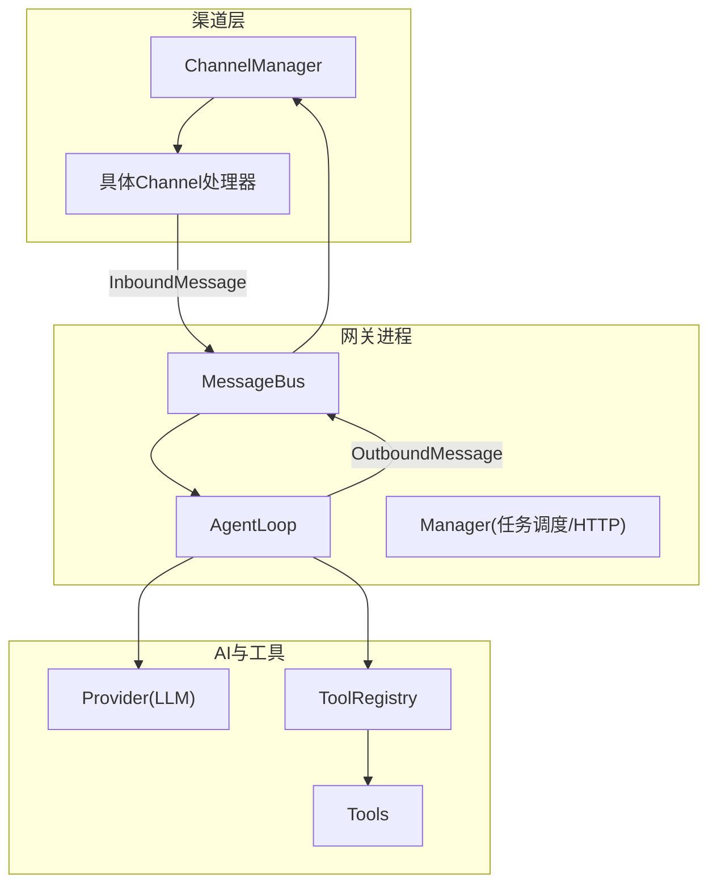
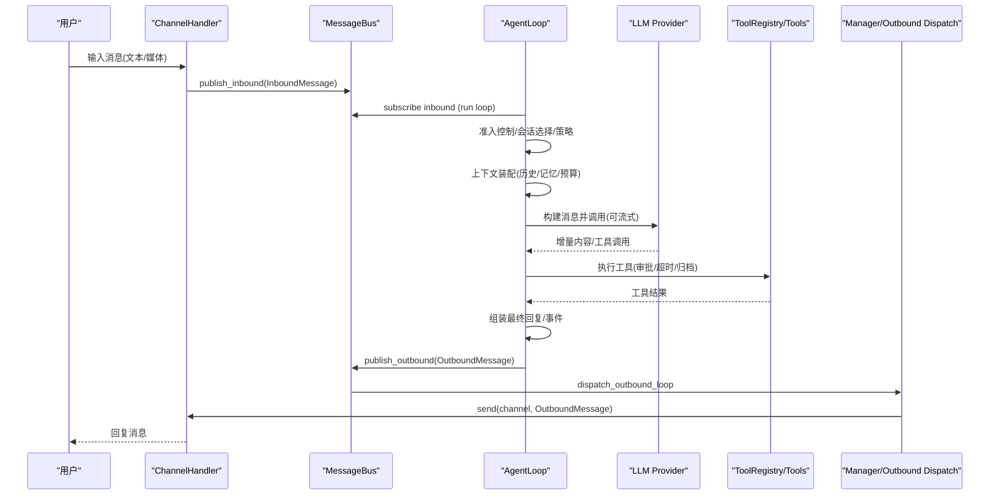
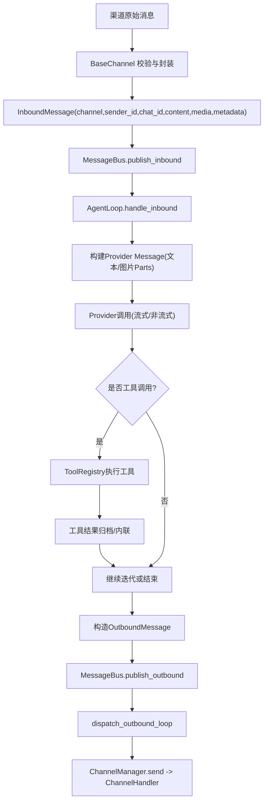
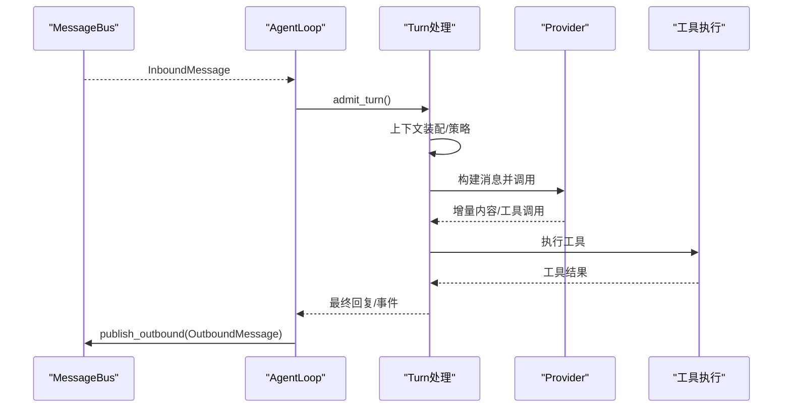
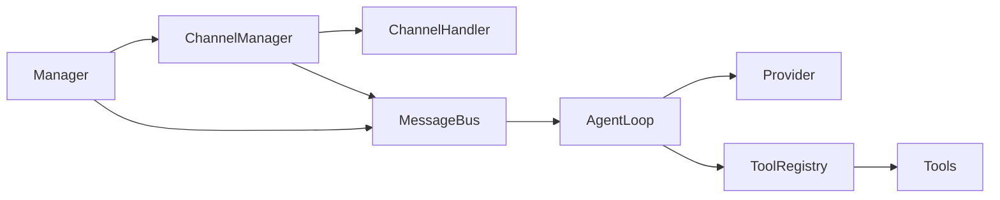

# 消息生命周期管理

<cite>
**本文引用的文件**
- [events.rs](file://agent-diva-core/src/bus/events.rs)
- [queue.rs](file://agent-diva-core/src/bus/queue.rs)
- [mod.rs](file://agent-diva-core/src/bus/mod.rs)
- [base.rs](file://agent-diva-channels/src/base.rs)
- [manager.rs](file://agent-diva-channels/src/manager.rs)
- [bootstrap.rs](file://agent-diva-manager/src/runtime/bootstrap.rs)
- [task_runtime.rs](file://agent-diva-manager/src/runtime/task_runtime.rs)
- [agent_loop.rs](file://agent-diva-agent/src/agent_loop.rs)
- [loop_turn.rs](file://agent-diva-agent/src/agent_loop/loop_turn.rs)
- [admission.rs](file://agent-diva-agent/src/agent_loop/turn/admission.rs)
</cite>

## 目录
1. [简介](#简介)
2. [项目结构](#项目结构)
3. [核心组件](#核心组件)
4. [架构总览](#架构总览)
5. [详细组件分析](#详细组件分析)
6. [依赖关系分析](#依赖关系分析)
7. [性能考量](#性能考量)
8. [故障排查指南](#故障排查指南)
9. [结论](#结论)

## 简介
本文档系统化描述 Agent-Diva 中“消息从 Channel 接收，经 Gateway 路由、Agent Loop 处理、Provider 调用、Tool 执行，最终返回响应”的完整生命周期。重点包括：
- InboundMessage 与 OutboundMessage 的数据结构与转换过程
- 消息在不同组件间的传递机制（标准化、路由规则、优先级）
- 消息状态跟踪与生命周期监控
- 关键路径的时序图
- 性能优化建议与故障排查方法

## 项目结构
本仓库采用多 crate 分层组织：
- agent-diva-core：定义消息总线、事件类型、会话与计划等基础能力
- agent-diva-channels：各渠道接入（Telegram、Discord、Slack 等），负责将外部消息转换为 InboundMessage 并发送入站队列
- agent-diva-manager：Gateway 进程编排，启动 MessageBus、ChannelManager、AgentLoop、HTTP Server 等，并订阅出站消息分发到渠道
- agent-diva-agent：Agent Loop 核心，负责单轮处理、上下文装配、Provider 调用、工具执行与结果回写
- agent-diva-tools / agent-diva-tooling：工具注册与执行框架
- agent-diva-providers：LLM Provider 抽象与实现

**图表来源**
- [manager.rs:680-715](file://agent-diva-channels/src/manager.rs#L680-L715)
- [queue.rs:106-184](file://agent-diva-core/src/bus/queue.rs#L106-L184)
- [task_runtime.rs:173-203](file://agent-diva-manager/src/runtime/task_runtime.rs#L173-L203)
- [agent_loop.rs:110-153](file://agent-diva-agent/src/agent_loop.rs#L110-L153)

**章节来源**
- [mod.rs:1-14](file://agent-diva-core/src/bus/mod.rs#L1-L14)
- [base.rs:1-241](file://agent-diva-channels/src/base.rs#L1-L241)
- [manager.rs:361-715](file://agent-diva-channels/src/manager.rs#L361-L715)
- [queue.rs:106-184](file://agent-diva-core/src/bus/queue.rs#L106-L184)
- [task_runtime.rs:157-203](file://agent-diva-manager/src/runtime/task_runtime.rs#L157-L203)
- [agent_loop.rs:110-153](file://agent-diva-agent/src/agent_loop.rs#L110-L153)

## 核心组件
- 消息总线（MessageBus）：提供入站/出站双队列与事件发布，解耦渠道与 Agent 核心
- 渠道管理器（ChannelManager）：维护各渠道处理器，桥接外部消息到总线，并将出站消息投递到对应渠道
- Agent Loop：单轮处理引擎，负责会话上下文装配、策略校验、Provider 调用、工具执行、结果持久化与事件广播
- Provider 抽象：统一 LLM 调用接口，支持流式与非流式响应
- 工具系统：注册与执行工具，支持沙箱审批、超时控制、结果归档

**章节来源**
- [events.rs:155-213](file://agent-diva-core/src/bus/events.rs#L155-L213)
- [events.rs:342-436](file://agent-diva-core/src/bus/events.rs#L342-L436)
- [queue.rs:106-184](file://agent-diva-core/src/bus/queue.rs#L106-L184)
- [base.rs:9-32](file://agent-diva-channels/src/base.rs#L9-L32)
- [manager.rs:680-715](file://agent-diva-channels/src/manager.rs#L680-L715)
- [agent_loop.rs:110-153](file://agent-diva-agent/src/agent_loop.rs#L110-L153)

## 架构总览
下图展示一次典型用户请求的生命周期：渠道收到消息后封装为 InboundMessage 进入总线；Agent Loop 消费消息，进行准入控制、上下文装配、Provider 调用与工具执行；最终生成 OutboundMessage 通过总线分发回渠道。

**图表来源**
- [base.rs:196-229](file://agent-diva-channels/src/base.rs#L196-L229)
- [queue.rs:106-184](file://agent-diva-core/src/bus/queue.rs#L106-L184)
- [task_runtime.rs:173-203](file://agent-diva-manager/src/runtime/task_runtime.rs#L173-L203)
- [agent_loop.rs:882-920](file://agent-diva-agent/src/agent_loop.rs#L882-L920)
- [loop_turn.rs:118-134](file://agent-diva-agent/src/agent_loop/loop_turn.rs#L118-L134)

## 详细组件分析

### 消息数据结构与转换
- InboundMessage：包含 channel、sender_id、chat_id、content、timestamp、media、metadata。用于统一表达来自不同渠道的用户消息。
- OutboundMessage：包含 channel、chat_id、content、reply_to、media、reasoning_content、metadata。用于统一表达要发送到渠道的回复。
- 转换要点：
  - 渠道侧 BaseChannel 在收到外部消息时，校验 sender 权限，构造 InboundMessage，附加 media 与 metadata，并通过 mpsc 发送至总线
  - Agent Loop 消费 InboundMessage，将其转换为 Provider 的 Message（支持文本与图片等多模态），并在最终回复时构造 OutboundMessage
  - 出站消息由 Manager 订阅总线出站队列，按 channel 分发到具体 ChannelHandler

**图表来源**
- [base.rs:196-229](file://agent-diva-channels/src/base.rs#L196-L229)
- [events.rs:155-213](file://agent-diva-core/src/bus/events.rs#L155-L213)
- [events.rs:342-436](file://agent-diva-core/src/bus/events.rs#L342-L436)
- [loop_turn.rs:118-134](file://agent-diva-agent/src/agent_loop/loop_turn.rs#L118-L134)
- [queue.rs:106-184](file://agent-diva-core/src/bus/queue.rs#L106-L184)
- [task_runtime.rs:173-203](file://agent-diva-manager/src/runtime/task_runtime.rs#L173-L203)

**章节来源**
- [events.rs:155-213](file://agent-diva-core/src/bus/events.rs#L155-L213)
- [events.rs:342-436](file://agent-diva-core/src/bus/events.rs#L342-L436)
- [base.rs:196-229](file://agent-diva-channels/src/base.rs#L196-L229)
- [loop_turn.rs:118-134](file://agent-diva-agent/src/agent_loop/loop_turn.rs#L118-L134)

### 路由规则与优先级
- 路由规则：
  - 入站路由：ChannelManager 将外部消息桥接到 MessageBus 的入站队列；Agent Loop 通过接收器消费
  - 出站路由：Manager 为每个启用频道订阅出站队列，回调内调用 ChannelManager.send 将 OutboundMessage 投递到目标渠道
- 优先级：
  - 当前实现使用无界通道与顺序消费，单会话串行处理；全局并行度受限于 tokio 任务模型
  - 可通过限制并发、批处理出站、限流与拒绝电路保护提升稳定性

**章节来源**
- [bootstrap.rs:275-291](file://agent-diva-manager/src/runtime/bootstrap.rs#L275-L291)
- [task_runtime.rs:173-203](file://agent-diva-manager/src/runtime/task_runtime.rs#L173-L203)
- [queue.rs:106-184](file://agent-diva-core/src/bus/queue.rs#L106-L184)

### Agent Loop 单轮处理流程
- 入口：AgentLoop 主循环从入站队列接收消息，调用 handle_inbound
- 准入控制：检查拒绝电路与每进程每小时动作上限，防止过载
- 上下文装配：加载会话历史、记忆、预算、掩码策略，构建 Prompt
- Provider 调用：构建消息（支持多模态），发起流式或非流式调用
- 工具执行：根据 Provider 返回的工具调用，执行工具并收集结果
- 结果输出：生成最终回复，构造 OutboundMessage 并发布到总线
- 事件广播：过程中持续发射 AgentEvent（如 AssistantDelta、ToolCallStarted/Finished、FinalResponse 等）

**图表来源**
- [agent_loop.rs:882-920](file://agent-diva-agent/src/agent_loop.rs#L882-L920)
- [admission.rs:94-117](file://agent-diva-agent/src/agent_loop/turn/admission.rs#L94-L117)
- [loop_turn.rs:118-134](file://agent-diva-agent/src/agent_loop/loop_turn.rs#L118-L134)

**章节来源**
- [agent_loop.rs:882-920](file://agent-diva-agent/src/agent_loop.rs#L882-L920)
- [admission.rs:94-117](file://agent-diva-agent/src/agent_loop/turn/admission.rs#L94-L117)
- [loop_turn.rs:118-134](file://agent-diva-agent/src/agent_loop/loop_turn.rs#L118-L134)

### 工具执行与结果处理
- 工具注册：ToolRegistry 统一管理工具定义与执行，支持超时与分区
- 执行策略：沙箱审批、命令批准协调器、网络工具配置、MCP 服务器集成
- 结果表示：小结果内联，大结果归档为 artifact，避免污染上下文
- 错误处理：工具失败返回错误信息，Provider 可见，便于重试或降级

**章节来源**
- [agent_loop.rs:54-87](file://agent-diva-agent/src/agent_loop.rs#L54-L87)
- [loop_turn.rs:118-134](file://agent-diva-agent/src/agent_loop/loop_turn.rs#L118-L134)

### 消息状态跟踪与生命周期监控
- 事件体系：AgentEvent 覆盖迭代开始、助手增量、推理增量、工具调用开始/完成、计划更新、最终响应、错误、Provider 重试/停滞、上下文压缩等
- 审计与监控：PokeEvent 提供发送/接收/历史追加/令牌消耗等系统级事件
- 会话状态：Session 与 TokenLedger 记录消息历史与用量，支持预算与压缩
- 存在性检测：PresenceDetector 基于消息活动计算活跃/分心/离线状态，辅助资源调度

**章节来源**
- [events.rs:59-145](file://agent-diva-core/src/bus/events.rs#L59-L145)
- [events.rs:361-394](file://agent-diva-core/src/bus/events.rs#L361-L394)

## 依赖关系分析
- ChannelManager 依赖 ChannelHandler 实现，负责入站桥接与出站分发
- MessageBus 作为中心枢纽，解耦渠道与 Agent
- AgentLoop 依赖 Provider 与 ToolRegistry，负责核心处理逻辑
- Manager 负责启动与协调各组件，订阅出站消息并分发

**图表来源**
- [manager.rs:680-715](file://agent-diva-channels/src/manager.rs#L680-L715)
- [queue.rs:106-184](file://agent-diva-core/src/bus/queue.rs#L106-L184)
- [task_runtime.rs:173-203](file://agent-diva-manager/src/runtime/task_runtime.rs#L173-L203)
- [agent_loop.rs:110-153](file://agent-diva-agent/src/agent_loop.rs#L110-L153)

**章节来源**
- [manager.rs:680-715](file://agent-diva-channels/src/manager.rs#L680-L715)
- [queue.rs:106-184](file://agent-diva-core/src/bus/queue.rs#L106-L184)
- [task_runtime.rs:173-203](file://agent-diva-manager/src/runtime/task_runtime.rs#L173-L203)
- [agent_loop.rs:110-153](file://agent-diva-agent/src/agent_loop.rs#L110-L153)

## 性能考量
- 通道与并发：
  - 入站/出站使用无界通道，注意背压与内存增长；在高负载下考虑有界通道与丢弃策略
  - 单会话串行处理保证一致性，但全局并行度需结合硬件与 Provider 限流
- 出站分发：
  - 批量发送与去重可减少网络开销；对慢渠道做超时与重试隔离
- 上下文与工具：
  - 大结果归档避免上下文膨胀；合理设置工具超时与全局超时
  - 使用拒绝电路与速率限制防止过载
- Provider 调用：
  - 流式响应降低首字节延迟；重试与退避策略提高鲁棒性

[本节为通用指导，不直接分析具体文件]

## 故障排查指南
- 渠道无法入站：
  - 检查 ChannelManager 初始化与 inbound sender 设置
  - 确认 BaseChannel 权限校验未误拒
- 出站消息未送达：
  - 检查 Manager 是否正确订阅出站队列
  - 确认 ChannelManager.send 目标渠道已配置且运行
- Agent Loop 卡死：
  - 查看拒绝电路与速率限制是否触发
  - 检查 Provider 重试与停滞事件
- 工具执行失败：
  - 检查沙箱审批与命令批准策略
  - 查看工具超时与结果归档是否成功
- 日志与事件：
  - 关注 AgentEvent 与 PokeEvent，定位问题阶段
  - 使用 tracing 日志与测试用例复现问题

**章节来源**
- [bootstrap.rs:275-291](file://agent-diva-manager/src/runtime/bootstrap.rs#L275-L291)
- [base.rs:196-229](file://agent-diva-channels/src/base.rs#L196-L229)
- [task_runtime.rs:173-203](file://agent-diva-manager/src/runtime/task_runtime.rs#L173-L203)
- [admission.rs:94-117](file://agent-diva-agent/src/agent_loop/turn/admission.rs#L94-L117)
- [events.rs:59-145](file://agent-diva-core/src/bus/events.rs#L59-L145)

## 结论
Agent-Diva 的消息生命周期以 MessageBus 为核心，实现了渠道与 Agent 的解耦，并通过标准化的 InboundMessage/OutboundMessage 确保跨渠道一致性。Agent Loop 负责单轮处理的复杂逻辑，结合 Provider 与工具系统完成智能响应。通过事件体系与监控机制，可实现全链路可观测性与故障定位。在生产环境中，应重点关注并发控制、背压管理、超时与重试策略，以及上下文与工具结果的合理管理，以提升整体性能与稳定性。