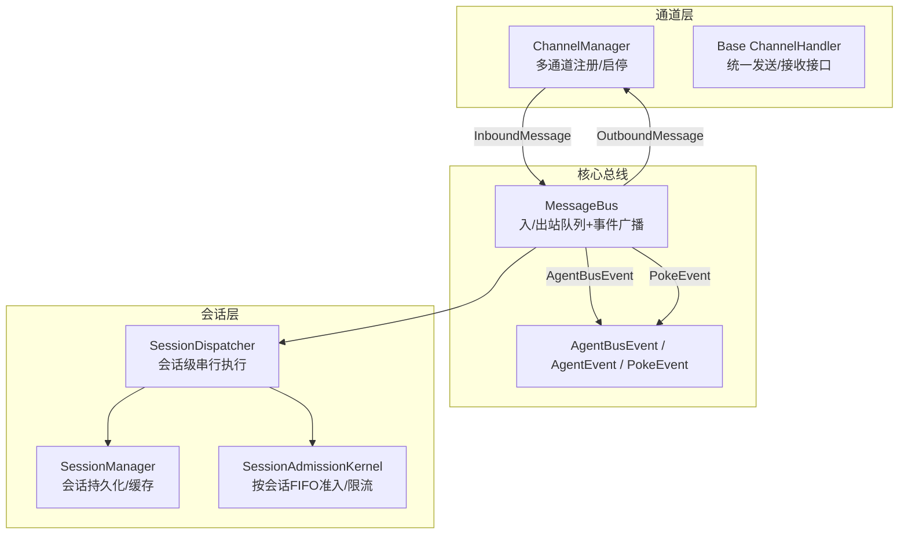
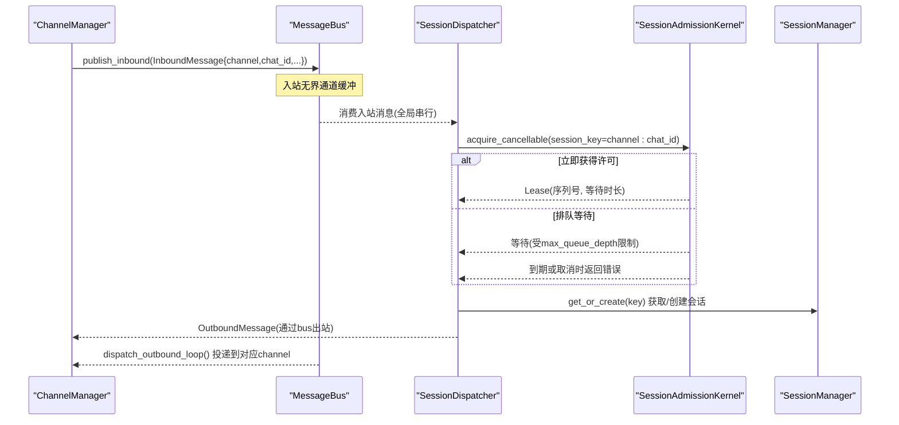
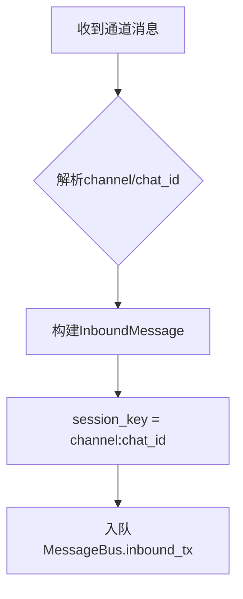
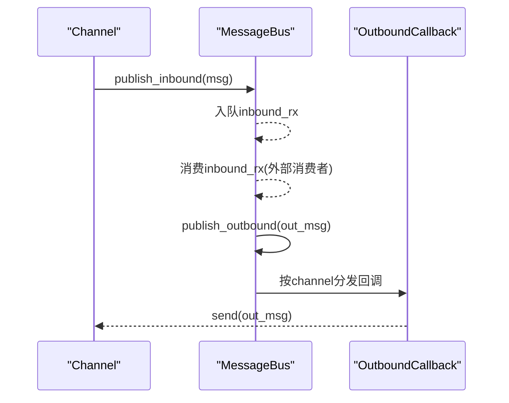
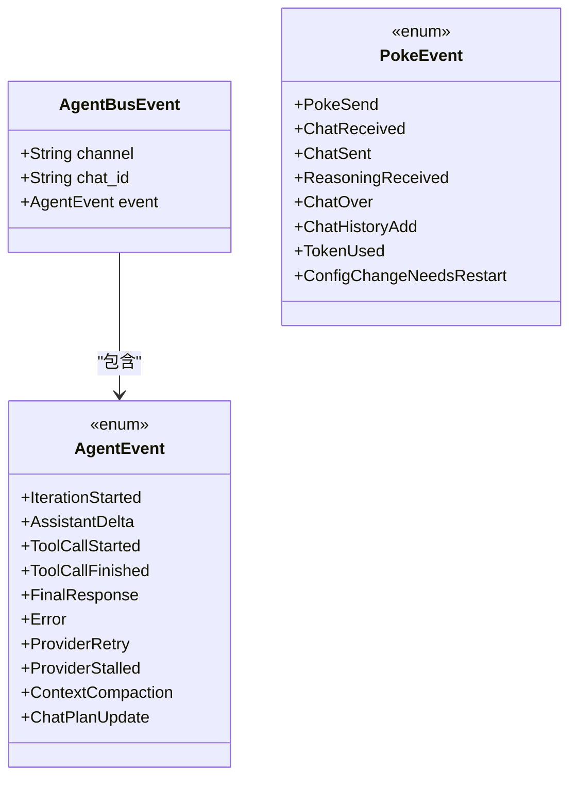
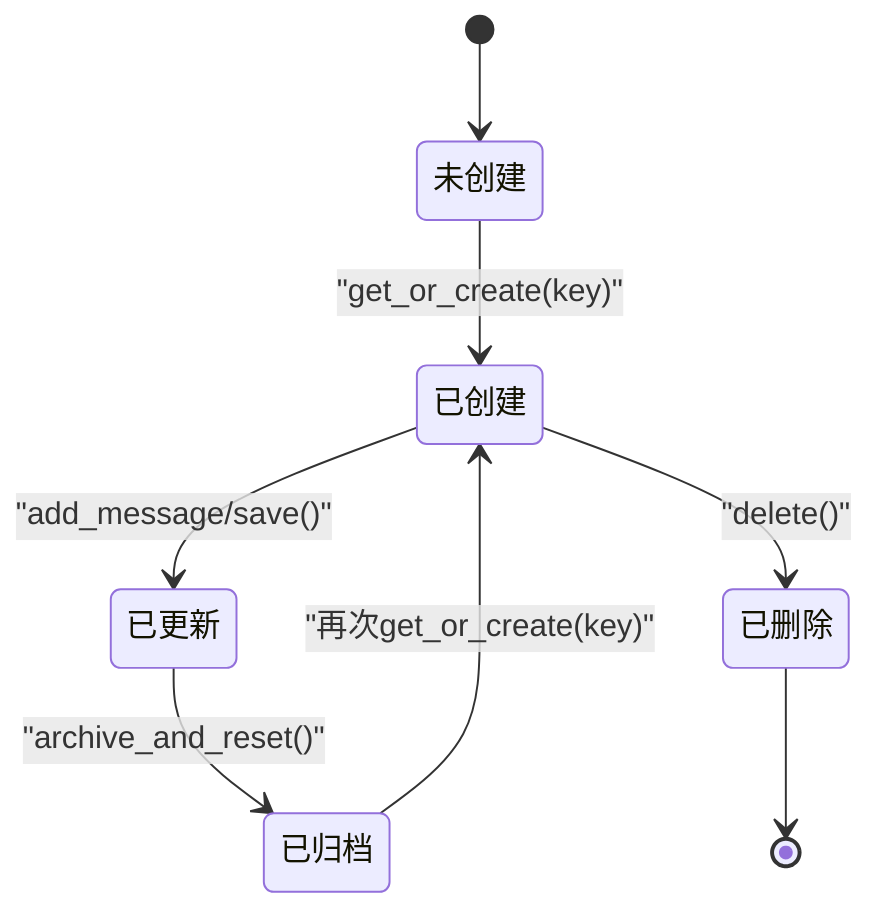
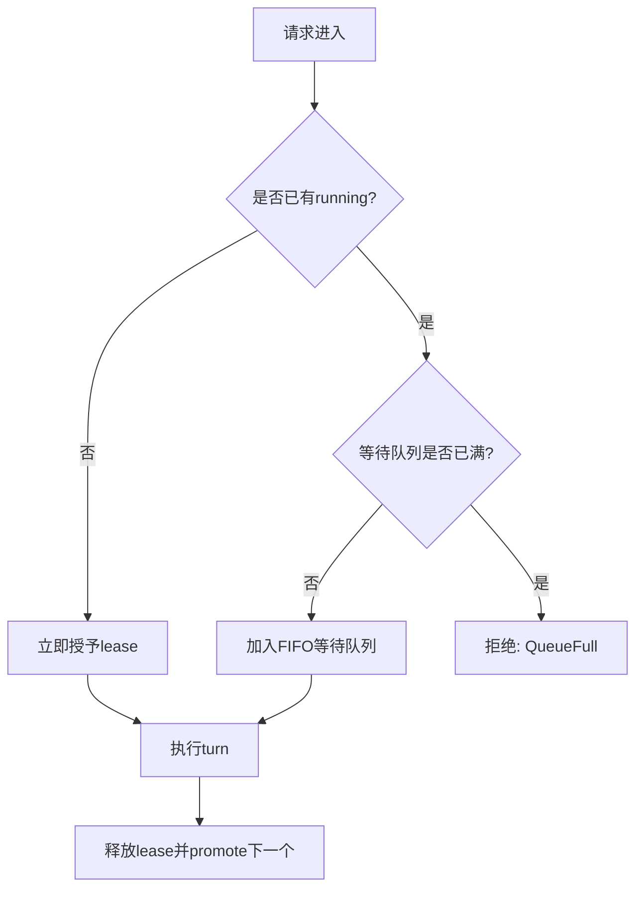
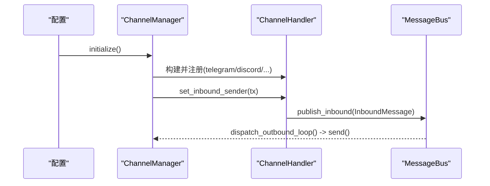
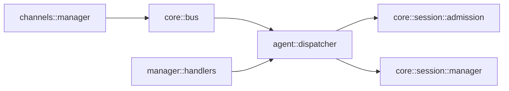

# 消息路由与会话管理

<cite>
**本文引用的文件**
- [agent-diva-core/src/bus/events.rs](file://agent-diva-core/src/bus/events.rs)
- [agent-diva-core/src/bus/queue.rs](file://agent-diva-core/src/bus/queue.rs)
- [agent-diva-core/src/bus/mod.rs](file://agent-diva-core/src/bus/mod.rs)
- [agent-diva-core/src/session/manager.rs](file://agent-diva-core/src/session/manager.rs)
- [agent-diva-core/src/session/admission.rs](file://agent-diva-core/src/session/admission.rs)
- [agent-diva-core/src/session/store.rs](file://agent-diva-core/src/session/store.rs)
- [agent-diva-channels/src/base.rs](file://agent-diva-channels/src/base.rs)
- [agent-diva-channels/src/manager.rs](file://agent-diva-channels/src/manager.rs)
- [agent-diva-agent/src/agent_loop/dispatcher.rs](file://agent-diva-agent/src/agent_loop/dispatcher.rs)
- [agent-diva-manager/src/handlers.rs](file://agent-diva-manager/src/handlers.rs)
- [docs/dev/harness-session-admission/hq00-contract.md](file://docs/dev/harness-session-admission/hq00-contract.md)
</cite>

## 目录
1. [简介](#简介)
2. [项目结构](#项目结构)
3. [核心组件](#核心组件)
4. [架构总览](#架构总览)
5. [详细组件分析](#详细组件分析)
6. [依赖关系分析](#依赖关系分析)
7. [性能考量](#性能考量)
8. [故障排查指南](#故障排查指南)
9. [结论](#结论)
10. [附录：配置与自定义规则示例](#附录：配置与自定义规则示例)

## 简介
本文件聚焦于系统内部的消息路由与会话管理机制，覆盖以下主题：
- 基于 channel 和 chat_id 的路由规则与会话键生成
- 消息队列的处理流程（入队、消费、出队）
- AgentBusEvent 的结构与跨组件事件传递方式
- 会话生命周期管理（创建、更新、销毁）
- 消息优先级处理与并发控制机制
- 路由配置与自定义路由规则的扩展点
- 性能优化建议与故障排查指南

## 项目结构
围绕消息路由与会话管理的代码主要分布在以下模块：
- 核心总线与事件：agent-diva-core/src/bus
- 会话管理与准入：agent-diva-core/src/session
- 通道接入与分发：agent-diva-channels/src
- 会话调度器：agent-diva-agent/src/agent_loop
- 管理器接口：agent-diva-manager/src/handlers.rs

图表来源
- [agent-diva-channels/src/manager.rs:378-642](file://agent-diva-channels/src/manager.rs#L378-L642)
- [agent-diva-core/src/bus/queue.rs:24-184](file://agent-diva-core/src/bus/queue.rs#L24-L184)
- [agent-diva-core/src/bus/events.rs:147-153](file://agent-diva-core/src/bus/events.rs#L147-L153)
- [agent-diva-core/src/session/manager.rs:21-56](file://agent-diva-core/src/session/manager.rs#L21-L56)
- [agent-diva-core/src/session/admission.rs:117-155](file://agent-diva-core/src/session/admission.rs#L117-L155)
- [agent-diva-agent/src/agent_loop/dispatcher.rs:17-88](file://agent-diva-agent/src/agent_loop/dispatcher.rs#L17-L88)

章节来源
- [agent-diva-core/src/bus/mod.rs:1-14](file://agent-diva-core/src/bus/mod.rs#L1-L14)
- [agent-diva-core/src/bus/queue.rs:1-184](file://agent-diva-core/src/bus/queue.rs#L1-L184)
- [agent-diva-core/src/session/manager.rs:1-800](file://agent-diva-core/src/session/manager.rs#L1-L800)
- [agent-diva-core/src/session/admission.rs:1-800](file://agent-diva-core/src/session/admission.rs#L1-L800)
- [agent-diva-channels/src/manager.rs:1-800](file://agent-diva-channels/src/manager.rs#L1-L800)
- [agent-diva-agent/src/agent_loop/dispatcher.rs:1-192](file://agent-diva-agent/src/agent_loop/dispatcher.rs#L1-L192)

## 核心组件
- MessageBus：提供入站/出站无界通道、按 channel 的订阅回调、以及两类事件广播（AgentBusEvent、PokeEvent）。
- InboundMessage/OutboundMessage：封装来自通道的消息与要发往通道的响应。
- AgentBusEvent/AgentEvent/PokeEvent：承载业务事件与生命周期审计事件。
- SessionManager：会话的内存缓存与 JSONL 持久化，支持归档重置、搜索、元数据读写。
- SessionAdmissionKernel：按会话 key 的有界 FIFO 准入内核，限制等待队列深度、超时与空闲回收。
- SessionDispatcher：将会话级串行执行与取消令牌结合，保证同一会话内 turn 顺序执行。
- ChannelManager：根据配置初始化各通道处理器，设置入站发送端，并支持动态更新。

章节来源
- [agent-diva-core/src/bus/queue.rs:24-184](file://agent-diva-core/src/bus/queue.rs#L24-L184)
- [agent-diva-core/src/bus/events.rs:147-153](file://agent-diva-core/src/bus/events.rs#L147-L153)
- [agent-diva-core/src/session/manager.rs:21-56](file://agent-diva-core/src/session/manager.rs#L21-L56)
- [agent-diva-core/src/session/admission.rs:18-40](file://agent-diva-core/src/session/admission.rs#L18-L40)
- [agent-diva-agent/src/agent_loop/dispatcher.rs:17-88](file://agent-diva-agent/src/agent_loop/dispatcher.rs#L17-L88)
- [agent-diva-channels/src/manager.rs:378-642](file://agent-diva-channels/src/manager.rs#L378-L642)

## 架构总览
下图展示从通道到核心再到会话调度的完整链路：

图表来源
- [agent-diva-core/src/bus/queue.rs:95-184](file://agent-diva-core/src/bus/queue.rs#L95-L184)
- [agent-diva-core/src/session/admission.rs:157-243](file://agent-diva-core/src/session/admission.rs#L157-L243)
- [agent-diva-agent/src/agent_loop/dispatcher.rs:51-88](file://agent-diva-agent/src/agent_loop/dispatcher.rs#L51-L88)
- [agent-diva-core/src/session/manager.rs:43-56](file://agent-diva-core/src/session/manager.rs#L43-L56)

## 详细组件分析

### 消息路由与会话键
- 会话键规范：canonical session key 为 channel:chat_id。例如 telegram:123、discord:abc。
- InboundMessage.session_key() 直接拼接 channel 与 chat_id，作为后续会话定位的唯一标识。
- 通道侧在构造 InboundMessage 时携带 channel、sender_id、chat_id、content、media、metadata。
- 出站消息 OutboundMessage 包含 channel、chat_id、content、reply_to、media、reasoning_content、metadata。

图表来源
- [agent-diva-core/src/bus/events.rs:155-213](file://agent-diva-core/src/bus/events.rs#L155-L213)
- [agent-diva-core/src/bus/events.rs:342-359](file://agent-diva-core/src/bus/events.rs#L342-L359)
- [agent-diva-core/src/session/store.rs:58-69](file://agent-diva-core/src/session/store.rs#L58-L69)

章节来源
- [agent-diva-core/src/bus/events.rs:155-213](file://agent-diva-core/src/bus/events.rs#L155-L213)
- [agent-diva-core/src/bus/events.rs:342-359](file://agent-diva-core/src/bus/events.rs#L342-L359)
- [agent-diva-core/src/session/store.rs:58-69](file://agent-diva-core/src/session/store.rs#L58-L69)

### 消息队列处理流程
- MessageBus 使用两个无界 mpsc 通道分别承载 inbound/outbound。
- 出站通过 subscribe_outbound(channel, callback) 注册回调，dispatch_outbound_loop 后台任务按 channel 分发给订阅者。
- 事件通过 broadcast 通道发布 AgentBusEvent 与 PokeEvent，支持多订阅者独立接收。

图表来源
- [agent-diva-core/src/bus/queue.rs:95-184](file://agent-diva-core/src/bus/queue.rs#L95-L184)

章节来源
- [agent-diva-core/src/bus/queue.rs:95-184](file://agent-diva-core/src/bus/queue.rs#L95-L184)

### AgentBusEvent 结构与事件传递
- AgentBusEvent 包裹 channel、chat_id 与具体 event（AgentEvent），用于带上下文的业务事件广播。
- AgentEvent 包含迭代、增量文本、工具调用、计划状态、最终响应、错误、重试、停滞、上下文压缩等事件类型。
- PokeEvent 用于生命周期与审计事件，如发送/接收、完成、历史追加、Token 消耗、配置变更需重启等。
- MessageBus.publish_event 将 AgentEvent 包装为 AgentBusEvent 后广播；publish_poke_event 单独广播 PokeEvent。

图表来源
- [agent-diva-core/src/bus/events.rs:59-153](file://agent-diva-core/src/bus/events.rs#L59-L153)
- [agent-diva-core/src/bus/events.rs:361-394](file://agent-diva-core/src/bus/events.rs#L361-L394)
- [agent-diva-core/src/bus/queue.rs:61-93](file://agent-diva-core/src/bus/queue.rs#L61-L93)

章节来源
- [agent-diva-core/src/bus/events.rs:59-153](file://agent-diva-core/src/bus/events.rs#L59-L153)
- [agent-diva-core/src/bus/events.rs:361-394](file://agent-diva-core/src/bus/events.rs#L361-L394)
- [agent-diva-core/src/bus/queue.rs:61-93](file://agent-diva-core/src/bus/queue.rs#L61-L93)

### 会话生命周期管理
- 会话键：channel:chat_id。
- 创建：SessionManager.get_or_create(key) 若不存在则加载或新建，并放入内存缓存。
- 更新：写入会话消息与元数据后，save() 原子替换 JSONL 文件，确保一致性。
- 销毁：delete() 删除文件并从缓存移除；archive_and_reset() 归档当前文件并清空内存以开启新会话。
- 子会话：get_or_create_child() 显式建立分支/子代理/临时会话，维护 root/parent/branch_label 等元数据。

图表来源
- [agent-diva-core/src/session/manager.rs:43-109](file://agent-diva-core/src/session/manager.rs#L43-L109)
- [agent-diva-core/src/session/manager.rs:190-289](file://agent-diva-core/src/session/manager.rs#L190-L289)

章节来源
- [agent-diva-core/src/session/manager.rs:43-109](file://agent-diva-core/src/session/manager.rs#L43-L109)
- [agent-diva-core/src/session/manager.rs:190-289](file://agent-diva-core/src/session/manager.rs#L190-L289)

### 消息优先级与并发控制
- 会话级串行：SessionDispatcher 基于 SessionAdmissionKernel 对每个 session_key 进行串行化，保证同一会话内的 turn 严格 FIFO。
- 有界队列：SessionAdmissionLimits.max_queue_depth 限制等待 turn 数量；超出则拒绝新请求。
- 超时与取消：wait_timeout 控制等待上限；CancellationToken 支持单个请求取消；cancel_waiters 可批量取消某会话的等待项。
- 空闲回收：idle_ttl 控制空闲 slot 的回收时间，避免资源泄漏。
- 全局并发：不同 session_key 之间可并行执行；同一 session_key 仅一个 running turn。

图表来源
- [agent-diva-core/src/session/admission.rs:157-243](file://agent-diva-core/src/session/admission.rs#L157-L243)
- [agent-diva-core/src/session/admission.rs:553-623](file://agent-diva-core/src/session/admission.rs#L553-L623)
- [agent-diva-agent/src/agent_loop/dispatcher.rs:51-88](file://agent-diva-agent/src/agent_loop/dispatcher.rs#L51-L88)

章节来源
- [agent-diva-core/src/session/admission.rs:18-40](file://agent-diva-core/src/session/admission.rs#L18-L40)
- [agent-diva-core/src/session/admission.rs:157-243](file://agent-diva-core/src/session/admission.rs#L157-L243)
- [agent-diva-core/src/session/admission.rs:553-623](file://agent-diva-core/src/session/admission.rs#L553-L623)
- [agent-diva-agent/src/agent_loop/dispatcher.rs:51-88](file://agent-diva-agent/src/agent_loop/dispatcher.rs#L51-L88)

### 通道路由与配置
- ChannelManager 根据配置启用各通道处理器，并为每个通道设置 inbound_tx，使其能将消息发送到 MessageBus。
- 通道校验：检查 enabled 与必填字段，缺失则跳过并记录日志。
- 动态更新：update_channel 支持运行时停止旧处理器、重建并启动新处理器。
- 出站路由：通过 MessageBus.subscribe_outbound(channel, callback) 将 OutboundMessage 投递给对应通道处理器。

图表来源
- [agent-diva-channels/src/manager.rs:378-642](file://agent-diva-channels/src/manager.rs#L378-L642)
- [agent-diva-channels/src/base.rs:9-32](file://agent-diva-channels/src/base.rs#L9-L32)
- [agent-diva-core/src/bus/queue.rs:119-184](file://agent-diva-core/src/bus/queue.rs#L119-L184)

章节来源
- [agent-diva-channels/src/manager.rs:378-642](file://agent-diva-channels/src/manager.rs#L378-L642)
- [agent-diva-channels/src/base.rs:9-32](file://agent-diva-channels/src/base.rs#L9-L32)
- [agent-diva-core/src/bus/queue.rs:119-184](file://agent-diva-core/src/bus/queue.rs#L119-L184)

### 管理器接口与会话删除
- HTTP 接口触发删除会话：handlers 中 do_delete_session 将 DeleteSession 命令发送至 manager，并返回结果。
- 该流程体现了上层 API 到内部会话管理的解耦通信。

章节来源
- [agent-diva-manager/src/handlers.rs:463-505](file://agent-diva-manager/src/handlers.rs#L463-L505)

## 依赖关系分析
- 通道层依赖 core 的 bus 事件与消息类型，负责将外部消息转换为 InboundMessage 并推送到 MessageBus。
- 核心总线不关心通道实现细节，只负责消息与事件的转发。
- 会话管理层依赖 core 的 session 模块，提供会话持久化与缓存。
- 调度器依赖 admission 内核，保证会话级串行与并发隔离。
- 管理器通过命令模式与内部服务交互，保持边界清晰。

图表来源
- [agent-diva-channels/src/manager.rs:378-642](file://agent-diva-channels/src/manager.rs#L378-L642)
- [agent-diva-core/src/bus/queue.rs:24-184](file://agent-diva-core/src/bus/queue.rs#L24-L184)
- [agent-diva-agent/src/agent_loop/dispatcher.rs:17-88](file://agent-diva-agent/src/agent_loop/dispatcher.rs#L17-L88)
- [agent-diva-core/src/session/admission.rs:117-155](file://agent-diva-core/src/session/admission.rs#L117-L155)
- [agent-diva-core/src/session/manager.rs:21-56](file://agent-diva-core/src/session/manager.rs#L21-L56)
- [agent-diva-manager/src/handlers.rs:463-505](file://agent-diva-manager/src/handlers.rs#L463-L505)

章节来源
- [agent-diva-channels/src/manager.rs:378-642](file://agent-diva-channels/src/manager.rs#L378-L642)
- [agent-diva-core/src/bus/queue.rs:24-184](file://agent-diva-core/src/bus/queue.rs#L24-L184)
- [agent-diva-agent/src/agent_loop/dispatcher.rs:17-88](file://agent-diva-agent/src/agent_loop/dispatcher.rs#L17-L88)
- [agent-diva-core/src/session/admission.rs:117-155](file://agent-diva-core/src/session/admission.rs#L117-L155)
- [agent-diva-core/src/session/manager.rs:21-56](file://agent-diva-core/src/session/manager.rs#L21-L56)
- [agent-diva-manager/src/handlers.rs:463-505](file://agent-diva-manager/src/handlers.rs#L463-L505)

## 性能考量
- 入/出站使用无界通道，适合高吞吐场景，但需注意背压策略与下游处理能力，避免内存膨胀。
- 会话级串行与有界队列防止单会话阻塞影响其他会话，同时保护后端资源。
- 空闲 slot 回收减少长期驻留的内存占用。
- 出站回调异步派发，避免阻塞主循环。
- 事件广播容量有限（默认1024），注意丢弃策略与监控告警。

[本节为通用性能指导，无需特定文件引用]

## 故障排查指南
- 通道未配置或缺失字段：ChannelManager 会跳过并记录日志，检查配置中的 enabled 与必填字段。
- 会话队列满：当达到 max_queue_depth 时新请求被拒绝，需调整队列深度或优化上游速率。
- 等待超时：超过 wait_timeout 的请求将被取消，检查后端响应时间与队列长度。
- 会话无法删除：确认会话 key 格式正确，且路径存在；必要时先归档再重置。
- 事件未收到：确认订阅了正确的通道（AgentBusEvent 或 PokeEvent），并检查广播通道是否有消费者。

章节来源
- [agent-diva-channels/src/manager.rs:198-211](file://agent-diva-channels/src/manager.rs#L198-L211)
- [agent-diva-core/src/session/admission.rs:53-79](file://agent-diva-core/src/session/admission.rs#L53-L79)
- [agent-diva-core/src/session/manager.rs:260-289](file://agent-diva-core/src/session/manager.rs#L260-L289)
- [agent-diva-core/src/bus/queue.rs:61-93](file://agent-diva-core/src/bus/queue.rs#L61-L93)

## 结论
该系统通过 MessageBus 实现了通道与核心的解耦，利用会话键 channel:chat_id 精确路由消息，并通过 SessionAdmissionKernel 保障会话级串行与并发安全。SessionManager 提供健壮的会话生命周期管理，ChannelManager 支持多通道动态配置与热更新。整体设计兼顾可扩展性、可观测性与稳定性，适用于复杂的多通道聊天场景。

[本节为总结性内容，无需特定文件引用]

## 附录：配置与自定义规则示例
- 通道配置：在 Config 中启用相应通道并填写必填字段，ChannelManager 会在 initialize 时自动构建并启动。
- 自定义路由规则：可通过 MessageBus.subscribe_outbound(channel, callback) 为特定 channel 注册自定义处理逻辑，实现差异化路由。
- 会话准入参数：参考 HQ-00 契约中的默认值与含义，合理设置 max_queue_depth、wait_timeout、idle_ttl。

章节来源
- [agent-diva-channels/src/manager.rs:378-642](file://agent-diva-channels/src/manager.rs#L378-L642)
- [agent-diva-core/src/bus/queue.rs:119-184](file://agent-diva-core/src/bus/queue.rs#L119-L184)
- [docs/dev/harness-session-admission/hq00-contract.md:20-33](file://docs/dev/harness-session-admission/hq00-contract.md#L20-L33)