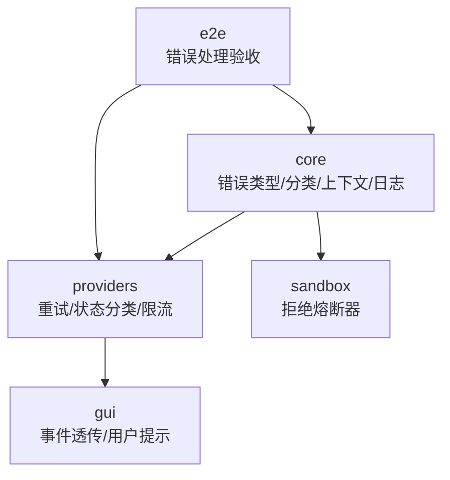
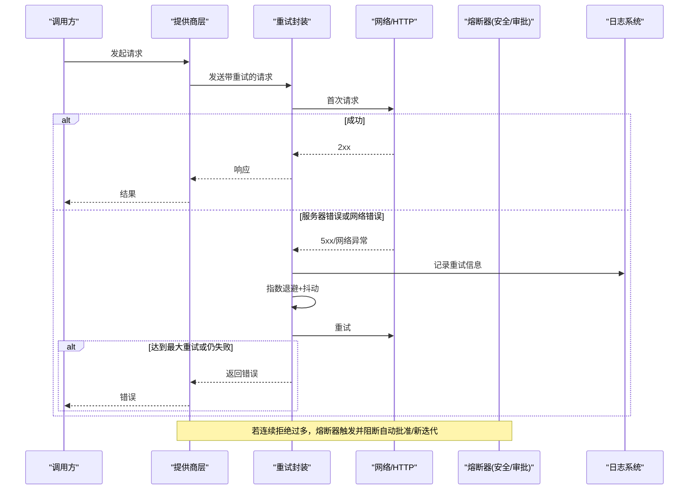
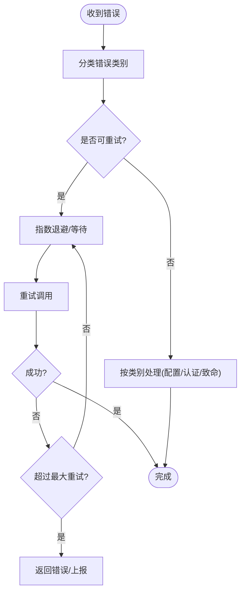
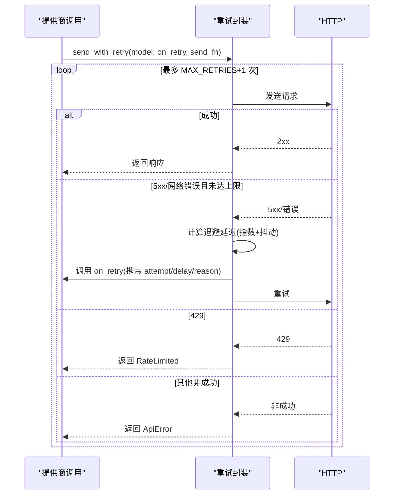
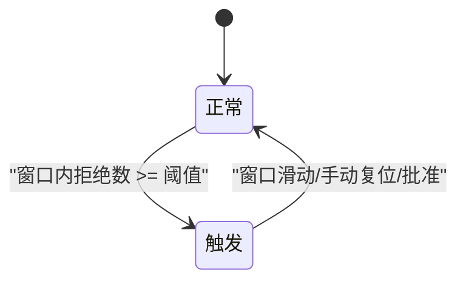
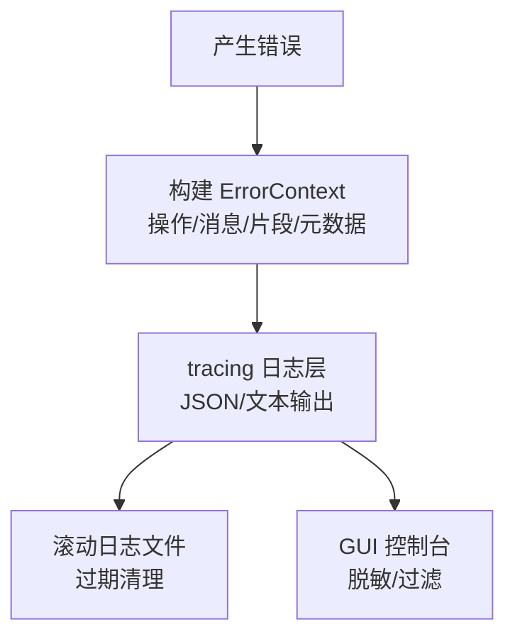
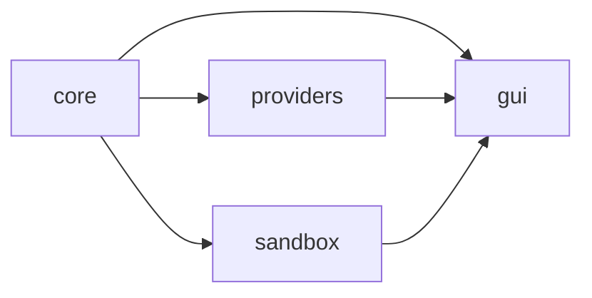
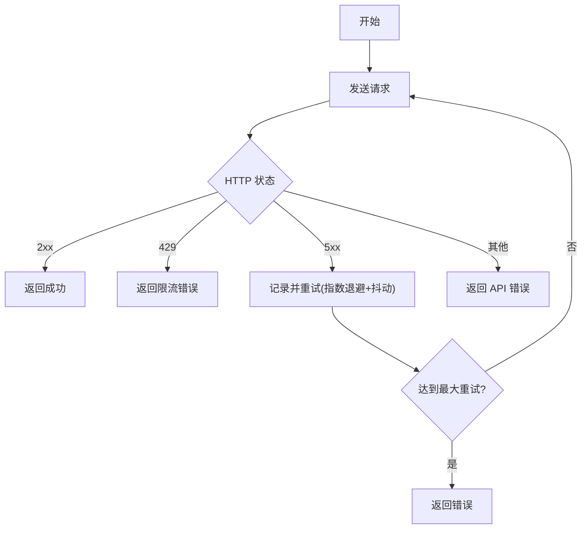

# 错误处理与恢复

<cite>
**本文引用的文件**
- [agent-diva-core/src/error.rs](file://agent-diva-core/src/error.rs)
- [agent-diva-core/src/error_category.rs](file://agent-diva-core/src/error_category.rs)
- [agent-diva-core/src/error_context.rs](file://agent-diva-core/src/error_context.rs)
- [agent-diva-providers/src/retry.rs](file://agent-diva-providers/src/retry.rs)
- [agent-diva-providers/src/base.rs](file://agent-diva-providers/src/base.rs)
- [agent-diva-sandbox/src/guardian.rs](file://agent-diva-sandbox/src/guardian.rs)
- [agent-diva-core/src/security/rejection_circuit.rs](file://agent-diva-core/src/security/rejection_circuit.rs)
- [agent-diva-core/src/logging.rs](file://agent-diva-core/src/logging.rs)
- [agent-diva-gui/src-tauri/src/commands.rs](file://agent-diva-gui/src-tauri/src/commands.rs)
- [agent-diva-e2e/tests/error_handling_test.rs](file://agent-diva-e2e/tests/error_handling_test.rs)
</cite>

## 目录
1. [简介](#简介)
2. [项目结构](#项目结构)
3. [核心组件](#核心组件)
4. [架构总览](#架构总览)
5. [详细组件分析](#详细组件分析)
6. [依赖关系分析](#依赖关系分析)
7. [性能考量](#性能考量)
8. [故障排查指南](#故障排查指南)
9. [结论](#结论)
10. [附录](#附录)

## 简介
本文件聚焦 Agent-Diva 的错误处理与恢复策略，覆盖分层错误分类、网络与 LLM 提供商错误、工具执行错误的处理路径；说明重试机制（指数退避、最大重试次数、失败条件判断）；阐述熔断器模式在安全审批与模型迭代中的使用；解释错误上下文传播与日志记录；给出优雅降级策略与监控告警建议；并提供错误处理流程图与典型故障恢复场景。

## 项目结构
错误处理相关能力分布在多个 crate：
- core：统一错误类型、错误分类、错误上下文、日志初始化与保留清理。
- providers：LLM 提供商 HTTP 请求的重试、状态码分类、速率限制处理。
- sandbox：基于拒绝次数的熔断器，保护系统免受级联故障。
- gui：将后端错误事件透传到前端，便于用户可见的提示与重试展示。
- e2e：端到端验证“工具错误不导致崩溃”的行为。

图表来源
- [agent-diva-core/src/error.rs:1-73](file://agent-diva-core/src/error.rs#L1-L73)
- [agent-diva-core/src/error_category.rs:1-197](file://agent-diva-core/src/error_category.rs#L1-L197)
- [agent-diva-core/src/error_context.rs:1-222](file://agent-diva-core/src/error_context.rs#L1-L222)
- [agent-diva-providers/src/retry.rs:1-316](file://agent-diva-providers/src/retry.rs#L1-L316)
- [agent-diva-sandbox/src/guardian.rs:490-689](file://agent-diva-sandbox/src/guardian.rs#L490-L689)
- [agent-diva-gui/src-tauri/src/commands.rs:2897-2923](file://agent-diva-gui/src-tauri/src/commands.rs#L2897-L2923)
- [agent-diva-e2e/tests/error_handling_test.rs:1-76](file://agent-diva-e2e/tests/error_handling_test.rs#L1-L76)

章节来源
- [agent-diva-core/src/error.rs:1-73](file://agent-diva-core/src/error.rs#L1-L73)
- [agent-diva-core/src/error_category.rs:1-197](file://agent-diva-core/src/error_category.rs#L1-L197)
- [agent-diva-core/src/error_context.rs:1-222](file://agent-diva-core/src/error_context.rs#L1-L222)
- [agent-diva-providers/src/retry.rs:1-316](file://agent-diva-providers/src/retry.rs#L1-L316)
- [agent-diva-sandbox/src/guardian.rs:490-689](file://agent-diva-sandbox/src/guardian.rs#L490-L689)
- [agent-diva-gui/src-tauri/src/commands.rs:2897-2923](file://agent-diva-gui/src-tauri/src/commands.rs#L2897-L2923)
- [agent-diva-e2e/tests/error_handling_test.rs:1-76](file://agent-diva-e2e/tests/error_handling_test.rs#L1-L76)

## 核心组件
- 统一错误类型与分类：core 提供通用错误枚举与跨 crate 的分类 trait，使上层可依据“可重试/致命/配置/认证/超时/未知”做一致决策。
- 错误上下文：捕获操作名、错误消息、问题片段与元数据，便于定位根因。
- 提供商重试：providers 实现指数退避重试、抖动、最大重试次数、HTTP 状态分类与速率限制处理。
- 熔断器：sandbox 与安全模块分别提供“拒绝熔断器”，防止连续拒绝导致的级联故障。
- 日志与保留：core 初始化结构化日志、按日滚动、过期清理；GUI 侧对敏感信息进行脱敏显示。
- 端到端验证：e2e 用例确保工具错误不会导致 Agent 崩溃。

章节来源
- [agent-diva-core/src/error.rs:1-73](file://agent-diva-core/src/error.rs#L1-L73)
- [agent-diva-core/src/error_category.rs:1-197](file://agent-diva-core/src/error_category.rs#L1-L197)
- [agent-diva-core/src/error_context.rs:1-222](file://agent-diva-core/src/error_context.rs#L1-L222)
- [agent-diva-providers/src/retry.rs:1-316](file://agent-diva-providers/src/retry.rs#L1-L316)
- [agent-diva-sandbox/src/guardian.rs:490-689](file://agent-diva-sandbox/src/guardian.rs#L490-L689)
- [agent-diva-core/src/logging.rs:1-250](file://agent-diva-core/src/logging.rs#L1-L250)
- [agent-diva-e2e/tests/error_handling_test.rs:1-76](file://agent-diva-e2e/tests/error_handling_test.rs#L1-L76)

## 架构总览
下图展示了从调用方到提供商、再到熔断器与日志的全链路错误处理流程。

图表来源
- [agent-diva-providers/src/retry.rs:86-181](file://agent-diva-providers/src/retry.rs#L86-L181)
- [agent-diva-providers/src/base.rs:34-67](file://agent-diva-providers/src/base.rs#L34-L67)
- [agent-diva-sandbox/src/guardian.rs:490-689](file://agent-diva-sandbox/src/guardian.rs#L490-L689)
- [agent-diva-core/src/logging.rs:10-114](file://agent-diva-core/src/logging.rs#L10-L114)

## 详细组件分析

### 分层错误分类与传播
- 统一错误类型：core 定义通用错误枚举，涵盖配置、I/O、序列化、会话、通道、提供商、工具、校验、未找到、未授权、内部错误等。
- 错误分类：通过 CategorizeError trait 将具体错误映射为 Retryable/Fatal/Config/Auth/Timeout/Unknown，供上层决定重试或终止。
- 提供商错误分类：base 中将 HTTP 错误、JSON 解析、无效响应、API 错误、配置错误、限流进行分类，并将 API 错误中的超时/特定状态码归为 Timeout 或 Retryable。
- 传播方式：上层根据 category().is_retryable() 决定是否重试；对 Fatal/Config/Auth 直接短路或提示。

图表来源
- [agent-diva-core/src/error_category.rs:1-197](file://agent-diva-core/src/error_category.rs#L1-L197)
- [agent-diva-providers/src/base.rs:34-67](file://agent-diva-providers/src/base.rs#L34-L67)
- [agent-diva-providers/src/retry.rs:86-181](file://agent-diva-providers/src/retry.rs#L86-L181)

章节来源
- [agent-diva-core/src/error.rs:1-73](file://agent-diva-core/src/error.rs#L1-L73)
- [agent-diva-core/src/error_category.rs:1-197](file://agent-diva-core/src/error_category.rs#L1-L197)
- [agent-diva-providers/src/base.rs:1-200](file://agent-diva-providers/src/base.rs#L1-L200)

### 重试机制：指数退避、最大重试、失败条件
- 最大重试次数：默认额外重试 3 次（含初始请求共 4 次）。
- 指数退避与抖动：基础延迟 1s，每次翻倍，附加 ±20% 抖动避免惊群。
- 失败条件：
  - HTTP 429：立即返回 RateLimited，不重试。
  - HTTP 5xx：视为可重试，继续重试。
  - 其他非成功：直接返回 ApiError。
  - 网络错误：在达到最大重试前重试。
- 回调通知：支持 on_retry 监听每次重试，便于 GUI 展示进度。

图表来源
- [agent-diva-providers/src/retry.rs:17-181](file://agent-diva-providers/src/retry.rs#L17-L181)

章节来源
- [agent-diva-providers/src/retry.rs:17-181](file://agent-diva-providers/src/retry.rs#L17-L181)

### 熔断器模式：防止级联故障
- 安全审批熔断器（sandbox）：
  - 滑动窗口统计拒绝次数，超过阈值则触发，阻止自动批准或将延期转为需人工批准。
  - 成功批准会清空计数并重置熔断状态。
  - 可在手动复位后恢复。
- 模型迭代熔断器（core 安全模块）：
  - 基于滑动窗口的 ActionTracker 统计 provider 拒绝失败（如限流、上下文长度、鉴权等），超过阈值则拒绝启动新的模型迭代，避免死循环/风暴。
  - 支持查询当前拒绝计数、重置。

图表来源
- [agent-diva-sandbox/src/guardian.rs:490-689](file://agent-diva-sandbox/src/guardian.rs#L490-L689)
- [agent-diva-core/src/security/rejection_circuit.rs:1-130](file://agent-diva-core/src/security/rejection_circuit.rs#L1-L130)

章节来源
- [agent-diva-sandbox/src/guardian.rs:490-689](file://agent-diva-sandbox/src/guardian.rs#L490-L689)
- [agent-diva-core/src/security/rejection_circuit.rs:1-130](file://agent-diva-core/src/security/rejection_circuit.rs#L1-L130)

### 错误上下文传播与日志记录
- 错误上下文：
  - 记录操作名、错误消息、问题内容片段（截断至安全长度）、元数据键值对。
  - 提供查找问题字符、转义显示等辅助函数，便于定位编码/控制字符等问题。
- 日志系统：
  - 支持环境变量与配置文件设置日志级别与格式（文本/JSON）。
  - 按日滚动写入文件，支持清理过期日志。
  - GUI 控制台对日志进行脱敏（隐藏 API key、token、password、secret、bearer 等）。
- GUI 事件透传：
  - 后台流错误事件通过 Tauri 命令转发到前端，用于展示 provider 重试、停滞等状态。

图表来源
- [agent-diva-core/src/error_context.rs:1-222](file://agent-diva-core/src/error_context.rs#L1-L222)
- [agent-diva-core/src/logging.rs:10-114](file://agent-diva-core/src/logging.rs#L10-L114)
- [agent-diva-gui/src-tauri/src/commands.rs:2897-2923](file://agent-diva-gui/src-tauri/src/commands.rs#L2897-L2923)

章节来源
- [agent-diva-core/src/error_context.rs:1-222](file://agent-diva-core/src/error_context.rs#L1-L222)
- [agent-diva-core/src/logging.rs:1-250](file://agent-diva-core/src/logging.rs#L1-L250)
- [agent-diva-gui/src-tauri/src/commands.rs:2897-2923](file://agent-diva-gui/src-tauri/src/commands.rs#L2897-L2923)

### 优雅降级策略
- 部分组件故障时的基本功能保持：
  - 当提供商限流或不可用时，重试后仍失败则返回明确错误，避免阻塞主流程；必要时可降级为本地缓存或只读模式（由上层策略决定）。
  - 熔断器触发时，阻止自动批准或新迭代，转为人工介入或延迟执行，保证系统稳定。
  - GUI 在后台流错误时仍可继续交互，仅提示重试/停滞状态。
- 工具执行错误：
  - e2e 测试验证读取不存在文件时，Agent 返回友好错误而非崩溃，体现“工具错误不中断整体流程”的降级思路。

章节来源
- [agent-diva-providers/src/retry.rs:86-181](file://agent-diva-providers/src/retry.rs#L86-L181)
- [agent-diva-sandbox/src/guardian.rs:490-689](file://agent-diva-sandbox/src/guardian.rs#L490-L689)
- [agent-diva-e2e/tests/error_handling_test.rs:1-76](file://agent-diva-e2e/tests/error_handling_test.rs#L1-L76)

### 错误监控与告警配置建议
- 日志采集：
  - 启用 JSON 格式以便结构化解析；按日滚动并配置保留天数。
  - 在 GUI 控制台过滤日志级别并脱敏敏感字段。
- 指标与事件：
  - 利用重试监听器收集重试次数、延迟、原因，作为监控指标。
  - 熔断器触发事件可作为告警信号（频繁触发意味着上游不稳定）。
- 告警规则建议：
  - 高比例 429/5xx 错误率。
  - 熔断器触发频率超过阈值。
  - 重试次数超过上限的比例升高。
  - 日志中持续出现特定错误模式（如超时、鉴权失败）。

章节来源
- [agent-diva-core/src/logging.rs:10-114](file://agent-diva-core/src/logging.rs#L10-L114)
- [agent-diva-providers/src/retry.rs:23-47](file://agent-diva-providers/src/retry.rs#L23-L47)
- [agent-diva-sandbox/src/guardian.rs:502-589](file://agent-diva-sandbox/src/guardian.rs#L502-L589)

## 依赖关系分析
- core 被 providers、sandbox、gui 等模块引用，提供错误类型、分类、上下文与日志。
- providers 依赖 core 的错误分类以统一重试策略。
- sandbox 的安全熔断器独立于 providers，但可与上层错误分类配合使用。
- gui 通过 Tauri 命令接收后端错误事件，负责展示与用户交互。

图表来源
- [agent-diva-core/src/error.rs:1-73](file://agent-diva-core/src/error.rs#L1-L73)
- [agent-diva-providers/src/base.rs:34-67](file://agent-diva-providers/src/base.rs#L34-L67)
- [agent-diva-sandbox/src/guardian.rs:490-689](file://agent-diva-sandbox/src/guardian.rs#L490-L689)
- [agent-diva-gui/src-tauri/src/commands.rs:2897-2923](file://agent-diva-gui/src-tauri/src/commands.rs#L2897-L2923)

章节来源
- [agent-diva-core/src/error.rs:1-73](file://agent-diva-core/src/error.rs#L1-L73)
- [agent-diva-providers/src/base.rs:34-67](file://agent-diva-providers/src/base.rs#L34-L67)
- [agent-diva-sandbox/src/guardian.rs:490-689](file://agent-diva-sandbox/src/guardian.rs#L490-L689)
- [agent-diva-gui/src-tauri/src/commands.rs:2897-2923](file://agent-diva-gui/src-tauri/src/commands.rs#L2897-L2923)

## 性能考量
- 重试开销：指数退避可有效降低瞬时压力，抖动避免惊群；注意最大重试次数与延迟总和，避免长时间阻塞。
- 熔断器成本：滑动窗口统计与阈值检查为轻量操作，适合高频调用。
- 日志写入：非阻塞写入与滚动策略减少 I/O 影响；合理设置保留天数避免磁盘膨胀。
- GUI 渲染：错误事件与日志脱敏在前端进行，避免阻塞主线程。

## 故障排查指南
- 快速定位：
  - 查看结构化日志，关注错误类别与上下文（操作名、问题片段、元数据）。
  - 检查重试监听器记录的重试次数与延迟，确认是否达到上限。
  - 观察熔断器状态，确认是否触发及触发原因。
- 常见场景：
  - 提供商限流（429）：检查 Retry-After 与配额，适当降低请求频率。
  - 服务器错误（5xx）：确认服务健康，观察重试是否收敛。
  - 鉴权失败：检查密钥与权限配置，避免重复重试。
  - 工具错误：确认工具输入合法性与外部依赖可用性。
- 恢复步骤：
  - 临时降级：关闭非必要功能，保留核心流程。
  - 重置熔断器：在确认上游恢复后手动复位。
  - 清理日志：按保留策略清理旧日志，释放空间。

章节来源
- [agent-diva-core/src/error_context.rs:1-222](file://agent-diva-core/src/error_context.rs#L1-L222)
- [agent-diva-providers/src/retry.rs:86-181](file://agent-diva-providers/src/retry.rs#L86-L181)
- [agent-diva-sandbox/src/guardian.rs:502-589](file://agent-diva-sandbox/src/guardian.rs#L502-L589)
- [agent-diva-core/src/logging.rs:116-163](file://agent-diva-core/src/logging.rs#L116-L163)

## 结论
本项目通过统一的错误分类、稳健的重试机制、熔断器保护、丰富的错误上下文与结构化日志，构建了分层且可观测的错误处理体系。结合 GUI 的事件透传与 e2e 验证，系统在部分组件故障时仍能保持基本功能，并为监控告警提供了充分的数据基础。建议在运行环境中合理配置日志保留、重试参数与熔断阈值，以实现稳定性与性能的平衡。

## 附录
- 典型错误处理流程图（代码级）：

图表来源
- [agent-diva-providers/src/retry.rs:86-181](file://agent-diva-providers/src/retry.rs#L86-L181)