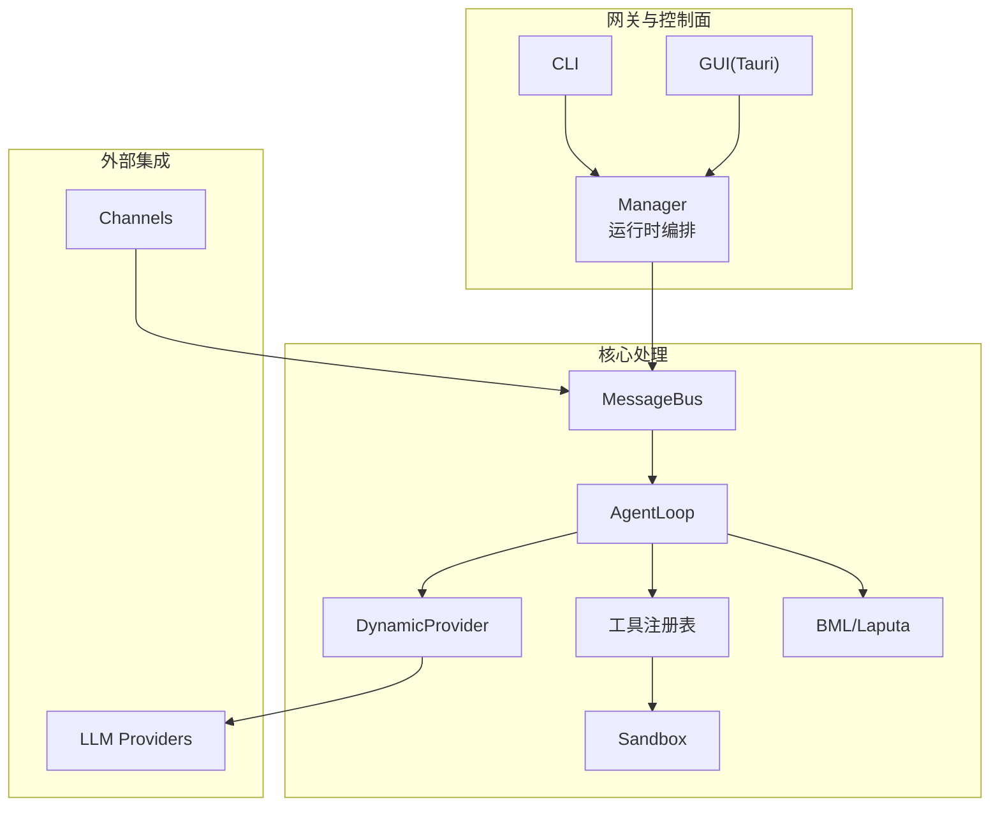
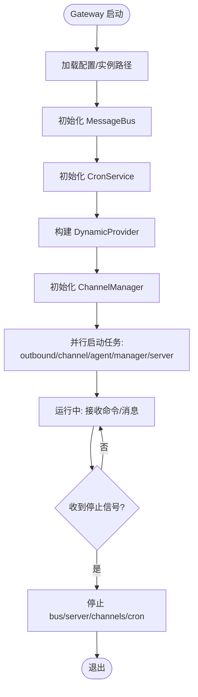
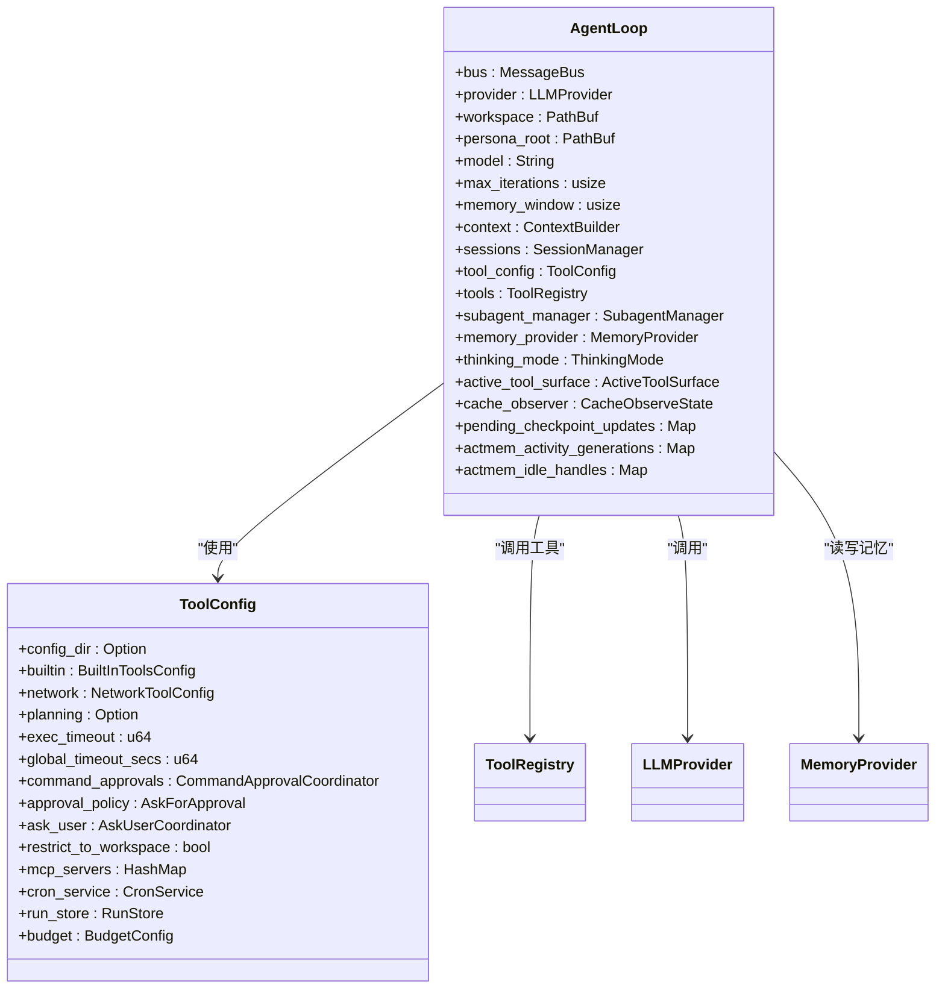
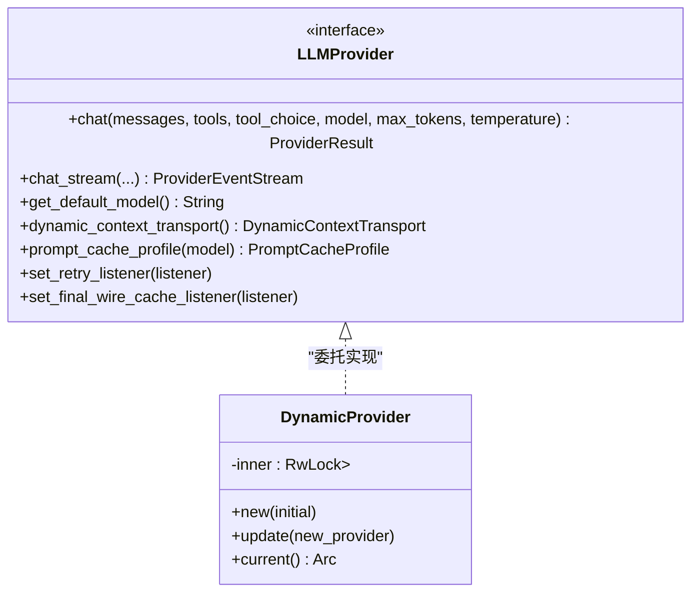
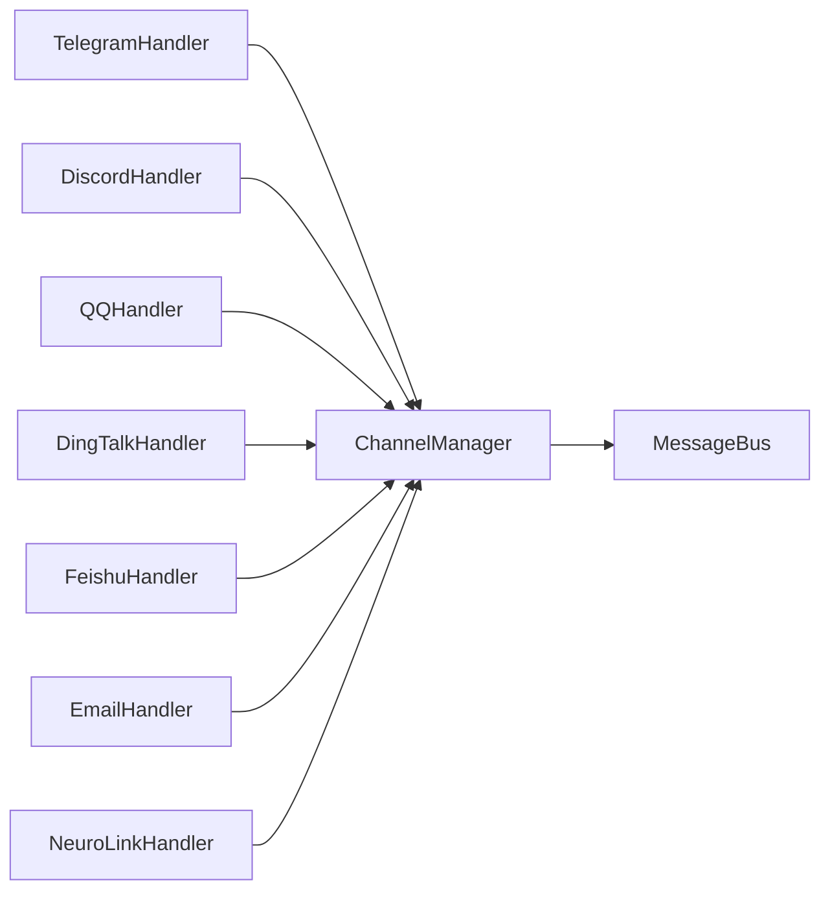
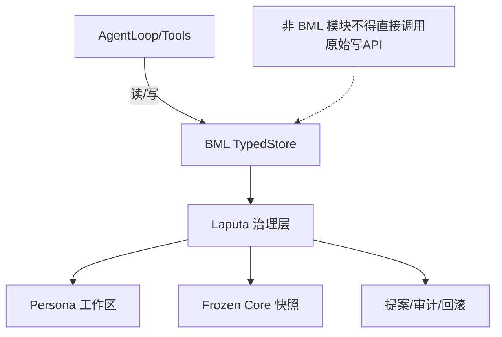
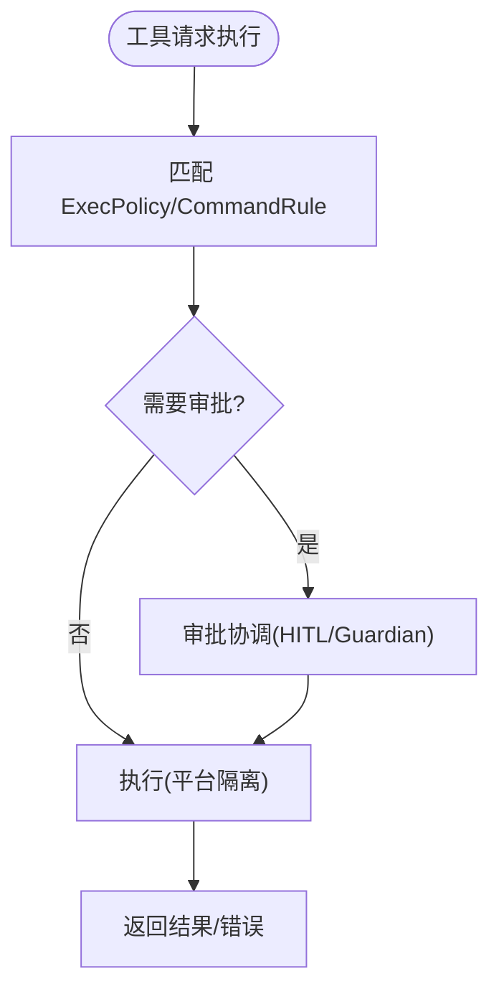
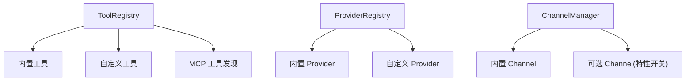
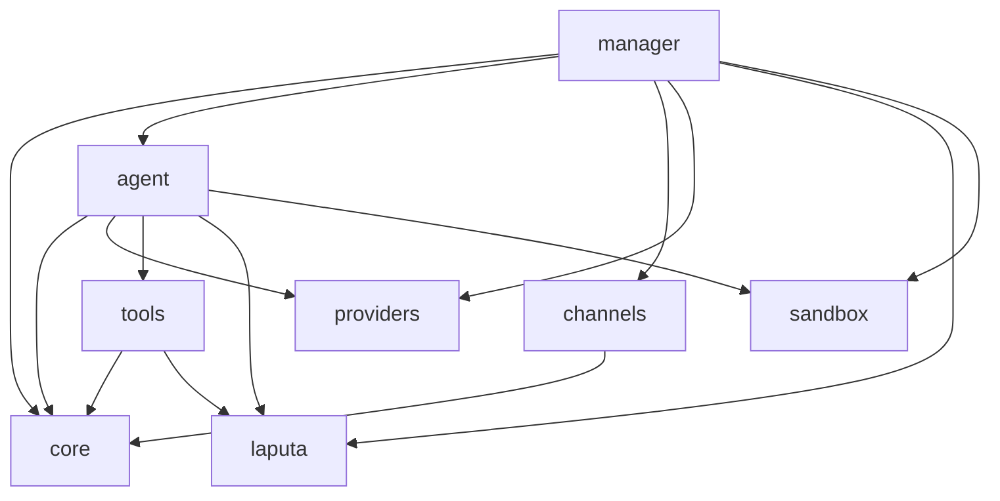

# 架构设计

<cite>
**本文引用的文件**
- [Cargo.toml](file://Cargo.toml)
- [README.md](file://README.md)
- [agent-diva-manager/src/lib.rs](file://agent-diva-manager/src/lib.rs)
- [agent-diva-manager/src/manager.rs](file://agent-diva-manager/src/manager.rs)
- [agent-diva-manager/src/runtime.rs](file://agent-diva-manager/src/runtime.rs)
- [agent-diva-agent/src/lib.rs](file://agent-diva-agent/src/lib.rs)
- [agent-diva-agent/src/agent_loop.rs](file://agent-diva-agent/src/agent_loop.rs)
- [agent-diva-core/src/lib.rs](file://agent-diva-core/src/lib.rs)
- [agent-diva-core/src/bus/mod.rs](file://agent-diva-core/src/bus/mod.rs)
- [agent-diva-channels/src/lib.rs](file://agent-diva-channels/src/lib.rs)
- [agent-diva-providers/src/lib.rs](file://agent-diva-providers/src/lib.rs)
- [agent-diva-laputa/src/lib.rs](file://agent-diva-laputa/src/lib.rs)
- [agent-diva-laputa/src/bml/mod.rs](file://agent-diva-laputa/src/bml/mod.rs)
- [agent-diva-sandbox/src/lib.rs](file://agent-diva-sandbox/src/lib.rs)
- [agent-diva-tools/src/lib.rs](file://agent-diva-tools/src/lib.rs)
</cite>

## 目录
1. [简介](#简介)
2. [项目结构](#项目结构)
3. [核心组件](#核心组件)
4. [架构总览](#架构总览)
5. [详细组件分析](#详细组件分析)
6. [依赖关系分析](#依赖关系分析)
7. [性能与可扩展性](#性能与可扩展性)
8. [故障排查指南](#故障排查指南)
9. [结论](#结论)
10. [附录](#附录)

## 简介
Agent Diva 是一个自托管的个人 AI 网关，将多种聊天平台接入大模型智能体。系统以 Gateway（管理器）为单一事实来源，负责会话路由、通道连接、调度与 HTTP 控制面；Agent Loop 作为核心处理引擎，编排上下文、工具调用、记忆读写与 LLM 交互；Provider 抽象统一对接各类大模型服务；Channel 适配器桥接外部聊天平台；Memory 层采用 BML + Laputa 的记忆治理架构，提供持久化、可审计、可回滚的会话记忆与人格演化能力；Sandbox 提供命令执行隔离与人机审批（HITL）；插件化扩展通过工具注册表、MCP 发现与 Provider/Channel 动态装配实现。

## 项目结构
仓库采用 Rust workspace 多 crate 组织，按职责分层：
- agent-diva-core：消息总线、配置、会话、计划、安全、心跳、质量等基础能力
- agent-diva-agent：Agent Loop、上下文组装、技能与子代理
- agent-diva-providers：LLM 提供者抽象与具体实现、目录与服务
- agent-diva-channels：聊天平台适配器与管理器
- agent-diva-tools：内置工具集（文件、Shell、Web、记忆、Cron 等）
- agent-diva-laputa：BML 存储层与 Laputa 人格治理
- agent-diva-sandbox：沙箱策略、执行编排、审批协调
- agent-diva-manager：本地 Gateway、HTTP 控制面、运行时编排
- agent-diva-cli / agent-diva-service / agent-diva-gui：用户入口与桌面应用
- agent-diva-autodream / agent-diva-neuron / agent-diva-files / agent-diva-migration / agent-diva-e2e：辅助与测试



图表来源
- [agent-diva-manager/src/lib.rs:1-20](file://agent-diva-manager/src/lib.rs#L1-L20)
- [agent-diva-core/src/bus/mod.rs:1-14](file://agent-diva-core/src/bus/mod.rs#L1-L14)
- [agent-diva-agent/src/lib.rs:1-29](file://agent-diva-agent/src/lib.rs#L1-L29)
- [agent-diva-providers/src/lib.rs:1-124](file://agent-diva-providers/src/lib.rs#L1-L124)
- [agent-diva-channels/src/lib.rs:1-53](file://agent-diva-channels/src/lib.rs#L1-L53)
- [agent-diva-laputa/src/lib.rs:1-56](file://agent-diva-laputa/src/lib.rs#L1-L56)
- [agent-diva-sandbox/src/lib.rs:1-116](file://agent-diva-sandbox/src/lib.rs#L1-L116)

章节来源
- [Cargo.toml:1-20](file://Cargo.toml#L1-L20)
- [README.md:87-108](file://README.md#L87-L108)

## 核心组件
- Gateway（Manager/Runtime）：启动并协调 MessageBus、ChannelManager、CronService、DynamicProvider、FileManager、Planning/Governance 等子系统；暴露 HTTP API 供 GUI/CLI 控制。
- Agent Loop：从入站消息构建上下文，选择工具与子代理，调用 Provider，管理会话、预算、压缩、ACTMEM 活动与检查点，并通过出站消息返回结果。
- Provider：统一的 LLM 抽象，支持热切换 DynamicProvider，封装重试、流式事件、提示缓存与报告生成。
- Channel：多平台适配（Telegram、Discord、QQ、DingTalk、Feishu、Email、NeuroLink 等），由 ChannelManager 统一管理生命周期与入出站消息桥接。
- Memory（BML + Laputa）：BML 是机器级 SQLite+FTS5 权威存储；Laputa 在其之上提供人格工作区、冻结核心快照、提案治理与审计。
- Sandbox：命令执行隔离、文件系统访问控制、规则与审批协调，支持 Guardian 自动审批与执行编排。
- Tools：内置工具集与 MCP 发现，通过 ToolRegistry 注册到 Agent Loop，按需延迟激活。

章节来源
- [agent-diva-manager/src/lib.rs:1-20](file://agent-diva-manager/src/lib.rs#L1-L20)
- [agent-diva-agent/src/agent_loop.rs:1-200](file://agent-diva-agent/src/agent_loop.rs#L1-L200)
- [agent-diva-providers/src/lib.rs:1-124](file://agent-diva-providers/src/lib.rs#L1-L124)
- [agent-diva-channels/src/lib.rs:1-53](file://agent-diva-channels/src/lib.rs#L1-L53)
- [agent-diva-laputa/src/lib.rs:1-56](file://agent-diva-laputa/src/lib.rs#L1-L56)
- [agent-diva-laputa/src/bml/mod.rs:1-37](file://agent-diva-laputa/src/bml/mod.rs#L1-L37)
- [agent-diva-sandbox/src/lib.rs:1-116](file://agent-diva-sandbox/src/lib.rs#L1-L116)
- [agent-diva-tools/src/lib.rs:1-74](file://agent-diva-tools/src/lib.rs#L1-L74)

## 架构总览
Gateway 作为单一事实来源，维护会话、路由与通道连接。消息从 Channel 进入 MessageBus，经 Agent Loop 处理（上下文、工具、记忆、LLM），再回到对应 Channel 输出。GUI/CLI 通过 HTTP API 与 Manager 交互，驱动运行时状态变更。

```mermaid
sequenceDiagram
participant Client as "客户端(GUI/CLI)"
participant Manager as "Manager(HTTP)"
participant Bus as "MessageBus"
participant Channels as "ChannelManager"
participant Loop as "AgentLoop"
participant Prov as "DynamicProvider"
participant Tools as "ToolRegistry"
participant Mem as "BML/Laputa"
participant Sandbox as "Sandbox"
Client->>Manager : "发送消息/控制指令"
Manager->>Bus : "发布入站消息"
Channels-->>Bus : "渠道入站消息"
Bus->>Loop : "分发 InboundMessage"
Loop->>Mem : "读取/写入记忆(受BML边界约束)"
Loop->>Tools : "解析并调用工具"
Tools->>Sandbox : "必要时执行受限命令"
Loop->>Prov : "chat/chat_stream"
Prov-->>Loop : "响应/流事件"
Loop->>Bus : "发布 OutboundMessage"
Bus-->>Channels : "转发到目标渠道"
Channels-->>Client : "展示回复"
```

图表来源
- [agent-diva-manager/src/runtime.rs:244-283](file://agent-diva-manager/src/runtime.rs#L244-L283)
- [agent-diva-core/src/bus/mod.rs:1-14](file://agent-diva-core/src/bus/mod.rs#L1-L14)
- [agent-diva-agent/src/agent_loop.rs:1-200](file://agent-diva-agent/src/agent_loop.rs#L1-L200)
- [agent-diva-providers/src/lib.rs:46-124](file://agent-diva-providers/src/lib.rs#L46-L124)
- [agent-diva-tools/src/lib.rs:1-74](file://agent-diva-tools/src/lib.rs#L1-L74)
- [agent-diva-laputa/src/bml/mod.rs:1-37](file://agent-diva-laputa/src/bml/mod.rs#L1-L37)
- [agent-diva-sandbox/src/lib.rs:1-116](file://agent-diva-sandbox/src/lib.rs#L1-L116)

## 详细组件分析

### Gateway（Manager/Runtime）
- 职责：加载配置、初始化 MessageBus、CronService、ChannelManager、DynamicProvider、FileManager、Planning/Governance；并行启动 outbound 分发、channel 启动、agent loop、manager 命令循环与 HTTP server；优雅关闭时停止各任务。
- 关键流程：
  - 构建 ProviderRegistry 并推断 provider/model
  - 注入网络工具配置、MCP 服务器更新
  - 管理运行时控制命令（如技能重载、MCP 更新）
  - 持有 ApprovalCoordinator、AskUserCoordinator 等治理与 HITL 能力



图表来源
- [agent-diva-manager/src/runtime.rs:244-283](file://agent-diva-manager/src/runtime.rs#L244-L283)
- [agent-diva-manager/src/manager.rs:1-200](file://agent-diva-manager/src/manager.rs#L1-L200)
- [agent-diva-core/src/bus/mod.rs:1-14](file://agent-diva-core/src/bus/mod.rs#L1-L14)

章节来源
- [agent-diva-manager/src/lib.rs:1-20](file://agent-diva-manager/src/lib.rs#L1-L20)
- [agent-diva-manager/src/manager.rs:1-200](file://agent-diva-manager/src/manager.rs#L1-L200)
- [agent-diva-manager/src/runtime.rs:244-283](file://agent-diva-manager/src/runtime.rs#L244-L283)

### Agent Loop
- 职责：处理单轮对话（turn），组装上下文（含预算与缓存观察）、选择工具与子代理、调用 Provider、管理会话、令牌账本、拒绝熔断、速率限制、ACTMEM 活动与检查点提交。
- 关键特性：
  - ToolConfig 包含内置工具开关、网络工具配置、规划工具、执行超时、全局超时、命令审批、AskUser 协调、MCP 服务器、CronService、RunStore 等
  - 支持思考模式（ThinkingMode）与活跃工具表面（ActiveToolSurface）
  - 与 MemoryProvider 边界协作，进行预取、同步与关闭钩子



图表来源
- [agent-diva-agent/src/agent_loop.rs:1-200](file://agent-diva-agent/src/agent_loop.rs#L1-L200)

章节来源
- [agent-diva-agent/src/lib.rs:1-29](file://agent-diva-agent/src/lib.rs#L1-L29)
- [agent-diva-agent/src/agent_loop.rs:1-200](file://agent-diva-agent/src/agent_loop.rs#L1-L200)

### Provider（LLM 抽象与动态切换）
- 职责：统一 chat/chat_stream 接口，封装重试、流式事件、提示缓存、最终输出缓存监听、默认模型查询与动态上下文传输。
- 动态切换：DynamicProvider 通过 RwLock 持有 Arc<dyn LLMProvider>，支持运行时热替换，便于配置或目录变化后无缝切换。



图表来源
- [agent-diva-providers/src/lib.rs:1-124](file://agent-diva-providers/src/lib.rs#L1-L124)

章节来源
- [agent-diva-providers/src/lib.rs:1-124](file://agent-diva-providers/src/lib.rs#L1-L124)

### Channel（多渠道适配器）
- 职责：提供 Telegram、Discord、QQ、DingTalk、Feishu、Email、NeuroLink 等平台适配器；ChannelManager 负责启动、停止、入站消息桥接到 MessageBus，以及出站消息分发。
- 编译特性：部分通道默认不编译，需启用 Cargo feature（如 channel-slack）以恢复。



图表来源
- [agent-diva-channels/src/lib.rs:1-53](file://agent-diva-channels/src/lib.rs#L1-L53)
- [agent-diva-core/src/bus/mod.rs:1-14](file://agent-diva-core/src/bus/mod.rs#L1-L14)

章节来源
- [agent-diva-channels/src/lib.rs:1-53](file://agent-diva-channels/src/lib.rs#L1-L53)

### Memory（BML + Laputa 记忆治理）
- BML：机器级 SQLite+FTS5 权威存储，通过 MemoryHome 暴露唯一生产环境记忆权限；非 BML 模块禁止直接调用原始写 API（put/import_records/gc/backup/restore），由测试门控保障。
- Laputa：在 BML 之上提供人格 Markdown 工作区、冻结核心快照、提案治理、审计与回滚；AutoDream 仅生成提案，不直接写入人格状态。



图表来源
- [agent-diva-laputa/src/bml/mod.rs:1-37](file://agent-diva-laputa/src/bml/mod.rs#L1-L37)
- [agent-diva-laputa/src/lib.rs:1-56](file://agent-diva-laputa/src/lib.rs#L1-L56)

章节来源
- [agent-diva-laputa/src/lib.rs:1-56](file://agent-diva-laputa/src/lib.rs#L1-L56)
- [agent-diva-laputa/src/bml/mod.rs:1-37](file://agent-diva-laputa/src/bml/mod.rs#L1-L37)

### Sandbox（沙箱与安全模型）
- 职责：命令执行隔离、文件系统访问控制、保护路径、规则匹配、审批协调、Guardian 自动审批、执行编排；支持跨平台策略映射与开关环境变量。
- 关键能力：ExecPolicy、CommandRule、ApprovalCoordinator、Orchestrator、Guardian、Platform 抽象。



图表来源
- [agent-diva-sandbox/src/lib.rs:1-116](file://agent-diva-sandbox/src/lib.rs#L1-L116)

章节来源
- [agent-diva-sandbox/src/lib.rs:1-116](file://agent-diva-sandbox/src/lib.rs#L1-L116)

### 插件化扩展机制
- 工具扩展：通过 ToolRegistry 注册内置与自定义工具，支持延迟激活与分区；MCP SDK 提供外部工具发现与调用。
- Provider/Channel 扩展：ProviderRegistry 与 ChannelManager 支持动态装配与特性开关；Manager 可热更新 MCP 服务器与技能。
- 治理与审计：通过 Governance/ApprovalCoordinator 对敏感操作进行审批与审计，确保扩展行为可控。



图表来源
- [agent-diva-tools/src/lib.rs:1-74](file://agent-diva-tools/src/lib.rs#L1-L74)
- [agent-diva-providers/src/lib.rs:1-124](file://agent-diva-providers/src/lib.rs#L1-L124)
- [agent-diva-channels/src/lib.rs:1-53](file://agent-diva-channels/src/lib.rs#L1-L53)
- [agent-diva-manager/src/manager.rs:1-200](file://agent-diva-manager/src/manager.rs#L1-L200)

章节来源
- [agent-diva-tools/src/lib.rs:1-74](file://agent-diva-tools/src/lib.rs#L1-L74)
- [agent-diva-manager/src/manager.rs:1-200](file://agent-diva-manager/src/manager.rs#L1-L200)

## 依赖关系分析
- Workspace 成员与版本：通过根 Cargo.toml 声明所有 crate 成员与共享依赖（tokio、serde、reqwest、sqlx 等）。
- 模块耦合：
  - manager 依赖 core、agent、channels、providers、files、laputa、sandbox、tooling
  - agent 依赖 core、providers、tools、sandbox、files、laputa
  - channels 依赖 core（bus）
  - providers 独立于业务逻辑，被 manager/agent 使用
  - laputa 提供 memory 权威，被 agent/tools 通过边界访问
  - sandbox 被 tools/agent 用于受限执行
  - tools 依赖 tooling 与 core，向 agent 暴露工具能力



图表来源
- [Cargo.toml:1-20](file://Cargo.toml#L1-L20)
- [agent-diva-manager/src/lib.rs:1-20](file://agent-diva-manager/src/lib.rs#L1-L20)
- [agent-diva-agent/src/lib.rs:1-29](file://agent-diva-agent/src/lib.rs#L1-L29)
- [agent-diva-core/src/lib.rs:1-43](file://agent-diva-core/src/lib.rs#L1-L43)

章节来源
- [Cargo.toml:1-20](file://Cargo.toml#L1-L20)

## 性能与可扩展性
- 异步与并发：基于 tokio 的多线程运行时，消息总线解耦入站/出站队列，并行启动多个任务（outbound、channel、agent、manager、server）。
- 上下文与预算：Agent Loop 维护上下文预算、缓存观察与令牌账本，避免无界增长；支持压缩与合并以减少上下文窗口压力。
- Provider 优化：提示缓存、重试与流式事件降低延迟与失败影响；DynamicProvider 支持热切换，减少重启成本。
- 记忆治理：BML 使用 SQLite+FTS5 提供高效检索；Laputa 治理层保证一致性、可审计与回滚。
- 沙箱隔离：命令执行在受限环境中运行，防止资源滥用；规则与审批机制提升安全性与稳定性。
- 可扩展性：工具、Provider、Channel 均可通过注册表与特性开关扩展；MCP 发现支持外部工具生态。

[本节为通用指导，不直接分析具体文件]

## 故障排查指南
- Gateway 启动失败：检查配置加载、Provider 可用性、Channel 初始化是否 best-effort；查看 Manager 日志与 HTTP 端口占用。
- 消息未到达：确认 ChannelManager 已启动且 inbound bridge 正常；检查 MessageBus 订阅与出站分发。
- 工具执行失败：查看 Sandbox 策略与审批状态；确认 ExecPolicy/CommandRule 匹配；检查文件系统访问模式与保护路径。
- 记忆写入异常：确认通过 BML 边界访问；若出现非法写尝试，检查调用方是否越界；利用 Laputa 审计与回滚机制恢复。
- Provider 调用失败：启用重试监听与最终输出缓存监听；检查模型目录与默认模型；必要时切换 DynamicProvider。

章节来源
- [agent-diva-manager/src/manager.rs:1-200](file://agent-diva-manager/src/manager.rs#L1-L200)
- [agent-diva-core/src/bus/mod.rs:1-14](file://agent-diva-core/src/bus/mod.rs#L1-L14)
- [agent-diva-sandbox/src/lib.rs:1-116](file://agent-diva-sandbox/src/lib.rs#L1-L116)
- [agent-diva-laputa/src/bml/mod.rs:1-37](file://agent-diva-laputa/src/bml/mod.rs#L1-L37)
- [agent-diva-providers/src/lib.rs:1-124](file://agent-diva-providers/src/lib.rs#L1-L124)

## 结论
Agent Diva 通过 Gateway 统一编排、Agent Loop 核心处理、Provider/Channel 抽象、BML+Laputa 记忆治理、Sandbox 安全隔离与工具插件化扩展，构建了高内聚、低耦合、可扩展的个人 AI 网关。其模块化设计与清晰的边界约束，使得系统在功能丰富性与工程可靠性之间取得平衡，适合长期演进与生态扩展。

[本节为总结，不直接分析具体文件]

## 附录
- 快速开始与配置：参考 README 中的最小配置、CLI 命令与 GUI 启动方式。
- 文档入口：architecture、laputa、engineering 等文档目录提供深入阅读顺序与决策记录。
- 开发命令：just ci/test 与工作区门禁（laputa-clean-break-check、bml-boundary-check）保障架构契约。

章节来源
- [README.md:150-242](file://README.md#L150-L242)
- [README.md:373-386](file://README.md#L373-L386)