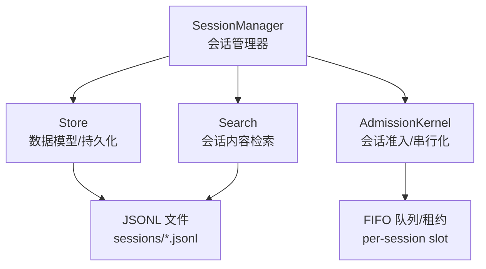
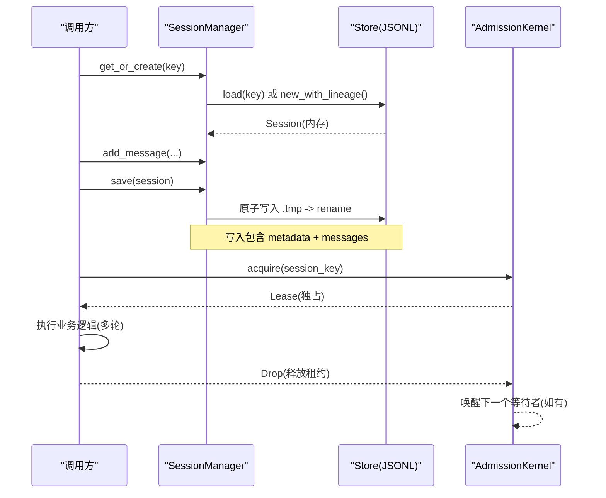
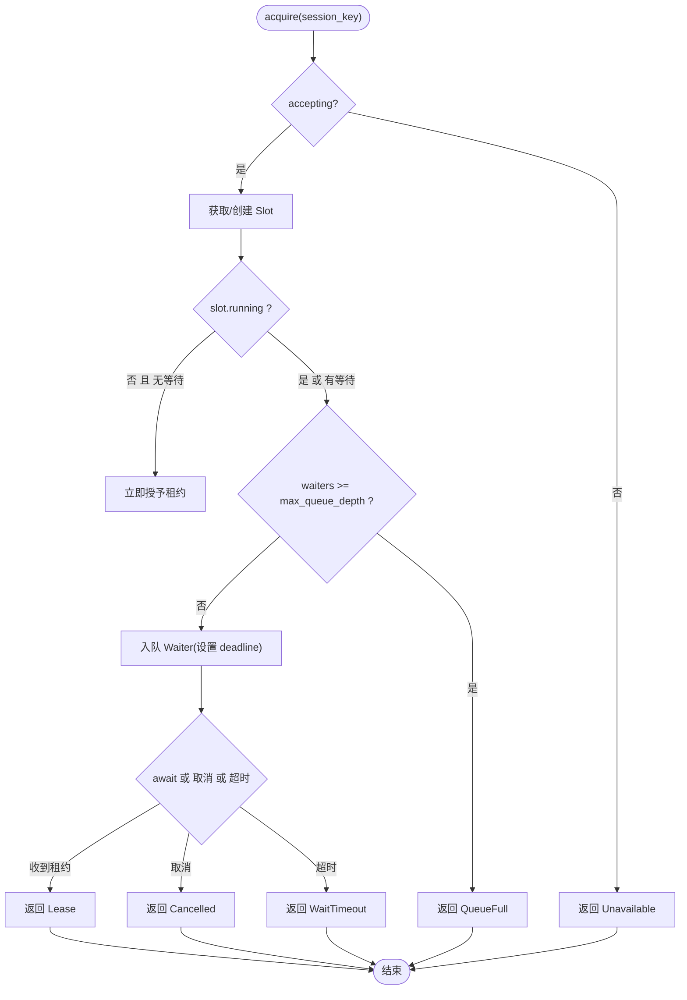
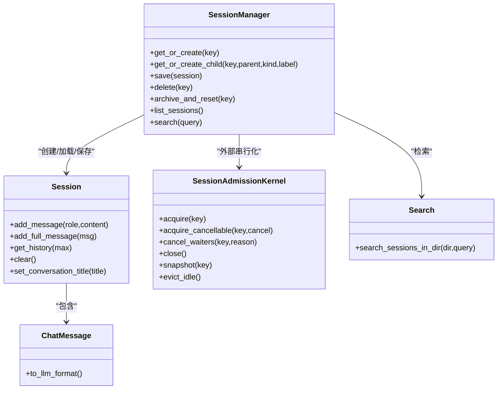
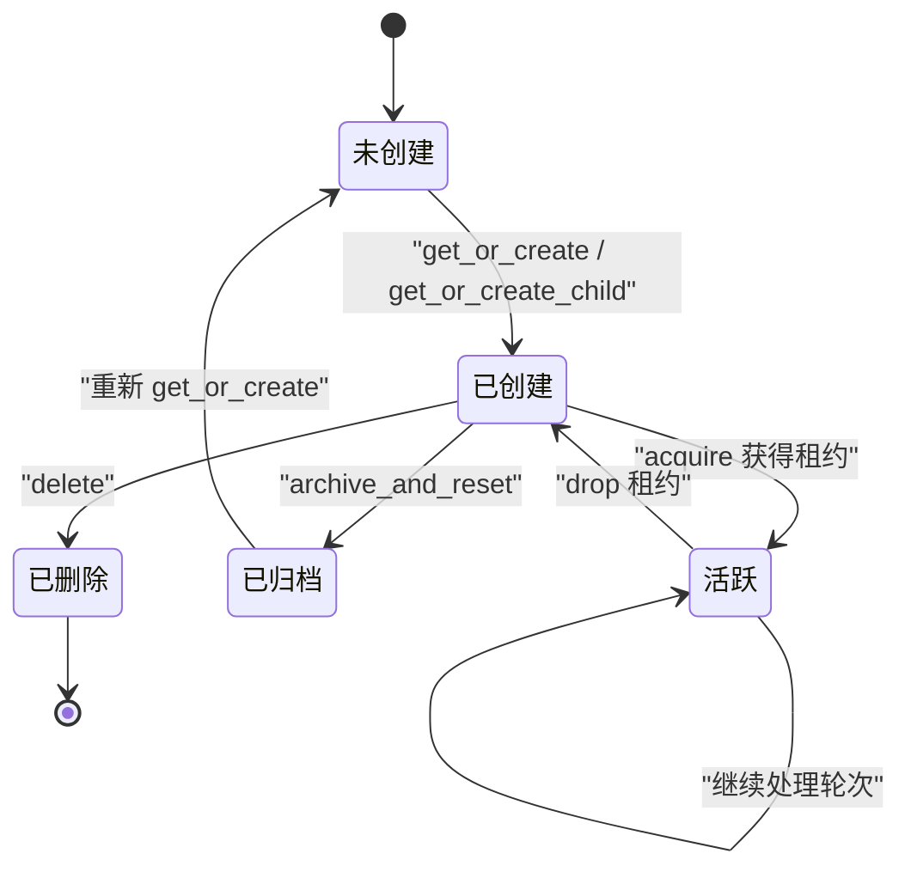

# 会话管理

<cite>
**本文引用的文件**
- [agent-diva-core/src/session/mod.rs](file://agent-diva-core/src/session/mod.rs)
- [agent-diva-core/src/session/manager.rs](file://agent-diva-core/src/session/manager.rs)
- [agent-diva-core/src/session/store.rs](file://agent-diva-core/src/session/store.rs)
- [agent-diva-core/src/session/admission.rs](file://agent-diva-core/src/session/admission.rs)
- [agent-diva-core/src/session/search.rs](file://agent-diva-core/src/session/search.rs)
- [agent-diva-agent/src/agent_loop/loop_runtime_control.rs](file://agent-diva-agent/src/agent_loop/loop_runtime_control.rs)
</cite>

## 目录
1. [简介](#简介)
2. [项目结构](#项目结构)
3. [核心组件](#核心组件)
4. [架构总览](#架构总览)
5. [详细组件分析](#详细组件分析)
6. [依赖关系分析](#依赖关系分析)
7. [性能考量](#性能考量)
8. [故障排查指南](#故障排查指南)
9. [结论](#结论)
10. [附录：使用示例与最佳实践](#附录使用示例与最佳实践)

## 简介
本文件围绕“会话管理”子系统，系统化阐述会话的生命周期、状态机、存储机制、准入控制与安全策略，并提供可操作的使用示例。该子系统以 JSONL 格式持久化对话历史，提供进程内会话缓存、原子写入、归档重置、搜索检索以及基于有界队列的串行化执行（同一会话内的轮次互斥）等能力。

## 项目结构
会话管理位于 agent-diva-core 模块中，按职责拆分为多个子模块：
- store：会话数据模型、消息结构、规范化检查点、历史对齐等
- manager：会话管理器，负责创建、加载、保存、删除、归档、列表与搜索
- admission：会话级准入内核，实现单会话串行化、排队、超时、空闲回收等
- search：会话内容全文检索，输出命中片段与诊断信息
- mod：对外导出公共类型与模块入口

图表来源
- [agent-diva-core/src/session/manager.rs:20-322](file://agent-diva-core/src/session/manager.rs#L20-L322)
- [agent-diva-core/src/session/store.rs:186-323](file://agent-diva-core/src/session/store.rs#L186-L323)
- [agent-diva-core/src/session/admission.rs:117-385](file://agent-diva-core/src/session/admission.rs#L117-L385)
- [agent-diva-core/src/session/search.rs:96-185](file://agent-diva-core/src/session/search.rs#L96-L185)

章节来源
- [agent-diva-core/src/session/mod.rs:1-29](file://agent-diva-core/src/session/mod.rs#L1-L29)

## 核心组件
- SessionManager：会话生命周期与 IO 编排（创建、加载、保存、删除、归档、列表、搜索）
- Session/ChatMessage/CanonicalCheckpoint：会话与消息的数据结构，支持元数据、标题、固化检查点
- SessionAdmissionKernel：会话级串行化执行，保证同一会话内轮次的互斥访问
- Search：对磁盘 JSONL 进行轻量全文检索，返回命中片段与诊断

章节来源
- [agent-diva-core/src/session/manager.rs:20-322](file://agent-diva-core/src/session/manager.rs#L20-L322)
- [agent-diva-core/src/session/store.rs:186-323](file://agent-diva-core/src/session/store.rs#L186-L323)
- [agent-diva-core/src/session/admission.rs:117-385](file://agent-diva-core/src/session/admission.rs#L117-L385)
- [agent-diva-core/src/session/search.rs:17-94](file://agent-diva-core/src/session/search.rs#L17-L94)

## 架构总览
会话管理的整体流程如下：
- 创建与会话获取：通过 SessionManager.get_or_create/get_or_create_child 获取或新建会话，并维护工作区血缘关系
- 消息追加与上下文构建：Session.add_message/add_full_message 追加消息；get_history 结合 last_consolidated 与 canonical_checkpoint 计算可见窗口，并通过 align_chat_history 修复工具调用一致性
- 持久化：SessionManager.save 将元数据与消息序列化为 JSONL，采用临时文件+原子重命名确保一致性
- 会话串行化：外部调用者通过 SessionAdmissionKernel.acquire 获取会话级租约，保证同一会话内轮次串行执行
- 搜索：SessionManager.search 扫描 sessions 目录下的 JSONL 文件，返回命中片段与统计信息
- 生命周期管理：delete/archive_and_reset/list_sessions 等接口完成销毁、归档、列举等操作

图表来源
- [agent-diva-core/src/session/manager.rs:43-123](file://agent-diva-core/src/session/manager.rs#L43-L123)
- [agent-diva-core/src/session/manager.rs:190-250](file://agent-diva-core/src/session/manager.rs#L190-L250)
- [agent-diva-core/src/session/store.rs:270-323](file://agent-diva-core/src/session/store.rs#L270-L323)
- [agent-diva-core/src/session/admission.rs:157-173](file://agent-diva-core/src/session/admission.rs#L157-L173)
- [agent-diva-core/src/session/admission.rs:387-439](file://agent-diva-core/src/session/admission.rs#L387-L439)

## 详细组件分析

### 会话数据模型与持久化（store）
- Session：包含 key、messages、时间戳、metadata、title、last_consolidated、canonical_checkpoint
- ChatMessage：role/content/timestamp/tool_call_id/tool_calls/name/reasoning_content/thinking_blocks/metadata/token_usage
- CanonicalCheckpoint：固定 schema_version 的压缩检查点，用于替代长历史，限制 body 长度，记录触发原因、质量指标、重试次数等
- 历史对齐：align_chat_history 保证 tool 结果紧跟其对应的 assistant 工具调用，避免被截断导致的不一致
- 持久化：manager 将 metadata 行与消息行写入 JSONL，读取时解析为 Session

复杂度与特性
- 追加消息 O(1)，get_history 切片 O(n)
- 对齐过程线性遍历，保证工具调用配对
- 检查点体上限防止上下文过大

章节来源
- [agent-diva-core/src/session/store.rs:186-323](file://agent-diva-core/src/session/store.rs#L186-L323)
- [agent-diva-core/src/session/store.rs:417-488](file://agent-diva-core/src/session/store.rs#L417-L488)
- [agent-diva-core/src/session/store.rs:75-180](file://agent-diva-core/src/session/store.rs#L75-L180)

### 会话管理器（manager）
- 创建与会话树：
  - get_or_create：根会话创建或从缓存/磁盘加载
  - get_or_create_child：显式建立父子/分支/子代理/临时会话的血缘关系（kind、root_session_key、parent_session_key、branch_label）
- 持久化：
  - save：写入 metadata + messages，使用临时文件+rename 原子替换，失败清理临时文件
  - archive_and_reset：将当前文件重命名为带时间戳的归档文件，清空内存中的会话，强制重启新会话
- 列表与搜索：
  - list_sessions：扫描 sessions 目录，解析每个 JSONL 生成摘要
  - search：委托 search_sessions_in_dir 进行全文检索

章节来源
- [agent-diva-core/src/session/manager.rs:43-123](file://agent-diva-core/src/session/manager.rs#L43-L123)
- [agent-diva-core/src/session/manager.rs:190-322](file://agent-diva-core/src/session/manager.rs#L190-L322)
- [agent-diva-core/src/session/manager.rs:380-596](file://agent-diva-core/src/session/manager.rs#L380-L596)

### 会话准入控制（admission）
- 目标：保证同一会话内轮次串行执行，避免并发写冲突与上下文竞争
- 关键概念：
  - SessionAdmissionLimits：最大等待深度、等待超时、空闲 TTL
  - SessionSlot：running/waiters/last_idle_at
  - SessionAdmissionLease：持有会话独占权，Drop 后自动释放并提升下一个等待者
  - 取消与关闭：cancel_waiters 取消排队任务；close 停止接受新请求但允许已接受的任务完成
- 行为特征：
  - 首次请求立即获得租约（无等待）
  - 后续请求进入 FIFO 队列，达到 max_queue_depth 则拒绝
  - 等待超时或取消会移除对应等待者并释放容量
  - 空闲超过 idle_ttl 的 slot 会被 evict_idle 回收

图表来源
- [agent-diva-core/src/session/admission.rs:157-243](file://agent-diva-core/src/session/admission.rs#L157-L243)
- [agent-diva-core/src/session/admission.rs:245-310](file://agent-diva-core/src/session/admission.rs#L245-L310)
- [agent-diva-core/src/session/admission.rs:326-385](file://agent-diva-core/src/session/admission.rs#L326-L385)

章节来源
- [agent-diva-core/src/session/admission.rs:18-79](file://agent-diva-core/src/session/admission.rs#L18-L79)
- [agent-diva-core/src/session/admission.rs:117-385](file://agent-diva-core/src/session/admission.rs#L117-L385)
- [agent-diva-core/src/session/admission.rs:387-439](file://agent-diva-core/src/session/admission.rs#L387-L439)
- [agent-diva-core/src/session/admission.rs:553-623](file://agent-diva-core/src/session/admission.rs#L553-L623)

### 会话搜索（search）
- 输入：SessionSearchQuery（文本、扫描文件数、结果数、片段长度、响应字节上限）
- 处理：
  - 扫描 sessions 目录下的 JSONL 文件
  - 逐条解析消息，匹配文本并生成 snippet
  - 限制结果数量与总字节数，记录是否达到限制
  - 记录跳过文件的诊断信息
- 输出：SessionSearchResponse（hits、diagnostics、统计标志）

章节来源
- [agent-diva-core/src/session/search.rs:17-94](file://agent-diva-core/src/session/search.rs#L17-L94)
- [agent-diva-core/src/session/search.rs:96-185](file://agent-diva-core/src/session/search.rs#L96-L185)
- [agent-diva-core/src/session/search.rs:245-334](file://agent-diva-core/src/session/search.rs#L245-L334)

### 运行时集成与生命周期事件
- 运行时控制命令：
  - 获取会话：GetSession 返回克隆的会话快照
  - 删除会话：DeleteSession 删除文件并清理内存，同时通知记忆提供者进行会话结束清理
- 这些命令由 agent-loop 分发处理，体现会话在运行时的增删查改

章节来源
- [agent-diva-agent/src/agent_loop/loop_runtime_control.rs:112-145](file://agent-diva-agent/src/agent_loop/loop_runtime_control.rs#L112-L145)

## 依赖关系分析
- SessionManager 依赖 store 的数据结构与持久化能力，依赖 search 进行离线检索
- AdmissionKernel 独立于 IO，仅管理进程内状态（slots、waiters、clock），通过 oneshot 通道通知租约分配
- 运行时层通过 SessionManager 暴露会话管理能力，并在删除时联动记忆系统清理

图表来源
- [agent-diva-core/src/session/manager.rs:20-322](file://agent-diva-core/src/session/manager.rs#L20-L322)
- [agent-diva-core/src/session/store.rs:186-323](file://agent-diva-core/src/session/store.rs#L186-L323)
- [agent-diva-core/src/session/admission.rs:117-385](file://agent-diva-core/src/session/admission.rs#L117-L385)
- [agent-diva-core/src/session/search.rs:96-185](file://agent-diva-core/src/session/search.rs#L96-L185)

## 性能考量
- 原子写入：通过临时文件+rename 减少损坏风险，写入完成后同步父目录
- 历史对齐：避免 provider 拒绝不合法的 tool 调用序列，降低重试成本
- 检查点：CanonicalCheckpoint 限制 body 长度，减少上下文大小，提高稳定性
- 准入队列：限制等待深度与超时，避免资源饥饿；空闲 TTL 回收无用 slot
- 搜索限制：max_files_scanned、max_results、max_total_bytes 控制 I/O 与响应体积

[本节为通用性能建议，无需特定文件引用]

## 故障排查指南
- 会话无法保存：
  - 检查 sessions 目录是否存在与可写权限
  - 查看 atomic_replace 失败路径是否清理了临时文件
- 会话删除后仍占用内存：
  - 确认 delete 已从 cache 移除
  - 确认运行时 DeleteSession 命令已执行并清理记忆系统
- 会话串行化阻塞：
  - 检查是否有长时间运行的租约未释放
  - 观察 snapshot 的 running/waiting 状态
  - 若队列已满，考虑增大 max_queue_depth 或优化业务耗时
- 搜索结果为空或受限：
  - 检查 query.text 是否为空
  - 关注 result_limit_reached、byte_limit_reached、file_limit_reached 标志
  - 查看 diagnostics 中跳过文件的原因

章节来源
- [agent-diva-core/src/session/manager.rs:190-322](file://agent-diva-core/src/session/manager.rs#L190-L322)
- [agent-diva-core/src/session/admission.rs:326-385](file://agent-diva-core/src/session/admission.rs#L326-L385)
- [agent-diva-core/src/session/search.rs:96-185](file://agent-diva-core/src/session/search.rs#L96-L185)
- [agent-diva-agent/src/agent_loop/loop_runtime_control.rs:112-145](file://agent-diva-agent/src/agent_loop/loop_runtime_control.rs#L112-L145)

## 结论
会话管理系统通过清晰的数据模型、原子持久化、会话级串行化与安全的搜索能力，提供了健壮的会话生命周期管理。配合运行时控制命令，可在服务层面安全地创建、查询、删除与归档会话。对于高并发场景，建议合理配置准入限制与检查点策略，平衡吞吐与稳定性。

[本节为总结性内容，无需特定文件引用]

## 附录：使用示例与最佳实践

### 会话生命周期与状态转换
- 创建：
  - 根会话：SessionManager.get_or_create(key)
  - 子会话：SessionManager.get_or_create_child(key, parent_key, kind, branch_label)
- 激活：
  - 通过 SessionAdmissionKernel.acquire 获取租约，开始处理轮次
- 挂起/恢复：
  - 挂起：保持租约持有期间暂停业务逻辑（注意超时）
  - 恢复：继续执行业务逻辑，最终 Drop 租约释放
- 销毁：
  - 删除：SessionManager.delete(key)
  - 归档并重置：SessionManager.archive_and_reset(key)

图表来源
- [agent-diva-core/src/session/manager.rs:43-123](file://agent-diva-core/src/session/manager.rs#L43-L123)
- [agent-diva-core/src/session/manager.rs:260-289](file://agent-diva-core/src/session/manager.rs#L260-L289)
- [agent-diva-core/src/session/admission.rs:157-173](file://agent-diva-core/src/session/admission.rs#L157-L173)
- [agent-diva-core/src/session/admission.rs:387-439](file://agent-diva-core/src/session/admission.rs#L387-L439)

### 会话存储机制
- 内存存储：SessionManager.cache 维护 HashMap<key, Session>，加速重复访问
- 持久化存储：JSONL 文件，首行为 metadata，后续为消息行；支持标题、钉选、血缘等元数据
- 原子写入：临时文件写入后 rename，失败清理，保障一致性

章节来源
- [agent-diva-core/src/session/manager.rs:20-41](file://agent-diva-core/src/session/manager.rs#L20-L41)
- [agent-diva-core/src/session/manager.rs:190-250](file://agent-diva-core/src/session/manager.rs#L190-L250)
- [agent-diva-core/src/session/store.rs:186-323](file://agent-diva-core/src/session/store.rs#L186-L323)

### 会话准入控制与安全机制
- 权限检查：
  - 会话级串行化确保同一会话内无并发冲突
  - 可通过 cancel_waiters/close 控制会话级资源
- 资源限制：
  - max_queue_depth：限制等待队列深度
  - wait_timeout：等待租约的超时
  - idle_ttl：空闲 slot 回收阈值
- 错误处理：
  - QueueFull、WaitTimeout、Cancelled、Unavailable 等错误明确区分失败原因

章节来源
- [agent-diva-core/src/session/admission.rs:18-79](file://agent-diva-core/src/session/admission.rs#L18-L79)
- [agent-diva-core/src/session/admission.rs:157-243](file://agent-diva-core/src/session/admission.rs#L157-L243)
- [agent-diva-core/src/session/admission.rs:326-385](file://agent-diva-core/src/session/admission.rs#L326-L385)

### 正确管理会话状态的建议
- 始终使用 get_or_create 或 get_or_create_child 获取会话，避免绕过血缘关系
- 在业务逻辑中使用 acquire 获取租约，确保会话内串行执行
- 及时保存会话，避免丢失未持久化的消息
- 使用 archive_and_reset 进行会话重置，保留历史归档
- 使用 search 进行会话内容检索，注意限制参数以避免过载

章节来源
- [agent-diva-core/src/session/manager.rs:43-123](file://agent-diva-core/src/session/manager.rs#L43-L123)
- [agent-diva-core/src/session/manager.rs:190-322](file://agent-diva-core/src/session/manager.rs#L190-L322)
- [agent-diva-core/src/session/admission.rs:157-173](file://agent-diva-core/src/session/admission.rs#L157-L173)
- [agent-diva-core/src/session/search.rs:96-185](file://agent-diva-core/src/session/search.rs#L96-L185)