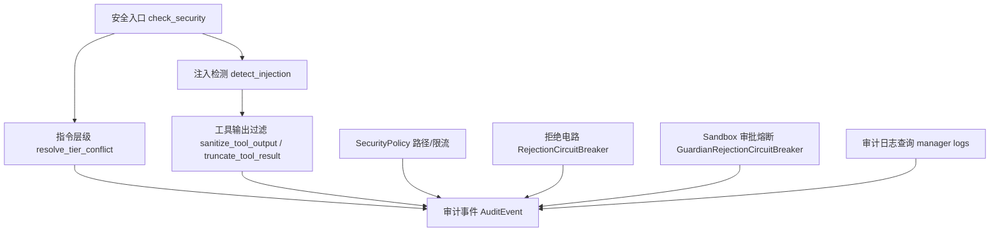
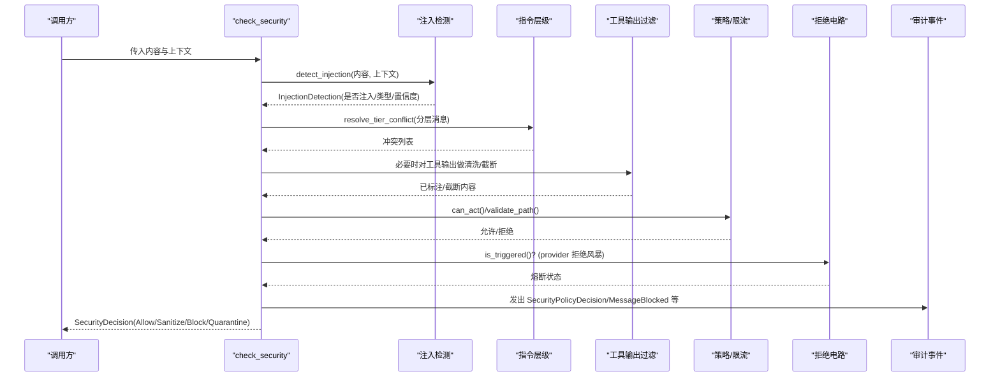
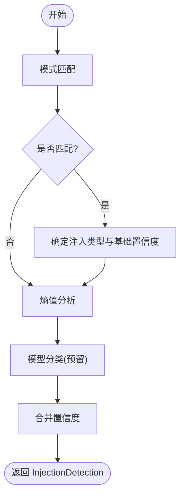
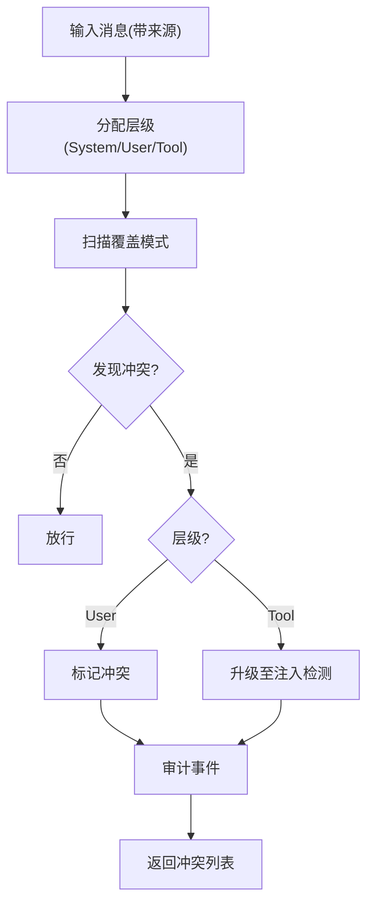
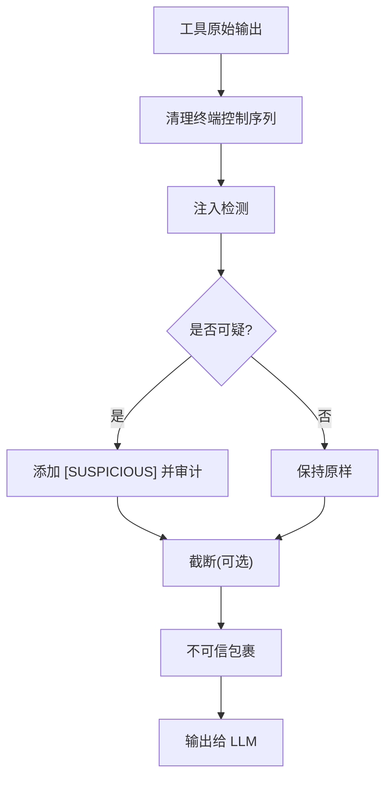
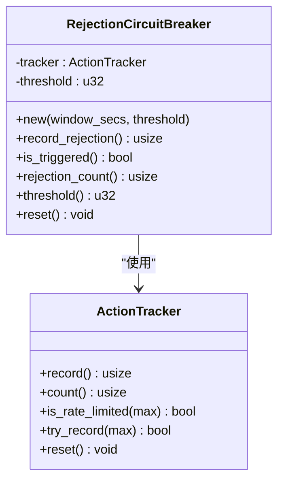
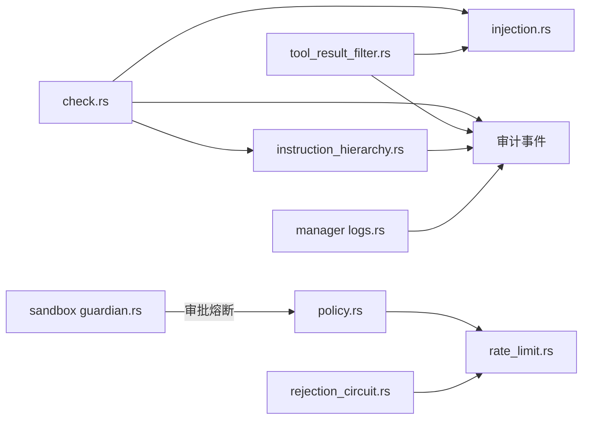

# 威胁检测

<cite>
**本文引用的文件**
- [agent-diva-core/src/security/mod.rs](file://agent-diva-core/src/security/mod.rs)
- [agent-diva-core/src/security/check.rs](file://agent-diva-core/src/security/check.rs)
- [agent-diva-core/src/security/injection.rs](file://agent-diva-core/src/security/injection.rs)
- [agent-diva-core/src/security/instruction_hierarchy.rs](file://agent-diva-core/src/security/instruction_hierarchy.rs)
- [agent-diva-core/src/security/tool_result_filter.rs](file://agent-diva-core/src/security/tool_result_filter.rs)
- [agent-diva-core/src/security/policy.rs](file://agent-diva-core/src/security/policy.rs)
- [agent-diva-core/src/security/config.rs](file://agent-diva-core/src/security/config.rs)
- [agent-diva-core/src/security/rate_limit.rs](file://agent-diva-core/src/security/rate_limit.rs)
- [agent-diva-core/src/security/rejection_circuit.rs](file://agent-diva-core/src/security/rejection_circuit.rs)
- [agent-diva-sandbox/src/guardian.rs](file://agent-diva-sandbox/src/guardian.rs)
- [agent-diva-manager/src/handlers/logs.rs](file://agent-diva-manager/src/handlers/logs.rs)
- [docs/decisions/security-and-threat-model-2026-07-29.md](file://docs/decisions/security-and-threat-model-2026-07-29.md)
</cite>

## 目录
1. [简介](#简介)
2. [项目结构](#项目结构)
3. [核心组件](#核心组件)
4. [架构总览](#架构总览)
5. [详细组件分析](#详细组件分析)
6. [依赖关系分析](#依赖关系分析)
7. [性能考量](#性能考量)
8. [故障排查指南](#故障排查指南)
9. [结论](#结论)
10. [附录：配置与告警示例](#附录：配置与告警示例)

## 简介
本文件系统性阐述 Agent-Diva 的威胁检测机制，覆盖异常行为识别、恶意请求检测、安全事件分析与处置；重点说明拒绝电路（熔断）的实现原理、降级策略与恢复逻辑；给出威胁评分模型与风险等级划分；提供可操作的配置示例与告警规则；并解释检测结果的存储与分析方法。文档面向不同技术背景的读者，既提供高层概览，也包含代码级流程图与时序图。

## 项目结构
Agent-Diva 的安全能力集中在 core 模块的 security 子系统中，围绕“输入检测—指令层级—工具输出过滤—策略与限流—熔断保护—审计记录”形成闭环。关键目录与职责如下：
- 统一入口与安全决策：check.rs 串联注入检测与指令层级冲突，输出统一的 SecurityDecision。
- 注入检测：injection.rs 实现三层检测（模式匹配、熵值分析、预留模型分类），产出 InjectionDetection。
- 指令层级：instruction_hierarchy.rs 对 System/User/Tool 三类消息进行优先级约束与冲突检测。
- 工具输出过滤：tool_result_filter.rs 对工具结果进行不可信包裹、注入标记与截断。
- 策略与配置：policy.rs、config.rs 定义安全级别、路径校验、速率限制、PII 开关、熔断窗口等。
- 速率与熔断：rate_limit.rs 提供滑动窗口计数；rejection_circuit.rs 基于 ActionTracker 实现拒绝风暴熔断；sandbox 侧 GuardianRejectionCircuitBreaker 用于审批拒绝熔断。
- 审计与日志：manager 层 logs.rs 提供审计事件查询能力，core 层 emit 审计事件。



图表来源
- [agent-diva-core/src/security/check.rs:32-117](file://agent-diva-core/src/security/check.rs#L32-L117)
- [agent-diva-core/src/security/injection.rs:303-355](file://agent-diva-core/src/security/injection.rs#L303-L355)
- [agent-diva-core/src/security/instruction_hierarchy.rs:208-267](file://agent-diva-core/src/security/instruction_hierarchy.rs#L208-L267)
- [agent-diva-core/src/security/tool_result_filter.rs:68-132](file://agent-diva-core/src/security/tool_result_filter.rs#L68-L132)
- [agent-diva-core/src/security/policy.rs:84-201](file://agent-diva-core/src/security/policy.rs#L84-L201)
- [agent-diva-core/src/security/rejection_circuit.rs:22-55](file://agent-diva-core/src/security/rejection_circuit.rs#L22-L55)
- [agent-diva-sandbox/src/guardian.rs:502-571](file://agent-diva-sandbox/src/guardian.rs#L502-L571)
- [agent-diva-manager/src/handlers/logs.rs:115-118](file://agent-diva-manager/src/handlers/logs.rs#L115-L118)

章节来源
- [agent-diva-core/src/security/mod.rs:1-69](file://agent-diva-core/src/security/mod.rs#L1-L69)
- [agent-diva-core/src/security/check.rs:1-203](file://agent-diva-core/src/security/check.rs#L1-L203)
- [agent-diva-core/src/security/injection.rs:37-355](file://agent-diva-core/src/security/injection.rs#L37-L355)
- [agent-diva-core/src/security/instruction_hierarchy.rs:1-267](file://agent-diva-core/src/security/instruction_hierarchy.rs#L1-L267)
- [agent-diva-core/src/security/tool_result_filter.rs:1-132](file://agent-diva-core/src/security/tool_result_filter.rs#L1-L132)
- [agent-diva-core/src/security/policy.rs:14-201](file://agent-diva-core/src/security/policy.rs#L14-L201)
- [agent-diva-core/src/security/config.rs:51-178](file://agent-diva-core/src/security/config.rs#L51-L178)
- [agent-diva-core/src/security/rate_limit.rs:1-84](file://agent-diva-core/src/security/rate_limit.rs#L1-L84)
- [agent-diva-core/src/security/rejection_circuit.rs:1-55](file://agent-diva-core/src/security/rejection_circuit.rs#L1-L55)
- [agent-diva-sandbox/src/guardian.rs:497-571](file://agent-diva-sandbox/src/guardian.rs#L497-L571)
- [agent-diva-manager/src/handlers/logs.rs:43-118](file://agent-diva-manager/src/handlers/logs.rs#L43-L118)

## 核心组件
- 统一安全决策：check_security 将注入检测与指令层级冲突合并为单一决策（允许/清洗/阻断/隔离），并触发审计事件。
- 注入检测：三层防御（模式匹配、熵值分析、预留模型分类），按注入类型赋予基础置信度并结合上下文调整。
- 指令层级：System > User > Tool，低层级尝试覆盖高层将被标记或升级至注入子系统。
- 工具输出过滤：不可信包裹、注入标记、长度截断，防止上下文耗尽攻击。
- 策略与配置：安全级别预设、路径白/黑名单、只读模式、PII 开关、全局超时、令牌预算、拒绝电路窗口与阈值。
- 速率限制与熔断：ActionTracker 滑动窗口计数；RejectionCircuitBreaker 在 provider 拒绝风暴时阻止新迭代；沙箱侧 GuardianRejectionCircuitBreaker 在审批拒绝风暴时阻断自动批准。
- 审计与日志：所有关键决策与发现均通过审计事件输出，支持按时间范围与事件类型查询。

章节来源
- [agent-diva-core/src/security/check.rs:32-117](file://agent-diva-core/src/security/check.rs#L32-L117)
- [agent-diva-core/src/security/injection.rs:303-355](file://agent-diva-core/src/security/injection.rs#L303-L355)
- [agent-diva-core/src/security/instruction_hierarchy.rs:208-267](file://agent-diva-core/src/security/instruction_hierarchy.rs#L208-L267)
- [agent-diva-core/src/security/tool_result_filter.rs:68-132](file://agent-diva-core/src/security/tool_result_filter.rs#L68-L132)
- [agent-diva-core/src/security/config.rs:114-178](file://agent-diva-core/src/security/config.rs#L114-L178)
- [agent-diva-core/src/security/rate_limit.rs:32-84](file://agent-diva-core/src/security/rate_limit.rs#L32-L84)
- [agent-diva-core/src/security/rejection_circuit.rs:22-55](file://agent-diva-core/src/security/rejection_circuit.rs#L22-L55)
- [agent-diva-sandbox/src/guardian.rs:502-571](file://agent-diva-sandbox/src/guardian.rs#L502-L571)

## 架构总览
下图展示从输入到决策再到审计与熔断的全链路：



图表来源
- [agent-diva-core/src/security/check.rs:32-117](file://agent-diva-core/src/security/check.rs#L32-L117)
- [agent-diva-core/src/security/injection.rs:303-355](file://agent-diva-core/src/security/injection.rs#L303-L355)
- [agent-diva-core/src/security/instruction_hierarchy.rs:208-267](file://agent-diva-core/src/security/instruction_hierarchy.rs#L208-L267)
- [agent-diva-core/src/security/tool_result_filter.rs:68-132](file://agent-diva-core/src/security/tool_result_filter.rs#L68-L132)
- [agent-diva-core/src/security/policy.rs:237-273](file://agent-diva-core/src/security/policy.rs#L237-L273)
- [agent-diva-core/src/security/rejection_circuit.rs:31-45](file://agent-diva-core/src/security/rejection_circuit.rs#L31-L45)

## 详细组件分析

### 注入检测与异常行为识别
- 三层检测：
  - 模式匹配：针对角色覆盖、工具输出注入、越狱等类别，命中后赋予基础置信度。
  - 熵值分析：计算信息熵，高于阈值提示可能编码隐藏载荷，提升置信度。
  - 模型分类：预留扩展点，当前返回 None。
- 上下文感知：用户消息与工具输出采用不同置信度基线。
- 输出：InjectionDetection（是否注入、类型、置信度、匹配模式）。



图表来源
- [agent-diva-core/src/security/injection.rs:303-355](file://agent-diva-core/src/security/injection.rs#L303-L355)

章节来源
- [agent-diva-core/src/security/injection.rs:37-355](file://agent-diva-core/src/security/injection.rs#L37-L355)

### 指令层级与恶意请求检测
- 层级：System(最高) > User > Tool(最低)。
- 冲突检测：扫描低层级消息中试图覆盖高层级的模式（如忽略系统提示、覆盖指令等）。
- 处理策略：User 层级冲突标记；Tool 层级冲突升级为注入检测；并发出审计事件。



图表来源
- [agent-diva-core/src/security/instruction_hierarchy.rs:115-123](file://agent-diva-core/src/security/instruction_hierarchy.rs#L115-L123)
- [agent-diva-core/src/security/instruction_hierarchy.rs:208-267](file://agent-diva-core/src/security/instruction_hierarchy.rs#L208-L267)

章节来源
- [agent-diva-core/src/security/instruction_hierarchy.rs:1-267](file://agent-diva-core/src/security/instruction_hierarchy.rs#L1-L267)

### 工具输出过滤与上下文保护
- 不可信包裹：用 <untrusted>...</untrusted> 标记外部来源，降低被误认为系统指令的风险。
- 注入标记：检测工具输出中的注入模式，添加 [SUSPICIOUS] 前缀并记录审计。
- 长度截断：超过最大字符数时截断并附加提示，防止上下文耗尽攻击。



图表来源
- [agent-diva-core/src/security/tool_result_filter.rs:68-132](file://agent-diva-core/src/security/tool_result_filter.rs#L68-L132)

章节来源
- [agent-diva-core/src/security/tool_result_filter.rs:1-132](file://agent-diva-core/src/security/tool_result_filter.rs#L1-L132)

### 拒绝电路（熔断）机制
- 目标：防止 provider 连续拒绝导致的死循环或资源耗尽。
- 核心：RejectionCircuitBreaker 使用 ActionTracker 滑动窗口统计拒绝次数，达到阈值则触发熔断，阻止新一轮模型迭代，直到窗口滑过。
- 沙箱侧：GuardianRejectionCircuitBreaker 在审批拒绝风暴时将自动批准降级为拒绝，或将延迟转为需要人工审批。



图表来源
- [agent-diva-core/src/security/rate_limit.rs:6-84](file://agent-diva-core/src/security/rate_limit.rs#L6-L84)
- [agent-diva-core/src/security/rejection_circuit.rs:14-55](file://agent-diva-core/src/security/rejection_circuit.rs#L14-L55)

```mermaid
sequenceDiagram
participant Loop as "主循环"
participant CB as "RejectionCircuitBreaker"
participant Prov as "Provider"
Loop->>CB : record_rejection()
CB-->>Loop : 当前窗口计数
Loop->>Prov : 发起模型调用
Prov-->>Loop : 拒绝(限流/鉴权/上下文过长)
Loop->>CB : is_triggered()?
alt 未触发
Loop-->>Loop : 继续下一轮
else 已触发
Loop-->>Loop : 拒绝新迭代(等待窗口滑过)
end
```

图表来源
- [agent-diva-core/src/security/rejection_circuit.rs:31-45](file://agent-diva-core/src/security/rejection_circuit.rs#L31-L45)
- [agent-diva-core/src/security/rate_limit.rs:32-84](file://agent-diva-core/src/security/rate_limit.rs#L32-L84)

章节来源
- [agent-diva-core/src/security/rejection_circuit.rs:1-81](file://agent-diva-core/src/security/rejection_circuit.rs#L1-L81)
- [agent-diva-core/src/security/rate_limit.rs:1-181](file://agent-diva-core/src/security/rate_limit.rs#L1-L181)
- [agent-diva-sandbox/src/guardian.rs:502-571](file://agent-diva-sandbox/src/guardian.rs#L502-L571)

### 威胁评分模型与风险等级
- 注入置信度：由模式匹配基础置信度与熵值提升组合而成，取值 0.0–1.0。
- 风险等级映射：
  - 高：越狱、角色覆盖
  - 中：工具输出注入、指令层级冲突
  - 低：一般性异常或低风险信号
- 决策阈值：可通过 injection_block_threshold 控制阻断阈值；默认 0.8。

章节来源
- [agent-diva-core/src/security/injection.rs:37-71](file://agent-diva-core/src/security/injection.rs#L37-L71)
- [agent-diva-core/src/security/check.rs:42-56](file://agent-diva-core/src/security/check.rs#L42-L56)
- [agent-diva-core/src/security/config.rs:88-93](file://agent-diva-core/src/security/config.rs#L88-L93)

### 检测结果存储与分析
- 审计事件：所有安全决策与发现通过审计事件输出（如 SecurityPolicyDecision、MessageBlocked、ToolOutputSanitized、InstructionConflictDetected 等）。
- 日志查询：manager 层提供审计日志扫描与分页查询接口，支持按时间范围筛选。

章节来源
- [agent-diva-core/src/security/check.rs:119-148](file://agent-diva-core/src/security/check.rs#L119-L148)
- [agent-diva-core/src/security/tool_result_filter.rs:76-93](file://agent-diva-core/src/security/tool_result_filter.rs#L76-L93)
- [agent-diva-core/src/security/instruction_hierarchy.rs:240-264](file://agent-diva-core/src/security/instruction_hierarchy.rs#L240-L264)
- [agent-diva-manager/src/handlers/logs.rs:115-118](file://agent-diva-manager/src/handlers/logs.rs#L115-L118)

## 依赖关系分析
- check.rs 依赖 injection.rs 与 instruction_hierarchy.rs，聚合结果为 SecurityDecision。
- tool_result_filter.rs 依赖 injection.rs 的工具输出注入检测。
- policy.rs 依赖 rate_limit.rs 与 path 校验，提供统一策略。
- rejection_circuit.rs 依赖 rate_limit.rs 的 ActionTracker。
- sandbox guardian 与 core 拒绝电路语义隔离但目标一致：防止拒绝风暴。
- 审计事件贯穿各模块，manager 层提供查询。



图表来源
- [agent-diva-core/src/security/check.rs:32-117](file://agent-diva-core/src/security/check.rs#L32-L117)
- [agent-diva-core/src/security/tool_result_filter.rs:68-93](file://agent-diva-core/src/security/tool_result_filter.rs#L68-L93)
- [agent-diva-core/src/security/policy.rs:237-273](file://agent-diva-core/src/security/policy.rs#L237-L273)
- [agent-diva-core/src/security/rejection_circuit.rs:31-45](file://agent-diva-core/src/security/rejection_circuit.rs#L31-L45)
- [agent-diva-sandbox/src/guardian.rs:502-571](file://agent-diva-sandbox/src/guardian.rs#L502-L571)
- [agent-diva-manager/src/handlers/logs.rs:115-118](file://agent-diva-manager/src/handlers/logs.rs#L115-L118)

章节来源
- [agent-diva-core/src/security/mod.rs:26-69](file://agent-diva-core/src/security/mod.rs#L26-L69)

## 性能考量
- 正则与集合：RegexSet 预编译，避免重复开销。
- 熵值计算：线性扫描字节频率，复杂度 O(n)，适合中等长度文本。
- 工具输出过滤：先清理终端控制序列再检测，减少误报与干扰。
- 滑动窗口：ActionTracker 定期清理过期时间戳，避免内存增长。
- 熔断：仅在窗口内计数达到阈值才阻断，降低对正常流量的影响。

[本节为通用指导，不直接分析具体文件]

## 故障排查指南
- 频繁阻断：检查注入置信度与阈值配置；查看审计事件中的 SecurityPolicyDecision 与 MessageBlocked。
- 工具输出被标记：确认 sanitize_tool_output 是否检测到注入模式；必要时调整工具输出清洗策略。
- 指令冲突频发：审查用户/工具输入是否包含覆盖系统指令的模式；关注 InstructionConflictDetected 审计事件。
- 熔断触发：检查 provider 拒绝原因（限流、鉴权失败、上下文过长）；调整 rejection_circuit_window_secs 与 rejection_circuit_threshold。
- 日志查询：使用 manager 日志接口按时间范围与事件类型筛选，定位问题根因。

章节来源
- [agent-diva-core/src/security/check.rs:119-148](file://agent-diva-core/src/security/check.rs#L119-L148)
- [agent-diva-core/src/security/instruction_hierarchy.rs:240-264](file://agent-diva-core/src/security/instruction_hierarchy.rs#L240-L264)
- [agent-diva-core/src/security/config.rs:114-178](file://agent-diva-core/src/security/config.rs#L114-L178)
- [agent-diva-manager/src/handlers/logs.rs:115-118](file://agent-diva-manager/src/handlers/logs.rs#L115-L118)

## 结论
Agent-Diva 的威胁检测体系以“多层检测+统一决策+熔断保护+审计可观测”为核心，兼顾安全性与可用性。通过注入检测、指令层级约束、工具输出过滤与拒绝电路，有效应对提示词注入、越狱、上下文耗尽与拒绝风暴等威胁。结合灵活的配置与审计日志，可在生产环境中实现可控、可观测、可回滚的安全治理。

[本节为总结，不直接分析具体文件]

## 附录：配置与告警示例
- 安全级别与默认值：
  - 级别：Permissive/Standard/Strict/Paranoid，分别对应不同的动作上限与只读策略。
  - 默认窗口与阈值：拒绝电路窗口 60 秒，阈值 50（作为死循环安全阀）。
- 关键配置项：
  - injection_enabled：启用注入检测。
  - injection_block_threshold：阻断阈值（0.0–1.0）。
  - rejection_circuit_window_secs：拒绝电路窗口（秒）。
  - rejection_circuit_threshold：窗口内最大拒绝次数。
  - global_tool_timeout_secs：工具执行超时（秒）。
  - token_budget_limit/per_task_token_budget：会话/任务级令牌预算。
- 告警规则建议：
  - 当 SecurityPolicyDecision 为 Block 且 severity 为 High/Critical 时，立即告警。
  - 当 ToolOutputSanitized 出现 [SUSPICIOUS] 标记，记录审计并评估是否需要阻断。
  - 当 InstructionConflictDetected 数量突增，触发告警并审查输入来源。
  - 当 RejectionCircuitBreaker 触发，记录审计并通知运维介入。

章节来源
- [agent-diva-core/src/security/config.rs:114-178](file://agent-diva-core/src/security/config.rs#L114-L178)
- [agent-diva-core/src/security/check.rs:119-148](file://agent-diva-core/src/security/check.rs#L119-L148)
- [agent-diva-core/src/security/tool_result_filter.rs:76-93](file://agent-diva-core/src/security/tool_result_filter.rs#L76-L93)
- [agent-diva-core/src/security/instruction_hierarchy.rs:240-264](file://agent-diva-core/src/security/instruction_hierarchy.rs#L240-L264)
- [docs/decisions/security-and-threat-model-2026-07-29.md:1-20](file://docs/decisions/security-and-threat-model-2026-07-29.md#L1-L20)