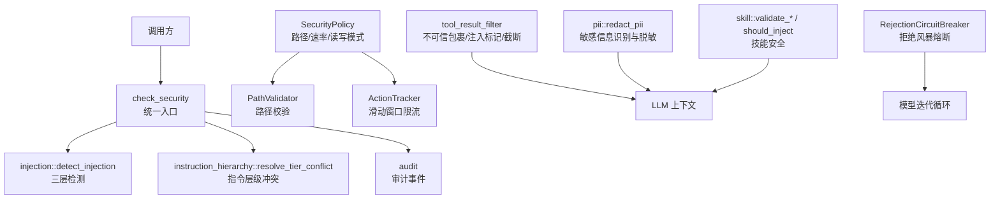
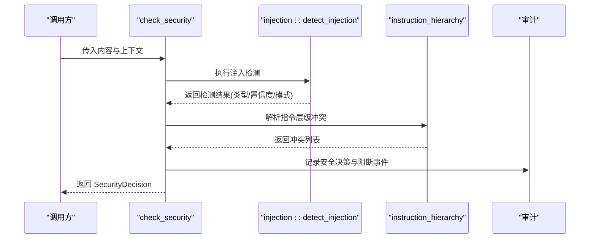
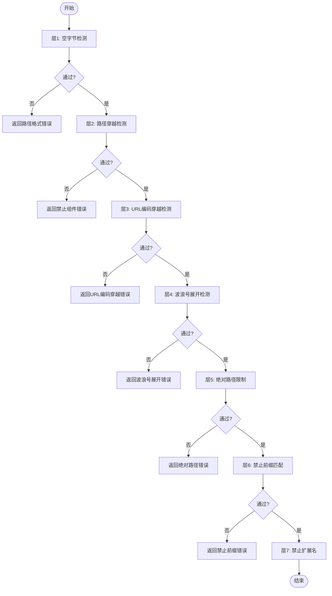
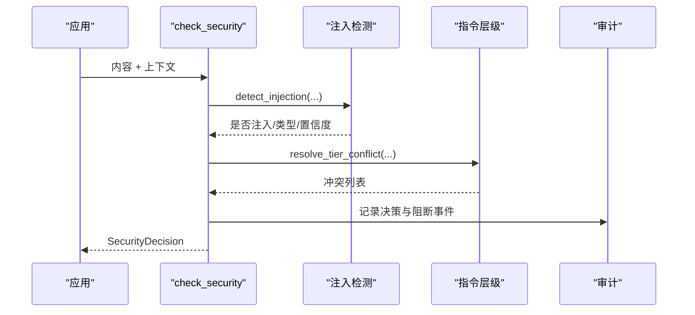
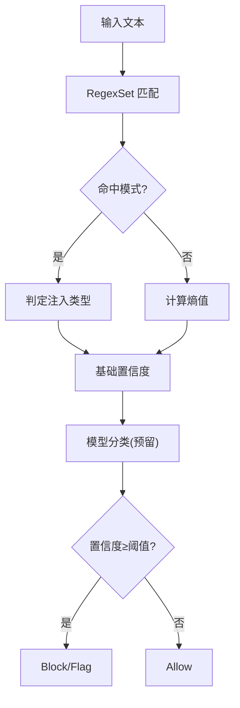
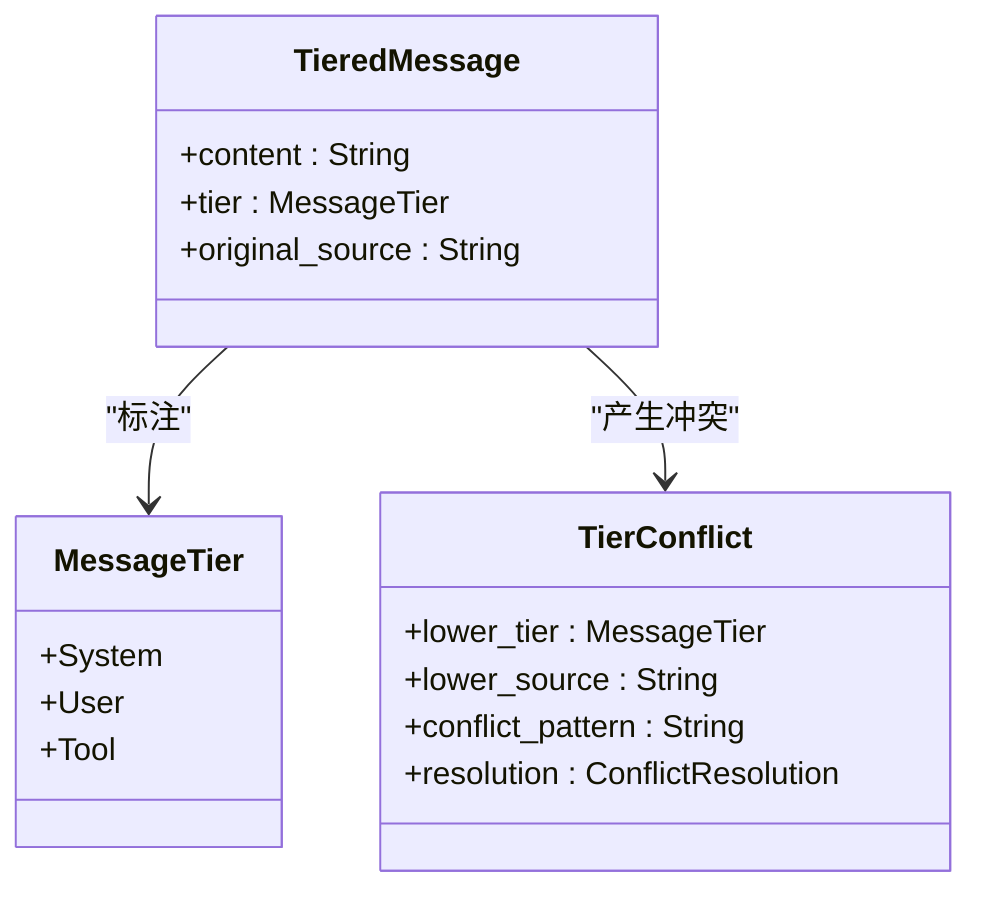
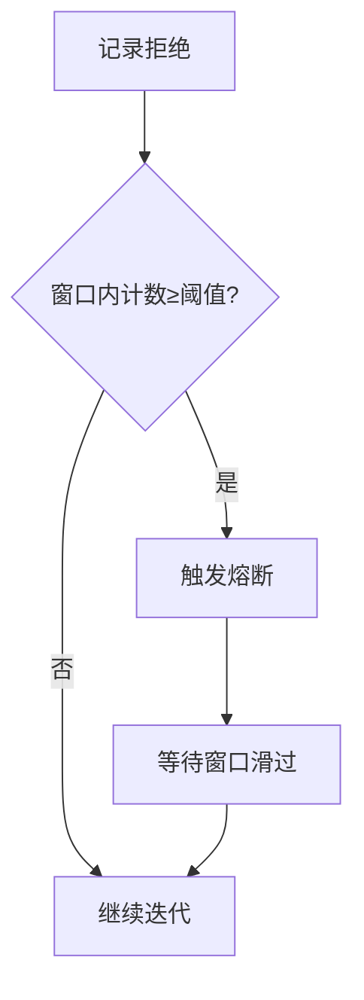
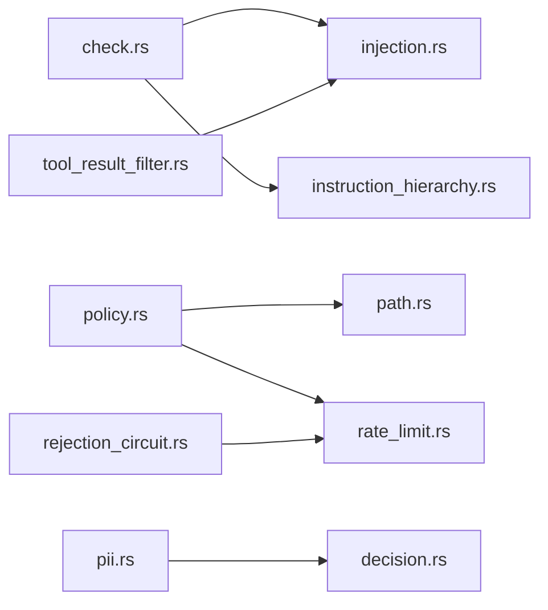

# 安全框架

<cite>
**本文引用的文件**
- [agent-diva-core/src/security/mod.rs](file://agent-diva-core/src/security/mod.rs)
- [agent-diva-core/src/security/policy.rs](file://agent-diva-core/src/security/policy.rs)
- [agent-diva-core/src/security/config.rs](file://agent-diva-core/src/security/config.rs)
- [agent-diva-core/src/security/check.rs](file://agent-diva-core/src/security/check.rs)
- [agent-diva-core/src/security/injection.rs](file://agent-diva-core/src/security/injection.rs)
- [agent-diva-core/src/security/decision.rs](file://agent-diva-core/src/security/decision.rs)
- [agent-diva-core/src/security/path.rs](file://agent-diva-core/src/security/path.rs)
- [agent-diva-core/src/security/rate_limit.rs](file://agent-diva-core/src/security/rate_limit.rs)
- [agent-diva-core/src/security/instruction_hierarchy.rs](file://agent-diva-core/src/security/instruction_hierarchy.rs)
- [agent-diva-core/src/security/tool_result_filter.rs](file://agent-diva-core/src/security/tool_result_filter.rs)
- [agent-diva-core/src/security/pii.rs](file://agent-diva-core/src/security/pii.rs)
- [agent-diva-core/src/security/rejection_circuit.rs](file://agent-diva-core/src/security/rejection_circuit.rs)
- [agent-diva-core/src/security/skill/mod.rs](file://agent-diva-core/src/security/skill/mod.rs)
- [agent-diva-core/tests/security_integration.rs](file://agent-diva-core/tests/security_integration.rs)
</cite>

## 目录
1. [简介](#简介)
2. [项目结构](#项目结构)
3. [核心组件](#核心组件)
4. [架构总览](#架构总览)
5. [详细组件分析](#详细组件分析)
6. [依赖关系分析](#依赖关系分析)
7. [性能考量](#性能考量)
8. [故障排查指南](#故障排查指南)
9. [结论](#结论)
10. [附录：配置与最佳实践](#附录配置与最佳实践)

## 简介
本安全框架为 Agent-Diva 提供统一的安全策略、访问控制、注入防护、PII 脱敏、速率限制、技能可信度校验以及模型/提供者拒绝风暴的熔断保护。其设计目标是在保证可用性的同时，对系统输入、工具输出、工作区路径与外部能力进行纵深防御，确保“最小权限、默认拒绝、可审计”的原则贯穿始终。

## 项目结构
安全模块位于 agent-diva-core 的 security 子模块中，采用分层与职责分离的组织方式：
- 策略与配置：SecurityPolicy、SecurityConfig、SecurityLevel
- 决策与上下文：SecurityDecision、SecurityContext、SecurityFinding
- 安全检查管线：check_security（注入检测 + 指令层级冲突）
- 注入防护：静态模式匹配 + 熵值分析 + 模型分类预留
- 路径与文件系统：PathValidator、工作区边界、符号链接限制
- 速率限制与熔断：ActionTracker、RejectionCircuitBreaker
- PII 识别与脱敏：多类别正则 + Luhn/校验算法 + 严重级别
- 工具结果过滤：不可信包裹、注入标记、长度截断
- 技能安全：大小/内容/预算/来源可信度

图表来源
- [agent-diva-core/src/security/check.rs:15-117](file://agent-diva-core/src/security/check.rs#L15-L117)
- [agent-diva-core/src/security/injection.rs:299-401](file://agent-diva-core/src/security/injection.rs#L299-L401)
- [agent-diva-core/src/security/instruction_hierarchy.rs:208-267](file://agent-diva-core/src/security/instruction_hierarchy.rs#L208-L267)
- [agent-diva-core/src/security/policy.rs:74-201](file://agent-diva-core/src/security/policy.rs#L74-L201)
- [agent-diva-core/src/security/tool_result_filter.rs:48-132](file://agent-diva-core/src/security/tool_result_filter.rs#L48-L132)
- [agent-diva-core/src/security/pii.rs:302-627](file://agent-diva-core/src/security/pii.rs#L302-L627)
- [agent-diva-core/src/security/skill/mod.rs:84-146](file://agent-diva-core/src/security/skill/mod.rs#L84-L146)
- [agent-diva-core/src/security/rejection_circuit.rs:22-55](file://agent-diva-core/src/security/rejection_circuit.rs#L22-L55)

章节来源
- [agent-diva-core/src/security/mod.rs:1-69](file://agent-diva-core/src/security/mod.rs#L1-L69)

## 核心组件
- 统一策略 SecurityPolicy：聚合配置、路径校验、速率限制、读写模式、文件大小等，提供 is_path_allowed、validate_path、can_act 等能力。
- 统一决策 SecurityDecision：Allow/Sanitize/Block/Quarantine，配合 SecurityFinding 描述发现项与严重级别。
- 安全检查管线 check_security：串联注入检测与指令层级冲突，产出最终决策并记录审计。
- 注入防护 injection：三层防御（静态模式、熵值分析、模型分类预留），支持角色覆盖、工具注入、越狱等类型。
- 指令层级 instruction_hierarchy：System > User > Tool 的优先级，防止低层消息覆盖高层指令。
- 路径安全 path：多层前置检查（空字节、穿越、URL编码、波浪号展开、绝对路径、禁止前缀/扩展名）+ 解析后白名单根校验。
- 速率限制 rate_limit：滑动窗口 ActionTracker，按小时限制操作次数。
- 工具结果过滤 tool_result_filter：不可信包裹、注入标记、长度截断，避免上下文耗尽与指令劫持。
- PII 识别 pii：多类别正则与校验（邮箱、电话、身份证、信用卡、API Key、IP、护照、银行卡），支持严重级别与自定义规则。
- 技能安全 skill：ZIP 大小、SKILL.md 内容、always-inject 预算、来源可信度控制自动注入。
- 拒绝熔断 rejection_circuit：在滑动窗口内统计提供者拒绝失败，达到阈值时阻止新一轮模型迭代，防死循环。

章节来源
- [agent-diva-core/src/security/policy.rs:14-288](file://agent-diva-core/src/security/policy.rs#L14-L288)
- [agent-diva-core/src/security/decision.rs:12-76](file://agent-diva-core/src/security/decision.rs#L12-L76)
- [agent-diva-core/src/security/check.rs:15-117](file://agent-diva-core/src/security/check.rs#L15-L117)
- [agent-diva-core/src/security/injection.rs:38-93](file://agent-diva-core/src/security/injection.rs#L38-L93)
- [agent-diva-core/src/security/instruction_hierarchy.rs:45-123](file://agent-diva-core/src/security/instruction_hierarchy.rs#L45-L123)
- [agent-diva-core/src/security/path.rs:5-149](file://agent-diva-core/src/security/path.rs#L5-L149)
- [agent-diva-core/src/security/rate_limit.rs:6-84](file://agent-diva-core/src/security/rate_limit.rs#L6-L84)
- [agent-diva-core/src/security/tool_result_filter.rs:31-132](file://agent-diva-core/src/security/tool_result_filter.rs#L31-L132)
- [agent-diva-core/src/security/pii.rs:33-120](file://agent-diva-core/src/security/pii.rs#L33-L120)
- [agent-diva-core/src/security/skill/mod.rs:21-146](file://agent-diva-core/src/security/skill/mod.rs#L21-L146)
- [agent-diva-core/src/security/rejection_circuit.rs:14-55](file://agent-diva-core/src/security/rejection_circuit.rs#L14-L55)

## 架构总览
安全框架以“策略驱动、分层检测、统一决策、可审计”为核心思想。上层通过 check_security 将注入检测与指令层级冲突合并为单一决策；底层由 Policy 协调路径、速率、读写模式等系统级约束；工具输出经不可信包装与注入标记后再进入 LLM 上下文；PII 在需要时进行脱敏或拒绝；技能加载受来源可信度与预算限制；当提供者频繁拒绝时，熔断器阻止新一轮迭代，避免资源浪费与死循环。

图表来源
- [agent-diva-core/src/security/check.rs:32-117](file://agent-diva-core/src/security/check.rs#L32-L117)
- [agent-diva-core/src/security/injection.rs:299-401](file://agent-diva-core/src/security/injection.rs#L299-L401)
- [agent-diva-core/src/security/instruction_hierarchy.rs:208-267](file://agent-diva-core/src/security/instruction_hierarchy.rs#L208-L267)

## 详细组件分析

### 策略引擎与安全策略（SecurityPolicy）
- 职责：集中管理安全配置、路径校验、速率限制、读写模式、文件大小限制、符号链接策略。
- 关键能力：
  - 路径前置校验（空字节、穿越、URL编码、波浪号、绝对路径、禁止前缀/扩展名）
  - 路径解析与白名单根校验（工作区与允许根）
  - 父目录创建与 TOCTOU 安全校验
  - 速率限制（滑动窗口）与读写模式拦截
  - 文件大小上限检查
- 典型流程：is_path_allowed → resolve_path → canonicalize → workspace_only 校验 → 符号链接限制 → 返回已解析路径。

图表来源
- [agent-diva-core/src/security/policy.rs:74-137](file://agent-diva-core/src/security/policy.rs#L74-L137)
- [agent-diva-core/src/security/path.rs:9-52](file://agent-diva-core/src/security/path.rs#L9-L52)

章节来源
- [agent-diva-core/src/security/policy.rs:14-288](file://agent-diva-core/src/security/policy.rs#L14-L288)
- [agent-diva-core/src/security/path.rs:5-149](file://agent-diva-core/src/security/path.rs#L5-L149)

### 安全检查管线（check_security）
- 职责：统一入口，组合注入检测与指令层级冲突，生成最终决策并记录审计。
- 决策优先级：Block（注入或严重冲突）> Sanitize（PII 脱敏）> Allow。
- 审计：记录决策类型、原因与严重级别；阻断时记录 MessageBlocked。

图表来源
- [agent-diva-core/src/security/check.rs:32-117](file://agent-diva-core/src/security/check.rs#L32-L117)

章节来源
- [agent-diva-core/src/security/check.rs:15-117](file://agent-diva-core/src/security/check.rs#L15-L117)

### 注入防护（injection）
- 三层防御：
  - 静态模式匹配：基于 RegexSet 的 26+ 模式族，覆盖角色覆盖、工具注入、越狱等。
  - 熵值分析：Shannon 熵 > 阈值提示可能包含编码载荷。
  - 模型分类：预留接口，当前未实现。
- 置信度与动作：根据类型与上下文决定 Block/Flag/Allow。
- 审计：检测到注入时记录 InjectionDetected，含层级与模式摘要。

图表来源
- [agent-diva-core/src/security/injection.rs:99-249](file://agent-diva-core/src/security/injection.rs#L99-L249)
- [agent-diva-core/src/security/injection.rs:255-293](file://agent-diva-core/src/security/injection.rs#L255-L293)
- [agent-diva-core/src/security/injection.rs:299-401](file://agent-diva-core/src/security/injection.rs#L299-L401)

章节来源
- [agent-diva-core/src/security/injection.rs:1-409](file://agent-diva-core/src/security/injection.rs#L1-L409)

### 指令层级（instruction_hierarchy）
- 层级：System（最高）> User > Tool（最低）。
- 冲突检测：扫描低层消息中的“忽略/覆盖/绕过系统指令”等模式，返回冲突列表。
- 处理策略：Tool 层冲突升级为注入检测；User 层冲突标记并上报。
- 审计：记录冲突数量与严重级别。

图表来源
- [agent-diva-core/src/security/instruction_hierarchy.rs:45-123](file://agent-diva-core/src/security/instruction_hierarchy.rs#L45-L123)
- [agent-diva-core/src/security/instruction_hierarchy.rs:80-103](file://agent-diva-core/src/security/instruction_hierarchy.rs#L80-L103)

章节来源
- [agent-diva-core/src/security/instruction_hierarchy.rs:1-267](file://agent-diva-core/src/security/instruction_hierarchy.rs#L1-L267)

### 路径与文件系统安全（path）
- 多层前置检查：空字节、穿越、URL编码、波浪号、绝对路径、禁止前缀/扩展名。
- 解析后校验：canonicalize 后在工作区或允许根范围内。
- 符号链接限制：可选禁用或验证不逃逸工作区。
- 父目录创建：TOCTOU 安全，创建后再次 canonicalize 并校验。

章节来源
- [agent-diva-core/src/security/path.rs:5-149](file://agent-diva-core/src/security/path.rs#L5-L149)
- [agent-diva-core/src/security/policy.rs:139-233](file://agent-diva-core/src/security/policy.rs#L139-L233)

### 速率限制与熔断（rate_limit, rejection_circuit）
- ActionTracker：滑动窗口记录操作时间戳，支持计数、限速判断、清理过期记录。
- RejectionCircuitBreaker：统计提供者拒绝失败次数，超过阈值则阻止新一轮模型迭代，直到窗口滑过。

图表来源
- [agent-diva-core/src/security/rate_limit.rs:6-84](file://agent-diva-core/src/security/rate_limit.rs#L6-L84)
- [agent-diva-core/src/security/rejection_circuit.rs:22-55](file://agent-diva-core/src/security/rejection_circuit.rs#L22-L55)

章节来源
- [agent-diva-core/src/security/rate_limit.rs:1-181](file://agent-diva-core/src/security/rate_limit.rs#L1-L181)
- [agent-diva-core/src/security/rejection_circuit.rs:1-130](file://agent-diva-core/src/security/rejection_circuit.rs#L1-L130)

### 工具结果过滤（tool_result_filter）
- 不可信包裹：用 <untrusted>...</untrusted> 包裹工具输出，明确来源不可信。
- 注入标记：检测注入模式，添加 [SUSPICIOUS] 标记并记录审计。
- 长度截断：超过最大字符数时截断并附加说明，防止上下文耗尽攻击。

章节来源
- [agent-diva-core/src/security/tool_result_filter.rs:31-132](file://agent-diva-core/src/security/tool_result_filter.rs#L31-L132)

### PII 识别与脱敏（pii）
- 类别：邮箱、电话、中国身份证、信用卡、API Key、IP、护照、银行卡、自定义规则。
- 校验：Luhn 算法校验卡号、身份证校验位、IPv4 段范围、版本串排除。
- 严重级别：Warning 替换为 [REDACTED:Kind]；Error 直接拒绝并返回原始内容。
- 保护：内存记录 ID 等稳定标识不被误删。

章节来源
- [agent-diva-core/src/security/pii.rs:33-120](file://agent-diva-core/src/security/pii.rs#L33-L120)
- [agent-diva-core/src/security/pii.rs:167-216](file://agent-diva-core/src/security/pii.rs#L167-L216)
- [agent-diva-core/src/security/pii.rs:228-283](file://agent-diva-core/src/security/pii.rs#L228-L283)
- [agent-diva-core/src/security/pii.rs:289-627](file://agent-diva-core/src/security/pii.rs#L289-L627)

### 技能安全（skill）
- 限制：ZIP 大小上限、SKILL.md 最小字符、always-inject 字符与数量预算。
- 来源可信度：Trusted 自动注入；Review/Untrusted 需人工审批。
- 错误类型：ZipTooLarge、InvalidSkillMd、ReviewRequired、ContextBudgetExceeded。

章节来源
- [agent-diva-core/src/security/skill/mod.rs:21-146](file://agent-diva-core/src/security/skill/mod.rs#L21-L146)

## 依赖关系分析
- check_security 依赖 injection 与 instruction_hierarchy，并输出到审计。
- SecurityPolicy 依赖 PathValidator、ActionTracker、SecurityConfig。
- tool_result_filter 依赖 injection 的检测能力。
- pii 独立于其他模块，但可与决策层结合使用。
- rejection_circuit 复用 ActionTracker，用于模型迭代循环保护。

图表来源
- [agent-diva-core/src/security/check.rs:15-117](file://agent-diva-core/src/security/check.rs#L15-L117)
- [agent-diva-core/src/security/policy.rs:14-288](file://agent-diva-core/src/security/policy.rs#L14-L288)
- [agent-diva-core/src/security/tool_result_filter.rs:48-132](file://agent-diva-core/src/security/tool_result_filter.rs#L48-L132)
- [agent-diva-core/src/security/rejection_circuit.rs:22-55](file://agent-diva-core/src/security/rejection_circuit.rs#L22-L55)

章节来源
- [agent-diva-core/src/security/mod.rs:26-69](file://agent-diva-core/src/security/mod.rs#L26-L69)

## 性能考量
- 注入检测使用一次性编译的 RegexSet，避免重复编译开销；大输入下仍保持较低延迟。
- 熵值分析为 O(n)，仅在必要时参与置信度提升。
- 路径校验为轻量字符串与文件系统元数据操作，建议在高并发场景缓存工作区 canonicalize 结果。
- 速率限制使用滑动窗口与 Mutex 保护，适合线程共享；可根据业务调整窗口大小。
- PII 检测为多正则扫描，建议在启用时按需开启以减少开销。
- 工具结果截断与不可信包裹为线性操作，注意最大字符限制以避免上下文膨胀。

[本节为通用指导，无需特定文件引用]

## 故障排查指南
- 路径被拒绝：检查 is_path_allowed 各层失败原因（空字节、穿越、URL编码、波浪号、绝对路径、禁止前缀/扩展名），确认工作区与允许根配置。
- 速率限制触发：查看 ActionTracker 计数与窗口设置，必要时提高 max_actions_per_hour 或延长窗口。
- 注入被阻断：检查注入类型与置信度，确认模式库是否需要更新；关注审计事件 InjectionDetected。
- 指令层级冲突：确认消息来源与层级分配是否正确，避免低层覆盖高层指令。
- PII 误报/漏报：调整 PiiConfig 的严重级别与类别覆盖；检查版本串与内存 ID 保护逻辑。
- 工具输出过大：使用 truncate_tool_result 限制长度；检查 MAX_TOOL_RESULT_CHARS。
- 模型迭代死循环：观察 RejectionCircuitBreaker 是否触发，调整窗口与阈值。

章节来源
- [agent-diva-core/src/security/policy.rs:74-201](file://agent-diva-core/src/security/policy.rs#L74-L201)
- [agent-diva-core/src/security/rate_limit.rs:32-84](file://agent-diva-core/src/security/rate_limit.rs#L32-L84)
- [agent-diva-core/src/security/injection.rs:299-401](file://agent-diva-core/src/security/injection.rs#L299-L401)
- [agent-diva-core/src/security/instruction_hierarchy.rs:208-267](file://agent-diva-core/src/security/instruction_hierarchy.rs#L208-L267)
- [agent-diva-core/src/security/pii.rs:302-627](file://agent-diva-core/src/security/pii.rs#L302-L627)
- [agent-diva-core/src/security/tool_result_filter.rs:118-132](file://agent-diva-core/src/security/tool_result_filter.rs#L118-L132)
- [agent-diva-core/src/security/rejection_circuit.rs:22-55](file://agent-diva-core/src/security/rejection_circuit.rs#L22-L55)

## 结论
该安全框架通过策略驱动与分层检测实现了全面的安全保障：从输入到工具输出、从路径到技能加载、从速率限制到熔断保护，形成闭环。统一决策与审计使得安全事件可追踪、可治理。建议在生产环境中启用严格模式与工作区限制，合理配置 PII 与注入检测阈值，并结合审计日志持续优化策略。

[本节为总结性内容，无需特定文件引用]

## 附录：配置与最佳实践
- 安全级别选择：
  - Permissive：开发环境，限制最少。
  - Standard：默认，工作区限制与常规校验。
  - Strict：更严格的校验与更低的操作限额。
  - Paranoid：只读模式，禁止修改。
- 工作区与路径：
  - 启用 workspace_only，仅允许工作区内路径；必要时配置 allowed_roots。
  - 禁用符号链接或严格校验符号链接不逃逸工作区。
  - 配置 forbidden_paths 与 forbidden_extensions 以屏蔽高风险路径与扩展名。
- 注入与指令层级：
  - 启用 injection_enabled，并根据业务调整 injection_block_threshold。
  - 确保系统指令不被用户或工具覆盖；对工具输出进行不可信包裹与注入标记。
- PII 脱敏：
  - 默认关闭以避免误伤；在需要时启用并按类别设置严重级别。
  - 注意版本串与内存 ID 的保护，避免误删。
- 速率限制与熔断：
  - 根据业务量设置 max_actions_per_hour；监控 ActionTracker 计数。
  - 配置 rejection_circuit_window_secs 与 rejection_circuit_threshold 以应对提供者拒绝风暴。
- 技能安全：
  - 限制 ZIP 大小与 SKILL.md 最小内容；控制 always-inject 的字符与数量预算。
  - 仅 Trusted 来源自动注入；Review/Untrusted 需人工审批。

章节来源
- [agent-diva-core/src/security/config.rs:11-178](file://agent-diva-core/src/security/config.rs#L11-L178)
- [agent-diva-core/src/security/policy.rs:14-288](file://agent-diva-core/src/security/policy.rs#L14-L288)
- [agent-diva-core/src/security/injection.rs:299-401](file://agent-diva-core/src/security/injection.rs#L299-L401)
- [agent-diva-core/src/security/pii.rs:88-120](file://agent-diva-core/src/security/pii.rs#L88-L120)
- [agent-diva-core/src/security/skill/mod.rs:21-146](file://agent-diva-core/src/security/skill/mod.rs#L21-L146)
- [agent-diva-core/src/security/rejection_circuit.rs:22-55](file://agent-diva-core/src/security/rejection_circuit.rs#L22-L55)