# 安全检查

<cite>
**本文引用的文件**
- [mod.rs](file://agent-diva-core/src/security/mod.rs)
- [check.rs](file://agent-diva-core/src/security/check.rs)
- [config.rs](file://agent-diva-core/src/security/config.rs)
- [policy.rs](file://agent-diva-core/src/security/policy.rs)
- [path.rs](file://agent-diva-core/src/security/path.rs)
- [rate_limit.rs](file://agent-diva-core/src/security/rate_limit.rs)
- [injection.rs](file://agent-diva-core/src/security/injection.rs)
- [instruction_hierarchy.rs](file://agent-diva-core/src/security/instruction_hierarchy.rs)
- [tool_result_filter.rs](file://agent-diva-core/src/security/tool_result_filter.rs)
- [decision.rs](file://agent-diva-core/src/security/decision.rs)
- [pii.rs](file://agent-diva-core/src/security/pii.rs)
- [rejection_circuit.rs](file://agent-diva-core/src/security/rejection_circuit.rs)
- [security_integration.rs](file://agent-diva-core/tests/security_integration.rs)
</cite>

## 目录
1. [简介](#简介)
2. [项目结构](#项目结构)
3. [核心组件](#核心组件)
4. [架构总览](#架构总览)
5. [详细组件分析](#详细组件分析)
6. [依赖关系分析](#依赖关系分析)
7. [性能考虑](#性能考虑)
8. [故障排查指南](#故障排查指南)
9. [结论](#结论)
10. [附录](#附录)

## 简介
本文件系统化梳理 agent-diva 的安全检查体系，覆盖请求与输入验证、参数校验、速率限制、注入检测、指令层级冲突、工具输出过滤、PII 识别与脱敏、会话/工作区边界控制、拒绝熔断等。文档同时说明检查点的注册与管理机制（通过统一入口与安全策略聚合）、执行顺序、错误处理、结果审计与监控指标，并提供可操作的配置方法与开发指引。

## 项目结构
安全能力集中在 core 模块的 security 子模块中，采用“统一入口 + 多检查器 + 统一决策”的分层设计：
- 统一入口：check_security 串联注入检测与指令层级冲突检测，产出统一决策。
- 策略与配置：SecurityPolicy 聚合路径校验、速率限制、读写模式、大小限制等；SecurityConfig 提供级别预设与运行时合并。
- 检查器：
  - 注入检测：静态正则 + 熵值分析 + 预留模型分类扩展点。
  - 指令层级：三级优先级（System > User > Tool），检测并标记冲突。
  - 工具输出过滤：不信任包裹、注入标注、截断。
  - PII 检测与脱敏：多类别正则匹配、校验算法、可配置严重级别。
  - 路径与权限：多层路径合法性校验、工作区隔离、符号链接限制。
  - 速率限制与熔断：滑动窗口限流、拒绝风暴保护。
- 决策与审计：SecurityDecision 统一表达 Allow/Sanitize/Block/Quarantine，并通过审计事件记录关键节点。

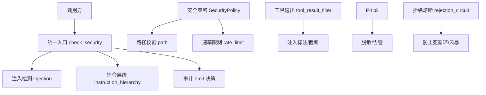

图表来源
- [check.rs:32-117](file://agent-diva-core/src/security/check.rs#L32-L117)
- [injection.rs:303-401](file://agent-diva-core/src/security/injection.rs#L303-L401)
- [instruction_hierarchy.rs:208-267](file://agent-diva-core/src/security/instruction_hierarchy.rs#L208-L267)
- [policy.rs:84-201](file://agent-diva-core/src/security/policy.rs#L84-L201)
- [rate_limit.rs:33-83](file://agent-diva-core/src/security/rate_limit.rs#L33-L83)
- [tool_result_filter.rs:68-132](file://agent-diva-core/src/security/tool_result_filter.rs#L68-L132)
- [pii.rs:302-627](file://agent-diva-core/src/security/pii.rs#L302-L627)
- [rejection_circuit.rs:22-56](file://agent-diva-core/src/security/rejection_circuit.rs#L22-L56)

章节来源
- [mod.rs:26-68](file://agent-diva-core/src/security/mod.rs#L26-L68)

## 核心组件
- 统一入口 check_security：组合注入检测与指令层级冲突检测，按严格原则生成最终决策，并记录审计事件。
- 安全策略 SecurityPolicy：封装路径校验、速率限制、读写模式、文件大小限制等，提供 can_act/validate_path 等原子能力。
- 配置 SecurityConfig：支持级别预设、运行时加载与合并、字段校验，以及预算与熔断窗口等运行期开关。
- 注入检测：三层防御（静态模式、熵值分析、模型分类占位），返回置信度与类型，供上层决策。
- 指令层级：对低层级消息尝试覆盖高层级指令的模式进行扫描与上报。
- 工具输出过滤：为外部不可信内容加标签、注入标注与长度截断，降低上下文污染风险。
- PII 检测：多类别正则匹配与校验（如 Luhn、身份证校验和），支持严重级别与自定义规则扩展。
- 速率限制与熔断：基于滑动窗口的 ActionTracker，配合 RejectionCircuitBreaker 防止拒绝风暴。

章节来源
- [check.rs:32-117](file://agent-diva-core/src/security/check.rs#L32-L117)
- [policy.rs:14-288](file://agent-diva-core/src/security/policy.rs#L14-L288)
- [config.rs:51-325](file://agent-diva-core/src/security/config.rs#L51-L325)
- [injection.rs:303-401](file://agent-diva-core/src/security/injection.rs#L303-L401)
- [instruction_hierarchy.rs:208-267](file://agent-diva-core/src/security/instruction_hierarchy.rs#L208-L267)
- [tool_result_filter.rs:68-132](file://agent-diva-core/src/security/tool_result_filter.rs#L68-L132)
- [pii.rs:302-627](file://agent-diva-core/src/security/pii.rs#L302-L627)
- [rate_limit.rs:33-83](file://agent-diva-core/src/security/rate_limit.rs#L33-L83)
- [rejection_circuit.rs:22-56](file://agent-diva-core/src/security/rejection_circuit.rs#L22-L56)

## 架构总览
安全检查以“统一入口 + 多检查器 + 统一决策”的方式组织，所有检查器通过审计事件对外暴露观测点，便于监控与排障。

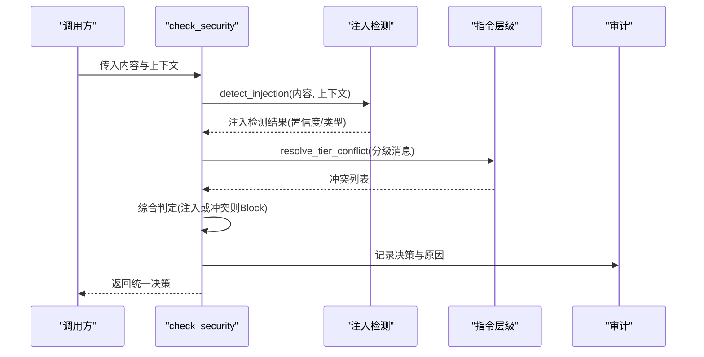

图表来源
- [check.rs:32-117](file://agent-diva-core/src/security/check.rs#L32-L117)
- [injection.rs:303-401](file://agent-diva-core/src/security/injection.rs#L303-L401)
- [instruction_hierarchy.rs:208-267](file://agent-diva-core/src/security/instruction_hierarchy.rs#L208-L267)

## 详细组件分析

### 统一入口与决策流程
- 执行顺序：先注入检测，再指令层级冲突检测；任一发现注入或冲突即 Block。
- 审计：对 Block/Sanitize/Quarantine 决策及消息拦截进行审计记录。
- 可扩展性：后续可在同一入口接入更多检查器（如 PII）并遵循相同决策语义。

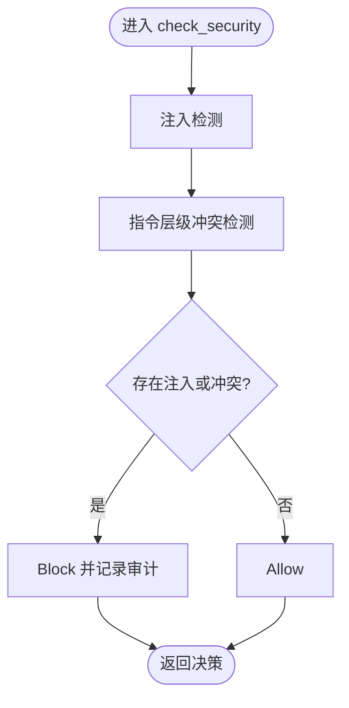

图表来源
- [check.rs:32-117](file://agent-diva-core/src/security/check.rs#L32-L117)

章节来源
- [check.rs:32-117](file://agent-diva-core/src/security/check.rs#L32-L117)
- [decision.rs:12-76](file://agent-diva-core/src/security/decision.rs#L12-L76)

### 注入检测（静态+熵值+模型占位）
- 静态模式：RegexSet 预编译 26+ 模式族，覆盖角色覆写、工具输出注入、越狱等。
- 熵值分析：Shannon 熵高于阈值时提升可疑度或单独标记。
- 模型分类：预留接口，当前返回空，便于未来接入 LLM 辅助判断。
- 审计：命中注入时记录层数、匹配模式与严重级别。

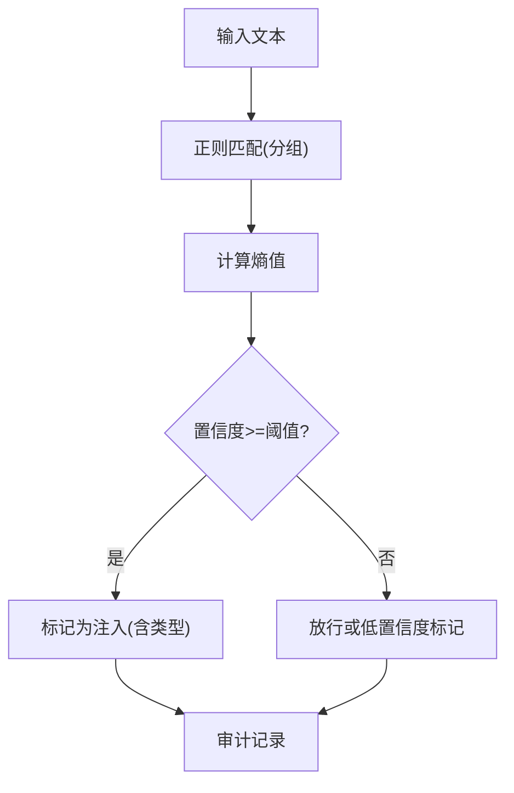

图表来源
- [injection.rs:119-248](file://agent-diva-core/src/security/injection.rs#L119-L248)
- [injection.rs:255-281](file://agent-diva-core/src/security/injection.rs#L255-L281)
- [injection.rs:303-401](file://agent-diva-core/src/security/injection.rs#L303-L401)

章节来源
- [injection.rs:303-401](file://agent-diva-core/src/security/injection.rs#L303-L401)

### 指令层级冲突检测
- 分级：System(最高) > User > Tool(最低)。
- 冲突模式：检测试图忽略/覆盖系统指令的低层级消息。
- 处理：Tool 层级冲突升级为注入检测；User 层级冲突直接标记。
- 审计：统计冲突数量与严重级别。

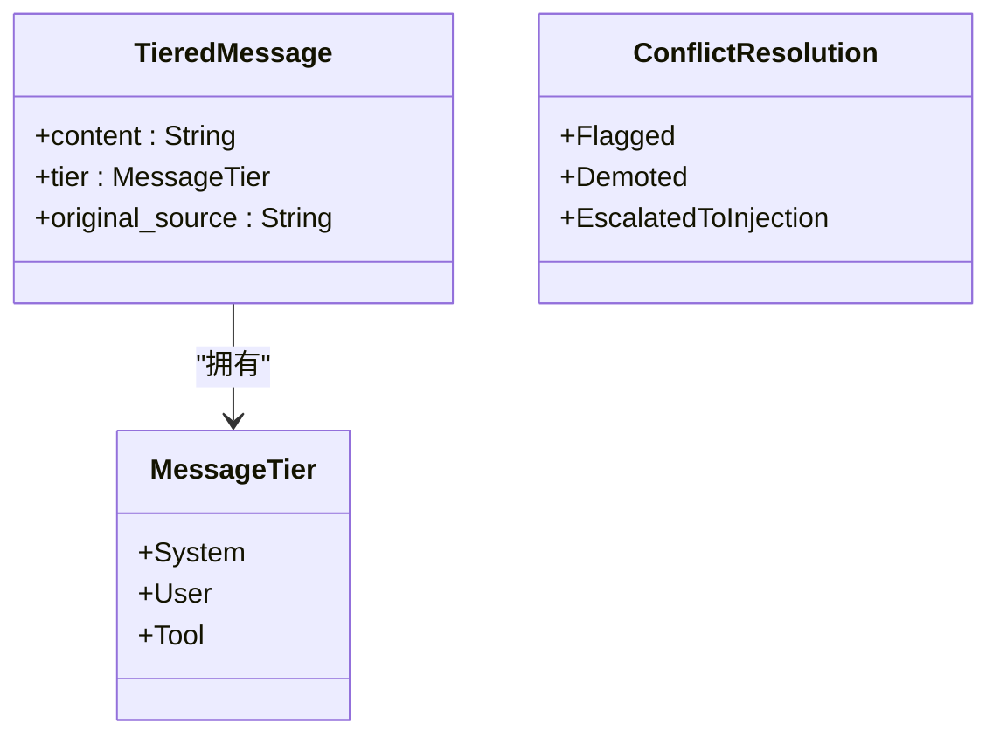

图表来源
- [instruction_hierarchy.rs:45-103](file://agent-diva-core/src/security/instruction_hierarchy.rs#L45-L103)
- [instruction_hierarchy.rs:208-267](file://agent-diva-core/src/security/instruction_hierarchy.rs#L208-L267)

章节来源
- [instruction_hierarchy.rs:208-267](file://agent-diva-core/src/security/instruction_hierarchy.rs#L208-L267)

### 工具输出过滤
- 不信任包裹：用 <untrusted>...</untrusted> 标记外部来源。
- 注入标注：若检测到注入模式，添加 [SUSPICIOUS] 前缀并记录审计。
- 截断：超过最大字符数时截断并附加提示，避免上下文耗尽攻击。

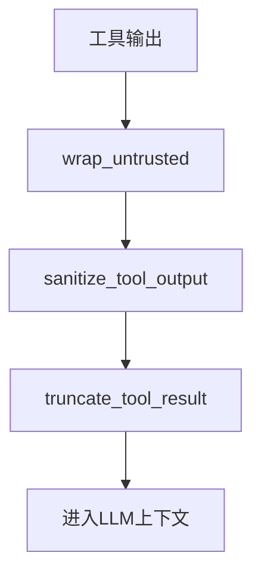

图表来源
- [tool_result_filter.rs:48-132](file://agent-diva-core/src/security/tool_result_filter.rs#L48-L132)

章节来源
- [tool_result_filter.rs:68-132](file://agent-diva-core/src/security/tool_result_filter.rs#L68-L132)

### PII 检测与脱敏
- 类别：邮箱、电话、中国身份证、信用卡、API Key、IP、护照、银行卡等。
- 校验：Luhn 校验卡号、身份证校验和、IPv4 段范围校验等。
- 严重级别：Warning 替换为 [REDACTED:Kind]；Error 直接拒绝（不脱敏）。
- 保护：内存记录 ID 等关键标识不被误伤。

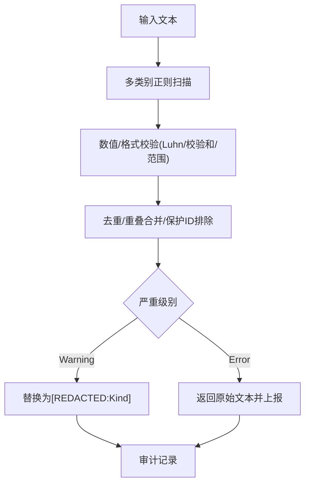

图表来源
- [pii.rs:167-216](file://agent-diva-core/src/security/pii.rs#L167-L216)
- [pii.rs:228-283](file://agent-diva-core/src/security/pii.rs#L228-L283)
- [pii.rs:302-627](file://agent-diva-core/src/security/pii.rs#L302-L627)

章节来源
- [pii.rs:302-627](file://agent-diva-core/src/security/pii.rs#L302-L627)

### 路径校验与工作区隔离
- 多层校验：空字节、穿越、URL编码穿越、波浪号展开、绝对路径限制、禁止前缀、禁止扩展名。
- 解析与白名单：解析后校验是否位于工作区或允许根目录。
- 符号链接：默认不允许跟随，避免逃逸。
- 父目录创建：TOCTOU 安全地创建并校验父目录。

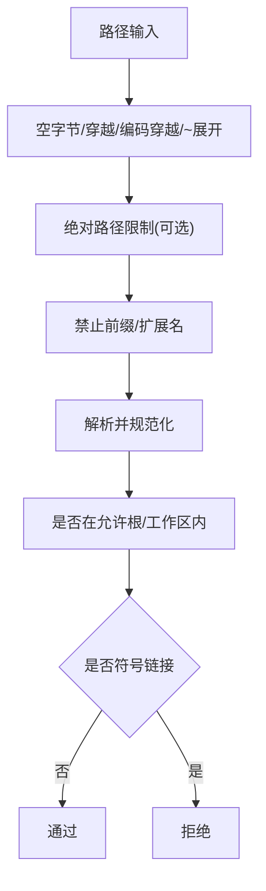

图表来源
- [policy.rs:84-201](file://agent-diva-core/src/security/policy.rs#L84-L201)
- [path.rs:8-149](file://agent-diva-core/src/security/path.rs#L8-L149)

章节来源
- [policy.rs:84-201](file://agent-diva-core/src/security/policy.rs#L84-L201)
- [path.rs:8-149](file://agent-diva-core/src/security/path.rs#L8-L149)

### 速率限制与拒绝熔断
- 滑动窗口限流：ActionTracker 维护最近窗口内的动作时间戳，支持计数、尝试记录与重置。
- 拒绝熔断：RejectionCircuitBreaker 在滑动窗口内统计模型/提供者拒绝失败次数，达到阈值则阻止新迭代，防止死循环/风暴。

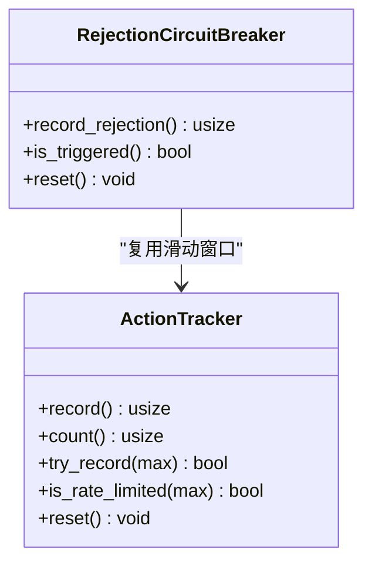

图表来源
- [rate_limit.rs:33-83](file://agent-diva-core/src/security/rate_limit.rs#L33-L83)
- [rejection_circuit.rs:22-56](file://agent-diva-core/src/security/rejection_circuit.rs#L22-L56)

章节来源
- [rate_limit.rs:33-83](file://agent-diva-core/src/security/rate_limit.rs#L33-L83)
- [rejection_circuit.rs:22-56](file://agent-diva-core/src/security/rejection_circuit.rs#L22-L56)

### 配置与策略管理
- 级别预设：Permissive/Standard/Strict/Paranoid，影响默认工作区限制、速率上限、只读模式等。
- 运行时加载：优先从工作区 .agent-diva/security.json 加载，其次用户目录 security.json 或 config.json 的 security 节，最后回退到默认。
- 合并与校验：非默认值覆盖，支持预算、超时、熔断窗口等字段的合并与校验。
- 策略聚合：SecurityPolicy 将配置、路径校验、速率限制整合为统一访问点。

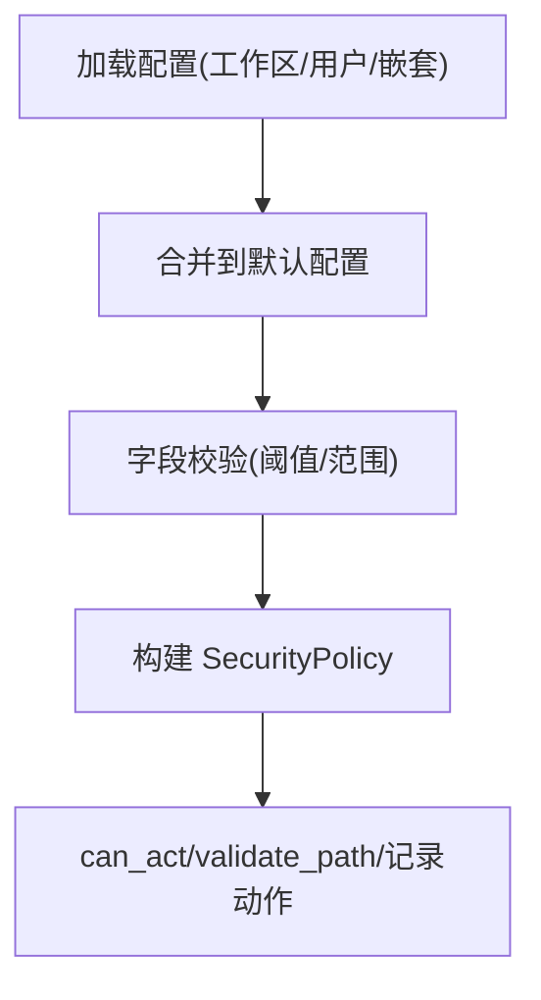

图表来源
- [config.rs:181-325](file://agent-diva-core/src/security/config.rs#L181-L325)
- [policy.rs:14-66](file://agent-diva-core/src/security/policy.rs#L14-L66)

章节来源
- [config.rs:181-325](file://agent-diva-core/src/security/config.rs#L181-L325)
- [policy.rs:14-66](file://agent-diva-core/src/security/policy.rs#L14-L66)

## 依赖关系分析
- check_security 依赖 injection 与 instruction_hierarchy，并统一产出 SecurityDecision。
- SecurityPolicy 依赖 PathValidator、ActionTracker 与 SecurityConfig。
- tool_result_filter 依赖 injection 的检测能力用于工具输出标注。
- rejection_circuit 复用 ActionTracker 实现滑动窗口统计。
- 审计事件贯穿各模块，形成统一的观测面。

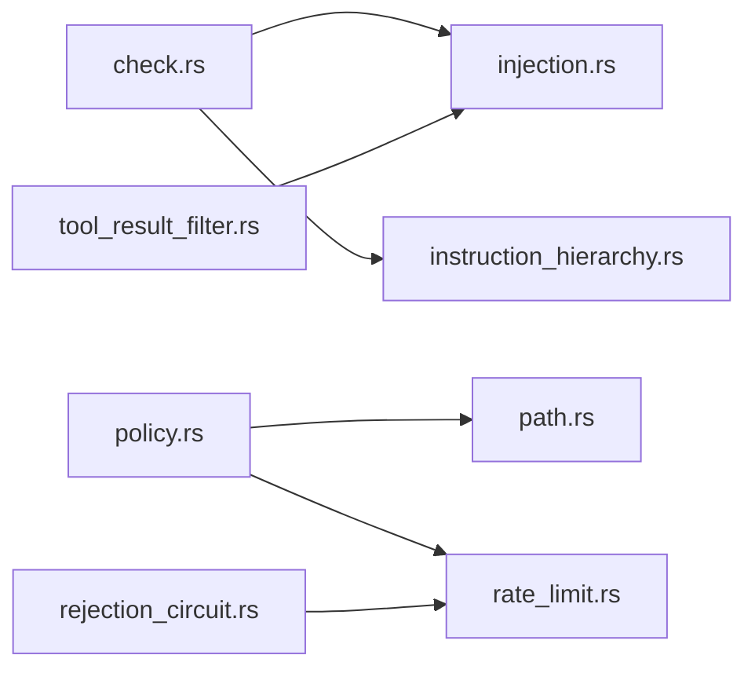

图表来源
- [check.rs:32-117](file://agent-diva-core/src/security/check.rs#L32-L117)
- [policy.rs:84-201](file://agent-diva-core/src/security/policy.rs#L84-L201)
- [tool_result_filter.rs:68-132](file://agent-diva-core/src/security/tool_result_filter.rs#L68-L132)
- [rejection_circuit.rs:22-56](file://agent-diva-core/src/security/rejection_circuit.rs#L22-L56)

章节来源
- [mod.rs:26-68](file://agent-diva-core/src/security/mod.rs#L26-L68)

## 性能考虑
- 注入检测使用一次性编译的 RegexSet，减少重复开销；大输入测试表明在合理时间内完成。
- 熵值计算为线性复杂度，阈值用于快速筛选高熵可疑片段。
- 工具输出截断避免长响应导致上下文膨胀；ANSI 转义清理减少无效字符处理。
- 路径校验在早期阶段拒绝非法路径，避免不必要的文件系统操作。
- 速率限制与熔断基于滑动窗口，避免全局锁竞争过大；必要时可按作用域拆分 tracker。
- PII 检测通过 OnceLock 缓存正则，并对候选进行重叠合并以减少替换成本。

章节来源
- [injection.rs:119-248](file://agent-diva-core/src/security/injection.rs#L119-L248)
- [injection.rs:700-723](file://agent-diva-core/src/security/injection.rs#L700-L723)
- [tool_result_filter.rs:99-132](file://agent-diva-core/src/security/tool_result_filter.rs#L99-L132)
- [pii.rs:167-216](file://agent-diva-core/src/security/pii.rs#L167-L216)

## 故障排查指南
- 常见错误类型：
  - 路径非法：包含空字节、穿越、URL编码穿越、~展开、绝对路径限制、禁止前缀/扩展名。
  - 速率超限：单位时间内动作过多。
  - 只读模式：Paranoid 级别或显式 read_only=true。
  - 注入/冲突：注入检测命中或指令层级冲突。
  - PII：根据严重级别决定脱敏或直接拒绝。
- 定位方法：
  - 查看审计事件：SecurityPolicyDecision、MessageBlocked、InjectionDetected、PiiRedacted、ToolOutputSanitized 等。
  - 检查配置：确认级别、阈值、窗口、白名单与黑名单是否正确加载与合并。
  - 复测用例：参考集成测试场景验证端到端流程。

章节来源
- [policy.rs:237-288](file://agent-diva-core/src/security/policy.rs#L237-L288)
- [check.rs:119-149](file://agent-diva-core/src/security/check.rs#L119-L149)
- [security_integration.rs:17-79](file://agent-diva-core/tests/security_integration.rs#L17-L79)

## 结论
该安全检查体系通过统一入口与分层检查器实现了高内聚、低耦合的安全能力组合。注入检测与指令层级冲突构成第一道防线，路径与工作区隔离、速率限制与熔断提供资源与稳定性保障，工具输出过滤与 PII 脱敏确保数据与上下文安全。审计事件贯穿全流程，便于监控与排障。建议在生产环境启用严格的级别预设，并根据业务需求调整阈值与白名单。

## 附录

### 检查器生命周期与执行顺序
- 生命周期：
  - 启动时加载配置并构建 SecurityPolicy。
  - 每次请求/消息进入 check_security，依次执行注入检测与指令层级冲突检测。
  - 工具输出在进入 LLM 上下文前经过过滤与截断。
  - 路径操作前进行多层校验与速率限制。
- 执行顺序：注入检测 → 指令层级冲突 → 决策 → 审计。

章节来源
- [check.rs:32-117](file://agent-diva-core/src/security/check.rs#L32-L117)
- [policy.rs:84-201](file://agent-diva-core/src/security/policy.rs#L84-L201)
- [tool_result_filter.rs:68-132](file://agent-diva-core/src/security/tool_result_filter.rs#L68-L132)

### 检查结果缓存与复用
- 注入检测的正则集合与工具输出的 ANSI 清理正则通过一次性初始化缓存，避免重复编译。
- 滑动窗口限流与熔断共享 ActionTracker，跨克隆实例共享状态，减少重复统计。
- 建议：如需跨请求复用复杂检测结果，可在上层引入请求指纹与结果缓存（注意失效策略与安全性）。

章节来源
- [injection.rs:119-248](file://agent-diva-core/src/security/injection.rs#L119-L248)
- [tool_result_filter.rs:99-112](file://agent-diva-core/src/security/tool_result_filter.rs#L99-L112)
- [rejection_circuit.rs:22-56](file://agent-diva-core/src/security/rejection_circuit.rs#L22-L56)

### 配置方法与示例
- 级别预设：
  - Permissive：宽松，适合开发。
  - Standard：默认，限制工作区与速率。
  - Strict：更严，降低速率上限。
  - Paranoid：只读模式，禁止写入。
- 运行时覆盖：
  - 工作区 .agent-diva/security.json 优先。
  - 用户目录 security.json 或 config.json 的 security 节。
- 关键字段：
  - max_actions_per_hour：每小时最大动作数。
  - forbidden_paths/forbidden_extensions：禁止路径前缀与扩展名。
  - allowed_roots：额外允许根目录。
  - global_tool_timeout_secs：工具执行超时。
  - token_budget_limit/per_task_token_budget：令牌预算限制。
  - rejection_circuit_window_secs/threshold：拒绝风暴窗口与阈值。

章节来源
- [config.rs:11-49](file://agent-diva-core/src/security/config.rs#L11-L49)
- [config.rs:142-178](file://agent-diva-core/src/security/config.rs#L142-L178)
- [config.rs:181-325](file://agent-diva-core/src/security/config.rs#L181-L325)

### 开发检查器的步骤
- 定义检查器职责与输入输出契约（建议使用 SecurityFinding 描述发现项）。
- 在 check_security 或相应管线（如工具输出过滤）中接入。
- 输出审计事件，便于观测与告警。
- 编写单元测试与集成测试，覆盖正常与异常分支。

章节来源
- [check.rs:32-117](file://agent-diva-core/src/security/check.rs#L32-L117)
- [tool_result_filter.rs:68-132](file://agent-diva-core/src/security/tool_result_filter.rs#L68-L132)
- [security_integration.rs:17-79](file://agent-diva-core/tests/security_integration.rs#L17-L79)

### 性能监控指标建议
- 注入检测耗时与命中率。
- 指令层级冲突数量与严重级别分布。
- 工具输出被标注为可疑的比例与截断比例。
- PII 检测类别计数与严重级别分布。
- 速率限制触发次数与熔断触发次数。
- 路径校验失败原因分布。

章节来源
- [injection.rs:371-393](file://agent-diva-core/src/security/injection.rs#L371-L393)
- [instruction_hierarchy.rs:240-264](file://agent-diva-core/src/security/instruction_hierarchy.rs#L240-L264)
- [tool_result_filter.rs:76-97](file://agent-diva-core/src/security/tool_result_filter.rs#L76-L97)
- [pii.rs:606-620](file://agent-diva-core/src/security/pii.rs#L606-L620)
- [rejection_circuit.rs:31-56](file://agent-diva-core/src/security/rejection_circuit.rs#L31-L56)