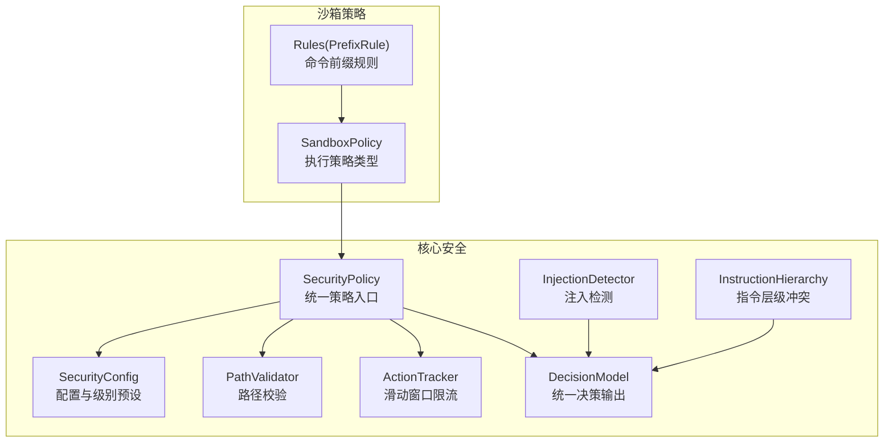
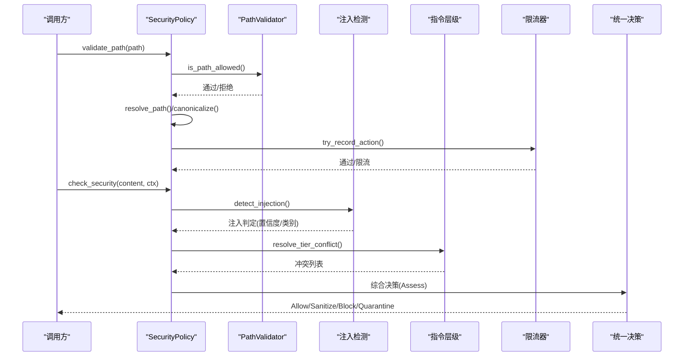
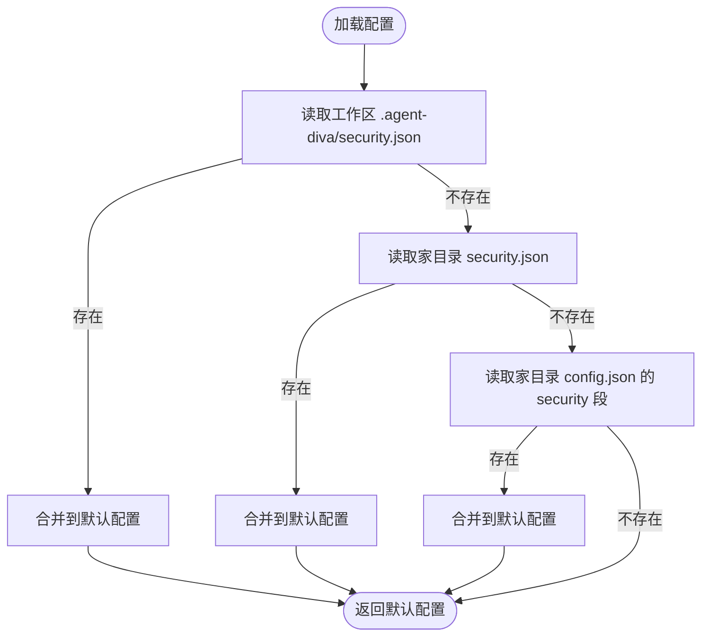
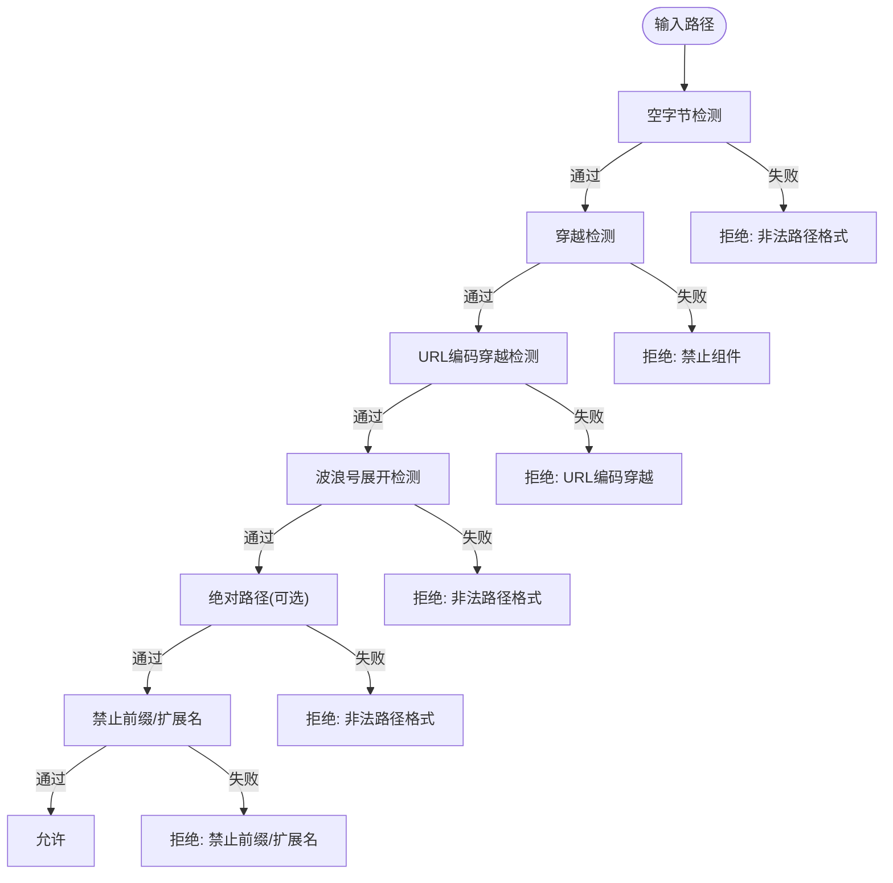
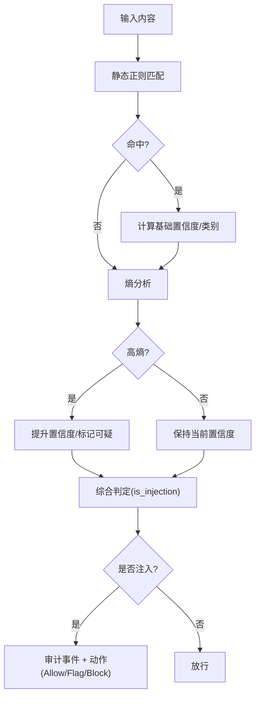
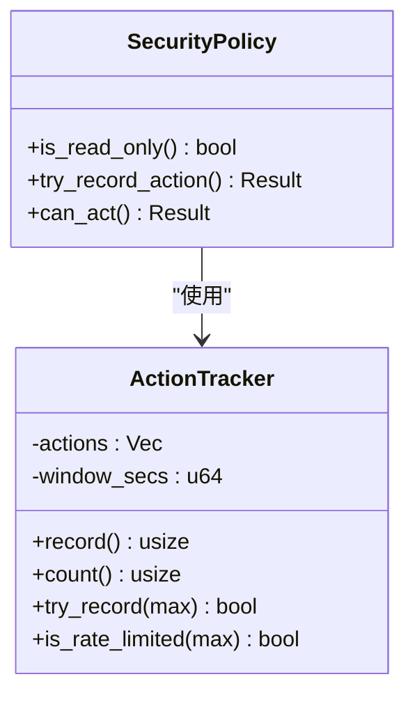
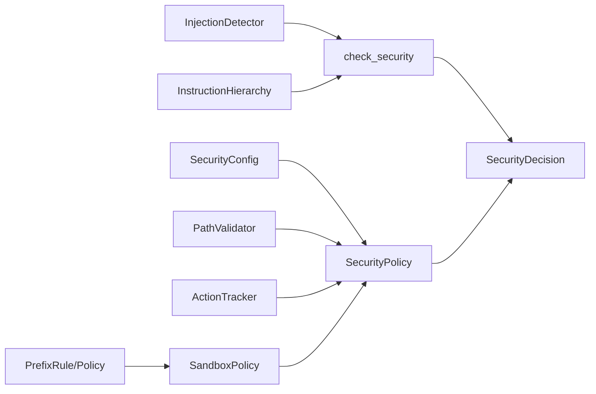
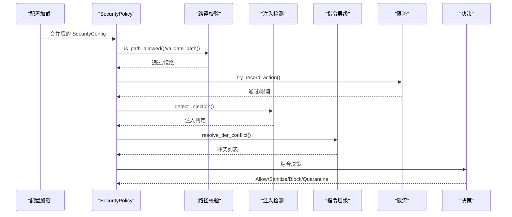

# 安全策略引擎

<cite>
**本文引用的文件**
- [agent-diva-core/src/security/mod.rs](file://agent-diva-core/src/security/mod.rs)
- [agent-diva-core/src/security/policy.rs](file://agent-diva-core/src/security/policy.rs)
- [agent-diva-core/src/security/config.rs](file://agent-diva-core/src/security/config.rs)
- [agent-diva-core/src/security/check.rs](file://agent-diva-core/src/security/check.rs)
- [agent-diva-core/src/security/decision.rs](file://agent-diva-core/src/security/decision.rs)
- [agent-diva-core/src/security/injection.rs](file://agent-diva-core/src/security/injection.rs)
- [agent-diva-core/src/security/rate_limit.rs](file://agent-diva-core/src/security/rate_limit.rs)
- [agent-diva-core/src/security/path.rs](file://agent-diva-core/src/security/path.rs)
- [agent-diva-core/src/security/instruction_hierarchy.rs](file://agent-diva-core/src/security/instruction_hierarchy.rs)
- [agent-diva-sandbox/src/policy.rs](file://agent-diva-sandbox/src/policy.rs)
- [agent-diva-sandbox/src/rules.rs](file://agent-diva-sandbox/src/rules.rs)
- [agent-diva-core/src/config/loader.rs](file://agent-diva-core/src/config/loader.rs)
</cite>

## 目录
1. [简介](#简介)
2. [项目结构](#项目结构)
3. [核心组件](#核心组件)
4. [架构总览](#架构总览)
5. [详细组件分析](#详细组件分析)
6. [依赖关系分析](#依赖关系分析)
7. [性能考量](#性能考量)
8. [故障排查指南](#故障排查指南)
9. [结论](#结论)
10. [附录](#附录)

## 简介
本文件面向“安全策略引擎”的设计与实现，系统性阐述策略定义、加载与执行机制；说明策略配置文件的格式与语法（访问控制规则、权限验证规则等）；解释策略匹配算法、优先级处理与冲突解决；提供复杂安全规则的示例；给出从策略加载到决策执行的完整流程图；并说明热更新机制与性能优化策略。

## 项目结构
安全策略引擎由核心模块 agent-diva-core 的安全子系统与 agent-diva-sandbox 的执行策略共同构成：
- 核心安全能力：路径校验、注入检测、指令层级冲突检测、速率限制、统一决策模型、策略配置与级别预设。
- 沙箱策略：将核心安全策略映射为沙箱执行策略（只读、工作区写入、外部沙箱、危险全开放），并提供命令前缀规则评估。



图表来源
- [agent-diva-core/src/security/policy.rs:14-297](file://agent-diva-core/src/security/policy.rs#L14-L297)
- [agent-diva-core/src/security/config.rs:11-178](file://agent-diva-core/src/security/config.rs#L11-L178)
- [agent-diva-core/src/security/path.rs:5-149](file://agent-diva-core/src/security/path.rs#L5-L149)
- [agent-diva-core/src/security/injection.rs:38-409](file://agent-diva-core/src/security/injection.rs#L38-L409)
- [agent-diva-core/src/security/instruction_hierarchy.rs:45-267](file://agent-diva-core/src/security/instruction_hierarchy.rs#L45-L267)
- [agent-diva-core/src/security/rate_limit.rs:6-84](file://agent-diva-core/src/security/rate_limit.rs#L6-L84)
- [agent-diva-core/src/security/decision.rs:12-76](file://agent-diva-core/src/security/decision.rs#L12-L76)
- [agent-diva-sandbox/src/policy.rs:9-108](file://agent-diva-sandbox/src/policy.rs#L9-L108)
- [agent-diva-sandbox/src/rules.rs:10-182](file://agent-diva-sandbox/src/rules.rs#L10-L182)

章节来源
- [agent-diva-core/src/security/mod.rs:1-69](file://agent-diva-core/src/security/mod.rs#L1-L69)

## 核心组件
- SecurityPolicy：统一协调配置、路径校验、速率限制与读写模式，提供路径解析、父目录校验、动作记录与大小限制等能力。
- SecurityConfig：策略配置与级别预设（宽松/标准/严格/偏执），支持合并与校验，提供预算与拒绝熔断等运行时参数。
- PathValidator：多层路径安全检查（空字节、穿越、URL编码穿越、波浪号展开、绝对路径、禁止前缀、扩展名）。
- InjectionDetector：三层注入检测（静态正则、熵分析、预留模型分类），输出置信度与类别。
- InstructionHierarchy：基于层级的消息优先级（系统>用户>工具），检测并上报低层试图覆盖高层的指令冲突。
- ActionTracker：滑动窗口限流器，按小时统计动作次数，防止滥用。
- DecisionModel：统一决策输出（允许/清洗/阻止/隔离），承载发现项与上下文。
- SandboxPolicy/Rules：将核心策略映射为沙箱执行策略，并通过命令前缀规则进行细粒度审批控制。

章节来源
- [agent-diva-core/src/security/policy.rs:14-297](file://agent-diva-core/src/security/policy.rs#L14-L297)
- [agent-diva-core/src/security/config.rs:11-178](file://agent-diva-core/src/security/config.rs#L11-L178)
- [agent-diva-core/src/security/path.rs:5-149](file://agent-diva-core/src/security/path.rs#L5-L149)
- [agent-diva-core/src/security/injection.rs:38-409](file://agent-diva-core/src/security/injection.rs#L38-L409)
- [agent-diva-core/src/security/instruction_hierarchy.rs:45-267](file://agent-diva-core/src/security/instruction_hierarchy.rs#L45-L267)
- [agent-diva-core/src/security/rate_limit.rs:6-84](file://agent-diva-core/src/security/rate_limit.rs#L6-L84)
- [agent-diva-core/src/security/decision.rs:12-76](file://agent-diva-core/src/security/decision.rs#L12-L76)
- [agent-diva-sandbox/src/policy.rs:9-108](file://agent-diva-sandbox/src/policy.rs#L9-L108)
- [agent-diva-sandbox/src/rules.rs:10-182](file://agent-diva-sandbox/src/rules.rs#L10-L182)

## 架构总览
安全策略引擎以 SecurityPolicy 为中心，串联配置加载、路径校验、注入检测、指令层级冲突检测与限流，最终产出统一决策。沙箱侧通过 SandboxPolicy 将核心策略转换为执行约束，并结合命令前缀规则决定是否需要人工审批或拒绝。



图表来源
- [agent-diva-core/src/security/policy.rs:74-287](file://agent-diva-core/src/security/policy.rs#L74-L287)
- [agent-diva-core/src/security/path.rs:8-149](file://agent-diva-core/src/security/path.rs#L8-L149)
- [agent-diva-core/src/security/injection.rs:299-409](file://agent-diva-core/src/security/injection.rs#L299-L409)
- [agent-diva-core/src/security/instruction_hierarchy.rs:201-267](file://agent-diva-core/src/security/instruction_hierarchy.rs#L201-L267)
- [agent-diva-core/src/security/rate_limit.rs:32-63](file://agent-diva-core/src/security/rate_limit.rs#L32-L63)
- [agent-diva-core/src/security/decision.rs:12-76](file://agent-diva-core/src/security/decision.rs#L12-L76)

## 详细组件分析

### 策略配置与级别预设
- 级别预设：Permissive/Standard/Strict/Paranoid，分别对应不同的默认最大动作数、是否强制工作区、是否只读等。
- 配置合并：支持从工作区与家目录的多级 JSON 配置合并，缺失或错误时回退默认值。
- 校验：对关键阈值（如全局工具超时、注入阻断阈值）进行合法性检查。



图表来源
- [agent-diva-core/src/security/config.rs:181-231](file://agent-diva-core/src/security/config.rs#L181-L231)

章节来源
- [agent-diva-core/src/security/config.rs:11-178](file://agent-diva-core/src/security/config.rs#L11-L178)
- [agent-diva-core/src/security/config.rs:181-325](file://agent-diva-core/src/security/config.rs#L181-L325)

### 路径校验与安全边界
- 多层防护：空字节、穿越、URL编码穿越、波浪号展开、绝对路径、禁止前缀、扩展名黑名单。
- 工作区边界：可强制仅在工作区内操作，支持额外白名单根目录；解析后校验是否在允许范围内。
- 符号链接保护：在禁用符号链接模式下拒绝；或在开启时校验解析后不逃逸工作区。



图表来源
- [agent-diva-core/src/security/policy.rs:74-137](file://agent-diva-core/src/security/policy.rs#L74-L137)
- [agent-diva-core/src/security/path.rs:8-149](file://agent-diva-core/src/security/path.rs#L8-L149)

章节来源
- [agent-diva-core/src/security/policy.rs:74-233](file://agent-diva-core/src/security/policy.rs#L74-L233)
- [agent-diva-core/src/security/path.rs:8-149](file://agent-diva-core/src/security/path.rs#L8-L149)

### 注入检测与指令层级冲突
- 注入检测：三层防御（静态正则、熵分析、预留模型分类），输出类别与置信度，结合上下文决定放行、标记或阻止。
- 指令层级：系统>用户>工具，检测低层试图覆盖高层的模式，记录冲突并可选择升级至注入检测。



图表来源
- [agent-diva-core/src/security/injection.rs:299-409](file://agent-diva-core/src/security/injection.rs#L299-L409)

章节来源
- [agent-diva-core/src/security/injection.rs:38-409](file://agent-diva-core/src/security/injection.rs#L38-L409)
- [agent-diva-core/src/security/instruction_hierarchy.rs:105-267](file://agent-diva-core/src/security/instruction_hierarchy.rs#L105-L267)
- [agent-diva-core/src/security/check.rs:15-117](file://agent-diva-core/src/security/check.rs#L15-L117)

### 速率限制与读写模式
- 滑动窗口限流：按小时统计动作次数，超过阈值则拒绝。
- 读写模式：根据级别或配置启用只读模式，阻止写操作。



图表来源
- [agent-diva-core/src/security/rate_limit.rs:6-84](file://agent-diva-core/src/security/rate_limit.rs#L6-L84)
- [agent-diva-core/src/security/policy.rs:235-287](file://agent-diva-core/src/security/policy.rs#L235-L287)

章节来源
- [agent-diva-core/src/security/rate_limit.rs:6-84](file://agent-diva-core/src/security/rate_limit.rs#L6-L84)
- [agent-diva-core/src/security/policy.rs:235-287](file://agent-diva-core/src/security/policy.rs#L235-L287)

### 沙箱策略与命令规则
- 策略映射：将核心 SecurityPolicy 映射为沙箱执行策略（危险全开放、只读、工作区写入、外部沙箱），并设置网络访问与临时目录环境变量策略。
- 命令规则：基于命令前缀的规则集合，支持 allow/prompt/forbidden 等决策，并可附带理由用于审计。

```mermaid
classDiagram
class SandboxPolicy {
<<enum>>
DangerFullAccess
ReadOnly{access,network_access}
WorkspaceWrite{writable_roots,read_only_access,network_access,exclude_tmpdir_env_var}
ExternalSandbox{network_access}
+to_security_policy(workspace) SecurityPolicy
}
class PrefixRule {
+pattern : Vec~String~
+decision : Decision
+justification : Option~String~
+matches(cmd) bool
}
class Policy {
+prefix_rules : Vec~PrefixRule~
+evaluate(cmd) Evaluation
}
SandboxPolicy --> SecurityPolicy : "转换"
Policy --> PrefixRule : "包含"
```

图表来源
- [agent-diva-sandbox/src/policy.rs:9-108](file://agent-diva-sandbox/src/policy.rs#L9-L108)
- [agent-diva-sandbox/src/rules.rs:10-182](file://agent-diva-sandbox/src/rules.rs#L10-L182)

章节来源
- [agent-diva-sandbox/src/policy.rs:9-108](file://agent-diva-sandbox/src/policy.rs#L9-L108)
- [agent-diva-sandbox/src/rules.rs:10-182](file://agent-diva-sandbox/src/rules.rs#L10-L182)

## 依赖关系分析
- SecurityPolicy 依赖 SecurityConfig、PathValidator、ActionTracker，并组合注入检测与指令层级冲突检测结果，产出统一决策。
- 沙箱策略依赖核心策略，将其转换为执行约束；命令规则独立于核心策略，但影响执行审批流程。
- 配置加载支持多源合并，确保策略可被工作区与用户配置灵活覆盖。



图表来源
- [agent-diva-core/src/security/policy.rs:14-297](file://agent-diva-core/src/security/policy.rs#L14-L297)
- [agent-diva-core/src/security/check.rs:15-117](file://agent-diva-core/src/security/check.rs#L15-L117)
- [agent-diva-core/src/security/decision.rs:12-76](file://agent-diva-core/src/security/decision.rs#L12-L76)
- [agent-diva-sandbox/src/policy.rs:9-108](file://agent-diva-sandbox/src/policy.rs#L9-L108)
- [agent-diva-sandbox/src/rules.rs:10-182](file://agent-diva-sandbox/src/rules.rs#L10-L182)

章节来源
- [agent-diva-core/src/security/policy.rs:14-297](file://agent-diva-core/src/security/policy.rs#L14-L297)
- [agent-diva-core/src/security/check.rs:15-117](file://agent-diva-core/src/security/check.rs#L15-L117)
- [agent-diva-core/src/security/decision.rs:12-76](file://agent-diva-core/src/security/decision.rs#L12-L76)
- [agent-diva-sandbox/src/policy.rs:9-108](file://agent-diva-sandbox/src/policy.rs#L9-L108)
- [agent-diva-sandbox/src/rules.rs:10-182](file://agent-diva-sandbox/src/rules.rs#L10-L182)

## 性能考量
- 注入检测采用预编译正则集与一次性初始化，避免重复开销；熵分析仅在必要时参与置信度调整。
- 路径校验为轻量字符串与路径操作，配合异步规范化减少阻塞。
- 限流器使用滑动窗口与互斥锁，时间复杂度近似 O(n) 清理过期条目，适合高频短周期场景。
- 配置合并采用优先顺序与短路逻辑，减少不必要的 IO。

[本节为通用性能讨论，不直接分析具体文件]

## 故障排查指南
- 路径相关错误：检查是否触发空字节、穿越、URL编码穿越、禁止前缀或扩展名；确认工作区边界与符号链接策略。
- 注入检测误报/漏报：查看注入类别与置信度，调整注入阻断阈值；关注高熵文本导致的标记。
- 指令层级冲突：检查是否存在“忽略系统提示/覆盖指令”等模式；确认来源层级是否正确标注。
- 限流触发：核对每小时最大动作数与工作负载峰值；必要时提高限制或拆分任务。
- 配置未生效：确认工作区与家目录配置文件路径与优先级；检查字段是否属于热更新范围。

章节来源
- [agent-diva-core/src/security/path.rs:8-149](file://agent-diva-core/src/security/path.rs#L8-L149)
- [agent-diva-core/src/security/injection.rs:299-409](file://agent-diva-core/src/security/injection.rs#L299-L409)
- [agent-diva-core/src/security/instruction_hierarchy.rs:201-267](file://agent-diva-core/src/security/instruction_hierarchy.rs#L201-L267)
- [agent-diva-core/src/security/rate_limit.rs:32-84](file://agent-diva-core/src/security/rate_limit.rs#L32-L84)
- [agent-diva-core/src/security/config.rs:181-231](file://agent-diva-core/src/security/config.rs#L181-L231)

## 结论
安全策略引擎通过统一的策略对象整合路径校验、注入检测、指令层级冲突与限流，提供一致的安全决策接口；沙箱策略将核心策略映射为可执行的执行约束，并以命令前缀规则细化审批流程。配置支持多级合并与热更新，兼顾安全性与灵活性。建议在生产环境中结合业务需求合理设置级别与阈值，并持续监控审计事件以优化策略。

[本节为总结性内容，不直接分析具体文件]

## 附录

### 策略配置文件格式与语法
- 位置与优先级：工作区 .agent-diva/security.json > 家目录 .agent-diva/security.json > 家目录 config.json 的 security 段。
- 关键字段（节选）：
  - level：安全级别（permissive/standard/strict/paranoid）
  - workspace_only：是否限制在工作区内
  - max_actions_per_hour：每小时最大动作数
  - forbidden_paths/forbidden_extensions：禁止路径前缀/扩展名
  - allowed_roots：额外允许的根目录
  - read_only：覆盖级别只读开关
  - max_file_size：最大文件大小
  - allow_symlinks：是否允许符号链接
  - pii_severity/pii_enabled：PII 检测严重性与开关
  - injection_enabled/injection_block_threshold：注入检测开关与阻断阈值
  - global_tool_timeout_secs：全局工具超时秒数
  - token_budget_limit/per_task_token_budget：会话/任务级令牌预算
  - rejection_circuit_window_secs/rejection_circuit_threshold：拒绝熔断窗口与阈值

章节来源
- [agent-diva-core/src/security/config.rs:11-178](file://agent-diva-core/src/security/config.rs#L11-L178)
- [agent-diva-core/src/security/config.rs:181-231](file://agent-diva-core/src/security/config.rs#L181-L231)

### 访问控制与权限验证规则示例
- 访问控制：
  - 仅允许工作区内读写，额外允许缓存目录写入。
  - 禁止执行特定扩展名（如 .exe/.dll/.bat/.cmd/.sh）。
  - 禁止访问敏感路径前缀（/etc、/root、/sys、/proc、~/.ssh 等）。
- 权限验证：
  - 只读模式：禁止所有写操作。
  - 符号链接：禁用或要求解析后仍在工作区内。
  - 令牌预算：限制会话与任务的累计令牌消耗。

章节来源
- [agent-diva-core/src/security/config.rs:11-178](file://agent-diva-core/src/security/config.rs#L11-L178)
- [agent-diva-core/src/security/policy.rs:74-233](file://agent-diva-core/src/security/policy.rs#L74-L233)

### 策略执行流程图（从加载到决策）


图表来源
- [agent-diva-core/src/security/config.rs:181-231](file://agent-diva-core/src/security/config.rs#L181-L231)
- [agent-diva-core/src/security/policy.rs:74-287](file://agent-diva-core/src/security/policy.rs#L74-L287)
- [agent-diva-core/src/security/injection.rs:299-409](file://agent-diva-core/src/security/injection.rs#L299-L409)
- [agent-diva-core/src/security/instruction_hierarchy.rs:201-267](file://agent-diva-core/src/security/instruction_hierarchy.rs#L201-L267)
- [agent-diva-core/src/security/rate_limit.rs:32-84](file://agent-diva-core/src/security/rate_limit.rs#L32-L84)

### 热更新机制
- 配置热更新：通过监听文件 mtime 变化，比较新旧配置差异，区分可热更新字段与需重启字段，并在回调中应用变更。
- 策略热更新：工作区与家目录的 security.json 变更会被加载并合并到当前配置，无需重启服务即可生效（受限于字段分类）。

章节来源
- [agent-diva-core/src/config/loader.rs:149-172](file://agent-diva-core/src/config/loader.rs#L149-L172)
- [agent-diva-core/src/config/loader.rs:180-219](file://agent-diva-core/src/config/loader.rs#L180-L219)
- [agent-diva-core/src/config/loader.rs:1025-1089](file://agent-diva-core/src/config/loader.rs#L1025-L1089)