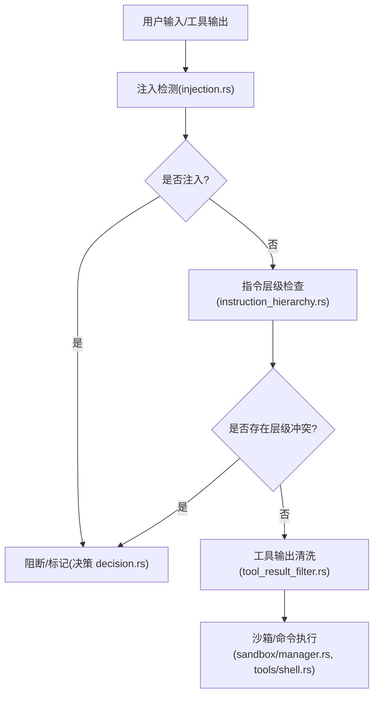
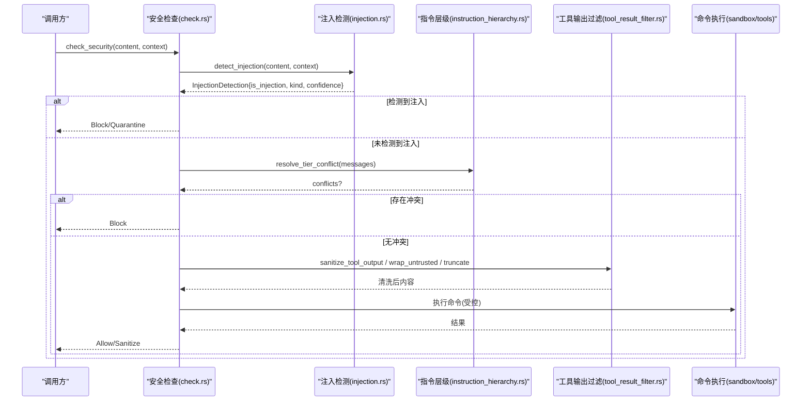
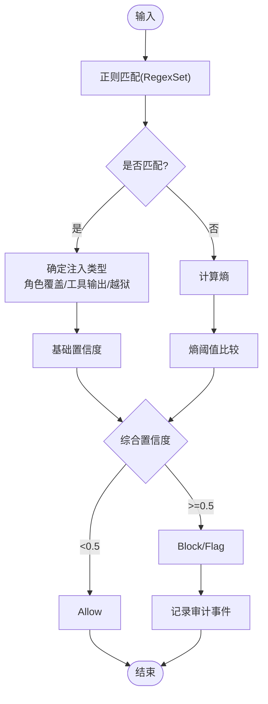
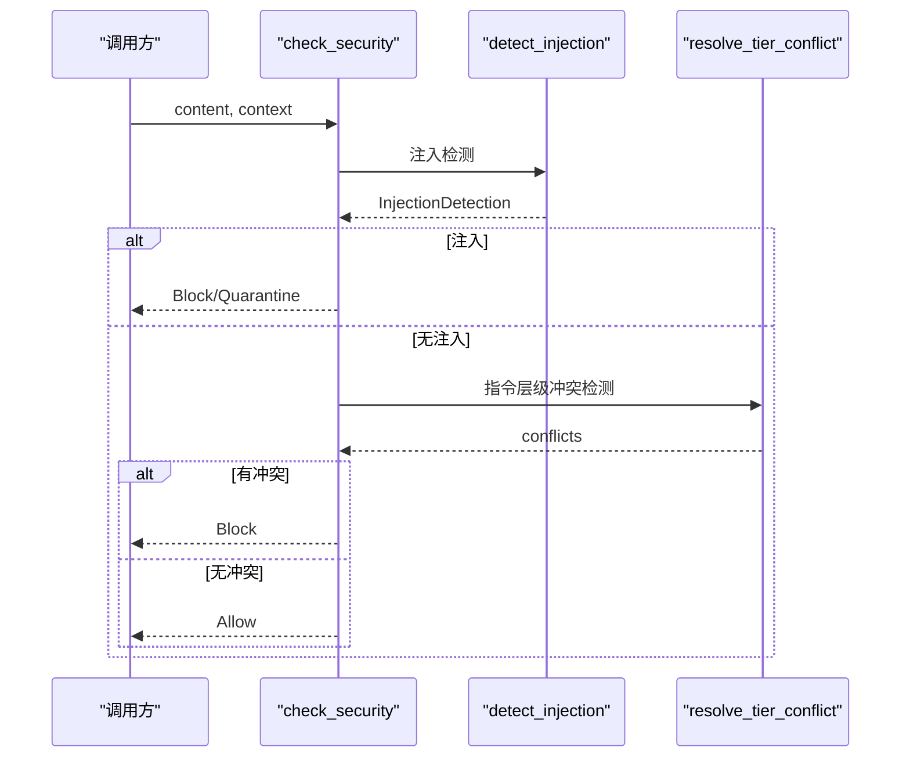
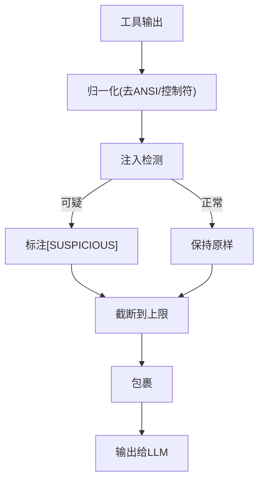
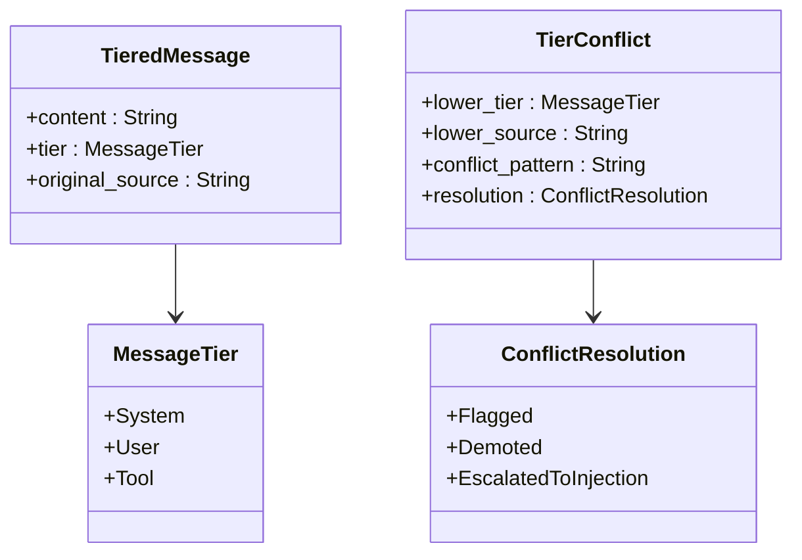
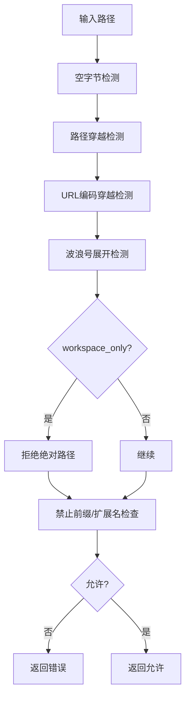
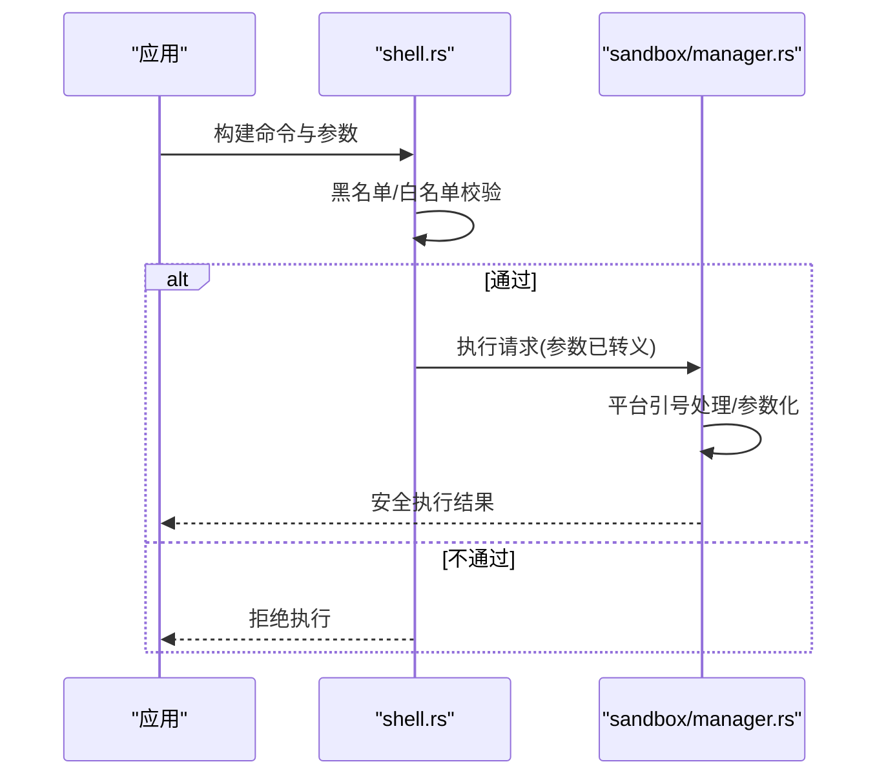
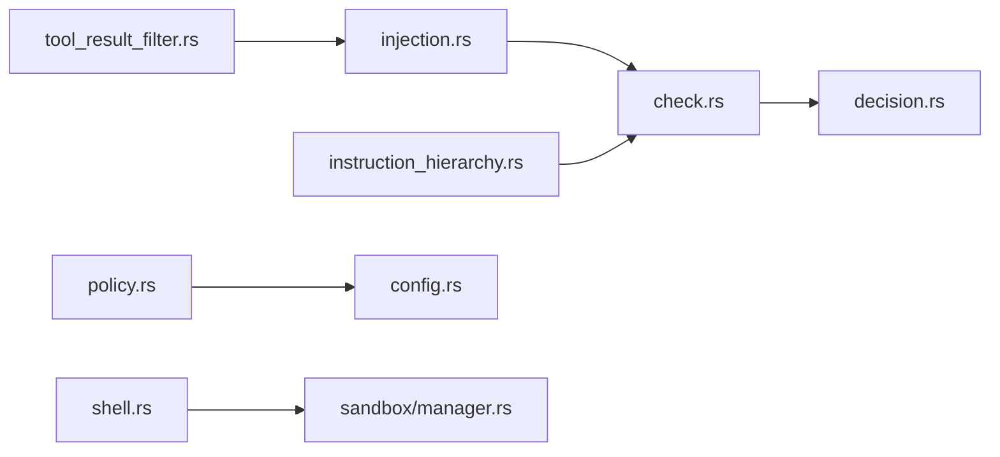

# 注入防护

<cite>
**本文引用的文件**
- [agent-diva-core/src/security/injection.rs](file://agent-diva-core/src/security/injection.rs)
- [agent-diva-core/src/security/check.rs](file://agent-diva-core/src/security/check.rs)
- [agent-diva-core/src/security/tool_result_filter.rs](file://agent-diva-core/src/security/tool_result_filter.rs)
- [agent-diva-core/src/security/config.rs](file://agent-diva-core/src/security/config.rs)
- [agent-diva-core/src/security/policy.rs](file://agent-diva-core/src/security/policy.rs)
- [agent-diva-core/src/security/instruction_hierarchy.rs](file://agent-diva-core/src/security/instruction_hierarchy.rs)
- [agent-diva-core/src/security/decision.rs](file://agent-diva-core/src/security/decision.rs)
- [agent-diva-tools/src/shell.rs](file://agent-diva-tools/src/shell.rs)
- [agent-diva-sandbox/src/manager.rs](file://agent-diva-sandbox/src/manager.rs)
</cite>

## 目录
1. [简介](#简介)
2. [项目结构](#项目结构)
3. [核心组件](#核心组件)
4. [架构总览](#架构总览)
5. [详细组件分析](#详细组件分析)
6. [依赖关系分析](#依赖关系分析)
7. [性能考量](#性能考量)
8. [故障排查指南](#故障排查指南)
9. [结论](#结论)
10. [附录：配置与扩展](#附录：配置与扩展)

## 简介
本文件聚焦于“注入防护”的完整实现与使用，覆盖提示词注入、命令注入、XSS（跨站脚本）等攻击面。文档基于代码库中的安全子系统，系统阐述三层检测机制（静态模式匹配、熵分析、模型分类预留）、输入验证与过滤（白名单/黑名单/正则）、工具输出清洗、指令层级冲突检测、以及沙箱与命令执行的安全策略。同时提供可操作的配置示例与扩展方法，并给出攻击向量图与防护效果对比。

## 项目结构
注入防护相关能力集中在 agent-diva-core 的安全模块中，并在 tools 与 sandbox 子系统中对命令执行进行加固。关键路径如下：
- 注入检测与决策：injection.rs、check.rs、decision.rs
- 工具输出清洗：tool_result_filter.rs
- 指令层级与冲突：instruction_hierarchy.rs
- 安全配置与策略：config.rs、policy.rs
- 命令执行防护：tools/shell.rs、sandbox/manager.rs

图表来源
- [agent-diva-core/src/security/injection.rs:299-401](file://agent-diva-core/src/security/injection.rs#L299-L401)
- [agent-diva-core/src/security/check.rs:32-117](file://agent-diva-core/src/security/check.rs#L32-L117)
- [agent-diva-core/src/security/instruction_hierarchy.rs:208-267](file://agent-diva-core/src/security/instruction_hierarchy.rs#L208-L267)
- [agent-diva-core/src/security/tool_result_filter.rs:61-132](file://agent-diva-core/src/security/tool_result_filter.rs#L61-L132)
- [agent-diva-sandbox/src/manager.rs:721-753](file://agent-diva-sandbox/src/manager.rs#L721-L753)
- [agent-diva-tools/src/shell.rs:187-209](file://agent-diva-tools/src/shell.rs#L187-L209)

章节来源
- [agent-diva-core/src/security/mod.rs:26-68](file://agent-diva-core/src/security/mod.rs#L26-L68)

## 核心组件
- 注入检测器：基于正则集合的静态模式匹配 + 香农熵分析 + 模型分类预留接口，支持角色覆盖、工具输出注入、越狱三类注入识别，并输出置信度与匹配模式。
- 统一安全检查入口：串联注入检测与指令层级冲突检测，产出统一的 SecurityDecision（允许/清洗/阻断/隔离）。
- 工具输出过滤器：将外部不可信内容包裹为 <untrusted>，检测并标注可疑片段，限制最大长度防止上下文耗尽。
- 指令层级系统：定义 System > User > Tool 的优先级，检测低层级消息试图覆盖高层级指令的模式，必要时升级至注入检测。
- 安全配置与策略：提供安全级别预设、路径校验、速率限制、PII 开关、注入阈值等；聚合为统一策略对象。
- 命令执行防护：在 shell 层进行危险命令黑名单/白名单校验；在沙箱层通过参数转义与平台特定引号处理避免命令注入。

章节来源
- [agent-diva-core/src/security/injection.rs:38-93](file://agent-diva-core/src/security/injection.rs#L38-L93)
- [agent-diva-core/src/security/check.rs:32-117](file://agent-diva-core/src/security/check.rs#L32-L117)
- [agent-diva-core/src/security/tool_result_filter.rs:35-132](file://agent-diva-core/src/security/tool_result_filter.rs#L35-L132)
- [agent-diva-core/src/security/instruction_hierarchy.rs:45-132](file://agent-diva-core/src/security/instruction_hierarchy.rs#L45-L132)
- [agent-diva-core/src/security/config.rs:51-128](file://agent-diva-core/src/security/config.rs#L51-L128)
- [agent-diva-core/src/security/policy.rs:14-288](file://agent-diva-core/src/security/policy.rs#L14-L288)
- [agent-diva-tools/src/shell.rs:187-209](file://agent-diva-tools/src/shell.rs#L187-L209)
- [agent-diva-sandbox/src/manager.rs:721-753](file://agent-diva-sandbox/src/manager.rs#L721-L753)

## 架构总览
注入防护采用“多层防御 + 统一决策”的架构：
- 第一层：静态模式匹配（RegexSet），快速命中已知注入家族（角色覆盖、工具输出注入、越狱）。
- 第二层：熵分析，检测高熵编码（如 base64/ROT13/hex）以捕获绕过正则的载荷。
- 第三层：模型分类预留接口，便于未来接入 LLM 辅助判断。
- 指令层级：确保系统指令不被用户或工具输出覆盖，冲突时升级至注入检测。
- 工具输出：不可信内容被包裹、清洗、截断，降低上下文污染风险。
- 命令执行：严格参数化与平台引号处理，配合黑名单/白名单与沙箱环境。

图表来源
- [agent-diva-core/src/security/check.rs:32-117](file://agent-diva-core/src/security/check.rs#L32-L117)
- [agent-diva-core/src/security/injection.rs:299-401](file://agent-diva-core/src/security/injection.rs#L299-L401)
- [agent-diva-core/src/security/instruction_hierarchy.rs:208-267](file://agent-diva-core/src/security/instruction_hierarchy.rs#L208-L267)
- [agent-diva-core/src/security/tool_result_filter.rs:61-132](file://agent-diva-core/src/security/tool_result_filter.rs#L61-L132)
- [agent-diva-sandbox/src/manager.rs:721-753](file://agent-diva-sandbox/src/manager.rs#L721-L753)

## 详细组件分析

### 注入检测器（injection.rs）
- 数据模型：InjectionKind（RoleOverride/ToolOutputInjection/Jailbreak）、InjectionAction（Allow/Flag/Block）、InjectionContext（UserMessage/ToolOutput）。
- 三层检测：
  - 静态模式匹配：预编译 RegexSet，按类别分组（角色覆盖、工具输出注入、越狱），返回匹配模式名称。
  - 熵分析：计算香农熵，超过阈值则提升置信度或单独标记。
  - 模型分类：预留接口，当前返回 None。
- 动作判定：根据注入类型与上下文决定 Allow/Flag/Block。
- 审计事件：检测到注入时记录审计日志。

图表来源
- [agent-diva-core/src/security/injection.rs:99-249](file://agent-diva-core/src/security/injection.rs#L99-L249)
- [agent-diva-core/src/security/injection.rs:255-281](file://agent-diva-core/src/security/injection.rs#L255-L281)
- [agent-diva-core/src/security/injection.rs:299-401](file://agent-diva-core/src/security/injection.rs#L299-L401)

章节来源
- [agent-diva-core/src/security/injection.rs:38-93](file://agent-diva-core/src/security/injection.rs#L38-L93)
- [agent-diva-core/src/security/injection.rs:99-249](file://agent-diva-core/src/security/injection.rs#L99-L249)
- [agent-diva-core/src/security/injection.rs:299-401](file://agent-diva-core/src/security/injection.rs#L299-L401)

### 统一安全检查入口（check.rs）
- 功能：串联注入检测与指令层级冲突检测，生成 SecurityDecision。
- 决策优先级：注入或严重策略违规优先阻断；否则允许。
- 审计：对阻断与安全策略决策进行审计记录。

图表来源
- [agent-diva-core/src/security/check.rs:32-117](file://agent-diva-core/src/security/check.rs#L32-L117)
- [agent-diva-core/src/security/instruction_hierarchy.rs:208-267](file://agent-diva-core/src/security/instruction_hierarchy.rs#L208-L267)

章节来源
- [agent-diva-core/src/security/check.rs:32-117](file://agent-diva-core/src/security/check.rs#L32-L117)
- [agent-diva-core/src/security/decision.rs:12-61](file://agent-diva-core/src/security/decision.rs#L12-L61)

### 工具输出过滤（tool_result_filter.rs）
- 不可信包裹：所有工具输出用 <untrusted>...</untrusted> 包裹，明确来源不可信。
- 注入清洗：复用注入检测，若发现可疑内容，整体标注 [SUSPICIOUS] 并记录审计。
- 截断保护：限制最大字符数，防止上下文窗口耗尽攻击。
- 终端输出归一化：去除 ANSI 转义与控制字符，减少干扰。

图表来源
- [agent-diva-core/src/security/tool_result_filter.rs:61-132](file://agent-diva-core/src/security/tool_result_filter.rs#L61-L132)

章节来源
- [agent-diva-core/src/security/tool_result_filter.rs:35-132](file://agent-diva-core/src/security/tool_result_filter.rs#L35-L132)

### 指令层级系统（instruction_hierarchy.rs）
- 层级定义：System(最高) > User > Tool(最低)。
- 冲突检测：扫描低层级消息中试图覆盖高层级指令的模式（忽略系统提示、覆盖指令、忘记规则等）。
- 解决策略：工具层级冲突升级为注入检测；用户层级冲突标记并上报。
- 审计：冲突数量与严重性记录。

图表来源
- [agent-diva-core/src/security/instruction_hierarchy.rs:45-132](file://agent-diva-core/src/security/instruction_hierarchy.rs#L45-L132)
- [agent-diva-core/src/security/instruction_hierarchy.rs:208-267](file://agent-diva-core/src/security/instruction_hierarchy.rs#L208-L267)

章节来源
- [agent-diva-core/src/security/instruction_hierarchy.rs:45-132](file://agent-diva-core/src/security/instruction_hierarchy.rs#L45-L132)
- [agent-diva-core/src/security/instruction_hierarchy.rs:208-267](file://agent-diva-core/src/security/instruction_hierarchy.rs#L208-L267)

### 安全配置与策略（config.rs、policy.rs）
- 安全级别：Permissive/Standard/Strict/Paranoid，影响工作区限制、只读模式、速率限制等。
- 注入阈值：injection_block_threshold 控制阻断阈值。
- 路径校验：多层校验（空字节、路径穿越、URL编码穿越、波浪号展开、绝对路径限制、禁止前缀、禁止扩展名）。
- 速率限制：ActionTracker 跟踪每小时操作次数。
- 文件尺寸：max_file_size 限制上传文件大小。

图表来源
- [agent-diva-core/src/security/policy.rs:74-137](file://agent-diva-core/src/security/policy.rs#L74-L137)
- [agent-diva-core/src/security/config.rs:142-178](file://agent-diva-core/src/security/config.rs#L142-L178)

章节来源
- [agent-diva-core/src/security/config.rs:51-128](file://agent-diva-core/src/security/config.rs#L51-L128)
- [agent-diva-core/src/security/policy.rs:14-288](file://agent-diva-core/src/security/policy.rs#L14-L288)

### 命令注入防护（tools/shell.rs、sandbox/manager.rs）
- Shell 层：
  - 黑名单：阻止危险命令（格式化磁盘、删除系统文件、重启、fork bomb 等）。
  - 白名单：可选仅允许特定命令。
  - 工作区限制：限制执行路径。
- 沙箱层：
  - 参数转义：将参数作为数据而非语法，避免元字符被解释为额外命令。
  - 平台特定引号：POSIX 与 PowerShell 分别处理，保证元字符不被重解释。
  - 测试覆盖：包含直接执行路径下的注入回归测试。

图表来源
- [agent-diva-tools/src/shell.rs:187-209](file://agent-diva-tools/src/shell.rs#L187-L209)
- [agent-diva-sandbox/src/manager.rs:721-753](file://agent-diva-sandbox/src/manager.rs#L721-L753)

章节来源
- [agent-diva-tools/src/shell.rs:187-209](file://agent-diva-tools/src/shell.rs#L187-L209)
- [agent-diva-sandbox/src/manager.rs:721-753](file://agent-diva-sandbox/src/manager.rs#L721-L753)

## 依赖关系分析
- injection.rs 依赖 regex::RegexSet 进行高效多模式匹配；依赖 audit 模块记录审计事件。
- check.rs 组合 injection.rs 与 instruction_hierarchy.rs，输出 decision.rs 定义的统一决策。
- tool_result_filter.rs 复用 injection.rs 的检测能力，并对输出进行包装与截断。
- policy.rs 整合 config.rs 的配置项，提供路径校验与速率限制。
- shell.rs 与 sandbox/manager.rs 在命令执行层面形成双重保障：应用层黑名单/白名单 + 沙箱层参数化与平台引号处理。

图表来源
- [agent-diva-core/src/security/injection.rs:299-401](file://agent-diva-core/src/security/injection.rs#L299-L401)
- [agent-diva-core/src/security/check.rs:32-117](file://agent-diva-core/src/security/check.rs#L32-L117)
- [agent-diva-core/src/security/tool_result_filter.rs:61-132](file://agent-diva-core/src/security/tool_result_filter.rs#L61-L132)
- [agent-diva-core/src/security/policy.rs:14-288](file://agent-diva-core/src/security/policy.rs#L14-L288)
- [agent-diva-tools/src/shell.rs:187-209](file://agent-diva-tools/src/shell.rs#L187-L209)
- [agent-diva-sandbox/src/manager.rs:721-753](file://agent-diva-sandbox/src/manager.rs#L721-L753)

章节来源
- [agent-diva-core/src/security/mod.rs:26-68](file://agent-diva-core/src/security/mod.rs#L26-L68)

## 性能考量
- 正则集合一次性编译（OnceLock），避免重复开销。
- 熵计算为 O(n)，适合长文本快速筛查。
- 工具输出截断限制上下文大小，防止大输出导致性能退化。
- 审计与日志仅在触发条件时写入，减少常规路径开销。

[本节为通用性能指导，无需具体文件引用]

## 故障排查指南
- 误报/漏报：
  - 调整注入阈值 injection_block_threshold（config.rs）。
  - 检查正则模式覆盖范围（injection.rs 中的模式组）。
  - 查看审计事件与日志定位匹配模式（injection.rs、check.rs）。
- 工具输出异常：
  - 确认 <untrusted> 包裹与 [SUSPICIOUS] 标注是否正确（tool_result_filter.rs）。
  - 检查截断阈值与字符边界（tool_result_filter.rs）。
- 命令执行失败：
  - 核对黑名单/白名单配置（shell.rs）。
  - 验证参数转义与平台引号处理（sandbox/manager.rs）。
  - 参考回归测试用例理解预期行为（sandbox/manager.rs）。

章节来源
- [agent-diva-core/src/security/config.rs:249-273](file://agent-diva-core/src/security/config.rs#L249-L273)
- [agent-diva-core/src/security/injection.rs:299-401](file://agent-diva-core/src/security/injection.rs#L299-L401)
- [agent-diva-core/src/security/tool_result_filter.rs:61-132](file://agent-diva-core/src/security/tool_result_filter.rs#L61-L132)
- [agent-diva-tools/src/shell.rs:187-209](file://agent-diva-tools/src/shell.rs#L187-L209)
- [agent-diva-sandbox/src/manager.rs:721-753](file://agent-diva-sandbox/src/manager.rs#L721-L753)

## 结论
该注入防护体系通过“静态模式 + 熵分析 + 指令层级 + 工具输出清洗 + 命令执行加固”的多层防御，有效应对提示词注入、命令注入与 XSS 等威胁。其设计兼顾性能与可扩展性，支持配置化阈值与规则扩展，并通过审计与测试保障稳定性。建议在生产环境中结合业务场景调优阈值与规则，持续补充新模式与回归测试。

[本节为总结性内容，无需具体文件引用]

## 附录：配置与扩展

### 配置示例（SecurityConfig）
- 启用注入检测与设置阻断阈值：
  - injection_enabled: true
  - injection_block_threshold: 0.8
- 工作区限制与只读模式：
  - workspace_only: true
  - read_only: false（或 Paranoid 级别自动开启）
- 速率限制与文件尺寸：
  - max_actions_per_hour: 100
  - max_file_size: 10485760（10MB）
- 路径与扩展名限制：
  - forbidden_paths: ["/etc", "/root", "/sys", "/proc", "~/.ssh", "~/.gnupg", "~/.aws"]
  - forbidden_extensions: [".exe", ".dll", ".bat", ".cmd", ".sh"]

章节来源
- [agent-diva-core/src/security/config.rs:51-128](file://agent-diva-core/src/security/config.rs#L51-L128)
- [agent-diva-core/src/security/config.rs:142-178](file://agent-diva-core/src/security/config.rs#L142-L178)

### 扩展机制
- 新增注入模式：
  - 在 injection.rs 的模式组中添加新的正则族，更新 PatternGroups 索引范围。
  - 为新模式编写单元测试，确保覆盖与性能。
- 自定义指令层级冲突：
  - 在 instruction_hierarchy.rs 的 conflict_patterns 中添加新规则。
  - 评估是否需要升级至注入检测或降级处理。
- 工具输出过滤增强：
  - 在 tool_result_filter.rs 中增加新的清洗规则或标签。
  - 调整 MAX_TOOL_RESULT_CHARS 以适应不同场景。
- 命令执行白名单/黑名单：
  - 在 shell.rs 中维护 deny_patterns/allow_patterns。
  - 在 sandbox/manager.rs 中完善平台特定的参数转义逻辑。

章节来源
- [agent-diva-core/src/security/injection.rs:99-249](file://agent-diva-core/src/security/injection.rs#L99-L249)
- [agent-diva-core/src/security/instruction_hierarchy.rs:146-195](file://agent-diva-core/src/security/instruction_hierarchy.rs#L146-L195)
- [agent-diva-core/src/security/tool_result_filter.rs:61-132](file://agent-diva-core/src/security/tool_result_filter.rs#L61-L132)
- [agent-diva-tools/src/shell.rs:187-209](file://agent-diva-tools/src/shell.rs#L187-L209)
- [agent-diva-sandbox/src/manager.rs:721-753](file://agent-diva-sandbox/src/manager.rs#L721-L753)