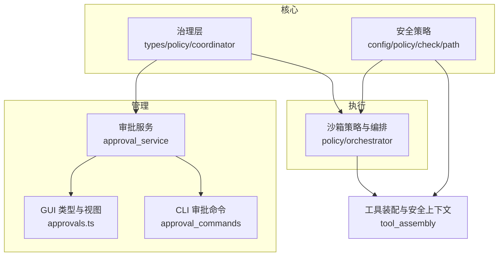
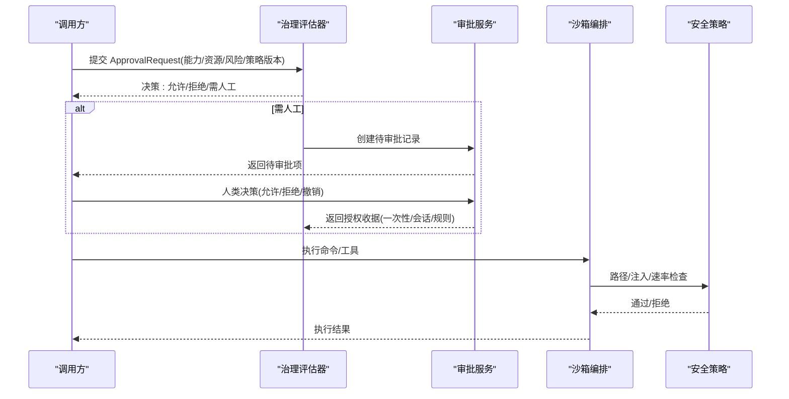
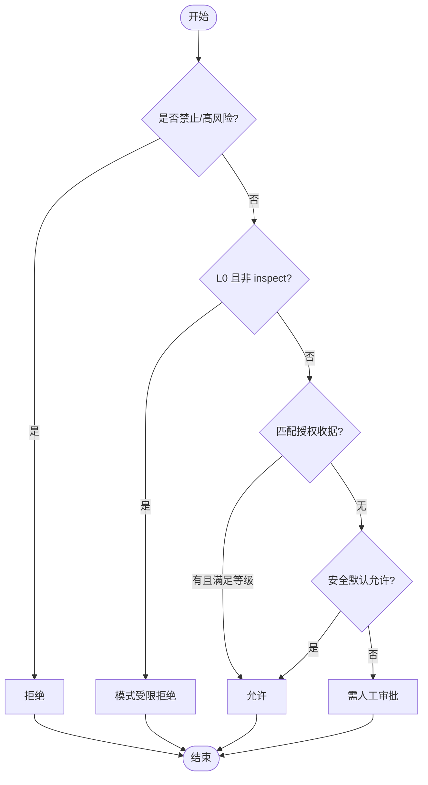
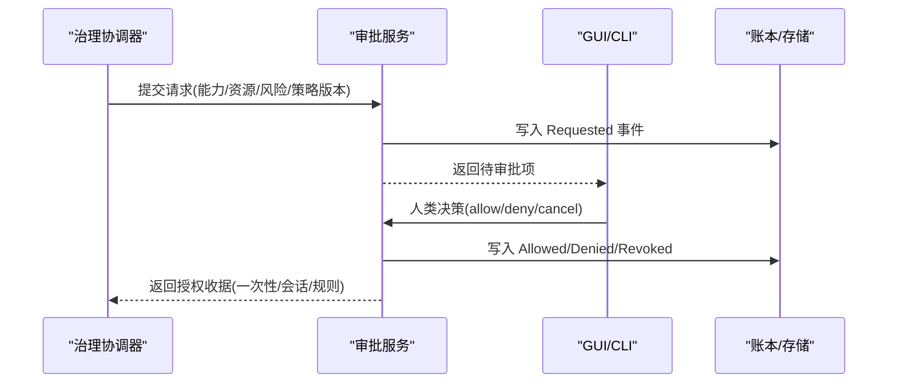
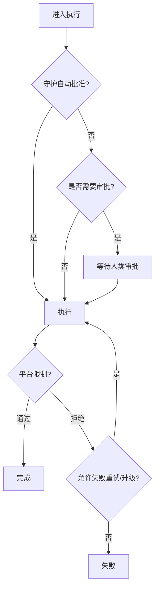
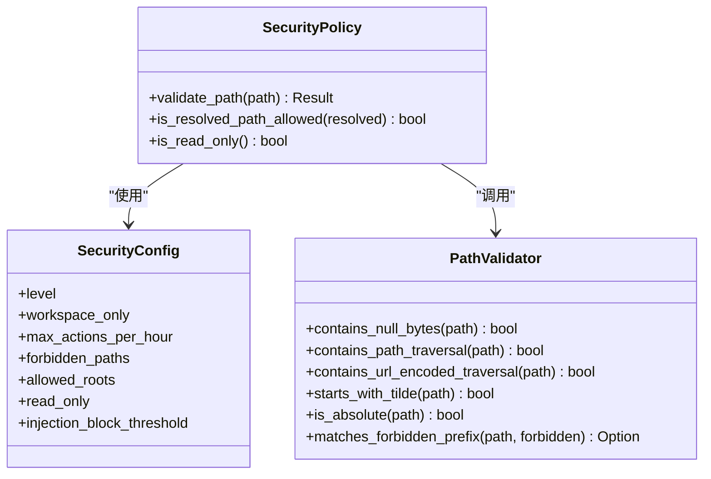
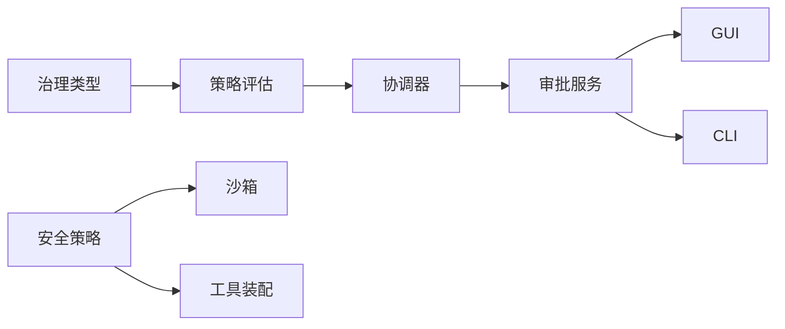

# 访问控制

<cite>
**本文引用的文件**   
- [agent-diva-core/src/governance/types.rs](file://agent-diva-core/src/governance/types.rs)
- [agent-diva-core/src/governance/policy.rs](file://agent-diva-core/src/governance/policy.rs)
- [agent-diva-core/src/governance/coordinator.rs](file://agent-diva-core/src/governance/coordinator.rs)
- [agent-diva-core/src/security/config.rs](file://agent-diva-core/src/security/config.rs)
- [agent-diva-core/src/security/policy.rs](file://agent-diva-core/src/security/policy.rs)
- [agent-diva-core/src/security/check.rs](file://agent-diva-core/src/security/check.rs)
- [agent-diva-core/src/security/path.rs](file://agent-diva-core/src/security/path.rs)
- [agent-diva-sandbox/src/policy.rs](file://agent-diva-sandbox/src/policy.rs)
- [agent-diva-sandbox/src/orchestrator.rs](file://agent-diva-sandbox/src/orchestrator.rs)
- [agent-diva-sandbox/src/approval_coordinator.rs](file://agent-diva-sandbox/src/approval_coordinator.rs)
- [agent-diva-manager/src/approval_service.rs](file://agent-diva-manager/src/approval_service.rs)
- [agent-diva-gui/src/api/approvals.ts](file://agent-diva-gui/src/api/approvals.ts)
- [agent-diva-cli/src/approval_commands.rs](file://agent-diva-cli/src/approval_commands.rs)
- [agent-diva-agent/src/tool_assembly.rs](file://agent-diva-agent/src/tool_assembly.rs)
</cite>

## 目录
1. [简介](#简介)
2. [项目结构](#项目结构)
3. [核心组件](#核心组件)
4. [架构总览](#架构总览)
5. [详细组件分析](#详细组件分析)
6. [依赖关系分析](#依赖关系分析)
7. [性能与缓存](#性能与缓存)
8. [故障排查指南](#故障排查指南)
9. [结论](#结论)
10. [附录：配置与场景示例](#附录配置与场景示例)

## 简介
本文件面向“访问控制”主题，系统性说明 agent-diva 中基于角色的访问控制（RBAC）与基于属性的访问控制（ABAC）的实现方式、策略配置、资源授权流程以及典型使用场景。系统采用“治理层（governance）+ 安全策略（security）+ 沙箱执行（sandbox）”的分层设计：
- 治理层负责能力/资源矩阵、自主性等级、审批收据校验与决策（允许/拒绝/需人工）。
- 安全策略负责路径、注入、速率限制、读写模式等运行时安全检查。
- 沙箱负责命令执行隔离、平台权限约束与重试/升级策略。
- 管理端提供审批服务、GUI/CLI 交互与审计记录。

该设计天然支持 RBAC（通过角色/主体与能力绑定）和 ABAC（通过风险等级、工作区、会话、策略版本、资源边界等属性动态评估），并具备可审计的决策链路与凭证化授权。

## 项目结构
访问控制相关代码主要分布在以下模块：
- 治理合同与策略评估：agent-diva-core/src/governance
- 安全策略与检查：agent-diva-core/src/security
- 沙箱策略与编排：agent-diva-sandbox/src
- 审批服务与前端/命令行集成：agent-diva-manager、agent-diva-gui、agent-diva-cli
- 工具装配与安全上下文：agent-diva-agent/src/tool_assembly.rs

图表来源
- [agent-diva-core/src/governance/types.rs:27-83](file://agent-diva-core/src/governance/types.rs#L27-L83)
- [agent-diva-core/src/governance/policy.rs:11-40](file://agent-diva-core/src/governance/policy.rs#L11-L40)
- [agent-diva-core/src/security/config.rs:11-24](file://agent-diva-core/src/security/config.rs#L11-L24)
- [agent-diva-sandbox/src/policy.rs:9-51](file://agent-diva-sandbox/src/policy.rs#L9-L51)
- [agent-diva-manager/src/approval_service.rs:493-525](file://agent-diva-manager/src/approval_service.rs#L493-L525)
- [agent-diva-gui/src/api/approvals.ts:1-36](file://agent-diva-gui/src/api/approvals.ts#L1-L36)
- [agent-diva-cli/src/approval_commands.rs:196-235](file://agent-diva-cli/src/approval_commands.rs#L196-L235)
- [agent-diva-agent/src/tool_assembly.rs:317-340](file://agent-diva-agent/src/tool_assembly.rs#L317-L340)

章节来源
- [agent-diva-core/src/governance/mod.rs:1-17](file://agent-diva-core/src/governance/mod.rs#L1-L17)
- [agent-diva-core/src/security/mod.rs:1-69](file://agent-diva-core/src/security/mod.rs#L1-L69)

## 核心组件
- 治理请求与收据：ApprovalRequest、ApprovalReceipt、Capability、ResourceKind、RiskClass、Decision、AuditCorrelation 等构成跨域统一的访问控制信封。
- 策略评估器：evaluate_policy 以固定优先级判定硬拒绝、用户明确拒绝、上下文无效、能力/资源不匹配、有效授权、安全默认、需人工审批。
- 安全策略：SecurityPolicy/SecurityConfig 提供路径校验、只读/工作区限制、速率限制、注入检测阈值、PII 处理等。
- 沙箱策略：SandboxPolicy 将执行限制映射到 SecurityLevel，并提供网络访问、读写范围、外部沙箱等选项。
- 审批协调与服务：coordinator 将治理评估结果转化为待审批或已批准状态；approval_service 持久化事件、转换人类决策为授权收据。
- 工具装配：在工具注册时注入 SecurityPolicy，按工作区与动作限制调整安全级别。

章节来源
- [agent-diva-core/src/governance/types.rs:27-161](file://agent-diva-core/src/governance/types.rs#L27-L161)
- [agent-diva-core/src/governance/policy.rs:162-205](file://agent-diva-core/src/governance/policy.rs#L162-L205)
- [agent-diva-core/src/security/config.rs:51-128](file://agent-diva-core/src/security/config.rs#L51-L128)
- [agent-diva-core/src/security/policy.rs:14-42](file://agent-diva-core/src/security/policy.rs#L14-L42)
- [agent-diva-sandbox/src/policy.rs:9-109](file://agent-diva-sandbox/src/policy.rs#L9-L109)
- [agent-diva-manager/src/approval_service.rs:493-525](file://agent-diva-manager/src/approval_service.rs#L493-L525)
- [agent-diva-agent/src/tool_assembly.rs:317-340](file://agent-diva-agent/src/tool_assembly.rs#L317-L340)

## 架构总览
访问控制贯穿“请求→评估→授权→执行→审计”的全链路。治理层对每个操作进行能力/资源/风险/自主性的综合判断；若需要人类介入，则进入审批流；批准后生成收据供后续复用；执行阶段由沙箱与安全策略双重保障。

图表来源
- [agent-diva-core/src/governance/policy.rs:162-205](file://agent-diva-core/src/governance/policy.rs#L162-L205)
- [agent-diva-core/src/governance/types.rs:121-161](file://agent-diva-core/src/governance/types.rs#L121-L161)
- [agent-diva-manager/src/approval_service.rs:493-525](file://agent-diva-manager/src/approval_service.rs#L493-L525)
- [agent-diva-sandbox/src/orchestrator.rs:261-281](file://agent-diva-sandbox/src/orchestrator.rs#L261-L281)
- [agent-diva-core/src/security/policy.rs:172-201](file://agent-diva-core/src/security/policy.rs#L172-L201)

## 详细组件分析

### 治理层：能力/资源矩阵与策略评估
- 能力与资源矩阵：每种 Capability 仅能作用于兼容的 ResourceKind，否则直接拒绝。
- 自主性等级：L0 仅允许 inspect；L1 允许低风险 inspect/计划修改；L2/L3 要求特定授权粒度；L4 全部拒绝。
- 授权收据：Once（精确一次）、Session（会话级）、Rule（规则级），不同等级对收据粒度有不同要求。
- 安全默认：仅在 L1 的低风险 inspect/计划修改可自动允许。
- 失败关闭：未知能力/资源/风险/策略版本均导致拒绝或需人工。

图表来源
- [agent-diva-core/src/governance/policy.rs:162-205](file://agent-diva-core/src/governance/policy.rs#L162-L205)
- [agent-diva-core/src/governance/policy.rs:252-283](file://agent-diva-core/src/governance/policy.rs#L252-L283)
- [agent-diva-core/src/governance/policy.rs:285-303](file://agent-diva-core/src/governance/policy.rs#L285-L303)

章节来源
- [agent-diva-core/src/governance/policy.rs:162-205](file://agent-diva-core/src/governance/policy.rs#L162-L205)
- [agent-diva-core/src/governance/types.rs:27-83](file://agent-diva-core/src/governance/types.rs#L27-L83)

### 审批服务与人类决策
- 审批服务将治理评估结果转换为待审批记录，并在人类决策后产出授权收据（一次性/会话/规则）。
- GUI/CLI 提供查询、展示与决策入口，支持幂等与冲突处理。
- 管理端根据能力推断领域（如 command/plan），并维护事件状态机。

图表来源
- [agent-diva-manager/src/approval_service.rs:493-525](file://agent-diva-manager/src/approval_service.rs#L493-L525)
- [agent-diva-gui/src/api/approvals.ts:1-36](file://agent-diva-gui/src/api/approvals.ts#L1-L36)
- [agent-diva-cli/src/approval_commands.rs:196-235](file://agent-diva-cli/src/approval_commands.rs#L196-L235)

章节来源
- [agent-diva-manager/src/approval_service.rs:493-525](file://agent-diva-manager/src/approval_service.rs#L493-L525)
- [agent-diva-gui/src/api/approvals.ts:1-36](file://agent-diva-gui/src/api/approvals.ts#L1-L36)
- [agent-diva-cli/src/approval_commands.rs:196-235](file://agent-diva-cli/src/approval_commands.rs#L196-L235)

### 沙箱执行与平台限制
- 沙箱策略将执行限制映射到安全级别与工作区边界，支持只读、工作区写、外部沙箱、危险全开放等模式。
- 编排器实现“守护自动批准→审批→首次尝试→失败重试/升级”的流程。
- 平台侧（如 macOS）通过 Seatbelt 策略限制敏感路径写入。

图表来源
- [agent-diva-sandbox/src/orchestrator.rs:261-281](file://agent-diva-sandbox/src/orchestrator.rs#L261-L281)
- [agent-diva-sandbox/src/policy.rs:9-109](file://agent-diva-sandbox/src/policy.rs#L9-L109)
- [agent-diva-sandbox/src/platform/macos.rs:230-263](file://agent-diva-sandbox/src/platform/macos.rs#L230-L263)

章节来源
- [agent-diva-sandbox/src/orchestrator.rs:261-281](file://agent-diva-sandbox/src/orchestrator.rs#L261-L281)
- [agent-diva-sandbox/src/policy.rs:9-109](file://agent-diva-sandbox/src/policy.rs#L9-L109)
- [agent-diva-sandbox/src/platform/macos.rs:230-263](file://agent-diva-sandbox/src/platform/macos.rs#L230-L263)

### 安全策略：路径、注入与速率限制
- 路径校验：多层防御（空字节、遍历、URL 编码遍历、波浪号展开、绝对路径、禁止前缀、符号链接逃逸）。
- 注入检测：对用户输入与工具输出进行注入识别，结合指令层级冲突检测，必要时阻断。
- 速率限制：按小时限制操作次数，防止滥用。
- 安全级别：Permissive/Standard/Strict/Paranoid，影响工作区限制、只读模式、最大操作数等。

图表来源
- [agent-diva-core/src/security/policy.rs:14-42](file://agent-diva-core/src/security/policy.rs#L14-L42)
- [agent-diva-core/src/security/config.rs:51-128](file://agent-diva-core/src/security/config.rs#L51-L128)
- [agent-diva-core/src/security/path.rs:1-42](file://agent-diva-core/src/security/path.rs#L1-L42)

章节来源
- [agent-diva-core/src/security/policy.rs:172-201](file://agent-diva-core/src/security/policy.rs#L172-L201)
- [agent-diva-core/src/security/check.rs:15-117](file://agent-diva-core/src/security/check.rs#L15-L117)
- [agent-diva-core/src/security/path.rs:79-112](file://agent-diva-core/src/security/path.rs#L79-L112)

### 工具装配与安全上下文
- 工具注册时注入 SecurityPolicy，依据是否限制工作区与动作限制选择合适的安全级别。
- 对于受限制的动作，可强制只读与工作区限制，确保最小权限原则。

章节来源
- [agent-diva-agent/src/tool_assembly.rs:317-340](file://agent-diva-agent/src/tool_assembly.rs#L317-L340)

## 依赖关系分析
- 治理层依赖统一类型定义（types）与策略评估（policy），并通过协调器（coordinator）与审批服务对接。
- 安全策略被沙箱与工具装配共同使用，形成“策略即服务”的共享能力。
- 审批服务依赖治理类型，并将人类决策转化为授权收据，供治理层再次评估时使用。
- GUI/CLI 作为人机交互面，消费审批服务提供的数据模型与状态。

图表来源
- [agent-diva-core/src/governance/types.rs:27-161](file://agent-diva-core/src/governance/types.rs#L27-L161)
- [agent-diva-core/src/governance/policy.rs:162-205](file://agent-diva-core/src/governance/policy.rs#L162-L205)
- [agent-diva-core/src/security/policy.rs:14-42](file://agent-diva-core/src/security/policy.rs#L14-L42)
- [agent-diva-manager/src/approval_service.rs:493-525](file://agent-diva-manager/src/approval_service.rs#L493-L525)
- [agent-diva-gui/src/api/approvals.ts:1-36](file://agent-diva-gui/src/api/approvals.ts#L1-L36)
- [agent-diva-cli/src/approval_commands.rs:196-235](file://agent-diva-cli/src/approval_commands.rs#L196-L235)

章节来源
- [agent-diva-core/src/governance/types.rs:27-161](file://agent-diva-core/src/governance/types.rs#L27-L161)
- [agent-diva-core/src/security/policy.rs:14-42](file://agent-diva-core/src/security/policy.rs#L14-L42)
- [agent-diva-manager/src/approval_service.rs:493-525](file://agent-diva-manager/src/approval_service.rs#L493-L525)

## 性能与缓存
- 策略评估为纯函数，无 I/O 与副作用，适合高频调用与快速决策。
- 授权收据具有有效期与粒度（一次性/会话/规则），可减少重复审批开销。
- 安全策略内置速率限制，避免高频操作导致的性能退化。
- 建议：
  - 对同一会话内的相似请求复用会话级授权收据。
  - 对稳定规则集使用规则级授权，降低审批频率。
  - 合理设置安全级别与工作区限制，减少路径解析与校验成本。

[本节为通用指导，无需具体文件引用]

## 故障排查指南
- 常见拒绝原因：
  - 能力/资源不匹配：检查 Capability 与 ResourceKind 的组合是否符合矩阵。
  - 策略版本不匹配：确保授权收据与当前策略版本一致。
  - 过期授权：检查收据 expires_at 是否晚于评估时间。
  - 路径逃逸：确认路径未包含遍历、符号链接逃逸或超出工作区。
  - 注入检测：检查内容是否触发注入阻断。
- 定位步骤：
  - 查看治理评估返回的原因码与约束信息。
  - 检查审批服务的事件状态与收据字段。
  - 审查安全策略配置与安全级别。
  - 核对沙箱策略与平台限制。

章节来源
- [agent-diva-core/src/governance/policy.rs:162-205](file://agent-diva-core/src/governance/policy.rs#L162-L205)
- [agent-diva-core/src/governance/types.rs:163-202](file://agent-diva-core/src/governance/types.rs#L163-L202)
- [agent-diva-core/src/security/policy.rs:172-201](file://agent-diva-core/src/security/policy.rs#L172-L201)
- [agent-diva-core/src/security/check.rs:15-117](file://agent-diva-core/src/security/check.rs#L15-L117)

## 结论
agent-diva 的访问控制体系以治理层为核心，结合安全策略与沙箱执行，实现了细粒度的 RBAC 与 ABAC 能力。通过能力/资源矩阵、自主性等级、授权收据与人类审批，系统在灵活性与安全性之间取得平衡。配合路径校验、注入检测与速率限制，确保了执行过程的最小权限与可控性。建议在部署中合理配置安全级别与工作区限制，利用会话/规则级授权提升效率，并通过审批服务与 GUI/CLI 实现透明的人机协同。

[本节为总结性内容，无需具体文件引用]

## 附录：配置与场景示例

### 配置方法
- 安全级别与覆盖：
  - 通过 SecurityLevel 预设（Permissive/Standard/Strict/Paranoid）初始化 SecurityConfig。
  - 支持从工作区或家目录加载 security.json 覆盖预算与超时等参数。
- 沙箱策略：
  - 选择 DangerFullAccess/ReadOnly/WorkspaceWrite/ExternalSandbox，并配置网络访问、只读范围、额外可写根目录。
- 治理策略：
  - 在构建 ApprovalRequest 时指定 Capability、ResourceKind、RiskClass、策略版本与证据引用。
  - 人类决策后生成授权收据（一次性/会话/规则），用于后续评估。

章节来源
- [agent-diva-core/src/security/config.rs:11-24](file://agent-diva-core/src/security/config.rs#L11-L24)
- [agent-diva-core/src/security/config.rs:181-242](file://agent-diva-core/src/security/config.rs#L181-L242)
- [agent-diva-sandbox/src/policy.rs:9-109](file://agent-diva-sandbox/src/policy.rs#L9-L109)
- [agent-diva-core/src/governance/types.rs:121-161](file://agent-diva-core/src/governance/types.rs#L121-L161)

### 典型场景
- 文件访问：
  - 使用 SecurityPolicy.validate_path 校验路径，限制在工作区内，禁止符号链接逃逸。
  - 对写操作启用只读模式或限制可写根目录。
- API 调用：
  - 通过治理能力（如 NetworkAccess/McpInvoke）与资源（Network/McpServer）组合进行授权。
  - 结合策略版本与风险评估，决定是否需要人类审批。
- 工具执行：
  - 在工具装配时注入 SecurityPolicy，按动作限制调整安全级别。
  - 沙箱编排器根据策略与平台限制执行命令，必要时请求人类审批。

章节来源
- [agent-diva-core/src/security/policy.rs:172-201](file://agent-diva-core/src/security/policy.rs#L172-L201)
- [agent-diva-core/src/security/path.rs:79-112](file://agent-diva-core/src/security/path.rs#L79-L112)
- [agent-diva-core/src/governance/types.rs:27-83](file://agent-diva-core/src/governance/types.rs#L27-L83)
- [agent-diva-agent/src/tool_assembly.rs:317-340](file://agent-diva-agent/src/tool_assembly.rs#L317-L340)
- [agent-diva-sandbox/src/orchestrator.rs:261-281](file://agent-diva-sandbox/src/orchestrator.rs#L261-L281)