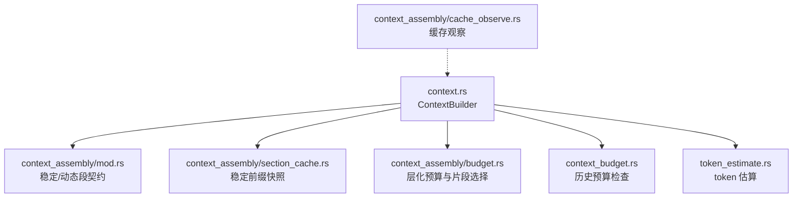
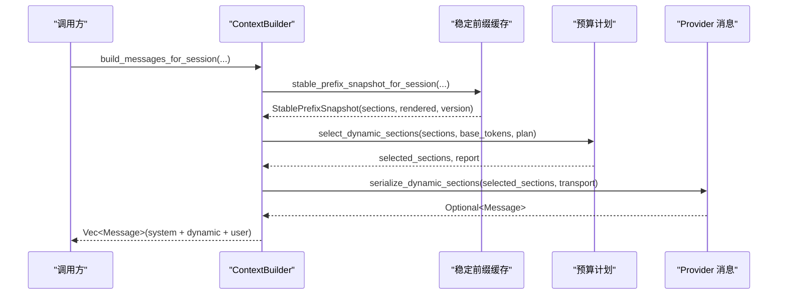
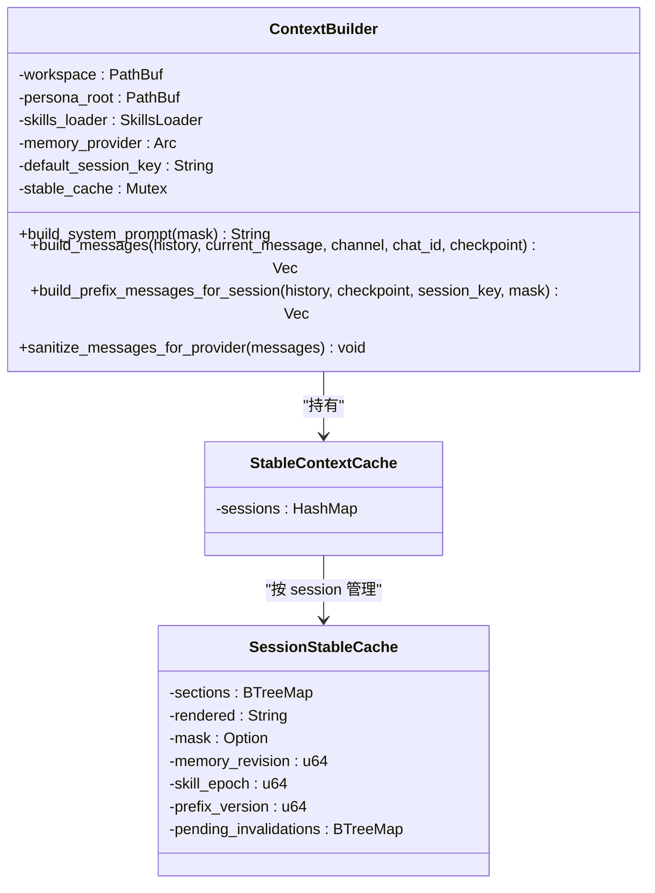
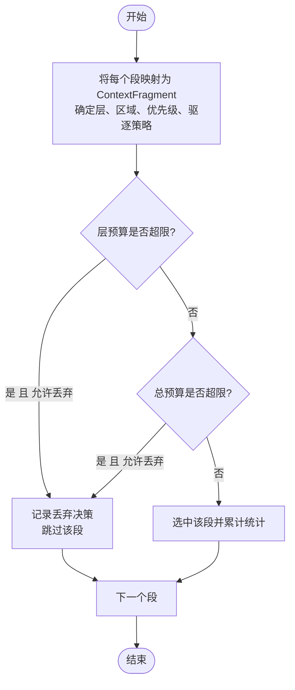
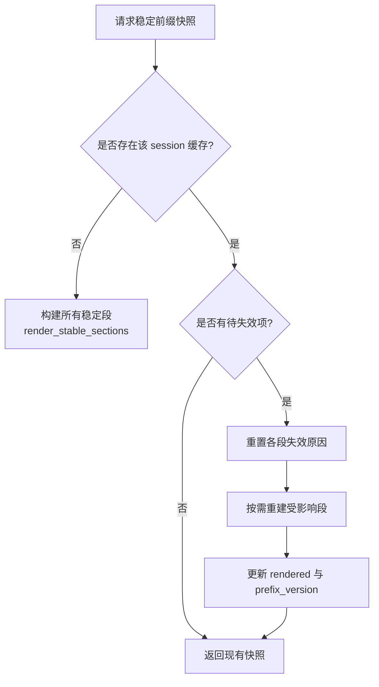
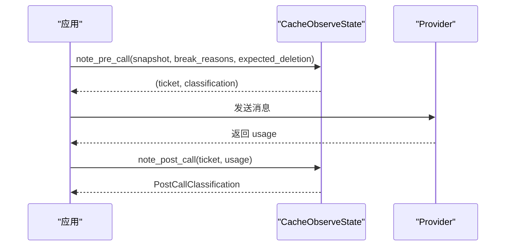
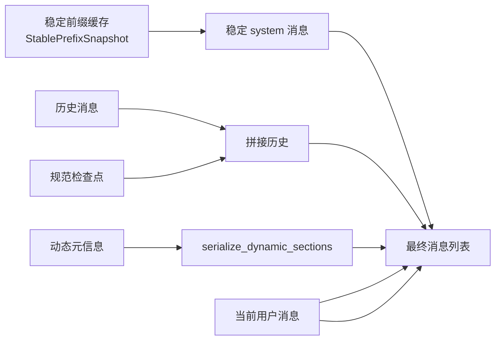
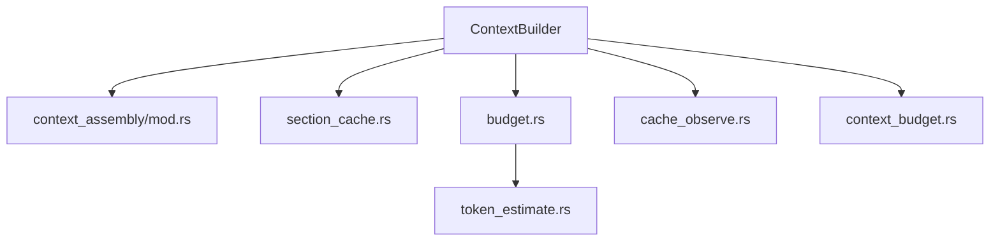

# 上下文组装

<cite>
**本文引用的文件**
- [agent-diva-agent/src/context_assembly/mod.rs](file://agent-diva-agent/src/context_assembly/mod.rs)
- [agent-diva-agent/src/context_assembly/budget.rs](file://agent-diva-agent/src/context_assembly/budget.rs)
- [agent-diva-agent/src/context_assembly/section_cache.rs](file://agent-diva-agent/src/context_assembly/section_cache.rs)
- [agent-diva-agent/src/context_assembly/cache_observe.rs](file://agent-diva-agent/src/context_assembly/cache_observe.rs)
- [agent-diva-agent/src/context.rs](file://agent-diva-agent/src/context.rs)
- [agent-diva-agent/src/context_budget.rs](file://agent-diva-agent/src/context_budget.rs)
- [agent-diva-agent/src/token_estimate.rs](file://agent-diva-agent/src/token_estimate.rs)
</cite>

## 目录
1. [简介](#简介)
2. [项目结构](#项目结构)
3. [核心组件](#核心组件)
4. [架构总览](#架构总览)
5. [详细组件分析](#详细组件分析)
6. [依赖关系分析](#依赖关系分析)
7. [性能考量](#性能考量)
8. [故障排查指南](#故障排查指南)
9. [结论](#结论)
10. [附录：配置与优化示例](#附录：配置与优化示例)

## 简介
本文件聚焦“上下文组装”的核心机制，围绕以下目标展开：
- 解释 ContextBuilder 的设计与工作原理
- 说明预算控制机制（token 预算、超限处理、动态调整）
- 阐述缓存系统（section_cache）的工作原理、策略与失效机制
- 描述缓存观察机制（性能监控、统计信息收集）
- 提供可操作的配置示例以优化上下文组装性能
- 通过数据流图展示上下文的构建过程与缓存使用方式

## 项目结构
上下文组装由 agent-diva-agent 模块中的 context_assembly 子模块与 context 构建器共同实现。关键文件职责如下：
- context_assembly/mod.rs：定义稳定的上下文段顺序、稳定性分类、序列化与渲染契约
- context_assembly/budget.rs：层化预算计划、片段选择与报告
- context_assembly/section_cache.rs：稳定前缀的失效原因与快照
- context_assembly/cache_observe.rs：调用前后对提供者提示缓存的观察与分类
- context.rs：ContextBuilder 的实现，负责拼装稳定前缀、动态段、历史消息与当前用户消息
- context_budget.rs：基于历史与检查点的预算检查与压缩触发
- token_estimate.rs：快速 token 估算工具

图表来源
- [agent-diva-agent/src/context.rs:54-163](file://agent-diva-agent/src/context.rs#L54-L163)
- [agent-diva-agent/src/context_assembly/mod.rs:38-115](file://agent-diva-agent/src/context_assembly/mod.rs#L38-L115)
- [agent-diva-agent/src/context_assembly/section_cache.rs:36-56](file://agent-diva-agent/src/context_assembly/section_cache.rs#L36-L56)
- [agent-diva-agent/src/context_assembly/budget.rs:111-193](file://agent-diva-agent/src/context_assembly/budget.rs#L111-L193)
- [agent-diva-agent/src/context_budget.rs:164-207](file://agent-diva-agent/src/context_budget.rs#L164-L207)
- [agent-diva-agent/src/token_estimate.rs:39-81](file://agent-diva-agent/src/token_estimate.rs#L39-L81)
- [agent-diva-agent/src/context_assembly/cache_observe.rs:68-165](file://agent-diva-agent/src/context_assembly/cache_observe.rs#L68-L165)

章节来源
- [agent-diva-agent/src/context.rs:54-163](file://agent-diva-agent/src/context.rs#L54-L163)
- [agent-diva-agent/src/context_assembly/mod.rs:38-115](file://agent-diva-agent/src/context_assembly/mod.rs#L38-L115)

## 核心组件
- 稳定/动态段契约：将上下文划分为固定顺序的“稳定前缀”和“动态后缀”，确保首条 system 消息作为缓存前缀，后续内容按 provider 能力封装为单条消息
- 预算计划与片段选择：按层（如历史、工具 schema、会话检查点等）设置软/硬限制，并在超限时执行丢弃或压缩
- 稳定前缀缓存：按 session 维护已渲染的稳定前缀，支持细粒度失效与版本递增
- 缓存观察：在调用前记录最终线结构变化，调用后统计缓存命中/创建，辅助定位未声明的结构变更
- 上下文构建器：组合稳定前缀、检查点、历史、动态元信息与当前用户消息，输出 provider 可用的消息列表

章节来源
- [agent-diva-agent/src/context_assembly/mod.rs:117-229](file://agent-diva-agent/src/context_assembly/mod.rs#L117-L229)
- [agent-diva-agent/src/context_assembly/budget.rs:91-228](file://agent-diva-agent/src/context_assembly/budget.rs#L91-L228)
- [agent-diva-agent/src/context_assembly/section_cache.rs:36-56](file://agent-diva-agent/src/context_assembly/section_cache.rs#L36-L56)
- [agent-diva-agent/src/context_assembly/cache_observe.rs:10-66](file://agent-diva-agent/src/context_assembly/cache_observe.rs#L10-L66)
- [agent-diva-agent/src/context.rs:54-163](file://agent-diva-agent/src/context.rs#L54-L163)

## 架构总览
上下文组装遵循“稳定前缀 + 动态后缀”的两段式结构：
- 稳定前缀：包含身份、冻结核心、规则与技能、记忆策略与索引等，被渲染到首条 system 消息中，用于提示缓存前缀
- 动态后缀：包含历史、会话检查点、预取召回、易变元信息、计划守卫、当前用户等，按 provider 传输方式封装为单条消息

图表来源
- [agent-diva-agent/src/context.rs:570-593](file://agent-diva-agent/src/context.rs#L570-L593)
- [agent-diva-agent/src/context_assembly/mod.rs:174-229](file://agent-diva-agent/src/context_assembly/mod.rs#L174-L229)
- [agent-diva-agent/src/context_assembly/budget.rs:230-285](file://agent-diva-agent/src/context_assembly/budget.rs#L230-L285)

## 详细组件分析

### ContextBuilder 设计与工作原理
- 构造与配置：支持绑定工作区、技能加载器、内存提供者；可按会话键区分稳定前缀缓存
- 稳定前缀缓存：按 session 维护 sections、rendered、mask、memory_revision、skill_epoch、prefix_version 与 pending_invalidations；当 mask/memory/skill 变化时，仅重建受影响段并更新版本
- 消息构建：先构建稳定 system 消息，再插入可选的检查点，随后追加历史消息，最后附加动态元信息与当前用户消息
- 工具消息清理：移除孤立 tool 消息或不完整 tool_call 组，避免 provider 拒绝请求

图表来源
- [agent-diva-agent/src/context.rs:38-61](file://agent-diva-agent/src/context.rs#L38-L61)
- [agent-diva-agent/src/context.rs:160-249](file://agent-diva-agent/src/context.rs#L160-L249)
- [agent-diva-agent/src/context.rs:570-663](file://agent-diva-agent/src/context.rs#L570-L663)
- [agent-diva-agent/src/context.rs:667-725](file://agent-diva-agent/src/context.rs#L667-L725)

章节来源
- [agent-diva-agent/src/context.rs:54-163](file://agent-diva-agent/src/context.rs#L54-L163)
- [agent-diva-agent/src/context.rs:570-663](file://agent-diva-agent/src/context.rs#L570-L663)
- [agent-diva-agent/src/context.rs:667-725](file://agent-diva-agent/src/context.rs#L667-L725)

### 预算控制机制
- 预算计划：从 BudgetConfig 派生 ContextBudgetPlan，定义 total_max、各层 soft/hard limit、以及三个顶层区域（稳定前缀、规范检查点、活动尾部）
- 片段选择：遍历动态段，计算每层已用 token 与总估计，若超过层软限或总硬限且允许丢弃则记录决策并跳过；否则选中并累计
- 测量与报告：measure_provider_context 将消息与工具 schema 映射到对应层与区域，生成 ContextAssemblyReport 供上层观测
- 历史预算检查：check_context_budget 基于 history 与 checkpoint 估计总量，计算压力比与是否触发压缩

图表来源
- [agent-diva-agent/src/context_assembly/budget.rs:230-285](file://agent-diva-agent/src/context_assembly/budget.rs#L230-L285)
- [agent-diva-agent/src/context_assembly/budget.rs:373-415](file://agent-diva-agent/src/context_assembly/budget.rs#L373-L415)

章节来源
- [agent-diva-agent/src/context_assembly/budget.rs:111-193](file://agent-diva-agent/src/context_assembly/budget.rs#L111-L193)
- [agent-diva-agent/src/context_assembly/budget.rs:230-285](file://agent-diva-agent/src/context_assembly/budget.rs#L230-L285)
- [agent-diva-agent/src/context_budget.rs:164-207](file://agent-diva-agent/src/context_budget.rs#L164-L207)

### 缓存系统（section_cache）设计
- 稳定前缀快照：StablePrefixSnapshot 包含 sections、rendered 字符串与 prefix_version；cache_break_reasons 汇总本次重建的原因集合
- 失效机制：当 mask 变化、memory 修订号变化、技能 epoch 变化或显式失效时，标记相应段为待重建；下次访问时按需重建并更新 rendered 与版本
- 缓存策略：按 session 隔离；首次访问构建全部稳定段；后续增量重建；版本递增便于外部追踪

图表来源
- [agent-diva-agent/src/context.rs:160-249](file://agent-diva-agent/src/context.rs#L160-L249)
- [agent-diva-agent/src/context_assembly/section_cache.rs:36-56](file://agent-diva-agent/src/context_assembly/section_cache.rs#L36-L56)

章节来源
- [agent-diva-agent/src/context.rs:160-249](file://agent-diva-agent/src/context.rs#L160-L249)
- [agent-diva-agent/src/context_assembly/section_cache.rs:36-56](file://agent-diva-agent/src/context_assembly/section_cache.rs#L36-L56)

### 缓存观察机制
- 调用前分类：根据 provider 最终线快照（稳定 system hash、核心工具 hash、活跃工具名列表）与声明的失效原因，分类为 Baseline/Stable/ExpectedBreak/PolicyBreak/UndeclaredStructuralBreak/Unavailable
- 调用后统计：从 usage 中读取 cache_read_input_tokens 与 cache_creation_input_tokens，判断是否可用
- 核心工具锚点：对 core_count 之前的工具定义注入 ephemeral 缓存控制，保证核心前缀不被延迟激活影响
- 核心工具哈希：仅对 core 部分进行哈希，避免延迟工具变化扰动核心缓存身份

图表来源
- [agent-diva-agent/src/context_assembly/cache_observe.rs:68-165](file://agent-diva-agent/src/context_assembly/cache_observe.rs#L68-L165)
- [agent-diva-agent/src/context_assembly/cache_observe.rs:207-226](file://agent-diva-agent/src/context_assembly/cache_observe.rs#L207-L226)

章节来源
- [agent-diva-agent/src/context_assembly/cache_observe.rs:10-66](file://agent-diva-agent/src/context_assembly/cache_observe.rs#L10-L66)
- [agent-diva-agent/src/context_assembly/cache_observe.rs:68-165](file://agent-diva-agent/src/context_assembly/cache_observe.rs#L68-L165)
- [agent-diva-agent/src/context_assembly/cache_observe.rs:207-226](file://agent-diva-agent/src/context_assembly/cache_observe.rs#L207-L226)

### 数据流图：上下文构建与缓存使用

图表来源
- [agent-diva-agent/src/context.rs:570-663](file://agent-diva-agent/src/context.rs#L570-L663)
- [agent-diva-agent/src/context_assembly/mod.rs:174-229](file://agent-diva-agent/src/context_assembly/mod.rs#L174-L229)

## 依赖关系分析
- ContextBuilder 依赖 context_assembly 提供的段契约与序列化能力
- 预算模块依赖 token_estimate 进行快速估算，并消费 BudgetConfig 生成 ContextBudgetPlan
- 缓存观察模块依赖 provider 的最终线快照与 usage 指标
- 稳定前缀缓存依赖 memory_provider 的 revision 与 skill epoch 来驱动失效

图表来源
- [agent-diva-agent/src/context.rs:54-163](file://agent-diva-agent/src/context.rs#L54-L163)
- [agent-diva-agent/src/context_assembly/budget.rs:111-193](file://agent-diva-agent/src/context_assembly/budget.rs#L111-L193)
- [agent-diva-agent/src/context_assembly/cache_observe.rs:68-165](file://agent-diva-agent/src/context_assembly/cache_observe.rs#L68-L165)

章节来源
- [agent-diva-agent/src/context.rs:54-163](file://agent-diva-agent/src/context.rs#L54-L163)
- [agent-diva-agent/src/context_assembly/budget.rs:111-193](file://agent-diva-agent/src/context_assembly/budget.rs#L111-L193)

## 性能考量
- 稳定前缀缓存显著减少重复渲染成本，按 session 隔离并支持细粒度失效
- 预算分层与选择性丢弃避免无谓的上下文膨胀，优先保留高优先级段（如会话检查点、当前用户）
- 快速 token 估算降低预算检查开销，适合高频路径
- 缓存观察帮助识别未声明的结构变化，及时定位缓存失效根因
- 工具 schema 分层（core vs deferred）有助于控制前缀大小与缓存稳定性

[本节为通用指导，不直接分析具体文件]

## 故障排查指南
- 稳定前缀违反契约：当稳定前缀包含易变段或动态后缀包含稳定段时，会抛出装配错误；检查段的稳定性分类与顺序
- 工具消息不完整：provider 可能拒绝包含孤立 tool 消息的请求；使用 sanitize_messages_for_provider 清理
- 预算压力过高：若 should_compact 为真，需考虑压缩历史或减少召回/工具 schema 数量
- 缓存未命中：检查 note_pre_call 的分类是否为 UndeclaredStructuralBreak；确认 break_reasons 是否正确声明

章节来源
- [agent-diva-agent/src/context_assembly/mod.rs:144-172](file://agent-diva-agent/src/context_assembly/mod.rs#L144-L172)
- [agent-diva-agent/src/context.rs:667-725](file://agent-diva-agent/src/context.rs#L667-L725)
- [agent-diva-agent/src/context_budget.rs:164-207](file://agent-diva-agent/src/context_budget.rs#L164-L207)
- [agent-diva-agent/src/context_assembly/cache_observe.rs:68-165](file://agent-diva-agent/src/context_assembly/cache_observe.rs#L68-L165)

## 结论
上下文组装通过“稳定前缀 + 动态后缀”的清晰边界、层化预算与细粒度缓存失效，实现了高性能、可控的 prompt 构建。ContextBuilder 作为编排中心，结合预算计划与缓存观察，能够在不同 provider 与模型下保持稳定的缓存命中率与合理的上下文大小。

[本节为总结性内容，不直接分析具体文件]

## 附录：配置与优化示例
- 预算配置
  - 通过 BudgetConfig 设置 max_tokens、system_budget_ratio、compact_threshold_ratio、keep_recent_count
  - 使用 for_model 或 from_env_or_model 自动适配模型上下文窗口与环境覆盖
- 动态段选择
  - 合理设置各层的 soft/hard limit，避免历史或工具 schema 过度占用
  - 对低优先级段（如预取召回）启用 Drop 策略，在高压力下优先保留关键段
- 稳定前缀缓存
  - 确保 mask、memory、skill 的变化能正确触发失效；利用 prefix_version 追踪变化
  - 对核心工具定义使用 ephemeral 缓存控制，避免延迟激活影响前缀
- 缓存观察
  - 在调用前记录 snapshot 与 break_reasons，调用后统计 usage；关注 PolicyBreak 与 UndeclaredStructuralBreak
  - 使用 core_tool_hash 确保核心前缀身份稳定

章节来源
- [agent-diva-agent/src/context_budget.rs:25-112](file://agent-diva-agent/src/context_budget.rs#L25-L112)
- [agent-diva-agent/src/context_assembly/budget.rs:111-193](file://agent-diva-agent/src/context_assembly/budget.rs#L111-L193)
- [agent-diva-agent/src/context_assembly/cache_observe.rs:207-226](file://agent-diva-agent/src/context_assembly/cache_observe.rs#L207-L226)