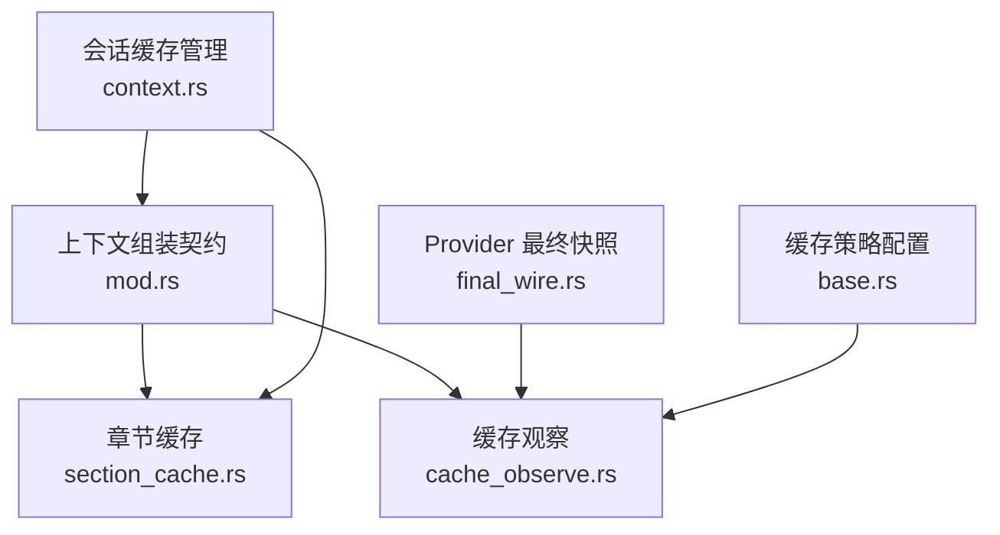
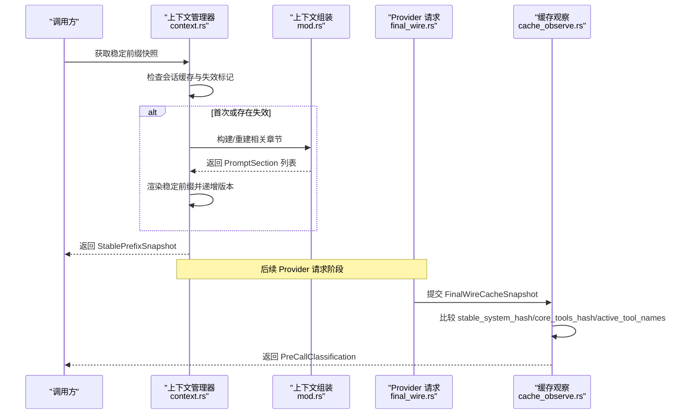
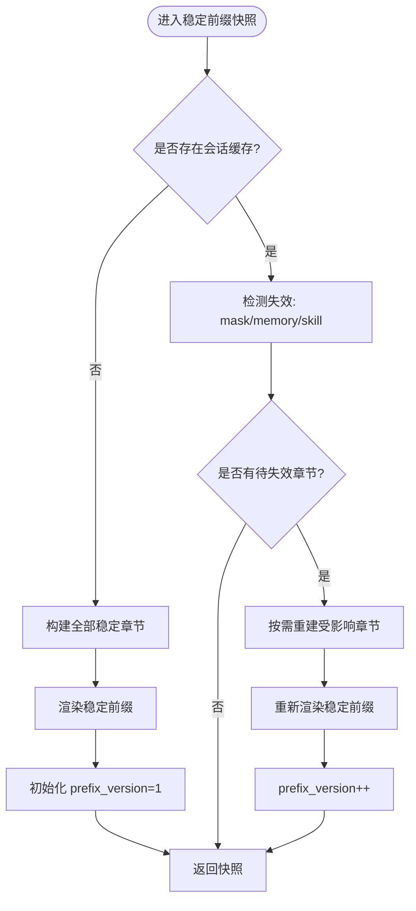
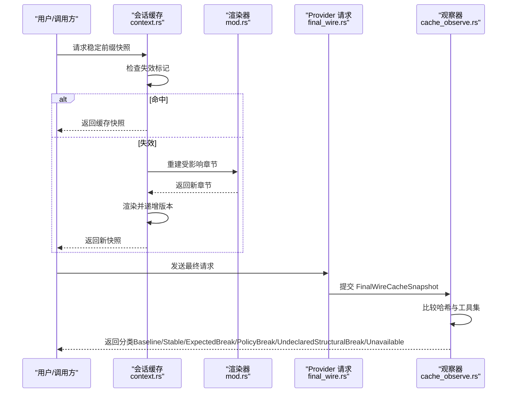
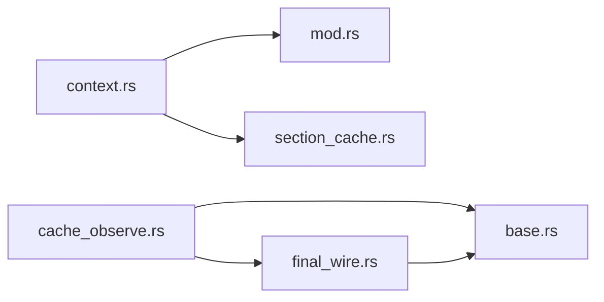

# 章节缓存系统

<cite>
**本文引用的文件**
- [section_cache.rs](file://agent-diva-agent/src/context_assembly/section_cache.rs)
- [cache_observe.rs](file://agent-diva-agent/src/context_assembly/cache_observe.rs)
- [mod.rs（上下文组装契约）](file://agent-diva-agent/src/context_assembly/mod.rs)
- [context.rs（会话稳定前缀缓存管理）](file://agent-diva-agent/src/context.rs)
- [final_wire.rs（最终请求快照）](file://agent-diva-providers/src/final_wire.rs)
- [base.rs（缓存策略与配置）](file://agent-diva-providers/src/base.rs)
</cite>

## 目录
1. [简介](#简介)
2. [项目结构](#项目结构)
3. [核心组件](#核心组件)
4. [架构总览](#架构总览)
5. [详细组件分析](#详细组件分析)
6. [依赖关系分析](#依赖关系分析)
7. [性能考量](#性能考量)
8. [故障排查指南](#故障排查指南)
9. [结论](#结论)
10. [附录：使用示例与最佳实践](#附录使用示例与最佳实践)

## 简介
本章节文档聚焦“章节缓存系统”，围绕稳定前缀缓存的设计、失效原因、键生成算法、存储与管理机制，以及命中/失效/更新的数据流进行系统化说明。该系统的目标是：
- 将稳定的上下文片段（如身份、核心规则、技能、记忆策略等）组织为可缓存的“稳定前缀”，在会话内复用，减少重复渲染与网络开销。
- 通过声明式失效原因（CacheBreakReason）精确控制哪些部分需要重建，避免误判导致的缓存污染或过度重建。
- 在 Provider 层对最终请求形态进行快照，结合 Agent 层的失效声明，形成一致且可观测的缓存命中判定。

## 项目结构
本节概述与章节缓存相关的模块与职责划分：
- 上下文组装契约（mod.rs）：定义逻辑章节顺序、稳定性分类、稳定前缀渲染与动态后缀序列化规则。
- 章节缓存（section_cache.rs）：定义失效原因枚举与稳定前缀快照视图。
- 缓存观察（cache_observe.rs）：基于 Provider 的最终请求快照，做调用前后分类与遥测。
- 会话级缓存管理（context.rs）：维护每个会话的稳定前缀缓存、失效检测与增量重建。
- Provider 层（final_wire.rs、base.rs）：提供最终请求快照与缓存策略配置。

图表来源
- [mod.rs:26-115](file://agent-diva-agent/src/context_assembly/mod.rs#L26-L115)
- [section_cache.rs:5-42](file://agent-diva-agent/src/context_assembly/section_cache.rs#L5-L42)
- [cache_observe.rs:10-66](file://agent-diva-agent/src/context_assembly/cache_observe.rs#L10-L66)
- [context.rs:159-247](file://agent-diva-agent/src/context.rs#L159-L247)
- [final_wire.rs:8-18](file://agent-diva-providers/src/final_wire.rs#L8-L18)
- [base.rs:662-697](file://agent-diva-providers/src/base.rs#L662-L697)

章节来源
- [mod.rs:26-115](file://agent-diva-agent/src/context_assembly/mod.rs#L26-L115)
- [section_cache.rs:5-42](file://agent-diva-agent/src/context_assembly/section_cache.rs#L5-L42)
- [cache_observe.rs:10-66](file://agent-diva-agent/src/context_assembly/cache_observe.rs#L10-L66)
- [context.rs:159-247](file://agent-diva-agent/src/context.rs#L159-L247)
- [final_wire.rs:8-18](file://agent-diva-providers/src/final_wire.rs#L8-L18)
- [base.rs:662-697](file://agent-diva-providers/src/base.rs#L662-L697)

## 核心组件
- CacheBreakReason：声明式失效原因，用于标记哪些稳定章节因外部状态变化而需重建。
- StablePrefixSnapshot：不可变视图，包含当前会话的稳定章节集合、已渲染文本与版本号。
- PromptSection / ContextSection：逻辑章节及其稳定性分类，决定能否进入稳定前缀。
- CacheObserveState：基于 Provider 最终请求快照的分类器与观察者，记录策略变更、预期失效与未声明的结构变更。
- FinalWireCacheSnapshot：Provider 侧最终请求快照，包含 provider 命名空间、模型、策略、稳定 system 指纹、CORE 工具指纹、活动工具名与估算规模。
- PromptCacheProfile / PromptCachePolicy：缓存策略配置，控制是否启用及 TTL。

章节来源
- [section_cache.rs:5-42](file://agent-diva-agent/src/context_assembly/section_cache.rs#L5-L42)
- [mod.rs:26-115](file://agent-diva-agent/src/context_assembly/mod.rs#L26-L115)
- [cache_observe.rs:10-66](file://agent-diva-agent/src/context_assembly/cache_observe.rs#L10-L66)
- [final_wire.rs:8-18](file://agent-diva-providers/src/final_wire.rs#L8-L18)
- [base.rs:662-697](file://agent-diva-providers/src/base.rs#L662-L697)

## 架构总览
整体流程分为两条主线：
- 构建与缓存主线（Agent 侧）：按固定顺序构建稳定章节，渲染为稳定前缀并缓存；当检测到外部状态变化时，仅重建受影响章节，并递增版本号。
- 观察与校验主线（Provider 侧）：在最终请求边界捕获快照，结合 Agent 侧失效声明进行分类，输出命中/失效/策略变更等信号。

图表来源
- [context.rs:159-247](file://agent-diva-agent/src/context.rs#L159-L247)
- [mod.rs:174-229](file://agent-diva-agent/src/context_assembly/mod.rs#L174-L229)
- [final_wire.rs:23-49](file://agent-diva-providers/src/final_wire.rs#L23-L49)
- [cache_observe.rs:68-165](file://agent-diva-agent/src/context_assembly/cache_observe.rs#L68-L165)

## 详细组件分析

### StablePrefixSnapshot 设计与工作原理
- 设计目标：以不可变快照形式暴露当前会话的稳定前缀视图，包含章节集合、渲染结果与版本号，便于上层消费与对比。
- 工作原理：
  - 首次访问会话：构建所有稳定章节（MaskAndIdentity、FrozenCore、AgentRulesAndSkills、MemoryPolicyAndIndex），渲染为稳定前缀，初始化版本号为 1。
  - 后续访问：检测 mask、memory revision、skill epoch 的变化，若存在差异则标记对应章节为待失效，按需重建并重新渲染，版本号自增。
  - 提供方法汇总本次版本中重建章节的失效原因，供日志与观察器使用。

图表来源
- [context.rs:159-247](file://agent-diva-agent/src/context.rs#L159-L247)
- [section_cache.rs:36-56](file://agent-diva-agent/src/context_assembly/section_cache.rs#L36-L56)

章节来源
- [context.rs:159-247](file://agent-diva-agent/src/context.rs#L159-L247)
- [section_cache.rs:36-56](file://agent-diva-agent/src/context_assembly/section_cache.rs#L36-L56)

### CacheBreakReason 失效原因详解
- MaskChanged：会话使用的面具（mask）发生变化，导致身份与指令段需重建。
- L1HotRefresh：L1 层（记忆策略与索引）热刷新，触发 MemoryPolicyAndIndex 章节重建。
- AgentRulesReload：Agent 规则重载，触发 AgentRulesAndSkills 章节重建。
- SkillsReload：技能目录重载，同样影响 AgentRulesAndSkills 章节。
- SessionReset：会话重置，所有稳定章节均需重建。
- SessionEnded：会话结束，清理会话级缓存。

这些原因是声明式的，由 Agent 侧在检测到外部状态变化时注入到对应章节，确保缓存失效范围最小化且可追踪。

章节来源
- [section_cache.rs:5-28](file://agent-diva-agent/src/context_assembly/section_cache.rs#L5-L28)
- [context.rs:197-239](file://agent-diva-agent/src/context.rs#L197-L239)

### 缓存键生成算法与一致性保障
- 稳定前缀键：由稳定章节的有序拼接与内容决定，通过 render_stable_prefix 保证顺序与去空，从而得到唯一的前缀字符串。
- CORE 工具键：仅对 CORE 工具定义（core_count 之前）进行 JSON 序列化后哈希，避免 DEFERRED 工具变化污染 CORE 前缀身份。
- 最终请求快照键：Provider 侧在最终请求边界计算 stable_system_hash 与 core_tools_hash，并结合 active_tool_names 与策略 profile，形成跨重试一致的观察键。
- 一致性保障：
  - 固定章节顺序与稳定性约束，防止不稳定内容混入稳定前缀。
  - 声明式失效原因与 Provider 侧快照相互校验，未声明的结构变化会被记录为异常信号。
  - 版本号递增确保每次重建都可被识别与审计。

章节来源
- [mod.rs:174-229](file://agent-diva-agent/src/context_assembly/mod.rs#L174-L229)
- [cache_observe.rs:207-226](file://agent-diva-agent/src/context_assembly/cache_observe.rs#L207-L226)
- [final_wire.rs:23-49](file://agent-diva-providers/src/final_wire.rs#L23-L49)

### 存储结构与管理机制
- 存储结构：
  - 会话级缓存：以 session_key 为键，保存各稳定章节、渲染结果、mask、memory_revision、skill_epoch、prefix_version 与待失效映射。
  - 观察器状态：按 session_id 与 bucket（provider_namespace/model/policy）维护 last_stable_system_hash、last_core_tools_hash、last_active_tool_names。
- 管理机制：
  - 懒失效：仅在下次构建时根据 pending_invalidations 重建受影响章节，避免无谓开销。
  - 生命周期：支持 reset_session_cache（重置）、end_session_cache（结束会话清理）、clear_session_caches（清空所有）。
  - 观察器：note_pre_call 记录调用前分类，note_post_call 记录调用后使用情况，abandon_call/clear_session 清理中间态。

章节来源
- [context.rs:169-379](file://agent-diva-agent/src/context.rs#L169-L379)
- [cache_observe.rs:43-66](file://agent-diva-agent/src/context_assembly/cache_observe.rs#L43-L66)
- [cache_observe.rs:68-205](file://agent-diva-agent/src/context_assembly/cache_observe.rs#L68-L205)

### 数据流图：命中、失效与更新

图表来源
- [context.rs:159-247](file://agent-diva-agent/src/context.rs#L159-L247)
- [mod.rs:174-229](file://agent-diva-agent/src/context_assembly/mod.rs#L174-L229)
- [final_wire.rs:23-49](file://agent-diva-providers/src/final_wire.rs#L23-L49)
- [cache_observe.rs:68-165](file://agent-diva-agent/src/context_assembly/cache_observe.rs#L68-L165)

## 依赖关系分析
- Agent 侧依赖：
  - context.rs 依赖 mod.rs 的章节定义与渲染函数，依赖 section_cache.rs 的失效原因与快照类型。
  - cache_observe.rs 依赖 final_wire.rs 的快照结构与 base.rs 的策略配置。
- Provider 侧依赖：
  - final_wire.rs 依赖 base.rs 的 PromptCacheProfile/PromptCachePolicy。
- 耦合点：
  - 失效原因与章节稳定性强耦合，确保只有符合条件的章节参与稳定前缀。
  - 观察器与 Provider 快照强耦合，要求最终请求边界统一采集快照。

图表来源
- [context.rs:159-247](file://agent-diva-agent/src/context.rs#L159-L247)
- [mod.rs:26-115](file://agent-diva-agent/src/context_assembly/mod.rs#L26-L115)
- [section_cache.rs:5-42](file://agent-diva-agent/src/context_assembly/section_cache.rs#L5-L42)
- [cache_observe.rs:68-165](file://agent-diva-agent/src/context_assembly/cache_observe.rs#L68-L165)
- [final_wire.rs:23-49](file://agent-diva-providers/src/final_wire.rs#L23-L49)
- [base.rs:662-697](file://agent-diva-providers/src/base.rs#L662-L697)

章节来源
- [context.rs:159-247](file://agent-diva-agent/src/context.rs#L159-L247)
- [mod.rs:26-115](file://agent-diva-agent/src/context_assembly/mod.rs#L26-L115)
- [section_cache.rs:5-42](file://agent-diva-agent/src/context_assembly/section_cache.rs#L5-L42)
- [cache_observe.rs:68-165](file://agent-diva-agent/src/context_assembly/cache_observe.rs#L68-L165)
- [final_wire.rs:23-49](file://agent-diva-providers/src/final_wire.rs#L23-L49)
- [base.rs:662-697](file://agent-diva-providers/src/base.rs#L662-L697)

## 性能考量
- 懒失效与增量重建：仅在检测到外部状态变化时重建受影响章节，避免全量重建。
- 稳定前缀长度控制：Provider 快照中包含 stable_prefix_tokens 估算，有助于评估缓存收益与成本。
- 工具集隔离：CORE 工具与 DEFERRED 工具分离，避免动态挂载放大缓存失效范围。
- 观察器开销：note_pre_call/note_post_call 轻量记录，不阻塞主路径；仅在策略变更或预期失效时输出信息日志。

[本节为通用指导，无需特定文件引用]

## 故障排查指南
- 未声明的结构变化：当 Provider 侧 stable_system_hash 或 core_tools_hash 发生变化但未在 Agent 侧声明失效原因时，观察器会记录警告信号，提示可能存在遗漏的失效处理。
- 策略变更：当 PromptCachePolicy 改变（如从 Disabled 切换到 Ephemeral），观察器会标记 PolicyBreak，需关注缓存行为变化。
- 工具集变化：活动工具名变化会触发 ExpectedBreak，若未正确声明，可能导致缓存命中率下降。
- 会话生命周期：确保在会话结束时调用 end_session_cache，避免内存泄漏；必要时使用 clear_session_caches 清理全局状态。

章节来源
- [cache_observe.rs:115-140](file://agent-diva-agent/src/context_assembly/cache_observe.rs#L115-L140)
- [context.rs:288-325](file://agent-diva-agent/src/context.rs#L288-L325)

## 结论
章节缓存系统通过“稳定前缀 + 声明式失效 + Provider 最终快照”的组合，实现了高效、可控且可观测的缓存机制。StablePrefixSnapshot 提供了清晰的会话级视图，CacheBreakReason 明确了失效范围，缓存观察器确保了跨层一致性。未来可在以下方面继续优化：
- 进一步细化失效粒度，减少不必要的重建。
- 增强观察器指标，提供更细粒度的命中率与延迟统计。
- 扩展策略配置，支持更灵活的 TTL 与缓存范围控制。

[本节为总结性内容，无需特定文件引用]

## 附录：使用示例与最佳实践
- 配置缓存策略：
  - 使用 PromptCacheProfile::ephemeral 启用 Provider 缓存，或 PromptCacheProfile::disabled 禁用。
  - 在 Provider 请求前应用 apply_core_tool_cache_anchor，确保 CORE 工具具备合适的 cache_control。
- 构建与获取稳定前缀：
  - 通过 build_prompt_sections_for_session 获取章节列表，或通过 build_system_prompt_for_session 直接获取渲染后的系统消息。
  - 使用 stable_prefix_snapshot_for_session 获取快照，以便审计与调试。
- 失效与重建：
  - 当 mask、记忆策略或技能目录变化时，调用相应失效接口（如 invalidate_agent_rules、invalidate_skills），并在下次构建时自动重建。
  - 会话重置时使用 reset_session_cache，会话结束时使用 end_session_cache。
- 观察与诊断：
  - 在 Provider 请求边界提交 FinalWireCacheSnapshot，并通过 note_pre_call/note_post_call 记录分类与使用情况。
  - 关注 UndeclaredStructuralBreak 与 PolicyBreak 信号，及时调整失效处理逻辑。

章节来源
- [base.rs:662-697](file://agent-diva-providers/src/base.rs#L662-L697)
- [cache_observe.rs:207-226](file://agent-diva-agent/src/context_assembly/cache_observe.rs#L207-L226)
- [context.rs:134-157](file://agent-diva-agent/src/context.rs#L134-L157)
- [context.rs:251-325](file://agent-diva-agent/src/context.rs#L251-L325)
- [cache_observe.rs:68-205](file://agent-diva-agent/src/context_assembly/cache_observe.rs#L68-L205)