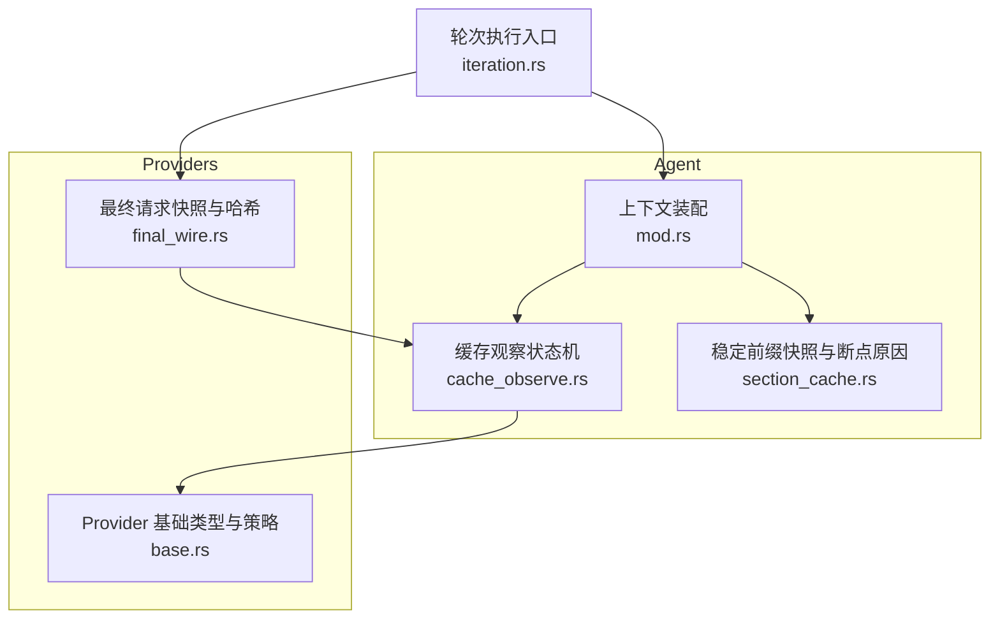
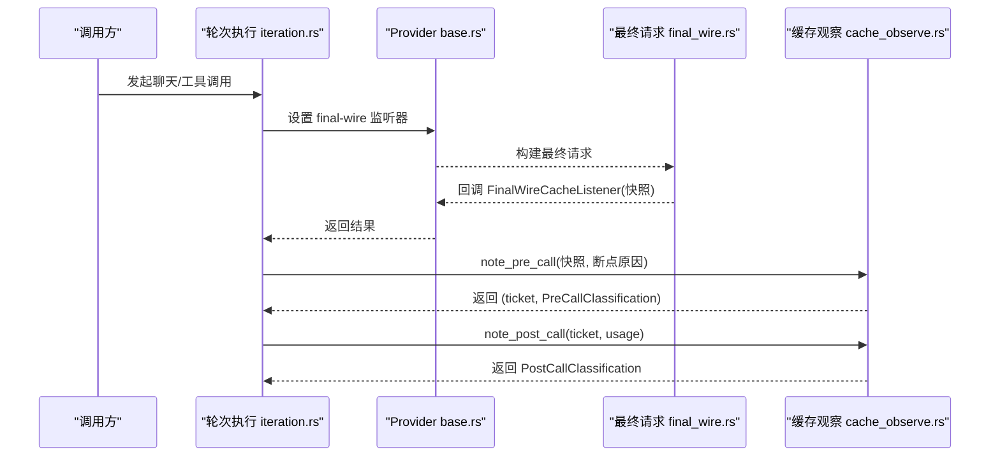
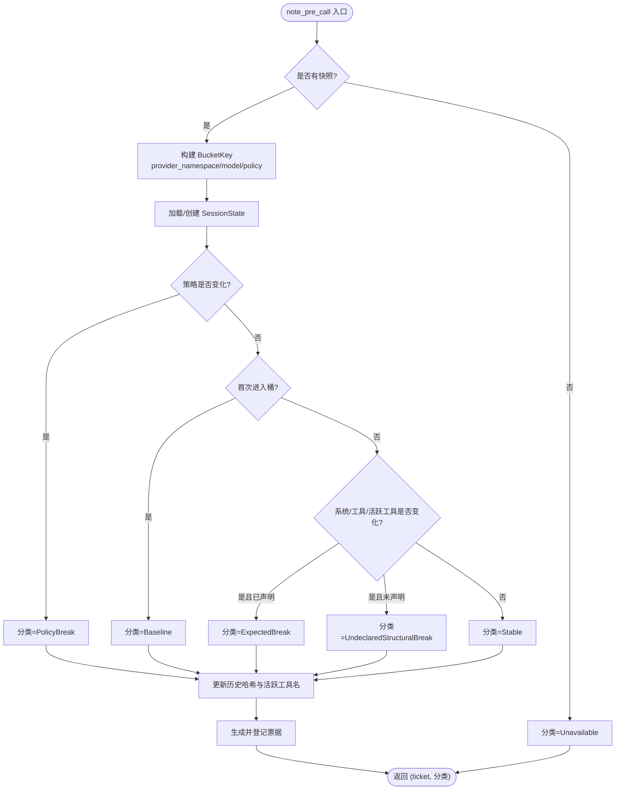
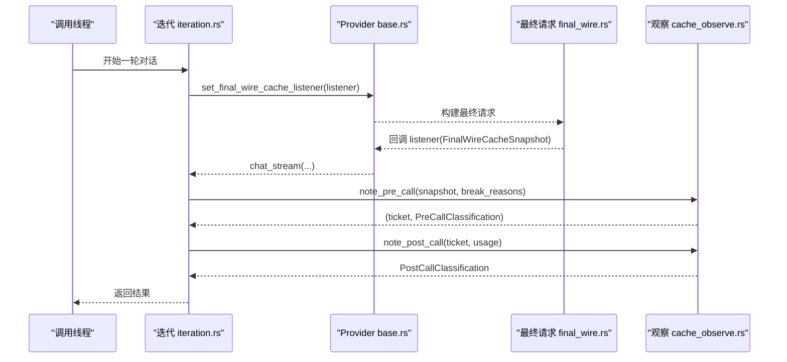
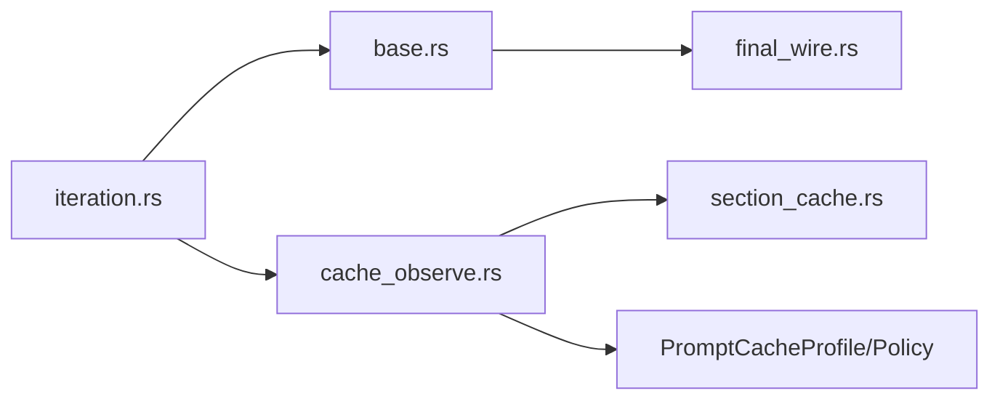

# 缓存观察机制

<cite>
**本文引用的文件**
- [cache_observe.rs](file://agent-diva-agent/src/context_assembly/cache_observe.rs)
- [section_cache.rs](file://agent-diva-agent/src/context_assembly/section_cache.rs)
- [mod.rs](file://agent-diva-agent/src/context_assembly/mod.rs)
- [final_wire.rs](file://agent-diva-providers/src/final_wire.rs)
- [base.rs](file://agent-diva-providers/src/base.rs)
- [iteration.rs](file://agent-diva-agent/src/agent_loop/turn/iteration.rs)
</cite>

## 目录
1. [简介](#简介)
2. [项目结构](#项目结构)
3. [核心组件](#核心组件)
4. [架构总览](#架构总览)
5. [详细组件分析](#详细组件分析)
6. [依赖关系分析](#依赖关系分析)
7. [性能考量](#性能考量)
8. [故障排查指南](#故障排查指南)
9. [结论](#结论)
10. [附录](#附录)

## 简介
本文件系统性说明 Agent 的“缓存观察机制”，围绕以下目标展开：
- 解释 CacheObserveState 的状态管理机制，以及如何跟踪缓存使用情况。
- 详细说明 PreCallClassification 与 PostCallClassification 的分类逻辑，展示如何对调用进行预分类和后分类。
- 解释 apply_core_tool_cache_anchor 的实现原理，说明如何为核心工具调用应用缓存锚点。
- 描述 core_tool_hash 的哈希计算算法，说明如何生成唯一的工具调用标识。
- 提供监控示例，展示如何收集与分析缓存性能指标。
- 以时序图呈现缓存观察的完整生命周期。

该机制将“请求前”的结构快照与“请求后”的使用计数结合，形成可观测、可审计的缓存行为视图，同时通过稳定的 CORE 前缀与动态后缀分离，避免动态挂载的工具影响稳定前缀的缓存身份。

## 项目结构
缓存观察相关代码主要分布在两个 crate：
- agent-diva-agent：上下文装配与缓存观察状态机（CacheObserveState、分类枚举、锚点与哈希）。
- agent-diva-providers：Provider 最终请求形态的快照构建与哈希计算（FinalWireCacheSnapshot、哈希函数）。

图表来源
- [mod.rs:1-24](file://agent-diva-agent/src/context_assembly/mod.rs#L1-L24)
- [cache_observe.rs:1-24](file://agent-diva-agent/src/context_assembly/cache_observe.rs#L1-L24)
- [section_cache.rs:1-14](file://agent-diva-agent/src/context_assembly/section_cache.rs#L1-L14)
- [base.rs:662-707](file://agent-diva-providers/src/base.rs#L662-L707)
- [final_wire.rs:1-49](file://agent-diva-providers/src/final_wire.rs#L1-L49)
- [iteration.rs:293-324](file://agent-diva-agent/src/agent_loop/turn/iteration.rs#L293-L324)

章节来源
- [mod.rs:1-24](file://agent-diva-agent/src/context_assembly/mod.rs#L1-L24)
- [cache_observe.rs:1-24](file://agent-diva-agent/src/context_assembly/cache_observe.rs#L1-L24)
- [section_cache.rs:1-14](file://agent-diva-agent/src/context_assembly/section_cache.rs#L1-L14)
- [base.rs:662-707](file://agent-diva-providers/src/base.rs#L662-L707)
- [final_wire.rs:1-49](file://agent-diva-providers/src/final_wire.rs#L1-L49)
- [iteration.rs:293-324](file://agent-diva-agent/src/agent_loop/turn/iteration.rs#L293-L324)

## 核心组件
- 预分类与后分类枚举
  - PreCallClassification：Baseline、Stable、ExpectedBreak、PolicyBreak、UndeclaredStructuralBreak、Unavailable。
  - PostCallClassification：UsageAvailable、UsageUnavailable。
- 观察输入与票据
  - CacheObserveInput：携带 session_id、可选的最终请求快照、声明的断点原因、是否预期删除。
  - CacheObservationTicket：用于配对一次“请求前”和“请求后”的观察。
- 会话与桶状态
  - SessionState：按 session_id 维护最近使用的 bucket 以及各 bucket 的历史。
  - BucketKey：由 provider_namespace、model、policy 组成。
  - BucketState：记录上次 stable_system_hash、core_tools_hash、active_tool_names。
- 状态机
  - CacheObserveState：维护 sessions、pending 观察队列、自增 ticket。
- 工具锚点与哈希
  - apply_core_tool_cache_anchor：为最后一个 CORE 工具注入 cache_control 锚点。
  - core_tool_hash：基于 ToolDefinitionSet 的显式 CORE 前缀计算 SHA-256 哈希。
- Provider 侧快照
  - FinalWireCacheSnapshot：provider_namespace、model、profile、stable_system_hash、core_tools_hash、active_tool_names、stable_prefix_tokens。
  - snapshot_from_wire：从 Provider 最终请求形态构造快照并计算哈希。
- 稳定前缀与断点原因
  - StablePrefixSnapshot：包含 sections、rendered、prefix_version，并提供 cache_break_reasons。
  - CacheBreakReason：mask_changed、l1_hot_refresh、agent_rules_reload、skills_reload、session_reset、session_ended。

章节来源
- [cache_observe.rs:10-66](file://agent-diva-agent/src/context_assembly/cache_observe.rs#L10-L66)
- [cache_observe.rs:207-226](file://agent-diva-agent/src/context_assembly/cache_observe.rs#L207-L226)
- [final_wire.rs:8-49](file://agent-diva-providers/src/final_wire.rs#L8-L49)
- [section_cache.rs:5-14](file://agent-diva-agent/src/context_assembly/section_cache.rs#L5-L14)
- [section_cache.rs:36-56](file://agent-diva-agent/src/context_assembly/section_cache.rs#L36-L56)

## 架构总览
缓存观察的生命周期分为三个阶段：
- 请求前：根据 Provider 最终请求快照与声明的断点原因，计算预分类并登记待观察票据。
- 请求中：Provider 实际处理请求；若支持，会回调 final-wire 监听器以产出快照。
- 请求后：根据使用计数判断是否可用缓存数据，完成观察闭环。

图表来源
- [iteration.rs:293-324](file://agent-diva-agent/src/agent_loop/turn/iteration.rs#L293-L324)
- [base.rs:773-780](file://agent-diva-providers/src/base.rs#L773-L780)
- [final_wire.rs:20-49](file://agent-diva-providers/src/final_wire.rs#L20-L49)
- [cache_observe.rs:68-165](file://agent-diva-agent/src/context_assembly/cache_observe.rs#L68-L165)
- [cache_observe.rs:167-189](file://agent-diva-agent/src/context_assembly/cache_observe.rs#L167-L189)

## 详细组件分析

### CacheObserveState 状态管理
- 会话级状态
  - 每个 session_id 维护 last_bucket 与 buckets 映射，用于跨调用追踪同一 provider/model/policy 组合下的变化。
- 桶级状态
  - 记录上一次 stable_system_hash、core_tools_hash、active_tool_names，用于检测系统提示或工具集变化。
- 待观察队列
  - pending 保存 ticket 到 session_id 与 bucket 的映射，确保 post-call 能正确匹配。
- 关键流程
  - note_pre_call：解析快照，计算 policy_changed、baseline、system_changed、core_tools_changed、active_tools_changed、declared_break、expected_break、undeclared_break，输出分类并更新历史。
  - note_post_call：移除 pending，读取 usage 中的 cache_read_input_tokens 与 cache_creation_input_tokens，输出 UsageAvailable 或 UsageUnavailable。
  - abandon_call/clear_session/clear：清理资源。

图表来源
- [cache_observe.rs:68-165](file://agent-diva-agent/src/context_assembly/cache_observe.rs#L68-L165)

章节来源
- [cache_observe.rs:50-66](file://agent-diva-agent/src/context_assembly/cache_observe.rs#L50-L66)
- [cache_observe.rs:68-165](file://agent-diva-agent/src/context_assembly/cache_observe.rs#L68-L165)
- [cache_observe.rs:167-205](file://agent-diva-agent/src/context_assembly/cache_observe.rs#L167-L205)

### PreCallClassification 与 PostCallClassification 分类逻辑
- 预分类
  - PolicyBreak：当 provider/model/policy 组合发生变化时触发。
  - Baseline：首次进入某个桶时的基线。
  - ExpectedBreak：当系统提示或工具集变化被声明，或活跃工具集合变化，或系统变化且已声明断点原因时触发。
  - UndeclaredStructuralBreak：系统或核心工具集变化但未声明断点原因，属于异常变更。
  - Stable：无变化，视为稳定。
  - Unavailable：没有 Provider 最终请求快照时不可用。
- 后分类
  - UsageAvailable：usage 中包含 cache_read_input_tokens 或 cache_creation_input_tokens。
  - UsageUnavailable：usage 缺失或未提供缓存计数。

章节来源
- [cache_observe.rs:10-24](file://agent-diva-agent/src/context_assembly/cache_observe.rs#L10-L24)
- [cache_observe.rs:68-165](file://agent-diva-agent/src/context_assembly/cache_observe.rs#L68-L165)
- [cache_observe.rs:167-189](file://agent-diva-agent/src/context_assembly/cache_observe.rs#L167-L189)

### apply_core_tool_cache_anchor 实现原理
- 目的：为 Provider 不暴露 cache anchor 的场景，在 Agent 边界注入一个稳定的 CORE 前缀锚点，使 deferred 工具不会扰动 CORE 缓存身份。
- 行为：
  - 如果 PromptCacheProfile 未启用或 tools.core_count 为 0，直接返回。
  - 否则，修改最后一个 CORE 工具的 JSON 定义，添加 cache_control 字段，值为 ephemeral。
- 效果：Provider 最终请求快照会将带有 cache_control 的工具作为 CORE 前缀的结束边界，从而稳定 core_tools_hash。

章节来源
- [cache_observe.rs:207-214](file://agent-diva-agent/src/context_assembly/cache_observe.rs#L207-L214)
- [final_wire.rs:23-49](file://agent-diva-providers/src/final_wire.rs#L23-L49)

### core_tool_hash 哈希计算算法
- 输入：ToolDefinitionSet，其中 definitions 为工具定义数组，core_count 为权威的核心前缀边界。
- 算法：
  - 取 definitions 的前 core_count 个元素（不超过总数），将其序列化为 JSON 字节。
  - 对字节序列计算 SHA-256 哈希，并以十六进制字符串表示。
- 特性：
  - 仅考虑显式的 CORE 前缀，deferred 工具的变化不会影响 core_tools_hash。
  - 任何 CORE 工具定义的语义变化（如 description）都会改变哈希。

章节来源
- [cache_observe.rs:216-226](file://agent-diva-agent/src/context_assembly/cache_observe.rs#L216-L226)
- [final_wire.rs:58-64](file://agent-diva-providers/src/final_wire.rs#L58-L64)

### 监控示例：收集与分析缓存性能指标
- 采集点
  - 请求前：note_pre_call 输出的 PreCallClassification，可用于统计 Baseline/Stable/ExpectedBreak/PolicyBreak/UndeclaredStructuralBreak/Unavailable 的比例。
  - 请求后：note_post_call 输出的 PostCallClassification，可用于统计 UsageAvailable/UsageUnavailable 比例。
  - 日志：prompt_cache_final_wire_sample、prompt_cache_usage 等结构化日志，包含 session_id、provider、model、policy、hash、stable_prefix_tokens、cache_read/creation。
- 分析方法
  - 按 session_id 聚合，观察不同 bucket 的稳定性趋势。
  - 对比 ExpectedBreak 与 UsageUnavailable，识别声明性断点与实际命中之间的差距。
  - 关注 UndeclaredStructuralBreak 的出现频率，定位未声明的系统或工具集变更。
  - 结合 stable_prefix_tokens 评估稳定前缀大小对缓存命中率的影响。

章节来源
- [cache_observe.rs:115-141](file://agent-diva-agent/src/context_assembly/cache_observe.rs#L115-L141)
- [cache_observe.rs:175-183](file://agent-diva-agent/src/context_assembly/cache_observe.rs#L175-L183)

### 完整生命周期时序图

图表来源
- [iteration.rs:293-324](file://agent-diva-agent/src/agent_loop/turn/iteration.rs#L293-L324)
- [base.rs:773-780](file://agent-diva-providers/src/base.rs#L773-L780)
- [final_wire.rs:20-49](file://agent-diva-providers/src/final_wire.rs#L20-L49)
- [cache_observe.rs:68-189](file://agent-diva-agent/src/context_assembly/cache_observe.rs#L68-L189)

## 依赖关系分析
- 模块耦合
  - context_assembly 依赖 providers 的 FinalWireCacheSnapshot 与 PromptCacheProfile/PromptCachePolicy。
  - iteration 通过 Provider 接口注入 final-wire 监听器，并将快照传递给缓存观察。
- 外部依赖
  - SHA-256 哈希用于稳定前缀与核心工具集的标识。
  - tracing 用于结构化日志输出，便于监控与排障。
- 潜在循环依赖
  - 当前设计将 Provider 与 Agent 解耦，通过快照与策略对象传递信息，避免循环依赖。

图表来源
- [iteration.rs:293-324](file://agent-diva-agent/src/agent_loop/turn/iteration.rs#L293-L324)
- [base.rs:662-707](file://agent-diva-providers/src/base.rs#L662-L707)
- [final_wire.rs:1-49](file://agent-diva-providers/src/final_wire.rs#L1-L49)
- [cache_observe.rs:1-24](file://agent-diva-agent/src/context_assembly/cache_observe.rs#L1-L24)
- [section_cache.rs:1-14](file://agent-diva-agent/src/context_assembly/section_cache.rs#L1-L14)

章节来源
- [iteration.rs:293-324](file://agent-diva-agent/src/agent_loop/turn/iteration.rs#L293-L324)
- [base.rs:662-707](file://agent-diva-providers/src/base.rs#L662-L707)
- [final_wire.rs:1-49](file://agent-diva-providers/src/final_wire.rs#L1-L49)
- [cache_observe.rs:1-24](file://agent-diva-agent/src/context_assembly/cache_observe.rs#L1-L24)
- [section_cache.rs:1-14](file://agent-diva-agent/src/context_assembly/section_cache.rs#L1-L14)

## 性能考量
- 哈希计算开销
  - core_tool_hash 与 final-wire 快照哈希均基于 JSON 序列化与 SHA-256，建议在高频路径中避免重复序列化。
- 内存占用
  - CacheObserveState 维护 sessions 与 buckets，需定期 clear_session 或 clear，防止长期运行累积。
- 日志量控制
  - prompt_cache_final_wire_sample 与 prompt_cache_usage 日志在高并发场景下可能产生大量输出，建议按需采样或调整日志级别。
- 稳定前缀大小
  - stable_prefix_tokens 越大，缓存命中潜力越高，但也会增加首条消息体积；应结合业务需求平衡。

[本节为通用指导，不直接分析具体文件]

## 故障排查指南
- 常见问题
  - 未声明的结构变化：出现 UndeclaredStructuralBreak 时，检查系统提示或核心工具集是否发生未声明变更。
  - 策略切换：PolicyBreak 频繁出现时，确认 provider/model/policy 配置是否稳定。
  - 使用计数缺失：PostCallClassification 为 UsageUnavailable 时，检查 Provider 是否返回缓存计数。
- 诊断步骤
  - 查看 prompt_cache_final_wire_sample 日志，核对 stable_system_hash、core_tools_hash、active_tool_names。
  - 查看 prompt_cache_usage 日志，核对 cache_read_input_tokens、cache_creation_input_tokens。
  - 使用 session_id 聚合分析，定位问题会话。

章节来源
- [cache_observe.rs:115-141](file://agent-diva-agent/src/context_assembly/cache_observe.rs#L115-L141)
- [cache_observe.rs:175-183](file://agent-diva-agent/src/context_assembly/cache_observe.rs#L175-L183)

## 结论
缓存观察机制通过“请求前快照 + 请求后使用计数”的组合，提供了对 Provider 缓存行为的精确观测能力。借助稳定的 CORE 前缀与动态后缀分离，系统在工具动态挂载时仍能保持缓存身份的稳定性。PreCallClassification 与 PostCallClassification 为运维与产品提供了清晰的信号，便于分析缓存命中率、断点原因与策略变更的影响。配合结构化日志与监控指标，可实现对缓存性能的持续优化。

[本节为总结，不直接分析具体文件]

## 附录
- 术语表
  - 稳定前缀：不参与每次变化的系统提示与核心工具集合，用于提升缓存命中。
  - 动态后缀：每次调用可能变化的内容，如历史、计划、用户信息等。
  - 锚点：用于标记稳定前缀边界的特殊标记，如 cache_control。
  - 桶：按 provider/model/policy 划分的状态单元，用于隔离不同策略下的缓存观察。

[本节为概念说明，不直接分析具体文件]