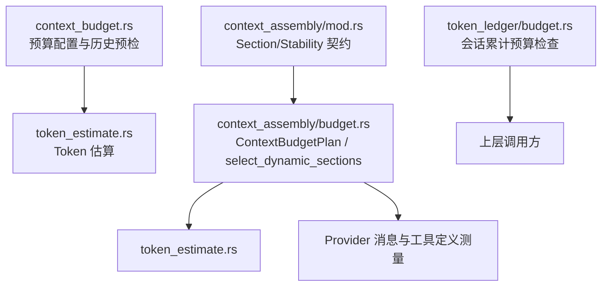
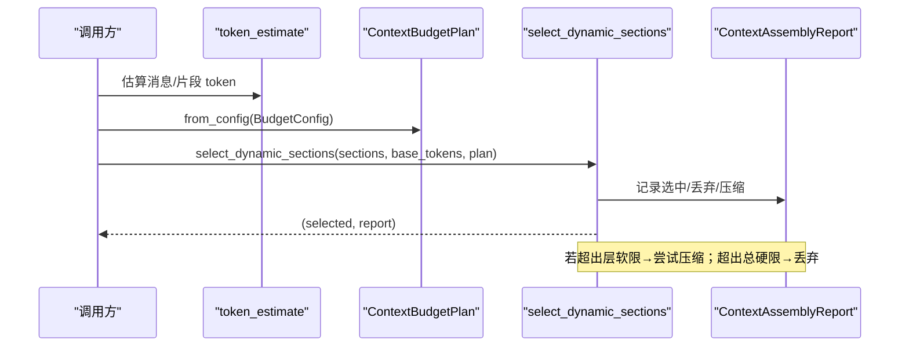
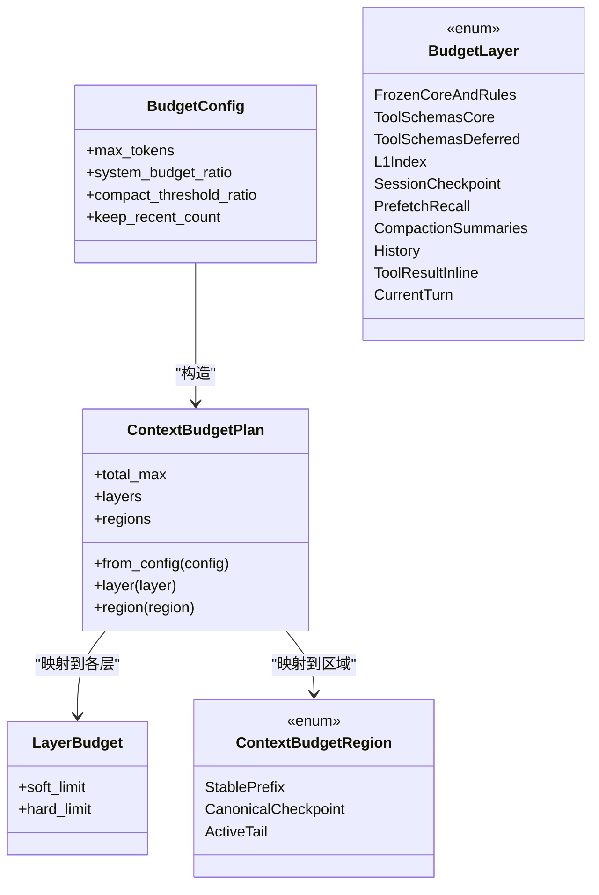
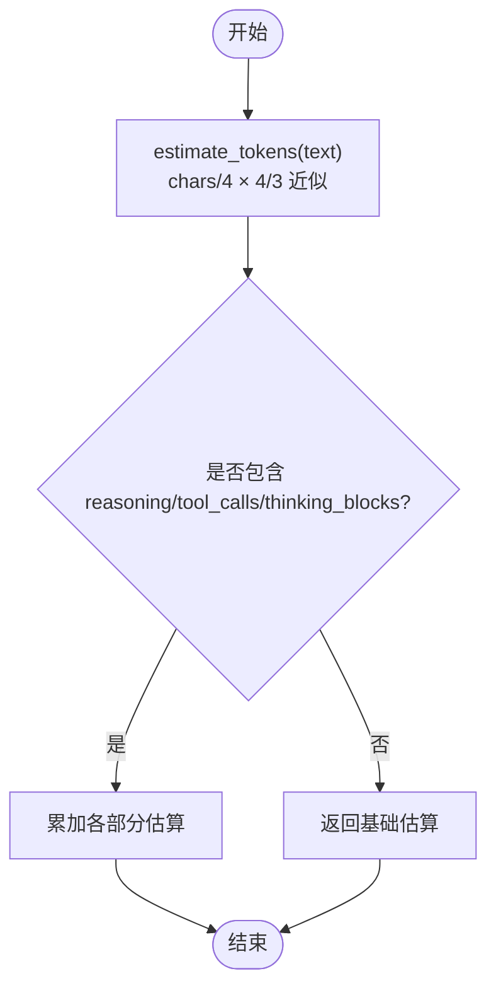
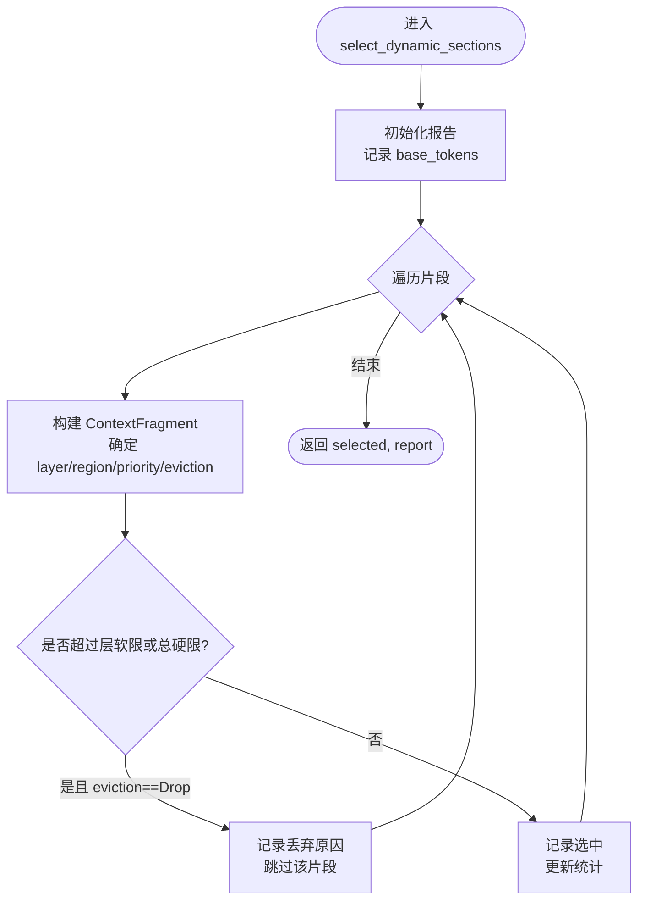
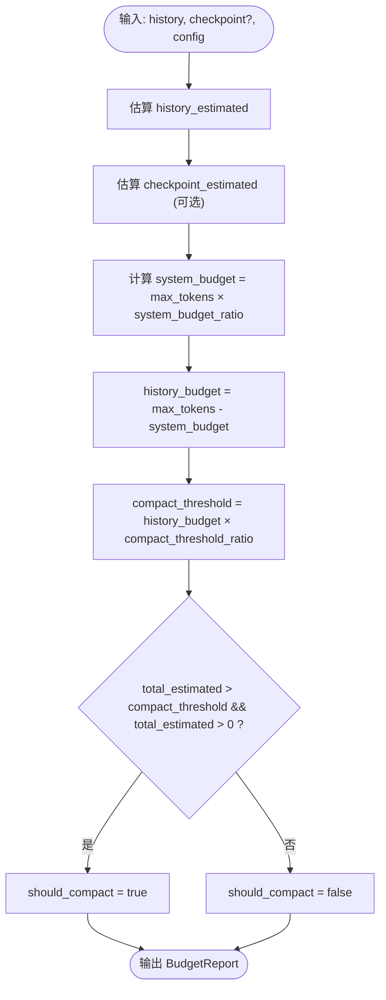
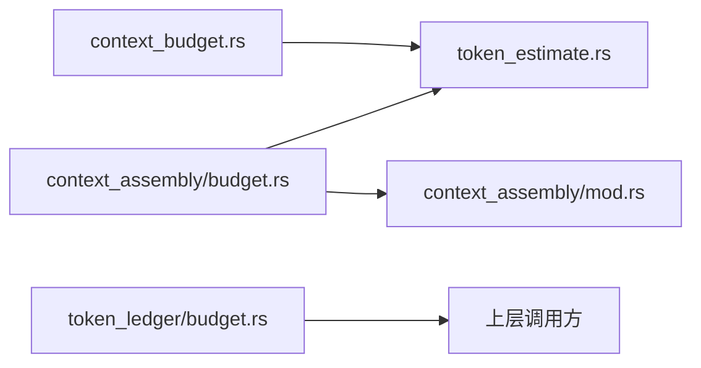

# 预算控制机制

<cite>
**本文引用的文件**
- [agent-diva-agent/src/context_budget.rs](file://agent-diva-agent/src/context_budget.rs)
- [agent-diva-agent/src/context_assembly/budget.rs](file://agent-diva-agent/src/context_assembly/budget.rs)
- [agent-diva-agent/src/token_estimate.rs](file://agent-diva-agent/src/token_estimate.rs)
- [agent-diva-core/src/token_ledger/budget.rs](file://agent-diva-core/src/token_ledger/budget.rs)
- [agent-diva-agent/src/context_assembly/mod.rs](file://agent-diva-agent/src/context_assembly/mod.rs)
</cite>

## 目录
1. [简介](#简介)
2. [项目结构](#项目结构)
3. [核心组件](#核心组件)
4. [架构总览](#架构总览)
5. [详细组件分析](#详细组件分析)
6. [依赖关系分析](#依赖关系分析)
7. [性能考量](#性能考量)
8. [故障排查指南](#故障排查指南)
9. [结论](#结论)
10. [附录：配置示例与最佳实践](#附录配置示例与最佳实践)

## 简介
本文件系统性阐述上下文预算控制机制，重点解释 ContextBudgetPlan 的设计与工作原理、LayerBudget 与 ContextBudgetRegion 等核心数据结构，以及 token 预算的分配、动态调整与超限处理策略。文档还详细说明 estimate_messages 的实现逻辑（如何估算消息的 token 消耗），select_dynamic_sections 的选择算法（如何在预算限制下选择最优的动态内容片段），并提供可操作的配置示例与流程图，帮助读者理解从“估算—决策—裁剪”的完整执行流程。

## 项目结构
围绕预算控制的代码主要分布在以下模块：
- 预算配置与历史预检：agent-diva-agent/src/context_budget.rs
- 分层预算计划与动态片段选择：agent-diva-agent/src/context_assembly/budget.rs
- Token 估算工具：agent-diva-agent/src/token_estimate.rs
- 会话级累计预算校验：agent-diva-core/src/token_ledger/budget.rs
- 上下文装配契约与稳定/动态段定义：agent-diva-agent/src/context_assembly/mod.rs

图表来源
- [agent-diva-agent/src/context_budget.rs:1-112](file://agent-diva-agent/src/context_budget.rs#L1-L112)
- [agent-diva-agent/src/context_assembly/budget.rs:111-193](file://agent-diva-agent/src/context_assembly/budget.rs#L111-L193)
- [agent-diva-agent/src/token_estimate.rs:1-81](file://agent-diva-agent/src/token_estimate.rs#L1-L81)
- [agent-diva-core/src/token_ledger/budget.rs:23-64](file://agent-diva-core/src/token_ledger/budget.rs#L23-L64)
- [agent-diva-agent/src/context_assembly/mod.rs:1-24](file://agent-diva-agent/src/context_assembly/mod.rs#L1-L24)

章节来源
- [agent-diva-agent/src/context_budget.rs:1-112](file://agent-diva-agent/src/context_budget.rs#L1-L112)
- [agent-diva-agent/src/context_assembly/budget.rs:1-117](file://agent-diva-agent/src/context_assembly/budget.rs#L1-L117)
- [agent-diva-agent/src/token_estimate.rs:1-81](file://agent-diva-agent/src/token_estimate.rs#L1-L81)
- [agent-diva-core/src/token_ledger/budget.rs:23-64](file://agent-diva-core/src/token_ledger/budget.rs#L23-L64)
- [agent-diva-agent/src/context_assembly/mod.rs:1-24](file://agent-diva-agent/src/context_assembly/mod.rs#L1-L24)

## 核心组件
- BudgetConfig：定义最大上下文窗口、系统预留比例、压缩阈值比例、保留最近消息数等关键参数。
- ContextBudgetPlan：基于 BudgetConfig 派生的分层预算计划，包含 total_max、各层软/硬上限（LayerBudget）以及三大顶级区域（StablePrefix、CanonicalCheckpoint、ActiveTail）的预算约束。
- LayerBudget：单层的软限制与硬限制，用于在“接近上限时优先压缩”和“超过上限时丢弃”之间做权衡。
- ContextBudgetRegion：顶层上下文区域划分，决定不同片段的优先级与淘汰策略。
- EvictionPolicy：片段在超限时允许的动作（从不删除、压缩、直接丢弃）。
- AssemblyDecisionReason：记录被丢弃或压缩的原因（层软限、总硬限、宏压缩、微压缩）。
- ContextAssemblyReport：无提示内容的度量报告，统计选中/丢弃/压缩片段数量与按层/区域的 token 汇总。

章节来源
- [agent-diva-agent/src/context_budget.rs:25-112](file://agent-diva-agent/src/context_budget.rs#L25-L112)
- [agent-diva-agent/src/context_assembly/budget.rs:13-117](file://agent-diva-agent/src/context_assembly/budget.rs#L13-L117)
- [agent-diva-agent/src/context_assembly/budget.rs:63-117](file://agent-diva-agent/src/context_assembly/budget.rs#L63-L117)
- [agent-diva-agent/src/context_assembly/budget.rs:195-228](file://agent-diva-agent/src/context_assembly/budget.rs#L195-L228)

## 架构总览
预算控制由“估算—计划—选择—度量”四步组成：
- 估算：对消息、工具定义、PromptSection 进行 token 估算。
- 计划：根据 BudgetConfig 生成 ContextBudgetPlan，为每个层与区域设定软/硬上限。
- 选择：遍历动态片段，依据层上限与总上限决定是否保留、压缩或丢弃。
- 度量：输出 ContextAssemblyReport，便于观测压力与采取进一步动作（如触发压缩）。

图表来源
- [agent-diva-agent/src/context_assembly/budget.rs:230-285](file://agent-diva-agent/src/context_assembly/budget.rs#L230-L285)
- [agent-diva-agent/src/context_assembly/budget.rs:119-193](file://agent-diva-agent/src/context_assembly/budget.rs#L119-L193)
- [agent-diva-agent/src/token_estimate.rs:39-81](file://agent-diva-agent/src/token_estimate.rs#L39-L81)

## 详细组件分析

### ContextBudgetPlan 与 LayerBudget、ContextBudgetRegion
- ContextBudgetPlan::from_config 将 BudgetConfig.max_tokens 拆分为多个层的软/硬上限，并定义三个顶级区域：
  - StablePrefix：系统提示、规则、技能等稳定前缀，使用 system_budget_ratio 作为上限。
  - CanonicalCheckpoint：压缩后的会话摘要，固定比例上限。
  - ActiveTail：活跃尾部（历史、当前轮次、工具结果等），软上限为 total - stable，硬上限为 total。
- LayerBudget 提供 soft_limit 与 hard_limit，分别对应“建议压缩”和“必须丢弃”的阈值。
- 各层默认比例（以 total 为基数）：
  - FrozenCoreAndRules：system_budget_ratio（软=硬）
  - ToolSchemasCore：0.12/0.15
  - ToolSchemasDeferred：0.03/0.05
  - L1Index：0.04/0.06
  - SessionCheckpoint：0.03/0.04
  - PrefetchRecall：0.03/0.04
  - CompactionSummaries：0.08/0.10
  - History：0.55/0.80
  - ToolResultInline：0.08/0.12
  - CurrentTurn：total（软=硬=total）

图表来源
- [agent-diva-agent/src/context_assembly/budget.rs:111-193](file://agent-diva-agent/src/context_assembly/budget.rs#L111-L193)
- [agent-diva-agent/src/context_budget.rs:25-112](file://agent-diva-agent/src/context_budget.rs#L25-L112)

章节来源
- [agent-diva-agent/src/context_assembly/budget.rs:111-193](file://agent-diva-agent/src/context_assembly/budget.rs#L111-L193)
- [agent-diva-agent/src/context_budget.rs:25-112](file://agent-diva-agent/src/context_budget.rs#L25-L112)

### Token 估算策略：estimate_messages 与 estimate_tokens
- estimate_tokens：采用 chars/4 × 4/3 启发式（等价于 chars/3），对任意文本快速估算 token 数，支持 Unicode，误差 ≤10%（DeepSeek V3 tokenizer 基准）。
- estimate_message：对 Provider Message 估算 token，包括 content、reasoning_content、tool_calls（序列化后估算）。
- estimate_messages：对消息数组求和得到总估算 token。
- 对于 ChatMessage（历史消息），还提供 estimate_message_tokens 与 estimate_total_tokens，覆盖 reasoning、tool_calls、thinking_blocks 等字段。

图表来源
- [agent-diva-agent/src/token_estimate.rs:39-81](file://agent-diva-agent/src/token_estimate.rs#L39-L81)
- [agent-diva-agent/src/context_assembly/budget.rs:417-428](file://agent-diva-agent/src/context_assembly/budget.rs#L417-L428)

章节来源
- [agent-diva-agent/src/token_estimate.rs:1-81](file://agent-diva-agent/src/token_estimate.rs#L1-L81)
- [agent-diva-agent/src/context_assembly/budget.rs:417-428](file://agent-diva-agent/src/context_assembly/budget.rs#L417-L428)

### 动态片段选择算法：select_dynamic_sections
- 输入：动态片段列表 sections、base_tokens（通常为历史消息的估算）、plan（ContextBudgetPlan）。
- 过程：
  - 初始化报告，记录 base_tokens（归入 History 层与 ActiveTail 区域）。
  - 遍历每个片段，将其转换为 ContextFragment，确定所属层、区域、优先级、淘汰策略。
  - 计算该片段加入后是否超过所在层的 soft_limit 或总硬 limit。
  - 若 eviction == Drop 且超过任一限制，则记录丢弃原因（TotalHardLimit 或 LayerSoftLimit）并跳过。
  - 否则记录选中，并更新报告统计。
- 输出：选中的片段集合与 ContextAssemblyReport。

图表来源
- [agent-diva-agent/src/context_assembly/budget.rs:230-285](file://agent-diva-agent/src/context_assembly/budget.rs#L230-L285)

章节来源
- [agent-diva-agent/src/context_assembly/budget.rs:230-285](file://agent-diva-agent/src/context_assembly/budget.rs#L230-L285)

### 预算检查与压缩触发：check_budget / check_context_budget
- check_budget：仅针对历史消息进行预检，计算 history_budget = max_tokens × (1 - system_budget_ratio)，compact_threshold = history_budget × compact_threshold_ratio。当 history_estimated > compact_threshold 且 history_estimated > 0 时触发压缩。
- check_context_budget：扩展至包含 canonical checkpoint 的完整上下文，将 checkpoint 估算计入 total_estimated，并据此计算压力比与压缩决策。

图表来源
- [agent-diva-agent/src/context_budget.rs:164-207](file://agent-diva-agent/src/context_budget.rs#L164-L207)

章节来源
- [agent-diva-agent/src/context_budget.rs:164-207](file://agent-diva-agent/src/context_budget.rs#L164-L207)

### Provider 上下文测量：measure_provider_context
- 将 provider 消息与工具定义映射为 ContextFragment，并为每条消息/定义估算 token。
- 首条 system 消息归入 FrozenCoreAndRules 层与 StablePrefix 区域；最后一条用户消息归入 CurrentTurn 层与 ActiveTail 区域；工具结果归入 ToolResultInline。
- 工具定义分 core 与 deferred，core 工具 schema 归入 StablePrefix 且永不驱逐，deferred 工具 schema 归入 ActiveTail 且可能被丢弃。

章节来源
- [agent-diva-agent/src/context_assembly/budget.rs:287-367](file://agent-diva-agent/src/context_assembly/budget.rs#L287-L367)

## 依赖关系分析
- context_budget 依赖 token_estimate 进行历史消息 token 估算。
- context_assembly/budget 依赖 token_estimate 与 context_assembly 契约（Section/Stability）来构建片段与选择策略。
- token_ledger/budget 独立于上述模块，负责会话维度的累计 token 使用量检查，防止跨轮次超支。

图表来源
- [agent-diva-agent/src/context_budget.rs:1-112](file://agent-diva-agent/src/context_budget.rs#L1-L112)
- [agent-diva-agent/src/context_assembly/budget.rs:1-117](file://agent-diva-agent/src/context_assembly/budget.rs#L1-L117)
- [agent-diva-core/src/token_ledger/budget.rs:23-64](file://agent-diva-core/src/token_ledger/budget.rs#L23-L64)
- [agent-diva-agent/src/context_assembly/mod.rs:1-24](file://agent-diva-agent/src/context_assembly/mod.rs#L1-L24)

章节来源
- [agent-diva-agent/src/context_budget.rs:1-112](file://agent-diva-agent/src/context_budget.rs#L1-L112)
- [agent-diva-agent/src/context_assembly/budget.rs:1-117](file://agent-diva-agent/src/context_assembly/budget.rs#L1-L117)
- [agent-diva-core/src/token_ledger/budget.rs:23-64](file://agent-diva-core/src/token_ledger/budget.rs#L23-L64)
- [agent-diva-agent/src/context_assembly/mod.rs:1-24](file://agent-diva-agent/src/context_assembly/mod.rs#L1-L24)

## 性能考量
- Token 估算采用轻量启发式（chars/3），避免引入重型 tokenizer，适合高频调用。
- 选择算法为线性扫描，时间复杂度 O(n)，空间复杂度 O(n) 用于存储选中片段与报告。
- 通过分层软/硬上限，优先在“接近上限”时压缩非关键片段，减少不必要的丢弃，提升上下文质量。
- 工具定义区分 core/deferred，核心工具 schema 常驻稳定前缀，降低重复开销。

[本节为通用指导，不直接分析具体文件]

## 故障排查指南
- 预算超限错误：当会话累计使用超过限制时，会返回 BudgetExceeded 错误，携带 session_id、used、limit 信息，便于定位问题。
- 常见原因：
  - 历史消息过长或频繁长响应导致 history_estimated 超过 compact_threshold。
  - 工具定义过多或过大，导致 ToolSchemasDeferred 层被丢弃。
  - 召回内容（PrefetchRecall）在压力下首先被丢弃，需关注其重要性。
- 建议操作：
  - 调整 BudgetConfig.system_budget_ratio 以预留更多系统空间。
  - 调小 compact_threshold_ratio，提前触发压缩。
  - 减少工具定义或延迟加载非必要工具 schema。
  - 优化 PromptSection 内容与顺序，确保关键片段优先。

章节来源
- [agent-diva-core/src/token_ledger/budget.rs:8-64](file://agent-diva-core/src/token_ledger/budget.rs#L8-L64)
- [agent-diva-agent/src/context_assembly/budget.rs:230-285](file://agent-diva-agent/src/context_assembly/budget.rs#L230-L285)
- [agent-diva-agent/src/context_budget.rs:164-207](file://agent-diva-agent/src/context_budget.rs#L164-L207)

## 结论
本机制通过“分层预算 + 区域划分 + 动态选择”的组合，实现了在有限上下文窗口内最大化有用信息的保留。ContextBudgetPlan 将全局预算拆解为多层约束，结合 EvictionPolicy 与 AssemblyDecisionReason 实现精细化的裁剪策略；estimate_messages 与 estimate_tokens 提供高效准确的 token 估算；select_dynamic_sections 在预算限制下做出最优选择；check_budget/check_context_budget 提供压缩触发信号。配合 token_ledger 的会话级预算检查，形成端到端的预算控制闭环。

[本节为总结性内容，不直接分析具体文件]

## 附录：配置示例与最佳实践
- 基本配置项
  - max_tokens：模型上下文窗口上限（可从模型能力表获取或通过环境变量覆盖）。
  - system_budget_ratio：系统提示、技能、记忆等稳定前缀的预留比例（建议 0.10–0.20）。
  - compact_threshold_ratio：历史预算达到该比例时触发压缩（建议 0.7–0.9）。
  - keep_recent_count：始终保留的最近消息数（建议 5–20）。
- 推荐构造方式
  - 使用 for_model(model) 自动匹配模型上下文窗口。
  - 使用 from_env_or_model(model) 支持环境变量 AGENT_DIVA_MAX_CONTEXT_TOKENS 覆盖。
- 典型场景
  - 长对话：提高 compact_threshold_ratio 以更早压缩历史；适当增加 keep_recent_count 保证近期上下文。
  - 大量工具：将非必要工具定义为 deferred，避免占用稳定前缀。
  - 高价值召回：提升 PrefetchRecall 的优先级或放宽其层上限，但需监控总硬限。
- 观测与调优
  - 关注 ContextAssemblyReport 中 dropped/compacted 的数量与原因。
  - 观察 totals_by_layer/totals_by_region 分布，识别瓶颈层/区域。
  - 逐步调整各层比例，平衡稳定性与动态性。

章节来源
- [agent-diva-agent/src/context_budget.rs:73-112](file://agent-diva-agent/src/context_budget.rs#L73-L112)
- [agent-diva-agent/src/context_assembly/budget.rs:119-193](file://agent-diva-agent/src/context_assembly/budget.rs#L119-L193)
- [agent-diva-agent/src/context_assembly/budget.rs:230-285](file://agent-diva-agent/src/context_assembly/budget.rs#L230-L285)