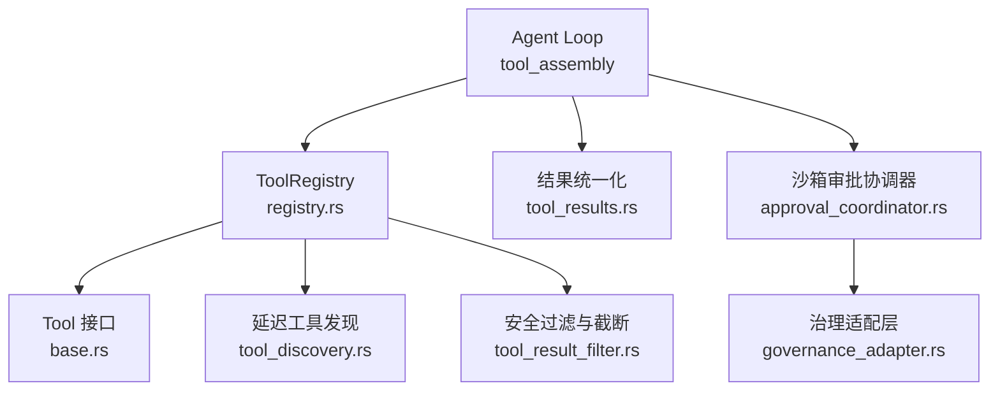
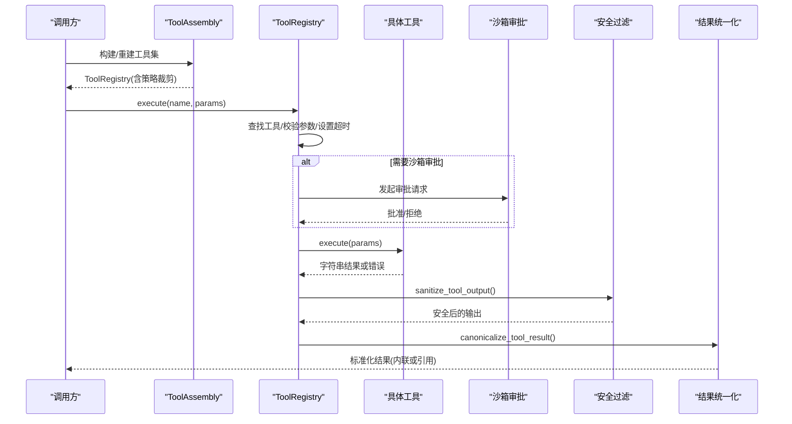
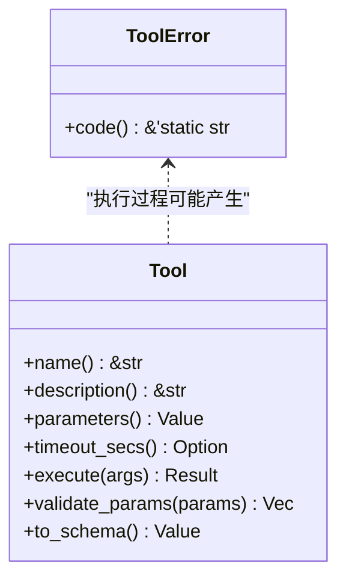
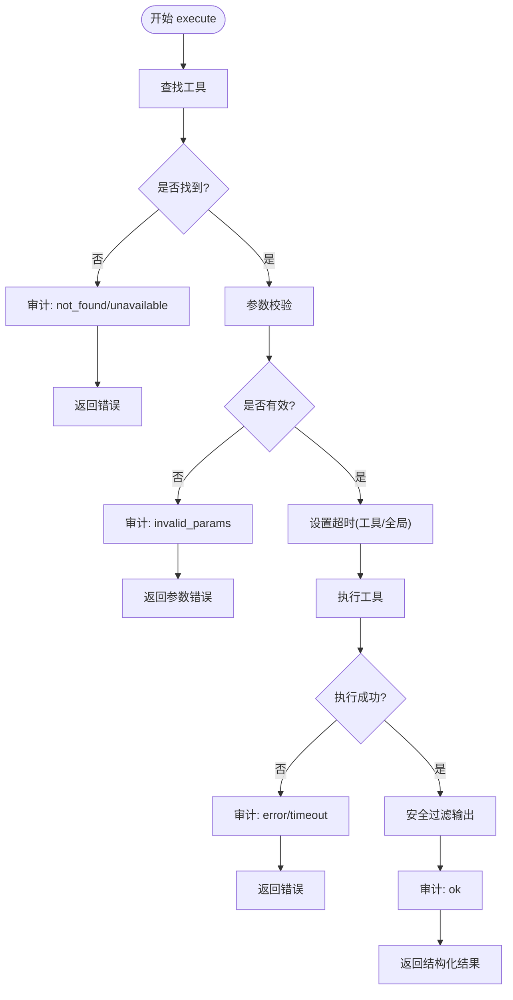
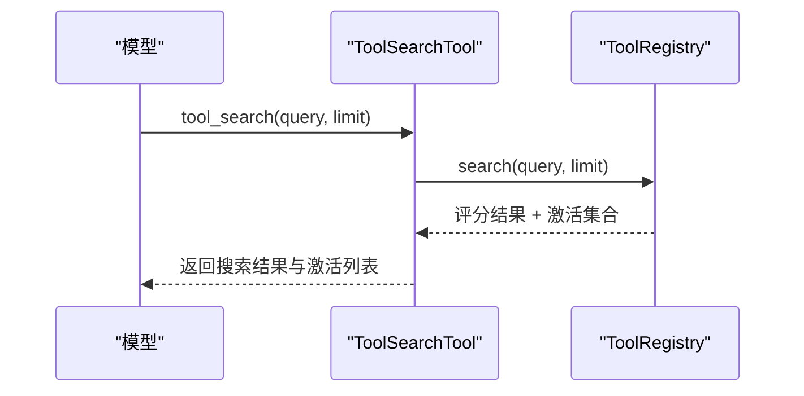
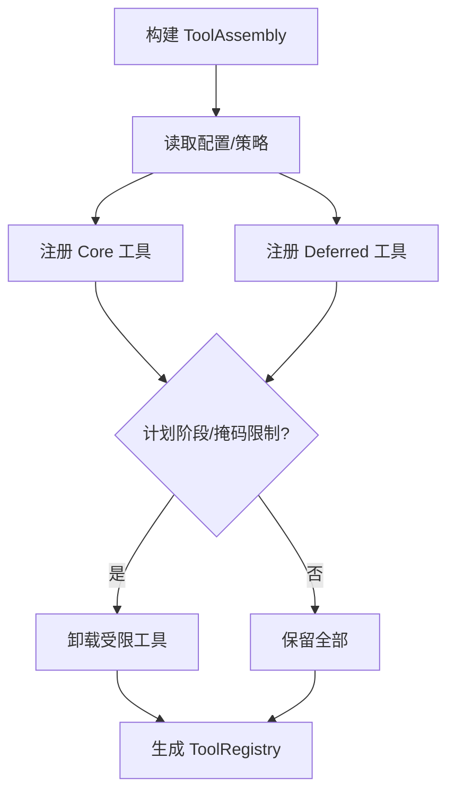
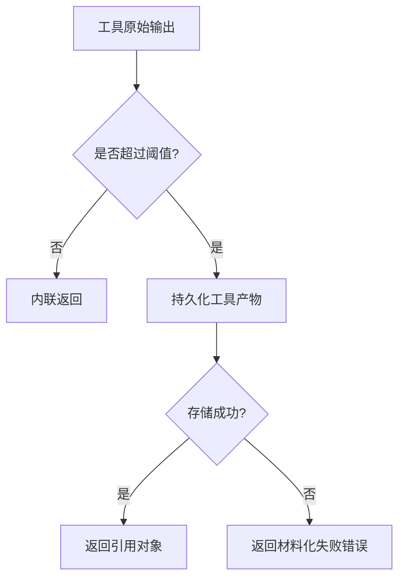
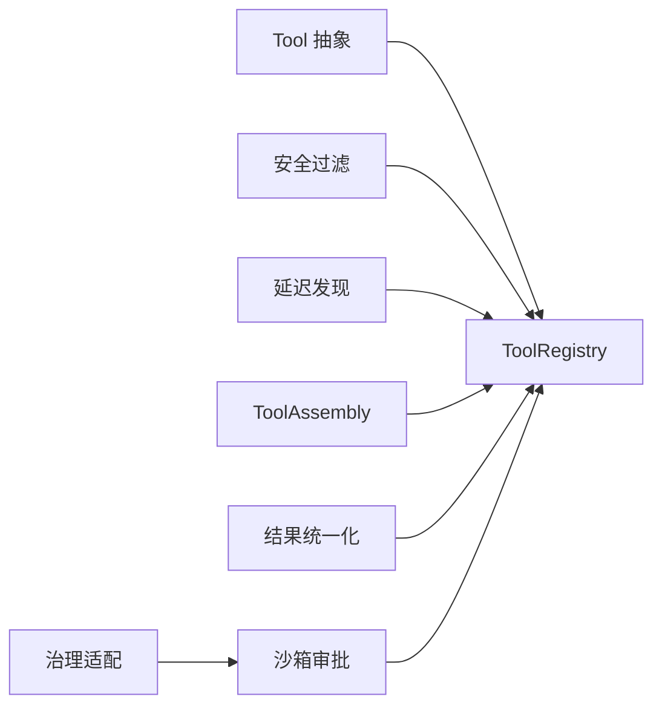

# 工具执行

<cite>
**本文引用的文件**
- [agent-diva-tooling/src/registry.rs](file://agent-diva-tooling/src/registry.rs)
- [agent-diva-tooling/src/base.rs](file://agent-diva-tooling/src/base.rs)
- [agent-diva-tools/src/tool_discovery.rs](file://agent-diva-tools/src/tool_discovery.rs)
- [agent-diva-agent/src/tool_assembly.rs](file://agent-diva-agent/src/tool_assembly.rs)
- [agent-diva-agent/src/tool_results.rs](file://agent-diva-agent/src/tool_results.rs)
- [agent-diva-core/src/security/tool_result_filter.rs](file://agent-diva-core/src/security/tool_result_filter.rs)
- [agent-diva-sandbox/src/approval_coordinator.rs](file://agent-diva-sandbox/src/approval_coordinator.rs)
- [agent-diva-sandbox/src/governance_adapter.rs](file://agent-diva-sandbox/src/governance_adapter.rs)
</cite>

## 目录
1. [简介](#简介)
2. [项目结构](#项目结构)
3. [核心组件](#核心组件)
4. [架构总览](#架构总览)
5. [详细组件分析](#详细组件分析)
6. [依赖关系分析](#依赖关系分析)
7. [性能考量](#性能考量)
8. [故障排查指南](#故障排查指南)
9. [结论](#结论)
10. [附录：自定义工具开发示例](#附录自定义工具开发示例)

## 简介
本文件面向“工具执行”的完整生命周期与调用流程，覆盖以下主题：
- 工具注册与发现机制（ToolRegistry、延迟激活、搜索激活）
- 工具调用的完整流程（参数校验、权限检查、执行环境准备）
- 结果统一处理（成功、错误、超时、大结果归档、注入检测与截断）
- 异步执行模式（并发控制、资源隔离、结果聚合）
- 自定义工具开发示例与最佳实践
- 关键交互时序图

## 项目结构
围绕工具执行的关键模块分布如下：
- 工具抽象与注册中心：agent-diva-tooling
- 内置工具与发现能力：agent-diva-tools
- 工具装配与策略裁剪：agent-diva-agent
- 结果统一化与安全过滤：agent-diva-core + agent-diva-agent
- 沙箱审批与治理适配：agent-diva-sandbox

图表来源
- [agent-diva-agent/src/tool_assembly.rs:240-616](file://agent-diva-agent/src/tool_assembly.rs#L240-L616)
- [agent-diva-tooling/src/registry.rs:362-717](file://agent-diva-tooling/src/registry.rs#L362-L717)
- [agent-diva-tooling/src/base.rs:6-61](file://agent-diva-tooling/src/base.rs#L6-L61)
- [agent-diva-tools/src/tool_discovery.rs:8-59](file://agent-diva-tools/src/tool_discovery.rs#L8-L59)
- [agent-diva-core/src/security/tool_result_filter.rs:41-132](file://agent-diva-core/src/security/tool_result_filter.rs#L41-L132)
- [agent-diva-agent/src/tool_results.rs:20-89](file://agent-diva-agent/src/tool_results.rs#L20-L89)
- [agent-diva-sandbox/src/approval_coordinator.rs:275-306](file://agent-diva-sandbox/src/approval_coordinator.rs#L275-L306)
- [agent-diva-sandbox/src/governance_adapter.rs:15-37](file://agent-diva-sandbox/src/governance_adapter.rs#L15-L37)

章节来源
- [agent-diva-agent/src/tool_assembly.rs:240-616](file://agent-diva-agent/src/tool_assembly.rs#L240-L616)
- [agent-diva-tooling/src/registry.rs:362-717](file://agent-diva-tooling/src/registry.rs#L362-L717)

## 核心组件
- Tool 抽象：定义名称、描述、参数 Schema、可选超时、执行与参数校验。
- ToolRegistry：维护工具集合、全局超时、延迟工具激活状态；提供注册、查询、执行、Schema 暴露等能力。
- 延迟工具发现：通过 tool_search 对已授权但暂不暴露的工具进行关键词检索并激活有限数量的工具。
- 工具装配：根据配置、计划阶段、掩码策略、工作区限制等条件，动态组装可用工具集。
- 结果统一化：将工具输出标准化为内联或引用形式，支持大结果持久化与失败回退。
- 安全过滤：注入检测、不可信包裹、字符截断，防止上下文污染与攻击。
- 沙箱审批：命令执行前通过审批协调器与治理适配层进行风险评估与授权决策。

章节来源
- [agent-diva-tooling/src/base.rs:6-61](file://agent-diva-tooling/src/base.rs#L6-L61)
- [agent-diva-tooling/src/registry.rs:362-717](file://agent-diva-tooling/src/registry.rs#L362-L717)
- [agent-diva-tools/src/tool_discovery.rs:8-59](file://agent-diva-tools/src/tool_discovery.rs#L8-L59)
- [agent-diva-agent/src/tool_assembly.rs:240-616](file://agent-diva-agent/src/tool_assembly.rs#L240-L616)
- [agent-diva-agent/src/tool_results.rs:20-89](file://agent-diva-agent/src/tool_results.rs#L20-L89)
- [agent-diva-core/src/security/tool_result_filter.rs:41-132](file://agent-diva-core/src/security/tool_result_filter.rs#L41-L132)
- [agent-diva-sandbox/src/approval_coordinator.rs:275-306](file://agent-diva-sandbox/src/approval_coordinator.rs#L275-L306)
- [agent-diva-sandbox/src/governance_adapter.rs:15-37](file://agent-diva-sandbox/src/governance_adapter.rs#L15-L37)

## 架构总览
工具执行的整体路径如下：
- 上层 Agent Loop 通过 ToolAssembly 构建 ToolRegistry，按策略裁剪工具集。
- 模型侧请求工具调用时，先获取当前可用的工具 Schema（Core + 已激活的 Deferred）。
- Registry.execute 负责查找工具、校验参数、设置超时、执行并审计。
- 工具内部可能触发沙箱审批（如 shell 执行），由 ApprovalCoordinator 与 GovernanceAdapter 完成授权。
- 工具返回后，统一进行安全过滤与大结果归档，最终形成标准化的消息内容。

图表来源
- [agent-diva-agent/src/tool_assembly.rs:240-616](file://agent-diva-agent/src/tool_assembly.rs#L240-L616)
- [agent-diva-tooling/src/registry.rs:534-699](file://agent-diva-tooling/src/registry.rs#L534-L699)
- [agent-diva-core/src/security/tool_result_filter.rs:61-132](file://agent-diva-core/src/security/tool_result_filter.rs#L61-L132)
- [agent-diva-agent/src/tool_results.rs:20-89](file://agent-diva-agent/src/tool_results.rs#L20-L89)
- [agent-diva-sandbox/src/approval_coordinator.rs:275-306](file://agent-diva-sandbox/src/approval_coordinator.rs#L275-L306)

## 详细组件分析

### Tool 抽象与错误模型
- Tool trait 定义了工具的最小契约：name、description、parameters、timeout_secs、execute、validate_params、to_schema。
- ToolError 枚举统一了工具执行过程中的错误类型，包括参数无效、执行失败、IO 错误、超时、工具不可用等，并提供稳定错误码便于上层分类与展示。

图表来源
- [agent-diva-tooling/src/base.rs:6-61](file://agent-diva-tooling/src/base.rs#L6-L61)
- [agent-diva-tooling/src/base.rs:63-123](file://agent-diva-tooling/src/base.rs#L63-L123)

章节来源
- [agent-diva-tooling/src/base.rs:6-123](file://agent-diva-tooling/src/base.rs#L6-L123)

### ToolRegistry：注册、发现与执行
- 注册与分区：工具可注册到 Core 或 Deferred 分区。Core 始终可见，Deferred 需通过搜索激活后才暴露给模型。
- 延迟激活：ActiveDeferredTools 维护任务级激活集合，search 会基于名称、描述、Schema 关键词评分排序，最多激活固定数量工具。
- 执行流程：
  - 查找工具：不存在则记录审计并返回未找到；若为 Deferred 且未激活，返回不可用。
  - 参数校验：调用工具的 validate_params，收集错误并审计。
  - 超时控制：优先使用工具自身 timeout_secs，否则使用全局超时；使用 tokio::time::timeout 包装执行。
  - 结果处理：成功则安全过滤并审计；失败或超时分别记录审计与错误。
- Schema 暴露：get_definition_set 保证 CORE 前缀稳定，并按激活状态过滤 Deferred 工具。

图表来源
- [agent-diva-tooling/src/registry.rs:534-699](file://agent-diva-tooling/src/registry.rs#L534-L699)
- [agent-diva-tooling/src/registry.rs:154-232](file://agent-diva-tooling/src/registry.rs#L154-L232)
- [agent-diva-tooling/src/registry.rs:452-483](file://agent-diva-tooling/src/registry.rs#L452-L483)

章节来源
- [agent-diva-tooling/src/registry.rs:362-717](file://agent-diva-tooling/src/registry.rs#L362-L717)

### 延迟工具发现：tool_search
- 作用：在已授权范围内搜索 Deferred 工具，按名称、描述、Schema 关键词评分，激活前 N 个工具供下一轮模型调用使用。
- 行为：search 会更新 ActiveDeferredTools，使对应工具在 get_definition_set 中可见并可被调用。

图表来源
- [agent-diva-tools/src/tool_discovery.rs:8-59](file://agent-diva-tools/src/tool_discovery.rs#L8-L59)
- [agent-diva-tooling/src/registry.rs:154-232](file://agent-diva-tooling/src/registry.rs#L154-L232)

章节来源
- [agent-diva-tools/src/tool_discovery.rs:8-59](file://agent-diva-tools/src/tool_discovery.rs#L8-L59)

### 工具装配与策略裁剪
- 装配入口：ToolAssembly 根据内置开关、网络配置、计划阶段、掩码策略、工作区限制等，决定注册哪些工具以及以何种分区注册。
- 策略要点：
  - Plan 阶段或只读掩码下，禁用写操作工具。
  - 子代理模式下，移除部分高权限工具。
  - 自定义工具默认作为 Deferred 注册，需搜索激活。
  - 掩码工具限制会在最后一步生效，确保显式允许/拒绝列表覆盖所有注册路径。

图表来源
- [agent-diva-agent/src/tool_assembly.rs:240-616](file://agent-diva-agent/src/tool_assembly.rs#L240-L616)

章节来源
- [agent-diva-agent/src/tool_assembly.rs:240-616](file://agent-diva-agent/src/tool_assembly.rs#L240-L616)

### 结果统一处理：内联与引用、失败回退
- 小结果：直接以内联文本返回。
- 大结果：写入工具产物存储，返回引用对象；若存储失败或超出容量，返回材料化失败的结构化错误。
- 历史消息压缩：对旧的大结果进行微压缩，避免上下文膨胀。

图表来源
- [agent-diva-agent/src/tool_results.rs:20-89](file://agent-diva-agent/src/tool_results.rs#L20-L89)

章节来源
- [agent-diva-agent/src/tool_results.rs:20-148](file://agent-diva-agent/src/tool_results.rs#L20-L148)

### 安全过滤：注入检测与截断
- 注入检测：识别可疑指令注入模式，标记为 [SUSPICIOUS] 并审计。
- 截断：超过最大字符数时截断并附加提示，防止上下文耗尽攻击。
- 不可信包裹：可将输出包裹在不可信标签中，提醒 LLM 该内容为外部来源。

章节来源
- [agent-diva-core/src/security/tool_result_filter.rs:41-132](file://agent-diva-core/src/security/tool_result_filter.rs#L41-L132)

### 沙箱审批与治理适配
- 命令执行类工具在执行前可能触发审批流程，ApprovalCoordinator 将请求转换为治理层请求，附带风险等级、过期时间、工作区等信息。
- GovernanceAdapter 将沙箱请求适配为统一的治理请求，确保跨模块一致性与可审计性。

章节来源
- [agent-diva-sandbox/src/approval_coordinator.rs:275-306](file://agent-diva-sandbox/src/approval_coordinator.rs#L275-L306)
- [agent-diva-sandbox/src/governance_adapter.rs:15-37](file://agent-diva-sandbox/src/governance_adapter.rs#L15-L37)

## 依赖关系分析
- ToolRegistry 依赖 Tool 抽象、安全过滤、审计与错误上下文。
- ToolAssembly 依赖配置、策略、沙箱审批、文件管理、记忆服务等，用于动态装配工具集。
- tool_results 依赖工具产物存储与安全上下文，实现结果持久化与引用。
- 沙箱审批协调器依赖治理适配层，将本地审批请求映射为治理请求。

图表来源
- [agent-diva-tooling/src/registry.rs:362-717](file://agent-diva-tooling/src/registry.rs#L362-L717)
- [agent-diva-agent/src/tool_assembly.rs:240-616](file://agent-diva-agent/src/tool_assembly.rs#L240-L616)
- [agent-diva-agent/src/tool_results.rs:20-89](file://agent-diva-agent/src/tool_results.rs#L20-L89)
- [agent-diva-sandbox/src/approval_coordinator.rs:275-306](file://agent-diva-sandbox/src/approval_coordinator.rs#L275-L306)
- [agent-diva-sandbox/src/governance_adapter.rs:15-37](file://agent-diva-sandbox/src/governance_adapter.rs#L15-L37)

章节来源
- [agent-diva-tooling/src/registry.rs:362-717](file://agent-diva-tooling/src/registry.rs#L362-L717)
- [agent-diva-agent/src/tool_assembly.rs:240-616](file://agent-diva-agent/src/tool_assembly.rs#L240-L616)

## 性能考量
- 延迟激活：仅暴露必要工具，减少模型上下文与调度开销。
- 全局超时：防止长耗时工具阻塞任务，保护系统稳定性。
- 大结果归档：避免消息体过大导致传输与解析成本上升。
- 安全过滤：注入检测与截断降低恶意输入对上下文的影响。
- 并发控制：工具执行由上层调度器与取消令牌管理，避免资源争用与泄漏。

[本节为通用指导，不直接分析具体文件]

## 故障排查指南
- 工具未找到或未激活：检查工具是否在 Core/Deferred 分区，是否已通过 tool_search 激活；查看审计事件中的 status。
- 参数校验失败：核对参数 Schema 与 required 字段；关注审计中的 invalid_params 与问题字符提示。
- 执行超时：确认工具自身超时设置与全局超时；必要时拆分任务或优化 I/O。
- 结果过大或存储失败：检查产物存储容量与权限；关注 materialization_failure 的错误码。
- 沙箱审批拒绝：审查审批请求的风险等级与工作区限制；调整策略或申请授权。

章节来源
- [agent-diva-tooling/src/registry.rs:534-699](file://agent-diva-tooling/src/registry.rs#L534-L699)
- [agent-diva-agent/src/tool_results.rs:20-89](file://agent-diva-agent/src/tool_results.rs#L20-L89)
- [agent-diva-core/src/security/tool_result_filter.rs:61-132](file://agent-diva-core/src/security/tool_result_filter.rs#L61-L132)
- [agent-diva-sandbox/src/approval_coordinator.rs:275-306](file://agent-diva-sandbox/src/approval_coordinator.rs#L275-L306)

## 结论
本系统通过 ToolRegistry 统一管理工具生命周期，结合延迟激活与策略裁剪，既保证了灵活性又控制了暴露面。执行流程贯穿参数校验、超时控制、安全过滤与结果统一化，并通过沙箱审批保障高风险操作的合规性。异步执行与并发控制由上层调度器与取消令牌协同完成，确保系统在复杂场景下的稳定性与可观测性。

[本节为总结，不直接分析具体文件]

## 附录：自定义工具开发示例
目标：实现一个自定义工具，遵循 Tool 抽象，并在装配阶段按需注册。

步骤概览：
- 实现 Tool trait：定义 name、description、parameters、execute、可选 timeout_secs。
- 在 ToolAssembly 中注册：根据配置与策略选择 Core 或 Deferred 分区。
- 如需搜索激活：将工具注册为 Deferred，并通过 tool_search 暴露与激活。
- 结果处理：返回字符串即可，系统会自动进行安全过滤与大结果归档。

参考路径
- 工具抽象与错误：[agent-diva-tooling/src/base.rs:6-123](file://agent-diva-tooling/src/base.rs#L6-L123)
- 注册与分区：[agent-diva-tooling/src/registry.rs:452-483](file://agent-diva-tooling/src/registry.rs#L452-L483)
- 装配与策略：[agent-diva-agent/src/tool_assembly.rs:240-616](file://agent-diva-agent/src/tool_assembly.rs#L240-L616)
- 延迟发现：[agent-diva-tools/src/tool_discovery.rs:8-59](file://agent-diva-tools/src/tool_discovery.rs#L8-L59)
- 结果统一化：[agent-diva-agent/src/tool_results.rs:20-89](file://agent-diva-agent/src/tool_results.rs#L20-L89)
- 安全过滤：[agent-diva-core/src/security/tool_result_filter.rs:61-132](file://agent-diva-core/src/security/tool_result_filter.rs#L61-L132)

[本节为概念性指导，不直接分析具体文件]