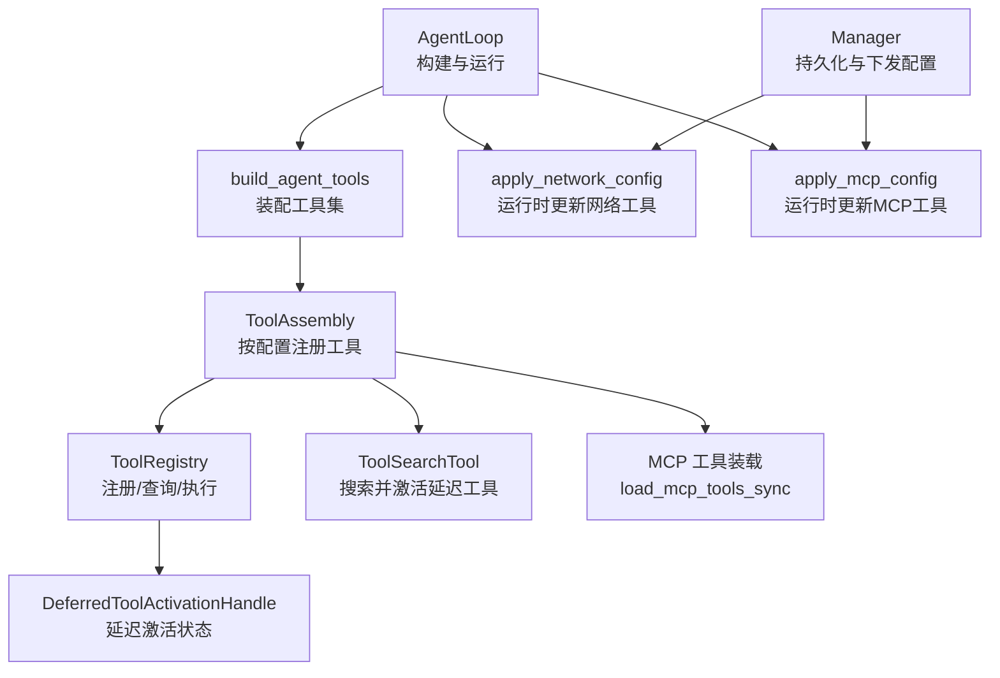
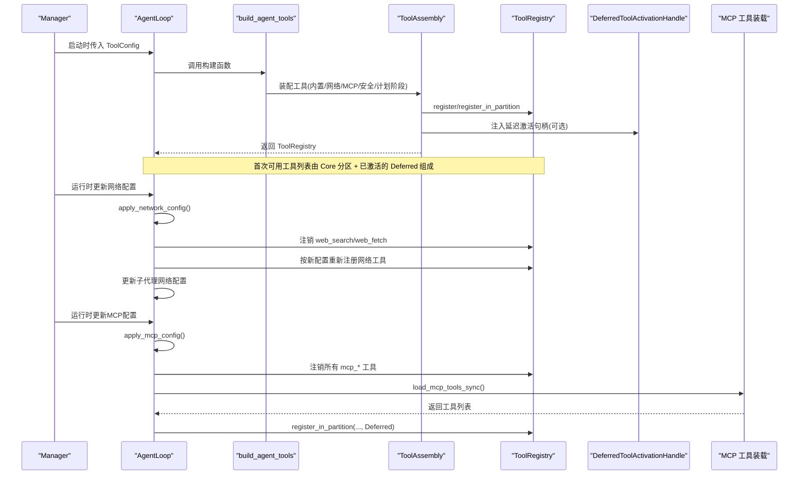
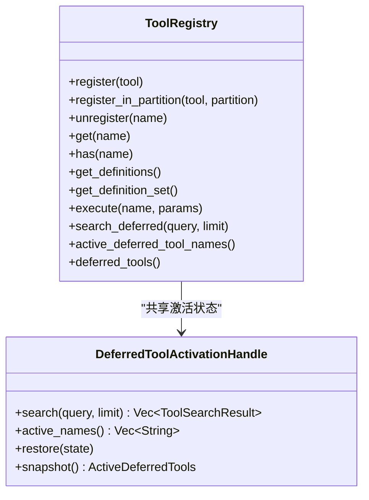
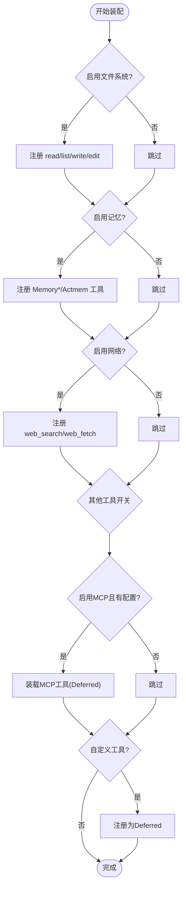
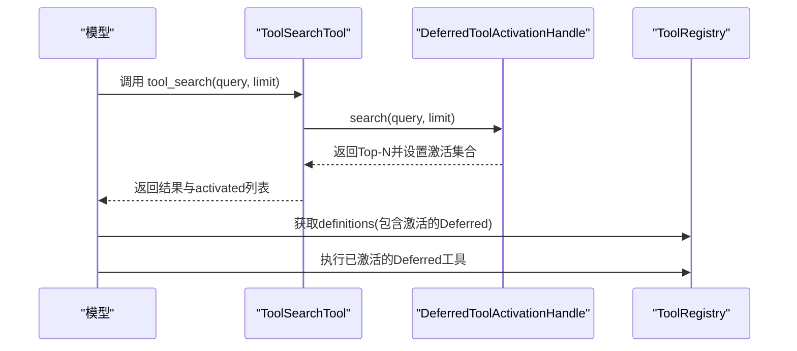
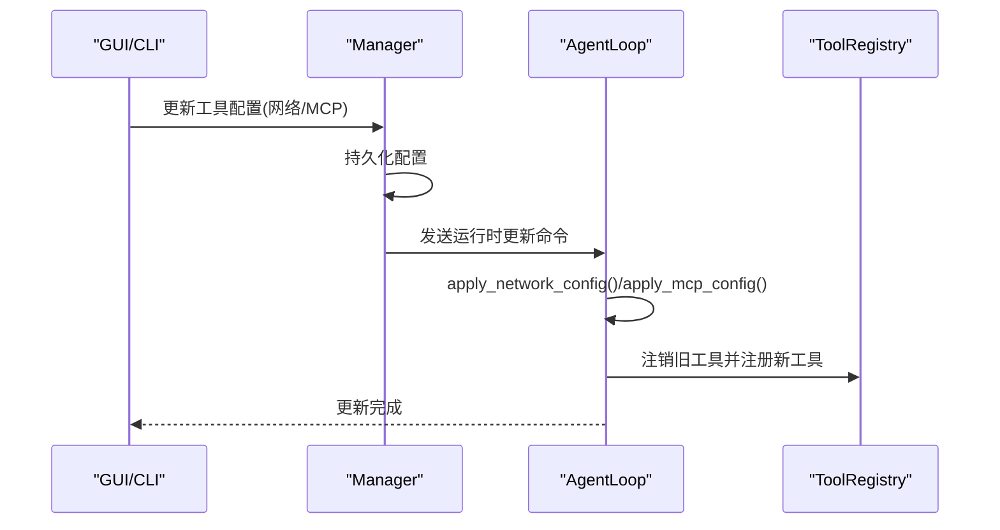
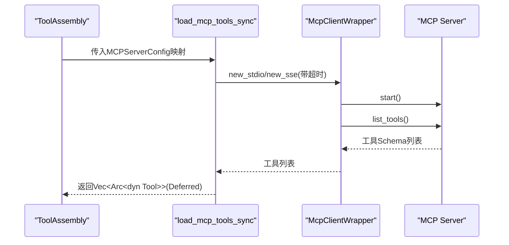
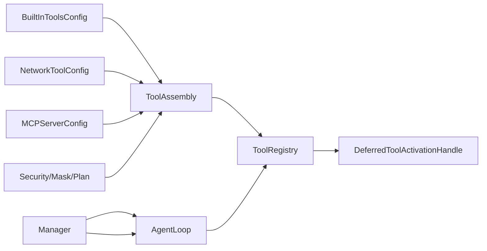

# 工具注册与发现

<cite>
**本文引用的文件**
- [agent-diva-tooling/src/registry.rs](file://agent-diva-tooling/src/registry.rs)
- [agent-diva-tools/src/tool_discovery.rs](file://agent-diva-tools/src/tool_discovery.rs)
- [agent-diva-agent/src/tool_assembly.rs](file://agent-diva-agent/src/tool_assembly.rs)
- [agent-diva-agent/src/agent_loop.rs](file://agent-diva-agent/src/agent_loop.rs)
- [agent-diva-agent/src/loop_tools.rs](file://agent-diva-agent/src/agent_loop/loop_tools.rs)
- [agent-diva-agent/src/tool_config/builtin.rs](file://agent-diva-agent/src/tool_config/builtin.rs)
- [agent-diva-agent/src/tool_config/network.rs](file://agent-diva-agent/src/tool_config/network.rs)
- [agent-diva-tools/src/mcp_sdk.rs](file://agent-diva-tools/src/mcp_sdk.rs)
- [agent-diva-manager/src/manager/runtime_control.rs](file://agent-diva-manager/src/manager/runtime_control.rs)
- [agent-diva-manager/src/manager.rs](file://agent-diva-manager/src/manager.rs)
- [agent-diva-manager/src/mcp_service.rs](file://agent-diva-manager/src/mcp_service.rs)
</cite>

## 目录
1. [简介](#简介)
2. [项目结构](#项目结构)
3. [核心组件](#核心组件)
4. [架构总览](#架构总览)
5. [详细组件分析](#详细组件分析)
6. [依赖关系分析](#依赖关系分析)
7. [性能考量](#性能考量)
8. [故障排查指南](#故障排查指南)
9. [结论](#结论)
10. [附录：示例与最佳实践](#附录示例与最佳实践)

## 简介
本文件系统性阐述 Agent Diva 的工具注册与发现机制，重点包括：
- ToolRegistry 的工作原理：动态注册、发现、生命周期管理、分区与延迟激活。
- 默认工具的注册流程：文件系统、记忆、网络等内置工具的初始化路径。
- 运行时配置更新：网络配置与 MCP 服务器配置的动态应用。
- 工具分区与延迟加载策略：Core 与 Deferred 分区的语义、搜索激活与可见性控制。
- 自定义工具注册与参数配置方法。
- 关键交互时序图，覆盖从构建到运行时更新的完整链路。

## 项目结构
围绕工具注册与发现的关键模块分布如下：
- 工具注册与执行核心：agent-diva-tooling（ToolRegistry、分区、激活状态）
- 工具装配器：agent-diva-agent（ToolAssembly，按配置组装工具集）
- 工具发现与延迟激活：agent-diva-tools（tool_search 工具）
- 运行时装配入口：agent-diva-agent（build_agent_tools）
- 运行时配置更新：agent-diva-agent（apply_network_config / apply_mcp_config）
- MCP 集成：agent-diva-tools（MCP 客户端封装与工具装载）
- 管理器侧配置持久化与下发：agent-diva-manager（runtime_control、mcp_service）

图表来源
- [agent-diva-agent/src/agent_loop.rs:264-299](file://agent-diva-agent/src/agent_loop.rs#L264-L299)
- [agent-diva-agent/src/tool_assembly.rs:255-616](file://agent-diva-agent/src/tool_assembly.rs#L255-L616)
- [agent-diva-tooling/src/registry.rs:362-717](file://agent-diva-tooling/src/registry.rs#L362-L717)
- [agent-diva-tools/src/tool_discovery.rs:1-59](file://agent-diva-tools/src/tool_discovery.rs#L1-L59)
- [agent-diva-tools/src/mcp_sdk.rs:560-611](file://agent-diva-tools/src/mcp_sdk.rs#L560-L611)
- [agent-diva-agent/src/loop_tools.rs:10-70](file://agent-diva-agent/src/loop_tools.rs#L10-L70)
- [agent-diva-manager/src/manager/runtime_control.rs:330-356](file://agent-diva-manager/src/manager/runtime_control.rs#L330-L356)

章节来源
- [agent-diva-agent/src/agent_loop.rs:264-299](file://agent-diva-agent/src/agent_loop.rs#L264-L299)
- [agent-diva-agent/src/tool_assembly.rs:255-616](file://agent-diva-agent/src/tool_assembly.rs#L255-L616)
- [agent-diva-tooling/src/registry.rs:362-717](file://agent-diva-tooling/src/registry.rs#L362-L717)
- [agent-diva-tools/src/tool_discovery.rs:1-59](file://agent-diva-tools/src/tool_discovery.rs#L1-L59)
- [agent-diva-tools/src/mcp_sdk.rs:560-611](file://agent-diva-tools/src/mcp_sdk.rs#L560-L611)
- [agent-diva-agent/src/loop_tools.rs:10-70](file://agent-diva-agent/src/loop_tools.rs#L10-L70)
- [agent-diva-manager/src/manager/runtime_control.rs:330-356](file://agent-diva-manager/src/manager/runtime_control.rs#L330-L356)

## 核心组件
- ToolRegistry：统一注册、查询、执行工具；维护 Core/Deferred 分区；提供全局超时与审计；支持任务级延迟激活状态。
- DeferredToolActivationHandle：维护当前轮次可激活的延迟工具集合（最多固定上限），基于名称/描述/Schema 关键词评分排序。
- ToolAssembly：根据内置开关、网络配置、MCP 配置、安全策略、计划阶段等条件，将具体工具实例装配进 Registry。
- ToolSearchTool：暴露“搜索并激活”能力，供模型在对话中按需发现延迟工具。
- MCP 工具装载：通过 rust-mcp-sdk 连接外部 MCP 服务，发现其工具并包装为 Tool 对象，以 mcp_<server>_<tool> 命名注册。
- Manager 配置下发：持久化工具配置（网络/MCP），并通过运行时通道通知 Agent 应用变更。

章节来源
- [agent-diva-tooling/src/registry.rs:15-113](file://agent-diva-tooling/src/registry.rs#L15-L113)
- [agent-diva-tooling/src/registry.rs:362-717](file://agent-diva-tooling/src/registry.rs#L362-L717)
- [agent-diva-tools/src/tool_discovery.rs:1-59](file://agent-diva-tools/src/tool_discovery.rs#L1-L59)
- [agent-diva-agent/src/tool_assembly.rs:255-616](file://agent-diva-agent/src/tool_assembly.rs#L255-L616)
- [agent-diva-tools/src/mcp_sdk.rs:323-442](file://agent-diva-tools/src/mcp_sdk.rs#L323-L442)
- [agent-diva-manager/src/manager/runtime_control.rs:330-356](file://agent-diva-manager/src/manager/runtime_control.rs#L330-L356)

## 架构总览
下图展示从启动到运行时更新的端到端流程：

图表来源
- [agent-diva-agent/src/agent_loop.rs:264-299](file://agent-diva-agent/src/agent_loop.rs#L264-L299)
- [agent-diva-agent/src/tool_assembly.rs:255-616](file://agent-diva-agent/src/tool_assembly.rs#L255-L616)
- [agent-diva-agent/src/loop_tools.rs:28-70](file://agent-diva-agent/src/loop_tools.rs#L28-L70)
- [agent-diva-tools/src/mcp_sdk.rs:560-611](file://agent-diva-tools/src/mcp_sdk.rs#L560-L611)
- [agent-diva-manager/src/manager/runtime_control.rs:330-356](file://agent-diva-manager/src/manager/runtime_control.rs#L330-L356)

## 详细组件分析

### ToolRegistry：注册、发现与生命周期
- 注册与分区
  - register：默认注册到 Core 分区，始终可见且缓存友好。
  - register_in_partition：可将工具注册为 Deferred，仅在被激活后参与 schema 输出与执行。
- 发现与激活
  - search_deferred/search_catalog：基于名称、描述、Schema 关键词评分，返回 Top-N 并替换当前任务的激活集合（有上限）。
  - active_deferred_tool_names：过滤出当前仍被授权且激活的 Deferred 工具名。
  - deferred_tools：返回 Deferred 工具句柄，便于同轮重建保留自定义工具。
- 执行与生命周期
  - execute/execute_structured：查找工具、校验参数、执行、超时控制、审计事件、结果清洗。
  - 对未找到或不可用工具进行明确错误分类（not_found/unavailable/not_active）。
- 定义集生成
  - get_definition_set：按“Core 优先 + 激活的 Deferred”顺序生成稳定 schema 前缀，保证缓存稳定性。

图表来源
- [agent-diva-tooling/src/registry.rs:362-717](file://agent-diva-tooling/src/registry.rs#L362-L717)
- [agent-diva-tooling/src/registry.rs:103-232](file://agent-diva-tooling/src/registry.rs#L103-L232)

章节来源
- [agent-diva-tooling/src/registry.rs:15-113](file://agent-diva-tooling/src/registry.rs#L15-L113)
- [agent-diva-tooling/src/registry.rs:362-717](file://agent-diva-tooling/src/registry.rs#L362-L717)

### 工具装配器 ToolAssembly：默认工具注册流程
- 文件系统工具：read_file/list_dir/write_file/edit_file，依据安全策略与工作区限制装配。
- 记忆工具：MemorySearch/MemoryGet/Actmem 等读写与整理工具，部分写入类工具受只读模式与计划阶段限制。
- 网络工具：web_search/web_fetch，受内置开关与网络运行时配置双重控制。
- 其他：shell/exec、ask_user、spawn、cron、update_plan、attachment、工作记忆（SessionCheckpoint）等。
- MCP 工具：当启用且存在配置时，装载为 Deferred 工具。
- 自定义工具：作为 Deferred 工具注册，需通过 tool_search 激活。
- 安全与策略：读取掩码（mask）、计划阶段（plan_phase）、执行会话（execution_session_id）等会裁剪可用工具集。

图表来源
- [agent-diva-agent/src/tool_assembly.rs:255-616](file://agent-diva-agent/src/tool_assembly.rs#L255-L616)

章节来源
- [agent-diva-agent/src/tool_assembly.rs:255-616](file://agent-diva-agent/src/tool_assembly.rs#L255-L616)

### 工具发现与延迟加载：ToolSearchTool
- 作用：允许模型在对话中搜索“授权但隐藏”的 Deferred 工具，并按评分激活下一轮可用的工具集合。
- 输入：query（关键词）、limit（1-20，默认8）。
- 输出：搜索结果与当前激活的工具名列表。
- 效果：激活后，这些工具会在下一次 get_definition_set 中可见并可执行。

图表来源
- [agent-diva-tools/src/tool_discovery.rs:1-59](file://agent-diva-tools/src/tool_discovery.rs#L1-L59)
- [agent-diva-tooling/src/registry.rs:154-197](file://agent-diva-tooling/src/registry.rs#L154-L197)
- [agent-diva-tooling/src/registry.rs:502-532](file://agent-diva-tooling/src/registry.rs#L502-L532)

章节来源
- [agent-diva-tools/src/tool_discovery.rs:1-59](file://agent-diva-tools/src/tool_discovery.rs#L1-L59)
- [agent-diva-tooling/src/registry.rs:154-197](file://agent-diva-tooling/src/registry.rs#L154-L197)
- [agent-diva-tooling/src/registry.rs:502-532](file://agent-diva-tooling/src/registry.rs#L502-L532)

### 运行时配置更新：网络与 MCP
- 网络配置更新
  - 卸载旧的网络工具（web_search/web_fetch）。
  - 根据新的 NetworkToolConfig 重新注册对应工具。
  - 同步更新子代理的网络配置。
- MCP 配置更新
  - 卸载所有 mcp_* 工具。
  - 若启用 MCP 且有配置，则重新装载 MCP 工具并以 Deferred 方式注册。
  - 同步更新子代理的 MCP 服务器列表。

图表来源
- [agent-diva-agent/src/loop_tools.rs:28-70](file://agent-diva-agent/src/loop_tools.rs#L28-L70)
- [agent-diva-manager/src/manager/runtime_control.rs:330-356](file://agent-diva-manager/src/manager/runtime_control.rs#L330-L356)
- [agent-diva-manager/src/manager.rs:123-146](file://agent-diva-manager/src/manager.rs#L123-L146)

章节来源
- [agent-diva-agent/src/loop_tools.rs:28-70](file://agent-diva-agent/src/loop_tools.rs#L28-L70)
- [agent-diva-manager/src/manager/runtime_control.rs:330-356](file://agent-diva-manager/src/manager/runtime_control.rs#L330-L356)
- [agent-diva-manager/src/manager.rs:123-146](file://agent-diva-manager/src/manager.rs#L123-L146)

### MCP 工具装载与生命周期
- 连接与探测：支持 stdio 与 SSE 两种传输；带超时保护，避免阻塞。
- 工具发现：list_tools 获取远程工具 Schema，并进行字符串清洗。
- 工具包装：每个远程工具包装为 McpSdkTool，命名规则为 mcp_<server>_<tool>，描述标注来源。
- 自动重连：调用时若无客户端，尝试指数退避重连（最多5次）。
- 超时控制：工具调用与启动均受超时约束。

图表来源
- [agent-diva-tools/src/mcp_sdk.rs:101-207](file://agent-diva-tools/src/mcp_sdk.rs#L101-L207)
- [agent-diva-tools/src/mcp_sdk.rs:209-262](file://agent-diva-tools/src/mcp_sdk.rs#L209-L262)
- [agent-diva-tools/src/mcp_sdk.rs:560-611](file://agent-diva-tools/src/mcp_sdk.rs#L560-L611)

章节来源
- [agent-diva-tools/src/mcp_sdk.rs:101-207](file://agent-diva-tools/src/mcp_sdk.rs#L101-L207)
- [agent-diva-tools/src/mcp_sdk.rs:209-262](file://agent-diva-tools/src/mcp_sdk.rs#L209-L262)
- [agent-diva-tools/src/mcp_sdk.rs:560-611](file://agent-diva-tools/src/mcp_sdk.rs#L560-L611)

### 工具分区与延迟加载策略
- Core 分区：始终可见，用于稳定缓存的前缀，如基础文件操作、常用网络工具等。
- Deferred 分区：默认隐藏，通过 tool_search 激活后进入可见集合；适用于 MCP 工具、扩展工具、敏感或低频工具。
- 激活上限：单次搜索最多激活固定数量工具，防止 schema 膨胀。
- 同轮重建：支持恢复激活状态，确保同一轮内多次重建不丢失用户选择。

章节来源
- [agent-diva-tooling/src/registry.rs:23-43](file://agent-diva-tooling/src/registry.rs#L23-L43)
- [agent-diva-tooling/src/registry.rs:154-197](file://agent-diva-tooling/src/registry.rs#L154-L197)
- [agent-diva-agent/src/tool_assembly.rs:526-534](file://agent-diva-agent/src/tool_assembly.rs#L526-L534)

## 依赖关系分析
- ToolAssembly 依赖：
  - BuiltInToolsConfig：控制各内置工具是否启用。
  - NetworkToolConfig：控制网络工具行为（提供商、API Key、最大结果数等）。
  - MCPServerConfig：MCP 服务器配置（command/url/env/tool_timeout）。
  - 安全与策略：SecurityPolicy、MaskConfig、PlanPhase 等影响工具可用性。
- ToolRegistry 依赖：
  - DeferredToolActivationHandle：跨工具共享的延迟激活状态。
  - 审计与安全：输出清洗、审计事件记录。
- Manager 依赖：
  - 配置加载/保存：持久化工具配置。
  - 运行时通道：向 AgentLoop 下发更新命令。

图表来源
- [agent-diva-agent/src/tool_assembly.rs:42-68](file://agent-diva-agent/src/tool_assembly.rs#L42-L68)
- [agent-diva-agent/src/tool_config/builtin.rs:1-46](file://agent-diva-agent/src/tool_config/builtin.rs#L1-L46)
- [agent-diva-agent/src/tool_config/network.rs:1-78](file://agent-diva-agent/src/tool_config/network.rs#L1-L78)
- [agent-diva-tooling/src/registry.rs:362-717](file://agent-diva-tooling/src/registry.rs#L362-L717)
- [agent-diva-manager/src/manager/runtime_control.rs:330-356](file://agent-diva-manager/src/manager/runtime_control.rs#L330-L356)

章节来源
- [agent-diva-agent/src/tool_assembly.rs:42-68](file://agent-diva-agent/src/tool_assembly.rs#L42-L68)
- [agent-diva-agent/src/tool_config/builtin.rs:1-46](file://agent-diva-agent/src/tool_config/builtin.rs#L1-L46)
- [agent-diva-agent/src/tool_config/network.rs:1-78](file://agent-diva-agent/src/tool_config/network.rs#L1-L78)
- [agent-diva-tooling/src/registry.rs:362-717](file://agent-diva-tooling/src/registry.rs#L362-L717)
- [agent-diva-manager/src/manager/runtime_control.rs:330-356](file://agent-diva-manager/src/manager/runtime_control.rs#L330-L356)

## 性能考量
- 缓存友好：Core 分区保持稳定的 schema 前缀，减少模型侧缓存失效。
- 延迟激活：Deferred 工具仅在需要时激活，降低初始 schema 体积。
- 超时控制：工具执行与 MCP 启动/调用均有超时保护，避免长时间阻塞。
- 结果清洗：输出清洗与审计有助于控制响应大小与安全性。
- 搜索限流：单次激活数量有限，避免 schema 爆炸。

[本节为通用指导，无需特定文件引用]

## 故障排查指南
- 工具未找到
  - 现象：执行时报 not_found。
  - 排查：确认工具是否注册成功；检查 mask/计划阶段是否禁用；确认是否在 Core 或已激活的 Deferred 集合中。
- 工具不可用
  - 现象：执行时报 unavailable/not_active。
  - 排查：确认是否为 Deferred 工具且已通过 tool_search 激活；检查激活状态是否被重建清除。
- 网络工具无效
  - 现象：web_search/web_fetch 不可用。
  - 排查：检查内置开关与 NetworkToolConfig 的 enabled/provider/api_key/max_results；确认运行时已调用 apply_network_config。
- MCP 工具失败
  - 现象：mcp_* 工具报错或无法连接。
  - 排查：检查 command/url 配置；查看日志中的 stderr 提示；确认超时设置；必要时触发 apply_mcp_config 重新装载。
- 配置未生效
  - 现象：运行时修改配置后工具未更新。
  - 排查：确认 Manager 已持久化并发送 UpdateNetwork/UpdateMCP 命令；检查 AgentLoop 是否正确接收并应用。

章节来源
- [agent-diva-tooling/src/registry.rs:534-699](file://agent-diva-tooling/src/registry.rs#L534-L699)
- [agent-diva-agent/src/loop_tools.rs:28-70](file://agent-diva-agent/src/loop_tools.rs#L28-L70)
- [agent-diva-tools/src/mcp_sdk.rs:377-442](file://agent-diva-tools/src/mcp_sdk.rs#L377-L442)
- [agent-diva-manager/src/manager/runtime_control.rs:330-356](file://agent-diva-manager/src/manager/runtime_control.rs#L330-L356)

## 结论
该工具注册与发现机制通过“Core/Deferred 分区 + 延迟激活”的设计，在保证初始 schema 稳定性的同时，实现了按需扩展与运行时动态更新。ToolAssembly 提供了强大的装配能力，结合 Manager 的配置持久化与下发，使得网络与 MCP 工具可在运行时无缝切换。ToolRegistry 的执行路径具备完善的超时、审计与错误处理，保障了系统的健壮性与可观测性。

[本节为总结性内容，无需特定文件引用]

## 附录：示例与最佳实践

- 注册自定义工具
  - 步骤：实现 Tool trait（name/description/parameters/execute），通过 ToolAssembly.with_tool 添加，并在 build 后使用 ToolRegistry.register/register_in_partition 注册。
  - 建议：将自定义工具注册为 Deferred，配合 tool_search 激活，避免污染初始 schema。
  - 参考路径
    - [agent-diva-agent/src/tool_assembly.rs:162-170](file://agent-diva-agent/src/tool_assembly.rs#L162-L170)
    - [agent-diva-tooling/src/registry.rs:452-476](file://agent-diva-tooling/src/registry.rs#L452-L476)

- 配置网络工具参数
  - 步骤：构造 NetworkToolConfig（provider/api_key/max_results/enabled），通过 ToolAssembly.with_network_config 传入；运行时通过 apply_network_config 动态更新。
  - 注意：不同 provider 的 max_results 会被规范化至上限。
  - 参考路径
    - [agent-diva-agent/src/tool_config/network.rs:1-78](file://agent-diva-agent/src/tool_config/network.rs#L1-L78)
    - [agent-diva-agent/src/loop_tools.rs:28-47](file://agent-diva-agent/src/loop_tools.rs#L28-L47)

- 配置 MCP 服务器
  - 步骤：在配置中添加 MCPServerConfig（command/url/env/tool_timeout），启用 builtin.mcp；运行时通过 apply_mcp_config 重新装载。
  - 注意：MCP 工具以 Deferred 形式注册，需通过 tool_search 激活。
  - 参考路径
    - [agent-diva-agent/src/tool_assembly.rs:526-534](file://agent-diva-agent/src/tool_assembly.rs#L526-L534)
    - [agent-diva-agent/src/loop_tools.rs:49-70](file://agent-diva-agent/src/loop_tools.rs#L49-L70)
    - [agent-diva-tools/src/mcp_sdk.rs:560-611](file://agent-diva-tools/src/mcp_sdk.rs#L560-L611)

- 使用 tool_search 激活延迟工具
  - 步骤：调用 tool_search(query, limit)，返回结果中包含 activated 列表；随后再次获取 definitions 即可看到新激活的工具。
  - 参考路径
    - [agent-diva-tools/src/tool_discovery.rs:1-59](file://agent-diva-tools/src/tool_discovery.rs#L1-L59)
    - [agent-diva-tooling/src/registry.rs:154-197](file://agent-diva-tooling/src/registry.rs#L154-L197)

- 安全与策略
  - 只读模式与计划阶段会裁剪写操作工具；mask 的 tool_limits 可进一步精确控制可用工具集。
  - 参考路径
    - [agent-diva-agent/src/tool_assembly.rs:580-613](file://agent-diva-agent/src/tool_assembly.rs#L580-L613)

章节来源
- [agent-diva-agent/src/tool_assembly.rs:162-170](file://agent-diva-agent/src/tool_assembly.rs#L162-L170)
- [agent-diva-tooling/src/registry.rs:452-476](file://agent-diva-tooling/src/registry.rs#L452-L476)
- [agent-diva-agent/src/tool_config/network.rs:1-78](file://agent-diva-agent/src/tool_config/network.rs#L1-L78)
- [agent-diva-agent/src/loop_tools.rs:28-47](file://agent-diva-agent/src/loop_tools.rs#L28-L47)
- [agent-diva-agent/src/tool_assembly.rs:526-534](file://agent-diva-agent/src/tool_assembly.rs#L526-L534)
- [agent-diva-agent/src/loop_tools.rs:49-70](file://agent-diva-agent/src/loop_tools.rs#L49-L70)
- [agent-diva-tools/src/mcp_sdk.rs:560-611](file://agent-diva-tools/src/mcp_sdk.rs#L560-L611)
- [agent-diva-tools/src/tool_discovery.rs:1-59](file://agent-diva-tools/src/tool_discovery.rs#L1-L59)
- [agent-diva-tooling/src/registry.rs:154-197](file://agent-diva-tooling/src/registry.rs#L154-L197)
- [agent-diva-agent/src/tool_assembly.rs:580-613](file://agent-diva-agent/src/tool_assembly.rs#L580-L613)