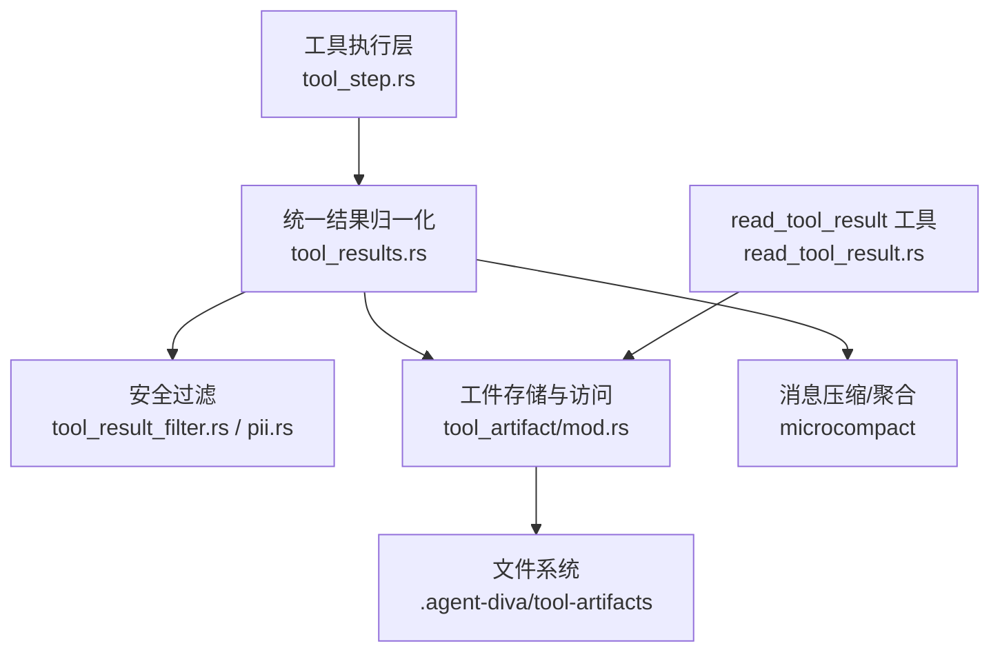
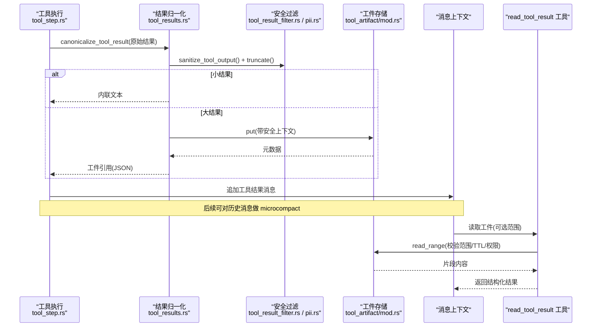
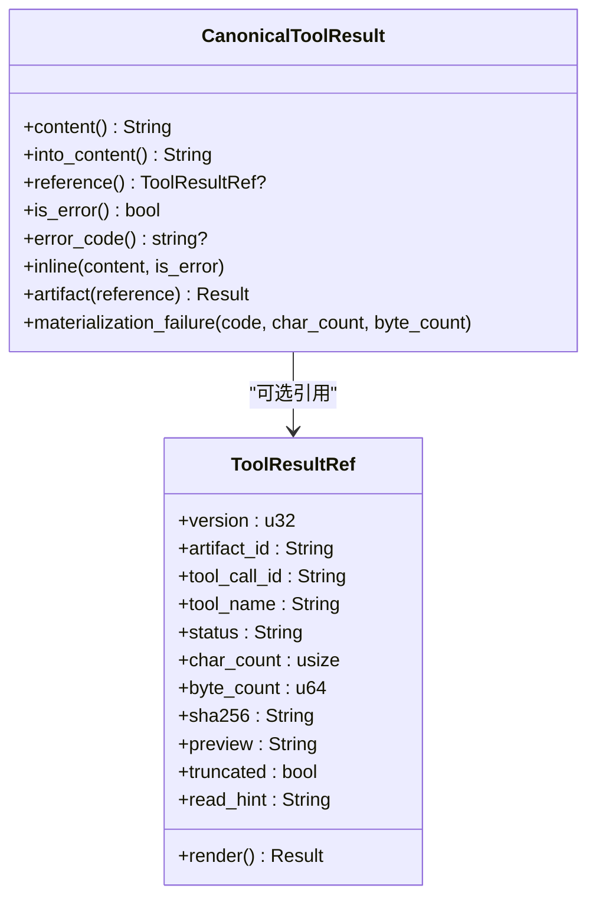
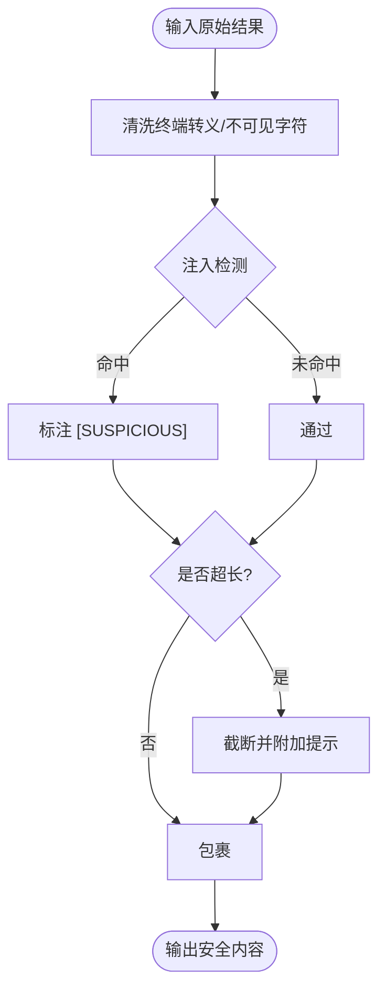
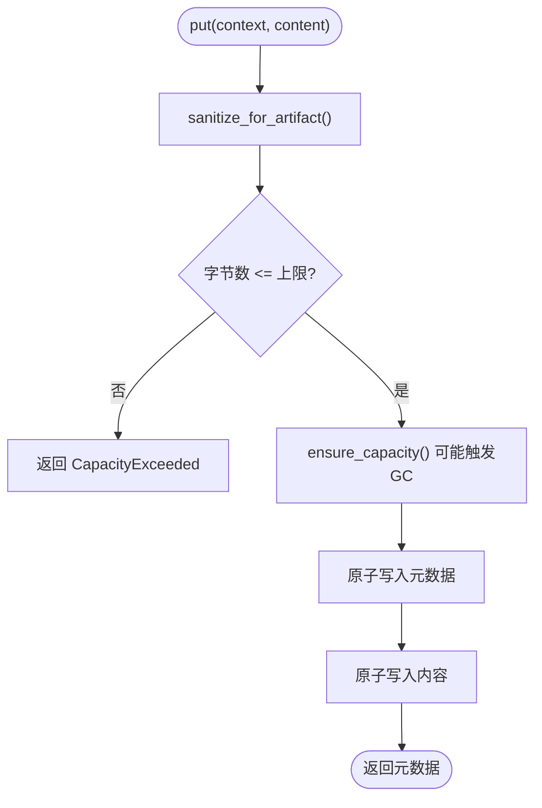
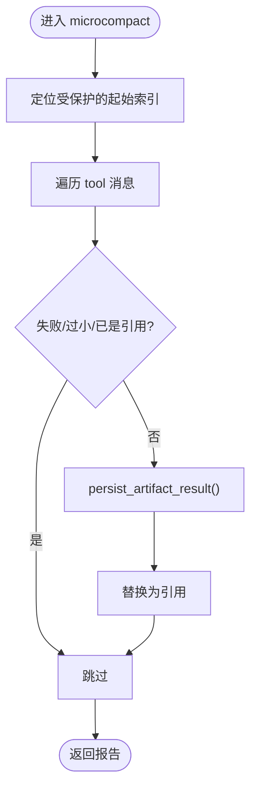
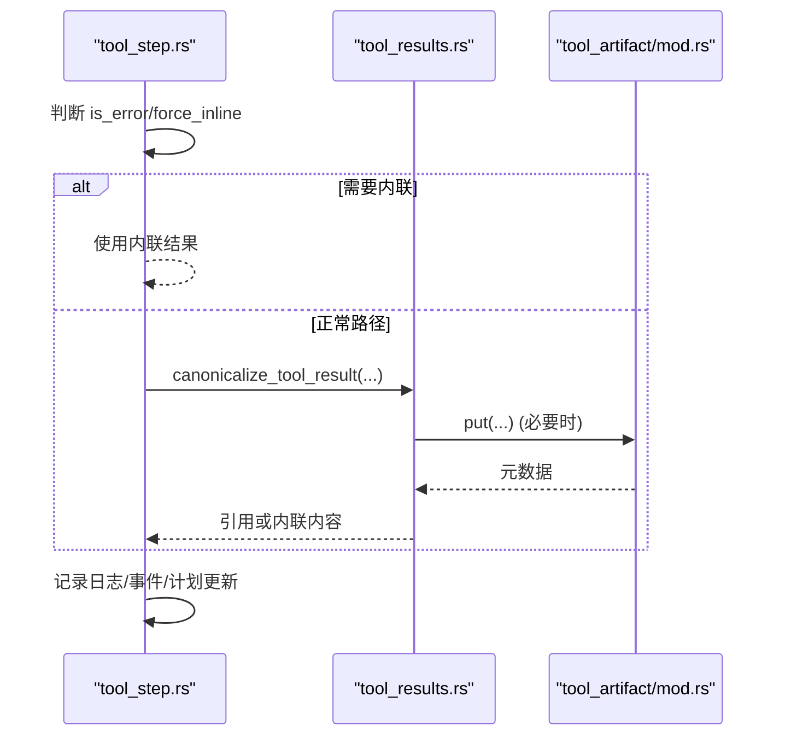
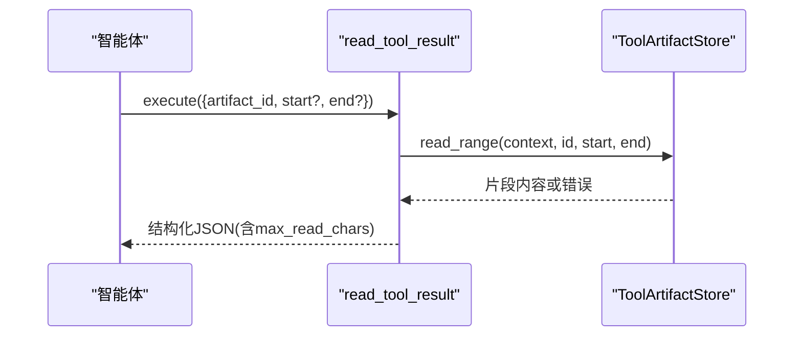
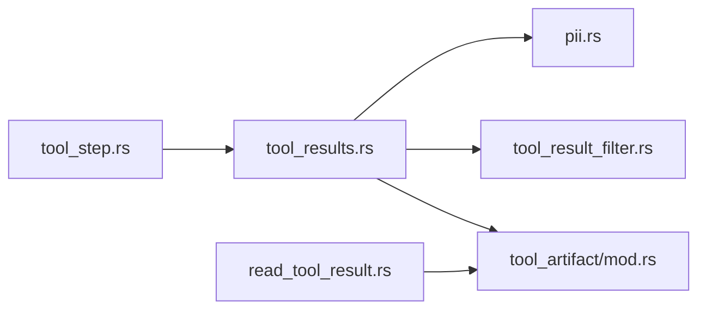

# 工具结果处理

<cite>
**本文引用的文件**
- [agent-diva-agent/src/tool_results.rs](file://agent-diva-agent/src/tool_results.rs)
- [agent-diva-core/src/tool_artifact/mod.rs](file://agent-diva-core/src/tool_artifact/mod.rs)
- [agent-diva-core/src/security/tool_result_filter.rs](file://agent-diva-core/src/security/tool_result_filter.rs)
- [agent-diva-core/src/security/pii.rs](file://agent-diva-core/src/security/pii.rs)
- [agent-diva-tools/src/read_tool_result.rs](file://agent-diva-tools/src/read_tool_result.rs)
- [agent-diva-agent/src/agent_loop/turn/tool_step.rs](file://agent-diva-agent/src/agent_loop/turn/tool_step.rs)
</cite>

## 目录
1. [简介](#简介)
2. [项目结构](#项目结构)
3. [核心组件](#核心组件)
4. [架构总览](#架构总览)
5. [详细组件分析](#详细组件分析)
6. [依赖关系分析](#依赖关系分析)
7. [性能考量](#性能考量)
8. [故障排查指南](#故障排查指南)
9. [结论](#结论)
10. [附录](#附录)

## 简介
本文件系统性说明“工具结果处理”的统一机制，覆盖：
- 成功结果、错误处理与数据格式化的统一抽象
- 结果过滤与清理（注入检测、PII 处理、大小限制）
- 结果持久化策略（会话级工件存储、工作区容量控制、TTL 清理）
- 结果聚合与转换（多工具结果压缩、结构化引用、按需读取）
- 完整流程图与安全检查点
- 具体示例与最佳实践

## 项目结构
围绕工具结果处理的关键模块分布如下：
- agent-diva-agent：统一结果归一化、消息内压缩、与执行流程集成
- agent-diva-core：安全过滤（注入、PII）、工件存储与访问控制
- agent-diva-tools：对外暴露的“读取工件”工具，供智能体按需拉取大结果

**图表来源**
- [agent-diva-agent/src/agent_loop/turn/tool_step.rs:320-370](file://agent-diva-agent/src/agent_loop/turn/tool_step.rs#L320-L370)
- [agent-diva-agent/src/tool_results.rs:20-148](file://agent-diva-agent/src/tool_results.rs#L20-L148)
- [agent-diva-core/src/security/tool_result_filter.rs:48-132](file://agent-diva-core/src/security/tool_result_filter.rs#L48-L132)
- [agent-diva-core/src/security/pii.rs:302-627](file://agent-diva-core/src/security/pii.rs#L302-L627)
- [agent-diva-core/src/tool_artifact/mod.rs:219-428](file://agent-diva-core/src/tool_artifact/mod.rs#L219-L428)
- [agent-diva-tools/src/read_tool_result.rs:28-74](file://agent-diva-tools/src/read_tool_result.rs#L28-L74)

**章节来源**
- [agent-diva-agent/src/agent_loop/turn/tool_step.rs:320-370](file://agent-diva-agent/src/agent_loop/turn/tool_step.rs#L320-L370)
- [agent-diva-agent/src/tool_results.rs:20-148](file://agent-diva-agent/src/tool_results.rs#L20-L148)
- [agent-diva-core/src/tool_artifact/mod.rs:219-428](file://agent-diva-core/src/tool_artifact/mod.rs#L219-L428)
- [agent-diva-core/src/security/tool_result_filter.rs:48-132](file://agent-diva-core/src/security/tool_result_filter.rs#L48-L132)
- [agent-diva-core/src/security/pii.rs:302-627](file://agent-diva-core/src/security/pii.rs#L302-L627)
- [agent-diva-tools/src/read_tool_result.rs:28-74](file://agent-diva-tools/src/read_tool_result.rs#L28-L74)

## 核心组件
- CanonicalToolResult：统一的结果表示，支持内联内容或外部工件引用，并显式表达失败状态。
- ToolArtifactStore：会话与工作区隔离的工件存储，提供原子写入、范围读取、容量与 TTL 管理。
- tool_result_filter：注入检测、不安全字符清洗、最大长度截断、不信任包裹。
- pii：可配置的 PII 检测与脱敏（默认关闭，避免误伤运行时标识）。
- microcompact：对历史工具消息进行“微压缩”，将大结果转为工件引用，保护当前轮次不被压缩。
- read_tool_result：对外工具，按受限范围读取工件内容。

**章节来源**
- [agent-diva-core/src/tool_artifact/mod.rs:25-136](file://agent-diva-core/src/tool_artifact/mod.rs#L25-L136)
- [agent-diva-core/src/tool_artifact/mod.rs:219-428](file://agent-diva-core/src/tool_artifact/mod.rs#L219-L428)
- [agent-diva-core/src/security/tool_result_filter.rs:48-132](file://agent-diva-core/src/security/tool_result_filter.rs#L48-L132)
- [agent-diva-core/src/security/pii.rs:302-627](file://agent-diva-core/src/security/pii.rs#L302-L627)
- [agent-diva-agent/src/tool_results.rs:20-148](file://agent-diva-agent/src/tool_results.rs#L20-L148)
- [agent-diva-tools/src/read_tool_result.rs:28-74](file://agent-diva-tools/src/read_tool_result.rs#L28-L74)

## 架构总览
工具结果从执行到呈现的完整路径如下：

**图表来源**
- [agent-diva-agent/src/agent_loop/turn/tool_step.rs:320-370](file://agent-diva-agent/src/agent_loop/turn/tool_step.rs#L320-L370)
- [agent-diva-agent/src/tool_results.rs:20-148](file://agent-diva-agent/src/tool_results.rs#L20-L148)
- [agent-diva-core/src/security/tool_result_filter.rs:48-132](file://agent-diva-core/src/security/tool_result_filter.rs#L48-L132)
- [agent-diva-core/src/tool_artifact/mod.rs:219-428](file://agent-diva-core/src/tool_artifact/mod.rs#L219-L428)
- [agent-diva-tools/src/read_tool_result.rs:28-74](file://agent-diva-tools/src/read_tool_result.rs#L28-L74)

## 详细组件分析

### 统一结果模型：CanonicalToolResult
- 设计目标：为模型与对话转录提供单一、稳定的结果形态；小结果直接内联，大结果以工件引用替代，失败时明确标记错误码且不返回部分输出。
- 关键行为：
  - 内联阈值：小于等于 INLINE_THRESHOLD_CHARS 的直接内联。
  - 工件化：超过阈值则持久化并生成 ToolResultRef，包含预览、哈希、截断标志等。
  - 失败建模：materialization_failure 会返回标准 JSON 错误对象，且 is_error=true。

**图表来源**
- [agent-diva-core/src/tool_artifact/mod.rs:25-136](file://agent-diva-core/src/tool_artifact/mod.rs#L25-L136)

**章节来源**
- [agent-diva-core/src/tool_artifact/mod.rs:25-136](file://agent-diva-core/src/tool_artifact/mod.rs#L25-L136)

### 安全过滤与清理
- 注入检测与清洗：normalize_terminal_output 去除 ANSI 转义与不可打印字符；detect_tool_output_injection 识别注入模式并标注 [SUSPICIOUS]。
- 长度限制：truncate_tool_result 在超过 MAX_TOOL_RESULT_CHARS 时截断并附加提示。
- 不信任包裹：wrap_untrusted 用 <untrusted>...</untrusted> 包裹，提醒 LLM 该来源不可信。
- PII 处理：pii::redact_pii 支持多种类别（邮箱、电话、身份证、信用卡、API Key、IP、护照、银行卡），默认关闭以避免误伤运行时 ID；可按配置启用并按严重级别决定替换或拒绝。

**图表来源**
- [agent-diva-core/src/security/tool_result_filter.rs:68-132](file://agent-diva-core/src/security/tool_result_filter.rs#L68-L132)
- [agent-diva-core/src/security/pii.rs:302-627](file://agent-diva-core/src/security/pii.rs#L302-L627)

**章节来源**
- [agent-diva-core/src/security/tool_result_filter.rs:68-132](file://agent-diva-core/src/security/tool_result_filter.rs#L68-L132)
- [agent-diva-core/src/security/pii.rs:302-627](file://agent-diva-core/src/security/pii.rs#L302-L627)

### 结果持久化策略
- 存储位置：工作区下的 .agent-diva/tool-artifacts，按工作区 ID 与会话摘要分目录组织。
- 原子写入：临时文件 + rename，保证一致性。
- 容量控制：单工件上限、会话上限、工作区上限；超出时按最近最少访问策略清理。
- 访问控制：读时必须匹配 workspace_id 与 session_id；跨会话访问被拒绝。
- 完整性校验：SHA256 校验内容与元数据版本；损坏即报错。
- TTL 清理：超过 ARTIFACT_TTL_DAYS 未访问的工件会被 GC 删除。

**图表来源**
- [agent-diva-core/src/tool_artifact/mod.rs:229-274](file://agent-diva-core/src/tool_artifact/mod.rs#L229-L274)
- [agent-diva-core/src/tool_artifact/mod.rs:367-407](file://agent-diva-core/src/tool_artifact/mod.rs#L367-L407)

**章节来源**
- [agent-diva-core/src/tool_artifact/mod.rs:229-428](file://agent-diva-core/src/tool_artifact/mod.rs#L229-L428)

### 结果聚合与转换（微压缩）
- 目标：在不影响当前轮次的前提下，将历史中的大工具结果转换为工件引用，减少上下文占用。
- 规则：
  - 仅处理 assistant 最后一条含 tool_calls 之前的 tool 消息。
  - 跳过失败结果、已小于阈值的文本、已是工件引用的内容。
  - 将符合条件的结果持久化为工件，并将消息内容替换为引用。
- 报告：返回 compacted 列表与 failures 列表，便于观测。

**图表来源**
- [agent-diva-agent/src/tool_results.rs:91-148](file://agent-diva-agent/src/tool_results.rs#L91-L148)

**章节来源**
- [agent-diva-agent/src/tool_results.rs:91-148](file://agent-diva-agent/src/tool_results.rs#L91-L148)

### 执行流程集成
- 工具执行完成后，根据是否为错误或强制内联场景选择内联或调用 canonicalize_tool_result。
- 若产生工件引用，记录 artifact_id、char_count、sha256 等日志。
- 若出现 materialization failure，记录 error_code 并视为错误。
- 将结果加入消息上下文，并触发事件与计划更新。

**图表来源**
- [agent-diva-agent/src/agent_loop/turn/tool_step.rs:320-370](file://agent-diva-agent/src/agent_loop/turn/tool_step.rs#L320-L370)
- [agent-diva-agent/src/tool_results.rs:20-89](file://agent-diva-agent/src/tool_results.rs#L20-L89)
- [agent-diva-core/src/tool_artifact/mod.rs:229-274](file://agent-diva-core/src/tool_artifact/mod.rs#L229-L274)

**章节来源**
- [agent-diva-agent/src/agent_loop/turn/tool_step.rs:320-370](file://agent-diva-agent/src/agent_loop/turn/tool_step.rs#L320-L370)
- [agent-diva-agent/src/tool_results.rs:20-89](file://agent-diva-agent/src/tool_results.rs#L20-L89)

### 读取工件工具
- 目的：允许智能体以受限范围读取已持久化的工件内容，避免一次性加载过大内容。
- 参数：artifact_id、start、end；范围必须合法且不超过 MAX_READ_CHARS。
- 安全：读前校验 workspace/session 绑定、TTL、完整性；非法访问返回 Forbidden。

**图表来源**
- [agent-diva-tools/src/read_tool_result.rs:28-74](file://agent-diva-tools/src/read_tool_result.rs#L28-L74)
- [agent-diva-core/src/tool_artifact/mod.rs:276-329](file://agent-diva-core/src/tool_artifact/mod.rs#L276-L329)

**章节来源**
- [agent-diva-tools/src/read_tool_result.rs:28-74](file://agent-diva-tools/src/read_tool_result.rs#L28-L74)
- [agent-diva-core/src/tool_artifact/mod.rs:276-329](file://agent-diva-core/src/tool_artifact/mod.rs#L276-L329)

## 依赖关系分析
- tool_results.rs 依赖 core 的安全与工件能力，并在 agent 执行流中作为统一入口。
- tool_artifact/mod.rs 依赖 security 的 sanitize_tool_output 进行入库前清洗。
- read_tool_result 工具依赖 ToolArtifactStore 提供安全的范围读取。
- tool_step.rs 将上述能力串联进工具执行生命周期。

**图表来源**
- [agent-diva-agent/src/tool_results.rs:3-10](file://agent-diva-agent/src/tool_results.rs#L3-L10)
- [agent-diva-core/src/tool_artifact/mod.rs:3-4](file://agent-diva-core/src/tool_artifact/mod.rs#L3-L4)
- [agent-diva-tools/src/read_tool_result.rs:1-3](file://agent-diva-tools/src/read_tool_result.rs#L1-L3)
- [agent-diva-agent/src/agent_loop/turn/tool_step.rs:320-340](file://agent-diva-agent/src/agent_loop/turn/tool_step.rs#L320-L340)

**章节来源**
- [agent-diva-agent/src/tool_results.rs:3-10](file://agent-diva-agent/src/tool_results.rs#L3-L10)
- [agent-diva-core/src/tool_artifact/mod.rs:3-4](file://agent-diva-core/src/tool_artifact/mod.rs#L3-L4)
- [agent-diva-tools/src/read_tool_result.rs:1-3](file://agent-diva-tools/src/read_tool_result.rs#L1-L3)
- [agent-diva-agent/src/agent_loop/turn/tool_step.rs:320-340](file://agent-diva-agent/src/agent_loop/turn/tool_step.rs#L320-L340)

## 性能考量
- 内联 vs 工件：小结果内联减少一次 IO；大结果工件化降低上下文压力。
- 异步持久化：put 在阻塞任务中执行，避免阻塞主循环。
- 范围读取：read_range 限制单次读取字符数，避免内存峰值。
- 容量与 TTL：自动 GC 释放旧工件，防止无限增长。
- 截断与预览：超大结果在引用中提供 head/tail 预览，减少不必要的全量加载。

[本节为通用指导，不直接分析具体文件]

## 故障排查指南
- 工件容量超限：当 put 超过单工件/会话/工作区上限时，返回 capacity_exceeded；检查是否有大量历史工件未被 GC。
- 范围无效：read_range 传入 start > end 或超出边界会返回 range_invalid；确认调用方计算正确。
- 权限拒绝：跨会话或跨工作区访问返回 forbidden；确认 context 绑定正确。
- 完整性破坏：内容哈希不匹配返回 corrupt；检查文件系统是否被篡改。
- 过期：超过 TTL 未访问返回 expired；重新获取或调整 TTL。
- 注入与 PII：若启用 PII 且达到 Error 级别，上层应拒绝；否则按 Warning 替换为 [REDACTED:Kind]。

**章节来源**
- [agent-diva-core/src/tool_artifact/mod.rs:182-212](file://agent-diva-core/src/tool_artifact/mod.rs#L182-L212)
- [agent-diva-core/src/tool_artifact/mod.rs:276-329](file://agent-diva-core/src/tool_artifact/mod.rs#L276-L329)
- [agent-diva-core/src/security/pii.rs:302-627](file://agent-diva-core/src/security/pii.rs#L302-L627)

## 结论
本方案通过 CanonicalToolResult 统一了工具结果的呈现形式，结合安全过滤、工件持久化与范围读取，实现了：
- 安全：注入检测、PII 脱敏、不信任包裹、严格权限与完整性校验
- 稳定：原子写入、容量与 TTL 管理、明确的失败建模
- 高效：内联/工件自适应、历史消息微压缩、范围读取
- 可观测：审计事件与日志、结构化错误码

## 附录

### 典型处理示例
- 小结果：直接内联，无需工件化。
- 大结果：持久化为工件，消息中保留引用；后续可通过 read_tool_result 按范围读取。
- 失败结果：保持失败语义，不伪装为成功；必要时记录错误码以便诊断。
- 历史压缩：对旧的大结果进行微压缩，保护当前轮次不被压缩。

**章节来源**
- [agent-diva-agent/src/tool_results.rs:20-89](file://agent-diva-agent/src/tool_results.rs#L20-L89)
- [agent-diva-agent/src/tool_results.rs:91-148](file://agent-diva-agent/src/tool_results.rs#L91-L148)
- [agent-diva-core/src/tool_artifact/mod.rs:229-274](file://agent-diva-core/src/tool_artifact/mod.rs#L229-L274)
- [agent-diva-tools/src/read_tool_result.rs:28-74](file://agent-diva-tools/src/read_tool_result.rs#L28-L74)