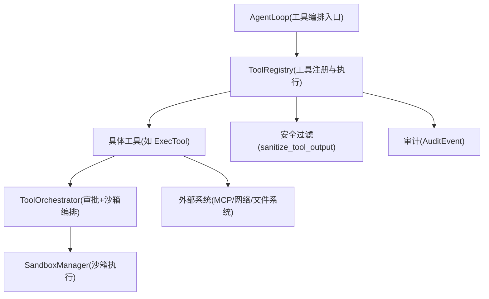
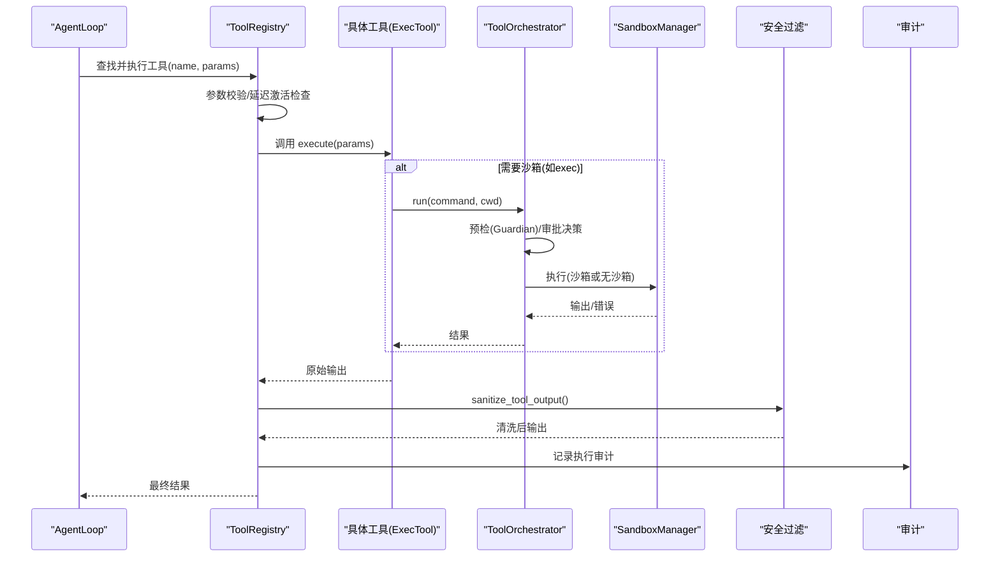
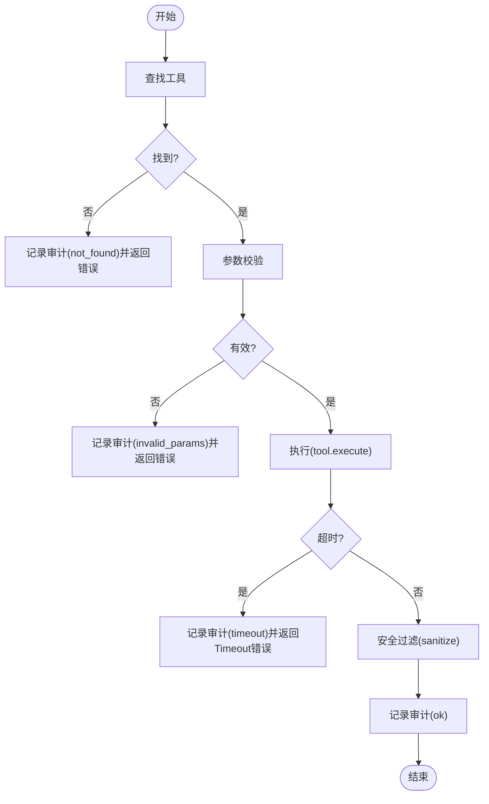
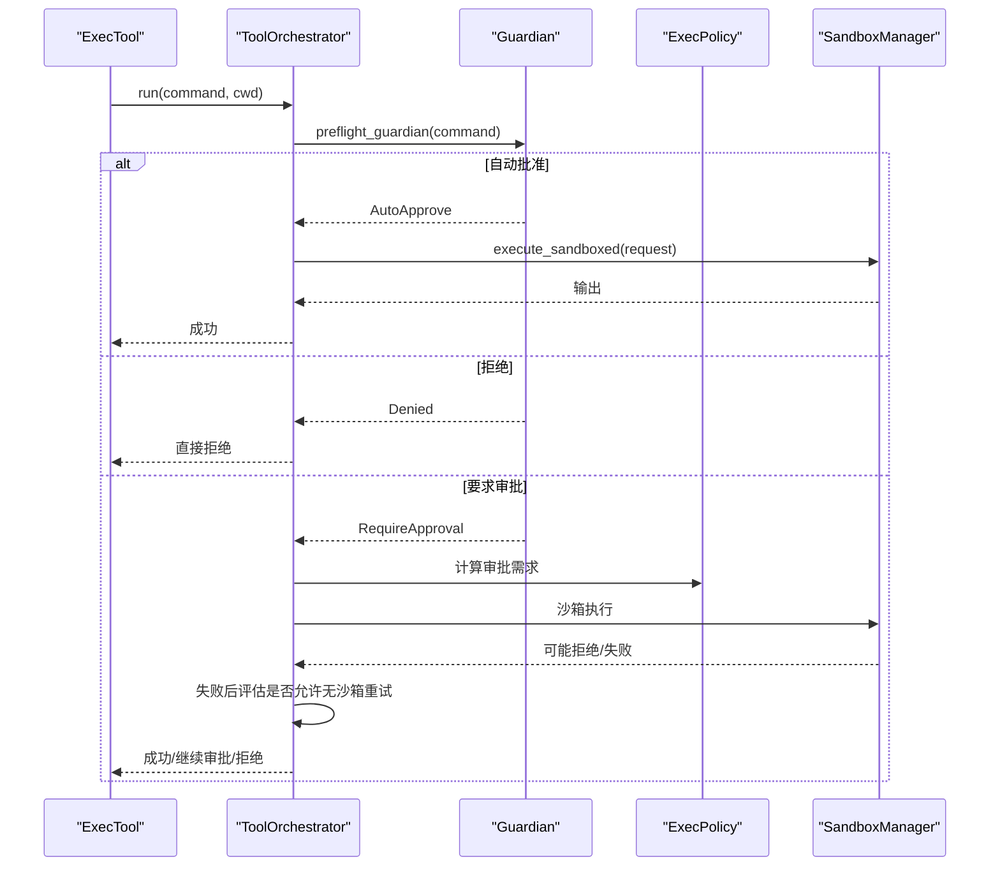
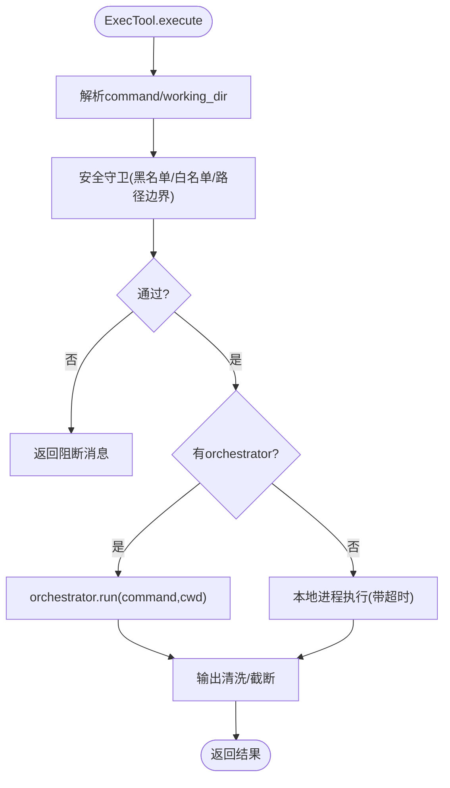
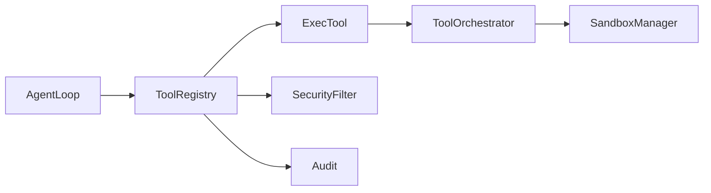
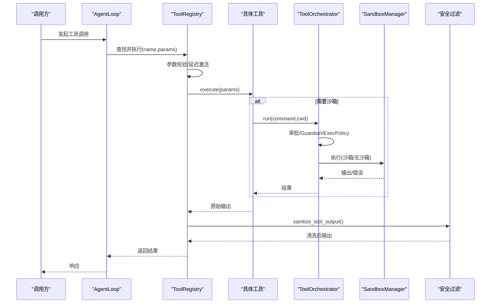

# 工具调用流程

<cite>
**本文引用的文件**
- [agent-diva-tooling/src/registry.rs](file://agent-diva-tooling/src/registry.rs)
- [agent-diva-tooling/src/base.rs](file://agent-diva-tooling/src/base.rs)
- [agent-diva-sandbox/src/orchestrator.rs](file://agent-diva-sandbox/src/orchestrator.rs)
- [agent-diva-tools/src/shell.rs](file://agent-diva-tools/src/shell.rs)
- [agent-diva-core/src/security/tool_result_filter.rs](file://agent-diva-core/src/security/tool_result_filter.rs)
- [agent-diva-core/src/security/mod.rs](file://agent-diva-core/src/security/mod.rs)
- [agent-diva-core/src/error_category.rs](file://agent-diva-core/src/error_category.rs)
- [agent-diva-providers/src/retry.rs](file://agent-diva-providers/src/retry.rs)
- [agent-diva-agent/src/agent_loop/turn/tool_step.rs](file://agent-diva-agent/src/agent_loop/turn/tool_step.rs)
</cite>

## 目录
1. [简介](#简介)
2. [项目结构](#项目结构)
3. [核心组件](#核心组件)
4. [架构总览](#架构总览)
5. [详细组件分析](#详细组件分析)
6. [依赖关系分析](#依赖关系分析)
7. [性能与并发](#性能与并发)
8. [故障排查指南](#故障排查指南)
9. [结论](#结论)
10. [附录：示例与最佳实践](#附录示例与最佳实践)

## 简介
本文件系统性梳理 Agent-Diva 中“工具调用”的完整生命周期，覆盖参数校验、权限检查、执行环境准备、异步执行模式（并发控制、资源隔离、超时管理）、安全机制（沙箱、输入输出过滤、注入检测）、错误处理策略（重试、降级、异常捕获），并提供同步与异步工具使用示例及关键时序图。目标是让非专业读者也能理解从“发起工具调用”到“返回结果”的全链路过程与安全边界。

## 项目结构
围绕工具调用，仓库的关键模块分布如下：
- agent-diva-tooling：工具抽象、注册表、全局超时、结构化输出、审计事件
- agent-diva-tools：具体工具实现（如 exec shell）
- agent-diva-sandbox：命令审批、沙箱选择、执行编排、失败重试与升级
- agent-diva-core：安全能力（输出过滤、注入检测、PII、策略）、错误分类
- agent-diva-providers：HTTP 请求重试与退避（为外部服务调用提供通用能力）
- agent-diva-agent：Agent 循环中的工具编排入口（轮次内工具调用调度）

图表来源
- [agent-diva-agent/src/agent_loop/turn/tool_step.rs:194-222](file://agent-diva-agent/src/agent_loop/turn/tool_step.rs#L194-L222)
- [agent-diva-tooling/src/registry.rs:534-699](file://agent-diva-tooling/src/registry.rs#L534-L699)
- [agent-diva-sandbox/src/orchestrator.rs:400-430](file://agent-diva-sandbox/src/orchestrator.rs#L400-L430)
- [agent-diva-core/src/security/tool_result_filter.rs:61-97](file://agent-diva-core/src/security/tool_result_filter.rs#L61-L97)

章节来源
- [agent-diva-tooling/src/registry.rs:1-120](file://agent-diva-tooling/src/registry.rs#L1-L120)
- [agent-diva-sandbox/src/orchestrator.rs:1-120](file://agent-diva-sandbox/src/orchestrator.rs#L1-L120)
- [agent-diva-core/src/security/mod.rs:1-69](file://agent-diva-core/src/security/mod.rs#L1-L69)

## 核心组件
- 工具接口与错误模型：定义统一的 Tool trait、参数校验、超时钩子、错误分类
- 工具注册表：负责工具发现、延迟激活、参数校验、全局超时、审计、输出清洗
- 沙箱编排器：审批流、沙箱选择、首次尝试、失败重试/升级、环境隔离
- 具体工具：以 exec 为例，展示命令白名单/黑名单、工作区边界、输出清理、超时
- 安全过滤：注入检测、不可信包裹、截断保护
- 错误分类与重试：统一错误类别，驱动上层重试/降级策略

章节来源
- [agent-diva-tooling/src/base.rs:1-123](file://agent-diva-tooling/src/base.rs#L1-L123)
- [agent-diva-tooling/src/registry.rs:362-717](file://agent-diva-tooling/src/registry.rs#L362-L717)
- [agent-diva-sandbox/src/orchestrator.rs:258-758](file://agent-diva-sandbox/src/orchestrator.rs#L258-L758)
- [agent-diva-tools/src/shell.rs:55-149](file://agent-diva-tools/src/shell.rs#L55-L149)
- [agent-diva-core/src/security/tool_result_filter.rs:1-133](file://agent-diva-core/src/security/tool_result_filter.rs#L1-L133)
- [agent-diva-core/src/error_category.rs:1-118](file://agent-diva-core/src/error_category.rs#L1-L118)

## 架构总览
下图展示了工具调用的端到端交互：Agent 触发 → 注册表解析与校验 → 工具执行 → 安全过滤 → 审计记录 → 返回结果；其中 exec 类工具会进入沙箱编排器进行审批与隔离执行。

图表来源
- [agent-diva-agent/src/agent_loop/turn/tool_step.rs:194-222](file://agent-diva-agent/src/agent_loop/turn/tool_step.rs#L194-L222)
- [agent-diva-tooling/src/registry.rs:534-699](file://agent-diva-tooling/src/registry.rs#L534-L699)
- [agent-diva-sandbox/src/orchestrator.rs:400-430](file://agent-diva-sandbox/src/orchestrator.rs#L400-L430)
- [agent-diva-core/src/security/tool_result_filter.rs:61-97](file://agent-diva-core/src/security/tool_result_filter.rs#L61-L97)

## 详细组件分析

### 工具接口与注册表（Tool + ToolRegistry）
- 工具接口：统一 name/description/parameters/execute，支持可选 timeout_secs 覆盖默认全局超时
- 参数校验：基于 JSON Schema 的 required 字段校验，未通过则立即返回 invalid_params
- 执行与超时：对 tool.execute 使用 tokio::time::timeout 包装，超时返回 Timeout 错误
- 输出安全：调用 sanitize_tool_output 进行注入检测与清洗，随后审计记录
- 延迟激活：Deferred 工具需先搜索激活，否则视为不可用
- 审计：每次执行均记录工具名、耗时、结果大小、状态等

图表来源
- [agent-diva-tooling/src/registry.rs:534-699](file://agent-diva-tooling/src/registry.rs#L534-L699)
- [agent-diva-core/src/security/tool_result_filter.rs:61-97](file://agent-diva-core/src/security/tool_result_filter.rs#L61-L97)

章节来源
- [agent-diva-tooling/src/base.rs:1-123](file://agent-diva-tooling/src/base.rs#L1-L123)
- [agent-diva-tooling/src/registry.rs:362-717](file://agent-diva-tooling/src/registry.rs#L362-L717)

### 沙箱编排器（ToolOrchestrator）
- 审批前置：Guardian 自动审批/拒绝/要求审批；可结合 ExecPolicy 生成规则
- 沙箱选择：根据策略决定在沙箱中执行或首次尝试绕过沙箱
- 执行路径：构建 SandboxExecRequest，设置超时，按是否绕过选择 sandboxed/unsandboxed 执行
- 失败重试与升级：当被沙箱拒绝或平台错误时，依据缓存的审批决策决定是否允许无沙箱重试
- 结果封装：返回成功/失败、是否使用沙箱、是否需要修改命令等

图表来源
- [agent-diva-sandbox/src/orchestrator.rs:400-758](file://agent-diva-sandbox/src/orchestrator.rs#L400-L758)

章节来源
- [agent-diva-sandbox/src/orchestrator.rs:258-758](file://agent-diva-sandbox/src/orchestrator.rs#L258-L758)

### 具体工具：Shell 执行（ExecTool）
- 安全守卫：内置危险命令正则黑名单、可选白名单、工作区边界强制（防止跳出 workspace）
- 审批后端：可选择接入 CommandApprovalCoordinator，支持会话级/全局级审批
- 执行路径：优先走 orchestrator.run；若未配置则回退到本地进程执行，带超时与输出清理
- 输出处理：去除 ANSI 控制序列、转义字符，限制最大长度，附加退出码信息

图表来源
- [agent-diva-tools/src/shell.rs:55-149](file://agent-diva-tools/src/shell.rs#L55-L149)
- [agent-diva-tools/src/shell.rs:300-404](file://agent-diva-tools/src/shell.rs#L300-L404)
- [agent-diva-tools/src/shell.rs:442-537](file://agent-diva-tools/src/shell.rs#L442-L537)

章节来源
- [agent-diva-tools/src/shell.rs:55-149](file://agent-diva-tools/src/shell.rs#L55-L149)
- [agent-diva-tools/src/shell.rs:300-404](file://agent-diva-tools/src/shell.rs#L300-L404)
- [agent-diva-tools/src/shell.rs:442-537](file://agent-diva-tools/src/shell.rs#L442-L537)

### 安全机制（输出过滤、注入检测、PII）
- 不可信包裹：所有工具输出以 <untrusted>...</untrusted> 标记，提示 LLM 该内容为外部来源
- 注入检测：识别指令注入模式，标注 [SUSPICIOUS] 并记录审计
- 截断保护：超过阈值的结果会被截断，避免上下文窗口耗尽攻击
- PII 脱敏：可按策略对敏感信息进行脱敏（由上层安全模块提供）

章节来源
- [agent-diva-core/src/security/tool_result_filter.rs:1-133](file://agent-diva-core/src/security/tool_result_filter.rs#L1-L133)
- [agent-diva-core/src/security/mod.rs:1-69](file://agent-diva-core/src/security/mod.rs#L1-L69)

### 错误处理与重试
- 工具层错误：InvalidParams、ExecutionFailed、Timeout、ToolUnavailable 等，具备稳定错误码
- 错误分类：将错误归类为 Retryable/Fatal/Config/Auth/Timeout/Unknown，便于上层决策
- 提供者重试：HTTP 请求采用指数退避+抖动，支持 429 速率限制与 5xx 重试
- 沙箱重试：失败后可根据审批策略与缓存决策，升级为无沙箱执行或再次请求审批

章节来源
- [agent-diva-tooling/src/base.rs:63-123](file://agent-diva-tooling/src/base.rs#L63-L123)
- [agent-diva-core/src/error_category.rs:1-118](file://agent-diva-core/src/error_category.rs#L1-L118)
- [agent-diva-providers/src/retry.rs:1-181](file://agent-diva-providers/src/retry.rs#L1-L181)
- [agent-diva-sandbox/src/orchestrator.rs:579-758](file://agent-diva-sandbox/src/orchestrator.rs#L579-L758)

## 依赖关系分析
- AgentLoop 依赖 ToolRegistry 完成工具调度
- ToolRegistry 依赖具体工具实现，并在执行前后调用安全过滤与审计
- ExecTool 依赖 ToolOrchestrator 与 SandboxManager 完成审批与隔离执行
- ToolOrchestrator 依赖 Guardian/ExecPolicy 做智能审批与策略判断
- 安全模块贯穿输出侧，确保进入 LLM 上下文的内容可信且可控

图表来源
- [agent-diva-agent/src/agent_loop/turn/tool_step.rs:194-222](file://agent-diva-agent/src/agent_loop/turn/tool_step.rs#L194-L222)
- [agent-diva-tooling/src/registry.rs:534-699](file://agent-diva-tooling/src/registry.rs#L534-L699)
- [agent-diva-sandbox/src/orchestrator.rs:400-430](file://agent-diva-sandbox/src/orchestrator.rs#L400-L430)
- [agent-diva-core/src/security/tool_result_filter.rs:61-97](file://agent-diva-core/src/security/tool_result_filter.rs#L61-L97)

章节来源
- [agent-diva-tooling/src/registry.rs:362-717](file://agent-diva-tooling/src/registry.rs#L362-L717)
- [agent-diva-sandbox/src/orchestrator.rs:258-758](file://agent-diva-sandbox/src/orchestrator.rs#L258-L758)

## 性能与并发
- 超时控制：ToolRegistry 对每个工具执行施加全局/工具级超时；ExecTool 对进程等待也设置超时
- 并发控制：注册表执行本身串行化单个工具调用；跨工具并发由上层任务调度决定
- 资源隔离：沙箱编排器可在必要时绕过沙箱执行（经审批），但默认在沙箱中运行，限制系统影响面
- 输出裁剪：安全过滤对超长输出进行截断，降低内存与上下文压力
- 重试策略：提供者层 HTTP 请求采用指数退避与抖动，减少瞬时拥塞影响

[本节为通用指导，不直接分析具体文件]

## 故障排查指南
- 参数无效：检查 JSON Schema 的 required 字段与类型；查看审计日志中的 invalid_params 状态
- 工具不可用：确认 Deferred 工具已通过搜索激活；检查 active_deferred_tools_snapshot
- 超时：核对工具自身 timeout_secs 与注册表全局超时；关注 Timeout 错误
- 沙箱拒绝：查看审批缓存与 Guardian 决策；必要时调整 ExecPolicy 或授予一次性/会话级审批
- 输出异常：检查 sanitize_tool_output 是否标记 [SUSPICIOUS]；确认截断阈值是否合理

章节来源
- [agent-diva-tooling/src/registry.rs:534-699](file://agent-diva-tooling/src/registry.rs#L534-L699)
- [agent-diva-sandbox/src/orchestrator.rs:579-758](file://agent-diva-sandbox/src/orchestrator.rs#L579-L758)
- [agent-diva-core/src/security/tool_result_filter.rs:61-97](file://agent-diva-core/src/security/tool_result_filter.rs#L61-L97)

## 结论
Agent-Diva 的工具调用体系以“注册表 + 沙箱编排 + 安全过滤”为核心，形成从参数校验、权限审批、隔离执行到输出清洗的闭环。通过超时、重试、降级与审计，既保障了安全性，又兼顾了可用性与可观测性。对于高风险操作（如 shell 执行），默认在沙箱中运行，并在必要时经审批升级权限，确保最小权限原则。

[本节为总结，不直接分析具体文件]

## 附录：示例与最佳实践

### 同步工具调用示例（概念说明）
- 步骤：构造参数对象 → 调用 ToolRegistry.execute(name, params) → 获取清洗后的字符串结果
- 关键点：确保参数符合 schema；注意全局超时；关注审计日志

章节来源
- [agent-diva-tooling/src/registry.rs:534-699](file://agent-diva-tooling/src/registry.rs#L534-L699)

### 异步工具调用示例（概念说明）
- 步骤：在异步上下文中调用 ToolRegistry.execute_structured(name, params) → 获取结构化输出（含内容、字节数、字符数、状态）
- 关键点：适合需要保留完整输出或统计大小的场景；同样受超时与安全过滤约束

章节来源
- [agent-diva-tooling/src/registry.rs:541-699](file://agent-diva-tooling/src/registry.rs#L541-L699)

### Shell 工具调用示例（概念说明）
- 步骤：构造 { command, working_dir? } → 调用 ExecTool.execute → 内部走 orchestrator.run（审批+沙箱）→ 返回清洗后的输出
- 关键点：命令将被安全守卫检查；工作区边界强制；超时保护；输出去 ANSI 与控制符

章节来源
- [agent-diva-tools/src/shell.rs:300-404](file://agent-diva-tools/src/shell.rs#L300-L404)
- [agent-diva-tools/src/shell.rs:442-537](file://agent-diva-tools/src/shell.rs#L442-L537)

### 时序图：完整工具调用与安全点

图表来源
- [agent-diva-agent/src/agent_loop/turn/tool_step.rs:194-222](file://agent-diva-agent/src/agent_loop/turn/tool_step.rs#L194-L222)
- [agent-diva-tooling/src/registry.rs:534-699](file://agent-diva-tooling/src/registry.rs#L534-L699)
- [agent-diva-sandbox/src/orchestrator.rs:400-430](file://agent-diva-sandbox/src/orchestrator.rs#L400-L430)
- [agent-diva-core/src/security/tool_result_filter.rs:61-97](file://agent-diva-core/src/security/tool_result_filter.rs#L61-L97)