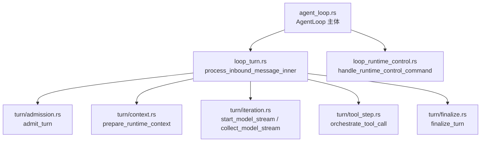
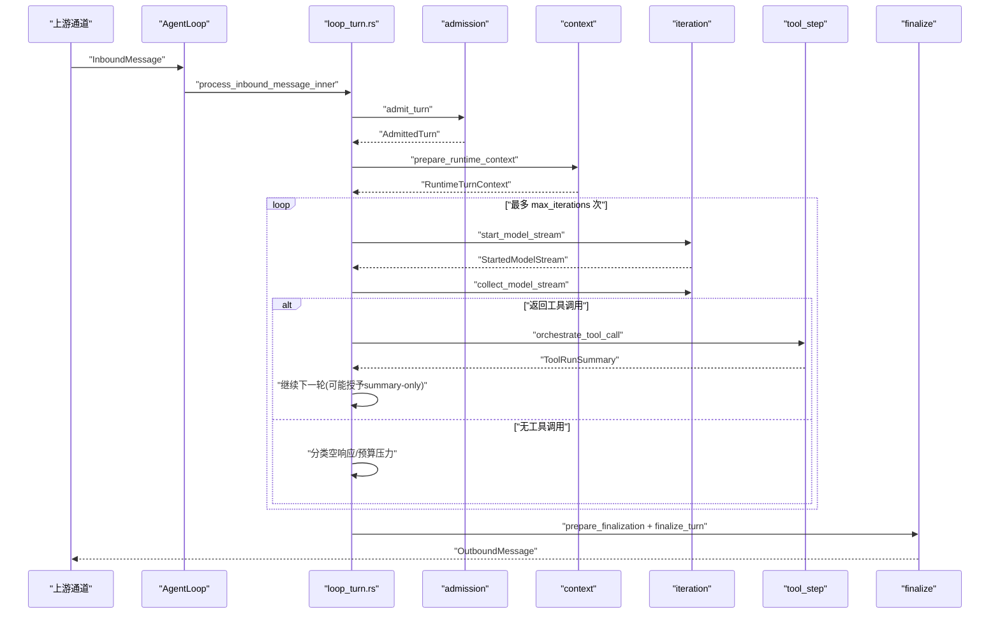
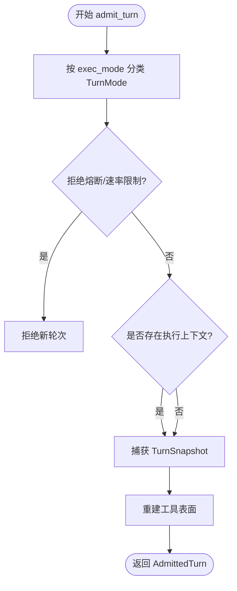
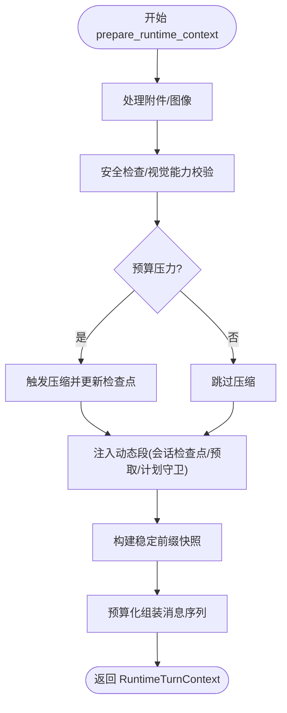
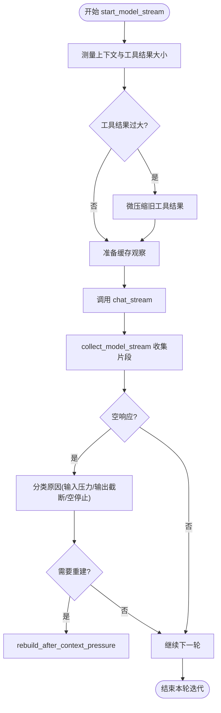
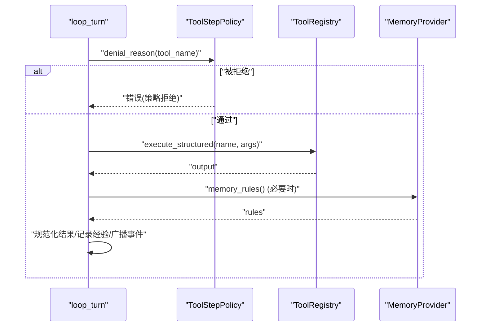
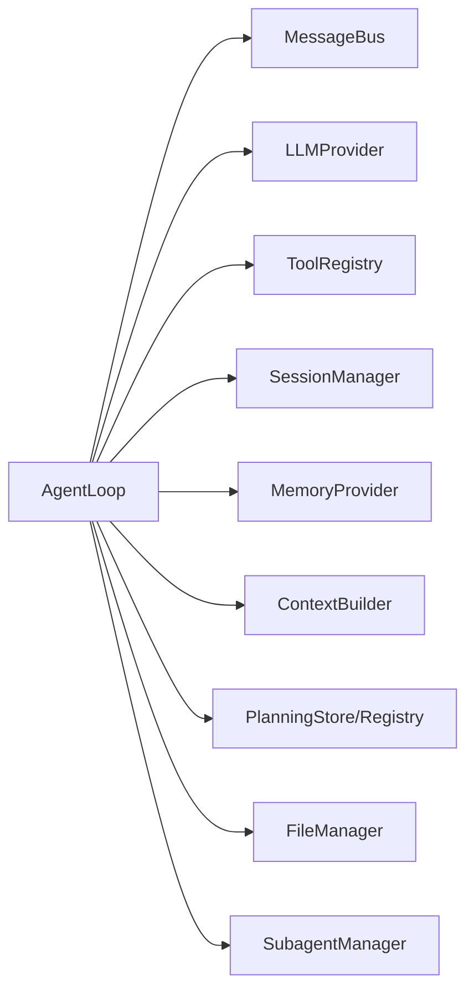

# 智能体循环

<cite>
**本文引用的文件**
- [agent_loop.rs](file://agent-diva-agent/src/agent_loop.rs)
- [loop_runtime_control.rs](file://agent-diva-agent/src/agent_loop/loop_runtime_control.rs)
- [loop_turn.rs](file://agent-diva-agent/src/agent_loop/loop_turn.rs)
- [turn/mod.rs](file://agent-diva-agent/src/agent_loop/turn/mod.rs)
- [turn/admission.rs](file://agent-diva-agent/src/agent_loop/turn/admission.rs)
- [turn/context.rs](file://agent-diva-agent/src/agent_loop/turn/context.rs)
- [turn/policy.rs](file://agent-diva-agent/src/agent_loop/turn/policy.rs)
- [turn/tool_step.rs](file://agent-diva-agent/src/agent_loop/turn/tool_step.rs)
- [turn/iteration.rs](file://agent-diva-agent/src/agent_loop/turn/iteration.rs)
- [turn/finalize.rs](file://agent-diva-agent/src/agent_loop/turn/finalize.rs)
</cite>

## 目录
1. [简介](#简介)
2. [项目结构](#项目结构)
3. [核心组件](#核心组件)
4. [架构总览](#架构总览)
5. [详细组件分析](#详细组件分析)
6. [依赖关系分析](#依赖关系分析)
7. [性能考量](#性能考量)
8. [故障排查指南](#故障排查指南)
9. [结论](#结论)
10. [附录](#附录)

## 简介
本文件围绕 Agent Loop（智能体循环）的核心机制进行系统化说明，重点覆盖：
- 消息处理生命周期与轮次管理（turn、iteration）
- 状态转换与控制流（admission、context、policy、tool_step、finalize）
- 上下文组装过程（预算控制、缓存机制、压缩与重建）
- 工具调用编排与安全策略（计划阶段、只读模式、防递归调度等）
- 具体代码路径与流程图，帮助读者理解消息在循环中的完整处理路径

## 项目结构
Agent Loop 位于 agent-diva-agent 模块中，采用“主循环 + 分阶段”的模块化组织：
- 顶层入口与装配：agent_loop.rs
- 运行时控制：loop_runtime_control.rs
- 轮次编排：loop_turn.rs
- 阶段契约与实现：turn/ 子模块
  - admission：准入与分类
  - context：上下文组装与预算
  - policy：策略快照与阶段判定
  - tool_step：工具执行与权限校验
  - iteration：模型迭代、流式收集与空响应处理
  - finalize：收尾、持久化与事件发布

图表来源
- [agent_loop.rs:110-153](file://agent-diva-agent/src/agent_loop.rs#L110-L153)
- [loop_turn.rs:312-757](file://agent-diva-agent/src/agent_loop/loop_turn.rs#L312-L757)
- [turn/admission.rs:114-317](file://agent-diva-agent/src/agent_loop/turn/admission.rs#L114-L317)
- [turn/context.rs:94-558](file://agent-diva-agent/src/agent_loop/turn/context.rs#L94-L558)
- [turn/iteration.rs:167-393](file://agent-diva-agent/src/agent_loop/turn/iteration.rs#L167-L393)
- [turn/tool_step.rs:194-480](file://agent-diva-agent/src/agent_loop/turn/tool_step.rs#L194-L480)
- [turn/finalize.rs:118-273](file://agent-diva-agent/src/agent_loop/turn/finalize.rs#L118-L273)
- [loop_runtime_control.rs:26-244](file://agent-diva-agent/src/agent_loop/loop_runtime_control.rs#L26-L244)

章节来源
- [agent_loop.rs:1-153](file://agent-diva-agent/src/agent_loop.rs#L1-L153)
- [turn/mod.rs:1-14](file://agent-diva-agent/src/agent_loop/turn/mod.rs#L1-L14)

## 核心组件
- AgentLoop：维护会话、工具集、内存提供者、预算、缓存观察器、计划执行上下文、取消标记等；提供构造、工具集重建、安全配置加载等能力。
- 轮次（Turn）：一次入站消息的处理单元，包含 admission → context → iteration → tool_step → finalize 的阶段。
- 迭代（Iteration）：单次模型采样与工具调用的循环，支持 summary-only 奖励轮次、空响应分类与上下文压力恢复。
- 上下文（Context）：组装历史、检查点、动态段、当前消息，并应用预算与压缩策略。
- 策略（Policy）：基于计划阶段、只读模式、计划守卫等决定工具是否可执行。
- 工具编排（Tool Step）：参数注入、权限校验、结果规范化、经验日志、计划事件广播。
- 收尾（Finalize）：保存会话、可选标题生成、压缩/合并、发布最终事件与出站消息。
- 运行时控制（Runtime Control）：热更新网络/MCP、重置/删除会话、设置思考模式、审批策略、手动压缩等。

章节来源
- [agent_loop.rs:110-153](file://agent-diva-agent/src/agent_loop.rs#L110-L153)
- [turn/admission.rs:17-77](file://agent-diva-agent/src/agent_loop/turn/admission.rs#L17-L77)
- [turn/context.rs:30-46](file://agent-diva-agent/src/agent_loop/turn/context.rs#L30-L46)
- [turn/policy.rs:6-66](file://agent-diva-agent/src/agent_loop/turn/policy.rs#L6-L66)
- [turn/tool_step.rs:19-160](file://agent-diva-agent/src/agent_loop/turn/tool_step.rs#L19-L160)
- [turn/iteration.rs:94-165](file://agent-diva-agent/src/agent_loop/turn/iteration.rs#L94-L165)
- [turn/finalize.rs:16-53](file://agent-diva-agent/src/agent_loop/turn/finalize.rs#L16-L53)
- [loop_runtime_control.rs:26-244](file://agent-diva-agent/src/agent_loop/loop_runtime_control.rs#L26-L244)

## 架构总览
下图展示从消息进入至最终回复的端到端流程，以及各阶段的职责边界。

图表来源
- [loop_turn.rs:312-757](file://agent-diva-agent/src/agent_loop/loop_turn.rs#L312-L757)
- [turn/admission.rs:114-317](file://agent-diva-agent/src/agent_loop/turn/admission.rs#L114-L317)
- [turn/context.rs:94-558](file://agent-diva-agent/src/agent_loop/turn/context.rs#L94-L558)
- [turn/iteration.rs:167-393](file://agent-diva-agent/src/agent_loop/turn/iteration.rs#L167-L393)
- [turn/tool_step.rs:194-480](file://agent-diva-agent/src/agent_loop/turn/tool_step.rs#L194-L480)
- [turn/finalize.rs:118-273](file://agent-diva-agent/src/agent_loop/turn/finalize.rs#L118-L273)

## 详细组件分析

### 轮次管理：admission（准入）
- 目标：对入站消息进行分类（Agent/Plan/Ask），识别定时任务触发，建立会话键，并在必要时恢复执行上下文。
- 关键行为：
  - 根据 exec_mode 元数据分类 TurnMode，并判断是否允许执行。
  - 拒绝条件：拒绝熔断器触发或每小时最大动作数耗尽。
  - 计划执行恢复：若处于 Execute 阶段且存在执行上下文，则恢复 active_execution。
  - 构建 TurnSnapshot 并重建工具表面（含计划阶段、只读模式、背景任务上下文）。
- 复杂度：O(1) 分类与快照；计划恢复为 O(1) 查找。

图表来源
- [turn/admission.rs:114-317](file://agent-diva-agent/src/agent_loop/turn/admission.rs#L114-L317)

章节来源
- [turn/admission.rs:17-77](file://agent-diva-agent/src/agent_loop/turn/admission.rs#L17-L77)
- [turn/admission.rs:114-317](file://agent-diva-agent/src/agent_loop/turn/admission.rs#L114-L317)

### 上下文组装：context（预算与动态段）
- 目标：将历史、检查点、动态段与当前消息组装为 Provider 可用的消息序列，同时应用预算与压缩。
- 关键行为：
  - 附件内联与图像检测；安全策略过滤；视觉模型能力校验。
  - 自动压缩：当预算压力超过阈值时触发 CheckpointCompactor，更新 canonical_checkpoint。
  - 动态段注入：会话检查点、预取召回、计划守卫、只读模式提示等。
  - 稳定前缀快照：冻结 provider 前缀，避免后续变更影响缓存。
- 复杂度：预算评估与选择为近似线性于消息数量；压缩为 O(n) 扫描与摘要。

图表来源
- [turn/context.rs:94-558](file://agent-diva-agent/src/agent_loop/turn/context.rs#L94-L558)

章节来源
- [turn/context.rs:30-46](file://agent-diva-agent/src/agent_loop/turn/context.rs#L30-L46)
- [turn/context.rs:94-558](file://agent-diva-agent/src/agent_loop/turn/context.rs#L94-L558)

### 策略快照：policy（阶段与权限）
- 目标：在 turn 级别记录计划阶段、只读模式、计划守卫状态，用于后续工具执行决策。
- 关键行为：
  - 基于 active_plan 与 plan_mode 计算 policy_phase。
  - 记录 Memory 规则注入迭代，确保同一轮响应中不会立即执行未观测到的写入。
- 复杂度：O(1)。

章节来源
- [turn/policy.rs:6-66](file://agent-diva-agent/src/agent_loop/turn/policy.rs#L6-L66)

### 模型迭代：iteration（流式采样与空响应处理）
- 目标：启动模型流式调用，收集文本、推理内容、工具调用，处理空响应与上下文压力。
- 关键行为：
  - 预算测量与微压缩：当工具结果过大时进行 microcompact。
  - 缓存观察：结合 provider 最终线快照与 CORE/DEFERRED 锚点，提升缓存命中率。
  - 空响应分类：输入压力、输出截断、空停止；必要时触发重建与重试。
  - 内部协议防护：防止内部协议标记泄漏到用户可见输出。
- 复杂度：流式处理为 O(k)，k 为片段数；重建为 O(n) 消息重组。

图表来源
- [turn/iteration.rs:167-393](file://agent-diva-agent/src/agent_loop/turn/iteration.rs#L167-L393)
- [turn/iteration.rs:395-531](file://agent-diva-agent/src/agent_loop/turn/iteration.rs#L395-L531)
- [turn/iteration.rs:533-641](file://agent-diva-agent/src/agent_loop/turn/iteration.rs#L533-L641)

章节来源
- [turn/iteration.rs:94-165](file://agent-diva-agent/src/agent_loop/turn/iteration.rs#L94-L165)
- [turn/iteration.rs:167-393](file://agent-diva-agent/src/agent_loop/turn/iteration.rs#L167-L393)
- [turn/iteration.rs:395-531](file://agent-diva-agent/src/agent_loop/turn/iteration.rs#L395-L531)
- [turn/iteration.rs:533-641](file://agent-diva-agent/src/agent_loop/turn/iteration.rs#L533-L641)

### 工具编排：tool_step（权限与执行）
- 目标：在执行前进行策略校验与参数注入，执行工具后规范化结果并广播事件。
- 关键行为：
  - 策略拒绝：只读模式、计划阶段能力矩阵、无计划时的守卫限制。
  - 特殊保护：cron 触发下禁止 cron/memory_distill 递归；Memory 写入规则注入。
  - 结果规范：错误码、引用存储、经验日志；计划事件广播与工具表面重建。
- 复杂度：执行为 O(1) 调用；结果规范化与日志为 O(1)~O(n) 取决于结果大小。

图表来源
- [turn/tool_step.rs:19-160](file://agent-diva-agent/src/agent_loop/turn/tool_step.rs#L19-L160)
- [turn/tool_step.rs:194-480](file://agent-diva-agent/src/agent_loop/turn/tool_step.rs#L194-L480)

章节来源
- [turn/tool_step.rs:19-160](file://agent-diva-agent/src/agent_loop/turn/tool_step.rs#L19-L160)
- [turn/tool_step.rs:194-480](file://agent-diva-agent/src/agent_loop/turn/tool_step.rs#L194-L480)

### 收尾：finalize（持久化与发布）
- 目标：完成一轮处理的收尾工作，包括计划报告持久化、会话保存、标题生成、压缩/合并、事件发布与出站消息返回。
- 关键行为：
  - 计划模式：解析并持久化报告，必要时清理用户可见输出。
  - 会话保存：追加消息、更新检查点、触发 consolidation。
  - 标题生成：按需调用模型生成或回退默认标题。
  - 事件发布：FinalResponse、ReasoningReceived、TokenUsed 等。
- 复杂度：主要为 I/O 与序列化，近似 O(n)。

章节来源
- [turn/finalize.rs:16-53](file://agent-diva-agent/src/agent_loop/turn/finalize.rs#L16-L53)
- [turn/finalize.rs:118-273](file://agent-diva-agent/src/agent_loop/turn/finalize.rs#L118-L273)

### 控制流协调：loop_runtime_control
- 目标：处理运行时命令（网络/MCP 更新、会话重置/删除、思考模式、审批策略、手动压缩等），并在需要时重建工具表面。
- 关键行为：
  - 刷新机器技能、记忆权威投影、网络与 MCP 配置。
  - 会话生命周期：归档/重置/删除，清理缓存与计划状态。
  - 手动压缩：调用 CheckpointCompactor 并更新会话。
  - 工具表面重建：保持阶段边界一致性。

章节来源
- [loop_runtime_control.rs:26-244](file://agent-diva-agent/src/agent_loop/loop_runtime_control.rs#L26-L244)
- [loop_runtime_control.rs:460-484](file://agent-diva-agent/src/agent_loop/loop_runtime_control.rs#L460-L484)

## 依赖关系分析
- AgentLoop 依赖：
  - MessageBus：事件总线，用于发布 AgentEvent/PokeEvent。
  - LLMProvider：模型调用与流式事件。
  - ToolRegistry：工具注册与执行。
  - SessionManager：会话与历史管理。
  - MemoryProvider：工作记忆、预取、检查点块。
  - ContextBuilder/ContextAssembly：上下文组装与预算控制。
  - PlanningStore/Registry：计划与执行上下文。
  - FileManager：附件与文件管理。
  - SubagentManager：子代理管理。
- 阶段间耦合：
  - admission 产出 TurnSnapshot，供 context/policy/tool_step 使用。
  - context 产出 RuntimeTurnContext，供 iteration 使用。
  - iteration 产出 IterationOutcome，供 finalize 使用。
  - tool_step 可能改变计划状态，触发工具表面重建。

图表来源
- [agent_loop.rs:110-153](file://agent-diva-agent/src/agent_loop.rs#L110-L153)

章节来源
- [agent_loop.rs:110-153](file://agent-diva-agent/src/agent_loop.rs#L110-L153)

## 性能考量
- 上下文预算与压缩：
  - 自动压缩：当历史/检查点超出预算时触发，减少后续调用成本。
  - 微压缩：针对过大的工具结果进行压缩，降低上下文压力。
  - 稳定前缀：冻结 provider 前缀，提高缓存命中。
- 流式处理：
  - 流式收集文本、推理与工具调用，降低首字节延迟。
  - 内部协议防护避免额外开销。
- 工具执行：
  - 策略前置拒绝，避免无效执行。
  - 结果规范化与引用存储，减少重复传输。
- 缓存观察：
  - 结合 provider 最终线快照与 CORE/DEFERRED 锚点，优化缓存。

[本节为通用指导，不直接分析具体文件]

## 故障排查指南
- 拒绝熔断器触发：
  - 现象：新轮次被拒绝，提示“拒绝风暴”。
  - 排查：检查模型/提供商错误率，调整阈值或等待窗口。
- 每小时动作数超限：
  - 现象：新轮次被拒绝，提示“max_actions_per_hour exhausted”。
  - 排查：降低并发或调整速率限制。
- 上下文溢出：
  - 现象：provider 返回上下文溢出错误。
  - 处理：自动触发重建与压缩，检查预算配置与动态段大小。
- 工具调用被拒绝：
  - 现象：工具执行返回策略拒绝。
  - 排查：确认计划阶段、只读模式、计划守卫与权限矩阵。
- 计划审批屏障：
  - 现象：plan_submit/plan_transition 后停止继续工具调用。
  - 处理：等待外部审批后再继续。

章节来源
- [turn/admission.rs:94-112](file://agent-diva-agent/src/agent_loop/turn/admission.rs#L94-L112)
- [turn/iteration.rs:167-393](file://agent-diva-agent/src/agent_loop/turn/iteration.rs#L167-L393)
- [turn/tool_step.rs:194-480](file://agent-diva-agent/src/agent_loop/turn/tool_step.rs#L194-L480)

## 结论
Agent Loop 通过清晰的阶段划分与严格的策略控制，实现了高可靠的消息处理流水线。其核心优势包括：
- 明确的轮次与迭代管理，支持总结性奖励轮次与空响应恢复。
- 强大的上下文预算与压缩机制，保障长对话稳定性。
- 细粒度的工具权限控制，结合计划阶段与只读模式，确保安全与合规。
- 完善的收尾流程，保证会话一致性与可观测性。

[本节为总结，不直接分析具体文件]

## 附录
- 关键代码路径参考：
  - 轮次入口：[loop_turn.rs:312-757](file://agent-diva-agent/src/agent_loop/loop_turn.rs#L312-L757)
  - 准入：[turn/admission.rs:114-317](file://agent-diva-agent/src/agent_loop/turn/admission.rs#L114-L317)
  - 上下文：[turn/context.rs:94-558](file://agent-diva-agent/src/agent_loop/turn/context.rs#L94-L558)
  - 迭代：[turn/iteration.rs:167-393](file://agent-diva-agent/src/agent_loop/turn/iteration.rs#L167-L393)
  - 工具：[turn/tool_step.rs:194-480](file://agent-diva-agent/src/agent_loop/turn/tool_step.rs#L194-L480)
  - 收尾：[turn/finalize.rs:118-273](file://agent-diva-agent/src/agent_loop/turn/finalize.rs#L118-L273)
  - 运行时控制：[loop_runtime_control.rs:26-244](file://agent-diva-agent/src/agent_loop/loop_runtime_control.rs#L26-L244)

[本节为索引，不直接分析具体文件]