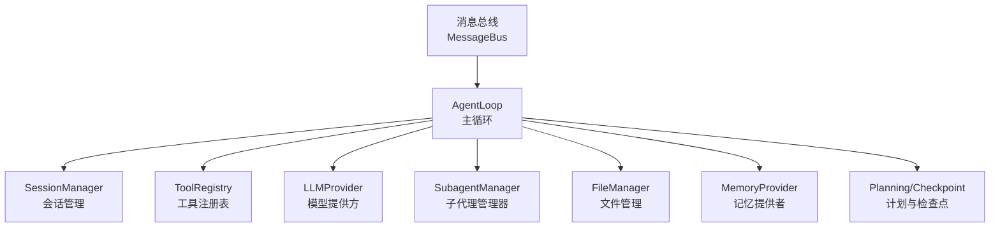
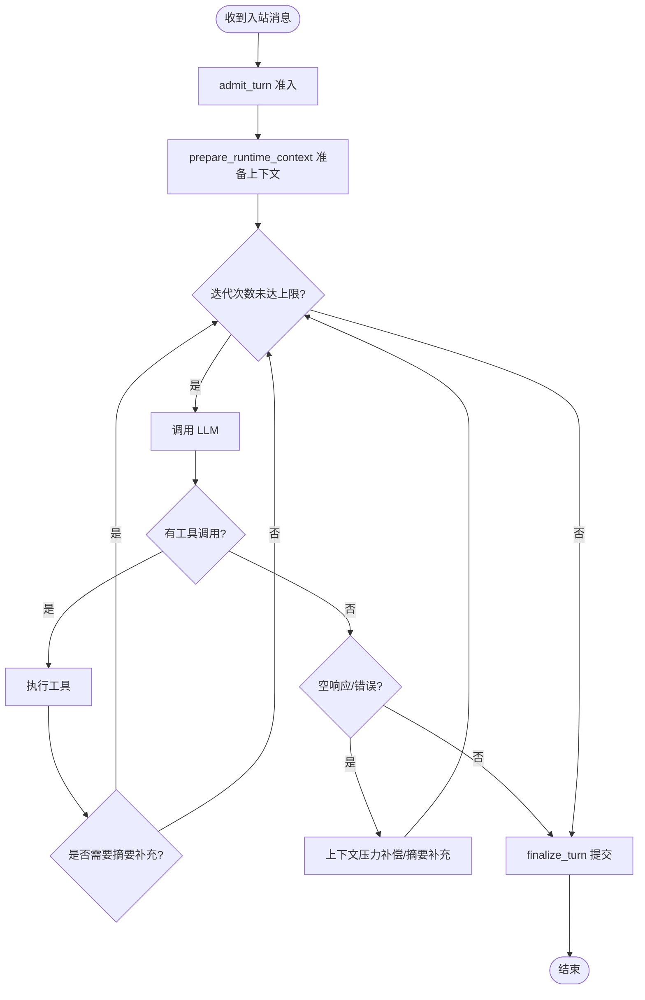
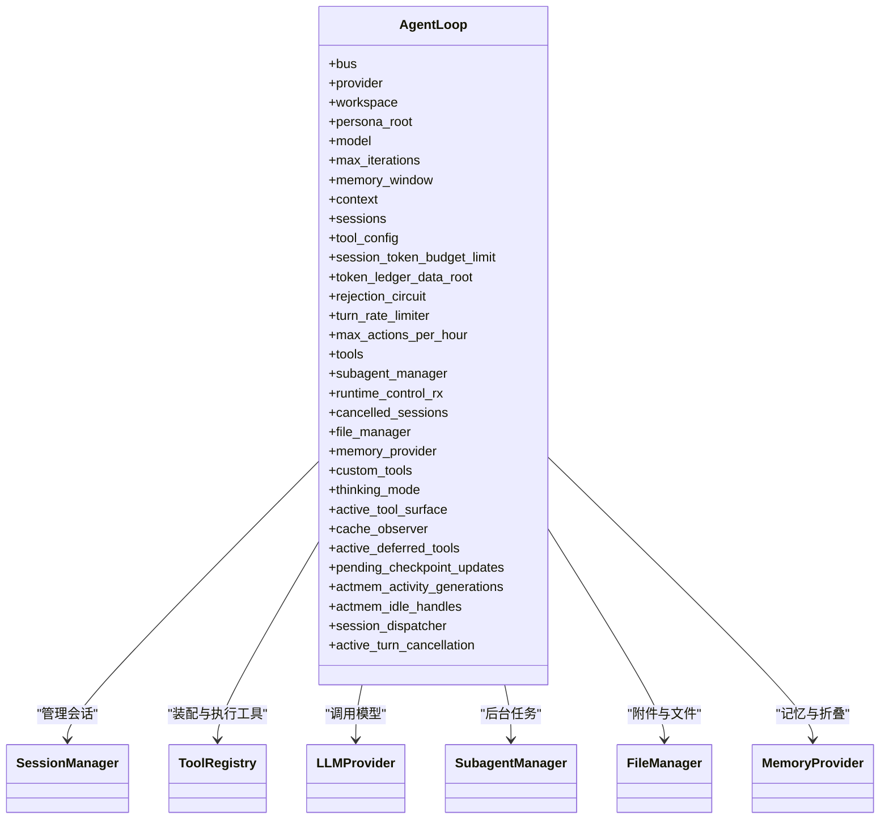

# 核心循环机制

<cite>
**本文引用的文件**
- [agent-diva-agent/src/agent_loop.rs](file://agent-diva-agent/src/agent_loop.rs)
- [agent-diva-agent/src/agent_loop/loop_runtime_control.rs](file://agent-diva-agent/src/agent_loop/loop_runtime_control.rs)
- [agent-diva-agent/src/agent_loop/loop_tools.rs](file://agent-diva-agent/src/agent_loop/loop_tools.rs)
- [agent-diva-agent/src/agent_loop/loop_turn.rs](file://agent-diva-agent/src/agent_loop/loop_turn.rs)
- [agent-diva-core/src/session/manager.rs](file://agent-diva-core/src/session/manager.rs)
- [agent-diva-agent/src/subagent.rs](file://agent-diva-agent/src/subagent.rs)
</cite>

## 目录
1. [简介](#简介)
2. [项目结构](#项目结构)
3. [核心组件](#核心组件)
4. [架构总览](#架构总览)
5. [详细组件分析](#详细组件分析)
6. [依赖关系分析](#依赖关系分析)
7. [性能考量](#性能考量)
8. [故障排查指南](#故障排查指南)
9. [结论](#结论)
10. [附录：使用示例与配置要点](#附录使用示例与配置要点)

## 简介
本文件聚焦智能体“AgentLoop”的核心循环机制，系统性解释其设计目标、关键数据结构、初始化流程、控制流、生命周期管理以及错误处理策略。文档面向不同技术背景的读者，既提供高层概览，也给出代码级映射和流程图，帮助快速理解并正确使用 AgentLoop。

## 项目结构
AgentLoop 位于 agent-diva-agent 模块中，围绕消息总线驱动的多轮对话循环，负责：
- 接收并分发入站消息
- 构建上下文与工具集
- 调用 LLM 进行多轮迭代（含工具调用）
- 维护会话状态、令牌预算、计划执行等
- 协调子代理、内存提供者、文件管理等外部资源



图表来源
- [agent-diva-agent/src/agent_loop.rs:867-930](file://agent-diva-agent/src/agent_loop.rs#L867-L930)
- [agent-diva-core/src/session/manager.rs:21-41](file://agent-diva-core/src/session/manager.rs#L21-L41)
- [agent-diva-agent/src/subagent.rs:34-58](file://agent-diva-agent/src/subagent.rs#L34-L58)

章节来源
- [agent-diva-agent/src/agent_loop.rs:1-50](file://agent-diva-agent/src/agent_loop.rs#L1-L50)

## 核心组件
- AgentLoop：核心循环引擎，持有 bus、provider、workspace、model、sessions、tools、subagent_manager、memory_provider 等关键资源，负责消息处理、迭代控制、错误处理与生命周期管理。
- ToolConfig：工具运行时配置，包含内置工具开关、网络工具配置、计划工具、超时、审批策略、MCP 服务器、定时任务服务、令牌预算等。
- SessionManager：会话持久化与缓存，负责会话的创建、加载、保存、归档与重置。
- SubagentManager：后台子代理管理，支持并发执行、隔离上下文、继承父代理能力与配置。
- MemoryProvider：记忆系统接口，用于预取、同步回合、关闭钩子、用户脉冲记录、折叠等。
- FileManager：附件与文件存取，支持内联文本附件与图片识别。

章节来源
- [agent-diva-agent/src/agent_loop.rs:55-158](file://agent-diva-agent/src/agent_loop.rs#L55-L158)
- [agent-diva-core/src/session/manager.rs:21-41](file://agent-diva-core/src/session/manager.rs#L21-L41)
- [agent-diva-agent/src/subagent.rs:34-58](file://agent-diva-agent/src/subagent.rs#L34-L58)

## 架构总览
AgentLoop 通过 MessageBus 接收 InboundMessage，进入 process_inbound_message -> process_inbound_message_admitted -> process_inbound_message_inner 的主路径。内部采用 while 循环进行多轮迭代，每轮可能：
- 调用 LLM 生成响应或工具调用
- 执行工具并收集结果
- 根据空响应信号触发摘要补充或上下文压力补偿
- 在达到最大迭代次数后输出最终内容
- 在需要时暂停等待计划审批

```mermaid
sequenceDiagram
participant Bus as "消息总线"
participant Loop as "AgentLoop"
participant Turn as "回合处理"
participant LLM as "LLMProvider"
participant Tools as "工具集"
participant Sess as "SessionManager"
Bus->>Loop : "InboundMessage"
Loop->>Turn : "process_inbound_message_inner"
loop "最多 max_iterations 次"
Turn->>LLM : "chat(消息, 工具定义)"
alt "返回工具调用"
Turn->>Tools : "orchestrate_tool_call(...)"
Tools-->>Turn : "工具结果"
Turn->>LLM : "继续采样(必要时)"
else "返回文本"
Turn->>Turn : "分类空响应/预算/上下文压力"
end
end
Turn->>Sess : "保存会话/更新标题/检查点"
Loop-->>Bus : "OutboundMessage(可选)"
```

图表来源
- [agent-diva-agent/src/agent_loop.rs:867-930](file://agent-diva-agent/src/agent_loop.rs#L867-L930)
- [agent-diva-agent/src/agent_loop/loop_turn.rs:312-757](file://agent-diva-agent/src/agent_loop/loop_turn.rs#L312-L757)

## 详细组件分析

### AgentLoop 结构与字段职责
- bus：消息总线，用于事件发布与订阅、出站消息发送。
- provider：LLM 提供方抽象，统一调用 chat、流式响应等。
- workspace/persona_root/model：工作区路径、人格根路径、当前模型。
- max_iterations/memory_window：单轮最大迭代次数、记忆窗口大小。
- context：上下文构建器，组装系统提示、动态段、稳定前缀等。
- sessions：会话管理器，负责会话的持久化与缓存。
- tool_config：工具运行时配置，决定可用工具、网络、MCP、审批策略等。
- session_token_budget_limit/token_ledger_data_root：会话级令牌预算与记账数据根。
- rejection_circuit/turn_rate_limiter/max_actions_per_hour：防死循环与安全限流。
- tools：工具注册表，按阶段与掩码动态装配。
- subagent_manager：子代理管理器，支持后台任务与隔离上下文。
- runtime_control_rx：运行时控制命令通道，支持热更新与生命周期操作。
- cancelled_sessions：已取消会话集合。
- file_manager：文件附件管理。
- memory_provider：记忆提供者，用于脉冲、折叠、系统提示刷新等。
- custom_tools：自定义工具列表。
- thinking_mode：思考模式（自动/开/关），影响推理内容输出。
- active_tool_surface：当前工具表面快照，用于运行时重建工具集。
- cache_observer：上下文装配缓存观察状态。
- active_deferred_tools：延迟激活工具的会话级句柄。
- pending_checkpoint_updates：待提交的检查点更新。
- actmem_activity_generations/actmem_idle_handles：ACTMEM 活动世代与空闲折叠定时器。
- session_dispatcher：会话级调度器，保证同一会话的串行执行与取消。
- active_turn_cancellation：当前回合的可取消令牌。

章节来源
- [agent-diva-agent/src/agent_loop.rs:111-158](file://agent-diva-agent/src/agent_loop.rs#L111-L158)

### 初始化过程
- 基本构造 new：
  - 清理工具产物
  - 确定默认模型
  - 加载运行时安全配置
  - 构建 ToolConfig（覆盖全局超时）
  - 初始化 ContextBuilder、SessionManager、ToolRegistry
  - 初始化 FileManager、SubagentManager（带令牌账本）
  - 初始化拒绝断路器、动作速率限制器、会话调度器等
- 带工具配置的 with_tools / with_tools_and_memory_provider：
  - 可注入自定义 MemoryProvider
  - 基于 ToolAssembly 构建工具集
  - 可选注入 CronService、RunStore、背景任务上下文
- 使用 AgentLoopToolSet 的 with_toolset：
  - 复用外部构建的工具注册表与配置
  - 同样完成 SubagentManager、Context、Sessions 等初始化

章节来源
- [agent-diva-agent/src/agent_loop.rs:477-564](file://agent-diva-agent/src/agent_loop.rs#L477-L564)
- [agent-diva-agent/src/agent_loop.rs:591-769](file://agent-diva-agent/src/agent_loop.rs#L591-L769)
- [agent-diva-agent/src/agent_loop.rs:771-855](file://agent-diva-agent/src/agent_loop.rs#L771-L855)

### 主要控制流程
- run：
  - 获取入站接收器
  - 主循环 select! 监听控制命令与入站消息
  - 无控制通道时退化为带超时的 recv
  - 退出时关闭会话调度器、清理 ACTMEM 定时器、清空缓存
- handle_inbound：
  - 调用 process_inbound_message，捕获错误并发布错误事件
- process_inbound_message：
  - 通过 session_dispatcher 分配执行权，设置取消令牌
  - 调用 process_inbound_message_admitted
- process_inbound_message_admitted：
  - 解析元数据中的审批策略并应用
  - 生成 trace_id，判断是否交互式 ACTMEM 回合
  - 调用 process_inbound_message_inner 执行回合
  - 提交 Recall 结果，必要时调度 ACTMEM 空闲折叠
- process_inbound_message_inner（核心循环）：
  - admit_turn 准入（掩码、模型、计划模式、执行上下文、快照）
  - prepare_runtime_context 准备消息、动态段、稳定前缀
  - 进入 while 循环：
    - 每次迭代开始，先 drain 运行时控制命令
    - 若会话被取消则中止
    - 选择工具定义集（只读/计划模式/摘要仅模式/屏蔽 cron）
    - start_model_stream + collect_model_stream 调用 LLM
    - 统计 token 使用量，记录到账本
    - 若返回工具调用：
      - 逐个 orchestrate_tool_call
      - 若需等待审批则停止本轮后续工具调用
      - 必要时授予一次“摘要仅”补充迭代
    - 若无工具调用：
      - 处理错误 finish_reason
      - 对空响应进行分类，必要时触发上下文压力补偿或摘要补充
      - 输出最终内容与推理（受 thinking_mode 控制）
  - finalize_turn 提交会话、检查点、事件等



图表来源
- [agent-diva-agent/src/agent_loop/loop_turn.rs:312-757](file://agent-diva-agent/src/agent_loop/loop_turn.rs#L312-L757)
- [agent-diva-agent/src/agent_loop.rs:954-1033](file://agent-diva-agent/src/agent_loop.rs#L954-L1033)

章节来源
- [agent-diva-agent/src/agent_loop.rs:867-930](file://agent-diva-agent/src/agent_loop.rs#L867-L930)
- [agent-diva-agent/src/agent_loop.rs:932-1033](file://agent-diva-agent/src/agent_loop.rs#L932-L1033)
- [agent-diva-agent/src/agent_loop/loop_turn.rs:312-757](file://agent-diva-agent/src/agent_loop/loop_turn.rs#L312-L757)

### 生命周期管理
- 启动：run 获取 inbound receiver，进入 select! 主循环
- 运行：handle_inbound -> process_inbound_message -> inner 循环
- 停止：inbound 关闭或错误时退出；清理会话调度器、ACTMEM 定时器、缓存与延迟工具句柄
- 运行时控制：
  - 刷新技能/权限投影
  - 更新网络/MCP 配置并重建工具集
  - 停止/重置/删除会话
  - 设置思考模式、审批策略
  - 手动压缩会话
  - 生成/更新会话标题

章节来源
- [agent-diva-agent/src/agent_loop.rs:867-930](file://agent-diva-agent/src/agent_loop.rs#L867-L930)
- [agent-diva-agent/src/agent_loop/loop_runtime_control.rs:26-247](file://agent-diva-agent/src/agent_loop/loop_runtime_control.rs#L26-L247)

### 工具装配与运行时更新
- build_agent_tools：基于 ToolAssembly 装配内置工具、网络工具、计划工具、MCP、子代理、文件管理、掩码、计划阶段、执行会话、工件存储等
- register_default_tools：构造后注册默认工具集
- apply_network_config：运行时切换 web_search/web_fetch，并更新子代理网络配置
- apply_mcp_config：运行时注册/注销 mcp_* 工具，并更新子代理 MCP 服务器

章节来源
- [agent-diva-agent/src/agent_loop.rs:264-318](file://agent-diva-agent/src/agent_loop.rs#L264-L318)
- [agent-diva-agent/src/agent_loop/loop_tools.rs:9-71](file://agent-diva-agent/src/agent_loop/loop_tools.rs#L9-L71)

### 会话与子代理
- SessionManager：
  - get_or_create/get_or_load/save/load：会话缓存与磁盘持久化
  - get_or_create_child：显式创建分支/子代理/临时会话，维护血缘关系
- SubagentManager：
  - 管理后台任务并发、继承父代理模型与工具能力
  - 支持网络配置与 MCP 服务器热更新
  - 支持令牌预算与账本继承

章节来源
- [agent-diva-core/src/session/manager.rs:21-109](file://agent-diva-core/src/session/manager.rs#L21-L109)
- [agent-diva-agent/src/subagent.rs:34-58](file://agent-diva-agent/src/subagent.rs#L34-L58)
- [agent-diva-agent/src/subagent.rs:71-137](file://agent-diva-agent/src/subagent.rs#L71-L137)

## 依赖关系分析


图表来源
- [agent-diva-agent/src/agent_loop.rs:111-158](file://agent-diva-agent/src/agent_loop.rs#L111-L158)
- [agent-diva-core/src/session/manager.rs:21-41](file://agent-diva-core/src/session/manager.rs#L21-L41)
- [agent-diva-agent/src/subagent.rs:34-58](file://agent-diva-agent/src/subagent.rs#L34-L58)

章节来源
- [agent-diva-agent/src/agent_loop.rs:111-158](file://agent-diva-agent/src/agent_loop.rs#L111-L158)

## 性能考量
- 迭代预算与摘要补充：在工具耗尽后允许一次“摘要仅”迭代，减少多余采样。
- 上下文压力补偿：当检测到输入压力导致空响应时，主动重建上下文以缓解。
- 令牌预算与账本：按会话维度记录 token 使用，支持预算检查与审计。
- 速率限制与断路：防止死循环与过度调用，保障稳定性。
- 工具超时与全局超时：避免长时间阻塞。
- 异步与并发：select! 并行处理控制命令与消息；子代理并发执行但有限制。

[本节为通用指导，不直接分析具体文件]

## 故障排查指南
- 常见错误场景：
  - 入站消息处理失败：会记录错误上下文并通过 bus 发布错误事件
  - 会话不存在：删除/重置/压缩等操作会返回错误
  - 计划审批中断：遇到 AwaitingApproval 会停止后续工具调用
  - 空响应：分类为空响应信号，可能触发摘要补充或上下文压力补偿
- 诊断建议：
  - 查看日志中的 trace_id 与 step_name
  - 检查会话是否存在与是否被取消
  - 确认工具定义集是否符合预期（只读/计划模式/屏蔽 cron）
  - 核对令牌预算与账本记录
  - 检查运行时控制命令是否正确下发

章节来源
- [agent-diva-agent/src/agent_loop.rs:932-951](file://agent-diva-agent/src/agent_loop.rs#L932-L951)
- [agent-diva-agent/src/agent_loop/loop_runtime_control.rs:26-247](file://agent-diva-agent/src/agent_loop/loop_runtime_control.rs#L26-L247)
- [agent-diva-agent/src/agent_loop/loop_turn.rs:312-757](file://agent-diva-agent/src/agent_loop/loop_turn.rs#L312-L757)

## 结论
AgentLoop 作为智能体的核心循环，围绕消息总线驱动，结合会话管理、工具装配、LLM 调用、子代理与记忆系统，实现了健壮、可控、可扩展的多轮对话与任务执行能力。通过严格的迭代预算、上下文压力补偿、令牌预算与运行时控制，保障了在高负载与复杂场景下的稳定性与可观测性。

[本节为总结，不直接分析具体文件]

## 附录：使用示例与配置要点
- 创建基础实例：
  - 使用 new(bus, provider, workspace, model?, max_iterations?)
  - 适用于默认工具与默认内存提供者
- 创建带工具配置的实例：
  - 使用 with_tools/bus, provider, workspace, model?, max_iterations?, tool_config, runtime_control_rx?, file_manager?
  - 可注入自定义 MemoryProvider 使用 with_tools_and_memory_provider
- 使用预构建工具集：
  - 使用 AgentLoopToolSetBuilder 构建工具注册表与配置，再通过 with_toolset 创建 AgentLoop
- 运行时配置：
  - 通过运行时控制命令更新网络工具、MCP 服务器、审批策略、思考模式等
  - 支持会话的停止、重置、删除、压缩与标题管理
- 关键配置项（ToolConfig）：
  - builtin：内置工具开关
  - network：网络工具配置（搜索/抓取）
  - planning：计划工具配置
  - exec_timeout/global_timeout_secs：执行与全局超时
  - command_approvals/approval_policy：命令审批策略
  - ask_user：交互问答协调器
  - restrict_to_workspace：限制文件访问范围
  - mcp_servers：MCP 服务器配置
  - cron_service/run_store：定时任务与后台任务存储
  - budget：上下文压缩预算

章节来源
- [agent-diva-agent/src/agent_loop.rs:477-564](file://agent-diva-agent/src/agent_loop.rs#L477-L564)
- [agent-diva-agent/src/agent_loop.rs:591-769](file://agent-diva-agent/src/agent_loop.rs#L591-L769)
- [agent-diva-agent/src/agent_loop.rs:771-855](file://agent-diva-agent/src/agent_loop.rs#L771-L855)
- [agent-diva-agent/src/agent_loop/loop_runtime_control.rs:26-247](file://agent-diva-agent/src/agent_loop/loop_runtime_control.rs#L26-L247)