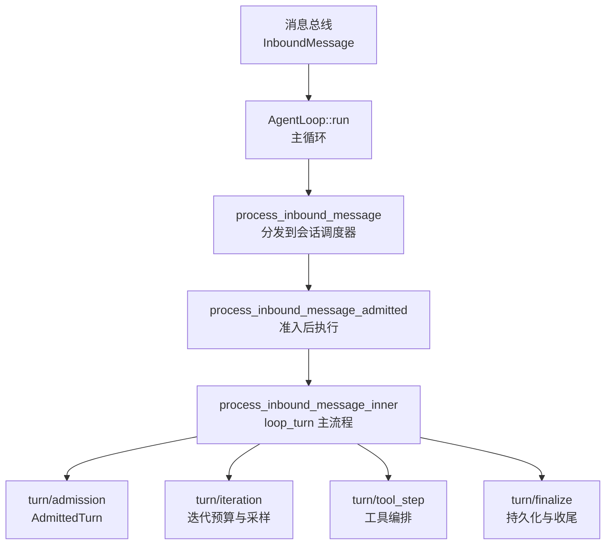
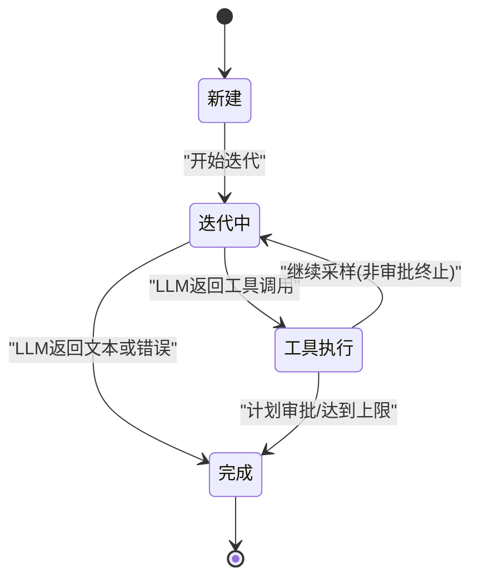
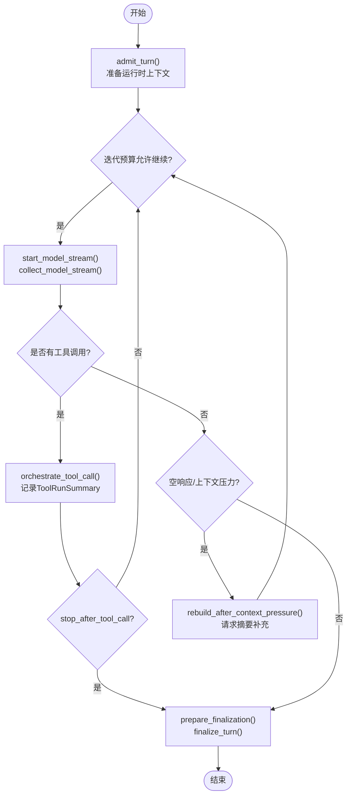
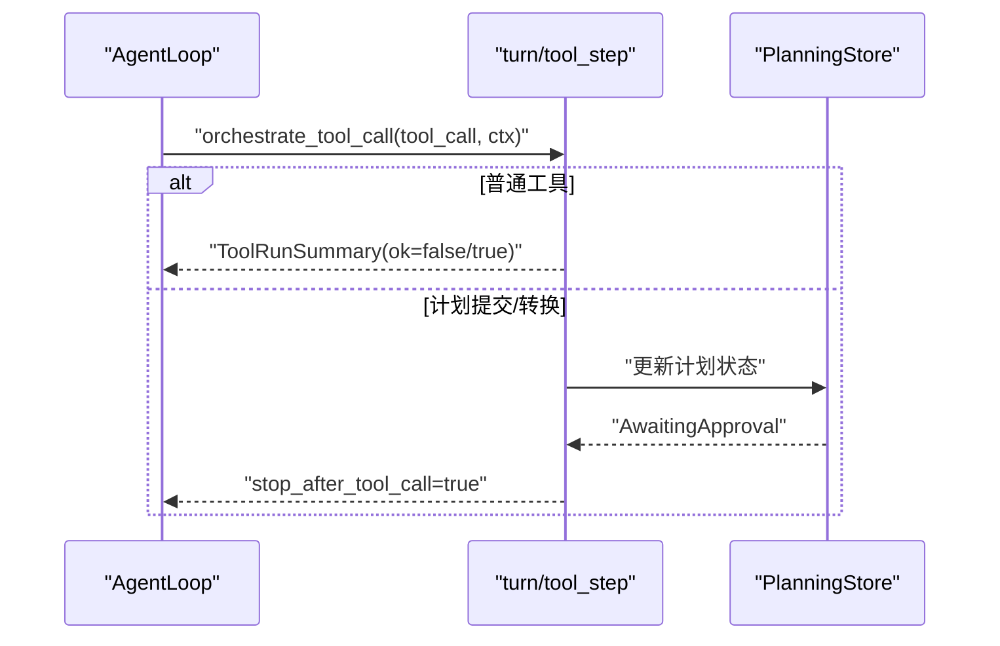
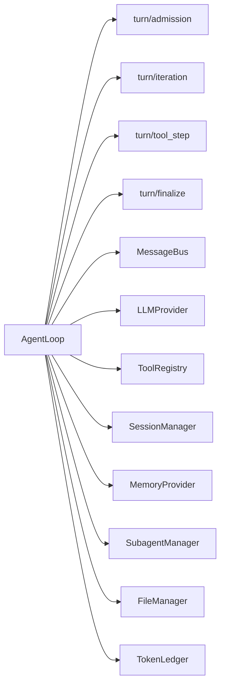

# 轮次管理

<cite>
**本文引用的文件**
- [agent_loop.rs](file://agent-diva-agent/src/agent_loop.rs)
- [loop_turn.rs](file://agent-diva-agent/src/agent_loop/loop_turn.rs)
- [turn/admission.rs](file://agent-diva-agent/src/agent_loop/turn/admission.rs)
- [turn/iteration.rs](file://agent-diva-agent/src/agent_loop/turn/iteration.rs)
- [turn/tool_step.rs](file://agent-diva-agent/src/agent_loop/turn/tool_step.rs)
- [turn/finalize.rs](file://agent-diva-agent/src/agent_loop/turn/finalize.rs)
</cite>

## 目录
1. [简介](#简介)
2. [项目结构](#项目结构)
3. [核心组件](#核心组件)
4. [架构总览](#架构总览)
5. [详细组件分析](#详细组件分析)
6. [依赖关系分析](#依赖关系分析)
7. [性能与资源约束](#性能与资源约束)
8. [故障排查指南](#故障排查指南)
9. [结论](#结论)
10. [附录](#附录)

## 简介
本文件围绕“轮次（Turn）”的概念与实现进行系统化说明，聚焦智能体循环中一次用户请求到最终响应的完整生命周期。内容涵盖：
- Turn 的定义、状态机与生命周期阶段
- loop_turn 模块的创建、执行、完成流程
- 工具调用编排、空响应处理、计划审批边界
- 资源管理机制：会话级令牌预算、上下文窗口压力、超时控制、取消机制
- 状态转换图与关键时序图，帮助理解不同阶段的流转条件与触发事件

## 项目结构
Agent Diva 的轮次管理位于 agent-diva-agent 包内，核心入口为 AgentLoop，具体轮次处理逻辑集中在 agent_loop 子模块：
- agent_loop.rs：定义 AgentLoop 结构体、消息调度、运行主循环、入站消息处理入口
- agent_loop/loop_turn.rs：单条入站消息的完整轮次处理（创建、迭代、工具编排、收尾）
- agent_loop/turn/*：将轮次拆分为 admission（准入）、iteration（迭代）、tool_step（工具步骤）、finalize（收尾）等子模块



图表来源
- [agent_loop.rs:867-930](file://agent-diva-agent/src/agent_loop.rs#L867-L930)
- [agent_loop.rs:954-1033](file://agent-diva-agent/src/agent_loop.rs#L954-L1033)
- [loop_turn.rs:312-757](file://agent-diva-agent/src/agent_loop/loop_turn.rs#L312-L757)

章节来源
- [agent_loop.rs:111-158](file://agent-diva-agent/src/agent_loop.rs#L111-L158)
- [agent_loop.rs:867-930](file://agent-diva-agent/src/agent_loop.rs#L867-L930)
- [agent_loop.rs:954-1033](file://agent-diva-agent/src/agent_loop.rs#L954-L1033)

## 核心组件
- AgentLoop：智能体循环的核心，负责消息接收、会话调度、工具装配、模型调用、事件发布、资源限制与清理。
- turn 子模块：
  - admission：对入站消息进行准入校验，产出 AdmittedTurn（包含 mask、模型、模式、执行上下文快照等）。
  - iteration：管理每轮迭代的预算、是否摘要-only 模式、上下文窗口压力检测与回退策略。
  - tool_step：工具编排上下文与执行汇总，支持停止标记（如计划审批）。
  - finalize：将本轮结果持久化到会话、生成会话标题、清理临时状态。
- loop_turn：串联上述模块，实现从消息接收到最终输出的完整流程。

章节来源
- [agent_loop.rs:111-158](file://agent-diva-agent/src/agent_loop.rs#L111-L158)
- [loop_turn.rs:312-757](file://agent-diva-agent/src/agent_loop/loop_turn.rs#L312-L757)
- [turn/admission.rs](file://agent-diva-agent/src/agent_loop/turn/admission.rs)
- [turn/iteration.rs](file://agent-diva-agent/src/agent_loop/turn/iteration.rs)
- [turn/tool_step.rs](file://agent-diva-agent/src/agent_loop/turn/tool_step.rs)
- [turn/finalize.rs](file://agent-diva-agent/src/agent_loop/turn/finalize.rs)

## 架构总览
下图展示了单次轮次的端到端流程：消息进入、准入、迭代采样、工具调用、计划审批边界、最终输出与持久化。

```mermaid
sequenceDiagram
participant Bus as "消息总线"
participant Loop as "AgentLoop"
participant Adm as "turn/admission"
participant Iter as "turn/iteration"
participant Tool as "turn/tool_step"
participant Fin as "turn/finalize"
Bus->>Loop : "InboundMessage"
Loop->>Adm : "admit_turn()"
Adm-->>Loop : "AdmittedTurn"
Loop->>Iter : "begin_pass()/can_continue()"
loop 最多 max_iterations 次
Iter->>Loop : "start_model_stream()"
Loop-->>Iter : "ModelStream"
Iter->>Tool : "orchestrate_tool_call() (可选)"
alt 需要工具
Tool-->>Iter : "ToolRunSummary / stop_after_tool_call"
else 无工具或工具结束
Iter-->>Loop : "IterationOutcome"
end
end
Loop->>Fin : "prepare_finalization() + finalize_turn()"
Fin-->>Bus : "OutboundMessage / 事件"
```

图表来源
- [agent_loop.rs:954-1033](file://agent-diva-agent/src/agent_loop.rs#L954-L1033)
- [loop_turn.rs:312-757](file://agent-diva-agent/src/agent_loop/loop_turn.rs#L312-L757)

## 详细组件分析

### 轮次状态机与生命周期
轮次在 loop_turn 中以“迭代”为单位推进，状态可抽象为：
- 新建：收到 InboundMessage，准备运行时上下文
- 迭代中：调用模型流式响应，判断意图（工具调用或文本回复）
- 工具执行：编排工具，可能触发计划审批导致终止
- 摘要补充：当工具耗尽但无文本时，允许一次仅摘要的补充迭代
- 完成：合成最终内容，持久化会话，释放资源



图表来源
- [loop_turn.rs:376-757](file://agent-diva-agent/src/agent_loop/loop_turn.rs#L376-L757)

章节来源
- [loop_turn.rs:376-757](file://agent-diva-agent/src/agent_loop/loop_turn.rs#L376-L757)

### loop_turn 主流程：创建、执行、完成
- 创建：
  - 通过 admit_turn 获取 AdmittedTurn（mask、模型、模式、执行上下文快照等）
  - 构建运行时上下文（消息、动态段落、稳定前缀、当前轮次消息）
- 执行：
  - 使用 IterationBudget 控制最大迭代次数与摘要-only 补充
  - start_model_stream 发起模型流式调用，collect_model_stream 收集响应
  - 若含工具调用，进入 orchestrate_tool_call；否则直接得到文本回复
  - 空响应分类与上下文压力回退（rebuild_after_context_pressure）
- 完成：
  - prepare_finalization 准备收尾数据
  - finalize_turn 持久化会话、生成会话标题、清理活动状态



图表来源
- [loop_turn.rs:312-757](file://agent-diva-agent/src/agent_loop/loop_turn.rs#L312-L757)

章节来源
- [loop_turn.rs:312-757](file://agent-diva-agent/src/agent_loop/loop_turn.rs#L312-L757)

### 工具编排与计划审批边界
- 工具编排上下文 ToolOrchestrationContext 携带消息、事件通道、会话键、trace_id、迭代索引、计划模式、活跃执行ID、背景任务上下文等
- 每次工具调用返回 ToolRunSummary，并可能设置 stop_after_tool_call=true（例如 plan_submit/plan_transition 进入等待审批）
- 遇到审批边界时，不再在同一轮次继续调用工具，避免被拒绝后立即重试



图表来源
- [loop_turn.rs:595-634](file://agent-diva-agent/src/agent_loop/loop_turn.rs#L595-L634)
- [turn/tool_step.rs](file://agent-diva-agent/src/agent_loop/turn/tool_step.rs)

章节来源
- [loop_turn.rs:595-634](file://agent-diva-agent/src/agent_loop/loop_turn.rs#L595-L634)

### 空响应与上下文压力处理
- classify_empty_followup 根据 finish_reason、token 用量、上下文窗口估算、是否已执行工具等信号，判断是否需要摘要补充或上下文重建
- 输入压力过大时，调用 rebuild_after_context_pressure 压缩上下文后再请求摘要
- 若仍为空，则合成中文提示（已完成但未生成可读回复），或在计划审批场景下提示审批卡片

章节来源
- [loop_turn.rs:644-713](file://agent-diva-agent/src/agent_loop/loop_turn.rs#L644-L713)

### 会话标题与令牌使用记录
- 会话标题：
  - fallback_session_title：取首条用户消息前若干字符作为备用标题
  - generate_session_title_with_llm：用 LLM 生成更合适的标题
  - should_generate_session_title：避免重复生成
- 令牌使用：
  - append_session_token_usage：将本次迭代的 prompt/completion/total tokens 写入 JsonlTokenLedger
  - enforce_session_token_budget：按会话键检查令牌预算

章节来源
- [loop_turn.rs:79-112](file://agent-diva-agent/src/agent_loop/loop_turn.rs#L79-L112)
- [loop_turn.rs:242-310](file://agent-diva-agent/src/agent_loop/loop_turn.rs#L242-L310)

### 附件与多模态输入
- load_attachment_contents：读取附件，文本小文件内联，图片转为 data URI，大文件或二进制文件以占位符提示使用 read_file 工具
- build_current_turn_message：组合文本与图片部分形成当前轮次消息

章节来源
- [loop_turn.rs:759-869](file://agent-diva-agent/src/agent_loop/loop_turn.rs#L759-L869)
- [loop_turn.rs:118-134](file://agent-diva-agent/src/agent_loop/loop_turn.rs#L118-L134)

### 会话持久化与收尾
- save_turn：保存触发消息、助手与工具消息、最终助手回复，并附加 token usage
- finalize_turn：结合 prepare_finalization 的结果，完成会话持久化、标题生成、清理活动状态

章节来源
- [loop_turn.rs:872-965](file://agent-diva-agent/src/agent_loop/loop_turn.rs#L872-L965)
- [turn/finalize.rs](file://agent-diva-agent/src/agent_loop/turn/finalize.rs)

## 依赖关系分析
- AgentLoop 依赖：
  - MessageBus：事件发布与消息收发
  - LLMProvider：模型流式调用
  - ToolRegistry：工具注册与执行
  - SessionManager：会话消息存储
  - MemoryProvider：记忆预取、同步、折叠
  - SubagentManager：子代理任务
  - FileManager：附件读写
  - TokenLedger：令牌使用记账
- turn 子模块之间：
  - admission 产出 AdmittedTurn 供 loop_turn 使用
  - iteration 提供迭代预算与空响应分类
  - tool_step 提供工具编排与汇总
  - finalize 负责收尾与持久化



图表来源
- [agent_loop.rs:111-158](file://agent-diva-agent/src/agent_loop.rs#L111-L158)
- [loop_turn.rs:312-757](file://agent-diva-agent/src/agent_loop/loop_turn.rs#L312-L757)

章节来源
- [agent_loop.rs:111-158](file://agent-diva-agent/src/agent_loop.rs#L111-L158)
- [loop_turn.rs:312-757](file://agent-diva-agent/src/agent_loop/loop_turn.rs#L312-L757)

## 性能与资源约束
- 迭代预算：max_iterations 限制最大迭代次数；summary_only 仅在工具耗尽后授予一次补充
- 上下文窗口：detect context overflow 并触发 compact/rebuild，避免请求过长
- 令牌预算：enforce_session_token_budget 按会话键限制；append_session_token_usage 记录使用量
- 超时控制：ToolConfig.global_timeout_secs 与 exec_timeout 控制工具执行超时
- 取消机制：active_turn_cancellation 支持当前轮次取消；session_dispatcher 管理并发与空闲回收
- 内存与附件：文本附件内联大小限制（MAX_INLINE_ATTACHMENT_SIZE），图片以 base64 传输

章节来源
- [agent_loop.rs:55-88](file://agent-diva-agent/src/agent_loop.rs#L55-L88)
- [agent_loop.rs:477-564](file://agent-diva-agent/src/agent_loop.rs#L477-L564)
- [loop_turn.rs:376-757](file://agent-diva-agent/src/agent_loop/loop_turn.rs#L376-L757)
- [loop_turn.rs:759-869](file://agent-diva-agent/src/agent_loop/loop_turn.rs#L759-L869)

## 故障排查指南
- 上下文溢出：is_context_overflow_error 匹配多种 provider 的错误模式，触发上下文重建
- 空响应：classify_empty_followup 识别空响应原因，必要时请求摘要补充
- 计划审批：stopped_for_plan_approval 时合成中文提示，引导用户审批
- 令牌超限：enforce_session_token_budget 抛出错误，需调整预算或压缩上下文
- 工具失败：ToolRunSummary 中的 ok/detail 字段用于合成最终总结
- 附件读取失败：load_attachment_contents 记录警告并降级为占位符

章节来源
- [loop_turn.rs:644-713](file://agent-diva-agent/src/agent_loop/loop_turn.rs#L644-L713)
- [loop_turn.rs:1030-1046](file://agent-diva-agent/src/agent_loop/loop_turn.rs#L1030-L1046)
- [loop_turn.rs:1080-1114](file://agent-diva-agent/src/agent_loop/loop_turn.rs#L1080-L1114)
- [loop_turn.rs:759-869](file://agent-diva-agent/src/agent_loop/loop_turn.rs#L759-L869)

## 结论
轮次管理以 AgentLoop 为核心，通过 turn 子模块将复杂流程解耦为清晰的阶段：准入、迭代、工具编排、收尾。该设计在保证可控性（迭代预算、上下文压力、令牌预算、超时与取消）的同时，提供了良好的可扩展性与可观测性（事件、日志、令牌记账）。对于计划类任务，明确的审批边界避免了不当的重试与冲突。整体架构适合长对话、多工具协作与复杂业务场景。

## 附录
- 关键函数路径参考：
  - process_inbound_message_inner：[loop_turn.rs:312-757](file://agent-diva-agent/src/agent_loop/loop_turn.rs#L312-L757)
  - orchestrate_tool_call：[loop_turn.rs:595-634](file://agent-diva-agent/src/agent_loop/loop_turn.rs#L595-L634)
  - classify_empty_followup：[turn/iteration.rs](file://agent-diva-agent/src/agent_loop/turn/iteration.rs)
  - save_turn：[loop_turn.rs:872-965](file://agent-diva-agent/src/agent_loop/loop_turn.rs#L872-L965)
  - enforce_session_token_budget：[loop_turn.rs:277-285](file://agent-diva-agent/src/agent_loop/loop_turn.rs#L277-L285)
  - append_session_token_usage：[loop_turn.rs:287-310](file://agent-diva-agent/src/agent_loop/loop_turn.rs#L287-L310)
  - load_attachment_contents：[loop_turn.rs:759-869](file://agent-diva-agent/src/agent_loop/loop_turn.rs#L759-L869)